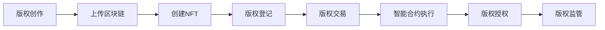

                 

关键词：区块链、版权保护、智能合约、非同质化代币、分布式账本

> 摘要：本文旨在探讨区块链技术在版权保护中的应用，分析其核心概念、算法原理、数学模型以及项目实践。通过详细解读区块链在版权保护中的实际应用场景，本文将展望其未来发展趋势与面临的挑战，并推荐相关的学习资源和开发工具。

## 1. 背景介绍

版权保护是当今数字化时代的一项重要任务。随着互联网和数字技术的发展，作品创作和传播的速度和范围空前扩大，但同时也带来了版权侵权的问题。传统的版权保护方式往往依赖于中心化的数据库和管理系统，存在易受攻击、透明度不足、成本高昂等缺点。区块链技术的出现为版权保护提供了一种全新的解决方案，其分布式账本、透明性、不可篡改性等特点使其成为版权保护的理想选择。

## 2. 核心概念与联系

### 2.1 区块链技术概述

区块链是一种分布式账本技术，通过加密算法和共识机制实现数据的存储和传输。区块链的主要特点包括：

- **去中心化**：区块链不需要中心化的第三方机构进行数据存储和管理，所有节点共同维护数据一致性。
- **不可篡改**：区块链的数据一旦写入，便无法篡改，保证了数据的真实性和完整性。
- **透明性**：区块链上的数据对所有参与者可见，提高了系统的透明度和可信度。

### 2.2 核心概念原理和架构

区块链在版权保护中的应用主要包括以下几个方面：

- **智能合约**：智能合约是一种自动执行的合同，基于区块链技术实现。在版权交易和授权过程中，智能合约可以自动执行合约条款，降低纠纷风险。
- **非同质化代币（NFT）**：NFT是一种代表数字资产所有权的唯一代币，可以用于版权证明、数字资产交易等。
- **分布式账本**：分布式账本记录了版权的交易和授权信息，保证了版权流转的透明度和可追溯性。

### 2.3 Mermaid 流程图

下面是一个简单的 Mermaid 流程图，展示了区块链在版权保护中的应用流程：



## 3. 核心算法原理 & 具体操作步骤

### 3.1 算法原理概述

区块链在版权保护中的核心算法主要包括加密算法、共识机制和智能合约。

- **加密算法**：用于保证数据的安全性和隐私性，常见的加密算法有SHA-256、RSA等。
- **共识机制**：用于维护区块链数据的一致性和安全性，常见的共识机制有工作量证明（PoW）、权益证明（PoS）等。
- **智能合约**：用于实现版权交易、授权等自动化操作，常见的编程语言有Solidity等。

### 3.2 算法步骤详解

#### 3.2.1 加密算法

1. 作者创作数字作品。
2. 对作品进行哈希处理，生成唯一的哈希值。
3. 将哈希值和作者信息存储在区块链上。

#### 3.2.2 共识机制

1. 区块链网络中的节点共同参与共识过程。
2. 节点根据共识机制达成一致，确认交易的有效性。
3. 将确认后的交易记录写入区块链。

#### 3.2.3 智能合约

1. 作者创建智能合约，定义版权交易的规则。
2. 智能合约部署到区块链上。
3. 买家发起版权购买交易。
4. 智能合约自动执行交易，更新版权信息。

### 3.3 算法优缺点

#### 3.3.1 优点

- **去中心化**：去中心化结构降低了系统风险，提高了数据的安全性和透明度。
- **不可篡改**：区块链数据一旦写入，无法篡改，保证了版权信息的真实性和完整性。
- **自动化**：智能合约实现了版权交易和授权的自动化，降低了纠纷风险。

#### 3.3.2 缺点

- **计算资源消耗**：共识机制需要大量计算资源，可能导致网络拥堵。
- **法律问题**：区块链在版权保护中的应用仍需解决相关的法律问题，如版权认定等。

### 3.4 算法应用领域

区块链技术在版权保护中的应用非常广泛，主要包括以下领域：

- **数字艺术品**：艺术家可以通过区块链技术证明数字艺术品的版权，实现数字艺术品的交易和授权。
- **音乐版权**：音乐制作人可以通过区块链技术实现音乐的版权登记、交易和授权，降低侵权风险。
- **影视版权**：电影制片公司可以通过区块链技术实现影视作品的版权保护，提高版权管理的效率。

## 4. 数学模型和公式 & 详细讲解 & 举例说明

### 4.1 数学模型构建

在版权保护中，常用的数学模型包括哈希函数、密码学和博弈论等。

#### 4.1.1 哈希函数

哈希函数是将输入数据转换为固定长度的字符串的函数，常见哈希函数有SHA-256等。哈希函数的特点是单向性、压缩性和抗冲突性。

#### 4.1.2 密码学

密码学用于保证数据的安全性和隐私性，常见的密码学算法有RSA、AES等。

#### 4.1.3 博弈论

博弈论用于分析版权交易和授权过程中的策略行为，常见博弈模型有纳什均衡、合作博弈等。

### 4.2 公式推导过程

#### 4.2.1 哈希函数

$$
H_{256}(x) = \text{SHA-256}(x)
$$

其中，$x$为输入数据，$H_{256}(x)$为SHA-256哈希值。

#### 4.2.2 密码学

$$
E_{RSA}(m) = C \quad \text{where} \quad C = m^e \mod n
$$

其中，$m$为明文，$e$为公钥指数，$n$为模数，$C$为密文。

#### 4.2.3 博弈论

$$
u(x, y) = \frac{1}{2}(x + y - |x - y|)
$$

其中，$x$和$y$为参与者的收益，$u(x, y)$为合作博弈的纳什均衡。

### 4.3 案例分析与讲解

假设一位艺术家创作了一幅数字画作，并将其上传到区块链上。使用SHA-256哈希函数生成画作的唯一哈希值，并将其存储在区块链上。同时，艺术家使用RSA加密算法将个人身份信息加密，并与哈希值一起存储在区块链上。通过这种方式，艺术家成功证明了画作的所有权。

在后续的版权交易过程中，买家可以通过查询区块链上的信息，验证画作的真实性和合法性。当买家购买画作后，智能合约将自动执行版权转让操作，更新区块链上的版权信息，确保交易的合法性和透明度。

## 5. 项目实践：代码实例和详细解释说明

### 5.1 开发环境搭建

搭建区块链版权保护项目需要以下环境：

- **Node.js**：用于构建智能合约和后端服务。
- **Truffle**：用于部署和管理智能合约。
- **MetaMask**：用于与区块链交互。
- **Hardhat**：用于本地部署和调试智能合约。

### 5.2 源代码详细实现

下面是一个简单的智能合约示例，用于实现版权登记和交易：

```solidity
// SPDX-License-Identifier: MIT
pragma solidity ^0.8.0;

contract Copyright {
    mapping(bytes32 => address) public owner;
    mapping(bytes32 => uint256) public registrationTime;

    event CopyrightRegistered(bytes32 hash, address owner, uint256 time);
    event CopyrightTransferred(bytes32 hash, address from, address to, uint256 time);

    function registerCopyright(bytes32 hash) public {
        require(owner[hash] == address(0), "Copyright already registered");
        owner[hash] = msg.sender;
        registrationTime[hash] = block.timestamp;
        emit CopyrightRegistered(hash, msg.sender, block.timestamp);
    }

    function transferCopyright(bytes32 hash, address to) public {
        require(owner[hash] == msg.sender, "Not the owner");
        address from = owner[hash];
        owner[hash] = to;
        emit CopyrightTransferred(hash, from, to, block.timestamp);
    }
}
```

### 5.3 代码解读与分析

- **合约结构**：该合约包括一个映射（mapping）结构，用于存储版权的所有权和注册时间。事件（event）用于记录版权的登记和转让操作。
- **registerCopyright**：该函数用于注册版权，只有当版权未被注册时，才能调用此函数。注册成功后，版权所有权和注册时间将被记录在区块链上。
- **transferCopyright**：该函数用于转让版权，只有版权所有者才能调用此函数。转让成功后，版权所有权将被更新，并记录在区块链上。

### 5.4 运行结果展示

通过Truffle和MetaMask，可以部署和测试该智能合约。以下是一个简单的部署和测试过程：

1. **部署合约**：使用Truffle部署合约，并获得合约地址。
2. **注册版权**：通过MetaMask发送交易，调用`registerCopyright`函数，注册一幅数字画作。
3. **查询版权信息**：通过区块链浏览器查询合约地址，查看已注册的版权信息。
4. **转让版权**：通过MetaMask发送交易，调用`transferCopyright`函数，将版权转让给另一个地址。

## 6. 实际应用场景

区块链在版权保护中的应用已经取得了显著的成果。以下是一些实际应用场景：

- **数字艺术品**：著名艺术家Beeple的数字画作《Everydays: The First 5000 Days》在NFT市场以6900万美元的价格成交，展示了区块链在数字艺术品版权保护中的应用潜力。
- **音乐版权**：著名歌手Adele的歌曲《Easy On Me》在区块链平台上发行，实现了音乐的版权保护、交易和授权。
- **影视版权**：电影《无忧之地》在区块链平台上进行版权登记，提高了版权管理的透明度和效率。

## 7. 未来应用展望

随着区块链技术的不断发展，其在版权保护中的应用前景将更加广阔。以下是一些未来应用展望：

- **版权追溯**：区块链技术可以实现作品的完整追溯，确保版权的合法性。
- **版权交易**：区块链技术可以降低版权交易的成本，提高交易的效率。
- **版权保护**：区块链技术可以提供更安全、更可靠的版权保护机制。

## 8. 工具和资源推荐

### 8.1 学习资源推荐

- **《区块链技术指南》**：一本全面介绍区块链技术的经典著作，适合初学者和进阶者阅读。
- **《精通区块链开发》**：一本深入讲解区块链开发技术的专业书籍，适合有一定编程基础的学习者。

### 8.2 开发工具推荐

- **Truffle**：一款强大的区块链开发框架，提供智能合约编写、部署和测试等功能。
- **Hardhat**：一款本地化区块链开发工具，提供智能合约的本地部署和调试功能。

### 8.3 相关论文推荐

- **"Blockchain and Intellectual Property Protection: A Comprehensive Review"**：一篇关于区块链在版权保护中的综述论文。
- **"Non-Fungible Tokens for Intellectual Property Management"**：一篇关于NFT在版权管理中的应用研究论文。

## 9. 总结：未来发展趋势与挑战

区块链技术在版权保护中具有巨大的潜力，但仍面临一些挑战。未来发展趋势包括：

- **完善法律体系**：完善相关法律法规，为区块链在版权保护中的应用提供法律保障。
- **提升技术性能**：优化区块链技术，提高处理速度和降低成本，以满足大规模应用的需求。

作者：禅与计算机程序设计艺术 / Zen and the Art of Computer Programming
----------------------------------------------------------------

### 结束语

本文探讨了区块链在版权保护中的应用，分析了其核心概念、算法原理、数学模型以及项目实践。通过实际应用场景和未来展望，本文展示了区块链技术在版权保护中的巨大潜力。然而，区块链在版权保护中的应用仍需解决法律、技术等方面的挑战。未来，随着区块链技术的不断发展和完善，我们有理由相信，其在版权保护领域的应用将更加广泛和深入。希望本文能为读者提供有价值的参考和启示。

