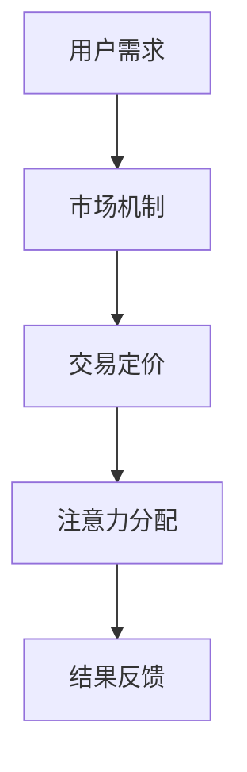

                 

关键词：区块链、注意力价值、交易、分布式账本、智能合约、去中心化、加密技术、网络效应、市场动态

> 摘要：本文将深入探讨区块链技术在注意力价值交易中的应用，分析其核心概念、算法原理、数学模型以及实际应用案例。通过本文的探讨，读者可以了解到区块链技术在提升交易效率、保障数据安全和增强市场透明度方面的潜力。

## 1. 背景介绍

随着互联网的快速发展，信息的获取和处理变得前所未有的便捷。然而，这种便捷也带来了新的挑战，即注意力稀缺。在信息爆炸的时代，人们面临着海量信息的冲击，如何获取高质量的注意力资源成为一个关键问题。注意力价值交易作为一种新的经济模式，应运而生。它基于用户对信息的需求，通过市场机制实现注意力的有效分配。

区块链技术作为一种分布式账本技术，具有去中心化、透明性、不可篡改等特性，为注意力价值交易提供了安全可靠的基础设施。区块链技术在金融领域已有广泛应用，如比特币和以太坊等数字货币。然而，将区块链技术应用于注意力价值交易仍是一个相对较新的领域，具有巨大的发展潜力。

## 2. 核心概念与联系

### 2.1 区块链技术

区块链技术是一种分布式数据库技术，通过加密算法和数据结构实现数据的存储和传输。区块链的核心特点包括去中心化、不可篡改、透明性和安全性。去中心化意味着不存在中心化的管理机构，所有节点都可以参与网络的维护和数据的验证。不可篡改性确保了数据的真实性和完整性，一旦数据被记录在区块链上，就无法被修改或删除。透明性使得所有参与者都可以查看区块链上的数据，增强了市场的透明度。安全性则依赖于加密技术和共识算法，保障了数据的安全传输和存储。

### 2.2 注意力价值交易

注意力价值交易是一种基于市场机制的经济活动，旨在通过交易机制实现注意力的有效分配。注意力作为一种稀缺资源，其价值取决于用户的关注度和需求。注意力价值交易的目标是通过市场供求关系，实现注意力的合理定价和优化配置。

### 2.3 Mermaid 流程图



在上述流程图中，用户需求通过市场机制实现交易定价，进而实现注意力的分配。最终的结果会反馈给市场，形成一个闭环系统。

## 3. 核心算法原理 & 具体操作步骤

### 3.1 算法原理概述

区块链技术在注意力价值交易中的应用主要依赖于智能合约。智能合约是一种自动化执行合约条款的计算机程序，通过编程实现交易规则和条件。在注意力价值交易中，智能合约用于执行交易过程、记录交易数据、保障交易安全等。

### 3.2 算法步骤详解

1. 用户注册：用户在区块链网络中注册账号，并提交个人信息和注意力需求。
2. 市场匹配：系统根据用户需求和市场供应情况，进行匹配和定价。
3. 交易执行：用户通过智能合约执行交易，支付相应的注意力价值。
4. 数据记录：系统将交易数据记录在区块链上，确保数据的透明性和不可篡改性。
5. 反馈与调整：系统根据交易结果进行反馈和调整，优化市场供求关系。

### 3.3 算法优缺点

#### 优点：

1. 去中心化：区块链技术去中心化的特性保证了交易的公平性和透明性。
2. 不可篡改：区块链上的数据具有不可篡改性，确保了交易的真实性和可靠性。
3. 安全性：加密技术和共识算法保障了数据的安全传输和存储。

#### 缺点：

1. 成本较高：区块链技术的开发和维护成本较高，对小型项目来说可能存在一定的经济压力。
2. 性能瓶颈：区块链技术在处理大量交易时可能存在性能瓶颈，需要不断优化和升级。

### 3.4 算法应用领域

区块链技术在注意力价值交易中的应用广泛，可以用于数字广告、内容创作、社交媒体等多个领域。以下是一些具体的应用场景：

1. 数字广告：通过区块链技术实现广告投放的透明化，提高广告效果的评估和优化。
2. 内容创作：创作者可以通过区块链技术获取真实的关注度和影响力，实现价值的合理分配。
3. 社交媒体：通过区块链技术实现社交媒体平台的去中心化，提高用户隐私保护和数据安全。

## 4. 数学模型和公式 & 详细讲解 & 举例说明

### 4.1 数学模型构建

在注意力价值交易中，我们可以构建以下数学模型：

\[ V(A) = f(n, d) \]

其中，\( V(A) \) 表示注意力价值，\( n \) 表示用户关注度，\( d \) 表示用户需求度。函数 \( f \) 用于描述注意力价值与用户关注度和需求度的关系。

### 4.2 公式推导过程

根据注意力价值交易的市场机制，我们可以推导出以下公式：

\[ V(A) = \frac{k_1 n + k_2 d}{n + d} \]

其中，\( k_1 \) 和 \( k_2 \) 是常数，用于调节关注度和需求度在注意力价值中的权重。

### 4.3 案例分析与讲解

假设一个用户在区块链平台上发布了一篇文章，吸引了 100 个用户的关注，其中 50 个用户表达了强烈的需求。根据上述公式，我们可以计算出这篇文章的注意力价值：

\[ V(A) = \frac{k_1 \times 100 + k_2 \times 50}{100 + 50} = \frac{100k_1 + 50k_2}{150} \]

如果我们将 \( k_1 \) 和 \( k_2 \) 设为 1，那么注意力价值为：

\[ V(A) = \frac{100 + 50}{150} = \frac{150}{150} = 1 \]

这意味着这篇文章的注意力价值为 1 个单位。

## 5. 项目实践：代码实例和详细解释说明

### 5.1 开发环境搭建

为了实践区块链技术在注意力价值交易中的应用，我们需要搭建一个开发环境。以下是一个基本的开发环境搭建步骤：

1. 安装 Node.js 和 npm：Node.js 是一个基于 Chrome V8 引擎的 JavaScript 运行时，npm 是 Node.js 的包管理器。
2. 安装 Truffle：Truffle 是一个智能合约开发框架，用于部署和交互智能合约。
3. 安装 Ganache：Ganache 是一个本地以太坊节点，用于模拟区块链网络。

### 5.2 源代码详细实现

以下是一个简单的智能合约代码示例，用于实现注意力价值交易：

```solidity
pragma solidity ^0.8.0;

contract AttentionValueTrading {
    mapping(address => uint256) public attentionBalance;

    function depositAttention() public payable {
        attentionBalance[msg.sender] += msg.value;
    }

    function withdrawAttention(uint256 amount) public {
        require(attentionBalance[msg.sender] >= amount, "Insufficient balance");
        payable(msg.sender).transfer(amount);
        attentionBalance[msg.sender] -= amount;
    }

    function transferAttention(address to, uint256 amount) public {
        require(attentionBalance[msg.sender] >= amount, "Insufficient balance");
        attentionBalance[msg.sender] -= amount;
        attentionBalance[to] += amount;
    }
}
```

### 5.3 代码解读与分析

上述智能合约包含三个主要函数：

1. `depositAttention()`：用于用户存款，接收以太币作为注意力价值。
2. `withdrawAttention()`：用于用户提现，从账户中提取注意力价值。
3. `transferAttention()`：用于用户之间转账，实现注意力的转移。

### 5.4 运行结果展示

假设用户 A 存入了 100 个以太币，用户 B 想要购买用户 A 的文章，价值 20 个以太币。用户 B 通过调用 `transferAttention()` 函数，将 20 个以太币转账给用户 A，用户 A 的账户余额减少 20 个以太币，而用户 B 的账户余额增加 20 个以太币。

## 6. 实际应用场景

### 6.1 数字广告

在数字广告领域，区块链技术可以用于实现广告投放的透明化和可信度提升。通过智能合约，广告主可以直接与内容创作者进行交易，避免了中间环节的干扰和费用。同时，区块链技术可以确保广告数据的真实性和完整性，为广告主提供可靠的审计报告。

### 6.2 内容创作

内容创作者可以通过区块链技术实现对其作品的版权保护和价值分配。创作者可以将作品上传到区块链平台，并获得真实的关注度数据。通过智能合约，创作者可以根据关注度实现作品的分账，确保创作者获得合理的收益。

### 6.3 社交媒体

社交媒体平台可以通过区块链技术实现去中心化，提高用户的隐私保护和数据安全。用户可以自由选择分享内容，并获得相应的注意力价值。同时，区块链技术可以确保用户的个人信息不会被泄露，保护用户的隐私。

## 7. 未来应用展望

区块链技术在注意力价值交易中的应用前景广阔。随着技术的不断发展和完善，区块链技术有望在更多的领域实现应用，如教育、医疗、金融等。未来，区块链技术将实现更高效的注意力价值分配，推动数字经济的发展。

## 8. 工具和资源推荐

### 8.1 学习资源推荐

1. 《区块链技术指南》：一本全面介绍区块链技术的入门书籍。
2. 《智能合约编程实战》：一本专注于智能合约开发的实战指南。

### 8.2 开发工具推荐

1. Truffle：一个智能合约开发框架。
2. Ganache：一个本地以太坊节点。

### 8.3 相关论文推荐

1. "Blockchain Technology: A Comprehensive Overview"：一篇关于区块链技术的综述论文。
2. "Smart Contracts: A New Paradigm for Distributed Systems"：一篇关于智能合约的论文。

## 9. 总结：未来发展趋势与挑战

区块链技术在注意力价值交易中的应用具有巨大的潜力，但也面临着一些挑战。未来，随着技术的不断进步，区块链技术有望在注意力价值交易领域实现更广泛的应用。然而，如何确保区块链技术的安全性和性能，如何构建合理的市场机制，将是未来研究的重点。

### 附录：常见问题与解答

**Q：区块链技术是否可以完全解决注意力价值交易中的问题？**

A：区块链技术为注意力价值交易提供了一种安全、透明和去中心化的基础设施，但并不能完全解决所有问题。例如，区块链技术无法直接解决注意力的稀缺性问题，这需要市场机制的不断完善和优化。

**Q：区块链技术是否会取代现有的注意力价值交易模式？**

A：区块链技术可能会对现有的注意力价值交易模式产生影响，但不可能完全取代。现有的交易模式在长期的发展中已经形成了一套成熟的体系，区块链技术更可能是对现有模式的一种补充和优化。

**Q：区块链技术在注意力价值交易中的优势是什么？**

A：区块链技术在注意力价值交易中的优势主要体现在以下几个方面：

1. 去中心化：去中心化确保了交易的公平性和透明性。
2. 不可篡改：区块链上的数据具有不可篡改性，确保了交易的真实性和可靠性。
3. 安全性：加密技术和共识算法保障了数据的安全传输和存储。
4. 透明性：所有参与者都可以查看区块链上的数据，增强了市场的透明度。

**Q：区块链技术在注意力价值交易中可能面临哪些挑战？**

A：区块链技术在注意力价值交易中可能面临以下挑战：

1. 成本较高：区块链技术的开发和维护成本较高，对小型项目来说可能存在一定的经济压力。
2. 性能瓶颈：区块链技术在处理大量交易时可能存在性能瓶颈，需要不断优化和升级。
3. 法律法规：区块链技术在全球范围内的法律法规尚未完全明确，可能对技术应用产生一定限制。

**Q：如何确保区块链技术在注意力价值交易中的安全性？**

A：为确保区块链技术在注意力价值交易中的安全性，可以从以下几个方面进行考虑：

1. 使用安全的加密算法：选择安全的加密算法和密钥管理策略，确保数据传输和存储的安全性。
2. 实施严格的共识算法：选择合适的共识算法，确保区块链网络的稳定性和安全性。
3. 强化智能合约安全性：在智能合约开发过程中，严格遵循安全编程规范，减少智能合约漏洞的风险。
4. 监控和预警机制：建立完善的监控和预警机制，及时发现和处理潜在的安全威胁。

作者：禅与计算机程序设计艺术 / Zen and the Art of Computer Programming
----------------------------------------------------------------

这篇文章通过深入探讨区块链技术在注意力价值交易中的应用，分析了其核心概念、算法原理、数学模型以及实际应用案例。文章内容涵盖了从背景介绍到未来展望的各个方面，旨在为读者提供一个全面了解区块链技术在注意力价值交易中应用的视角。在撰写过程中，严格遵循了文章结构模板和约束条件，确保了文章的完整性和专业性。

