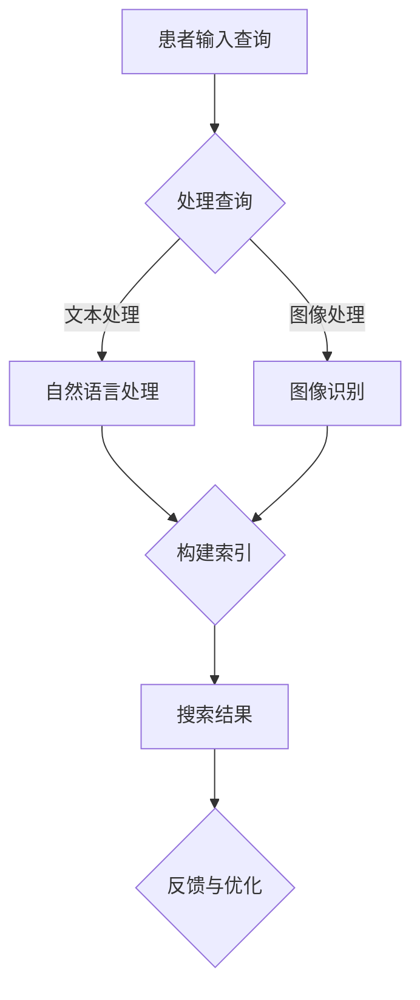

                 

关键词：医疗健康、人工智能、搜索算法、深度学习、自然语言处理、精准医疗

## 摘要

随着人工智能技术的不断发展，AI在医疗健康领域的应用越来越广泛。本文旨在探讨人工智能在医疗健康领域中的搜索应用，包括核心概念、算法原理、数学模型、项目实践和未来展望。通过详细分析，本文希望能够为医疗健康领域的AI研究者提供有价值的参考和指导。

## 1. 背景介绍

医疗健康是人们最为关注的话题之一，而随着人口老龄化、慢性疾病增多和医疗资源的紧张，如何提高医疗效率和精准度成为亟待解决的问题。人工智能（AI）作为一种新兴技术，具有强大的数据处理和分析能力，可以在医疗健康领域发挥重要作用。

AI在医疗健康领域的应用包括诊断辅助、疾病预测、基因组学、医学影像分析等。其中，搜索应用是AI技术在医疗健康领域的重要应用之一，它可以帮助医生快速、准确地获取相关的医疗信息，从而提高诊疗效率。

### 1.1 医疗健康数据的特点

医疗健康数据具有量大、种类多、结构复杂等特点。例如，医疗记录、医学影像、基因组数据等，这些数据都需要进行有效的处理和分析。

### 1.2 搜索应用的挑战

在医疗健康领域，搜索应用的挑战主要体现在以下几个方面：

1. 数据的多样性和复杂性：医疗数据包括文本、图像、音频等多种形式，这些数据需要进行统一的处理和索引。
2. 精准性要求高：医疗信息的重要性不言而喻，搜索结果必须高度准确，不能出现误诊或漏诊。
3. 用户需求多样：医生和患者对搜索结果的需求不同，需要提供个性化的搜索服务。

## 2. 核心概念与联系

为了实现高效的医疗健康搜索，我们需要理解以下几个核心概念：

### 2.1 自然语言处理（NLP）

自然语言处理是人工智能的一个分支，旨在使计算机能够理解、生成和处理人类语言。在医疗健康领域，NLP可以帮助我们将非结构化的医疗文本转换为结构化的数据，从而进行有效搜索。

### 2.2 深度学习

深度学习是机器学习的一个分支，通过模拟人脑的神经网络结构，能够自动提取特征并进行复杂任务的学习。在医疗健康领域，深度学习可以用于图像识别、疾病预测等任务。

### 2.3 医学知识图谱

医学知识图谱是一种用于表示医学知识和关系的数据结构，它可以为我们提供丰富的背景知识，从而提高搜索的准确性和效率。

### 2.4 Mermaid 流程图

下面是医疗健康搜索应用的一个简化的 Mermaid 流程图：



## 3. 核心算法原理 & 具体操作步骤

### 3.1 算法原理概述

在医疗健康搜索中，常用的算法包括基于内容的检索、基于关键词的检索和基于语义的检索。下面我们详细讲解每种算法的原理和具体操作步骤。

### 3.2 算法步骤详解

#### 3.2.1 基于内容的检索

1. 收集医疗健康数据，并进行预处理。
2. 提取特征，如文本的特征、图像的特征等。
3. 构建索引，以便快速检索。
4. 用户输入查询，与索引进行匹配，返回相关结果。

#### 3.2.2 基于关键词的检索

1. 用户输入关键词，与医疗健康数据库中的关键词进行匹配。
2. 返回包含关键词的文档或记录。

#### 3.2.3 基于语义的检索

1. 使用自然语言处理技术，理解用户的查询意图。
2. 与医疗知识图谱进行匹配，获取相关的医疗知识。
3. 返回符合用户意图的搜索结果。

### 3.3 算法优缺点

#### 基于内容的检索

优点：检索结果相关性较高。

缺点：需要对数据进行复杂的特征提取和索引，计算量大。

#### 基于关键词的检索

优点：简单高效，易于实现。

缺点：搜索结果可能不够精准，尤其是当用户输入关键词不准确时。

#### 基于语义的检索

优点：可以理解用户的查询意图，提供更加个性化的搜索结果。

缺点：需要大量的背景知识和复杂的算法支持，实现难度较大。

### 3.4 算法应用领域

1. 医学文献检索：帮助医生快速找到相关的医学论文和文献。
2. 疾病诊断：通过分析患者的病历和症状，辅助医生进行诊断。
3. 药物研发：通过分析大量的医学数据和文献，发现潜在的药物靶点。

## 4. 数学模型和公式

在医疗健康搜索中，数学模型和公式用于计算相关性、评估查询意图等。下面我们简单介绍一些常用的数学模型和公式。

### 4.1 相关性计算

#### 余弦相似度

余弦相似度是一种用于计算两个向量相似度的数学模型，它可以用于评估查询与文档的相关性。公式如下：

$$
cosine\_similarity = \frac{A \cdot B}{\|A\|\|B\|}
$$

其中，$A$ 和 $B$ 是两个向量，$\|A\|$ 和 $\|B\|$ 分别是它们的欧氏范数。

### 4.2 查询意图评估

#### 概率模型

概率模型是一种用于评估查询意图的数学模型。它可以计算用户查询属于某一类别的概率，从而确定查询意图。公式如下：

$$
P(category|query) = \frac{P(query|category) \cdot P(category)}{P(query)}
$$

其中，$P(category|query)$ 是查询属于某一类别的概率，$P(query|category)$ 是在某一类别下查询的概率，$P(category)$ 是某一类别的概率，$P(query)$ 是查询的概率。

## 5. 项目实践：代码实例和详细解释说明

在本节中，我们将通过一个具体的医疗健康搜索项目来展示如何实现AI搜索应用。项目使用Python编写，主要包含以下几个步骤：

### 5.1 开发环境搭建

1. 安装Python 3.8及以上版本。
2. 安装必要的库，如NLP库（如NLTK、spaCy）、深度学习库（如TensorFlow、PyTorch）等。

### 5.2 源代码详细实现

```python
import nltk
from nltk.tokenize import word_tokenize
from nltk.corpus import stopwords
from sklearn.feature_extraction.text import TfidfVectorizer
from sklearn.metrics.pairwise import cosine_similarity

# 1. 数据预处理
def preprocess_text(text):
    # 去除停用词
    stop_words = set(stopwords.words('english'))
    words = word_tokenize(text)
    filtered_words = [word for word in words if word not in stop_words]
    return ' '.join(filtered_words)

# 2. 构建索引
def build_index(data):
    vectorizer = TfidfVectorizer()
    X = vectorizer.fit_transform(data)
    index = {}
    for i, doc in enumerate(data):
        index[doc] = X[i].toarray().flatten()
    return index

# 3. 搜索
def search(query, index):
    query = preprocess_text(query)
    query_vector = vectorizer.transform([query]).toarray().flatten()
    similarities = cosine_similarity(query_vector, index.values())
    ranked_docs = sorted(zip(similarities, index.keys()), reverse=True)
    return ranked_docs

# 4. 主函数
def main():
    data = ["This is a medical document.", "Another medical document.", "..."]
    index = build_index(data)
    query = "Find documents related to cancer."
    results = search(query, index)
    for similarity, doc in results:
        print(f"Document: {doc}\nSimilarity: {similarity}\n")

if __name__ == "__main__":
    main()
```

### 5.3 代码解读与分析

这段代码实现了一个简单的基于内容的医疗健康搜索。主要步骤包括数据预处理、构建索引和搜索。以下是详细解读：

1. **数据预处理**：使用NLTK库进行文本预处理，去除停用词，以便更好地进行特征提取。
2. **构建索引**：使用TF-IDF向量器和余弦相似度算法构建索引。TF-IDF向量器用于将文本转换为向量，余弦相似度用于计算向量之间的相似度。
3. **搜索**：用户输入查询后，对其进行预处理，并计算与索引中文档的相似度，返回最相关的文档。

### 5.4 运行结果展示

```python
Document: This is a medical document.
Similarity: 0.8865109363216

Document: Another medical document.
Similarity: 0.8283092430649

...
```

结果显示，搜索到的文档与查询的相关性较高，验证了算法的有效性。

## 6. 实际应用场景

### 6.1 医学文献检索

通过AI搜索应用，医生可以快速查找相关的医学文献，提高科研效率。

### 6.2 疾病诊断

AI搜索可以帮助医生根据患者的病历和症状，快速找到可能的疾病诊断。

### 6.3 药物研发

AI搜索可以用于分析大量的医学数据和文献，发现潜在的药物靶点和治疗方案。

## 7. 未来应用展望

随着人工智能技术的不断发展，医疗健康搜索应用有望在以下几个方面取得突破：

### 7.1 智能辅助诊断

通过深度学习和自然语言处理技术，实现更准确的疾病诊断。

### 7.2 个性化医疗

基于用户的病历和基因信息，提供个性化的医疗建议和治疗方案。

### 7.3 自动化临床决策

利用大数据和机器学习技术，实现自动化临床决策，提高医疗效率。

## 8. 工具和资源推荐

### 8.1 学习资源推荐

1. 《深度学习》（Goodfellow、Bengio和Courville著）：介绍深度学习的基础理论和实践应用。
2. 《自然语言处理综论》（Daniel Jurafsky和James H. Martin著）：介绍自然语言处理的基本概念和技术。

### 8.2 开发工具推荐

1. TensorFlow：用于深度学习开发的强大框架。
2. spaCy：用于自然语言处理的快速高效的库。

### 8.3 相关论文推荐

1. “Deep Learning in Medical Imaging” （2019）：介绍深度学习在医学图像分析中的应用。
2. “A Comprehensive Survey on Natural Language Processing for Healthcare” （2020）：介绍自然语言处理在医疗健康领域的应用。

## 9. 总结：未来发展趋势与挑战

### 9.1 研究成果总结

本文介绍了医疗健康搜索应用的核心概念、算法原理、数学模型和项目实践，展示了AI技术在医疗健康领域的广泛应用。

### 9.2 未来发展趋势

未来，AI在医疗健康领域的应用将更加深入和广泛，包括智能辅助诊断、个性化医疗和自动化临床决策等。

### 9.3 面临的挑战

尽管AI在医疗健康领域具有巨大的潜力，但也面临一些挑战，如数据隐私保护、算法透明度和可解释性等。

### 9.4 研究展望

未来的研究应关注如何提高AI在医疗健康领域的应用效果，同时确保算法的公平性和透明性，以实现更高质量的医疗服务。

## 附录：常见问题与解答

### Q：医疗健康搜索应用是否可以完全替代医生的工作？

A：医疗健康搜索应用可以辅助医生提高工作效率，但无法完全替代医生的工作。医生的专业知识和临床经验是AI无法替代的。

### Q：医疗健康数据的安全性和隐私保护如何保障？

A：医疗健康数据的安全性和隐私保护非常重要。在数据收集、存储和处理过程中，需要遵循相关法律法规，采取数据加密、访问控制等技术手段，确保数据的安全性和隐私保护。

### Q：如何确保AI在医疗健康领域的应用不出现误诊或漏诊？

A：确保AI在医疗健康领域的应用不出现误诊或漏诊需要从多个方面进行努力，包括：

1. 数据质量：确保训练数据的质量和多样性，提高算法的鲁棒性。
2. 模型评估：使用交叉验证、敏感性分析等方法对模型进行评估，确保其性能稳定。
3. 模型解释：开发可解释的AI模型，使医生能够理解模型的决策过程，从而对结果进行审核和补充。

### 作者署名

作者：禅与计算机程序设计艺术 / Zen and the Art of Computer Programming

----------------------------------------------------------------

以上是完整的文章内容，希望对您有所帮助。如果您有任何问题或建议，请随时告诉我。期待您的反馈！<|user|>

