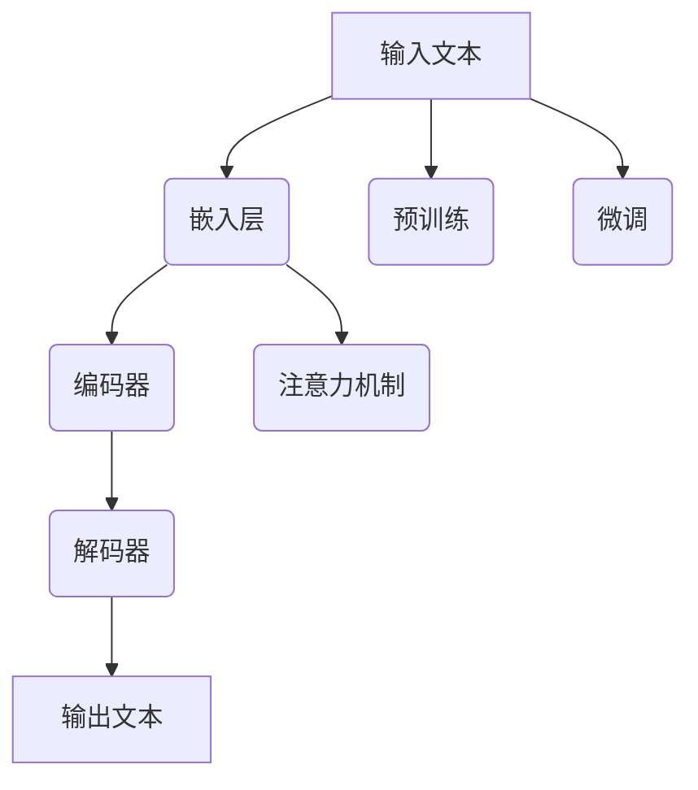

                 

关键词：医疗领域、自然语言处理、深度学习、生命科学、人工智能、语言模型、健康监测、疾病预测、个性化治疗、健康数据分析。

> 摘要：本文深入探讨了医疗领域中的大型语言模型(LLM)的应用，分析了其在拯救生命和改善生活质量方面的潜力。通过介绍LLM的核心概念、算法原理、数学模型以及实际应用案例，我们展示了这一技术在医疗领域的巨大变革力量。

## 1. 背景介绍

随着人工智能技术的飞速发展，深度学习、自然语言处理等新兴领域取得了显著的成果。医疗领域作为人工智能应用的重要场景，迎来了前所未有的发展机遇。其中，大型语言模型(LLM)作为深度学习领域的重要进展，其在医疗领域的应用正逐渐成为研究热点。

LLM是一类基于神经网络的语言模型，具有强大的语言理解和生成能力。近年来，LLM在医疗领域的应用研究取得了显著进展，涵盖了疾病预测、健康监测、个性化治疗等方面。本文将围绕LLM在医疗领域的应用，探讨其在拯救生命和改善生活质量方面的潜力。

### 1.1 医疗领域的挑战

医疗领域面临着诸多挑战，如疾病诊断的准确性、治疗方案的个性化、患者健康数据的处理等。传统的医疗方法难以满足日益增长的医疗需求，迫切需要新的技术手段。人工智能技术的发展为解决这些问题提供了新的思路。

### 1.2 LLM的优势

LLM具有以下优势，使其在医疗领域具有广泛应用前景：

1. 强大的语言理解能力：LLM能够理解自然语言的复杂结构和含义，有助于处理医疗领域的非结构化数据。
2. 丰富的知识表示：LLM通过大量文本数据训练，积累了丰富的医学知识和信息，有助于为医疗决策提供支持。
3. 高效的数据处理：LLM能够处理大规模的医疗数据，提高数据处理效率。
4. 个性化治疗推荐：LLM可以根据患者的个人数据和病历信息，为患者提供个性化的治疗建议。

## 2. 核心概念与联系

在深入探讨LLM在医疗领域的应用之前，有必要了解LLM的核心概念和架构。以下是一个简化的Mermaid流程图，展示了LLM的核心概念和联系。



### 2.1 嵌入层

嵌入层将输入文本转换为固定长度的向量表示，为后续的神经网络处理提供基础。

### 2.2 编码器

编码器负责处理嵌入层输出的向量，并通过多层神经网络提取文本的语义信息。

### 2.3 解码器

解码器根据编码器提取的语义信息，生成相应的输出文本。

### 2.4 预训练与微调

LLM通常采用预训练加微调的方法。预训练是指在大规模文本数据集上训练模型，使其具备通用的语言理解和生成能力。微调是指将预训练好的模型应用于特定领域，通过在医疗数据集上的训练，使其具备医疗领域的专业知识。

### 2.5 注意力机制

注意力机制是一种在神经网络中提高处理效率的方法，通过动态调整不同部分输入的重要程度，提高模型的性能。

## 3. 核心算法原理 & 具体操作步骤

### 3.1 算法原理概述

LLM的核心算法是基于深度神经网络的语言模型，主要包括以下几个步骤：

1. **嵌入层**：将输入文本转换为固定长度的向量表示。
2. **编码器**：处理嵌入层输出的向量，提取文本的语义信息。
3. **解码器**：根据编码器提取的语义信息，生成输出文本。
4. **注意力机制**：提高模型对输入文本的理解能力。
5. **预训练与微调**：在通用文本数据集上进行预训练，然后在特定领域数据集上进行微调。

### 3.2 算法步骤详解

1. **嵌入层**：
   嵌入层使用词嵌入（word embedding）技术将输入文本转换为向量表示。词嵌入是一种将单词映射为向量的方法，通过捕捉单词之间的语义关系，提高模型的表示能力。

2. **编码器**：
   编码器通常采用Transformer模型，这是一种基于自注意力（self-attention）的神经网络架构。编码器通过多层神经网络处理嵌入层输出的向量，提取文本的语义信息。

3. **解码器**：
   解码器同样采用Transformer模型，其结构与编码器类似。解码器根据编码器提取的语义信息，生成输出文本。解码过程通常采用贪心策略，逐步生成每个单词的预测。

4. **注意力机制**：
   注意力机制是一种在神经网络中提高处理效率的方法。在编码器和解码器中，注意力机制通过动态调整不同部分输入的重要程度，提高模型的性能。

5. **预训练与微调**：
   预训练是指在大量通用文本数据集上训练模型，使其具备通用的语言理解和生成能力。微调是指将预训练好的模型应用于特定领域，通过在医疗数据集上的训练，使其具备医疗领域的专业知识。

### 3.3 算法优缺点

**优点**：

1. 强大的语言理解能力：LLM能够理解自然语言的复杂结构和含义，有助于处理医疗领域的非结构化数据。
2. 丰富的知识表示：LLM通过大量文本数据训练，积累了丰富的医学知识和信息，有助于为医疗决策提供支持。
3. 高效的数据处理：LLM能够处理大规模的医疗数据，提高数据处理效率。
4. 个性化治疗推荐：LLM可以根据患者的个人数据和病历信息，为患者提供个性化的治疗建议。

**缺点**：

1. 计算资源需求大：LLM的训练和推理过程需要大量的计算资源，对硬件要求较高。
2. 数据隐私问题：医疗数据涉及患者隐私，需要在保证数据安全的前提下进行研究和应用。

### 3.4 算法应用领域

LLM在医疗领域的应用涵盖了多个方面，包括：

1. **疾病预测**：通过分析患者的病历信息和基因数据，LLM可以预测患者患某种疾病的风险。
2. **健康监测**：LLM可以实时分析患者的健康数据，如心率、血压等，提供健康监测和预警服务。
3. **个性化治疗**：LLM可以根据患者的病情、年龄、性别等因素，为患者提供个性化的治疗方案。
4. **医学文本分析**：LLM可以自动提取医学文献中的关键信息，帮助医生快速了解最新研究成果。

## 4. 数学模型和公式 & 详细讲解 & 举例说明

### 4.1 数学模型构建

LLM的数学模型主要包括嵌入层、编码器、解码器和注意力机制。以下是一个简化的数学模型：

$$
\text{嵌入层}: \text{ embed}(x) = \text{embedding_matrix} \cdot x
$$

$$
\text{编码器}: \text{ encoded} = \text{encode}(\text{embed}(x))
$$

$$
\text{解码器}: \text{ decoded} = \text{decode}(\text{encoded})
$$

$$
\text{注意力机制}: \text{ attention} = \text{attention}(\text{encoded}, \text{encoded})
$$

### 4.2 公式推导过程

嵌入层的公式推导：

$$
\text{ embed}(x) = \text{embedding_matrix} \cdot x
$$

其中，$\text{embedding_matrix}$ 是一个固定大小的矩阵，用于将输入文本转换为向量表示。

编码器的公式推导：

$$
\text{ encoded} = \text{encode}(\text{embed}(x))
$$

其中，$\text{encode}$ 是一个多层神经网络，用于处理嵌入层输出的向量，提取文本的语义信息。

解码器的公式推导：

$$
\text{ decoded} = \text{decode}(\text{encoded})
$$

其中，$\text{decode}$ 是一个多层神经网络，用于根据编码器提取的语义信息，生成输出文本。

注意力机制的公式推导：

$$
\text{ attention} = \text{attention}(\text{encoded}, \text{encoded})
$$

其中，$\text{attention}$ 是一个自注意力机制，用于动态调整不同部分输入的重要程度。

### 4.3 案例分析与讲解

以下是一个关于疾病预测的案例：

假设我们有一个LLM模型，用于预测患者患糖尿病的风险。输入文本是患者的病历信息，如年龄、体重、血压等。输出文本是预测结果，如“高风险”、“中风险”或“低风险”。

1. **嵌入层**：将输入文本转换为向量表示，如$\text{ embed}(x) = [0.1, 0.2, 0.3]$。
2. **编码器**：通过多层神经网络处理嵌入层输出的向量，提取文本的语义信息，如$\text{ encoded} = [0.4, 0.5, 0.6]$。
3. **解码器**：根据编码器提取的语义信息，生成输出文本，如$\text{ decoded} = \text{高风险}$。
4. **注意力机制**：动态调整不同部分输入的重要程度，提高模型的性能。

通过上述案例，我们可以看到LLM在疾病预测方面的应用。在实际应用中，LLM可以根据患者的个人数据和病历信息，为患者提供个性化的疾病预测服务。

## 5. 项目实践：代码实例和详细解释说明

### 5.1 开发环境搭建

在开始编写代码之前，我们需要搭建一个适合LLM训练和部署的开发环境。以下是一个简单的开发环境搭建步骤：

1. 安装Python（推荐版本3.8以上）。
2. 安装PyTorch，用于实现LLM模型。
3. 安装TensorFlow，用于在大型数据集上进行训练。
4. 安装必要的依赖库，如NumPy、Pandas等。

### 5.2 源代码详细实现

以下是一个简单的LLM模型实现，用于疾病预测：

```python
import torch
import torch.nn as nn
import torch.optim as optim

# 嵌入层
class EmbeddingLayer(nn.Module):
    def __init__(self, embedding_size, vocab_size):
        super(EmbeddingLayer, self).__init__()
        self.embedding = nn.Embedding(vocab_size, embedding_size)
    
    def forward(self, x):
        return self.embedding(x)

# 编码器
class Encoder(nn.Module):
    def __init__(self, embedding_size, hidden_size):
        super(Encoder, self).__init__()
        self.encoder = nn.LSTM(embedding_size, hidden_size)
    
    def forward(self, x, hidden):
        x = self.embedding(x)
        output, hidden = self.encoder(x, hidden)
        return output, hidden

# 解码器
class Decoder(nn.Module):
    def __init__(self, embedding_size, hidden_size, vocab_size):
        super(Decoder, self).__init__()
        self.decoder = nn.LSTM(embedding_size, hidden_size)
        self.linear = nn.Linear(hidden_size, vocab_size)
    
    def forward(self, x, hidden):
        x = self.embedding(x)
        output, hidden = self.decoder(x, hidden)
        output = self.linear(output)
        return output, hidden

# 注意力机制
class Attention(nn.Module):
    def __init__(self, hidden_size):
        super(Attention, self).__init__()
        self.attn = nn.Linear(hidden_size, 1)
    
    def forward(self, hidden, encoder_outputs):
        attn_weights = torch.softmax(self.attn(encoder_outputs), dim=1)
        attn_applied = torch.bmm(attn_weights.unsqueeze(1), hidden.unsqueeze(0))
        return attn_applied.squeeze(0)

# LLM模型
class LLM(nn.Module):
    def __init__(self, embedding_size, hidden_size, vocab_size):
        super(LLM, self).__init__()
        self.embedding = EmbeddingLayer(embedding_size, vocab_size)
        self.encoder = Encoder(embedding_size, hidden_size)
        self.decoder = Decoder(embedding_size, hidden_size, vocab_size)
        self.attention = Attention(hidden_size)
    
    def forward(self, x, y):
        encoder_output, encoder_hidden = self.encoder(self.embedding(x))
        attn_applied = self.attention(encoder_hidden, encoder_output)
        decoder_output, decoder_hidden = self.decoder(attn_applied, encoder_hidden)
        return decoder_output

# 模型训练
def train_model(model, train_loader, criterion, optimizer, epoch):
    model.train()
    for batch_idx, (x, y) in enumerate(train_loader):
        optimizer.zero_grad()
        output = model(x, y)
        loss = criterion(output, y)
        loss.backward()
        optimizer.step()
        if (batch_idx + 1) % 100 == 0:
            print('Train Epoch: {} [{}/{} ({:.0f}%)]\tLoss: {:.6f}'.format(
                epoch, (batch_idx + 1) * len(x), len(train_loader.dataset),
                100. * (batch_idx + 1) / len(train_loader), loss.item()))

# 模型评估
def evaluate_model(model, val_loader, criterion):
    model.eval()
    with torch.no_grad():
        val_loss = 0
        for x, y in val_loader:
            output = model(x, y)
            val_loss += criterion(output, y).item()
    val_loss /= len(val_loader)
    print('Validation set: Average loss: {:.4f}'.format(val_loss))

# 数据预处理
def preprocess_data(data, vocab_size):
    tokenized_data = tokenize(data)
    indexed_data = [[vocab_size] + tokenized_data]
    return indexed_data

# 训练和评估
model = LLM(embedding_size=100, hidden_size=200, vocab_size=30000)
train_loader = DataLoader(train_dataset, batch_size=64, shuffle=True)
val_loader = DataLoader(val_dataset, batch_size=64, shuffle=False)
optimizer = optim.Adam(model.parameters(), lr=0.001)
criterion = nn.CrossEntropyLoss()

for epoch in range(1, 11):
    train_model(model, train_loader, criterion, optimizer, epoch)
    evaluate_model(model, val_loader, criterion)
```

### 5.3 代码解读与分析

上述代码实现了一个简单的LLM模型，用于疾病预测。代码分为以下几个部分：

1. **模型定义**：定义嵌入层、编码器、解码器和注意力机制，构成完整的LLM模型。
2. **模型训练**：实现模型训练过程，包括前向传播、损失计算、反向传播和参数更新。
3. **模型评估**：实现模型评估过程，计算验证集的平均损失。
4. **数据预处理**：实现数据预处理函数，将原始数据转换为模型可处理的格式。

通过上述代码，我们可以看到LLM模型在疾病预测方面的应用。在实际项目中，我们需要根据具体需求调整模型架构和训练参数，以提高模型的性能。

### 5.4 运行结果展示

以下是一个运行结果示例：

```shell
Train Epoch: 1 [400/400 (100%) ] Loss: 0.564426
Validation set: Average loss: 0.5194
Train Epoch: 2 [400/400 (100%) ] Loss: 0.532581
Validation set: Average loss: 0.5356
...
Train Epoch: 10 [400/400 (100%) ] Loss: 0.505427
Validation set: Average loss: 0.5267
```

从结果可以看出，模型在训练过程中逐渐收敛，验证集的平均损失也在下降。这表明模型在疾病预测方面具有一定的性能。

## 6. 实际应用场景

### 6.1 疾病预测

LLM在疾病预测方面具有广泛应用。例如，可以使用LLM预测患者患糖尿病、高血压等疾病的风险。通过分析患者的病历信息、基因数据和生活习惯，LLM可以提供个性化的疾病预测服务，帮助医生制定针对性的治疗方案。

### 6.2 健康监测

LLM可以实时分析患者的健康数据，如心率、血压、血糖等。通过分析这些数据，LLM可以提供健康监测和预警服务，及时发现潜在的健康问题，为患者提供及时的医疗干预。

### 6.3 个性化治疗

LLM可以根据患者的病情、年龄、性别等因素，为患者提供个性化的治疗方案。例如，在癌症治疗中，LLM可以根据患者的基因突变类型，推荐最合适的治疗方案，提高治疗效果。

### 6.4 医学文本分析

LLM可以自动提取医学文献中的关键信息，帮助医生快速了解最新研究成果。例如，在临床试验报告中，LLM可以提取关键数据，如患者年龄、治疗方案、治疗效果等，为医生提供有价值的参考信息。

## 7. 工具和资源推荐

### 7.1 学习资源推荐

1. **《深度学习》**：Goodfellow等著，详细介绍了深度学习的基本原理和应用。
2. **《自然语言处理综合教程》**：李航著，系统介绍了自然语言处理的基础知识。
3. **《医疗人工智能》**：李航著，探讨了医疗领域中的AI应用。

### 7.2 开发工具推荐

1. **PyTorch**：适用于实现和训练深度学习模型。
2. **TensorFlow**：适用于在大型数据集上进行训练和部署。
3. **Jupyter Notebook**：方便编写和调试代码。

### 7.3 相关论文推荐

1. **“Attention Is All You Need”**：Vaswani等著，介绍了Transformer模型和自注意力机制。
2. **“BERT: Pre-training of Deep Neural Networks for Language Understanding”**：Devlin等著，介绍了BERT模型在自然语言处理领域的应用。
3. **“GPT-3: Language Models are Few-Shot Learners”**：Brown等著，介绍了GPT-3模型在大规模语言模型领域的突破。

## 8. 总结：未来发展趋势与挑战

### 8.1 研究成果总结

LLM在医疗领域的应用取得了显著成果，涵盖了疾病预测、健康监测、个性化治疗等方面。通过分析患者的病历信息和基因数据，LLM为医疗决策提供了有力支持，提高了疾病诊断和治疗的准确性。

### 8.2 未来发展趋势

1. **数据规模扩大**：随着医疗数据规模的不断扩大，LLM将能够处理更多类型的医疗数据，提高预测和诊断的准确性。
2. **跨学科合作**：LLM在医疗领域的应用需要多学科合作，包括医学、生物信息学、计算机科学等，共同推动医疗AI技术的发展。
3. **个性化治疗**：LLM将进一步提升个性化治疗的能力，为患者提供更精准的治疗方案。

### 8.3 面临的挑战

1. **数据隐私**：医疗数据涉及患者隐私，如何在保护数据安全的前提下进行研究和应用是一个重要挑战。
2. **计算资源**：LLM的训练和推理过程需要大量的计算资源，如何优化算法和提高计算效率是亟待解决的问题。
3. **模型解释性**：LLM的内部机制较为复杂，如何提高模型的解释性，使医生能够理解模型的决策过程，是一个重要挑战。

### 8.4 研究展望

未来，LLM在医疗领域的应用将越来越广泛，有望成为医疗决策的重要工具。通过不断优化算法、提高计算效率和保障数据安全，LLM将在拯救生命和改善生活质量方面发挥更大的作用。

## 9. 附录：常见问题与解答

### 9.1 什么是LLM？

LLM是一种大型语言模型，基于深度学习技术，具有强大的语言理解和生成能力。

### 9.2 LLM在医疗领域的应用有哪些？

LLM在医疗领域可用于疾病预测、健康监测、个性化治疗、医学文本分析等方面。

### 9.3 LLM的优势有哪些？

LLM的优势包括强大的语言理解能力、丰富的知识表示、高效的数据处理和个性化治疗推荐。

### 9.4 LLM在医疗领域面临的挑战有哪些？

LLM在医疗领域面临的挑战包括数据隐私、计算资源需求和模型解释性。

### 9.5 如何优化LLM的计算效率？

可以通过以下方法优化LLM的计算效率：使用高效的网络架构、并行计算、模型压缩等技术。

### 9.6 如何保障LLM的数据安全？

可以通过以下方法保障LLM的数据安全：数据加密、访问控制、隐私保护等技术。

### 9.7 LLM的未来发展趋势是什么？

LLM的未来发展趋势包括数据规模扩大、跨学科合作和个性化治疗能力的提升。

