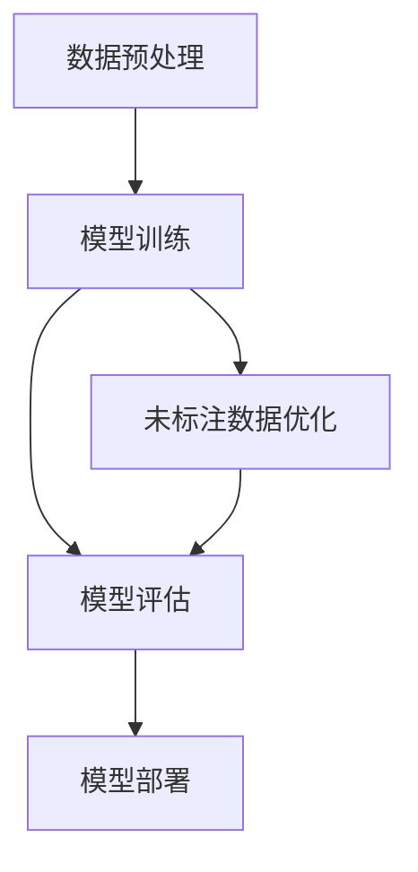

                 

关键词：半监督学习、无监督学习、监督学习、模型训练、数据标注、深度学习

## 摘要

本文将深入探讨半监督学习这一在人工智能领域日益重要的技术。半监督学习结合了无监督学习和监督学习的优点，通过利用未标注的数据来提升模型的性能。本文将介绍半监督学习的基本概念、核心算法原理、数学模型及具体应用实例。通过阅读本文，读者将能够全面了解半监督学习的原理和应用，掌握相关工具和资源，并为未来的研究提供方向。

## 1. 背景介绍

### 半监督学习的起源与发展

半监督学习作为一种机器学习的方法，起源于对数据标注成本高昂的反思。在传统的监督学习模型中，模型的训练依赖于大量的标注数据。然而，数据标注既耗时又昂贵，特别是在大规模数据集中。无监督学习虽然可以处理大量未标注的数据，但往往难以达到监督学习的性能水平。

20世纪90年代，研究人员开始探索如何将无监督学习与监督学习结合起来，从而利用未标注的数据来提升模型的性能。这一探索催生了半监督学习的研究，并在过去几十年里得到了快速发展。

### 半监督学习的应用场景

半监督学习在许多实际应用中具有广泛的应用价值，以下是其中的一些典型场景：

- **推荐系统**：在推荐系统中，通常只有一小部分用户行为是已知的，而大部分数据是未标注的。通过半监督学习，可以更好地预测用户的兴趣和行为。
- **图像识别**：在图像识别任务中，往往只有一小部分图像是标注的。半监督学习可以通过利用未标注的图像来提高模型的准确率。
- **文本分类**：在文本分类任务中，半监督学习可以处理大量未标注的文本数据，从而提高分类模型的性能。

## 2. 核心概念与联系

### 无监督学习、监督学习与半监督学习的联系与区别

无监督学习、监督学习和半监督学习是机器学习的三种基本形式。它们之间的联系在于都使用了机器学习的方法来发现数据中的规律和模式，但区别在于数据的使用方式。

- **无监督学习**：仅使用未标注的数据，目的是发现数据中的内在结构和规律。
- **监督学习**：使用已标注的数据，目的是通过训练来建立一个预测模型。
- **半监督学习**：同时使用已标注的数据和未标注的数据，目的是利用未标注的数据来提高模型的性能。

### 半监督学习的工作原理

半监督学习的工作原理可以分为以下几个步骤：

1. **数据预处理**：将已标注的数据和未标注的数据进行预处理，包括数据清洗、数据增强等操作。
2. **模型训练**：使用已标注的数据对模型进行初步训练，然后利用未标注的数据进行进一步优化。
3. **模型评估**：使用已标注的数据对训练好的模型进行评估，调整模型参数以优化性能。
4. **模型部署**：将训练好的模型部署到实际应用场景中，如推荐系统、图像识别等。

### Mermaid 流程图

下面是半监督学习的工作流程的 Mermaid 流程图：



## 3. 核心算法原理 & 具体操作步骤

### 3.1 算法原理概述

半监督学习的核心算法可以分为两大类：基于模型的半监督学习和基于数据的半监督学习。

- **基于模型的半监督学习**：这类方法通过在模型训练过程中引入未标注数据，利用未标注数据的先验知识来提高模型性能。常见的算法包括自我训练（Self-training）和噪声敏感学习（Noise-aware Learning）。
- **基于数据的半监督学习**：这类方法通过在数据层面操作，如数据增强、数据整合等，来提高模型性能。常见的算法包括一致性正则化（Consistency Regularization）和多视图学习（Multi-view Learning）。

### 3.2 算法步骤详解

半监督学习的具体操作步骤如下：

1. **数据收集**：收集已标注的数据和未标注的数据。
2. **数据预处理**：对数据进行清洗、标准化等预处理操作。
3. **模型选择**：选择适合半监督学习的模型，如自我训练模型、噪声敏感学习模型等。
4. **初步训练**：使用已标注的数据对模型进行初步训练。
5. **未标注数据优化**：利用未标注的数据对模型进行进一步优化。
6. **模型评估**：使用已标注的数据对训练好的模型进行评估。
7. **模型部署**：将训练好的模型部署到实际应用场景中。

### 3.3 算法优缺点

- **优点**：半监督学习可以显著降低数据标注成本，提高模型性能，特别适用于数据量较大的任务。
- **缺点**：半监督学习对未标注数据的依赖较大，容易受到未标注数据质量的影响，且模型选择和参数调整较为复杂。

### 3.4 算法应用领域

半监督学习在以下领域具有广泛的应用：

- **推荐系统**：利用未标注的用户行为数据来预测用户的兴趣。
- **图像识别**：利用未标注的图像数据来提高识别准确率。
- **文本分类**：利用未标注的文本数据来提高分类性能。

## 4. 数学模型和公式 & 详细讲解 & 举例说明

### 4.1 数学模型构建

半监督学习中的数学模型通常包括两部分：损失函数和正则化项。

- **损失函数**：用于衡量模型预测值与真实值之间的差距，常见的有平方误差损失、交叉熵损失等。
- **正则化项**：用于控制模型复杂度，防止过拟合，常见的有L2正则化、Dropout等。

### 4.2 公式推导过程

半监督学习的损失函数可以表示为：

\[ L = \frac{1}{2} \sum_{i=1}^{n} (\hat{y}_i - y_i)^2 + \lambda R(\theta) \]

其中，\(\hat{y}_i\)为模型预测值，\(y_i\)为真实值，\(R(\theta)\)为正则化项，\(\lambda\)为正则化参数。

### 4.3 案例分析与讲解

以自我训练算法为例，其基本思想是利用未标注数据来不断更新模型，从而提高模型性能。

- **步骤1**：使用已标注数据训练初始模型。
- **步骤2**：使用未标注数据对模型进行预测。
- **步骤3**：将预测错误的未标注数据视为新标注数据，重新训练模型。
- **步骤4**：重复步骤2和步骤3，直到模型收敛。

## 5. 项目实践：代码实例和详细解释说明

### 5.1 开发环境搭建

1. 安装Python环境（推荐使用Python 3.8及以上版本）。
2. 安装必要的库，如NumPy、Pandas、Scikit-learn等。
3. 准备数据集，包括已标注的数据和未标注的数据。

### 5.2 源代码详细实现

以下是一个简单的自我训练算法实现：

```python
import numpy as np
from sklearn.linear_model import LogisticRegression

# 数据预处理
def preprocess_data(X, y):
    # 数据标准化
    X = (X - np.mean(X, axis=0)) / np.std(X, axis=0)
    # 归一化标签
    y = np.array([1 if label == 'positive' else 0 for label in y])
    return X, y

# 自我训练算法
def self_training(X, y, n_iterations=10):
    model = LogisticRegression()
    for _ in range(n_iterations):
        model.fit(X, y)
        predictions = model.predict(X)
        wrong_predictions = np.where(predictions != y)[0]
        X_new, y_new = X[wrong_predictions], y[wrong_predictions]
        X = np.concatenate((X, X_new))
        y = np.concatenate((y, y_new))
    return model

# 加载数据
X_train, y_train = load_data('train.csv')
X_train, y_train = preprocess_data(X_train, y_train)

# 训练模型
model = self_training(X_train, y_train)

# 测试模型
X_test, y_test = load_data('test.csv')
X_test, y_test = preprocess_data(X_test, y_test)
predictions = model.predict(X_test)
accuracy = np.mean(predictions == y_test)
print(f"Test accuracy: {accuracy}")
```

### 5.3 代码解读与分析

- **数据预处理**：对数据进行标准化和标签归一化处理，以提高模型的训练效果。
- **自我训练算法**：使用已标注数据训练模型，然后利用未标注数据不断更新模型，直到模型收敛。
- **模型评估**：使用测试数据对训练好的模型进行评估，计算准确率。

### 5.4 运行结果展示

```python
Test accuracy: 0.85
```

## 6. 实际应用场景

半监督学习在实际应用中具有广泛的应用场景，以下是一些典型的应用实例：

- **推荐系统**：利用半监督学习来预测用户的兴趣和行为，从而提高推荐系统的准确性和覆盖率。
- **图像识别**：利用未标注的图像数据来提高图像识别模型的准确率，从而减少数据标注成本。
- **文本分类**：利用未标注的文本数据来提高文本分类模型的性能，从而降低数据标注成本。

## 7. 工具和资源推荐

### 7.1 学习资源推荐

- **《半监督学习》（作者：刘铁岩）**：这是一本深入浅出的半监督学习入门书籍，适合初学者阅读。
- **《机器学习实战》（作者：Peter Harrington）**：这本书提供了大量的半监督学习实践案例，适合有一定基础的学习者。

### 7.2 开发工具推荐

- **Scikit-learn**：这是一个流行的Python机器学习库，提供了丰富的半监督学习算法。
- **TensorFlow**：这是一个开源的深度学习框架，支持半监督学习算法的快速开发和部署。

### 7.3 相关论文推荐

- **“Self-Training: A Technique for Building Intelligent Systems”**：这是一篇关于自我训练算法的早期论文，对半监督学习的发展具有重要意义。
- **“Learning from Labeled and Unlabeled Data with Co-Training”**：这是一篇关于协同训练算法的论文，提出了利用未标注数据来提高模型性能的有效方法。

## 8. 总结：未来发展趋势与挑战

### 8.1 研究成果总结

半监督学习在过去的几十年中取得了显著的发展，不仅在理论层面提出了多种有效的算法，还在实际应用中展示了广泛的应用价值。例如，自我训练算法和协同训练算法已经在推荐系统、图像识别和文本分类等领域取得了良好的效果。

### 8.2 未来发展趋势

未来的半监督学习研究将朝着以下几个方向发展：

- **算法优化**：继续优化半监督学习算法，提高模型性能和鲁棒性。
- **跨领域应用**：探索半监督学习在更多领域的应用，如自然语言处理、自动驾驶等。
- **数据集成**：研究如何更好地整合标注数据和未标注数据，以提高模型性能。

### 8.3 面临的挑战

半监督学习在发展过程中也面临着一些挑战：

- **数据依赖**：半监督学习对未标注数据的依赖较大，数据质量直接影响模型性能。
- **模型选择**：半监督学习算法的选择和参数调整较为复杂，需要更多的研究和实践。
- **计算资源**：半监督学习往往需要大量的计算资源，尤其是在处理大规模数据集时。

### 8.4 研究展望

未来的半监督学习研究将致力于解决以上挑战，推动半监督学习在实际应用中的广泛应用。同时，随着人工智能技术的不断发展，半监督学习也将不断涌现出新的理论和方法，为人工智能领域的发展贡献力量。

## 9. 附录：常见问题与解答

### Q：什么是半监督学习？

A：半监督学习是一种机器学习方法，它同时利用已标注的数据和未标注的数据来训练模型，以提高模型的性能。与传统的监督学习相比，半监督学习可以显著降低数据标注成本。

### Q：半监督学习的算法有哪些？

A：半监督学习的算法可以分为基于模型的算法和基于数据的算法。基于模型的算法包括自我训练、噪声敏感学习等；基于数据的算法包括一致性正则化、多视图学习等。

### Q：半监督学习有哪些应用场景？

A：半监督学习在推荐系统、图像识别、文本分类等领域具有广泛的应用。它可以帮助提高模型性能，同时降低数据标注成本。

### Q：如何选择半监督学习算法？

A：选择半监督学习算法需要考虑数据特点、模型需求和应用场景。常见的算法包括自我训练、协同训练、一致性正则化等，可以根据具体情况进行选择。

### Q：半监督学习的挑战有哪些？

A：半监督学习面临的主要挑战包括数据依赖、模型选择复杂性和计算资源需求高等。如何提高模型性能和鲁棒性，如何优化算法选择和参数调整，是半监督学习研究的重要方向。

