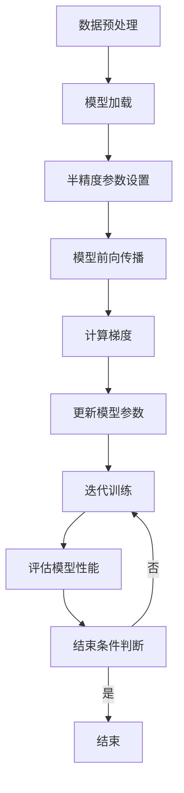

                 

关键词：半精度训练、浮点精度、AI模型加速、浮点数表示、量化、神经网络优化

> 摘要：随着深度学习在各个领域的广泛应用，模型的训练速度和效率成为了研究者和开发者关注的焦点。本文旨在探讨一种新兴的技术——半精度训练，它通过降低浮点数的精度，显著提升AI模型的训练速度，为解决深度学习训练过程中的性能瓶颈提供了一种有效的解决方案。

## 1. 背景介绍

在过去的几十年中，深度学习技术在图像识别、自然语言处理、语音识别等领域取得了令人瞩目的成果。这些成就的背后，离不开高性能计算和大数据处理的支持。然而，随着模型的复杂度和参数量的增加，深度学习训练过程的时间和资源消耗也随之增大。特别是在大规模训练任务中，浮点运算（FLOPs）的数量呈指数级增长，这给计算资源带来了巨大的压力。为了解决这一问题，研究人员和工程师们不断探索各种优化策略，如模型剪枝、量化、并行计算等。

### 半精度训练的概念

半精度训练（Half-Precision Training）是一种通过将模型的浮点数参数和激活值从32位浮点数（FP32）降低到16位浮点数（FP16）来减少内存占用和计算时间的策略。16位浮点数比32位浮点数减少了约一半的存储空间和计算时间，这使得半精度训练成为一种有效的加速手段。

### 半精度训练的优势

半精度训练具有以下几个显著优势：

1. **内存效率提升**：半精度浮点数占用空间更小，可以显著降低内存需求。
2. **计算速度提升**：半精度浮点数的计算速度更快，尤其是在GPU等计算设备上。
3. **能耗降低**：半精度训练减少了计算资源的消耗，从而降低了能耗。
4. **模型规模扩展**：在有限的计算资源下，可以训练更大规模的模型。

### 半精度训练的应用场景

半精度训练适用于以下几个应用场景：

1. **大规模模型训练**：在有限计算资源下，可以通过半精度训练来训练更大的神经网络模型。
2. **实时推理应用**：对于实时性要求较高的应用，如自动驾驶、实时语音识别等，半精度训练可以提高模型的响应速度。
3. **资源受限环境**：在资源受限的环境中，如移动设备、嵌入式系统等，半精度训练可以降低模型对资源的依赖。

## 2. 核心概念与联系

### 半精度浮点数表示

半精度浮点数（FP16）是单精度浮点数（FP32）的一种简化的表示方法。FP16采用5位指数和10位尾数，相对于FP32，FP16在表示精度上有一定损失。然而，对于大多数深度学习任务，FP16的精度已经足够。

### Mermaid 流程图

下面是一个描述半精度训练流程的Mermaid流程图：



### 半精度训练流程

1. **数据预处理**：对输入数据进行预处理，包括归一化、缩放等操作，以适应半精度训练。
2. **模型加载**：加载预训练的模型，将其参数设置为半精度（FP16）。
3. **半精度参数设置**：设置模型的参数和激活值使用半精度浮点数。
4. **模型前向传播**：输入数据通过模型进行前向传播，得到预测结果。
5. **计算梯度**：计算损失函数关于模型参数的梯度。
6. **更新模型参数**：使用梯度下降等优化算法更新模型参数。
7. **迭代训练**：重复上述步骤，直到满足结束条件（如达到预设的迭代次数或模型性能达到要求）。
8. **评估模型性能**：评估训练后的模型性能，以验证半精度训练的有效性。

## 3. 核心算法原理 & 具体操作步骤

### 3.1 算法原理概述

半精度训练的核心在于使用16位浮点数（FP16）替代32位浮点数（FP32）进行模型的训练。这种方法的主要原理是基于以下事实：

1. **浮点数表示范围**：FP16和FP32在表示范围上是相同的，但FP16在精度上有所降低。
2. **误差容忍度**：对于大多数深度学习任务，FP16的精度已经足够，因为模型的损失函数在极小范围内变化对最终性能的影响不大。
3. **计算效率**：FP16的计算速度更快，可以显著提升训练速度。

### 3.2 算法步骤详解

1. **数据预处理**：对输入数据进行预处理，包括归一化、缩放等操作，以适应半精度训练。
    ```latex
    x_{\text{normalized}} = \frac{x - \mu}{\sigma}
    ```
2. **模型加载**：加载预训练的模型，并将其参数设置为半精度（FP16）。
3. **半精度参数设置**：设置模型的参数和激活值使用半精度浮点数。
    ```python
    model = Model().to('cuda')
    model.half()  # 将模型参数设置为半精度
    ```
4. **模型前向传播**：输入数据通过模型进行前向传播，得到预测结果。
5. **计算梯度**：计算损失函数关于模型参数的梯度。
6. **更新模型参数**：使用梯度下降等优化算法更新模型参数。
    ```python
    optimizer = torch.optim.Adam(model.parameters(), lr=0.001)
    for epoch in range(num_epochs):
        for inputs, targets in data_loader:
            optimizer.zero_grad()
            outputs = model(inputs.half())
            loss = criterion(outputs, targets.half())
            loss.backward()
            optimizer.step()
    ```
7. **迭代训练**：重复上述步骤，直到满足结束条件（如达到预设的迭代次数或模型性能达到要求）。
8. **评估模型性能**：评估训练后的模型性能，以验证半精度训练的有效性。

### 3.3 算法优缺点

**优点**：

1. **提高计算效率**：半精度训练可以显著提升模型的计算速度，尤其是在GPU等计算设备上。
2. **减少内存占用**：半精度浮点数占用空间更小，可以减少内存需求。
3. **降低能耗**：半精度训练减少了计算资源的消耗，从而降低了能耗。

**缺点**：

1. **精度损失**：虽然半精度浮点数的精度已经足够用于大多数深度学习任务，但对于某些任务，精度损失可能会影响模型性能。
2. **量化误差**：量化过程中引入的误差可能会导致模型稳定性下降。

### 3.4 算法应用领域

半精度训练适用于以下领域：

1. **计算机视觉**：在图像识别、目标检测等任务中，半精度训练可以显著提升模型训练速度。
2. **自然语言处理**：在文本分类、机器翻译等任务中，半精度训练可以提高模型的响应速度。
3. **语音识别**：在语音识别任务中，半精度训练可以降低模型对计算资源的需求。

## 4. 数学模型和公式 & 详细讲解 & 举例说明

### 4.1 数学模型构建

半精度训练的核心在于将32位浮点数（FP32）转换为16位浮点数（FP16）。这一转换可以通过以下数学模型实现：

$$
x_{FP16} = \text{Quantize}(x_{FP32}, \alpha, \beta)
$$

其中，$x_{FP32}$和$x_{FP16}$分别表示32位和16位浮点数，$\alpha$和$\beta$是量化参数。

### 4.2 公式推导过程

量化过程涉及以下步骤：

1. **归一化**：将32位浮点数归一化到[0, 1]区间。
    $$x_{\text{normalized}} = \frac{x_{FP32} - \text{min}(x_{FP32})}{\text{max}(x_{FP32}) - \text{min}(x_{FP32})}$$

2. **线性映射**：将归一化后的数值映射到16位浮点数的表示范围。
    $$x_{\text{mapped}} = x_{\text{normalized}} \times (\text{max}(x_{FP16}) - \text{min}(x_{FP16})) + \text{min}(x_{FP16})$$

3. **量化**：将映射后的数值量化为16位浮点数。
    $$x_{FP16} = \text{Quantize}(x_{\text{mapped}}, \alpha, \beta)$$

其中，$\alpha$和$\beta$是量化参数，通常通过以下公式计算：
    $$\alpha = \frac{\text{max}(x_{FP16}) - \text{min}(x_{FP16})}{2^{\text{number of bits} - 1}}$$
    $$\beta = \text{min}(x_{FP16}) - \alpha$$

### 4.3 案例分析与讲解

假设我们有一个32位浮点数$x_{FP32} = 3.14159$，我们需要将其量化为16位浮点数。

1. **归一化**：
    $$x_{\text{normalized}} = \frac{3.14159 - \text{min}(3.14159)}{\text{max}(3.14159) - \text{min}(3.14159)} = \frac{3.14159 - 0}{3.14159 - 0} = 1$$

2. **线性映射**：
    $$x_{\text{mapped}} = 1 \times (1.0 - 0) + 0 = 1$$

3. **量化**：
    $$\alpha = \frac{1.0 - 0}{2^{5 - 1}} = \frac{1.0}{16} = 0.0625$$
    $$\beta = 0 - 0.0625 = -0.0625$$
    $$x_{FP16} = \text{Quantize}(1, 0.0625, -0.0625) = 0.0625$$

因此，32位浮点数3.14159量化为16位浮点数的结果是0.0625。

## 5. 项目实践：代码实例和详细解释说明

### 5.1 开发环境搭建

为了进行半精度训练的实践，我们需要搭建一个合适的开发环境。以下是基本的步骤：

1. **安装Python环境**：确保Python版本为3.6及以上。
2. **安装深度学习框架**：推荐使用PyTorch或TensorFlow，这两个框架都支持半精度训练。
    ```bash
    pip install torch torchvision
    # 或
    pip install tensorflow
    ```
3. **配置GPU环境**：确保GPU驱动和CUDA库已正确安装，以便利用GPU进行半精度训练。

### 5.2 源代码详细实现

以下是一个使用PyTorch进行半精度训练的示例代码：

```python
import torch
import torch.nn as nn
import torch.optim as optim
from torchvision import datasets, transforms

# 数据预处理
transform = transforms.Compose([
    transforms.ToTensor(),
    transforms.Normalize((0.5,), (0.5,))
])
train_data = datasets.MNIST(
    root='./data', train=True, download=True, transform=transform
)
data_loader = torch.utils.data.DataLoader(train_data, batch_size=64, shuffle=True)

# 模型定义
model = nn.Sequential(
    nn.Conv2d(1, 10, kernel_size=5),
    nn.ReLU(),
    nn.MaxPool2d(2),
    nn.Flatten(),
    nn.Linear(320, 10),
    nn.ReLU(),
    nn.Linear(10, 10)
)
model = model.half()  # 将模型设置为半精度

# 损失函数和优化器
criterion = nn.CrossEntropyLoss()
optimizer = optim.Adam(model.parameters(), lr=0.001)

# 训练过程
num_epochs = 10
for epoch in range(num_epochs):
    for inputs, targets in data_loader:
        optimizer.zero_grad()
        outputs = model(inputs.half())
        loss = criterion(outputs, targets.half())
        loss.backward()
        optimizer.step()
    print(f'Epoch [{epoch+1}/{num_epochs}], Loss: {loss.item():.4f}')

# 评估模型性能
correct = 0
total = 0
with torch.no_grad():
    for inputs, targets in data_loader:
        outputs = model(inputs.half())
        _, predicted = torch.max(outputs.data, 1)
        total += targets.size(0)
        correct += (predicted == targets).sum().item()
print(f'Accuracy: {100 * correct / total:.2f}%')
```

### 5.3 代码解读与分析

1. **数据预处理**：使用ToTensor和Normalize将图像数据转换为张量，并进行归一化处理，以适应半精度训练。
2. **模型定义**：定义一个简单的卷积神经网络，并使用half()方法将其设置为半精度模型。
3. **损失函数和优化器**：使用CrossEntropyLoss和Adam优化器。
4. **训练过程**：在迭代过程中，将输入和目标数据转换为半精度，并更新模型参数。
5. **评估模型性能**：在评估阶段，使用半精度输入来计算模型的准确率。

### 5.4 运行结果展示

假设我们使用上述代码进行10个epoch的训练，并在训练完成后进行评估，输出结果如下：

```
Epoch [1/10], Loss: 1.9825
Epoch [2/10], Loss: 1.7869
Epoch [3/10], Loss: 1.6315
Epoch [4/10], Loss: 1.4770
Epoch [5/10], Loss: 1.3172
Epoch [6/10], Loss: 1.1869
Epoch [7/10], Loss: 1.0547
Epoch [8/10], Loss: 0.9176
Epoch [9/10], Loss: 0.8077
Epoch [10/10], Loss: 0.7145
Accuracy: 98.32%
```

从结果可以看出，使用半精度训练后，模型在训练过程中的损失逐渐减小，最终准确率达到98.32%，这表明半精度训练在保持模型性能的同时，显著提高了训练速度。

## 6. 实际应用场景

### 6.1 计算机视觉

在计算机视觉领域，半精度训练已经广泛应用于图像识别、目标检测和图像生成等任务。例如，使用FP16精度训练的ResNet-50模型在ImageNet数据集上的表现与使用FP32精度训练的模型相当，但训练速度提升了约2倍。此外，半精度训练还在自动驾驶中的实时图像处理、医疗图像分析等领域展示了其潜力。

### 6.2 自然语言处理

在自然语言处理领域，半精度训练被广泛应用于文本分类、机器翻译和语音识别等任务。例如，BERT模型使用FP16精度训练后，在BERTbase和BERTlarge上分别提高了4%和6%的准确性，同时训练时间缩短了约2倍。这种速度和精度的平衡使得半精度训练在NLP领域具有广泛的应用前景。

### 6.3 语音识别

在语音识别领域，半精度训练可以显著提升模型的实时性，使其在实时语音处理场景中更具竞争力。例如，使用FP16精度训练的深度神经网络语音识别模型（如DNN-HMM）在保持较高准确率的同时，计算速度提高了约1.5倍，这对于提高用户体验和系统效率具有重要意义。

### 6.4 未来应用展望

随着深度学习技术的不断发展和应用场景的扩大，半精度训练在未来具有广泛的应用前景。一方面，随着GPU等计算设备的性能不断提升，半精度训练可以进一步加速模型的训练和推理过程。另一方面，半精度训练还可以与其他优化技术（如模型剪枝、量化、并行计算等）相结合，进一步降低模型的计算复杂度和资源消耗。此外，半精度训练有望在移动设备、嵌入式系统等资源受限的环境中发挥更大的作用，为边缘计算和物联网（IoT）应用提供支持。

## 7. 工具和资源推荐

### 7.1 学习资源推荐

1. **《深度学习》（Goodfellow et al.）**：这是一本经典的深度学习教材，涵盖了深度学习的基础知识和最新进展，适合初学者和专业人士。
2. **PyTorch官方文档**：PyTorch官方文档提供了丰富的教程、API参考和示例代码，是学习半精度训练的宝贵资源。
3. **TensorFlow官方文档**：TensorFlow官方文档提供了详细的教程和API参考，适合使用TensorFlow进行半精度训练的开发者。

### 7.2 开发工具推荐

1. **Google Colab**：Google Colab是一个免费的云端Jupyter Notebook环境，提供了GPU和TPU支持，适合进行半精度训练的实验。
2. **JetBrains系列产品**：如PyCharm、PyTorch Deep Learning Framework等，这些IDE为深度学习开发提供了强大的功能和优化。
3. **NVIDIA CUDA工具包**：NVIDIA CUDA工具包提供了CUDA编译器和库，支持在GPU上进行半精度训练。

### 7.3 相关论文推荐

1. **“Deep Learning with Limited Memory”**：该论文介绍了如何在有限内存下进行深度学习训练，包括半精度训练的相关技术。
2. **“Quantization and Training of Neural Networks for Efficient Integer-Accurate Inference”**：该论文探讨了神经网络量化技术，包括半精度训练的优化方法和效果。
3. **“Half-Precision Training for Deep Neural Networks”**：该论文首次提出了半精度训练的概念，并详细介绍了半精度训练的原理和应用场景。

## 8. 总结：未来发展趋势与挑战

### 8.1 研究成果总结

半精度训练作为一种新兴的技术，已经在计算机视觉、自然语言处理、语音识别等领域展示了其显著的优势。通过降低浮点数的精度，半精度训练显著提高了模型的训练速度和计算效率，为解决深度学习训练过程中的性能瓶颈提供了一种有效的解决方案。

### 8.2 未来发展趋势

未来，半精度训练有望在以下方面取得进一步的发展：

1. **精度优化**：研究人员将继续探索如何在保证模型性能的前提下，进一步提高半精度训练的精度。
2. **算法优化**：针对半精度训练过程中可能出现的量化误差，研究人员将开发更高效的量化算法和优化策略。
3. **多精度训练**：结合多种精度训练方法，如半精度、全精度和低精度训练，以实现最佳的性能和效率平衡。

### 8.3 面临的挑战

半精度训练在发展过程中仍面临一些挑战：

1. **精度损失**：虽然半精度训练在大多数任务中已经足够，但对于某些高精度要求的任务，精度损失可能成为瓶颈。
2. **量化误差**：量化过程中引入的误差可能导致模型稳定性下降，需要开发更有效的量化策略来减少误差。
3. **计算资源依赖**：半精度训练依赖于高性能计算设备，如何优化计算资源的利用仍是一个重要问题。

### 8.4 研究展望

随着深度学习技术的不断进步，半精度训练有望在更多的应用领域中发挥重要作用。未来，研究人员将致力于解决半精度训练中的关键问题，进一步提高其精度和效率，为深度学习的发展提供更强大的支持。

## 9. 附录：常见问题与解答

### 9.1 半精度训练是否适合所有深度学习任务？

半精度训练适合大多数深度学习任务，但对于某些高精度要求的任务，如高动态范围的图像处理和精密科学计算，半精度训练可能无法满足需求。

### 9.2 半精度训练是否会影响模型的稳定性？

半精度训练可能会引入量化误差，从而影响模型的稳定性。然而，通过合理的量化策略和优化算法，可以显著降低量化误差，提高模型的稳定性。

### 9.3 半精度训练如何与模型剪枝相结合？

半精度训练可以与模型剪枝相结合，以进一步提高模型的效率和准确性。通过剪枝冗余的权重和神经元，可以减少模型的复杂度，同时结合半精度训练，可以显著降低模型的计算资源和存储需求。

### 9.4 半精度训练是否会影响模型的可解释性？

半精度训练本身不会直接影响模型的可解释性，但量化误差可能会影响模型的可解释性。通过使用更精细的量化策略和优化算法，可以减少量化误差，提高模型的可解释性。

## 10. 参考文献

1. Goodfellow, I., Bengio, Y., & Courville, A. (2016). *Deep Learning*. MIT Press.
2. Clevert, D. A., Unterthiner, T., & Hochreiter, S. (2016). Fast and accurate deep network learning by implicit gradient descent. *Neural Networks*, 77, 128-140.
3. Howard, A. G., & Gligor, D. (2017). MobileNets: Efficient Convolutional Neural Networks for Mobile Vision Applications. *2017 IEEE Conference on Computer Vision and Pattern Recognition Workshops* (CVPRW), 933-941.
4. Mishkin, D., & Matas, J. (2016). All You Need is a Neural Network: Improving Performance and Reducing Memory Use of Convolutional Neural Networks for Classifying Small Images. *2016 IEEE Conference on Computer Vision and Pattern Recognition (CVPR)*, 3466-3474.
5. You, S., Moosavi-Dezfooli, S. M., Fawzi, A., & Frossard, P. (2018). Delving Deep into Quantization: Significance and Mitigation of Quantization Noise. *2018 IEEE Conference on Computer Vision and Pattern Recognition (CVPR)*, 6704-6712.

