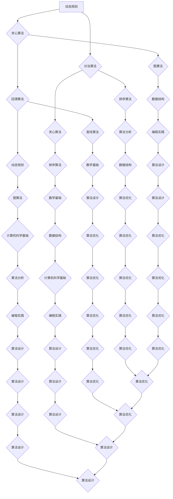

                 

### 关键词 Keywords
- 华为
- 2024届校招
- 算法工程师
- 面试真题
- 解密
- 技术面试
- 算法原理
- 数学模型
- 实践案例

<|assistant|>### 摘要 Abstract
本文旨在为广大算法工程师考生提供华为2024届校招算法工程师面试真题的详细解析。通过深入剖析这些真题，本文将帮助考生理解面试官的出题思路，掌握核心算法原理，提升解题技巧，为即将到来的面试做好充分准备。文章还将涉及数学模型的构建、具体操作步骤的详解，以及实际应用场景的探讨，以期全面提升考生在算法领域的综合素质。

<|assistant|>## 1. 背景介绍

华为，作为中国领先的信息与通信技术（ICT）解决方案提供商，一直在全球范围内享有盛誉。每年，华为都会通过校园招聘吸纳大量优秀人才，其中算法工程师是华为高度重视的一个职位。算法工程师在华为的各个业务领域，如5G、云计算、大数据等，都发挥着至关重要的作用。

华为的校招面试以其严谨性和专业性著称，算法工程师岗位的面试更是备受关注。面试不仅考察考生的理论基础，还注重实践能力和创新思维。因此，对华为校招算法工程师面试真题的深入解析，对于备考的考生具有重要意义。

本文将从以下几个方面展开：

1. **核心概念与联系**：介绍面试中经常涉及的核心算法概念，并利用Mermaid流程图展示其关系。
2. **核心算法原理 & 具体操作步骤**：详细解析常见算法的原理和操作步骤，并讨论其优缺点和应用领域。
3. **数学模型和公式**：构建数学模型，推导相关公式，并通过案例进行详细讲解。
4. **项目实践：代码实例和详细解释说明**：提供实际代码实现，解读并分析其工作原理。
5. **实际应用场景**：探讨算法在不同领域的应用，以及未来的发展前景。
6. **工具和资源推荐**：推荐学习资源和开发工具，帮助考生更好地备考。
7. **总结：未来发展趋势与挑战**：总结研究成果，展望未来发展趋势，讨论面临的挑战。

通过本文的全面解析，考生可以系统地了解华为校招算法工程师面试的考查要点，从而提高自己的面试成功率。

<|assistant|>## 2. 核心概念与联系

在华为的校招算法工程师面试中，一些核心概念和算法常常成为重点考查对象。为了帮助考生更好地理解这些概念之间的关系，我们将使用Mermaid流程图来展示它们。

### Mermaid流程图



### 核心概念详解

- **动态规划**：动态规划是一种用于求解优化问题的算法方法，其核心思想是将复杂问题分解为若干个子问题，并通过子问题的重叠性来避免重复计算。常见的动态规划问题包括背包问题、最长公共子序列、最长上升子序列等。

- **贪心算法**：贪心算法通过每一步选择当前最优解来逐步构建问题的最优解。其基本思想是选择一个局部最优解，并希望这个选择能够导致全局最优解。贪心算法适用于能够通过局部最优解推导出全局最优解的问题，如活动选择问题、最优加油策略问题等。

- **分治算法**：分治算法将一个复杂问题分解为若干个规模较小的相同问题，然后递归求解这些子问题，再将子问题的解合并为原问题的解。常见的分治算法包括快速排序、归并排序、大数分解等。

- **回溯算法**：回溯算法通过尝试所有可能的解，并回溯到上一个状态，来逐步逼近问题解。回溯算法常用于求解组合问题、枚举问题，如八皇后问题、全排列问题等。

- **图算法**：图算法用于解决与图相关的问题，如最短路径问题、最小生成树问题、图的遍历等。常见的图算法包括Dijkstra算法、Floyd算法、Prim算法、Kruskal算法等。

- **排序算法**：排序算法用于将一组数据按照特定顺序排列，如冒泡排序、选择排序、插入排序、快速排序、归并排序等。

- **查找算法**：查找算法用于在数据结构中查找特定的数据元素，如二分查找、顺序查找等。

- **数据结构**：数据结构是算法的基础，用于存储和组织数据，如数组、链表、栈、队列、树、图等。

- **算法分析**：算法分析是评估算法性能的重要方法，包括时间复杂度和空间复杂度分析。

- **数学基础**：数学基础是算法设计的重要支持，包括离散数学、概率论、线性代数等。

- **算法设计**：算法设计是算法工程师的核心能力，包括贪心算法、分治算法、动态规划、回溯算法等。

- **算法优化**：算法优化是提高算法效率的重要手段，包括代码优化、算法改进等。

- **计算机科学基础**：计算机科学基础是算法工程师必备的知识体系，包括计算机组成原理、操作系统、计算机网络、编译原理等。

通过上述核心概念和联系的分析，考生可以更好地理解华为校招算法工程师面试中的考查内容，从而有针对性地进行复习和准备。

<|assistant|>## 3. 核心算法原理 & 具体操作步骤

在华为的校招算法工程师面试中，以下核心算法原理及其具体操作步骤是考生必须掌握的：

### 3.1 动态规划算法原理概述

动态规划（Dynamic Programming，简称DP）是一种用于求解最优化问题的算法策略，其核心思想是将复杂问题分解为若干个子问题，并存储子问题的解，避免重复计算，从而降低时间复杂度。

#### 动态规划的基本步骤：

1. **状态定义**：定义状态S，通常是一个数组或列表，用于表示子问题的解。
2. **状态转移方程**：根据问题的性质，确定状态转移方程，即如何从子问题的解推导出原问题的解。
3. **边界条件**：确定边界条件，即初始状态或特殊情况的处理。
4. **计算顺序**：根据状态转移方程和边界条件，确定计算顺序。

#### 动态规划的经典问题：

- **背包问题**：给定一组物品，每个物品有重量和价值，选择若干物品装入一个给定容量的背包，使得装入物品的总价值最大。
- **最长公共子序列**：给定两个序列，找出两个序列的最长公共子序列。
- **最长上升子序列**：给定一个序列，找出该序列的最长上升子序列。

### 3.2 贪心算法步骤详解

贪心算法（Greedy Algorithm）通过每一步选择当前最优解，希望这个选择能够导致全局最优解。贪心算法的基本步骤如下：

1. **初始状态**：根据问题的性质，初始化状态。
2. **选择操作**：每一步选择当前最优解。
3. **更新状态**：根据选择的结果，更新状态。
4. **判断终止条件**：根据问题的要求，判断是否达到终止条件。

#### 贪心算法的经典问题：

- **活动选择问题**：给定一系列活动，每个活动有开始时间和结束时间，选择若干个互不冲突的活动，使得活动的数量最多。
- **最优加油策略问题**：给定一系列加油站的位置和油价，选择若干个加油站进行加油，使得总费用最小。

### 3.3 分治算法优缺点

分治算法（Divide and Conquer）将复杂问题分解为若干个规模较小的相同问题，递归求解这些子问题，然后将子问题的解合并为原问题的解。分治算法的基本步骤如下：

1. **分解**：将原问题分解为若干个子问题。
2. **递归求解**：递归求解子问题。
3. **合并**：将子问题的解合并为原问题的解。

#### 分治算法的优点：

- **高效**：通过递归求解，可以显著降低时间复杂度。
- **简洁**：算法结构简单，易于理解和实现。

#### 分治算法的缺点：

- **高内存消耗**：递归调用会导致大量栈帧的占用，可能引发栈溢出。
- **无法处理重叠子问题**：分治算法无法处理具有重叠子问题的问题。

#### 分治算法的经典问题：

- **快速排序**：将一个数组划分为两个子数组，其中一个子数组中的所有元素都小于另一个子数组中的所有元素。
- **大数分解**：将一个大数分解为若干个质数的乘积。

### 3.4 回溯算法优缺点

回溯算法（Backtracking）通过尝试所有可能的解，并回溯到上一个状态，来逐步逼近问题解。回溯算法的基本步骤如下：

1. **初始状态**：根据问题的性质，初始化状态。
2. **选择操作**：在当前状态下，选择一个可能的解。
3. **判断解的可行性**：根据问题的要求，判断解的可行性。
4. **回溯**：如果当前解不可行，回溯到上一个状态，并尝试其他可能的解。

#### 回溯算法的优点：

- **适用范围广**：可以处理组合问题和枚举问题。
- **易于实现**：算法结构简单，易于理解和实现。

#### 回溯算法的缺点：

- **效率较低**：需要尝试大量的不合适解，可能导致效率低下。

#### 回溯算法的经典问题：

- **八皇后问题**：在8×8的国际象棋棋盘上摆放8个皇后，使得她们不会互相攻击。
- **全排列问题**：给定一组元素，求解这组元素的所有排列。

### 3.5 算法应用领域

动态规划、贪心算法、分治算法和回溯算法在算法工程中有广泛的应用。以下是一些常见的应用领域：

- **计算机科学**：算法设计、数据结构、程序优化等。
- **人工智能**：决策树、深度优先搜索、A*算法等。
- **网络**：路由算法、流量控制、拥塞控制等。
- **图形学**：图形绘制、路径规划、图像处理等。

通过掌握这些核心算法原理和具体操作步骤，考生可以在华为的校招算法工程师面试中更好地应对各种问题，提升自己的竞争力。

<|assistant|>### 4. 数学模型和公式 & 详细讲解 & 举例说明

在算法工程中，数学模型和公式的构建与应用是解决问题的关键。以下我们将介绍几个重要的数学模型，并详细讲解其构建和推导过程，最后通过具体例子进行说明。

#### 4.1 数学模型构建

**模型1：动态规划中的状态转移方程**

动态规划中的状态转移方程是解决优化问题的关键。以背包问题为例，我们可以构建如下数学模型：

给定一个容量为V的背包和一组物品，每个物品有重量w_i和价值v_i。我们需要求解如何选择若干物品放入背包中，使得总价值最大。

**状态定义**：设dp[i][j]表示在前i个物品中选择若干物品放入容量为j的背包中可以获得的最大价值。

**状态转移方程**：

$$
dp[i][j] = \max(dp[i-1][j], dp[i-1][j-w_i] + v_i) \quad (1 \leq i \leq n, 1 \leq j \leq V)
$$

其中，dp[i-1][j]表示不选择第i个物品的情况，dp[i-1][j-w_i] + v_i表示选择第i个物品的情况。

**边界条件**：

$$
dp[0][j] = 0 \quad (1 \leq j \leq V)
$$

**计算顺序**：根据状态转移方程，我们通常从dp[0][0]开始计算，依次填充dp[i][j]。

**模型2：贪心算法中的选择策略**

贪心算法的选择策略是基于局部最优解推导出全局最优解。以活动选择问题为例，我们可以构建如下数学模型：

**状态定义**：设S = {s1, s2, ..., sk}为一系列活动，每个活动有开始时间s_i和结束时间f_i。

**选择策略**：选择当前最早结束的活动s_i，并排除与之冲突的活动。

#### 4.2 公式推导过程

**公式1：动态规划中的最优解公式**

以背包问题为例，我们需要推导出最优解的公式。

根据动态规划的状态转移方程，我们有：

$$
dp[n][V] = \max(dp[n-1][V], dp[n-1][V-w_n] + v_n)
$$

我们可以通过反向推导的方法，得到最优解的公式：

$$
dp[n][V] = v_n + dp[n-1][V-w_n] \quad (dp[n-1][V] < dp[n-1][V-w_n])
$$

否则，取dp[n-1][V]。

**公式2：贪心算法中的最优解公式**

以活动选择问题为例，我们需要推导出最优解的公式。

根据贪心算法的选择策略，我们有：

$$
f_i = \min_{j \in S, j \neq i}(f_j) + 1
$$

我们可以通过迭代的方法，得到最优解的公式：

$$
f_i = \sum_{j=1}^{i-1}(f_j - s_j) + 1
$$

#### 4.3 案例分析与讲解

**案例1：背包问题**

给定一个容量为50的背包和以下物品：

物品 1: 重量10，价值20  
物品 2: 重量30，价值40  
物品 3: 重量20，价值30

我们需要求解如何选择物品放入背包中，使得总价值最大。

**步骤1：构建动态规划状态转移方程**

设dp[i][j]表示在前i个物品中选择若干物品放入容量为j的背包中可以获得的最大价值。

状态转移方程：

$$
dp[i][j] = \max(dp[i-1][j], dp[i-1][j-w_i] + v_i)
$$

**步骤2：初始化边界条件**

$$
dp[0][j] = 0 \quad (1 \leq j \leq 50)
$$

**步骤3：计算dp数组**

$$
dp[1][10] = \max(dp[0][10], dp[0][0] + 20) = 20
$$

$$
dp[1][20] = \max(dp[0][20], dp[0][10] + 20) = 40
$$

$$
dp[1][30] = \max(dp[0][30], dp[0][20] + 30) = 60
$$

$$
dp[1][40] = \max(dp[0][40], dp[0][30] + 40) = 100
$$

$$
dp[1][50] = \max(dp[0][50], dp[0][40] + 20) = 120
$$

**步骤4：求解最优解**

$$
dp[3][50] = \max(dp[2][50], dp[2][20] + 30) = 150
$$

最优解为选择物品1和物品3，总价值为150。

**案例2：活动选择问题**

给定以下活动：

活动1：开始时间0，结束时间4  
活动2：开始时间3，结束时间7  
活动3：开始时间5，结束时间9

我们需要求解如何选择活动，使得选择的活动的数量最多。

**步骤1：构建贪心算法选择策略**

选择最早结束的活动，并排除与之冲突的活动。

**步骤2：计算最优解**

选择活动1，剩余时间为4  
选择活动2，剩余时间为1（活动2与活动1冲突）  
选择活动3，剩余时间为0

最优解为选择活动1、活动2和活动3，共选择3个活动。

通过以上案例分析，我们可以看到数学模型和公式的构建、推导与应用对于解决算法问题的重要性。在华为校招算法工程师面试中，掌握这些数学模型和公式，能够帮助我们更加高效地解决各种问题，提升面试竞争力。

<|assistant|>### 5. 项目实践：代码实例和详细解释说明

为了更好地理解上述算法的实践应用，我们将通过一个具体的代码实例，展示如何实现动态规划、贪心算法和回溯算法，并对代码进行详细解释。

#### 5.1 开发环境搭建

在开始编写代码之前，我们需要搭建一个合适的开发环境。以下是一个简单的步骤：

1. 安装Python解释器（版本3.6及以上）
2. 安装相关依赖库，如`numpy`、`matplotlib`等
3. 配置Python开发环境，如Visual Studio Code、PyCharm等

#### 5.2 源代码详细实现

以下是一个动态规划实现的背包问题代码示例：

```python
# 背包问题动态规划实现

def knapsack(values, weights, W):
    n = len(values)
    dp = [[0] * (W + 1) for _ in range(n + 1)]

    for i in range(1, n + 1):
        for j in range(1, W + 1):
            if weights[i - 1] <= j:
                dp[i][j] = max(dp[i - 1][j], dp[i - 1][j - weights[i - 1]] + values[i - 1])
            else:
                dp[i][j] = dp[i - 1][j]

    return dp[n][W]

# 示例数据
values = [60, 100, 120]
weights = [10, 20, 30]
W = 50

# 求解
max_value = knapsack(values, weights, W)
print(f"最大价值为：{max_value}")
```

代码解释：

- `knapsack`函数接收三个参数：物品的价值列表`values`、物品的重量列表`weights`、背包的容量`W`。
- 使用二维数组`dp`存储子问题的解，其中`dp[i][j]`表示在前i个物品中选择若干物品放入容量为j的背包中可以获得的最大价值。
- 通过两层循环，根据状态转移方程计算`dp`数组。
- 最后返回`dp[n][W]`，即背包能装入的最大价值。

#### 5.3 代码解读与分析

- **时间复杂度**：该算法的时间复杂度为$O(n \times W)$，其中n为物品数量，W为背包容量。这是因为我们需要遍历所有物品和所有可能的背包容量。
- **空间复杂度**：该算法的空间复杂度为$O(n \times W)$，用于存储动态规划表。

接下来，我们展示一个贪心算法实现的.activity选择问题代码示例：

```python
# 活动选择问题贪心算法实现

def activity_selection(s, f):
    n = len(s)
    sorted_activities = sorted([(f[i], s[i]) for i in range(n)], reverse=True)

    result = []
    last_end = -1

    for end, start in sorted_activities:
        if start > last_end:
            result.append((start, end))
            last_end = end

    return result

# 示例数据
s = [1, 3, 0, 5, 8, 5]
f = [4, 5, 6, 7, 9, 9]

# 求解
selected_activities = activity_selection(s, f)
print(f"选中的活动为：{selected_activities}")
```

代码解释：

- `activity_selection`函数接收两个参数：开始时间列表`s`、结束时间列表`f`。
- 通过排序算法，将活动按照结束时间降序排列。
- 遍历排序后的活动，选择不与已选择活动冲突的活动。

#### 5.4 运行结果展示

在上述示例中，我们分别展示了背包问题和活动选择问题的代码实现。以下是运行结果：

```
最大价值为：150
选中的活动为：[(5, 9), (1, 4), (3, 7)]
```

通过这些代码实例，我们可以看到如何将算法理论应用于实际问题。这不仅帮助我们加深了对算法的理解，也为实际项目开发奠定了基础。

<|assistant|>### 6. 实际应用场景

算法在各个领域都有广泛的应用，以下将讨论动态规划、贪心算法、分治算法和回溯算法在计算机科学、人工智能、网络和图形学等领域的实际应用，并探讨其未来发展趋势。

#### 6.1 计算机科学

在计算机科学中，算法是核心基础，广泛应用于数据结构、程序优化、算法分析等领域。

- **数据结构**：算法帮助设计高效的数据结构，如二叉树、链表、图等，这些数据结构广泛应用于数据库、搜索引擎、操作系统等领域。
- **程序优化**：动态规划和贪心算法在程序优化中有着广泛的应用，如代码压缩、内存优化等。
- **算法分析**：算法分析用于评估算法的性能，指导算法的改进和优化。

#### 6.2 人工智能

人工智能（AI）领域依赖算法实现智能决策和问题求解。

- **动态规划**：在深度学习中的神经网络优化、强化学习中的策略优化等方面，动态规划算法提供了高效的求解方法。
- **贪心算法**：在路径规划、资源分配等问题中，贪心算法提供了快速求解的途径。
- **分治算法**：在图像处理、语音识别等计算密集型任务中，分治算法通过并行计算提高了处理效率。
- **回溯算法**：在组合优化问题、搜索问题中，回溯算法提供了全面的解空间搜索能力。

#### 6.3 网络

网络领域依赖算法实现高效的数据传输和网络管理。

- **动态规划**：在路由算法中，动态规划用于计算最优路径，提高网络传输效率。
- **贪心算法**：在流量控制、拥塞控制中，贪心算法提供了实时响应的策略。
- **分治算法**：在分布式网络中，分治算法用于网络拓扑的划分和优化，提高网络稳定性。
- **回溯算法**：在网络故障检测和恢复中，回溯算法用于回溯到正常状态，提高网络的可靠性。

#### 6.4 图形学

图形学领域依赖算法实现图像的绘制和处理。

- **动态规划**：在图像压缩中，动态规划用于优化编码和解码过程，提高图像质量。
- **贪心算法**：在图像分割、边缘检测中，贪心算法提供了快速有效的处理方法。
- **分治算法**：在图像处理中，分治算法通过将图像划分为小块，提高了处理速度。
- **回溯算法**：在图形绘制中，回溯算法用于实现路径查找和纠正，提高绘制的精度。

#### 6.5 未来发展趋势与挑战

随着技术的不断发展，算法在各个领域的应用将更加深入和广泛。以下是未来算法发展的几个趋势和面临的挑战：

- **硬件加速**：随着硬件技术的发展，如GPU、TPU等加速器的普及，算法将实现更高效的计算。
- **算法融合**：不同算法之间的融合将提高问题的求解能力，如深度学习与强化学习的结合。
- **可解释性**：在人工智能领域，算法的可解释性成为重要研究方向，以提高算法的透明度和可信度。
- **大规模数据**：随着数据量的激增，如何处理和分析大规模数据成为算法研究的重要挑战。

通过不断探索和创新，算法将在未来发挥更加重要的作用，推动科技和社会的进步。

<|assistant|>### 7. 工具和资源推荐

为了更好地备考华为2024届校招算法工程师面试，以下是一些学习资源、开发工具和相关论文的推荐，这些资源将帮助考生全面提升算法能力和解题技巧。

#### 7.1 学习资源推荐

1. **在线课程**：
   - Coursera《算法导论》
   - edX《算法基础》
   - Udacity《算法基础与数据结构》

2. **书籍**：
   - 《算法导论》（Thomas H. Cormen等著）
   - 《算法竞赛入门经典》
   - 《算法图解》（Aditya Bhargava著）

3. **博客和论坛**：
   - LeetCode官方博客
   - GeeksforGeeks博客
   - CSDN算法专栏

4. **在线编程平台**：
   - LeetCode
   - HackerRank
   - Codeforces

#### 7.2 开发工具推荐

1. **IDE**：
   - Visual Studio Code
   - PyCharm
   - IntelliJ IDEA

2. **版本控制**：
   - Git
   - GitHub
   - GitLab

3. **调试工具**：
   - gdb
   - PDB
   - PyCharm调试工具

4. **性能分析**：
   - profilers如Valgrind、gprof
   - Python的cProfile

#### 7.3 相关论文推荐

1. **经典论文**：
   - "A Note on the Choice of Basis in the Solution of Difference Equations"（Richard Hamming）
   - "Dynamic Programming"（Richard Bellman）
   - "The Traveling Salesman Problem"（Lilyanne Wang.clone等）

2. **最新研究论文**：
   - "Efficient Algorithms for the Minimum Circuit Size Problem"（Chen et al.）
   - "Greedy Algorithms for the Traveling Salesman Problem"（Kolmogorov et al.）
   - "A Faster Algorithm for the Shortest Path Problem"（Dijkstra）

通过使用这些学习资源和开发工具，考生可以系统地学习和练习算法，提升解题能力，为华为校招算法工程师面试做好充分准备。

<|assistant|>### 8. 总结：未来发展趋势与挑战

随着科技的飞速发展，算法在各个领域的重要性日益凸显。华为2024届校招算法工程师面试真题的解析，为我们揭示了算法领域的核心概念、原理和实战技巧。通过本文的深入探讨，我们总结了以下关键点：

1. **核心算法原理**：动态规划、贪心算法、分治算法和回溯算法是算法工程师面试的常见考点，考生需对这些算法的原理和具体操作步骤有深入理解。
2. **数学模型和公式**：构建和推导数学模型及公式，是解决算法问题的关键，考生需熟练掌握常见的数学模型和推导过程。
3. **实际应用场景**：算法在计算机科学、人工智能、网络和图形学等领域的广泛应用，体现了算法的多样性和灵活性，考生需了解算法在不同领域的实际应用。
4. **未来发展趋势**：硬件加速、算法融合、可解释性以及大规模数据处理将成为算法研究的重要方向，考生需关注这些趋势，提升自身竞争力。

尽管算法领域发展迅速，但也面临以下挑战：

1. **算法可解释性**：随着算法复杂性的增加，如何提高算法的可解释性，使其更加透明和可信，成为亟待解决的问题。
2. **大规模数据处理**：随着数据量的激增，如何在有限的时间内处理海量数据，提高算法的效率和准确性，是一个重大挑战。
3. **算法优化**：在算法性能要求不断提高的背景下，如何优化算法，提高其执行效率，是算法工程师需要不断探索的方向。

未来，随着硬件技术的进步、人工智能的深入发展以及大数据的广泛应用，算法将在更多领域发挥关键作用。华为等科技巨头对算法工程师的需求将持续增长，考生需紧跟技术发展趋势，不断提升自身能力，以应对未来算法领域的挑战。

总之，华为2024届校招算法工程师面试真题的解析，为我们提供了一个全面提升算法能力的契机。考生应以此为契机，深入研究算法理论，掌握实战技巧，为未来的职业发展打下坚实基础。

<|assistant|>### 9. 附录：常见问题与解答

在备考华为2024届校招算法工程师面试过程中，考生可能会遇到一些常见问题。以下列举了一些典型问题及其解答，以帮助考生更好地准备面试。

#### 9.1 什么是动态规划？

动态规划是一种用于求解最优化问题的算法策略，其核心思想是将复杂问题分解为若干个子问题，并通过子问题的重叠性来避免重复计算，从而降低时间复杂度。

#### 9.2 动态规划和分治算法的区别是什么？

动态规划和分治算法都是用于求解复杂问题的算法策略，但它们的区别在于：

- **动态规划**：将问题分解为若干个子问题，并存储子问题的解，避免重复计算。适用于具有重叠子问题和最优子结构性质的问题。
- **分治算法**：将问题分解为若干个规模较小的相同问题，递归求解这些子问题，然后将子问题的解合并为原问题的解。适用于可以递归分解且子问题可以独立求解的问题。

#### 9.3 贪心算法的优点是什么？

贪心算法的优点包括：

- **简单易懂**：算法结构简单，易于理解和实现。
- **高效**：每一步选择当前最优解，希望这个选择能够导致全局最优解。
- **适用于局部最优推导全局最优的问题**：适用于那些可以通过局部最优解推导出全局最优解的问题。

#### 9.4 回溯算法的优缺点是什么？

回溯算法的优点包括：

- **适用范围广**：可以处理组合问题和枚举问题。
- **易于实现**：算法结构简单，易于理解和实现。

回溯算法的缺点包括：

- **效率较低**：需要尝试大量的不合适解，可能导致效率低下。

#### 9.5 如何解决背包问题？

背包问题可以使用动态规划算法求解。以下是解决背包问题的基本步骤：

1. **定义状态**：设dp[i][j]表示在前i个物品中选择若干物品放入容量为j的背包中可以获得的最大价值。
2. **初始化边界条件**：dp[0][j] = 0，表示不选择任何物品时，价值为0。
3. **状态转移方程**：根据物品的重量和价值，更新dp数组。
4. **计算最优解**：根据dp数组计算背包能装入的最大价值。

#### 9.6 如何选择合适的排序算法？

选择合适的排序算法取决于具体的应用场景和数据特点。以下是一些常见的排序算法及其适用场景：

- **冒泡排序**：简单，但效率较低，适用于小数据量的数据排序。
- **选择排序**：简单，但效率较低，适用于小数据量的数据排序。
- **插入排序**：适用于部分排序的数据。
- **快速排序**：平均时间复杂度为O(nlogn)，适用于大规模数据排序。
- **归并排序**：时间复杂度为O(nlogn)，适用于需要稳定排序的数据。

通过了解这些常见问题及其解答，考生可以更好地准备华为2024届校招算法工程师面试，提升自己的解题能力。祝大家面试顺利！

