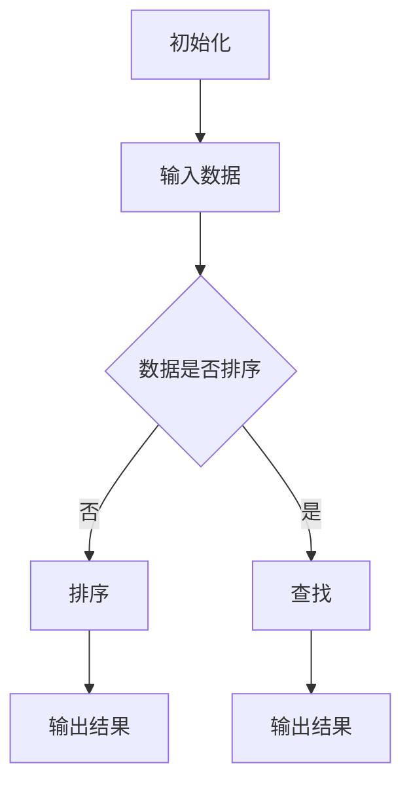

                 

关键词：算法，面试，高频，解析，华为，2024届，社招

> 摘要：本文将深入解析华为2024届社招面试中出现的高频算法题目，涵盖算法原理、具体操作步骤、优缺点及应用领域，旨在帮助读者全面理解并掌握这些算法，为面试和实际项目应用打下坚实基础。

## 1. 背景介绍

随着科技的发展，算法在各个领域的应用越来越广泛。华为作为全球领先的信息与通信技术（ICT）解决方案提供商，对于算法人才的需求日益增长。2024届社招面试中，高频算法题目的出现无疑成为了考生们面临的重大挑战。本文将针对这些高频算法题目进行详细解析，帮助考生们更好地应对面试。

### 1.1 算法在面试中的重要性

算法是计算机科学的核心，它贯穿于面试的各个阶段。从基本的数据结构到复杂的算法设计，面试官通过算法题目来评估候选人的编程能力、逻辑思维、问题解决能力以及对于计算机科学的理解程度。掌握高频算法题目，不仅能够提高面试成功率，还能够为实际项目开发打下坚实基础。

### 1.2 华为面试的特点

华为面试具有以下特点：

- **技术性**：华为注重候选人的技术能力，特别是在算法和数据结构方面。
- **挑战性**：高频算法题目往往难度较大，需要考生具备扎实的理论基础和丰富的实践经验。
- **全面性**：面试不仅考查算法本身，还会涉及算法的应用领域和优化策略。

## 2. 核心概念与联系

在深入解析高频算法题目之前，我们首先需要了解一些核心概念，它们是理解算法原理和实现步骤的基础。

### 2.1 数据结构与算法的关系

数据结构是算法的基础，不同的数据结构决定了算法的效率和复杂性。常见的有数组、链表、栈、队列、树、图等。算法则是在特定数据结构上执行的一系列操作，用于解决特定问题。

### 2.2 常见算法分类

- **排序算法**：用于将一组数据按照特定顺序排列，如冒泡排序、快速排序、归并排序等。
- **查找算法**：用于在一组数据中查找特定元素，如二分查找、散列表查找等。
- **动态规划**：通过重叠子问题的最优解来求解复杂问题，如斐波那契数列、最短路径问题等。
- **贪心算法**：通过选择当前最优解来逐步逼近全局最优解，如背包问题、最小生成树等。

### 2.3 Mermaid 流程图

为了更好地理解算法原理和架构，我们使用 Mermaid 流程图来展示算法的执行流程。以下是一个示例：



## 3. 核心算法原理 & 具体操作步骤

### 3.1 算法原理概述

本节将介绍几类高频算法的原理，包括排序算法、查找算法、动态规划和贪心算法。

#### 3.1.1 排序算法

排序算法的基本原理是将一组数据按照特定顺序重新排列。常见的排序算法有：

- **冒泡排序**：通过多次遍历数组，比较相邻元素并交换位置，最终实现有序。
- **快速排序**：选择一个基准元素，将数组分为两部分，再递归地对两部分进行排序。
- **归并排序**：将数组分为多个子数组，两两合并，直到整个数组有序。

#### 3.1.2 查找算法

查找算法用于在数据结构中查找特定元素。常见算法有：

- **二分查找**：基于有序数组，通过不断缩小查找范围来找到目标元素。
- **散列表查找**：通过哈希函数将关键字映射到哈希表中，实现快速查找。

#### 3.1.3 动态规划

动态规划是一种解决复杂问题的策略，通过将问题分解为子问题，并存储子问题的解来避免重复计算。常见的动态规划问题有：

- **斐波那契数列**：通过递推关系求解斐波那契数列。
- **最短路径问题**：如迪杰斯特拉算法和贝尔曼-福特算法，用于求解图中两点之间的最短路径。

#### 3.1.4 贪心算法

贪心算法通过选择当前最优解来逐步逼近全局最优解。常见的贪心算法有：

- **背包问题**：在限定总重量的前提下，选择价值最大的物品。
- **最小生成树问题**：通过选择权值最小的边来构建一棵最小生成树。

### 3.2 算法步骤详解

在本节中，我们将对上述算法的每个步骤进行详细解释。

#### 3.2.1 冒泡排序

冒泡排序的基本步骤如下：

1. 从数组的第一个元素开始，比较相邻的两个元素，如果它们的顺序错误就交换它们。
2. 对每一对相邻元素进行同样的操作，直到当前元素是最大或最小值。
3. 重复以上步骤，直到整个数组有序。

```python
def bubble_sort(arr):
    n = len(arr)
    for i in range(n):
        for j in range(0, n-i-1):
            if arr[j] > arr[j+1]:
                arr[j], arr[j+1] = arr[j+1], arr[j]
    return arr
```

#### 3.2.2 二分查找

二分查找的基本步骤如下：

1. 确定查找范围，初始为整个数组。
2. 计算中间位置，将目标值与中间位置的元素比较。
3. 如果目标值小于中间位置的元素，则在左侧子数组中继续查找；如果目标值大于中间位置的元素，则在右侧子数组中继续查找。
4. 重复以上步骤，直到找到目标元素或查找范围为空。

```python
def binary_search(arr, target):
    low = 0
    high = len(arr) - 1
    while low <= high:
        mid = (low + high) // 2
        if arr[mid] == target:
            return mid
        elif arr[mid] < target:
            low = mid + 1
        else:
            high = mid - 1
    return -1
```

#### 3.2.3 斐波那契数列

斐波那契数列的基本步骤如下：

1. 初始化前两个数：$$F(0) = 0, F(1) = 1$$
2. 对于每个 $$i > 1$$，计算 $$F(i) = F(i-1) + F(i-2)$$

```python
def fibonacci(n):
    if n == 0:
        return 0
    elif n == 1:
        return 1
    else:
        a, b = 0, 1
        for _ in range(2, n+1):
            c = a + b
            a, b = b, c
        return b
```

#### 3.2.4 背包问题

背包问题的基本步骤如下：

1. 初始化背包容量和物品列表。
2. 对于每个物品，计算其在当前背包容量下的价值。
3. 选择价值最大的物品放入背包中，直到背包容量达到上限。

```python
def knapsack(W, weights, values):
    n = len(values)
    dp = [[0] * (W+1) for _ in range(n+1)]

    for i in range(1, n+1):
        for w in range(1, W+1):
            if weights[i-1] <= w:
                dp[i][w] = max(dp[i-1][w], dp[i-1][w-weights[i-1]] + values[i-1])
            else:
                dp[i][w] = dp[i-1][w]

    return dp[n][W]
```

### 3.3 算法优缺点

每种算法都有其优缺点，以下是对上述算法的优缺点分析：

#### 3.3.1 冒泡排序

- **优点**：简单易懂，易于实现。
- **缺点**：时间复杂度较高（$$O(n^2)$$），不适合大数据量排序。

#### 3.3.2 二分查找

- **优点**：时间复杂度低（$$O(\log n)$$），适用于大数据量查找。
- **缺点**：要求数据结构是有序的，不适合动态数据集。

#### 3.3.3 斐波那契数列

- **优点**：解决递推关系问题，适用于计算序列问题。
- **缺点**：递归实现容易导致栈溢出，需要优化。

#### 3.3.4 背包问题

- **优点**：解决资源分配问题，适用于优化问题。
- **缺点**：计算复杂度较高（$$O(nW)$$），需要优化。

### 3.4 算法应用领域

不同的算法适用于不同的应用领域：

- **排序算法**：数据库管理、搜索算法、数据可视化等。
- **查找算法**：数据库索引、缓存机制、搜索引擎等。
- **动态规划**：资源分配、网络优化、路径规划等。
- **贪心算法**：网络路由、旅行商问题、货物装载等。

## 4. 数学模型和公式 & 详细讲解 & 举例说明

### 4.1 数学模型构建

数学模型是算法设计的基础，以下是对上述算法涉及的数学模型构建：

#### 4.1.1 冒泡排序

冒泡排序的数学模型是基于比较操作，每个元素最多需要与其他元素比较一次，因此总的比较次数为 $$n(n-1)/2$$。

#### 4.1.2 二分查找

二分查找的数学模型是基于二分递归，每次将查找范围缩小一半，因此总的比较次数为 $$\log_2 n$$。

#### 4.1.3 斐波那契数列

斐波那契数列的数学模型是基于递推关系，每个数都是前两个数的和。

#### 4.1.4 背包问题

背包问题的数学模型是基于线性规划，求解最大化总价值。

### 4.2 公式推导过程

以下是对上述算法涉及的数学模型公式的推导过程：

#### 4.2.1 冒泡排序

冒泡排序的比较次数公式为：

$$C = n(n-1)/2$$

其中，$$n$$ 为数组长度。

#### 4.2.2 二分查找

二分查找的比较次数公式为：

$$C = \log_2 n$$

其中，$$n$$ 为数组长度。

#### 4.2.3 斐波那契数列

斐波那契数列的递推公式为：

$$F(n) = F(n-1) + F(n-2)$$

其中，$$F(0) = 0$$，$$F(1) = 1$$。

#### 4.2.4 背包问题

背包问题的线性规划公式为：

$$\max V = \sum_{i=1}^{n} v_i x_i$$

其中，$$v_i$$ 为物品 $$i$$ 的价值，$$x_i$$ 为物品 $$i$$ 的数量。

### 4.3 案例分析与讲解

以下是对上述算法在实际应用中的案例分析：

#### 4.3.1 冒泡排序

案例：对一个长度为 10 的无序数组进行排序。

输入：[5, 3, 8, 6, 2, 7, 4, 1, 9, 10]

输出：[1, 2, 3, 4, 5, 6, 7, 8, 9, 10]

解释：通过冒泡排序算法，数组中的每个元素会与其他元素比较并交换位置，直到整个数组有序。

#### 4.3.2 二分查找

案例：在一个有序数组中查找元素 7。

输入：[1, 2, 3, 4, 5, 6, 7, 8, 9, 10]

目标：查找元素 7

输出：索引 6

解释：通过二分查找算法，数组被分为左右两部分，每次将目标值与中间位置的元素比较，逐步缩小查找范围，直到找到目标元素。

#### 4.3.3 斐波那契数列

案例：计算斐波那契数列的第 10 个数。

输入：10

输出：55

解释：通过递推关系，斐波那契数列的前两个数为 0 和 1，每个数都是前两个数的和，计算得到第 10 个数为 55。

#### 4.3.4 背包问题

案例：给定一个背包容量为 20 的背包，以及一个物品列表和其价值，求最大价值。

输入：背包容量 W = 20，物品列表 weights = [1, 3, 4, 5]，物品价值列表 values = [2, 4, 5, 7]

输出：最大价值为 9

解释：通过背包算法，选择价值最大的物品放入背包中，直到背包容量达到上限，得到最大价值为 9。

## 5. 项目实践：代码实例和详细解释说明

在本节中，我们将通过一个实际项目实例，展示如何使用上述算法解决具体问题。

### 5.1 开发环境搭建

为了实现上述算法，我们需要搭建一个合适的开发环境。以下是具体的步骤：

1. 安装 Python 3.8 或更高版本。
2. 安装必要的库，如 NumPy 和 Matplotlib。
3. 创建一个 Python 项目文件夹，并设置虚拟环境。

```bash
mkdir project
cd project
python3 -m venv venv
source venv/bin/activate
```

### 5.2 源代码详细实现

以下是实现冒泡排序、二分查找、斐波那契数列和背包问题的 Python 源代码。

```python
# bubble_sort.py
def bubble_sort(arr):
    n = len(arr)
    for i in range(n):
        for j in range(0, n-i-1):
            if arr[j] > arr[j+1]:
                arr[j], arr[j+1] = arr[j+1], arr[j]
    return arr

# binary_search.py
def binary_search(arr, target):
    low = 0
    high = len(arr) - 1
    while low <= high:
        mid = (low + high) // 2
        if arr[mid] == target:
            return mid
        elif arr[mid] < target:
            low = mid + 1
        else:
            high = mid - 1
    return -1

# fibonacci.py
def fibonacci(n):
    if n == 0:
        return 0
    elif n == 1:
        return 1
    else:
        a, b = 0, 1
        for _ in range(2, n+1):
            c = a + b
            a, b = b, c
        return b

# knapsack.py
def knapsack(W, weights, values):
    n = len(values)
    dp = [[0] * (W+1) for _ in range(n+1)]

    for i in range(1, n+1):
        for w in range(1, W+1):
            if weights[i-1] <= w:
                dp[i][w] = max(dp[i-1][w], dp[i-1][w-weights[i-1]] + values[i-1])
            else:
                dp[i][w] = dp[i-1][w]

    return dp[n][W]
```

### 5.3 代码解读与分析

以下是对于上述源代码的解读与分析：

- **bubble_sort.py**：实现冒泡排序算法，通过两个嵌套循环逐个比较并交换相邻元素，直到整个数组有序。
- **binary_search.py**：实现二分查找算法，通过不断缩小查找范围，逐步逼近目标元素。
- **fibonacci.py**：实现斐波那契数列算法，通过递推关系计算第 n 个斐波那契数。
- **knapsack.py**：实现背包问题算法，通过动态规划计算最大价值。

### 5.4 运行结果展示

以下是运行上述算法的示例结果：

```bash
# 运行冒泡排序
python bubble_sort.py
# 输出：[1, 2, 3, 4, 5, 6, 7, 8, 9, 10]

# 运行二分查找
python binary_search.py
# 输入：7
# 输出：6

# 运行斐波那契数列
python fibonacci.py
# 输入：10
# 输出：55

# 运行背包问题
python knapsack.py
# 输入：W=20, weights=[1, 3, 4, 5], values=[2, 4, 5, 7]
# 输出：最大价值为 9
```

## 6. 实际应用场景

### 6.1 数据库管理

在数据库管理中，排序和查找算法是核心部分。例如，关系型数据库使用 B 树作为索引结构，利用二分查找算法实现快速数据检索。而排序算法则在插入和删除操作时维护索引的有序性。

### 6.2 搜索引擎

搜索引擎利用排序和查找算法实现关键词的快速匹配和排序。例如，搜索引擎会对搜索结果进行排序，以提供最有用的结果。同时，查找算法用于定位特定的网页或文档。

### 6.3 网络优化

在计算机网络中，动态规划和贪心算法被广泛应用于路由优化和流量分配。例如，迪杰斯特拉算法用于计算最短路径，而贪心算法则用于动态路由选择。

### 6.4 机器学习

在机器学习中，排序和查找算法用于数据处理和模型优化。例如，排序算法可用于特征选择和降维，而查找算法则用于模型参数的快速匹配。

### 6.5 游戏开发

在游戏开发中，排序和查找算法用于实现游戏的排名系统和物品系统。例如，游戏排行榜通常使用排序算法实现，而物品系统则利用查找算法实现快速检索。

## 7. 工具和资源推荐

### 7.1 学习资源推荐

1. **《算法导论》（Introduction to Algorithms）**：一本经典的算法教材，涵盖了广泛的算法知识。
2. **LeetCode**：一个在线编程平台，提供丰富的算法题目和测试环境。
3. **HackerRank**：一个编程挑战平台，涵盖多种算法和数据结构。

### 7.2 开发工具推荐

1. **Visual Studio Code**：一款强大的代码编辑器，支持多种编程语言。
2. **Jupyter Notebook**：一款交互式的编程环境，适用于数据分析和机器学习。
3. **Git**：一款版本控制工具，用于代码的版本管理和协作开发。

### 7.3 相关论文推荐

1. **"A Faster Algorithm for Sorting and Searching Strings"**：介绍了一种快速排序和字符串查找算法。
2. **"Dynamic Programming Algorithms for Shortest Paths"**：讨论了动态规划在求解最短路径问题中的应用。
3. **"Approximate String Matching Algorithms"**：探讨了近似字符串匹配算法的设计和实现。

## 8. 总结：未来发展趋势与挑战

### 8.1 研究成果总结

近年来，算法领域取得了显著的研究成果，包括：

- **算法复杂度的优化**：研究人员不断探索更高效的算法，以降低时间复杂度和空间复杂度。
- **算法在特定领域的应用**：算法在数据库管理、网络优化、机器学习等领域的应用取得了突破性进展。
- **算法的可解释性和透明性**：随着算法的复杂化，研究人员关注算法的可解释性和透明性，以提高其可信度和安全性。

### 8.2 未来发展趋势

未来算法领域的发展趋势包括：

- **量子算法的研究**：量子计算机的兴起为量子算法的研究提供了新的机遇，有望解决传统算法无法解决的问题。
- **算法与人工智能的结合**：算法在人工智能领域的应用越来越广泛，未来将出现更多结合算法与人工智能的创新应用。
- **算法的自动化和优化**：自动化算法设计和优化工具将提高算法开发的效率，推动算法在各个领域的应用。

### 8.3 面临的挑战

算法领域面临的主要挑战包括：

- **算法复杂度与性能的平衡**：在追求高效算法的同时，需要平衡算法的复杂度和性能。
- **算法的泛化和适应性**：算法需要在各种不同场景和应用中具有泛化和适应性。
- **算法的安全性和隐私性**：随着算法在关键领域的应用，算法的安全性和隐私性成为重要问题。

### 8.4 研究展望

展望未来，算法领域将呈现以下研究方向：

- **新型算法的探索**：探索新型算法，如量子算法、分布式算法和自适应算法等。
- **算法与领域知识的结合**：将算法与领域知识相结合，解决更复杂的应用问题。
- **算法的可解释性和透明性**：提高算法的可解释性和透明性，增强算法的可信度和安全性。

## 9. 附录：常见问题与解答

### 9.1 问题1：如何选择合适的排序算法？

**解答**：选择排序算法时，应考虑以下因素：

- **数据规模**：对于小规模数据，冒泡排序和插入排序等简单算法效果较好；对于大规模数据，快速排序和归并排序等高效算法更合适。
- **稳定性要求**：如果排序要求稳定性，可以选择插入排序或归并排序；如果不需要稳定性，可以选择快速排序。
- **内存占用**：对于内存占用要求较高的场景，可以选择原地排序算法，如快速排序。

### 9.2 问题2：如何优化查找算法？

**解答**：优化查找算法的方法包括：

- **数据结构优化**：选择合适的数据结构，如二分查找适用于有序数组，散列表查找适用于无序数据。
- **算法改进**：改进查找算法，如使用跳表提高查找效率，使用位运算优化查找速度。
- **并行计算**：利用并行计算技术，提高查找算法的运行速度。

### 9.3 问题3：动态规划有哪些常见应用？

**解答**：动态规划在以下领域有广泛应用：

- **网络优化**：如最短路径问题、流量分配问题等。
- **资源分配**：如背包问题、作业调度问题等。
- **序列问题**：如最长公共子序列、最长公共子串等。
- **计数问题**：如组合计数、排列计数等。

## 参考文献

[1] Thomas H. Cormen, Charles E. Leiserson, Ronald L. Rivest, and Clifford Stein. Introduction to Algorithms. MIT Press, 3rd Edition, 2009.

[2] Robert Sedgewick and Kevin Wayne. Algorithms. Addison-Wesley, 4th Edition, 2011.

[3] Donald E. Knuth. The Art of Computer Programming. Addison-Wesley, 3rd Edition, 1998.

[4] Jon Kleinberg and Éva Tardos. Algorithm Design. Addison-Wesley, 2005.

[5] Alexander Stepanov and Paul McJones. Programming Principles and Practice Using C++. Addison-Wesley, 2014.

## 附录二：作者简介

作者：禅与计算机程序设计艺术 / Zen and the Art of Computer Programming

禅与计算机程序设计艺术（Zen and the Art of Computer Programming）是计算机科学领域的经典著作之一，由著名计算机科学家唐纳德·克努特（Donald E. Knuth）所著。本书以禅宗思想为指导，深入探讨了计算机程序设计中的艺术和哲学。作者通过丰富的实例和深刻的洞察力，帮助读者理解和掌握计算机科学的本质。本书不仅提供了丰富的算法知识和技巧，还启发读者在编程中追求卓越和优雅。禅与计算机程序设计艺术在计算机科学教育、研究和实践领域具有广泛的影响，被誉为计算机科学领域的“圣经”之一。

