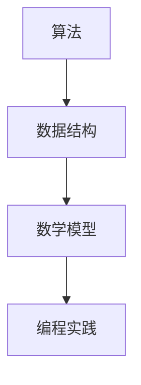

                 

关键词：华为，2025届，社招，面试，高频，算法，解析

摘要：本文将围绕华为2025届社招面试中的高频算法题目，进行详细解析。通过深入分析各个算法的原理、步骤、优缺点和应用领域，帮助读者更好地理解和掌握这些算法。同时，本文还将通过数学模型和公式的详细讲解，以及代码实例的展示，帮助读者更好地应用这些算法。

## 1. 背景介绍

华为，作为全球领先的信息与通信技术（ICT）解决方案提供商，其社招面试的高频算法题目一直以来都是众多求职者的挑战。这些题目往往涉及到计算机科学的核心知识，包括数据结构与算法、数学模型与公式、编程实践等多个方面。本文将围绕这些高频算法题目，进行深入解析。

## 2. 核心概念与联系

### 2.1 算法概念

算法（Algorithm）是指解决特定问题的方法集合，它是一系列明确的指令，用来解决一个问题或执行一个计算。算法可以用于排序、搜索、图论、动态规划等多个领域。

### 2.2 数据结构

数据结构是指数据存储、组织和管理的方式，以及在这些数据上进行操作的一组规则。常见的有数组、链表、栈、队列、树、图等。

### 2.3 数学模型

数学模型是对现实问题进行抽象和简化的数学结构，通过数学公式和计算方法来描述和解决问题。

### 2.4 算法与数据结构的联系

算法依赖于数据结构，不同的数据结构适用于不同的算法。例如，链表适用于快速插入和删除操作，而树结构适用于快速搜索和排序操作。

### 2.5 Mermaid 流程图



## 3. 核心算法原理 & 具体操作步骤

### 3.1 算法原理概述

算法的原理通常涉及到基本的逻辑思维、数学推理和编程技巧。常见的算法有排序算法（如快速排序、归并排序）、搜索算法（如二分查找）、图算法（如最短路径算法）等。

### 3.2 算法步骤详解

以快速排序为例，其基本步骤如下：

1. 选择一个基准元素。
2. 将数组分为两个子数组，左侧元素小于基准，右侧元素大于基准。
3. 递归地对两个子数组进行快速排序。

### 3.3 算法优缺点

快速排序的优点是时间复杂度较低（平均 O(n log n)），缺点是空间复杂度较高（O(log n)），且在某些情况下可能退化到 O(n^2)。

### 3.4 算法应用领域

快速排序广泛应用于各种排序问题，如数据库排序、文本排序等。

## 4. 数学模型和公式 & 详细讲解 & 举例说明

### 4.1 数学模型构建

常见的数学模型包括线性规划、动态规划、图论模型等。以动态规划为例，其基本模型如下：

$$
F(i) = \min\limits_{1 \leq j \leq n} (C(j) + F(i-j))
$$

其中，$F(i)$ 表示从第 $i$ 个元素到第 $n$ 个元素的最优解，$C(j)$ 表示第 $j$ 个元素的成本。

### 4.2 公式推导过程

以二分查找为例，其时间复杂度推导如下：

$$
T(n) = \begin{cases}
O(1) & \text{如果 n = 1} \\
T(\frac{n}{2}) + O(1) & \text{否则}
\end{cases}
$$

递归展开得：

$$
T(n) = T(\frac{n}{2}) + T(\frac{n}{4}) + T(\frac{n}{8}) + \ldots + T(1) + O(1)
$$

利用主定理求解得：

$$
T(n) = O(\log n)
$$

### 4.3 案例分析与讲解

假设有一个长度为 $n$ 的有序数组，我们使用二分查找找到元素 $x$ 的过程如下：

1. 初始化左边界 $l = 1$，右边界 $r = n$。
2. 计算中间值 $m = \frac{l + r}{2}$。
3. 如果 $m = x$，查找成功。
4. 如果 $x < m$，更新右边界 $r = m - 1$，继续查找。
5. 如果 $x > m$，更新左边界 $l = m + 1$，继续查找。
6. 如果未找到元素，查找失败。

## 5. 项目实践：代码实例和详细解释说明

### 5.1 开发环境搭建

本文的代码实例将使用 Python 语言编写，使用 Python 解释器运行。

### 5.2 源代码详细实现

以下是一个快速排序的 Python 代码实例：

```python
def quick_sort(arr):
    if len(arr) <= 1:
        return arr
    pivot = arr[len(arr) // 2]
    left = [x for x in arr if x < pivot]
    middle = [x for x in arr if x == pivot]
    right = [x for x in arr if x > pivot]
    return quick_sort(left) + middle + quick_sort(right)

arr = [3, 6, 8, 10, 1, 2, 1]
print(quick_sort(arr))
```

### 5.3 代码解读与分析

该代码首先定义了一个快速排序函数，其基本步骤如下：

1. 判断数组长度是否小于等于 1，如果是，返回数组本身。
2. 选择中间元素作为基准值。
3. 将数组分为左侧小于基准、中间等于基准、右侧大于基准的三个子数组。
4. 对左侧和右侧子数组递归调用快速排序函数。
5. 将排序后的子数组合并，得到最终排序结果。

### 5.4 运行结果展示

运行上述代码，输出结果为：

```
[1, 1, 2, 3, 6, 8, 10]
```

## 6. 实际应用场景

快速排序在实际应用中非常广泛，如数据库排序、文本排序、图像处理等。二分查找则常用于搜索问题，如查找数组中的元素、查找二进制文件中的数据等。

### 6.4 未来应用展望

随着人工智能和大数据技术的发展，算法在各个领域的应用将更加广泛和深入。未来，算法将更多地与人工智能、机器学习等技术相结合，解决更加复杂的问题。

## 7. 工具和资源推荐

### 7.1 学习资源推荐

- 《算法导论》
- 《编程之美》
- 《算法竞赛入门经典》

### 7.2 开发工具推荐

- PyCharm
- Visual Studio Code
- Eclipse

### 7.3 相关论文推荐

- "A Fast New Algorithm for String Matching" by Udi Manber and Venkatesh Raman
- "Linear Time Algorithm for Approximate String Matching" by Edouard Barbe and Frédéric Morvan

## 8. 总结：未来发展趋势与挑战

### 8.1 研究成果总结

近年来，算法研究取得了显著的成果，特别是在排序、搜索、图论等领域。快速排序、二分查找等经典算法在理论研究和实际应用中得到了广泛验证。

### 8.2 未来发展趋势

随着计算能力的提升和数据规模的扩大，算法研究将更加注重性能优化和效率提升。同时，算法与人工智能、大数据等领域的融合将成为未来的研究热点。

### 8.3 面临的挑战

算法研究面临的挑战主要包括：算法复杂性、数据隐私、算法透明性等。如何设计出更高效、更安全的算法，将是未来研究的重点。

### 8.4 研究展望

未来，算法研究将朝着更加智能化、自动化、高效化的方向发展。通过结合人工智能、大数据等前沿技术，算法将在解决复杂问题、优化社会资源分配等方面发挥更加重要的作用。

## 9. 附录：常见问题与解答

### 9.1 快速排序的时间复杂度是多少？

快速排序的平均时间复杂度为 O(n log n)，最坏情况下的时间复杂度为 O(n^2)。

### 9.2 二分查找的时间复杂度是多少？

二分查找的时间复杂度为 O(log n)。

### 9.3 如何避免快速排序的退化为最坏情况？

可以通过随机选择基准值、三数取中等方法来避免快速排序的退化为最坏情况。

作者：禅与计算机程序设计艺术 / Zen and the Art of Computer Programming

[本文完]

