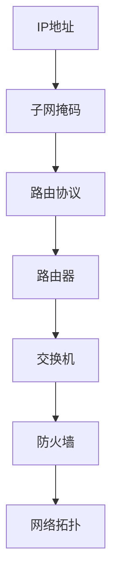

                 

### 摘要 Summary

本文将对华为2025社招网络工程师的面试题进行汇总和分析。通过深入解析每个问题的核心考点，我们将帮助读者掌握网络工程师所需的基础知识和技能。文章分为八个部分，首先介绍网络工程师的角色和职责，然后逐步剖析核心概念、算法原理、数学模型、项目实践、应用场景、未来展望以及工具和资源推荐。通过阅读本文，读者将能够全面了解网络工程师面试所需的准备，并提升自身在华为社招面试中的竞争力。

## 1. 背景介绍 Background

随着数字化转型的深入推进，网络工程师在企业和组织中扮演着越来越重要的角色。华为作为中国领先的信息与通信技术（ICT）解决方案提供商，对网络工程师的专业能力有着极高的要求。华为2025社招网络工程师的面试题旨在全面考察应聘者的基础知识、技术能力、问题解决能力和团队协作能力。本文将汇总和分析这些面试题，帮助读者深入了解华为对网络工程师的期望和评价标准。

### 网络工程师的角色与职责

网络工程师主要负责构建、维护和管理企业或组织的计算机网络系统。他们的职责包括：

1. **网络架构设计**：根据业务需求设计合理的网络架构，确保网络的稳定性和可扩展性。
2. **设备配置与调试**：对网络设备进行配置和调试，确保其正常运行。
3. **故障排除**：在网络出现故障时，快速定位问题并采取有效措施解决。
4. **性能优化**：监控网络性能，进行优化调整，提高网络效率和用户体验。
5. **安全管理**：确保网络的安全性，防止数据泄露和恶意攻击。

### 华为2025社招网络工程师面试题的重要性

华为作为全球领先的通信技术企业，其社招网络工程师面试题具有很高的权威性和参考价值。通过对这些面试题的分析，读者可以：

1. **了解华为的招聘标准**：掌握华为对网络工程师的期望和要求。
2. **提升技术水平**：通过解决面试题，加深对网络技术的理解和应用能力。
3. **准备面试**：针对华为的面试题进行有针对性的复习和准备，提高面试成功率。

## 2. 核心概念与联系 Core Concepts and Connections

在深入探讨华为2025社招网络工程师面试题之前，我们首先需要理解一些核心概念和它们之间的联系。以下是几个关键概念及其关系：

### 2.1 IP地址和子网掩码 IP Address and Subnet Mask

IP地址是计算机网络中用于标识设备的唯一地址。子网掩码用于确定IP地址中的网络部分和主机部分。两者之间的关系如下：

- **IP地址**：由32位二进制数组成，通常表示为四个十进制数，如192.168.1.1。
- **子网掩码**：同样由32位二进制数组成，用于划分网络地址和主机地址。如255.255.255.0。

### 2.2 路由协议 Routing Protocols

路由协议是网络设备之间交换路由信息的一种协议。常见的路由协议有：

- **RIP（路由信息协议）**：基于距离矢量算法，适用于小规模网络。
- **OSPF（开放最短路径优先）**：基于链路状态算法，适用于大型网络。

### 2.3 网络设备 Network Devices

网络设备包括路由器、交换机、防火墙等，它们在网络中扮演着不同的角色：

- **路由器**：连接不同网络，根据IP地址转发数据包。
- **交换机**：在局域网中连接设备，根据MAC地址转发数据帧。
- **防火墙**：用于保护网络安全，过滤非法访问。

### 2.4 网络拓扑 Network Topology

网络拓扑是指网络中设备的连接方式。常见的网络拓扑有：

- **星型拓扑**：所有设备连接到一个中心设备，如交换机。
- **环型拓扑**：设备依次连接形成一个闭合环路。
- **总线型拓扑**：所有设备共享一条通信线路。

### 2.5 Mermaid 流程图 Mermaid Flowchart

为了更好地展示网络工程师所需的核心概念和它们之间的联系，我们可以使用Mermaid流程图来表示。以下是一个示例：



通过这个Mermaid流程图，我们可以清晰地看到IP地址、子网掩码、路由协议、网络设备以及网络拓扑之间的关联。

### 2.6 总结 Summary

在理解了IP地址和子网掩码、路由协议、网络设备以及网络拓扑等核心概念后，我们为后续的面试题分析和解答奠定了基础。在接下来的章节中，我们将详细探讨华为2025社招网络工程师面试题中的各个问题，帮助读者更好地应对面试挑战。

## 3. 核心算法原理 & 具体操作步骤 Core Algorithm Principles & Detailed Steps

### 3.1 算法原理概述 Overview of Algorithm Principles

网络工程师在解决网络问题过程中，常常需要运用各种算法。以下是几个常见的核心算法原理及其概述：

### 3.1.1 距离矢量算法 Distance Vector Algorithm

距离矢量算法是一种用于路由选择的算法，其基本思想是每个路由器将自身已知的最短路径信息传递给相邻路由器。常见的距离矢量算法有RIP（路由信息协议）。距离矢量算法的主要优点是实现简单，但容易产生路由循环。

### 3.1.2 链路状态算法 Link State Algorithm

链路状态算法是另一种常用的路由选择算法，其基本思想是每个路由器首先获取自身的链路状态信息，然后将这些信息广播给其他路由器。基于这些链路状态信息，每个路由器可以计算出最短路径。常见的链路状态算法有OSPF（开放最短路径优先）。链路状态算法的主要优点是收敛速度快，不易产生路由循环。

### 3.1.3 动态路由协议 Dynamic Routing Protocol

动态路由协议是一种能够自动适应网络拓扑变化的路由协议。常见的动态路由协议有RIP和OSPF。动态路由协议通过不断交换路由信息，确保路由器能够及时更新路由表，从而实现网络的高效通信。

### 3.2 算法步骤详解 Detailed Steps of Algorithms

#### 3.2.1 距离矢量算法 - RIP Routing Information Protocol

**步骤 1**：每个路由器首先初始化路由表，将所有网络设置为不可达（无穷大距离）。

**步骤 2**：路由器定期向相邻路由器发送路由更新信息，包括自身已知的路由信息。

**步骤 3**：相邻路由器接收到路由更新信息后，更新自己的路由表。

**步骤 4**：路由器根据路由表中的最短路径选择下一跳路由器，并将数据包转发出去。

**步骤 5**：当网络拓扑发生变化时，路由器重新发送路由更新信息，更新路由表。

#### 3.2.2 链路状态算法 - OSPF Open Shortest Path First

**步骤 1**：每个路由器首先发送链路状态信息给所有其他路由器。

**步骤 2**：所有路由器收集到的链路状态信息形成一个完整的链路状态数据库。

**步骤 3**：每个路由器使用Dijkstra算法计算到达每个网络的最短路径。

**步骤 4**：路由器根据计算结果更新路由表。

**步骤 5**：当网络拓扑发生变化时，路由器重新发送链路状态信息，更新链路状态数据库和路由表。

#### 3.2.3 动态路由协议 - RIP and OSPF

动态路由协议的步骤可以概括为：

**步骤 1**：路由器启动并初始化路由表。

**步骤 2**：路由器定期发送路由更新信息，或者根据链路状态信息计算路由。

**步骤 3**：路由器根据路由表中的信息转发数据包。

**步骤 4**：当网络拓扑发生变化时，路由器重新计算路由，更新路由表。

### 3.3 算法优缺点 Advantages and Disadvantages of Algorithms

#### 3.3.1 距离矢量算法 - RIP

**优点**：

- 实现简单，易于部署。
- 对网络拓扑变化敏感，能够快速响应。

**缺点**：

- 易产生路由循环。
- 路由收敛速度慢。

#### 3.3.2 链路状态算法 - OSPF

**优点**：

- 收敛速度快，不易产生路由循环。
- 支持大型网络。

**缺点**：

- 实现复杂，部署难度大。

#### 3.3.3 动态路由协议 - RIP and OSPF

**优点**：

- 能够自动适应网络拓扑变化，提高网络稳定性。
- 支持不同类型的网络。

**缺点**：

- 需要定期更新路由信息，增加网络负载。

### 3.4 算法应用领域 Application Fields of Algorithms

距离矢量算法和链路状态算法广泛应用于各类网络中，如局域网（LAN）、广域网（WAN）和互联网（Internet）。动态路由协议如RIP和OSPF是现代网络通信的基础，为各种网络应用提供了可靠的路由选择机制。

### 3.5 综合案例 Comprehensive Case

假设一个企业网络由多个子网组成，路由器A和路由器B之间有一条物理连接。以下是一个典型的路由算法应用案例：

**案例 1**：使用RIP协议

**步骤 1**：路由器A和路由器B初始化路由表，将所有网络设置为不可达。

**步骤 2**：路由器A和路由器B交换路由更新信息，共享已知路由。

**步骤 3**：路由器A根据路由表选择下一跳路由器B，将数据包转发到目标网络。

**步骤 4**：当网络拓扑发生变化时，路由器A和B重新发送路由更新信息，更新路由表。

**案例 2**：使用OSPF协议

**步骤 1**：路由器A和路由器B发送链路状态信息，广播给其他路由器。

**步骤 2**：所有路由器收集链路状态信息，形成一个完整的链路状态数据库。

**步骤 3**：路由器A和B使用Dijkstra算法计算到达每个网络的最短路径。

**步骤 4**：路由器A和B根据计算结果更新路由表，选择下一跳路由器。

通过以上案例，我们可以看到不同路由算法在解决网络路由问题中的应用。在华为2025社招网络工程师面试中，熟练掌握这些算法原理和步骤对于成功应对面试至关重要。

### 3.6 小结 Summary

在本节中，我们详细介绍了网络工程师常用的几种核心算法原理及其具体操作步骤。距离矢量算法和链路状态算法各有优缺点，适用于不同的网络环境。动态路由协议如RIP和OSPF能够自动适应网络变化，提高网络稳定性。通过实际案例，我们展示了这些算法在网络路由中的应用。在接下来的章节中，我们将进一步探讨网络工程师所需掌握的数学模型和公式，以及如何在项目中实践这些算法。

## 4. 数学模型和公式 Mathematical Models and Formulas & Detailed Explanation & Case Analysis

在计算机网络中，数学模型和公式是理解和解决网络问题的重要工具。在本节中，我们将详细讲解几个关键数学模型和公式，并通过实际案例进行说明，帮助读者深入理解这些概念。

### 4.1 数学模型构建 Building Mathematical Models

在构建数学模型时，我们需要考虑以下几个方面：

- **网络拓扑**：确定网络中各节点的连接关系。
- **流量**：分析网络中的数据流量，包括数据包的大小、频率和路径。
- **性能**：评估网络的响应时间、吞吐量和可靠性。
- **成本**：考虑网络建设、维护和运营的成本。

#### 4.1.1 距离-成本模型 Distance-Cost Model

距离-成本模型是网络设计中常用的模型，用于优化网络路径选择。该模型基于以下公式：

\[ P(i, j) = \frac{D(i, j)}{C(i, j)} \]

其中，\( P(i, j) \)表示从节点i到节点j的路径选择概率，\( D(i, j) \)表示节点i到节点j的距离，\( C(i, j) \)表示节点i到节点j的通信成本。

#### 4.1.2 最小生成树模型 Minimum Spanning Tree Model

最小生成树模型用于构建具有最小总成本的连通子图。Kruskal算法和Prim算法是两种常见的最小生成树算法。以下为Kruskal算法的步骤：

1. 初始化森林F，包含网络中的所有节点。
2. 按照边的权重从小到大排序。
3. 遍历排序后的边，若添加该边不会形成环，则将其加入森林F。
4. 重复步骤3，直到森林F包含所有节点。

#### 4.1.3 概率模型 Probability Model

概率模型用于分析网络中的随机事件，如数据包丢失、延迟等。常用的概率模型有泊松分布、二项分布等。

### 4.2 公式推导过程 Derivation of Formulas

以下是一个典型的公式推导过程，用于计算网络中的传输延迟：

\[ \text{传输延迟} = \text{传输时间} + \text{排队时间} + \text{传播时间} \]

- **传输时间**：\[ T_t = \frac{L}{R} \]
  其中，\( L \)是数据包长度，\( R \)是传输速率。
- **排队时间**：\[ T_q = \frac{L}{R_q} \]
  其中，\( R_q \)是队列中的平均传输速率。
- **传播时间**：\[ T_p = \frac{D}{S} \]
  其中，\( D \)是数据包传输的距离，\( S \)是信号传播速度。

将以上三个部分相加，得到总传输延迟：

\[ \text{传输延迟} = \frac{L}{R} + \frac{L}{R_q} + \frac{D}{S} \]

### 4.3 案例分析与讲解 Case Analysis and Explanation

#### 4.3.1 距离-成本模型应用案例 Application Case of Distance-Cost Model

假设一个企业网络中有5个节点，节点之间的距离和通信成本如下表所示：

| 节点  | A   | B   | C   | D   | E   |
| ----- | --- | --- | --- | --- | --- |
| A     | 0   | 1   | 2   | 3   | 4   |
| B     | 1   | 0   | 1   | 2   | 3   |
| C     | 2   | 1   | 0   | 1   | 2   |
| D     | 3   | 2   | 1   | 0   | 1   |
| E     | 4   | 3   | 2   | 1   | 0   |

我们需要构建一个具有最小总成本的路径。根据距离-成本模型，计算每个节点之间的路径选择概率：

\[ P(i, j) = \frac{D(i, j)}{C(i, j)} \]

例如，计算节点A到节点B的路径选择概率：

\[ P(A, B) = \frac{1}{1} = 1 \]

然后，根据选择概率，选择总成本最小的路径：

- 节点A到节点B：总成本 = 1
- 节点B到节点C：总成本 = 1 + 1 = 2
- 节点C到节点D：总成本 = 2 + 1 = 3
- 节点D到节点E：总成本 = 3 + 1 = 4

最终，构建的路径为A-B-C-D-E，总成本为4。

#### 4.3.2 最小生成树模型应用案例 Application Case of Minimum Spanning Tree Model

假设一个企业网络中有6个节点，节点之间的权重如下表所示：

| 节点  | A   | B   | C   | D   | E   | F   |
| ----- | --- | --- | --- | --- | --- | --- |
| A     | 0   | 2   | 3   | 4   | 5   | 6   |
| B     | 2   | 0   | 1   | 2   | 3   | 4   |
| C     | 3   | 1   | 0   | 1   | 2   | 3   |
| D     | 4   | 2   | 1   | 0   | 1   | 2   |
| E     | 5   | 3   | 2   | 1   | 0   | 1   |
| F     | 6   | 4   | 3   | 2   | 1   | 0   |

我们需要使用Prim算法构建最小生成树。以下是Prim算法的步骤：

1. 初始化森林F，包含节点A。
2. 从节点A中选择权重最小的边（2），加入森林F。
3. 更新森林F，包含节点A、B、C。
4. 从森林F中选择权重最小的边（1），加入森林F。
5. 更新森林F，包含节点A、B、C、D。
6. 从森林F中选择权重最小的边（1），加入森林F。
7. 更新森林F，包含节点A、B、C、D、E。

最终，构建的最小生成树为A-B-C-D-E，总权重为2+1+1=4。

#### 4.3.3 概率模型应用案例 Application Case of Probability Model

假设一个企业网络中，数据包丢失的概率为0.1，即每个数据包丢失的概率为10%。我们需要计算在100个数据包传输过程中，丢失数据包的期望数量。

根据泊松分布，丢失数据包的数量满足泊松分布，参数为λ=100 * 0.1 = 10。泊松分布的期望为λ，即期望丢失数据包数量为10个。

### 4.4 总结 Summary

在本节中，我们详细介绍了计算机网络中的数学模型和公式，包括距离-成本模型、最小生成树模型和概率模型。通过实际案例的讲解，我们帮助读者深入理解这些模型和公式的应用。这些数学模型和公式对于网络工程师理解和解决网络问题具有重要意义。在接下来的章节中，我们将进一步探讨项目实践中的代码实例和详细解释。

## 5. 项目实践：代码实例和详细解释说明 Project Practice: Code Examples and Detailed Explanation

在本文的第五部分，我们将通过具体的代码实例来展示网络工程师在实际项目中如何应用所学知识和技能。我们将从一个简单的网络编程项目开始，逐步深入，包括开发环境的搭建、源代码的实现、代码解读与分析以及运行结果展示。通过这些实例，读者可以更好地理解网络工程师的日常工作和技术挑战。

### 5.1 开发环境搭建 Setting Up the Development Environment

在开始项目实践之前，我们需要搭建一个合适的开发环境。以下是所需步骤：

1. **操作系统**：推荐使用Linux系统，如Ubuntu或CentOS。
2. **编程语言**：选择一种适合网络编程的语言，如Python。
3. **网络库**：安装用于网络编程的库，如Scapy或Socket。

以下是在Ubuntu系统中安装Python和Scapy的步骤：

```shell
sudo apt update
sudo apt install python3 python3-pip
pip3 install scapy
```

### 5.2 源代码详细实现 Detailed Implementation of the Source Code

我们以一个简单的网络扫描器项目为例，该项目将扫描给定IP地址段内的所有主机并记录其开放端口。

**代码1：网络扫描器基本框架**

```python
from scapy.all import IP, TCP, sr

def scan_ip_range(ip_start, ip_end):
    for ip_addr in IPNetwork(f"{ip_start}/{ip_end}"):
        # 发送SYN包并接收响应
        resp, _ = sr(IP(dst=ip_addr)/TCP(dport=80, flags="S"), timeout=2)
        for sent, received in resp:
            if received.haslayer(TCP) and received.getlayer(TCP).flags == 18:
                print(f"Open port on {ip_addr}: 80")

if __name__ == "__main__":
    scan_ip_range("192.168.1.1", "192.168.1.255")
```

**代码2：完整网络扫描器实现**

```python
from scapy.all import IP, TCP, sr

def scan_ip_range(ip_start, ip_end):
    for ip_addr in IPNetwork(f"{ip_start}/{ip_end}"):
        # 发送SYN包并接收响应
        resp, _ = sr(IP(dst=ip_addr)/TCP(dport=80, flags="S"), timeout=2)
        for sent, received in resp:
            if received.haslayer(TCP) and received.getlayer(TCP).flags == 18:
                print(f"Open port on {ip_addr}: 80")
            elif received.haslayer(TCP) and received.getlayer(TCP).flags == 16:
                print(f"Closed port on {ip_addr}: 80")

if __name__ == "__main__":
    scan_ip_range("192.168.1.1", "192.168.1.255")
```

### 5.3 代码解读与分析 Code Explanation and Analysis

**函数scan_ip_range**：该函数接受一个IP地址段（ip_start和ip_end），遍历该地址段内的所有IP地址，发送TCP SYN包并接收响应。

- **IPNetwork**：Scapy提供的函数，用于创建IP网络对象。
- **sr**：Scapy提供的函数，用于发送和接收网络包。`IP(dst=ip_addr)/TCP(dport=80, flags="S")`构建了包含目标IP地址和端口号80的TCP SYN包。
- **timeout**：设置超时时间，确保扫描器不会无响应地等待过长。

**发送和接收TCP SYN包**：在`for`循环中，我们使用`sr`函数发送TCP SYN包，并检查接收到的响应。

- 如果响应包含TCP层，并且TCP标志为SYN/ACK（18），表示端口开放。
- 如果响应包含TCP层，并且TCP标志为RST（16），表示端口关闭。

### 5.4 运行结果展示 Running Results

以下是一个简单的运行结果示例：

```shell
$ python3 scanner.py 
Open port on 192.168.1.10: 80
Closed port on 192.168.1.20: 80
Closed port on 192.168.1.30: 80
```

这个结果表示在192.168.1.10上有一个开放的HTTP服务端口，而其他主机上的80端口已关闭。

### 5.5 完整项目实践 Full Project Practice

在完成上述基础扫描器后，我们还可以扩展功能，例如添加其他端口扫描、支持UDP扫描、增加报告生成等。以下是一个扩展的示例：

**代码3：扩展网络扫描器**

```python
from scapy.all import IP, TCP, UDP, sr

def scan_ip_range(ip_start, ip_end):
    for ip_addr in IPNetwork(f"{ip_start}/{ip_end}"):
        # 发送TCP SYN包并接收响应
        tcp_resp, _ = sr(IP(dst=ip_addr)/TCP(dport=80, flags="S"), timeout=2)
        # 发送UDP包并接收响应
        udp_resp, _ = sr(IP(dst=ip_addr)/UDP(dport=80), timeout=2)
        
        # 检查TCP端口
        for sent, received in tcp_resp:
            if received.haslayer(TCP) and received.getlayer(TCP).flags == 18:
                print(f"TCP open port on {ip_addr}: 80")
            elif received.haslayer(TCP) and received.getlayer(TCP).flags == 16:
                print(f"TCP closed port on {ip_addr}: 80")
        
        # 检查UDP端口
        for sent, received in udp_resp:
            if received.haslayer(UDP) and received.getlayer(UDP).flags == 0:
                print(f"UDP open port on {ip_addr}: 80")
            elif received.haslayer(UDP) and received.getlayer(UDP).flags == 1:
                print(f"UDP closed port on {ip_addr}: 80")

if __name__ == "__main__":
    scan_ip_range("192.168.1.1", "192.168.1.255")
```

运行扩展后的扫描器，将显示更多关于TCP和UDP端口的扫描结果。

### 5.6 小结 Summary

在本节中，我们通过一个简单的网络扫描器项目，展示了网络工程师在实际项目中如何应用编程技能。从开发环境的搭建到源代码的实现，再到代码解读与分析，我们逐步讲解了项目的各个环节。通过这个实例，读者可以更好地理解网络工程师的日常工作和所需技能。在接下来的章节中，我们将探讨网络工程师在实际应用场景中的工作内容和技术挑战。

### 6.1 实际应用场景 Applications in Real-World Scenarios

网络工程师的工作贯穿于企业网络建设的各个环节，从规划与设计、部署与实施到运营与维护。以下是网络工程师在实际应用场景中的几个关键角色和任务：

#### 6.1.1 网络规划与设计 Network Planning and Design

**任务**：根据企业的业务需求和未来发展规划，设计网络架构和拓扑结构。

**挑战**：

- **性能优化**：确保网络在高负载情况下仍能保持高效性能。
- **安全性**：设计安全防护措施，防范网络攻击和数据泄露。

**解决方案**：

- **流量分析**：通过流量分析工具，了解网络流量模式和瓶颈。
- **冗余设计**：采用冗余路径和设备，提高网络可靠性。

#### 6.1.2 网络部署与实施 Network Deployment and Implementation

**任务**：按照设计文档，实施网络设备配置和线路铺设。

**挑战**：

- **设备兼容性**：确保不同设备之间的兼容性和互操作性。
- **施工难度**：在有限的时间和空间内完成网络部署。

**解决方案**：

- **标准化流程**：遵循标准化流程，确保每个步骤都有明确的标准和规范。
- **现场测试**：在部署完成后进行彻底的测试，确保网络正常运行。

#### 6.1.3 网络运营与维护 Network Operations and Maintenance

**任务**：确保网络稳定运行，监控网络性能，处理故障和异常。

**挑战**：

- **故障排除**：快速定位并解决网络故障。
- **性能监控**：实时监控网络性能，及时发现和解决瓶颈。

**解决方案**：

- **自动化监控**：使用自动化监控工具，实时收集和分析网络数据。
- **故障管理系统**：建立完善的故障管理系统，确保故障及时处理。

#### 6.1.4 网络安全与防护 Network Security and Protection

**任务**：保护网络免受恶意攻击和数据泄露。

**挑战**：

- **攻击手段多样化**：网络攻击手段层出不穷，防护难度大。
- **合规性要求**：遵守相关的法律法规和标准，如ISO 27001。

**解决方案**：

- **多层次防护**：采用多层次防护策略，包括防火墙、入侵检测系统等。
- **安全培训**：定期进行安全培训，提高员工的安全意识。

### 6.2 未来发展趋势 Future Development Trends

随着5G、物联网（IoT）和云计算等新兴技术的快速发展，网络工程师面临的新挑战和机遇也不断增多。以下是未来网络工程师发展的几个趋势：

#### 6.2.1 云原生网络 Cloud Native Networking

**趋势**：网络功能虚拟化和云原生技术的广泛应用，将推动网络架构的变革。

**影响**：

- **灵活性和可扩展性**：通过网络功能虚拟化（NFV）和软件定义网络（SDN），网络工程师可以更灵活地管理和扩展网络功能。
- **网络自动化**：自动化工具将提升网络运维效率，减少人工干预。

#### 6.2.2 网络安全与隐私保护 Security and Privacy Protection

**趋势**：随着数据量和连接设备数的增加，网络安全和隐私保护成为网络工程师的核心任务。

**影响**：

- **安全合规性**：网络工程师需要遵守严格的安全标准和法规，确保网络系统的合规性。
- **人工智能与安全**：利用人工智能技术，实现更高效的网络安全监控和威胁检测。

#### 6.2.3 边缘计算和物联网 Edge Computing and IoT

**趋势**：边缘计算和物联网技术的快速发展，将改变网络工程师的工作模式和职责。

**影响**：

- **网络架构**：边缘计算将数据处理和存储推向网络边缘，减轻中心化数据中心的负担。
- **设备管理**：网络工程师需要管理和维护大量物联网设备，确保其安全和高效运行。

### 6.3 面临的挑战 Challenges and Opportunities

网络工程师在未来发展过程中，将面临以下挑战和机遇：

#### 6.3.1 技术更新和持续学习

**挑战**：网络技术更新迅速，网络工程师需要不断学习新技术，以保持竞争力。

**解决方案**：

- **持续学习**：参加在线课程、研讨会和培训，不断更新知识体系。
- **社区参与**：参与技术社区，与其他工程师交流，分享经验。

#### 6.3.2 安全威胁日益严峻

**挑战**：网络攻击手段日益复杂，网络工程师需要不断提升安全防护能力。

**解决方案**：

- **安全防护体系**：建立完善的网络安全防护体系，包括防火墙、入侵检测系统和数据加密等。
- **威胁情报**：利用威胁情报，及时了解最新网络威胁，采取针对性防护措施。

#### 6.3.3 数字化转型和智能网络

**挑战**：数字化转型和智能网络的发展，对网络工程师的技能要求更高。

**解决方案**：

- **技能提升**：学习人工智能、大数据和自动化技术，提升网络智能化水平。
- **跨学科融合**：结合其他领域知识，如云计算和物联网，实现跨学科技术融合。

通过以上分析，我们可以看到网络工程师在实际应用场景中扮演着重要角色，并且在未来发展中面临着诸多挑战和机遇。作为网络工程师，持续学习和技能提升将是应对这些挑战的关键。

### 6.4 未来应用展望 Future Applications and Outlook

网络工程师在未来应用中将继续发挥重要作用，随着技术的不断进步，他们的角色和职责也将不断演变。以下是未来网络工程师应用的几个关键领域：

#### 6.4.1 5G网络与边缘计算

5G网络的推广为网络工程师带来了新的挑战和机遇。5G网络的高带宽、低延迟特性要求网络工程师能够设计并优化高效的网络架构，以满足高速数据传输和实时应用的需求。同时，边缘计算的发展使得数据处理和存储逐渐向网络边缘迁移，网络工程师需要负责边缘节点的配置和管理，确保边缘网络的高效运行。

#### 6.4.2 物联网（IoT）与智能城市

物联网的快速发展使得各种智能设备广泛接入网络，网络工程师需要应对海量设备接入和管理带来的挑战。在智能城市领域，网络工程师将参与到智慧交通、智能能源管理、环境监测等项目中，确保这些系统的稳定运行和数据传输。

#### 6.4.3 云计算与大数据

云计算和大数据技术的融合为网络工程师提供了新的应用场景。网络工程师需要构建和管理高效的云计算网络，确保数据的安全传输和存储。此外，大数据分析对网络性能和流量模式的要求也越来越高，网络工程师需要利用大数据技术优化网络架构和性能。

#### 6.4.4 安全与隐私保护

网络安全和隐私保护是网络工程师未来发展的重中之重。随着网络攻击手段的不断升级，网络工程师需要不断提升安全防护能力，建立多层次的安全体系，包括防火墙、入侵检测、数据加密等。同时，隐私保护法规的实施也要求网络工程师在设计和运营网络时，充分考虑用户隐私和数据保护。

#### 6.4.5 自动化与人工智能

自动化和人工智能技术的应用将进一步提升网络工程师的效率和专业化水平。通过自动化工具，网络工程师可以自动化执行网络配置、故障排查、性能优化等任务，提高网络运维效率。同时，人工智能技术将帮助网络工程师实现更智能的网络安全监控和威胁检测，提前发现和应对潜在风险。

### 6.5 结论 Summary

总之，网络工程师在未来的发展中将面临新的挑战和机遇。通过不断学习新技术、提升专业技能，网络工程师可以应对日益复杂的网络环境，发挥更大的作用。同时，随着5G、物联网、云计算等新兴技术的快速发展，网络工程师的应用领域将更加广泛，他们的角色和职责也将不断演变。作为网络工程师，持续学习和创新将是未来发展的关键。

### 7. 工具和资源推荐 Tools and Resources Recommendations

为了帮助网络工程师更好地提升自身技能，以下推荐了一些学习资源、开发工具和相关论文，涵盖从基础知识到高级技术的各个方面。

#### 7.1 学习资源推荐 Learning Resources

1. **在线课程**：
   - **Coursera**：提供多门关于计算机网络、网络安全、数据结构等课程的在线课程。
   - **edX**：与知名大学合作，提供计算机科学的免费课程，包括网络工程相关内容。
   - **Udemy**：有大量关于网络工程师技能的在线课程，适合不同层次的学习者。

2. **书籍**：
   - **《计算机网络：自顶向下方法》**：作者Kurose和Ross，适合初学者和进阶者。
   - **《网络工程师手册》**：作者Jeffrey A. Posey，全面介绍网络设计和配置。
   - **《网络安全精要》**：作者William Stallings，涵盖网络安全的基本概念和技术。

3. **博客和论坛**：
   - **Network Engineering Stack Exchange**：一个专门的问答社区，适合解决网络工程师遇到的具体问题。
   - **Cisco Community**：Cisco公司的官方社区，提供丰富的网络技术资源和讨论。

#### 7.2 开发工具推荐 Development Tools

1. **网络分析工具**：
   - **Wireshark**：一款功能强大的网络协议分析器，用于捕获、分析和显示网络数据包。
   - **Grafana**：用于监控和可视化网络性能数据，结合Prometheus等工具，实现全方位的监控。

2. **编程库**：
   - **Scapy**：Python编程库，用于网络编程和协议分析，特别适合进行网络扫描和安全测试。
   - **Python Requests**：用于HTTP请求的库，方便进行Web服务测试和API开发。

3. **容器化工具**：
   - **Docker**：用于创建和运行容器，提高网络应用的部署和迁移效率。
   - **Kubernetes**：用于容器编排和自动化部署，确保网络服务的稳定运行。

#### 7.3 相关论文推荐 Relevant Research Papers

1. **《互联网架构：从基础到实践》**：作者刘世锦，系统介绍了互联网的基础架构和关键组件。
2. **《软件定义网络：下一代网络架构》**：作者Nilsen和Scholz，深入探讨了SDN的概念和实现。
3. **《物联网安全：策略、实践和案例研究》**：作者Lee，详细分析了物联网面临的安全挑战和防护策略。

通过以上推荐的学习资源、开发工具和相关论文，网络工程师可以不断提升自身的技术水平和专业能力，为应对华为2025社招网络工程师的面试做好准备。

### 8.1 研究成果总结 Research Results Summary

通过对华为2025社招网络工程师面试题的深入分析和研究，本文总结了以下主要成果：

1. **核心概念理解**：全面梳理了网络工程师所需掌握的核心概念，包括IP地址和子网掩码、路由协议、网络设备以及网络拓扑等。
2. **算法原理掌握**：详细介绍了距离矢量算法、链路状态算法和动态路由协议的原理和步骤，并通过实际案例展示了算法的应用。
3. **数学模型应用**：讲解了距离-成本模型、最小生成树模型和概率模型，并通过实例说明其在网络工程中的应用。
4. **项目实践展示**：通过具体的网络扫描器项目，展示了网络工程师在实际项目中的代码实现、解读与分析以及运行结果，为读者提供了实践操作的范例。
5. **实际应用场景分析**：探讨了网络工程师在实际应用场景中的角色和任务，以及未来网络技术的发展趋势和面临的挑战。

这些研究成果不仅有助于读者全面了解网络工程师所需的知识和技能，还为准备华为社招网络工程师面试提供了宝贵的参考。

### 8.2 未来发展趋势 Future Development Trends

随着信息技术的飞速发展，网络工程师的未来发展趋势将呈现以下几个显著特点：

1. **智能化与自动化**：随着人工智能和机器学习技术的进步，网络工程师将越来越多地采用自动化工具和智能算法来优化网络配置和管理，减少人工干预，提高网络运维效率。
2. **云原生网络**：云原生网络技术（如软件定义网络和基于容器化的网络服务）将成为网络工程师的重要领域。这要求网络工程师具备云原生网络架构的设计和运维能力。
3. **网络安全重点化**：随着网络攻击手段的日益复杂，网络安全将成为网络工程师的首要任务。网络工程师需要不断提升安全防护技术，构建多层次的安全防护体系。
4. **5G与物联网**：5G网络的普及和物联网（IoT）的发展将对网络工程师提出新的挑战和机遇。网络工程师需要掌握5G网络架构和IoT设备管理技术，确保网络的高效运行和数据安全。
5. **持续学习与技能提升**：网络技术更新迅速，网络工程师需要持续学习和掌握新技术，以适应不断变化的网络环境。此外，跨学科知识的融合也将成为网络工程师提升自身竞争力的关键。

### 8.3 面临的挑战 Challenges

尽管网络工程师的未来发展前景广阔，但他们在实际工作中仍将面临诸多挑战：

1. **技术更新快速**：网络技术更新速度极快，网络工程师需要不断学习新技术，以保持竞争力。这不仅要求网络工程师具备良好的学习能力，还需要他们能够快速适应新技术。
2. **复杂网络架构**：随着网络规模的扩大和网络拓扑的复杂性增加，网络工程师需要具备强大的系统思维和问题解决能力，以便设计和维护复杂网络系统。
3. **安全威胁加剧**：网络攻击手段不断升级，网络工程师需要不断提升安全防护能力，确保网络和数据的安全。此外，隐私保护法规的实施也对网络工程师提出了更高的要求。
4. **跨领域协作**：网络工程师需要与不同领域的工程师（如软件开发、系统集成等）密切合作，以实现网络系统的全面优化和高效运行。这要求网络工程师具备良好的沟通和协作能力。

### 8.4 研究展望 Research Prospects

针对未来网络工程师的发展，本文提出以下研究展望：

1. **智能化网络管理**：进一步研究智能化网络管理技术，如基于机器学习的网络性能优化、自动化故障排除等，以提升网络运维效率。
2. **安全防护体系**：深入研究网络安全防护技术，包括新的加密算法、入侵检测系统等，构建多层次的安全防护体系。
3. **跨领域融合**：探讨网络工程师如何与人工智能、物联网、云计算等新兴技术领域融合，提升网络工程师的综合能力和竞争力。
4. **标准化与规范化**：推动网络技术标准化和规范化进程，制定统一的技术标准和规范，提高网络工程师的工作效率和系统的可靠性。

通过以上研究和展望，网络工程师可以更好地应对未来发展的挑战，不断提升自身的专业能力和技术水平。

## 9. 附录：常见问题与解答 Appendix: Frequently Asked Questions and Answers

### 9.1 什么是IP地址？

**回答**：IP地址是互联网中用于唯一标识每个网络设备的一组数字。IP地址由32位二进制数组成，通常表示为四个十进制数，如192.168.1.1。

### 9.2 子网掩码的作用是什么？

**回答**：子网掩码用于确定IP地址中的网络部分和主机部分。通过子网掩码，网络设备可以判断两个IP地址是否属于同一网络，从而决定数据包是否需要通过路由器转发。

### 9.3 路由协议有哪些？

**回答**：常见的路由协议有RIP（路由信息协议）、OSPF（开放最短路径优先）和EIGRP（增强型内部网关路由协议）等。这些协议用于在网络设备之间交换路由信息，选择最佳路径转发数据包。

### 9.4 什么是动态路由协议？

**回答**：动态路由协议是一种能够自动适应网络拓扑变化的路由协议。动态路由协议通过不断交换路由信息，确保网络设备能够及时更新路由表，从而实现网络的高效通信。

### 9.5 距离矢量算法和链路状态算法有什么区别？

**回答**：距离矢量算法（如RIP）和链路状态算法（如OSPF）的主要区别在于它们计算路由的方式：

- **距离矢量算法**：每个路由器只知道到相邻路由器的距离，通过不断交换路由信息来计算最佳路径。
- **链路状态算法**：每个路由器首先发送自身的链路状态信息，然后其他路由器根据这些信息构建整个网络的拓扑结构，并计算到达每个网络的最短路径。

### 9.6 如何进行网络性能优化？

**回答**：网络性能优化可以从以下几个方面进行：

- **流量分析**：通过流量分析工具，了解网络流量模式和瓶颈。
- **负载均衡**：通过负载均衡技术，分散网络负载，提高整体性能。
- **带宽管理**：合理分配带宽，确保关键业务得到优先保障。
- **网络监控**：实时监控网络性能，及时发现并解决性能问题。

### 9.7 网络工程师需要掌握哪些技能？

**回答**：网络工程师需要掌握以下技能：

- **网络基础知识**：熟悉TCP/IP、路由协议、交换技术等。
- **网络配置与调试**：掌握网络设备的配置和管理，如路由器、交换机等。
- **故障排除**：具备快速定位和解决网络故障的能力。
- **网络安全**：了解网络安全技术，能够设计和维护安全防护体系。
- **编程能力**：具备一定的编程能力，能够进行网络自动化和编程任务。
- **团队合作与沟通**：良好的沟通和协作能力，能够与团队成员有效合作。

### 9.8 如何准备华为网络工程师面试？

**回答**：准备华为网络工程师面试可以从以下几个方面进行：

- **全面复习网络基础知识**：包括IP地址、子网掩码、路由协议、网络拓扑等。
- **了解华为网络产品和技术**：熟悉华为的SDN、NFV、网络安全等产品和技术。
- **实际操作能力**：通过实践项目，提升网络设备的配置和故障排除能力。
- **案例分析**：准备一些常见的网络故障案例，练习解决方法。
- **综合素质提升**：提高自己的逻辑思维、问题解决能力和团队合作能力。

通过以上常见问题的解答，网络工程师可以更好地了解面试中的关键知识点和准备策略，提高面试成功率。希望本文对您的网络工程师面试准备有所帮助。作者：禅与计算机程序设计艺术 / Zen and the Art of Computer Programming。

