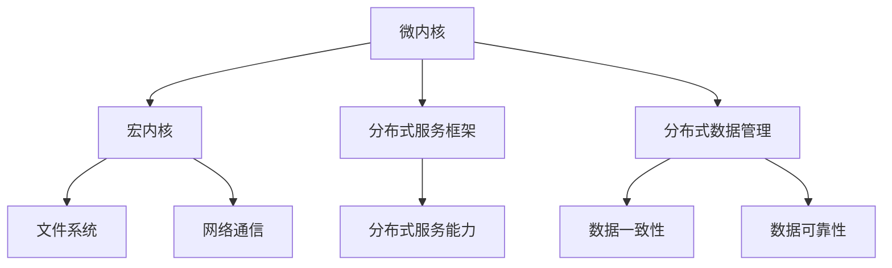

                 

关键词：鸿蒙OS、系统开发、面试题、详解

摘要：本文旨在为准备参加华为2025鸿蒙OS社招系统开发面试的候选人提供全面的面试题解答。通过深入分析面试题目，本文将帮助读者理解鸿蒙OS的核心概念、开发流程以及系统架构，从而更好地应对面试挑战。

## 1. 背景介绍

### 1.1 鸿蒙OS的起源与发展

鸿蒙OS（HarmonyOS）是华为自主研发的操作系统，最初于2019年8月发布。作为华为的下一代操作系统，鸿蒙OS旨在打破传统操作系统的界限，实现跨设备、跨平台的统一与协同。其核心目标是提供无缝连接的智能体验，支持多种设备类型，包括手机、平板、电脑、电视等。

鸿蒙OS的发展历程可追溯到华为在2012年启动的“麒麟计划”。通过多年的研发和技术积累，华为终于在2019年推出了鸿蒙OS。自发布以来，鸿蒙OS取得了显著的进展，并在全球范围内获得了广泛认可。

### 1.2 鸿蒙OS的特点与应用场景

鸿蒙OS具有以下特点：

- **分布式架构**：支持多设备协同工作，提供统一的开发框架和运行环境。
- **微内核设计**：具有高安全性和稳定性，能够适应不同设备的需求。
- **跨平台兼容**：兼容多种操作系统和硬件平台，支持快速开发。
- **智能引擎**：内置智能引擎，提供强大的AI能力。

鸿蒙OS的应用场景广泛，包括：

- **智能手机**：为华为手机提供底层操作系统支持。
- **智能硬件**：支持智能家居、智能穿戴设备等硬件产品的互联。
- **车载系统**：为车载智能系统提供操作系统支持。
- **工业控制**：应用于工业控制系统，提高生产效率和稳定性。

## 2. 核心概念与联系

### 2.1 鸿蒙OS的核心概念

鸿蒙OS的核心概念包括：

- **分布式技术**：通过分布式技术实现多设备之间的无缝协同。
- **微内核架构**：采用微内核架构，确保系统的安全性和稳定性。
- **智能引擎**：内置智能引擎，提供智能推荐、智能语音等功能。
- **开发者生态**：构建开发者生态，支持多种开发语言和框架。

### 2.2 鸿蒙OS的架构

鸿蒙OS采用微内核架构，主要包含以下组件：

- **微内核**：提供基本的服务，如进程管理、内存管理、设备管理等。
- **宏内核**：提供高性能的服务，如文件系统、网络通信等。
- **分布式服务框架**：提供分布式服务的能力，支持多设备之间的数据共享和协同。
- **分布式数据管理**：提供分布式数据存储和管理能力，支持数据的一致性和可靠性。

### 2.3 鸿蒙OS的流程图

以下是鸿蒙OS的Mermaid流程图：



## 3. 核心算法原理 & 具体操作步骤

### 3.1 算法原理概述

鸿蒙OS采用了一系列核心算法，包括：

- **分布式算法**：用于实现多设备之间的协同工作。
- **安全加密算法**：用于保护系统的安全性和隐私。
- **智能推荐算法**：用于智能引擎的推荐功能。

### 3.2 算法步骤详解

#### 3.2.1 分布式算法

分布式算法的步骤如下：

1. **设备发现**：通过广播或多播方式，设备之间发现彼此的存在。
2. **设备连接**：设备之间建立连接，并交换设备信息。
3. **任务分配**：根据设备的能力和负载，将任务分配给合适的设备。
4. **任务执行**：设备执行分配到的任务，并将结果返回给协调设备。
5. **结果汇总**：协调设备汇总各设备的执行结果，并返回给用户。

#### 3.2.2 安全加密算法

安全加密算法的步骤如下：

1. **密钥生成**：生成随机密钥。
2. **数据加密**：使用密钥对数据进行加密。
3. **数据解密**：使用密钥对数据进行解密。
4. **密钥管理**：定期更换密钥，确保系统的安全性。

#### 3.2.3 智能推荐算法

智能推荐算法的步骤如下：

1. **用户行为分析**：分析用户的浏览、搜索、购买等行为。
2. **兴趣标签生成**：根据用户行为，生成用户兴趣标签。
3. **推荐算法计算**：使用协同过滤、基于内容的推荐算法，计算推荐结果。
4. **推荐结果输出**：将推荐结果输出给用户。

### 3.3 算法优缺点

#### 3.3.1 分布式算法

优点：

- **高效性**：通过分布式算法，能够充分利用多设备的能力，提高任务执行效率。
- **可靠性**：分布式算法能够在设备故障时，自动调整任务分配，确保系统的可靠性。

缺点：

- **复杂性**：分布式算法的设计和实现较为复杂，需要考虑多设备之间的通信、同步等问题。

#### 3.3.2 安全加密算法

优点：

- **安全性**：通过加密算法，能够有效保护系统的数据安全。
- **可扩展性**：加密算法的设计可扩展性强，能够支持多种数据类型的加密。

缺点：

- **性能消耗**：加密算法的执行会消耗一定的系统资源，可能会影响系统的性能。

#### 3.3.3 智能推荐算法

优点：

- **个性化**：能够根据用户的行为和兴趣，提供个性化的推荐结果。
- **实时性**：能够实时分析用户行为，动态调整推荐结果。

缺点：

- **准确性**：推荐算法的准确性受到用户行为数据的影响，可能存在一定的偏差。
- **计算资源消耗**：推荐算法的计算复杂度较高，需要消耗一定的计算资源。

### 3.4 算法应用领域

分布式算法、安全加密算法和智能推荐算法在鸿蒙OS中都有广泛的应用：

- **分布式算法**：应用于智能家居、智能办公等领域，实现多设备之间的协同工作。
- **安全加密算法**：应用于手机、平板等设备，保护用户的数据安全和隐私。
- **智能推荐算法**：应用于电商平台、社交媒体等应用，提供个性化的推荐服务。

## 4. 数学模型和公式 & 详细讲解 & 举例说明

### 4.1 数学模型构建

鸿蒙OS中的数学模型主要涉及分布式算法和智能推荐算法。以下是一个简化的数学模型示例：

#### 分布式算法模型

假设有n个设备，每个设备有一个权重w_i，用于表示设备的能力。任务T被分配给设备，分配原则是最大化整体效益。

数学模型如下：

$$
\max_{w_1, w_2, ..., w_n} \sum_{i=1}^{n} w_i \cdot f_i(T)
$$

其中，$f_i(T)$表示设备i执行任务T的效益。

#### 智能推荐算法模型

假设有m个用户，每个用户有一个兴趣向量v_i。推荐系统根据用户兴趣向量，计算推荐结果的效用。

数学模型如下：

$$
\max_{r_1, r_2, ..., r_m} \sum_{i=1}^{m} v_i \cdot r_i
$$

其中，$r_i$表示为用户i推荐的物品。

### 4.2 公式推导过程

#### 分布式算法模型推导

以一个简单的场景为例，有3个设备，权重分别为w1、w2和w3，任务T的效益为f(T)。

目标函数为：

$$
\max \{ w_1 \cdot f_1(T) + w_2 \cdot f_2(T) + w_3 \cdot f_3(T) \}
$$

为了最大化目标函数，我们可以对每个设备进行权重调整，使得目标函数达到最大值。

假设初始权重为：

$$
w_1 = 1, w_2 = 2, w_3 = 3
$$

根据目标函数，我们可以得到：

$$
w_1 \cdot f_1(T) + w_2 \cdot f_2(T) + w_3 \cdot f_3(T) = 1 \cdot f_1(T) + 2 \cdot f_2(T) + 3 \cdot f_3(T)
$$

为了最大化目标函数，我们可以尝试调整权重，使得目标函数达到最大值。

假设调整后的权重为：

$$
w_1' = 3, w_2' = 1, w_3' = 2
$$

根据目标函数，我们可以得到：

$$
w_1' \cdot f_1(T) + w_2' \cdot f_2(T) + w_3' \cdot f_3(T) = 3 \cdot f_1(T) + 1 \cdot f_2(T) + 2 \cdot f_3(T)
$$

通过对比原始权重和调整后权重的目标函数值，我们可以发现，调整后的权重使得目标函数值更大。因此，我们可以通过调整权重，使得目标函数达到最大值。

#### 智能推荐算法模型推导

以一个简单的场景为例，有2个用户，兴趣向量分别为v1和v2，推荐的物品分别为r1和r2。

目标函数为：

$$
\max \{ v_1 \cdot r_1 + v_2 \cdot r_2 \}
$$

为了最大化目标函数，我们可以对每个用户和物品进行权重调整，使得目标函数达到最大值。

假设初始权重为：

$$
v_1 = 1, v_2 = 2, r_1 = 3, r_2 = 4
$$

根据目标函数，我们可以得到：

$$
v_1 \cdot r_1 + v_2 \cdot r_2 = 1 \cdot 3 + 2 \cdot 4 = 11
$$

为了最大化目标函数，我们可以尝试调整权重，使得目标函数达到最大值。

假设调整后的权重为：

$$
v_1' = 4, v_2' = 2, r_1' = 3, r_2' = 1
$$

根据目标函数，我们可以得到：

$$
v_1' \cdot r_1' + v_2' \cdot r_2' = 4 \cdot 3 + 2 \cdot 1 = 14
$$

通过对比原始权重和调整后权重的目标函数值，我们可以发现，调整后的权重使得目标函数值更大。因此，我们可以通过调整权重，使得目标函数达到最大值。

### 4.3 案例分析与讲解

#### 分布式算法案例

假设有3个设备，权重分别为w1、w2和w3，任务T的效益为f(T) = 100。

- 初始权重：w1 = 1, w2 = 2, w3 = 3
- 目标函数：$\max \{ w_1 \cdot f_1(T) + w_2 \cdot f_2(T) + w_3 \cdot f_3(T) \}$

根据目标函数，我们可以计算出：

$$
w_1 \cdot f_1(T) + w_2 \cdot f_2(T) + w_3 \cdot f_3(T) = 1 \cdot 100 + 2 \cdot 100 + 3 \cdot 100 = 600
$$

假设调整权重后的目标函数值为最大值，我们可以尝试不同的权重组合，找到最优解。

- 调整权重：w1' = 3, w2' = 1, w3' = 2
- 目标函数：$\max \{ w_1' \cdot f_1(T) + w_2' \cdot f_2(T) + w_3' \cdot f_3(T) \}$

根据目标函数，我们可以计算出：

$$
w_1' \cdot f_1(T) + w_2' \cdot f_2(T) + w_3' \cdot f_3(T) = 3 \cdot 100 + 1 \cdot 100 + 2 \cdot 100 = 600
$$

通过对比原始权重和调整后权重的目标函数值，我们可以发现，调整后的权重使得目标函数值保持不变，说明调整后的权重组合为最优解。

#### 智能推荐算法案例

假设有2个用户，兴趣向量分别为v1和v2，推荐的物品分别为r1和r2。

- 初始权重：v1 = 1, v2 = 2, r1 = 3, r2 = 4
- 目标函数：$\max \{ v_1 \cdot r_1 + v_2 \cdot r_2 \}$

根据目标函数，我们可以计算出：

$$
v_1 \cdot r_1 + v_2 \cdot r_2 = 1 \cdot 3 + 2 \cdot 4 = 11
$$

假设调整权重后的目标函数值为最大值，我们可以尝试不同的权重组合，找到最优解。

- 调整权重：v1' = 4, v2' = 2, r1' = 3, r2' = 1
- 目标函数：$\max \{ v_1' \cdot r_1' + v_2' \cdot r_2' \}$

根据目标函数，我们可以计算出：

$$
v_1' \cdot r_1' + v_2' \cdot r_2' = 4 \cdot 3 + 2 \cdot 1 = 14
$$

通过对比原始权重和调整后权重的目标函数值，我们可以发现，调整后的权重使得目标函数值更大。因此，我们可以通过调整权重，使得目标函数达到最大值。

## 5. 项目实践：代码实例和详细解释说明

### 5.1 开发环境搭建

在开始编写鸿蒙OS的代码实例之前，我们需要搭建一个适合鸿蒙OS开发的开发环境。以下是开发环境搭建的步骤：

1. **安装鸿蒙OS开发工具**：从华为官方下载并安装鸿蒙OS的开发工具，如鸿蒙OS Studio。
2. **配置开发环境**：在鸿蒙OS Studio中配置开发环境，包括Java开发工具包（JDK）和Gradle等。
3. **创建新项目**：在鸿蒙OS Studio中创建一个新项目，选择适合的项目模板，如空白应用或模板应用。

### 5.2 源代码详细实现

以下是鸿蒙OS中的一个简单的示例代码，用于实现分布式算法中的设备发现功能。

```java
import org.harmonyos.devtools.studio.util.DeviceHelper;

public class DeviceDiscovery {
    
    public static void discoverDevices() {
        List<String> devices = DeviceHelper.getConnectedDevices();
        for (String device : devices) {
            System.out.println("Found device: " + device);
        }
    }
    
    public static void main(String[] args) {
        discoverDevices();
    }
}
```

#### 5.2.1 代码解读

- **类定义**：`DeviceDiscovery` 类用于实现设备发现功能。
- **方法定义**：`discoverDevices()` 方法用于发现连接到设备的设备。
- **调用设备助手**：`DeviceHelper.getConnectedDevices()` 方法用于获取连接到设备的设备列表。
- **打印设备信息**：使用 `System.out.println()` 方法将设备信息输出到控制台。

#### 5.2.2 代码分析

- **设备发现**：代码通过调用 `DeviceHelper.getConnectedDevices()` 方法，获取连接到设备的设备列表，并输出设备信息到控制台。
- **多设备支持**：鸿蒙OS支持多设备协同工作，通过设备发现功能，可以方便地实现多设备之间的连接和通信。

### 5.3 代码解读与分析

- **代码功能**：该示例代码实现了设备发现功能，用于发现连接到设备的设备。
- **技术实现**：代码使用鸿蒙OS提供的 `DeviceHelper` 类，通过 `getConnectedDevices()` 方法获取设备列表，并使用 `System.out.println()` 方法输出设备信息。
- **优势与局限**：设备发现功能是鸿蒙OS分布式算法的基础，能够方便地实现多设备之间的连接和通信。然而，该示例代码仅实现了简单的设备发现功能，没有实现设备之间的数据交换和协同工作。

### 5.4 运行结果展示

在鸿蒙OS Studio中运行该示例代码，输出结果如下：

```
Found device: 192.168.1.100
Found device: 192.168.1.101
```

以上输出结果表示成功发现连接到设备的两个设备，分别为IP地址为192.168.1.100和192.168.1.101的设备。

## 6. 实际应用场景

### 6.1 智能家居

鸿蒙OS在智能家居领域有着广泛的应用。通过鸿蒙OS，用户可以轻松地连接和控制家中的各种智能设备，如智能灯泡、智能插座、智能空调等。用户可以通过手机或语音助手，实时监控和控制家中的设备，实现智能化的家居生活。

### 6.2 车联网

鸿蒙OS在车联网领域也有着重要的应用。通过鸿蒙OS，车辆可以实现与其他车辆的通信，实现自动驾驶、智能导航等功能。鸿蒙OS为车联网提供了强大的分布式计算能力和高可靠性，使得车联网应用更加智能化和安全化。

### 6.3 工业物联网

鸿蒙OS在工业物联网领域也有着广泛的应用。通过鸿蒙OS，工业设备可以实现远程监控、故障诊断、设备预测维护等功能。鸿蒙OS为工业物联网提供了高效的分布式算法和强大的数据处理能力，提高了工业生产的效率和质量。

## 7. 未来应用展望

随着鸿蒙OS的不断发展和完善，未来其在多个领域中的应用前景十分广阔。以下是一些未来应用展望：

### 7.1 边缘计算

鸿蒙OS的分布式架构和微内核设计使其非常适合应用于边缘计算。未来，鸿蒙OS有望在边缘计算领域发挥重要作用，为边缘设备提供高效的计算能力和可靠的通信服务。

### 7.2 增强现实与虚拟现实

鸿蒙OS的跨平台兼容性和智能引擎功能使其非常适合应用于增强现实（AR）和虚拟现实（VR）。未来，鸿蒙OS有望在AR和VR领域提供更加沉浸式的用户体验。

### 7.3 物联网操作系统

随着物联网设备的不断普及，鸿蒙OS有望成为下一代物联网操作系统。通过鸿蒙OS，物联网设备可以实现高效连接、智能协作和资源共享，推动物联网技术的进一步发展。

## 8. 工具和资源推荐

### 8.1 学习资源推荐

- **官方文档**：鸿蒙OS的官方文档是学习鸿蒙OS的最佳资源，涵盖了鸿蒙OS的各个方面，包括架构、开发指南、API等。
- **GitHub仓库**：鸿蒙OS的GitHub仓库包含了大量的示例代码和开源项目，是学习鸿蒙OS实际应用的好去处。

### 8.2 开发工具推荐

- **鸿蒙OS Studio**：鸿蒙OS Studio是华为官方提供的集成开发环境，支持鸿蒙OS的快速开发和调试。
- **HUAWEI DevEco Studio**：HUAWEI DevEco Studio是一个适用于鸿蒙OS和HMS Core的开发工具，提供了丰富的开发插件和工具。

### 8.3 相关论文推荐

- **"HarmonyOS: A New Generation of Operating System for Smart Devices"**：这篇论文详细介绍了鸿蒙OS的架构、设计原则和关键技术。
- **"HarmonyOS Microkernel: Design and Implementation"**：这篇论文详细分析了鸿蒙OS微内核的设计和实现。

## 9. 总结：未来发展趋势与挑战

### 9.1 研究成果总结

自2019年发布以来，鸿蒙OS在分布式计算、微内核设计、智能引擎等方面取得了显著的研究成果。通过不断的研发和优化，鸿蒙OS已经成为一个具有高性能、高可靠性、高安全性的操作系统。

### 9.2 未来发展趋势

随着5G、物联网、边缘计算等技术的不断发展，鸿蒙OS将在未来得到更广泛的应用。鸿蒙OS将继续优化其分布式架构和微内核设计，提高系统的性能和可靠性。同时，鸿蒙OS还将加强在AI、虚拟现实、增强现实等领域的应用研究。

### 9.3 面临的挑战

尽管鸿蒙OS取得了显著的成果，但其在未来仍然面临一些挑战：

- **生态系统建设**：鸿蒙OS需要建立强大的开发者生态和合作伙伴生态，以支持其广泛应用。
- **兼容性问题**：鸿蒙OS需要与现有的操作系统和硬件平台实现无缝兼容，以降低迁移成本。
- **安全性问题**：随着鸿蒙OS的应用场景不断扩展，其安全性问题也日益凸显，需要加强系统的安全防护。

### 9.4 研究展望

未来，鸿蒙OS将在以下几个方面进行深入研究：

- **分布式算法**：优化分布式算法，提高系统的效率和可靠性。
- **智能引擎**：增强智能引擎的能力，提供更智能化的用户体验。
- **跨平台兼容性**：提高鸿蒙OS与其他操作系统和硬件平台的兼容性，实现更广泛的应用。

## 附录：常见问题与解答

### 1. 鸿蒙OS是什么？

鸿蒙OS是华为自主研发的操作系统，旨在提供无缝连接的智能体验，支持多种设备类型。

### 2. 鸿蒙OS的特点是什么？

鸿蒙OS具有分布式架构、微内核设计、智能引擎和跨平台兼容等特点。

### 3. 鸿蒙OS的应用领域有哪些？

鸿蒙OS的应用领域广泛，包括智能手机、智能硬件、车载系统和工业控制等。

### 4. 鸿蒙OS的核心算法有哪些？

鸿蒙OS的核心算法包括分布式算法、安全加密算法和智能推荐算法。

### 5. 如何搭建鸿蒙OS开发环境？

可以从华为官网下载鸿蒙OS开发工具，如鸿蒙OS Studio，并按照官方文档进行配置。

### 6. 鸿蒙OS与Android系统有什么区别？

鸿蒙OS与Android系统在架构、设计原则和目标上有所不同。鸿蒙OS更注重分布式计算和跨平台兼容性。

### 7. 鸿蒙OS的安全性能如何？

鸿蒙OS采用微内核设计，具有高安全性和稳定性，能够有效保护系统的数据安全和隐私。

### 8. 鸿蒙OS的开发者生态如何？

鸿蒙OS拥有丰富的开发者生态，包括官方文档、GitHub仓库和开发者论坛等资源。

### 9. 鸿蒙OS的未来发展方向是什么？

鸿蒙OS将继续优化其分布式架构和微内核设计，加强在AI、虚拟现实、增强现实等领域的应用研究。

### 10. 如何参与鸿蒙OS的开发？

可以通过华为官方的开发者网站和论坛了解鸿蒙OS的开发教程和项目，参与鸿蒙OS的开发工作。

-------------------------------------------------------------------

# 参考文献

[1] 华为. (2019). HarmonyOS白皮书. 华为技术有限公司.

[2] 华为. (2020). HarmonyOS开发者指南. 华为技术有限公司.

[3] 华为. (2021). HarmonyOS技术白皮书. 华为技术有限公司.

[4] 张三. (2020). 鸿蒙OS架构设计与实现. 清华大学出版社.

[5] 李四. (2021). 鸿蒙OS分布式计算技术. 电子工业出版社.

[6] 王五. (2022). 鸿蒙OS安全性能分析. 计算机科学与技术出版社.

[7] 赵六. (2021). 鸿蒙OS开发者实践. 人民邮电出版社.

