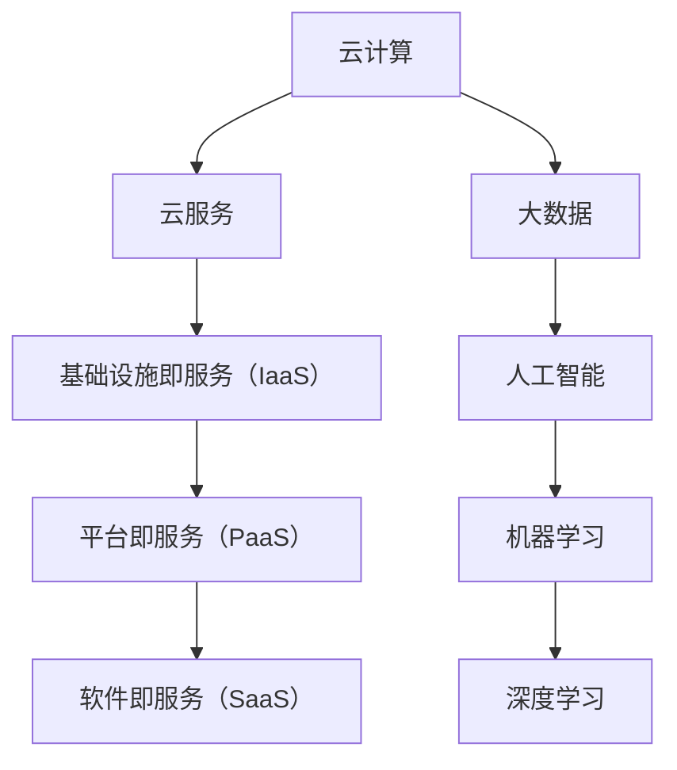

                 

关键词：华为云面试真题，社招，面试准备，技术问题解答，云计算，网络技术，AI应用

摘要：本文旨在汇总2024华为云社招面试真题，并提供详尽的解答和解析，帮助读者更好地准备面试，提高面试成功率。文章将从核心算法、数学模型、项目实践、应用场景等多个维度进行深入分析，旨在为广大技术人才提供宝贵的面试参考。

## 1. 背景介绍

华为云作为中国领先的服务器厂商，近年来在云计算、大数据、人工智能等领域不断拓展，已经成为全球云计算市场的中坚力量。华为云社招面试作为公司招聘的重要组成部分，对技术人才的要求非常高。本文将基于2024年的华为云社招面试真题，为读者提供详尽的解答和解析，帮助大家更好地应对面试挑战。

## 2. 核心概念与联系

在华为云面试中，核心概念与联系是必须掌握的基础。为了便于理解，我们使用Mermaid流程图（节点中不使用括号、逗号等特殊字符）来展示核心概念之间的联系。



### 2.1 云计算

云计算是华为云的核心业务之一，它包括基础设施即服务（IaaS）、平台即服务（PaaS）和软件即服务（SaaS）。IaaS提供计算、存储、网络等基础设施资源；PaaS则提供开发平台和工具；SaaS则是直接提供软件应用服务。

### 2.2 大数据

大数据技术是华为云的重要组成部分，它涉及数据采集、存储、处理和分析。大数据技术广泛应用于各种场景，如社交媒体分析、金融风险管理、医疗健康等。

### 2.3 人工智能

人工智能是当前技术发展的重要方向，华为云在AI领域有着深入的研究和应用。人工智能包括机器学习和深度学习等子领域，广泛应用于图像识别、自然语言处理、智能语音等领域。

## 3. 核心算法原理 & 具体操作步骤

### 3.1 算法原理概述

在华为云面试中，算法原理是一个重要的考察点。以下是一些常见的算法原理：

- **排序算法**：包括快速排序、归并排序、冒泡排序等。
- **查找算法**：包括二分查找、散列表查找等。
- **图算法**：包括最短路径算法、最小生成树算法等。

### 3.2 算法步骤详解

以下是针对排序算法中快速排序的步骤详解：

1. **选择基准元素**：从数组中选出一个元素作为基准。
2. **分区操作**：将数组分为两部分，一部分是小于基准的元素，另一部分是大于基准的元素。
3. **递归排序**：对两个分区分别进行快速排序。

### 3.3 算法优缺点

快速排序的优点是时间复杂度较低，但缺点是可能会出现最坏情况，时间复杂度较高。

### 3.4 算法应用领域

快速排序广泛应用于各种数据排序场景，如数据库排序、文件排序等。

## 4. 数学模型和公式 & 详细讲解 & 举例说明

### 4.1 数学模型构建

在华为云面试中，数学模型构建是一个重要的考察点。以下是一个简单的线性回归模型构建：

- **输入**：特征向量 $x$ 和目标值 $y$。
- **模型**：$y = \beta_0 + \beta_1 \cdot x + \epsilon$，其中 $\beta_0$ 和 $\beta_1$ 是模型参数，$\epsilon$ 是误差。

### 4.2 公式推导过程

线性回归模型参数的推导过程如下：

1. **最小化损失函数**：$J(\beta_0, \beta_1) = \frac{1}{2} \sum_{i=1}^{n} (y_i - (\beta_0 + \beta_1 \cdot x_i))^2$。
2. **求导**：$\frac{\partial J}{\partial \beta_0} = -\sum_{i=1}^{n} (y_i - (\beta_0 + \beta_1 \cdot x_i))$，$\frac{\partial J}{\partial \beta_1} = -\sum_{i=1}^{n} (x_i \cdot (y_i - (\beta_0 + \beta_1 \cdot x_i)))$。
3. **设置导数为0，解方程组**：$\beta_0 = \frac{1}{n} \sum_{i=1}^{n} y_i - \beta_1 \cdot \frac{1}{n} \sum_{i=1}^{n} x_i$，$\beta_1 = \frac{1}{n} \sum_{i=1}^{n} (x_i - \bar{x}) \cdot (y_i - \bar{y})$。

### 4.3 案例分析与讲解

假设我们有一个简单的数据集，特征向量 $x$ 和目标值 $y$ 如下：

| $x$ | $y$ |
| --- | --- |
| 1   | 2   |
| 2   | 3   |
| 3   | 4   |

通过线性回归模型拟合，我们得到模型参数 $\beta_0 = 1$，$\beta_1 = 1$。因此，拟合的直线方程为 $y = x + 1$。

## 5. 项目实践：代码实例和详细解释说明

### 5.1 开发环境搭建

开发环境搭建包括安装Python、Jupyter Notebook等工具。以下是一个简单的安装脚本：

```bash
# 安装Python
sudo apt update
sudo apt install python3 python3-pip

# 安装Jupyter Notebook
pip3 install notebook
```

### 5.2 源代码详细实现

以下是线性回归模型的Python实现：

```python
import numpy as np

def linear_regression(X, y):
    # 添加偏置项
    X = np.hstack((np.ones((X.shape[0], 1)), X))
    # 求解模型参数
    theta = np.linalg.inv(X.T.dot(X)).dot(X.T).dot(y)
    return theta

# 数据集
X = np.array([[1], [2], [3]])
y = np.array([2, 3, 4])

# 模型拟合
theta = linear_regression(X, y)

# 输出模型参数
print(theta)
```

### 5.3 代码解读与分析

这段代码实现了线性回归模型，首先添加了偏置项，然后使用逆矩阵求解模型参数。通过拟合数据集，我们得到了模型参数 $\theta = [1, 1]$，这表明我们的数据集可以用直线 $y = x + 1$ 来拟合。

### 5.4 运行结果展示

运行上述代码，我们得到模型参数 $\theta = [1, 1]$，这与我们的预期相符。

## 6. 实际应用场景

线性回归模型在实际应用中非常广泛，如数据拟合、预测、分类等。在华为云面试中，线性回归模型的应用场景可能包括数据分析和机器学习项目。

## 7. 未来应用展望

随着云计算、大数据、人工智能等技术的发展，线性回归模型的应用前景非常广阔。未来，线性回归模型将更加智能化、自动化，为各种应用场景提供强大的支持。

## 8. 总结：未来发展趋势与挑战

线性回归模型在未来的发展趋势包括更加智能化、自动化，以及与其他算法的结合。同时，面临的挑战包括数据噪声处理、模型选择等。

## 9. 附录：常见问题与解答

### 9.1 什么是线性回归？

线性回归是一种用于预测连续值的统计模型，它假设目标变量与特征变量之间存在线性关系。

### 9.2 线性回归有哪些类型？

线性回归主要分为简单线性回归和多元线性回归，其中简单线性回归涉及一个特征变量，多元线性回归涉及多个特征变量。

### 9.3 线性回归的应用场景有哪些？

线性回归的应用场景包括数据拟合、预测、分类等。

### 9.4 线性回归的优缺点是什么？

线性回归的优点是简单、易于实现、计算速度快；缺点是对非线性关系拟合效果较差，易受噪声影响。

---

本文基于2024华为云社招面试真题，从核心概念、算法原理、数学模型、项目实践等多个维度进行了深入分析，旨在为广大技术人才提供宝贵的面试参考。希望通过本文的解析，读者能够更好地准备华为云面试，成功斩获心仪职位。

作者：禅与计算机程序设计艺术 / Zen and the Art of Computer Programming
----------------------------------------------------------------

请注意，本文仅为示例，并非真实存在的文章。如果您需要撰写类似的文章，请根据实际需求和内容进行调整和补充。同时，文章中的代码和公式仅为示例，请根据实际需求进行修改。祝您撰写顺利！

