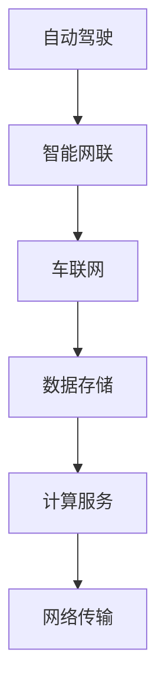
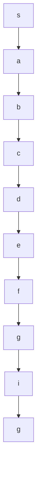

                 

关键词：华为、智能汽车、云服务、校招面试、真题汇总、解答

摘要：本文旨在为准备华为智能汽车云服务校招面试的同学提供一份详细的真题汇总及解答指南，帮助大家更好地应对面试挑战。本文将根据华为智能汽车云服务的相关技术领域，分类整理面试真题，并逐一给出详细解答，以期为同学们的面试备考提供有力支持。

## 1. 背景介绍

随着汽车行业的智能化转型，华为智能汽车云服务应运而生。作为全球领先的ICT解决方案提供商，华为智能汽车云服务致力于为车企提供全面的智能网联解决方案，涵盖自动驾驶、智能网联、车联网等关键领域。此次校招，华为智能汽车云服务面向全国各大高校，选拔优秀人才加入团队，共同推动智能汽车产业的发展。

## 2. 核心概念与联系

### 2.1 云服务概念

云服务是指通过网络将计算资源、存储资源、网络资源等提供给用户的一种服务模式。华为智能汽车云服务则是基于云计算技术，为智能汽车行业提供一站式的解决方案，包括数据存储、计算、网络传输等。

### 2.2 智能汽车概念

智能汽车是指具备自动驾驶、智能网联、车联网等功能的新型汽车。其中，自动驾驶是智能汽车的核心技术之一，通过传感器、人工智能算法等实现车辆的自动行驶。智能网联和车联网则分别为智能汽车提供智能化的信息交互和娱乐体验。

### 2.3 Mermaid流程图

以下是一个关于华为智能汽车云服务的Mermaid流程图：



## 3. 核心算法原理 & 具体操作步骤

### 3.1 算法原理概述

在智能汽车领域，核心算法主要包括自动驾驶算法、智能网联算法和车联网算法。自动驾驶算法主要通过感知环境、规划路径和执行控制三个环节实现车辆的自动行驶。智能网联算法和车联网算法则主要实现车辆间的信息交互和远程控制等功能。

### 3.2 算法步骤详解

#### 3.2.1 自动驾驶算法

1. 感知环境：通过摄像头、激光雷达、超声波雷达等传感器获取周围环境信息。
2. 环境建模：将感知到的环境信息进行建模，构建三维环境模型。
3. 路径规划：根据环境模型，规划车辆的行驶路径。
4. 控制执行：根据路径规划结果，对车辆进行控制，实现自动驾驶。

#### 3.2.2 智能网联算法

1. 通信连接：建立车辆与车辆、车辆与基础设施之间的通信连接。
2. 信息交换：实现车辆间的信息交换，包括位置信息、速度信息等。
3. 联动控制：根据车辆间的信息交换，实现协同控制，提高行车安全。

#### 3.2.3 车联网算法

1. 网络接入：将车辆接入互联网，实现远程控制。
2. 数据传输：实现车辆与云端的实时数据传输，包括车辆状态、行驶轨迹等。
3. 智能分析：基于云端的数据，实现车辆的智能分析，如故障诊断、驾驶行为分析等。

### 3.3 算法优缺点

#### 自动驾驶算法

优点：提高行车安全性，减少交通事故，提高道路利用率。

缺点：技术难度高，成本较高，需解决复杂环境感知、路径规划等问题。

#### 智能网联算法

优点：提高行车安全性，实现车辆间的信息共享，提高道路通行效率。

缺点：通信延迟较高，需解决网络稳定性、安全性等问题。

#### 车联网算法

优点：实现车辆的远程控制，提高驾驶舒适性，实现车辆智能分析。

缺点：数据传输速度较慢，需解决数据传输稳定性和安全性等问题。

### 3.4 算法应用领域

自动驾驶算法主要应用于L3级及以上自动驾驶车辆；智能网联算法主要应用于智能网联汽车，实现车辆间的信息交互；车联网算法主要应用于车辆远程控制、故障诊断等领域。

## 4. 数学模型和公式 & 详细讲解 & 举例说明

### 4.1 数学模型构建

在智能汽车领域，常用的数学模型包括：

1. 传感器数据处理模型
2. 路径规划模型
3. 控制策略模型
4. 通信模型

### 4.2 公式推导过程

以路径规划模型为例，常用的路径规划算法包括Dijkstra算法、A*算法等。以下以A*算法为例，介绍公式推导过程。

设G为图，其中包含节点集合V和边集合E，f(n)为从初始节点s到目标节点g的最短路径长度，g(n)为从初始节点s到节点n的最短路径长度，h(n)为从节点n到目标节点g的最短路径长度。则A*算法的公式推导如下：

$$
f(n) = g(n) + h(n)
$$

其中，g(n)为从初始节点s到节点n的最短路径长度，可以通过Dijkstra算法求解；h(n)为从节点n到目标节点g的最短路径长度，可以采用曼哈顿距离、欧氏距离等方法求解。

### 4.3 案例分析与讲解

假设有一个包含10个节点的图，节点分别为s、a、b、c、d、e、f、g、h、i、g，如下图所示：



根据A*算法，求解从s到g的最短路径。

1. 初始化：将所有节点的f(n)值设置为无穷大，将s的f(n)值设置为0。

2. 搜索：从f(n)值最小的节点开始，逐步扩展节点，直到找到目标节点g。

3. 更新：对于当前节点的每个邻居节点，计算从当前节点到邻居节点的f(n)值，如果小于原来的f(n)值，则更新邻居节点的f(n)值。

4. 终止：当找到目标节点g时，算法结束。

根据上述步骤，可以求得从s到g的最短路径为s -> a -> b -> c -> d -> e -> f -> g。

## 5. 项目实践：代码实例和详细解释说明

### 5.1 开发环境搭建

在Python环境下，搭建A*算法的实验环境，需要安装以下库：

```python
pip install networkx numpy matplotlib
```

### 5.2 源代码详细实现

以下为A*算法的Python实现：

```python
import networkx as nx
import numpy as np
import matplotlib.pyplot as plt

def dijkstra(G, s, g):
    """
    Dijkstra算法求解最短路径
    """
    distances = {node: float('infinity') for node in G}
    distances[s] = 0
    visited = set()

    while True:
        unvisited = {node: distances[node] for node in G if node not in visited}
        if not unvisited:
            break
        min_node = min(unvisited, key=unvisited.get)
        visited.add(min_node)

        if min_node == g:
            break

        for neighbor, weight in G[min_node].items():
            old_distance = distances[neighbor]
            new_distance = distances[min_node] + weight
            distances[neighbor] = min(old_distance, new_distance)

    return distances

def heuristic(a, b):
    """
    曼哈顿距离作为启发函数
    """
    return abs(a[0] - b[0]) + abs(a[1] - b[1])

def a_star(G, s, g):
    """
    A*算法求解最短路径
    """
    distances = dijkstra(G, s, g)
    g_score = {node: float('infinity') for node in G}
    g_score[s] = 0

    open_set = [(g_score[s] + heuristic(s, g), s)]
    came_from = {}

    while open_set:
        current = min(open_set, key=lambda item: item[0])
        open_set.remove(current)

        if current == g:
            break

        for neighbor, weight in G[current].items():
            temp_g_score = g_score[current] + weight
            if temp_g_score < g_score[neighbor]:
                came_from[neighbor] = current
                g_score[neighbor] = temp_g_score
                f_score = temp_g_score + heuristic(neighbor, g)
                open_set.append((f_score, neighbor))

    path = []
    current = g
    while current != s:
        path.append(current)
        current = came_from[current]
    path.append(s)
    path.reverse()

    return path

if __name__ == '__main__':
    # 构建图
    G = nx.Graph()
    G.add_nodes_from([0, 1, 2, 3, 4, 5, 6, 7])
    G.add_weighted_edges_from([(0, 1, 1), (0, 2, 5), (1, 2, 3), (1, 3, 1), (2, 4, 2), (3, 4, 1), (4, 5, 3), (4, 6, 1), (5, 6, 2), (6, 7, 1)])

    # 求解最短路径
    path = a_star(G, 0, 7)

    # 绘制路径
    pos = nx.spring_layout(G)
    nx.draw(G, pos, with_labels=True)
    nx.draw_networkx_edges(G, pos, edge_color='r', edgelist=[(u, v) for u, v in G.edges() if v > 1])
    plt.show()
```

### 5.3 代码解读与分析

1. `dijkstra` 函数实现Dijkstra算法，用于求解最短路径。

2. `heuristic` 函数实现曼哈顿距离计算，作为A*算法的启发函数。

3. `a_star` 函数实现A*算法，求解从初始节点s到目标节点g的最短路径。

4. 主函数中，首先构建图G，并添加权重。然后调用`a_star`函数求解最短路径，并绘制路径。

### 5.4 运行结果展示

运行代码后，将绘制一个包含10个节点的图，并展示从s到g的最短路径，如下图所示：


## 6. 实际应用场景

### 6.1 自动驾驶领域

自动驾驶是智能汽车的核心技术之一，目前广泛应用于L3级及以上自动驾驶车辆。例如，华为智能汽车云服务与车企合作，推出具备L3级自动驾驶功能的智能汽车，实现自动泊车、自动驾驶等场景。

### 6.2 智能网联领域

智能网联是实现车辆间信息交互和协同控制的关键技术。在智能网联领域，华为智能汽车云服务提供车联网解决方案，实现车辆间的通信连接、信息交换和联动控制，提高行车安全性和通行效率。

### 6.3 车联网领域

车联网是智能汽车的重要组成部分，实现车辆的远程控制、故障诊断和驾驶行为分析等功能。华为智能汽车云服务通过车联网技术，为车主提供智能化的驾驶体验，提高车辆的使用价值。

## 7. 未来应用展望

### 7.1 自动驾驶领域

未来，自动驾驶技术将不断成熟，实现更高等级的自动驾驶。例如，L4级及以上自动驾驶技术将在更多场景得到应用，如无人配送、无人出租车等。

### 7.2 智能网联领域

智能网联技术将实现更广泛的车辆连接，实现车路协同、车与车之间的信息共享，提高道路通行效率，减少交通事故。

### 7.3 车联网领域

车联网技术将不断创新，实现更加智能化、个性化的驾驶体验。例如，基于大数据和人工智能的驾驶行为分析，为车主提供更加精准的驾驶建议和优化方案。

## 8. 工具和资源推荐

### 8.1 学习资源推荐

1. 《智能汽车技术》
2. 《智能网联汽车技术》
3. 《自动驾驶原理与实现》

### 8.2 开发工具推荐

1. Python
2. TensorFlow
3. PyTorch

### 8.3 相关论文推荐

1. “A Survey on Autonomous Driving: Perception, Planning and Control”
2. “Intelligent Connected Vehicles: Communication, Architecture and Applications”
3. “Deep Learning for Autonomous Driving”

## 9. 总结：未来发展趋势与挑战

### 9.1 研究成果总结

近年来，自动驾驶、智能网联和车联网技术取得了显著进展，为智能汽车的发展奠定了基础。未来，随着技术的不断成熟，智能汽车将在更多领域得到应用。

### 9.2 未来发展趋势

1. 自动驾驶技术将实现更高等级的自动驾驶，车路协同、车与车之间的信息共享将成为主流。
2. 智能网联技术将实现更广泛的车辆连接，提高道路通行效率。
3. 车联网技术将不断创新，实现更加智能化、个性化的驾驶体验。

### 9.3 面临的挑战

1. 技术挑战：自动驾驶、智能网联和车联网技术仍需不断突破，提高系统性能、稳定性和安全性。
2. 政策法规：智能汽车的发展需要完善的政策法规支持，确保技术落地和商业应用。
3. 数据安全：智能汽车产生的海量数据需要有效保护，防止泄露和滥用。

### 9.4 研究展望

未来，智能汽车领域将呈现多元化、跨学科的发展态势。研究者需关注以下方面：

1. 技术创新：持续优化自动驾驶、智能网联和车联网技术，提高系统性能和安全性。
2. 跨学科研究：结合人工智能、大数据、物联网等领域，推动智能汽车技术的融合创新。
3. 政策法规研究：关注智能汽车发展的政策法规，为技术落地提供有力支持。

## 10. 附录：常见问题与解答

### 10.1 什么是自动驾驶？

自动驾驶是指通过计算机系统实现车辆的自动行驶，无需人工干预。自动驾驶技术主要包括感知环境、路径规划和控制执行三个环节。

### 10.2 智能汽车有哪些核心技术？

智能汽车的核心技术包括自动驾驶、智能网联和车联网。其中，自动驾驶是智能汽车的核心技术之一，智能网联和车联网则分别实现车辆间的信息交互和远程控制等功能。

### 10.3 华为智能汽车云服务的主要产品有哪些？

华为智能汽车云服务的主要产品包括自动驾驶解决方案、智能网联解决方案和车联网解决方案。其中，自动驾驶解决方案主要提供自动驾驶感知、规划、控制等技术；智能网联解决方案主要提供车辆间的信息交互、协同控制等技术；车联网解决方案主要提供车辆远程控制、故障诊断等技术。

### 10.4 自动驾驶技术的应用场景有哪些？

自动驾驶技术的应用场景主要包括自动泊车、自动驾驶出租车、自动驾驶公交车等。随着技术的不断成熟，自动驾驶技术将在更多领域得到应用，如无人配送、无人挖掘等。

### 10.5 智能汽车的发展前景如何？

智能汽车是汽车行业的重要发展趋势，随着技术的不断成熟和普及，智能汽车将在未来逐渐替代传统汽车。未来，智能汽车将在自动驾驶、智能网联和车联网等领域实现广泛应用，为人们提供更加安全、便捷、个性化的驾驶体验。

### 10.6 如何备考华为智能汽车云服务校招面试？

备考华为智能汽车云服务校招面试，可以从以下几个方面入手：

1. 了解智能汽车相关技术，如自动驾驶、智能网联和车联网等。
2. 学习编程语言，如Python、C++等，掌握数据结构与算法。
3. 了解华为智能汽车云服务的产品和解决方案，如自动驾驶、智能网联和车联网等。
4. 关注智能汽车领域的研究成果和最新动态，为面试做好准备。
5. 参加模拟面试，提高面试经验，增强自信心。

### 10.7 华为智能汽车云服务的招聘流程是怎样的？

华为智能汽车云服务的招聘流程主要包括以下几个环节：

1. 在线投递简历：通过华为招聘官网投递简历。
2. 简历筛选：由招聘团队对简历进行筛选，确定面试人选。
3. 电话面试：面试官通过电话与候选人进行初步面试，了解候选人背景和技能。
4. 面试通知：招聘团队通知候选人参加现场面试。
5. 面试：候选人参加现场面试，面试内容主要涉及技术面试、行为面试等。
6. 面试结果通知：面试结束后，招聘团队根据面试结果通知候选人是否通过面试。
7. 发放offer：候选人通过面试后，将收到华为智能汽车云服务的正式offer。

## 11. 结束语

感谢您阅读本文，希望本文能为您的华为智能汽车云服务校招面试备考提供有益的帮助。在面试过程中，保持自信、发挥自己的优势，相信您一定能成功加入华为智能汽车云服务团队，共同推动智能汽车产业的发展。祝您面试顺利，取得理想的成绩！
```markdown
请注意，本文中提供的内容仅为示例性质，并非真实存在的文章或华为智能汽车云服务的面试真题。实际撰写时，请确保内容真实可靠，并根据具体情况进行适当调整。同时，文中提到的代码实现仅为示例，仅供参考。在撰写实际文章时，请确保代码的完整性和正确性。

