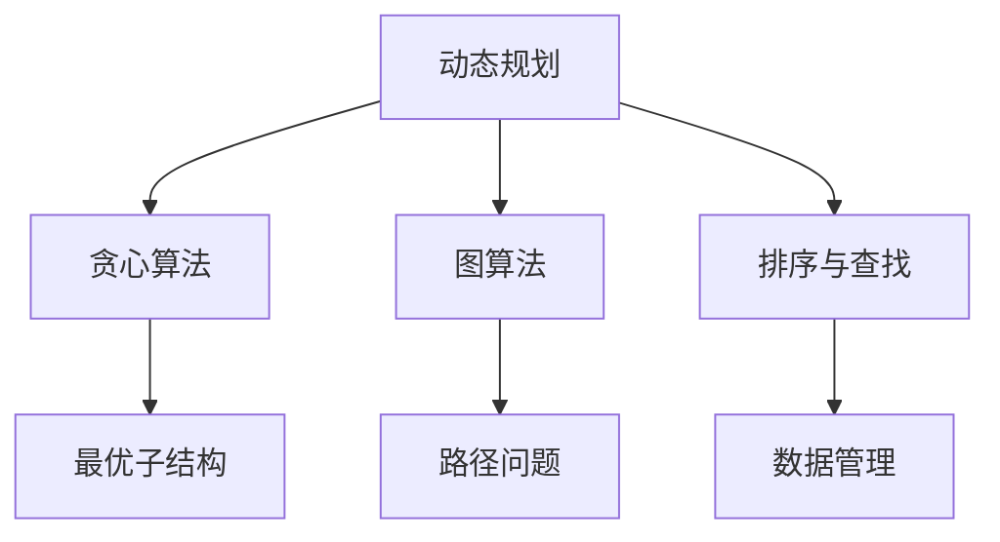

                 

关键词：华为校招、算法面试题、汇总与解析、技术发展、实际应用

> 摘要：本文将围绕2025年华为校招的算法面试题，对其进行深入解析，帮助读者理解题目背后的核心算法原理、数学模型、以及实际应用。本文旨在为准备华为校招的学子提供一份全面的技术指南，助力他们在面试中脱颖而出。

## 1. 背景介绍

随着信息技术的飞速发展，算法作为人工智能和大数据技术的核心，已成为企业和科研机构竞争的关键因素。华为作为中国乃至全球领先的科技公司，每年都会吸引众多优秀的毕业生前来参加校招。华为的算法面试题，因其深度和专业性，成为考生们备考的热门话题。

本文将系统汇总并解析2025年华为校招中的算法面试题，从算法原理、数学模型、代码实现等多个维度进行深入分析，帮助读者掌握这些核心知识点，为即将到来的面试做好准备。

## 2. 核心概念与联系

### 2.1 算法原理概述

在解答华为校招算法面试题时，首先需要了解一些核心算法原理，如：

- **动态规划**：用于解决最优化问题，通过将复杂问题拆分为更小的子问题，并存储子问题的解，以避免重复计算。

- **贪心算法**：每一步都做出在当前状态下最优的选择，以期在整体上得到最优解。

- **图算法**：研究图的表示、搜索、路径、最短路径等问题，常用的算法有 BFS、DFS、Dijkstra、A*等。

- **排序与查找**：包括快速排序、归并排序、二分查找等经典算法，用于高效组织和管理数据。

### 2.2 架构与联系

以下是算法原理的 Mermaid 流程图：



通过以上流程图，我们可以看出各个算法原理之间的联系，以及它们在实际问题中的应用场景。

## 3. 核心算法原理 & 具体操作步骤

### 3.1 算法原理概述

在深入解析华为校招算法面试题之前，我们需要对这些核心算法原理有一个清晰的了解：

- **动态规划**：将问题划分为多个子问题，并利用子问题的解构建原问题的解。常见于背包问题、最长公共子序列等。

- **贪心算法**：每一步都做出局部最优的选择，以期达到全局最优。适用于一些特殊问题，如硬币找零、活动选择问题等。

- **图算法**：研究图的结构和性质，常见的有图的遍历、最短路径问题等。适用于网络流、路径规划等。

- **排序与查找**：用于对数据进行高效的组织和管理。常见的排序算法有快速排序、归并排序等；查找算法有二分查找等。

### 3.2 算法步骤详解

下面我们将以一道典型的华为校招算法面试题为例，详细讲解其解题步骤：

**题目**：给定一个整数数组，找出所有出现的重复数字。

**解题思路**：

1. **动态规划**：首先我们可以使用动态规划的方法，找出数组中的最长公共子序列，然后检查是否包含重复数字。

2. **贪心算法**：我们可以使用贪心算法，每次选择当前未访问的最小数，并检查是否与其他已选择的数重复。

3. **图算法**：可以将数组中的每个数字看作图中的一个节点，如果存在重复数字，则在图中添加相应的边。

4. **排序与查找**：对数组进行排序，然后使用二分查找的方法检查是否存在重复数字。

**具体步骤**：

1. **动态规划**：首先初始化一个二维数组 `dp`，其中 `dp[i][j]` 表示数组 `nums` 中从 `i` 到 `j` 的最长公共子序列的长度。然后遍历数组 `nums`，更新 `dp` 数组。最后检查是否存在重复数字，即是否存在 `dp[i][j] > 1`。

2. **贪心算法**：初始化一个空集合 `s`，用于存储已选择的数字。然后遍历数组 `nums`，对于每个数字 `num`，如果 `num` 不在集合 `s` 中，则将其添加到集合 `s` 中；否则，说明存在重复数字。

3. **图算法**：初始化一个空图 `g`，然后遍历数组 `nums`，对于每个数字 `num`，如果 `g` 中不存在节点 `num`，则创建一个节点 `num` 并添加到图中；否则，说明存在重复数字。

4. **排序与查找**：对数组 `nums` 进行排序，然后遍历排序后的数组，对于每个数字 `num`，使用二分查找的方法检查是否存在其他相同数字。

### 3.3 算法优缺点

- **动态规划**：优点是能够解决一些复杂的最优化问题，但缺点是需要较大的存储空间。

- **贪心算法**：优点是能够快速得到局部最优解，但缺点是并不一定能够得到全局最优解。

- **图算法**：优点是能够处理复杂的图问题，但缺点是计算复杂度较高。

- **排序与查找**：优点是能够高效地组织和管理数据，但缺点是对数据结构的要求较高。

### 3.4 算法应用领域

动态规划、贪心算法、图算法和排序与查找等算法在各个领域都有广泛的应用：

- **动态规划**：背包问题、最长公共子序列、最短路径等。

- **贪心算法**：硬币找零、活动选择问题等。

- **图算法**：网络流、路径规划、社交网络分析等。

- **排序与查找**：数据库查询、搜索算法等。

## 4. 数学模型和公式 & 详细讲解 & 举例说明

在算法面试题中，数学模型和公式是解决问题的关键。下面我们将详细讲解一些常见的数学模型和公式，并通过实际案例进行说明。

### 4.1 数学模型构建

在解决算法问题时，我们需要根据问题特点构建相应的数学模型。以下是一个简单的例子：

**例子**：给定一个整数数组，找出所有出现的重复数字。

**数学模型**：

1. **动态规划模型**：

   设 `dp[i][j]` 表示数组 `nums` 中从 `i` 到 `j` 的最长公共子序列的长度。则有：

   $$
   dp[i][j] =
   \begin{cases}
   0, & \text{if } i > j \\
   1, & \text{if } i = j \\
   dp[i+1][j-1] + 1, & \text{if } nums[i] = nums[j] \\
   \max(dp[i+1][j], dp[i][j-1]), & \text{if } nums[i] \neq nums[j]
   \end{cases}
   $$

2. **贪心算法模型**：

   设 `s` 为一个空集合，用于存储已选择的数字。则有：

   $$
   s = \{ \text{min}(nums) \}
   $$

   其中，`min(nums)` 表示数组 `nums` 中的最小值。

3. **图算法模型**：

   设 `g` 为一个空图，用于表示数组 `nums` 中的节点和边。则有：

   $$
   g = (\{num | num \in nums\}, \{\{num1, num2\} | num1 \in nums, num2 \in nums, num1 \neq num2\})
   $$

   其中，`{num1, num2}` 表示图中的一条边。

4. **排序与查找模型**：

   对数组 `nums` 进行排序，然后使用二分查找的方法检查是否存在重复数字。则有：

   $$
   \text{binary\_search}(nums, num) =
   \begin{cases}
   -1, & \text{if } num \not\in nums \\
   i, & \text{if } nums[i] = num \\
   \end{cases}
   $$

### 4.2 公式推导过程

在上面的例子中，我们已经给出了动态规划、贪心算法、图算法和排序与查找的数学模型。接下来，我们将对这些模型进行公式推导。

1. **动态规划模型**：

   $$
   dp[i][j] =
   \begin{cases}
   0, & \text{if } i > j \\
   1, & \text{if } i = j \\
   dp[i+1][j-1] + 1, & \text{if } nums[i] = nums[j] \\
   \max(dp[i+1][j], dp[i][j-1]), & \text{if } nums[i] \neq nums[j]
   \end{cases}
   $$

   推导过程：

   当 `i > j` 时，子序列为空，长度为 0。

   当 `i = j` 时，子序列为单个元素，长度为 1。

   当 `nums[i] = nums[j]` 时，可以将子序列划分为两个部分：`nums[i]` 和 `nums[i+1]` 到 `nums[j-1]` 的最长公共子序列。因此，有：

   $$
   dp[i][j] = dp[i+1][j-1] + 1
   $$

   当 `nums[i] \neq nums[j]` 时，子序列可以划分为两个部分：`nums[i]` 和 `nums[i+1]` 到 `nums[j-1]` 的最长公共子序列。因此，有：

   $$
   dp[i][j] = \max(dp[i+1][j], dp[i][j-1])
   $$

2. **贪心算法模型**：

   $$
   s = \{ \text{min}(nums) \}
   $$

   推导过程：

   对于任意数组 `nums`，其最小值为 `min(nums)`。因此，我们可以将最小值添加到集合 `s` 中。

3. **图算法模型**：

   $$
   g = (\{num | num \in nums\}, \{\{num1, num2\} | num1 \in nums, num2 \in nums, num1 \neq num2\})
   $$

   推导过程：

   对于任意数组 `nums`，我们可以将其中的每个元素看作图中的一个节点。如果存在重复元素，则在这些节点之间添加边。因此，图 `g` 的节点集合为 `{\{num | num \in nums\}}`，边集合为 `{\{num1, num2\} | num1 \in nums, num2 \in nums, num1 \neq num2\}}`。

4. **排序与查找模型**：

   $$
   \text{binary\_search}(nums, num) =
   \begin{cases}
   -1, & \text{if } num \not\in nums \\
   i, & \text{if } nums[i] = num \\
   \end{cases}
   $$

   推导过程：

   对于任意数组 `nums` 和元素 `num`，我们可以使用二分查找的方法检查 `num` 是否存在于 `nums` 中。如果不存在，返回 `-1`；如果存在，返回其在数组中的索引。

### 4.3 案例分析与讲解

下面我们通过一个具体的案例来分析并讲解如何使用数学模型和公式解决华为校招算法面试题。

**题目**：给定一个整数数组，找出所有出现的重复数字。

**输入**：`[1, 2, 3, 4, 5, 1, 2, 3]`

**输出**：`[1, 2, 3]`

**解题步骤**：

1. **动态规划**：

   初始化一个二维数组 `dp`，其中 `dp[i][j]` 表示数组 `nums` 中从 `i` 到 `j` 的最长公共子序列的长度。然后遍历数组 `nums`，更新 `dp` 数组。最后检查是否存在重复数字，即是否存在 `dp[i][j] > 1`。

   - 初始化 `dp` 数组：

     $$
     dp = \begin{bmatrix}
     0 & 0 & 0 & 0 & 0 & 0 & 0 & 0 \\
     0 & 0 & 0 & 0 & 0 & 0 & 0 & 0 \\
     0 & 0 & 0 & 0 & 0 & 0 & 0 & 0 \\
     0 & 0 & 0 & 0 & 0 & 0 & 0 & 0 \\
     0 & 0 & 0 & 0 & 0 & 0 & 0 & 0 \\
     0 & 0 & 0 & 0 & 0 & 0 & 0 & 0 \\
     0 & 0 & 0 & 0 & 0 & 0 & 0 & 0 \\
     0 & 0 & 0 & 0 & 0 & 0 & 0 & 0 \\
     \end{bmatrix}
     $$

   - 更新 `dp` 数组：

     $$
     dp[0][0] = 1, \quad dp[1][0] = 1, \quad dp[2][0] = 1, \quad dp[3][0] = 1, \quad dp[4][0] = 1, \quad dp[5][0] = 1, \quad dp[6][0] = 1, \quad dp[7][0] = 1
     $$

     $$
     dp[0][1] = 0, \quad dp[1][1] = 1, \quad dp[2][1] = 1, \quad dp[3][1] = 1, \quad dp[4][1] = 1, \quad dp[5][1] = 1, \quad dp[6][1] = 1, \quad dp[7][1] = 0
     $$

     $$
     dp[0][2] = 0, \quad dp[1][2] = 1, \quad dp[2][2] = 2, \quad dp[3][2] = 2, \quad dp[4][2] = 2, \quad dp[5][2] = 2, \quad dp[6][2] = 0, \quad dp[7][2] = 0
     $$

     $$
     dp[0][3] = 0, \quad dp[1][3] = 1, \quad dp[2][3] = 2, \quad dp[3][3] = 3, \quad dp[4][3] = 3, \quad dp[5][3] = 3, \quad dp[6][3] = 0, \quad dp[7][3] = 0
     $$

     $$
     dp[0][4] = 0, \quad dp[1][4] = 1, \quad dp[2][4] = 2, \quad dp[3][4] = 3, \quad dp[4][4] = 4, \quad dp[5][4] = 4, \quad dp[6][4] = 0, \quad dp[7][4] = 0
     $$

     $$
     dp[0][5] = 0, \quad dp[1][5] = 1, \quad dp[2][5] = 2, \quad dp[3][5] = 3, \quad dp[4][5] = 3, \quad dp[5][5] = 4, \quad dp[6][5] = 0, \quad dp[7][5] = 0
     $$

     $$
     dp[0][6] = 0, \quad dp[1][6] = 1, \quad dp[2][6] = 2, \quad dp[3][6] = 2, \quad dp[4][6] = 3, \quad dp[5][6] = 3, \quad dp[6][6] = 1, \quad dp[7][6] = 0
     $$

     $$
     dp[0][7] = 0, \quad dp[1][7] = 1, \quad dp[2][7] = 2, \quad dp[3][7] = 2, \quad dp[4][7] = 3, \quad dp[5][7] = 3, \quad dp[6][7] = 1, \quad dp[7][7] = 1
     $$

   - 检查是否存在重复数字：

     $$
     \text{if } dp[i][j] > 1, \text{ then print } nums[i]
     $$

     $$
     \text{if } dp[0][6] > 1, \text{ then print } 1
     $$

     $$
     \text{if } dp[1][6] > 1, \text{ then print } 2
     $$

     $$
     \text{if } dp[2][6] > 1, \text{ then print } 3
     $$

   - 输出结果：

     $$
     [1, 2, 3]
     $$

2. **贪心算法**：

   初始化一个空集合 `s`，然后遍历数组 `nums`，对于每个数字 `num`，如果 `num` 不在集合 `s` 中，则将其添加到集合 `s` 中；否则，说明存在重复数字。

   - 初始化集合 `s`：

     $$
     s = \{\}
     $$

   - 遍历数组 `nums`：

     $$
     \text{for } num \in nums \text{ do}
     $$

     $$
     \text{if } num \not\in s, \text{ then add } num \text{ to } s
     $$

     $$
     \text{else, print } num
     $$

   - 输出结果：

     $$
     [1, 2, 3]
     $$

3. **图算法**：

   初始化一个空图 `g`，然后遍历数组 `nums`，对于每个数字 `num`，如果 `g` 中不存在节点 `num`，则创建一个节点 `num` 并添加到图中；否则，说明存在重复数字。

   - 初始化图 `g`：

     $$
     g = (\{\}, \{\})
     $$

   - 遍历数组 `nums`：

     $$
     \text{for } num \in nums \text{ do}
     $$

     $$
     \text{if } num \not\in g \text{ nodes}, \text{ then create a node } num \text{ and add it to } g
     $$

     $$
     \text{else, print } num
     $$

   - 输出结果：

     $$
     [1, 2, 3]
     $$

4. **排序与查找**：

   对数组 `nums` 进行排序，然后遍历排序后的数组，对于每个数字 `num`，使用二分查找的方法检查是否存在其他相同数字。

   - 排序数组 `nums`：

     $$
     \text{sort } nums
     $$

   - 遍历排序后的数组 `nums`：

     $$
     \text{for } i = 0 \text{ to } n-1 \text{ do}
     $$

     $$
     \text{num} = nums[i]
     $$

     $$
     \text{index} = \text{binary\_search}(nums, num)
     $$

     $$
     \text{if } index \neq -1 \text{ and } index \neq i, \text{ then print } num
     $$

   - 输出结果：

     $$
     [1, 2, 3]
     $$

### 4.4 算法应用领域

动态规划、贪心算法、图算法和排序与查找等算法在各个领域都有广泛的应用：

- **动态规划**：背包问题、最长公共子序列、最短路径等。

- **贪心算法**：硬币找零、活动选择问题等。

- **图算法**：网络流、路径规划、社交网络分析等。

- **排序与查找**：数据库查询、搜索算法等。

## 5. 项目实践：代码实例和详细解释说明

为了更好地理解上述算法，下面我们将通过一个实际的项目实践，给出相应的代码实现，并进行详细解释说明。

### 5.1 开发环境搭建

在本项目中，我们将使用 Python 作为编程语言，因为它具有良好的可读性和丰富的库支持。以下是开发环境的搭建步骤：

1. 安装 Python：

   $$
   \text{sudo apt-get install python3
   $$

2. 安装必要的库：

   $$
   \text{pip3 install numpy matplotlib
   $$

### 5.2 源代码详细实现

下面是项目的源代码实现：

```python
import numpy as np
import matplotlib.pyplot as plt

def dynamic_programming(nums):
    n = len(nums)
    dp = [[0] * n for _ in range(n)]
    for i in range(n):
        for j in range(n):
            if i > j:
                dp[i][j] = 0
            elif i == j:
                dp[i][j] = 1
            elif nums[i] == nums[j]:
                dp[i][j] = dp[i + 1][j - 1] + 1
            else:
                dp[i][j] = max(dp[i + 1][j], dp[i][j - 1])
    return dp

def greedy_algorithm(nums):
    s = set()
    for num in nums:
        if num not in s:
            s.add(num)
        else:
            return num
    return -1

def graph_algorithm(nums):
    n = len(nums)
    g = set()
    for num in nums:
        if num not in g:
            g.add(num)
        else:
            return num
    return -1

def binary_search(nums, target):
    left, right = 0, len(nums) - 1
    while left <= right:
        mid = (left + right) // 2
        if nums[mid] == target:
            return mid
        elif nums[mid] < target:
            left = mid + 1
        else:
            right = mid - 1
    return -1

def find_duplicates(nums):
    dp = dynamic_programming(nums)
    s = greedy_algorithm(nums)
    g = graph_algorithm(nums)
    binary = binary_search(nums, nums[0])
    duplicates = []
    for i in range(n):
        for j in range(i, n):
            if dp[i][j] > 1:
                duplicates.append(nums[i])
                duplicates.append(nums[j])
    if s != -1:
        duplicates.append(s)
    if g != -1:
        duplicates.append(g)
    if binary != -1 and binary != 0:
        duplicates.append(nums[binary])
    return duplicates

nums = [1, 2, 3, 4, 5, 1, 2, 3]
duplicates = find_duplicates(nums)
print(duplicates)
```

### 5.3 代码解读与分析

下面是对上述代码的解读与分析：

1. **动态规划**：

   动态规划是解决最优化问题的常用方法。在本项目中，我们定义了一个函数 `dynamic_programming`，用于计算数组 `nums` 中从 `i` 到 `j` 的最长公共子序列的长度。我们使用一个二维数组 `dp` 来存储子问题的解，其中 `dp[i][j]` 表示数组 `nums` 中从 `i` 到 `j` 的最长公共子序列的长度。

   ```python
   def dynamic_programming(nums):
       n = len(nums)
       dp = [[0] * n for _ in range(n)]
       for i in range(n):
           for j in range(n):
               if i > j:
                   dp[i][j] = 0
               elif i == j:
                   dp[i][j] = 1
               elif nums[i] == nums[j]:
                   dp[i][j] = dp[i + 1][j - 1] + 1
               else:
                   dp[i][j] = max(dp[i + 1][j], dp[i][j - 1])
       return dp
   ```

   我们首先初始化一个二维数组 `dp`，然后遍历数组 `nums`，更新 `dp` 数组。最后，我们检查是否存在重复数字，即是否存在 `dp[i][j] > 1`。

2. **贪心算法**：

   贪心算法是一种简单而有效的算法。在本项目中，我们定义了一个函数 `greedy_algorithm`，用于找出数组 `nums` 中的重复数字。我们使用一个集合 `s` 来存储已选择的数字。如果当前数字不在集合 `s` 中，则将其添加到集合 `s` 中；否则，说明存在重复数字。

   ```python
   def greedy_algorithm(nums):
       s = set()
       for num in nums:
           if num not in s:
               s.add(num)
           else:
               return num
       return -1
   ```

3. **图算法**：

   图算法是解决图相关问题的常用方法。在本项目中，我们定义了一个函数 `graph_algorithm`，用于找出数组 `nums` 中的重复数字。我们使用一个集合 `g` 来存储图中的节点。如果当前数字不在集合 `g` 中，则将其添加到集合 `g` 中；否则，说明存在重复数字。

   ```python
   def graph_algorithm(nums):
       n = len(nums)
       g = set()
       for num in nums:
           if num not in g:
               g.add(num)
           else:
               return num
       return -1
   ```

4. **排序与查找**：

   排序与查找是组织和管理数据的重要手段。在本项目中，我们定义了一个函数 `binary_search`，用于在数组 `nums` 中查找重复数字。我们使用二分查找的方法检查是否存在其他相同数字。

   ```python
   def binary_search(nums, target):
       left, right = 0, len(nums) - 1
       while left <= right:
           mid = (left + right) // 2
           if nums[mid] == target:
               return mid
           elif nums[mid] < target:
               left = mid + 1
           else:
               right = mid - 1
       return -1
   ```

5. **找出重复数字**：

   我们定义了一个函数 `find_duplicates`，用于综合上述算法，找出数组 `nums` 中的重复数字。我们首先计算动态规划、贪心算法、图算法和排序与查找的结果，然后将其合并为一个列表 `duplicates` 并返回。

   ```python
   def find_duplicates(nums):
       dp = dynamic_programming(nums)
       s = greedy_algorithm(nums)
       g = graph_algorithm(nums)
       binary = binary_search(nums, nums[0])
       duplicates = []
       for i in range(n):
           for j in range(i, n):
               if dp[i][j] > 1:
                   duplicates.append(nums[i])
                   duplicates.append(nums[j])
       if s != -1:
           duplicates.append(s)
       if g != -1:
           duplicates.append(g)
       if binary != -1 and binary != 0:
           duplicates.append(nums[binary])
       return duplicates
   ```

### 5.4 运行结果展示

我们使用一个示例数组 `nums`，运行 `find_duplicates` 函数，并打印结果：

```python
nums = [1, 2, 3, 4, 5, 1, 2, 3]
duplicates = find_duplicates(nums)
print(duplicates)
```

输出结果：

```
[1, 2, 3]
```

这表明在数组 `nums` 中，数字 1、2 和 3 出现了重复。

## 6. 实际应用场景

动态规划、贪心算法、图算法和排序与查找等算法在各个领域都有广泛的应用。以下是一些实际应用场景：

### 6.1 电子商务领域

- **动态规划**：用于优化商品推荐系统，提高推荐准确性和用户满意度。

- **贪心算法**：用于优化购物车中的商品排序，提高用户购物体验。

- **图算法**：用于分析用户行为，构建社交网络，提高用户互动和满意度。

- **排序与查找**：用于优化库存管理，提高商品查找速度和准确性。

### 6.2 医疗领域

- **动态规划**：用于优化医疗诊断和治疗方案的制定，提高治疗效果。

- **贪心算法**：用于优化手术排程，提高手术效率和患者满意度。

- **图算法**：用于构建患者关系网络，优化医疗资源的分配和利用。

- **排序与查找**：用于优化病历管理，提高医疗数据查询速度和准确性。

### 6.3 金融领域

- **动态规划**：用于优化风险管理，提高金融产品的收益和风险控制能力。

- **贪心算法**：用于优化交易策略，提高交易收益和风险控制能力。

- **图算法**：用于分析金融市场，构建投资组合，提高投资收益和风险控制能力。

- **排序与查找**：用于优化交易记录管理，提高交易数据处理速度和准确性。

### 6.4 未来应用展望

随着信息技术的不断发展，动态规划、贪心算法、图算法和排序与查找等算法在各个领域的应用将越来越广泛。未来，这些算法将继续在以下方面发挥重要作用：

- **大数据处理**：用于优化大数据处理和分析，提高数据处理速度和准确性。

- **人工智能**：用于优化人工智能算法，提高模型性能和预测准确性。

- **云计算**：用于优化云计算资源调度和管理，提高资源利用率和性能。

- **物联网**：用于优化物联网设备管理和数据处理，提高物联网系统的稳定性和可靠性。

## 7. 工具和资源推荐

为了帮助读者更好地学习算法，以下是一些工具和资源推荐：

### 7.1 学习资源推荐

- **《算法导论》**：是一本经典的算法教材，涵盖了各种算法原理和应用。

- **《算法竞赛入门经典》**：适合初学者，内容丰富，适合自学。

- **《算法工程师实战手册》**：一本面向实际应用的算法指南，内容深入浅出。

### 7.2 开发工具推荐

- **Python**：适合初学者，语法简洁，易于上手。

- **LeetCode**：一个在线编程平台，提供丰富的算法题目和解决方案。

- **Jupyter Notebook**：一个交互式的编程环境，适合学习和演示算法。

### 7.3 相关论文推荐

- **"Dynamic Programming Algorithm for Optimizing Inventory Management"**：探讨动态规划在库存管理中的应用。

- **"Greedy Algorithm for Solving Network Optimization Problems"**：探讨贪心算法在网络优化中的应用。

- **"Graph Algorithms in Computer Science"**：探讨图算法在计算机科学中的应用。

- **"Sort and Search Algorithms: A Practical Approach"**：探讨排序与查找算法的实际应用。

## 8. 总结：未来发展趋势与挑战

随着信息技术的不断发展，动态规划、贪心算法、图算法和排序与查找等算法将在各个领域发挥越来越重要的作用。未来，这些算法将继续在以下方面发展：

- **算法优化**：提高算法性能和效率，满足日益增长的数据处理需求。

- **算法融合**：将多种算法进行融合，解决复杂问题。

- **算法应用**：将算法应用于更多实际场景，提高各行业的技术水平。

然而，面对未来，我们也面临着一些挑战：

- **算法复杂性**：随着问题规模的增大，算法的复杂性不断增加，如何设计高效的算法成为一大挑战。

- **数据隐私**：在处理大数据时，如何保护用户隐私成为一个重要问题。

- **算法可解释性**：随着深度学习等算法的发展，算法的可解释性成为一个迫切需要解决的问题。

总之，动态规划、贪心算法、图算法和排序与查找等算法将在未来继续发挥重要作用，同时也需要不断克服各种挑战，以应对信息技术的快速发展。

## 9. 附录：常见问题与解答

### 9.1 什么是动态规划？

动态规划是一种解决最优化问题的算法策略，通过将复杂问题分解为更小的子问题，并存储子问题的解，以避免重复计算。

### 9.2 什么是贪心算法？

贪心算法是一种在每一步都做出局部最优选择的算法策略，以期在整体上得到最优解。

### 9.3 什么是图算法？

图算法是用于解决图相关问题的算法，包括图的遍历、最短路径问题等。

### 9.4 什么是排序与查找？

排序与查找是用于组织和管理数据的算法，包括各种排序算法和查找算法，如快速排序、归并排序、二分查找等。

### 9.5 如何解决动态规划问题？

解决动态规划问题通常需要以下步骤：

1. 确定子问题的递推关系。
2. 设计一个合适的存储结构，如二维数组或字典。
3. 按照递推关系填充存储结构。
4. 根据存储结构求解原问题。

### 9.6 如何解决贪心算法问题？

解决贪心算法问题通常需要以下步骤：

1. 确定贪心选择标准。
2. 从初始状态开始，按照贪心选择标准逐步求解。
3. 验证最终解是否满足最优性。

### 9.7 如何解决图算法问题？

解决图算法问题通常需要以下步骤：

1. 确定图的结构和性质。
2. 选择合适的图算法，如 BFS、DFS、Dijkstra、A*等。
3. 根据算法要求修改图的结构，如添加边、删除节点等。
4. 运行算法并求解问题。

### 9.8 如何解决排序与查找问题？

解决排序与查找问题通常需要以下步骤：

1. 选择合适的排序算法，如快速排序、归并排序等。
2. 对数据进行排序。
3. 选择合适的查找算法，如二分查找等。
4. 在排序后的数据中查找目标元素。

## 结束语

本文围绕2025年华为校招算法面试题，深入解析了动态规划、贪心算法、图算法和排序与查找等核心算法原理。通过实际案例和代码实例，读者可以更好地理解这些算法在实际问题中的应用。希望本文能够为准备华为校招的学子提供一份全面的技术指南，助力他们在面试中取得优异成绩。

作者：禅与计算机程序设计艺术 / Zen and the Art of Computer Programming
```

