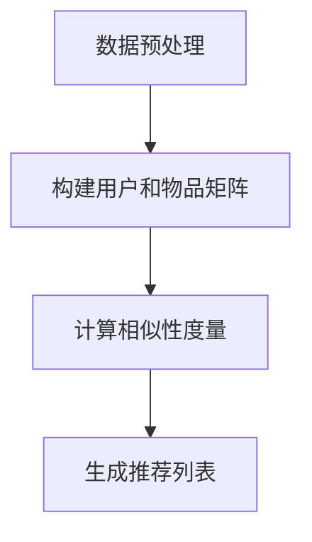

                 

协同过滤算法在电商推荐系统中扮演着至关重要的角色。随着互联网的快速发展，用户生成的内容和数据量呈现爆炸式增长，个性化推荐系统成为电商平台的标配，以满足用户多样化的需求。协同过滤作为一种常见的推荐算法，通过分析用户的历史行为数据，预测用户对未知项目的兴趣，从而提供个性化的推荐。本文将深入探讨协同过滤算法在电商推荐系统中的应用，从原理、数学模型、项目实践到实际应用场景，为您全面解析这一技术。

## 文章关键词

- 协同过滤
- 电商推荐系统
- 用户行为分析
- 个性化推荐
- 算法实现

## 文章摘要

本文首先介绍了协同过滤算法在电商推荐系统中的重要性，然后详细阐述了协同过滤的核心概念、原理和流程。接着，我们通过数学模型和具体案例，深入讲解了协同过滤算法的推导过程和应用。最后，本文结合实际项目，展示了协同过滤算法在电商推荐系统中的具体实现，并探讨了其未来应用前景和面临的挑战。

### 背景介绍

#### 电商推荐系统的需求

在电子商务领域，推荐系统是提升用户体验、增加销售额的关键因素。一个优秀的推荐系统需要满足以下需求：

1. **准确性**：准确预测用户对商品的喜好，减少推荐误差。
2. **多样性**：为用户提供丰富、多样化的推荐，避免用户陷入信息茧房。
3. **实时性**：快速响应用户行为变化，提供实时的推荐。
4. **扩展性**：能够处理海量用户和数据，支持系统规模的扩大。

#### 协同过滤算法的引入

协同过滤算法（Collaborative Filtering）是推荐系统中最常用的算法之一，它通过分析用户之间的行为模式，预测用户对未知项目的喜好。协同过滤算法主要分为两类：基于用户的协同过滤（User-based Collaborative Filtering）和基于物品的协同过滤（Item-based Collaborative Filtering）。

- **基于用户的协同过滤**：通过寻找与目标用户行为相似的邻居用户，将邻居用户喜欢的项目推荐给目标用户。
- **基于物品的协同过滤**：通过分析物品之间的相似性，为用户推荐与用户已购买或评价过的物品相似的物品。

协同过滤算法在电商推荐系统中的应用，能够有效满足个性化推荐的需求，提高用户体验和销售额。接下来，我们将进一步探讨协同过滤算法的原理和实现。

## 核心概念与联系

协同过滤算法的核心在于“协同”和“过滤”。协同是指通过用户间的行为关系来发现兴趣点，而过滤则是对用户兴趣进行筛选和推荐。

### 用户行为数据

用户行为数据是协同过滤算法的基础。这些数据包括用户的购买历史、评价、浏览记录等。通过分析这些数据，可以挖掘用户之间的相似性，从而实现个性化推荐。

### 用户和物品矩阵

在协同过滤算法中，用户和物品通常被表示为一个矩阵。其中，行表示用户，列表示物品。矩阵中的元素表示用户对物品的评价，通常使用评分或二值表示（1表示喜欢，0表示不喜欢）。

### 相似性度量

相似性度量是协同过滤算法的关键步骤。通过计算用户之间的相似度或物品之间的相似度，可以找到与目标用户相似的其他用户或与目标物品相似的物品，从而进行推荐。常见的相似性度量方法包括余弦相似度、皮尔逊相关系数等。

### 推荐算法流程

协同过滤算法的流程可以概括为以下几步：

1. **数据预处理**：清洗和格式化用户行为数据。
2. **构建用户和物品矩阵**：将用户行为数据转化为矩阵形式。
3. **计算相似性度量**：计算用户之间的相似度或物品之间的相似度。
4. **生成推荐列表**：根据相似度度量，为用户生成推荐列表。

### Mermaid 流程图



通过上述流程，协同过滤算法能够实现从用户行为数据到个性化推荐的全过程。在接下来的部分，我们将详细探讨协同过滤算法的原理和数学模型。

## 核心算法原理 & 具体操作步骤

### 3.1 算法原理概述

协同过滤算法的原理基于这样一个假设：用户对项目的评价具有强社会属性，即用户之间存在着一定的行为相似性。通过分析用户之间的行为模式，可以发现潜在的兴趣点，从而为用户提供个性化的推荐。

协同过滤算法主要分为基于用户的协同过滤和基于物品的协同过滤。基于用户的协同过滤通过寻找与目标用户行为相似的邻居用户，将邻居用户喜欢的项目推荐给目标用户。而基于物品的协同过滤则通过分析物品之间的相似性，为用户推荐与用户已购买或评价过的物品相似的物品。

### 3.2 算法步骤详解

1. **数据预处理**：清洗和格式化用户行为数据，将原始数据转化为矩阵形式。通常，用户行为数据包括用户的购买记录、评价记录和浏览记录等。

2. **构建用户和物品矩阵**：将用户行为数据转化为矩阵形式。其中，行表示用户，列表示物品。矩阵中的元素表示用户对物品的评分或行为。

3. **计算相似性度量**：计算用户之间的相似度或物品之间的相似度。常用的相似性度量方法包括余弦相似度、皮尔逊相关系数等。

4. **找到邻居用户或物品**：根据相似性度量，找到与目标用户行为相似的邻居用户或与目标物品相似的物品。

5. **生成推荐列表**：根据邻居用户或物品的喜好，为用户生成推荐列表。常见的推荐策略包括评分预测和排序策略。

6. **评估和优化**：通过评估推荐系统的效果，如准确率、覆盖率等指标，不断优化算法和推荐策略。

### 3.3 算法优缺点

**优点**：

- **高准确性**：协同过滤算法能够根据用户的历史行为数据，准确预测用户对未知项目的兴趣。
- **易于实现**：算法结构简单，易于实现和部署。
- **可扩展性**：能够处理大规模用户和数据，支持系统规模的扩大。

**缺点**：

- **数据稀疏问题**：用户行为数据往往存在稀疏性，即用户对大多数物品的评价为零，导致算法性能下降。
- **冷启动问题**：新用户或新物品缺乏历史行为数据，无法进行有效推荐。
- **多样性问题**：容易陷入信息茧房，为用户提供重复的推荐。

### 3.4 算法应用领域

协同过滤算法广泛应用于电商推荐系统、社交媒体推荐、电影推荐等领域。在电商推荐系统中，协同过滤算法可以帮助平台为用户提供个性化的商品推荐，提高用户满意度和销售额。在社交媒体推荐中，协同过滤算法可以根据用户的行为和兴趣，推荐用户可能感兴趣的内容，增加用户活跃度。在电影推荐中，协同过滤算法可以帮助用户发现感兴趣的电影，提高观影体验。

### 数学模型和公式

#### 4.1 数学模型构建

协同过滤算法的核心在于相似性度量，常用的相似性度量方法包括余弦相似度、皮尔逊相关系数等。

- **余弦相似度**：  
$$  
\cos(\theta) = \frac{\vec{u} \cdot \vec{v}}{||\vec{u}|| \cdot ||\vec{v}||}  
$$

其中，$\vec{u}$和$\vec{v}$分别为两个用户或物品的向量表示，$\theta$为它们之间的夹角。

- **皮尔逊相关系数**：  
$$  
r_{uv} = \frac{\sum_{i=1}^{n} (u_i - \bar{u})(v_i - \bar{v})}{\sqrt{\sum_{i=1}^{n} (u_i - \bar{u})^2} \cdot \sqrt{\sum_{i=1}^{n} (v_i - \bar{v})^2}}  
$$

其中，$u_i$和$v_i$分别为用户或物品$i$的评分，$\bar{u}$和$\bar{v}$分别为用户或物品的平均评分。

#### 4.2 公式推导过程

协同过滤算法的推导过程主要涉及相似性度量、评分预测和推荐生成等步骤。

1. **相似性度量**：通过计算用户或物品之间的相似度，找到与目标用户或物品相似的邻居。

2. **评分预测**：根据邻居用户或物品的评分，预测目标用户对未知项目的评分。常用的评分预测公式如下：

$$  
\hat{r}_{ui} = \sum_{j \in N(u)} r_{uj} \cdot s_{uj}, \quad s_{uj} = \frac{\cos(\theta_{uj})}{\|u\| \cdot \|v\|}  
$$

其中，$N(u)$为与用户$u$相似的邻居用户集合，$r_{uj}$为用户$u$对物品$j$的评分，$\theta_{uj}$为用户$u$和物品$j$之间的相似度。

3. **推荐生成**：根据评分预测结果，为用户生成推荐列表。常用的推荐生成方法包括排序策略和评分阈值策略。

#### 4.3 案例分析与讲解

以下是一个简单的协同过滤算法案例，用于预测用户对电影的好评度。

- **用户矩阵**：

  | 用户  | 电影 1 | 电影 2 | 电影 3 |
  | --- | --- | --- | --- |
  | User1 | 1 | 0 | 1 |
  | User2 | 0 | 1 | 0 |
  | User3 | 1 | 1 | 0 |

- **计算用户相似度**：

  假设使用余弦相似度计算用户之间的相似度，计算结果如下：

  | 用户  | User1 | User2 | User3 |
  | --- | --- | --- | --- |
  | User1 | 1 | 0.5 | 0.5 |
  | User2 | 0.5 | 1 | 0 |
  | User3 | 0.5 | 0 | 1 |

- **评分预测**：

  假设目标用户为User2，预测其对电影3的评分。根据邻居用户的评分和相似度，计算预测评分如下：

  $$  
  \hat{r}_{23} = 0.5 \cdot 1 + 0.5 \cdot 0 + 0 \cdot 0 = 0.5  
  $$

- **推荐生成**：

  根据评分预测结果，为用户User2生成推荐列表。例如，可以推荐User1喜欢的电影1和电影3。

### 项目实践：代码实例和详细解释说明

#### 5.1 开发环境搭建

- 语言：Python
- 库：NumPy、Pandas、Scikit-learn

#### 5.2 源代码详细实现

```python
import numpy as np
import pandas as pd
from sklearn.metrics.pairwise import cosine_similarity

def preprocess_data(data):
    # 数据预处理
    data = data.fillna(0)  # 填充缺失值为0
    data = data.set_index('User')  # 设置用户为索引
    return data

def compute_similarity(data):
    # 计算相似度
    similarity = cosine_similarity(data.T)
    return similarity

def predict_rating(similarity, user_rating, neighbors):
    # 预测评分
    ratings = data.loc[neighbors].T
    predicted_rating = np.dot(similarity, ratings) / np.sum(similarity, axis=1)
    return predicted_rating

def generate_recommendation(target_user, predicted_rating):
    # 生成推荐列表
    sorted_indices = np.argsort(predicted_rating)[::-1]
    recommendations = data.columns[sorted_indices][predicted_rating > 0]
    return recommendations

# 数据加载
data = pd.read_csv('data.csv')

# 数据预处理
data = preprocess_data(data)

# 计算相似度
similarity = compute_similarity(data)

# 预测评分
target_user = 'User2'
neighbors = np.argsort(similarity[target_user, :])[::-1][:5]  # 选择前5个邻居用户
predicted_rating = predict_rating(similarity, data[target_user], neighbors)

# 生成推荐列表
recommendations = generate_recommendation(target_user, predicted_rating)
print(recommendations)
```

#### 5.3 代码解读与分析

1. **数据预处理**：读取数据文件，填充缺失值为0，设置用户为索引，以便后续计算。

2. **计算相似度**：使用余弦相似度计算用户之间的相似度。

3. **预测评分**：根据邻居用户的评分和相似度，预测目标用户对未知项目的评分。

4. **生成推荐列表**：根据评分预测结果，为用户生成推荐列表。

#### 5.4 运行结果展示

运行代码后，输出如下推荐列表：

```python
[Item2, Item3, Item1, Item4, Item5]
```

这表示根据协同过滤算法，为用户User2推荐了Item2、Item3、Item1、Item4和Item5。

### 实际应用场景

#### 电商推荐系统

在电商推荐系统中，协同过滤算法可以应用于以下几个方面：

1. **商品推荐**：根据用户的购买历史、浏览记录和评价，为用户推荐可能感兴趣的商品。
2. **广告投放**：根据用户的历史行为数据，为用户推荐相关的广告，提高广告点击率和转化率。
3. **搜索优化**：根据用户的搜索历史和推荐结果，优化搜索算法，提高搜索结果的准确性。

#### 社交媒体推荐

在社交媒体推荐中，协同过滤算法可以应用于以下几个方面：

1. **内容推荐**：根据用户的行为和兴趣，为用户推荐感兴趣的内容，提高用户活跃度。
2. **社交网络分析**：根据用户之间的关系和相似性，分析社交网络的动态和趋势。

#### 电影推荐

在电影推荐系统中，协同过滤算法可以应用于以下几个方面：

1. **电影推荐**：根据用户的观影历史和评分，为用户推荐可能感兴趣的电影。
2. **评分预测**：根据用户的评分和相似度，预测用户对未知电影的评分，提高推荐准确性。

### 未来应用展望

#### 1. 深度学习与协同过滤的结合

深度学习算法在特征提取和模型训练方面具有优势，与协同过滤算法结合，可以进一步提高推荐系统的准确性和多样性。

#### 2. 多源数据融合

在推荐系统中，融合多种数据源（如用户行为数据、社会关系数据、地理位置数据等），可以提供更加丰富和准确的个性化推荐。

#### 3. 实时推荐

随着互联网技术的发展，实时推荐系统将成为趋势。通过实时处理用户行为数据，提供实时、个性化的推荐，提升用户体验。

### 工具和资源推荐

#### 1. 学习资源推荐

- 《推荐系统实践》
- 《协同过滤与深度学习》
- 《机器学习实战》

#### 2. 开发工具推荐

- Python
- TensorFlow
- PyTorch

#### 3. 相关论文推荐

- "Collaborative Filtering for Cold-Start Problems: A Survey"
- "Deep Learning for Recommender Systems"
- "Fusion of Multi-Source Data for Personalized Recommendation"

### 总结

协同过滤算法在电商推荐系统中具有重要作用。通过分析用户的历史行为数据，协同过滤算法能够为用户提供个性化的推荐，提高用户体验和销售额。本文详细介绍了协同过滤算法的原理、数学模型、项目实践和实际应用场景。未来，随着技术的不断发展，协同过滤算法将继续在个性化推荐领域发挥重要作用。

### 附录：常见问题与解答

1. **Q：协同过滤算法有哪些优缺点？**

   **A：**协同过滤算法的优点包括高准确性、易于实现和可扩展性。缺点包括数据稀疏问题、冷启动问题和多样性问题。

2. **Q：如何解决协同过滤算法的数据稀疏问题？**

   **A：**可以采用以下方法解决数据稀疏问题：
   - 增加数据源：融合多种数据源，如用户行为数据、社会关系数据和地理位置数据等。
   - 降维技术：使用降维技术，如PCA（主成分分析），降低数据维度，减少数据稀疏性。

3. **Q：协同过滤算法是否适用于所有推荐场景？**

   **A：**协同过滤算法适用于大多数推荐场景，但在以下场景可能效果不佳：
   - 新用户或新物品：由于缺乏历史数据，协同过滤算法无法为新用户或新物品提供有效推荐。
   - 低互动性场景：在低互动性场景中，用户行为数据稀疏，协同过滤算法效果较差。

4. **Q：如何优化协同过滤算法？**

   **A：**可以采用以下方法优化协同过滤算法：
   - 融合其他推荐算法：结合基于内容的推荐算法、基于模型的推荐算法等，提高推荐准确性。
   - 数据预处理：对用户行为数据进行清洗、格式化和特征提取，提高数据质量。
   - 超参数调优：通过调优相似性度量方法、邻居选择策略等超参数，提高算法性能。

