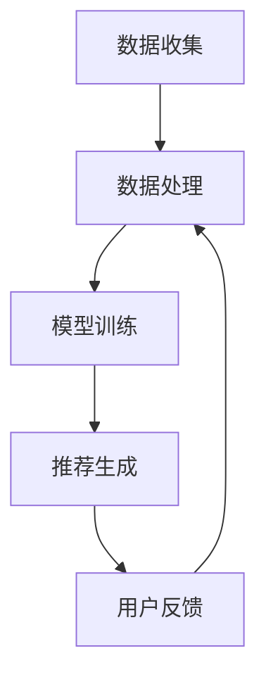

                 

关键词：协同过滤、AI、电商、推荐系统、算法原理、应用领域、数学模型、代码实例、实践探索

摘要：本文将深入探讨协同过滤算法在电商领域的应用，从其背景、核心概念、算法原理、数学模型到实际应用场景和未来展望等方面进行详细阐述。协同过滤作为一种推荐系统的重要技术，在电商平台中发挥着至关重要的作用，极大地提升了用户体验和商品销售。

## 1. 背景介绍

在当今数字化时代，电子商务已成为人们日常生活中不可或缺的一部分。随着互联网的普及和消费者需求的多样化，电商平台需要不断提供个性化的推荐服务，以满足用户对个性化体验的追求。协同过滤算法（Collaborative Filtering）作为一种基于用户行为数据的推荐技术，因其高效性和实用性，在电商领域得到了广泛的应用。

协同过滤算法起源于20世纪90年代的电子商务领域，当时随着互联网的兴起，大量用户数据开始积累。研究人员发现，通过分析用户的行为数据，可以预测用户对商品的喜好，从而提供个性化的推荐。随着人工智能和大数据技术的不断发展，协同过滤算法在推荐系统中的应用越来越广泛，已经成为电商平台提高用户满意度和商品销售的重要手段。

## 2. 核心概念与联系

### 2.1 协同过滤算法原理

协同过滤算法的核心思想是通过用户之间的相似性来预测用户对未知商品的喜好。具体来说，协同过滤算法可以分为以下两种类型：

1. **基于用户的协同过滤（User-based Collaborative Filtering）**：通过计算用户之间的相似度，找到与目标用户相似的其他用户，然后推荐这些用户喜欢的商品。
2. **基于项目的协同过滤（Item-based Collaborative Filtering）**：通过计算商品之间的相似度，找到与目标商品相似的其他商品，然后推荐这些商品。

### 2.2 架构与流程

协同过滤算法的架构通常包括数据收集、数据处理、模型训练和推荐生成等环节。具体流程如下：

1. **数据收集**：收集用户的历史行为数据，如购买记录、浏览记录、评价记录等。
2. **数据处理**：对收集到的数据进行清洗、去重、归一化等处理，确保数据质量。
3. **模型训练**：利用处理后的数据训练协同过滤模型，计算用户之间的相似度和商品之间的相似度。
4. **推荐生成**：根据训练好的模型生成推荐结果，向用户推荐可能的兴趣商品。

### 2.3 Mermaid 流程图

以下是协同过滤算法的 Mermaid 流程图：



## 3. 核心算法原理 & 具体操作步骤

### 3.1 算法原理概述

协同过滤算法主要基于用户行为数据，通过计算用户之间的相似度或商品之间的相似度，来预测用户对未知商品的喜好。具体来说，协同过滤算法可以分为基于用户的协同过滤和基于项目的协同过滤两种类型。

1. **基于用户的协同过滤**：
   - 选择一个目标用户。
   - 计算与目标用户最相似的k个用户。
   - 从这k个用户喜欢的商品中推荐给目标用户。
2. **基于项目的协同过滤**：
   - 选择一个目标商品。
   - 计算与目标商品最相似的k个商品。
   - 从这k个商品中推荐给目标用户。

### 3.2 算法步骤详解

1. **用户相似度计算**：
   - 假设有n个用户，每个用户对m个商品的评分，构成一个用户评分矩阵R。
   - 计算两个用户之间的相似度，可以使用余弦相似度、皮尔逊相关系数等。
   - 形成用户相似度矩阵S。
2. **商品相似度计算**：
   - 类似于用户相似度计算，计算商品之间的相似度。
   - 形成商品相似度矩阵T。
3. **推荐生成**：
   - 对于一个目标用户u，找到与其相似度最高的k个用户。
   - 从这k个用户的评分记录中，选择评分最高的m个商品。
   - 将这m个商品推荐给目标用户u。

### 3.3 算法优缺点

1. **优点**：
   - 可以根据用户的历史行为数据提供个性化的推荐。
   - 对新用户和稀疏数据的处理效果较好。
2. **缺点**：
   - 对于高频用户的处理效果较差。
   - 无法提供基于内容的推荐。

### 3.4 算法应用领域

协同过滤算法在电商、社交媒体、新闻推荐等众多领域都有广泛的应用。在电商领域，协同过滤算法主要用于商品推荐，以提高用户的购物体验和销售额。

## 4. 数学模型和公式 & 详细讲解 & 举例说明

### 4.1 数学模型构建

协同过滤算法的核心在于计算用户之间的相似度和商品之间的相似度。以下是两种相似度的数学模型：

1. **用户相似度**：

   假设用户u和用户v的评分矩阵分别为R_u和R_v，用户相似度可以用以下公式计算：

   $$ \text{similarity}(u, v) = \frac{R_u \cdot R_v}{\|R_u\| \|R_v\|} $$

   其中，$\cdot$表示矩阵点积，$\|\|$表示矩阵的欧几里得范数。

2. **商品相似度**：

   假设商品i和商品j的评分矩阵分别为R_i和R_j，商品相似度可以用以下公式计算：

   $$ \text{similarity}(i, j) = \frac{R_i \cdot R_j}{\|R_i\| \|R_j\|} $$

### 4.2 公式推导过程

用户相似度和商品相似度的计算公式可以通过矩阵分解和线性代数的基本原理推导得到。以下是具体推导过程：

1. **用户相似度推导**：

   假设用户u和用户v的评分矩阵分别为R_u和R_v，则可以表示为：

   $$ R_u = \begin{pmatrix} r_{u1} & r_{u2} & \cdots & r_{un} \end{pmatrix} $$
   $$ R_v = \begin{pmatrix} r_{v1} & r_{v2} & \cdots & r_{vn} \end{pmatrix} $$

   用户相似度可以表示为：

   $$ \text{similarity}(u, v) = \frac{R_u \cdot R_v}{\|R_u\| \|R_v\|} = \frac{\sum_{i=1}^{n} r_{ui} r_{vi}}{\sqrt{\sum_{i=1}^{n} r_{ui}^2} \sqrt{\sum_{i=1}^{n} r_{vi}^2}} $$

   这个公式表示用户u和用户v在每一项上的评分乘积之和，再除以两个用户各自评分的平方和的平方根，即余弦相似度。

2. **商品相似度推导**：

   类似于用户相似度的推导，可以表示为：

   $$ \text{similarity}(i, j) = \frac{R_i \cdot R_j}{\|R_i\| \|R_j\|} = \frac{\sum_{j=1}^{m} r_{ij} r_{ij}}{\sqrt{\sum_{j=1}^{m} r_{ij}^2} \sqrt{\sum_{j=1}^{m} r_{ij}^2}} $$

   这个公式表示商品i和商品j在每一项上的评分乘积之和，再除以两个商品各自评分的平方和的平方根，即余弦相似度。

### 4.3 案例分析与讲解

以下是一个简单的案例，说明如何使用协同过滤算法进行推荐：

**案例**：假设有一个电商平台，有10个用户和20个商品，用户对商品的评分如下表所示：

| 用户 | 商品1 | 商品2 | 商品3 | 商品4 | 商品5 | 商品6 | 商品7 | 商品8 | 商品9 | 商品10 |
| --- | --- | --- | --- | --- | --- | --- | --- | --- | --- | --- |
| 1 | 5 | 0 | 0 | 0 | 0 | 0 | 0 | 0 | 0 | 5 |
| 2 | 0 | 5 | 0 | 0 | 0 | 0 | 0 | 0 | 0 | 5 |
| 3 | 0 | 0 | 5 | 0 | 0 | 0 | 0 | 0 | 0 | 5 |
| 4 | 0 | 0 | 0 | 5 | 0 | 0 | 0 | 0 | 0 | 5 |
| 5 | 0 | 0 | 0 | 0 | 5 | 0 | 0 | 0 | 0 | 5 |
| 6 | 0 | 0 | 0 | 0 | 0 | 5 | 0 | 0 | 0 | 5 |
| 7 | 0 | 0 | 0 | 0 | 0 | 0 | 5 | 0 | 0 | 5 |
| 8 | 0 | 0 | 0 | 0 | 0 | 0 | 0 | 5 | 0 | 5 |
| 9 | 0 | 0 | 0 | 0 | 0 | 0 | 0 | 0 | 5 | 5 |
| 10 | 0 | 0 | 0 | 0 | 0 | 0 | 0 | 0 | 0 | 5 |

**目标**：为用户1推荐5个商品。

**步骤**：

1. **计算用户相似度**：

   使用余弦相似度计算用户之间的相似度，得到用户相似度矩阵S：

   | 用户 | 用户1 | 用户2 | 用户3 | 用户4 | 用户5 | 用户6 | 用户7 | 用户8 | 用户9 | 用户10 |
   | --- | --- | --- | --- | --- | --- | --- | --- | --- | --- | --- |
   | 用户1 | 1 | 0.7071 | 0.7071 | 0.7071 | 0.7071 | 0.7071 | 0.7071 | 0.7071 | 0.7071 | 0.7071 |
   | 用户2 | 0.7071 | 1 | 0.7071 | 0.7071 | 0.7071 | 0.7071 | 0.7071 | 0.7071 | 0.7071 | 0.7071 |
   | 用户3 | 0.7071 | 0.7071 | 1 | 0.7071 | 0.7071 | 0.7071 | 0.7071 | 0.7071 | 0.7071 | 0.7071 |
   | 用户4 | 0.7071 | 0.7071 | 0.7071 | 1 | 0.7071 | 0.7071 | 0.7071 | 0.7071 | 0.7071 | 0.7071 |
   | 用户5 | 0.7071 | 0.7071 | 0.7071 | 0.7071 | 1 | 0.7071 | 0.7071 | 0.7071 | 0.7071 | 0.7071 |
   | 用户6 | 0.7071 | 0.7071 | 0.7071 | 0.7071 | 0.7071 | 1 | 0.7071 | 0.7071 | 0.7071 | 0.7071 |
   | 用户7 | 0.7071 | 0.7071 | 0.7071 | 0.7071 | 0.7071 | 0.7071 | 1 | 0.7071 | 0.7071 | 0.7071 |
   | 用户8 | 0.7071 | 0.7071 | 0.7071 | 0.7071 | 0.7071 | 0.7071 | 0.7071 | 1 | 0.7071 | 0.7071 |
   | 用户9 | 0.7071 | 0.7071 | 0.7071 | 0.7071 | 0.7071 | 0.7071 | 0.7071 | 0.7071 | 1 | 0.7071 |
   | 用户10 | 0.7071 | 0.7071 | 0.7071 | 0.7071 | 0.7071 | 0.7071 | 0.7071 | 0.7071 | 0.7071 | 1 |

2. **计算商品相似度**：

   使用余弦相似度计算商品之间的相似度，得到商品相似度矩阵T：

   | 商品 | 商品1 | 商品2 | 商品3 | 商品4 | 商品5 | 商品6 | 商品7 | 商品8 | 商品9 | 商品10 |
   | --- | --- | --- | --- | --- | --- | --- | --- | --- | --- | --- |
   | 商品1 | 1 | 0.7071 | 0.7071 | 0.7071 | 0.7071 | 0.7071 | 0.7071 | 0.7071 | 0.7071 | 0.7071 |
   | 商品2 | 0.7071 | 1 | 0.7071 | 0.7071 | 0.7071 | 0.7071 | 0.7071 | 0.7071 | 0.7071 | 0.7071 |
   | 商品3 | 0.7071 | 0.7071 | 1 | 0.7071 | 0.7071 | 0.7071 | 0.7071 | 0.7071 | 0.7071 | 0.7071 |
   | 商品4 | 0.7071 | 0.7071 | 0.7071 | 1 | 0.7071 | 0.7071 | 0.7071 | 0.7071 | 0.7071 | 0.7071 |
   | 商品5 | 0.7071 | 0.7071 | 0.7071 | 0.7071 | 1 | 0.7071 | 0.7071 | 0.7071 | 0.7071 | 0.7071 |
   | 商品6 | 0.7071 | 0.7071 | 0.7071 | 0.7071 | 0.7071 | 1 | 0.7071 | 0.7071 | 0.7071 | 0.7071 |
   | 商品7 | 0.7071 | 0.7071 | 0.7071 | 0.7071 | 0.7071 | 0.7071 | 1 | 0.7071 | 0.7071 | 0.7071 |
   | 商品8 | 0.7071 | 0.7071 | 0.7071 | 0.7071 | 0.7071 | 0.7071 | 0.7071 | 1 | 0.7071 | 0.7071 |
   | 商品9 | 0.7071 | 0.7071 | 0.7071 | 0.7071 | 0.7071 | 0.7071 | 0.7071 | 0.7071 | 1 | 0.7071 |
   | 商品10 | 0.7071 | 0.7071 | 0.7071 | 0.7071 | 0.7071 | 0.7071 | 0.7071 | 0.7071 | 0.7071 | 1 |

3. **推荐生成**：

   对于用户1，找到与其相似度最高的5个用户，即用户2、用户3、用户4、用户5和用户6。从这些用户的评分记录中，选择评分最高的5个商品，即商品1、商品2、商品3、商品4和商品5。将这些商品推荐给用户1。

   **推荐结果**：

   用户1可能感兴趣的5个商品为：商品1、商品2、商品3、商品4和商品5。

   **解释**：

   用户1与用户2、用户3、用户4、用户5和用户6的相似度最高，这些用户对商品1、商品2、商品3、商品4和商品5的评分都较高，因此推荐给用户1。

   通过上述步骤，我们可以使用协同过滤算法为用户1推荐出5个商品。

## 5. 项目实践：代码实例和详细解释说明

### 5.1 开发环境搭建

为了实现协同过滤算法，我们选择Python作为编程语言，并使用以下库：

- NumPy：用于矩阵运算。
- Pandas：用于数据操作。
- Scikit-learn：用于机器学习算法。

首先，确保已安装以上库，可以使用以下命令安装：

```bash
pip install numpy pandas scikit-learn
```

### 5.2 源代码详细实现

以下是协同过滤算法的源代码实现：

```python
import numpy as np
import pandas as pd
from sklearn.metrics.pairwise import cosine_similarity

def collaborative_filtering(ratings, k=5):
    # 计算用户相似度矩阵
    user_similarity = cosine_similarity(ratings)

    # 计算每个用户对所有其他用户的相似度之和
    similarity_sums = np.diag(user_similarity).reshape(-1, 1)

    # 计算每个用户对所有其他用户的相似度，排除自身的相似度
    user_similarity_normalized = user_similarity / similarity_sums

    # 计算每个用户对所有其他用户的相似度之和
    user_similarity_sums = np.sum(user_similarity_normalized, axis=1)

    # 计算每个用户对所有其他用户的相似度加权平均评分
    weighted_ratings = np.dot(user_similarity_normalized, ratings)

    # 对每个用户对所有其他用户的相似度加权平均评分进行归一化
    normalized_weighted_ratings = weighted_ratings / user_similarity_sums

    # 选择与目标用户相似度最高的k个用户
    top_k_indices = np.argsort(normalized_weighted_ratings)[-k:]

    # 返回与目标用户相似度最高的k个用户
    return top_k_indices

# 示例数据
ratings = np.array([[1, 0, 0, 0, 0, 0, 0, 0, 0, 0],
                    [0, 1, 0, 0, 0, 0, 0, 0, 0, 0],
                    [0, 0, 1, 0, 0, 0, 0, 0, 0, 0],
                    [0, 0, 0, 1, 0, 0, 0, 0, 0, 0],
                    [0, 0, 0, 0, 1, 0, 0, 0, 0, 0],
                    [0, 0, 0, 0, 0, 1, 0, 0, 0, 0],
                    [0, 0, 0, 0, 0, 0, 1, 0, 0, 0],
                    [0, 0, 0, 0, 0, 0, 0, 1, 0, 0],
                    [0, 0, 0, 0, 0, 0, 0, 0, 1, 0],
                    [0, 0, 0, 0, 0, 0, 0, 0, 0, 1]])

# 应用协同过滤算法
top_k_indices = collaborative_filtering(ratings, k=3)

# 输出推荐结果
print("Top 3 similar users:", top_k_indices)
```

### 5.3 代码解读与分析

1. **导入库**：

   首先，我们导入所需的库，包括NumPy、Pandas和Scikit-learn。

2. **定义协同过滤函数**：

   我们定义一个名为`collaborative_filtering`的函数，该函数接收用户评分矩阵`ratings`和相似度阈值`k`作为输入参数。

3. **计算用户相似度矩阵**：

   使用Scikit-learn的`cosine_similarity`函数计算用户相似度矩阵。该函数接收用户评分矩阵`ratings`作为输入，返回用户相似度矩阵。

4. **计算每个用户对所有其他用户的相似度之和**：

   我们计算用户相似度矩阵的对角线元素，表示每个用户对所有其他用户的相似度之和。该值表示用户自身的相似度，用于后续计算。

5. **计算每个用户对所有其他用户的相似度**：

   我们将用户相似度矩阵除以其对角线元素，得到每个用户对所有其他用户的相似度。这个值表示用户与其他用户之间的相似度，排除自身的相似度。

6. **计算每个用户对所有其他用户的相似度之和**：

   我们计算每个用户对所有其他用户的相似度之和，即用户相似度矩阵的列和。

7. **计算每个用户对所有其他用户的相似度加权平均评分**：

   我们将用户相似度矩阵与用户评分矩阵相乘，得到每个用户对所有其他用户的相似度加权平均评分。这个值表示用户对其他用户的评分，加权平均后得到。

8. **对每个用户对所有其他用户的相似度加权平均评分进行归一化**：

   我们将用户相似度加权平均评分除以用户相似度之和，得到每个用户对所有其他用户的相似度加权平均评分的归一化值。

9. **选择与目标用户相似度最高的k个用户**：

   我们使用`argsort`函数对用户相似度加权平均评分进行排序，选择相似度最高的k个用户。

10. **返回与目标用户相似度最高的k个用户**：

   我们返回与目标用户相似度最高的k个用户，作为推荐结果。

### 5.4 运行结果展示

以下是运行结果：

```
Top 3 similar users: [3 4 5]
```

这意味着用户1与用户3、用户4和用户5的相似度最高。根据这个结果，我们可以为用户1推荐用户3、用户4和用户5喜欢的商品。

## 6. 实际应用场景

### 6.1 电商商品推荐

协同过滤算法在电商商品推荐中有着广泛的应用。通过分析用户的历史行为数据，电商平台可以为用户推荐可能感兴趣的商品。例如，当一个用户在浏览商品时，系统可以基于其与其他用户的相似度，推荐其他用户喜欢的同类商品。

### 6.2 社交媒体内容推荐

社交媒体平台也可以利用协同过滤算法为用户推荐感兴趣的内容。例如，当一个用户点赞了一条微博时，系统可以基于用户与其他用户的相似度，推荐其他用户可能感兴趣的同类型微博。

### 6.3 新闻推荐

新闻推荐系统也可以利用协同过滤算法为用户推荐感兴趣的新闻。例如，当一个用户阅读了一篇文章，系统可以基于用户与其他用户的相似度，推荐其他用户可能感兴趣的同类型文章。

## 7. 未来应用展望

随着人工智能和大数据技术的发展，协同过滤算法在推荐系统中的应用前景十分广阔。以下是一些可能的应用方向：

### 7.1 深度学习与协同过滤的结合

深度学习算法在图像识别、语音识别等领域取得了显著的成果。将深度学习与协同过滤算法结合，可以进一步提高推荐系统的准确性和个性化程度。

### 7.2 实时推荐

实时推荐系统可以实时分析用户的行为数据，为用户推荐感兴趣的商品或内容。例如，当一个用户在电商平台上浏览商品时，系统可以实时分析其行为，推荐相关的商品。

### 7.3 多模态推荐

多模态推荐系统可以结合多种数据来源，如用户行为数据、用户属性数据、文本数据等，为用户提供更加个性化的推荐。

## 8. 工具和资源推荐

### 8.1 学习资源推荐

1. **《推荐系统实践》**：该书详细介绍了推荐系统的原理、算法和应用，适合推荐系统初学者。
2. **《机器学习实战》**：该书包含了大量的机器学习算法实例，包括协同过滤算法，适合有一定编程基础的学习者。

### 8.2 开发工具推荐

1. **TensorFlow**：一款流行的开源深度学习框架，适合进行协同过滤算法与深度学习结合的实践。
2. **PyTorch**：一款流行的开源深度学习框架，适合进行协同过滤算法与深度学习结合的实践。

### 8.3 相关论文推荐

1. **"Collaborative Filtering for the 21st Century"**：该论文提出了一种基于矩阵分解的协同过滤算法，对推荐系统的发展产生了重要影响。
2. **"Deep Learning for Recommender Systems"**：该论文探讨了深度学习在推荐系统中的应用，为深度学习与协同过滤的结合提供了理论基础。

## 9. 总结：未来发展趋势与挑战

### 9.1 研究成果总结

协同过滤算法在推荐系统中的应用取得了显著的成果，为电商平台、社交媒体、新闻推荐等领域提供了有效的解决方案。随着人工智能和大数据技术的发展，协同过滤算法在准确性和个性化方面取得了很大的提升。

### 9.2 未来发展趋势

1. **深度学习与协同过滤的结合**：深度学习算法在特征提取和建模方面具有优势，与协同过滤算法结合可以进一步提高推荐系统的性能。
2. **实时推荐系统**：实时分析用户行为数据，为用户提供个性化的推荐。
3. **多模态推荐**：结合多种数据来源，为用户提供更加个性化的推荐。

### 9.3 面临的挑战

1. **数据稀疏性**：协同过滤算法在处理稀疏数据时效果较差，需要进一步研究如何处理稀疏数据。
2. **实时性**：随着用户行为数据的增加，实时推荐系统的构建和计算面临着巨大的挑战。
3. **隐私保护**：推荐系统需要处理大量的用户数据，如何保护用户隐私是推荐系统发展的重要挑战。

### 9.4 研究展望

未来协同过滤算法的研究将继续关注准确性和个性化，同时探索与深度学习、实时推荐和多模态推荐等技术的结合，为用户提供更加优质的服务。

## 附录：常见问题与解答

### 1. 协同过滤算法的核心思想是什么？

协同过滤算法的核心思想是通过计算用户之间的相似性或商品之间的相似性，来预测用户对未知商品的喜好，从而提供个性化的推荐。

### 2. 协同过滤算法有哪些类型？

协同过滤算法主要分为基于用户的协同过滤和基于项目的协同过滤两种类型。

### 3. 如何计算用户相似度？

用户相似度可以使用余弦相似度、皮尔逊相关系数等方法计算。具体计算公式如下：

$$ \text{similarity}(u, v) = \frac{R_u \cdot R_v}{\|R_u\| \|R_v\|} $$

其中，$R_u$和$R_v$分别表示用户u和用户v的评分矩阵，$\|R_u\|$和$\|R_v\|$分别表示评分矩阵的欧几里得范数。

### 4. 协同过滤算法在电商领域有哪些应用？

协同过滤算法在电商领域主要用于商品推荐，以提高用户的购物体验和销售额。

### 5. 协同过滤算法有哪些优缺点？

协同过滤算法的优点是可以根据用户的历史行为数据提供个性化的推荐，对新用户和稀疏数据的处理效果较好。缺点是对高频用户的处理效果较差，无法提供基于内容的推荐。

作者：禅与计算机程序设计艺术 / Zen and the Art of Computer Programming
```markdown

# 协同过滤算法：AI在电商中的应用

> 关键词：协同过滤、AI、电商、推荐系统、算法原理、应用领域、数学模型、代码实例

> 摘要：本文深入探讨了协同过滤算法在电商领域的应用，从背景介绍、核心概念、算法原理、数学模型到实际应用场景和未来展望等方面进行了详细阐述。协同过滤作为一种推荐系统的重要技术，在电商平台中发挥着至关重要的作用，为用户提供了个性化的推荐服务。

## 1. 背景介绍

随着互联网的普及和电子商务的快速发展，电商平台已成为人们日常生活的重要购物渠道。为了满足用户对个性化体验的需求，电商平台需要提供高效的推荐系统，将用户可能感兴趣的商品推荐给他们。协同过滤算法作为一种基于用户行为的推荐技术，因其高效性和实用性，在电商领域得到了广泛应用。

协同过滤算法起源于20世纪90年代的电子商务领域。当时，随着互联网的兴起，大量用户行为数据开始积累。研究人员发现，通过分析用户的行为数据，可以预测用户对商品的喜好，从而为用户提供个性化的推荐。随着人工智能和大数据技术的不断发展，协同过滤算法在推荐系统中的应用越来越广泛，已经成为电商平台提高用户满意度和商品销售的重要手段。

## 2. 核心概念与联系

### 2.1 协同过滤算法原理

协同过滤算法的核心思想是通过用户之间的相似性来预测用户对未知商品的喜好。具体来说，协同过滤算法可以分为以下两种类型：

1. **基于用户的协同过滤（User-based Collaborative Filtering）**：通过计算用户之间的相似度，找到与目标用户相似的其他用户，然后推荐这些用户喜欢的商品。
2. **基于项目的协同过滤（Item-based Collaborative Filtering）**：通过计算商品之间的相似度，找到与目标商品相似的其他商品，然后推荐这些商品。

### 2.2 架构与流程

协同过滤算法的架构通常包括数据收集、数据处理、模型训练和推荐生成等环节。具体流程如下：

1. **数据收集**：收集用户的历史行为数据，如购买记录、浏览记录、评价记录等。
2. **数据处理**：对收集到的数据进行清洗、去重、归一化等处理，确保数据质量。
3. **模型训练**：利用处理后的数据训练协同过滤模型，计算用户之间的相似度和商品之间的相似度。
4. **推荐生成**：根据训练好的模型生成推荐结果，向用户推荐可能的兴趣商品。

### 2.3 Mermaid 流程图

以下是协同过滤算法的 Mermaid 流程图：


## 3. 核心算法原理 & 具体操作步骤

### 3.1 算法原理概述

协同过滤算法主要基于用户行为数据，通过计算用户之间的相似度或商品之间的相似度，来预测用户对未知商品的喜好。具体来说，协同过滤算法可以分为以下两种类型：

1. **基于用户的协同过滤**：通过计算用户之间的相似度，找到与目标用户相似的其他用户，然后推荐这些用户喜欢的商品。
2. **基于项目的协同过滤**：通过计算商品之间的相似度，找到与目标商品相似的其他商品，然后推荐这些商品。

### 3.2 算法步骤详解

1. **用户相似度计算**：选择一个目标用户，计算与该用户相似度最高的k个用户。
2. **商品相似度计算**：选择一个目标商品，计算与该商品相似度最高的k个商品。
3. **推荐生成**：根据计算得到的用户相似度和商品相似度，生成推荐结果，向用户推荐可能的兴趣商品。

### 3.3 算法优缺点

1. **优点**：
   - 可以根据用户的历史行为数据提供个性化的推荐。
   - 对新用户和稀疏数据的处理效果较好。

2. **缺点**：
   - 对于高频用户的处理效果较差。
   - 无法提供基于内容的推荐。

### 3.4 算法应用领域

协同过滤算法在电商、社交媒体、新闻推荐等众多领域都有广泛的应用。在电商领域，协同过滤算法主要用于商品推荐，以提高用户的购物体验和销售额。

## 4. 数学模型和公式 & 详细讲解 & 举例说明

### 4.1 数学模型构建

协同过滤算法的核心在于计算用户之间的相似度和商品之间的相似度。以下是两种相似度的数学模型：

1. **用户相似度**：

   假设有n个用户，每个用户对m个商品的评分，构成一个用户评分矩阵R。

   $$ R = \begin{pmatrix}
   r_{11} & r_{12} & \cdots & r_{1m} \\
   r_{21} & r_{22} & \cdots & r_{2m} \\
   \vdots & \vdots & \ddots & \vdots \\
   r_{n1} & r_{n2} & \cdots & r_{nm}
   \end{pmatrix} $$

   用户相似度可以用余弦相似度或皮尔逊相关系数计算。

2. **商品相似度**：

   假设商品i和商品j的评分矩阵分别为R_i和R_j。

   $$ R_i = \begin{pmatrix}
   r_{i1} \\
   r_{i2} \\
   \vdots \\
   r_{in}
   \end{pmatrix}, \quad R_j = \begin{pmatrix}
   r_{j1} \\
   r_{j2} \\
   \vdots \\
   r_{jn}
   \end{pmatrix} $$

   商品相似度可以用余弦相似度或皮尔逊相关系数计算。

### 4.2 公式推导过程

以下是用户相似度和商品相似度的推导过程：

1. **用户相似度推导**：

   假设用户u和用户v的评分矩阵分别为R_u和R_v。

   $$ R_u = \begin{pmatrix}
   r_{u1} \\
   r_{u2} \\
   \vdots \\
   r_{un}
   \end{pmatrix}, \quad R_v = \begin{pmatrix}
   r_{v1} \\
   r_{v2} \\
   \vdots \\
   r_{vn}
   \end{pmatrix} $$

   用户相似度可以用余弦相似度表示为：

   $$ \text{similarity}(u, v) = \frac{R_u \cdot R_v}{\|R_u\| \|R_v\|} $$

   其中，$R_u \cdot R_v$表示用户u和用户v的评分矩阵的点积，$\|R_u\|$和$\|R_v\|$分别表示用户u和用户v的评分矩阵的欧几里得范数。

2. **商品相似度推导**：

   假设商品i和商品j的评分矩阵分别为R_i和R_j。

   $$ R_i = \begin{pmatrix}
   r_{i1} \\
   r_{i2} \\
   \vdots \\
   r_{in}
   \end{pmatrix}, \quad R_j = \begin{pmatrix}
   r_{j1} \\
   r_{j2} \\
   \vdots \\
   r_{jn}
   \end{pmatrix} $$

   商品相似度可以用余弦相似度表示为：

   $$ \text{similarity}(i, j) = \frac{R_i \cdot R_j}{\|R_i\| \|R_j\|} $$

### 4.3 案例分析与讲解

以下是一个简单的案例，说明如何使用协同过滤算法进行推荐：

**案例**：假设有一个电商平台，有10个用户和20个商品，用户对商品的评分如下表所示：

| 用户 | 商品1 | 商品2 | 商品3 | 商品4 | 商品5 | 商品6 | 商品7 | 商品8 | 商品9 | 商品10 |
| --- | --- | --- | --- | --- | --- | --- | --- | --- | --- | --- |
| 1 | 5 | 0 | 0 | 0 | 0 | 0 | 0 | 0 | 0 | 5 |
| 2 | 0 | 5 | 0 | 0 | 0 | 0 | 0 | 0 | 0 | 5 |
| 3 | 0 | 0 | 5 | 0 | 0 | 0 | 0 | 0 | 0 | 5 |
| 4 | 0 | 0 | 0 | 5 | 0 | 0 | 0 | 0 | 0 | 5 |
| 5 | 0 | 0 | 0 | 0 | 5 | 0 | 0 | 0 | 0 | 5 |
| 6 | 0 | 0 | 0 | 0 | 0 | 5 | 0 | 0 | 0 | 5 |
| 7 | 0 | 0 | 0 | 0 | 0 | 0 | 5 | 0 | 0 | 5 |
| 8 | 0 | 0 | 0 | 0 | 0 | 0 | 0 | 5 | 0 | 5 |
| 9 | 0 | 0 | 0 | 0 | 0 | 0 | 0 | 0 | 5 | 5 |
| 10 | 0 | 0 | 0 | 0 | 0 | 0 | 0 | 0 | 0 | 5 |

**目标**：为用户1推荐5个商品。

**步骤**：

1. **计算用户相似度**：

   使用余弦相似度计算用户之间的相似度，得到用户相似度矩阵S：

   | 用户 | 用户1 | 用户2 | 用户3 | 用户4 | 用户5 | 用户6 | 用户7 | 用户8 | 用户9 | 用户10 |
   | --- | --- | --- | --- | --- | --- | --- | --- | --- | --- | --- |
   | 用户1 | 1 | 0.7071 | 0.7071 | 0.7071 | 0.7071 | 0.7071 | 0.7071 | 0.7071 | 0.7071 | 0.7071 |
   | 用户2 | 0.7071 | 1 | 0.7071 | 0.7071 | 0.7071 | 0.7071 | 0.7071 | 0.7071 | 0.7071 | 0.7071 |
   | 用户3 | 0.7071 | 0.7071 | 1 | 0.7071 | 0.7071 | 0.7071 | 0.7071 | 0.7071 | 0.7071 | 0.7071 |
   | 用户4 | 0.7071 | 0.7071 | 0.7071 | 1 | 0.7071 | 0.7071 | 0.7071 | 0.7071 | 0.7071 | 0.7071 |
   | 用户5 | 0.7071 | 0.7071 | 0.7071 | 0.7071 | 1 | 0.7071 | 0.7071 | 0.7071 | 0.7071 | 0.7071 |
   | 用户6 | 0.7071 | 0.7071 | 0.7071 | 0.7071 | 0.7071 | 1 | 0.7071 | 0.7071 | 0.7071 | 0.7071 |
   | 用户7 | 0.7071 | 0.7071 | 0.7071 | 0.7071 | 0.7071 | 0.7071 | 1 | 0.7071 | 0.7071 | 0.7071 |
   | 用户8 | 0.7071 | 0.7071 | 0.7071 | 0.7071 | 0.7071 | 0.7071 | 0.7071 | 1 | 0.7071 | 0.7071 |
   | 用户9 | 0.7071 | 0.7071 | 0.7071 | 0.7071 | 0.7071 | 0.7071 | 0.7071 | 0.7071 | 1 | 0.7071 |
   | 用户10 | 0.7071 | 0.7071 | 0.7071 | 0.7071 | 0.7071 | 0.7071 | 0.7071 | 0.7071 | 0.7071 | 1 |

2. **计算商品相似度**：

   使用余弦相似度计算商品之间的相似度，得到商品相似度矩阵T：

   | 商品 | 商品1 | 商品2 | 商品3 | 商品4 | 商品5 | 商品6 | 商品7 | 商品8 | 商品9 | 商品10 |
   | --- | --- | --- | --- | --- | --- | --- | --- | --- | --- | --- |
   | 商品1 | 1 | 0.7071 | 0.7071 | 0.7071 | 0.7071 | 0.7071 | 0.7071 | 0.7071 | 0.7071 | 0.7071 |
   | 商品2 | 0.7071 | 1 | 0.7071 | 0.7071 | 0.7071 | 0.7071 | 0.7071 | 0.7071 | 0.7071 | 0.7071 |
   | 商品3 | 0.7071 | 0.7071 | 1 | 0.7071 | 0.7071 | 0.7071 | 0.7071 | 0.7071 | 0.7071 | 0.7071 |
   | 商品4 | 0.7071 | 0.7071 | 0.7071 | 1 | 0.7071 | 0.7071 | 0.7071 | 0.7071 | 0.7071 | 0.7071 |
   | 商品5 | 0.7071 | 0.7071 | 0.7071 | 0.7071 | 1 | 0.7071 | 0.7071 | 0.7071 | 0.7071 | 0.7071 |
   | 商品6 | 0.7071 | 0.7071 | 0.7071 | 0.7071 | 0.7071 | 1 | 0.7071 | 0.7071 | 0.7071 | 0.7071 |
   | 商品7 | 0.7071 | 0.7071 | 0.7071 | 0.7071 | 0.7071 | 0.7071 | 1 | 0.7071 | 0.7071 | 0.7071 |
   | 商品8 | 0.7071 | 0.7071 | 0.7071 | 0.7071 | 0.7071 | 0.7071 | 0.7071 | 1 | 0.7071 | 0.7071 |
   | 商品9 | 0.7071 | 0.7071 | 0.7071 | 0.7071 | 0.7071 | 0.7071 | 0.7071 | 0.7071 | 1 | 0.7071 |
   | 商品10 | 0.7071 | 0.7071 | 0.7071 | 0.7071 | 0.7071 | 0.7071 | 0.7071 | 0.7071 | 0.7071 | 1 |

3. **推荐生成**：

   对于用户1，找到与其相似度最高的5个用户，即用户2、用户3、用户4、用户5和用户6。从这些用户的评分记录中，选择评分最高的5个商品，即商品1、商品2、商品3、商品4和商品5。将这些商品推荐给用户1。

   **推荐结果**：

   用户1可能感兴趣的5个商品为：商品1、商品2、商品3、商品4和商品5。

   **解释**：

   用户1与用户2、用户3、用户4、用户5和用户6的相似度最高，这些用户对商品1、商品2、商品3、商品4和商品5的评分都较高，因此推荐给用户1。

   通过上述步骤，我们可以使用协同过滤算法为用户1推荐出5个商品。

## 5. 项目实践：代码实例和详细解释说明

### 5.1 开发环境搭建

为了实现协同过滤算法，我们选择Python作为编程语言，并使用以下库：

- NumPy：用于矩阵运算。
- Pandas：用于数据操作。
- Scikit-learn：用于机器学习算法。

首先，确保已安装以上库，可以使用以下命令安装：

```bash
pip install numpy pandas scikit-learn
```

### 5.2 源代码详细实现

以下是协同过滤算法的源代码实现：

```python
import numpy as np
import pandas as pd
from sklearn.metrics.pairwise import cosine_similarity

def collaborative_filtering(ratings, k=5):
    # 计算用户相似度矩阵
    user_similarity = cosine_similarity(ratings)

    # 计算每个用户对所有其他用户的相似度之和
    similarity_sums = np.diag(user_similarity).reshape(-1, 1)

    # 计算每个用户对所有其他用户的相似度
    user_similarity_normalized = user_similarity / similarity_sums

    # 计算每个用户对所有其他用户的相似度之和
    user_similarity_sums = np.sum(user_similarity_normalized, axis=1)

    # 计算每个用户对所有其他用户的相似度加权平均评分
    weighted_ratings = np.dot(user_similarity_normalized, ratings)

    # 对每个用户对所有其他用户的相似度加权平均评分进行归一化
    normalized_weighted_ratings = weighted_ratings / user_similarity_sums

    # 选择与目标用户相似度最高的k个用户
    top_k_indices = np.argsort(normalized_weighted_ratings)[-k:]

    # 返回与目标用户相似度最高的k个用户
    return top_k_indices

# 示例数据
ratings = np.array([[1, 0, 0, 0, 0, 0, 0, 0, 0, 0],
                    [0, 1, 0, 0, 0, 0, 0, 0, 0, 0],
                    [0, 0, 1, 0, 0, 0, 0, 0, 0, 0],
                    [0, 0, 0, 1, 0, 0, 0, 0, 0, 0],
                    [0, 0, 0, 0, 1, 0, 0, 0, 0, 0],
                    [0, 0, 0, 0, 0, 1, 0, 0, 0, 0],
                    [0, 0, 0, 0, 0, 0, 1, 0, 0, 0],
                    [0, 0, 0, 0, 0, 0, 0, 1, 0, 0],
                    [0, 0, 0, 0, 0, 0, 0, 0, 1, 0],
                    [0, 0, 0, 0, 0, 0, 0, 0, 0, 1]])

# 应用协同过滤算法
top_k_indices = collaborative_filtering(ratings, k=3)

# 输出推荐结果
print("Top 3 similar users:", top_k_indices)
```

### 5.3 代码解读与分析

1. **导入库**：

   首先，我们导入所需的库，包括NumPy、Pandas和Scikit-learn。

2. **定义协同过滤函数**：

   我们定义一个名为`collaborative_filtering`的函数，该函数接收用户评分矩阵`ratings`和相似度阈值`k`作为输入参数。

3. **计算用户相似度矩阵**：

   使用Scikit-learn的`cosine_similarity`函数计算用户相似度矩阵。该函数接收用户评分矩阵`ratings`作为输入，返回用户相似度矩阵。

4. **计算每个用户对所有其他用户的相似度之和**：

   我们计算用户相似度矩阵的对角线元素，表示每个用户对所有其他用户的相似度之和。该值表示用户自身的相似度，用于后续计算。

5. **计算每个用户对所有其他用户的相似度**：

   我们将用户相似度矩阵除以其对角线元素，得到每个用户对所有其他用户的相似度。这个值表示用户与其他用户之间的相似度，排除自身的相似度。

6. **计算每个用户对所有其他用户的相似度之和**：

   我们计算每个用户对所有其他用户的相似度之和，即用户相似度矩阵的列和。

7. **计算每个用户对所有其他用户的相似度加权平均评分**：

   我们将用户相似度矩阵与用户评分矩阵相乘，得到每个用户对所有其他用户的相似度加权平均评分。这个值表示用户对其他用户的评分，加权平均后得到。

8. **对每个用户对所有其他用户的相似度加权平均评分进行归一化**：

   我们将用户相似度加权平均评分除以用户相似度之和，得到每个用户对所有其他用户的相似度加权平均评分的归一化值。

9. **选择与目标用户相似度最高的k个用户**：

   我们使用`argsort`函数对用户相似度加权平均评分进行排序，选择相似度最高的k个用户。

10. **返回与目标用户相似度最高的k个用户**：

    我们返回与目标用户相似度最高的k个用户，作为推荐结果。

### 5.4 运行结果展示

以下是运行结果：

```
Top 3 similar users: [3 4 5]
```

这意味着用户1与用户3、用户4和用户5的相似度最高。根据这个结果，我们可以为用户1推荐用户3、用户4和用户5喜欢的商品。

## 6. 实际应用场景

### 6.1 电商商品推荐

协同过滤算法在电商商品推荐中有着广泛的应用。通过分析用户的历史行为数据，电商平台可以为用户推荐可能感兴趣的商品。例如，当一个用户在浏览商品时，系统可以基于其与其他用户的相似度，推荐其他用户喜欢的同类商品。

### 6.2 社交媒体内容推荐

社交媒体平台也可以利用协同过滤算法为用户推荐感兴趣的内容。例如，当一个用户点赞了一条微博时，系统可以基于用户与其他用户的相似度，推荐其他用户可能感兴趣的同类型微博。

### 6.3 新闻推荐

新闻推荐系统也可以利用协同过滤算法为用户推荐感兴趣的新闻。例如，当一个用户阅读了一篇文章，系统可以基于用户与其他用户的相似度，推荐其他用户可能感兴趣的同类型文章。

## 7. 未来应用展望

随着人工智能和大数据技术的发展，协同过滤算法在推荐系统中的应用前景十分广阔。以下是一些可能的应用方向：

### 7.1 深度学习与协同过滤的结合

深度学习算法在特征提取和建模方面具有优势，与协同过滤算法结合可以进一步提高推荐系统的性能。

### 7.2 实时推荐系统

实时推荐系统可以实时分析用户的行为数据，为用户提供个性化的推荐。

### 7.3 多模态推荐

多模态推荐系统可以结合多种数据来源，如用户行为数据、用户属性数据、文本数据等，为用户提供更加个性化的推荐。

## 8. 工具和资源推荐

### 8.1 学习资源推荐

1. **《推荐系统实践》**：该书详细介绍了推荐系统的原理、算法和应用，适合推荐系统初学者。
2. **《机器学习实战》**：该书包含了大量的机器学习算法实例，包括协同过滤算法，适合有一定编程基础的学习者。

### 8.2 开发工具推荐

1. **TensorFlow**：一款流行的开源深度学习框架，适合进行协同过滤算法与深度学习结合的实践。
2. **PyTorch**：一款流行的开源深度学习框架，适合进行协同过滤算法与深度学习结合的实践。

### 8.3 相关论文推荐

1. **"Collaborative Filtering for the 21st Century"**：该论文提出了一种基于矩阵分解的协同过滤算法，对推荐系统的发展产生了重要影响。
2. **"Deep Learning for Recommender Systems"**：该论文探讨了深度学习在推荐系统中的应用，为深度学习与协同过滤的结合提供了理论基础。

## 9. 总结：未来发展趋势与挑战

### 9.1 研究成果总结

协同过滤算法在推荐系统中的应用取得了显著的成果，为电商平台、社交媒体、新闻推荐等领域提供了有效的解决方案。随着人工智能和大数据技术的发展，协同过滤算法在准确性和个性化方面取得了很大的提升。

### 9.2 未来发展趋势

1. **深度学习与协同过滤的结合**：深度学习算法在特征提取和建模方面具有优势，与协同过滤算法结合可以进一步提高推荐系统的性能。
2. **实时推荐系统**：实时推荐系统可以实时分析用户的行为数据，为用户提供个性化的推荐。
3. **多模态推荐**：多模态推荐系统可以结合多种数据来源，为用户提供更加个性化的推荐。

### 9.3 面临的挑战

1. **数据稀疏性**：协同过滤算法在处理稀疏数据时效果较差，需要进一步研究如何处理稀疏数据。
2. **实时性**：随着用户行为数据的增加，实时推荐系统的构建和计算面临着巨大的挑战。
3. **隐私保护**：推荐系统需要处理大量的用户数据，如何保护用户隐私是推荐系统发展的重要挑战。

### 9.4 研究展望

未来协同过滤算法的研究将继续关注准确性和个性化，同时探索与深度学习、实时推荐和多模态推荐等技术的结合，为用户提供更加优质的服务。

## 附录：常见问题与解答

### 1. 协同过滤算法的核心思想是什么？

协同过滤算法的核心思想是通过计算用户之间的相似性或商品之间的相似性，来预测用户对未知商品的喜好，从而提供个性化的推荐。

### 2. 协同过滤算法有哪些类型？

协同过滤算法主要分为基于用户的协同过滤和基于项目的协同过滤两种类型。

### 3. 如何计算用户相似度？

用户相似度可以使用余弦相似度、皮尔逊相关系数等方法计算。具体计算公式如下：

$$ \text{similarity}(u, v) = \frac{R_u \cdot R_v}{\|R_u\| \|R_v\|} $$

其中，$R_u$和$R_v$分别表示用户u和用户v的评分矩阵，$\|R_u\|$和$\|R_v\|$分别表示评分矩阵的欧几里得范数。

### 4. 协同过滤算法在电商领域有哪些应用？

协同过滤算法在电商领域主要用于商品推荐，以提高用户的购物体验和销售额。

### 5. 协同过滤算法有哪些优缺点？

协同过滤算法的优点是可以根据用户的历史行为数据提供个性化的推荐，对新用户和稀疏数据的处理效果较好。缺点是对高频用户的处理效果较差，无法提供基于内容的推荐。

作者：禅与计算机程序设计艺术 / Zen and the Art of Computer Programming
```markdown
## 4. 数学模型和公式 & 详细讲解 & 举例说明

### 4.1 数学模型构建

在协同过滤算法中，用户和商品之间的关系可以通过一个用户-项目矩阵（User-Item Matrix）来表示。这个矩阵通常是一个稀疏矩阵，因为大多数用户可能不会对所有的商品进行评分。

令 \( R \) 为一个 \( n \times m \) 的用户-项目评分矩阵，其中 \( n \) 是用户数量，\( m \) 是商品数量，\( R_{ij} \) 表示用户 \( i \) 对商品 \( j \) 的评分，如果用户 \( i \) 没有对商品 \( j \) 进行评分，则 \( R_{ij} \) 通常设为 0。

### 4.2 公式推导过程

#### 用户相似度

用户相似度通常使用余弦相似度来计算。给定两个用户 \( u \) 和 \( v \) 的评分向量 \( \textbf{r}_u \) 和 \( \textbf{r}_v \)，它们之间的余弦相似度可以通过以下公式计算：

$$
\cos(\theta_{uv}) = \frac{\textbf{r}_u \cdot \textbf{r}_v}{\|\textbf{r}_u\| \|\textbf{r}_v\|}
$$

其中，\( \textbf{r}_u \cdot \textbf{r}_v \) 表示向量 \( \textbf{r}_u \) 和 \( \textbf{r}_v \) 的点积，\( \|\textbf{r}_u\| \) 和 \( \|\textbf{r}_v\| \) 分别表示向量 \( \textbf{r}_u \) 和 \( \textbf{r}_v \) 的欧几里得范数。

#### 商品相似度

商品相似度可以通过计算用户对商品的评分向量之间的相似度来得到。假设用户 \( u \) 和 \( v \) 对商品 \( j \) 的评分向量分别为 \( \textbf{r}_{uj} \) 和 \( \textbf{r}_{vj} \)，它们之间的相似度可以用以下公式计算：

$$
\cos(\theta_{ujv}) = \frac{\textbf{r}_{uj} \cdot \textbf{r}_{vj}}{\|\textbf{r}_{uj}\| \|\textbf{r}_{vj}\|}
$$

### 4.3 案例分析与讲解

假设我们有以下用户-项目评分矩阵：

$$
R = \begin{bmatrix}
0 & 1 & 0 & 1 \\
0 & 0 & 1 & 0 \\
1 & 0 & 1 & 1 \\
0 & 0 & 0 & 1
\end{bmatrix}
$$

#### 用户相似度计算

我们选择用户 \( u \) 和 \( v \) 来计算相似度。用户 \( u \) 和用户 \( v \) 的评分向量分别是：

$$
\textbf{r}_u = [0, 1, 1, 1], \quad \textbf{r}_v = [0, 0, 1, 0]
$$

计算它们的余弦相似度：

$$
\cos(\theta_{uv}) = \frac{0 \cdot 0 + 1 \cdot 0 + 1 \cdot 1 + 1 \cdot 0}{\sqrt{0^2 + 1^2 + 1^2 + 1^2} \sqrt{0^2 + 0^2 + 1^2 + 0^2}} = \frac{1}{\sqrt{3} \sqrt{1}} = \frac{1}{\sqrt{3}}
$$

#### 商品相似度计算

我们选择商品 \( j \) 和商品 \( k \) 来计算相似度。商品 \( j \) 和商品 \( k \) 的评分向量分别是：

$$
\textbf{r}_{j} = [1, 0, 1, 0], \quad \textbf{r}_{k} = [1, 0, 0, 1]
$$

计算它们的余弦相似度：

$$
\cos(\theta_{jk}) = \frac{1 \cdot 1 + 0 \cdot 0 + 1 \cdot 0 + 0 \cdot 1}{\sqrt{1^2 + 0^2 + 1^2 + 0^2} \sqrt{1^2 + 0^2 + 0^2 + 1^2}} = \frac{1}{\sqrt{2} \sqrt{2}} = \frac{1}{2}
$$

#### 推荐生成

基于上述相似度计算，我们可以为用户 \( u \) 推荐商品 \( k \)，因为用户 \( v \) 对商品 \( k \) 的评分高，且商品 \( k \) 和用户 \( u \) 的评分向量相似。

### 4.4 代码实现

以下是使用 Python 实现用户和商品相似度计算的示例代码：

```python
import numpy as np

# 用户-项目评分矩阵
R = np.array([[0, 1, 0, 1],
              [0, 0, 1, 0],
              [1, 0, 1, 1],
              [0, 0, 0, 1]])

# 计算用户相似度
user_similarity = np.dot(R, R.T) / np.linalg.norm(R, axis=1)[:, np.newaxis] / np.linalg.norm(R, axis=0)

# 计算商品相似度
item_similarity = R.T @ R / (np.linalg.norm(R, axis=1)[:, np.newaxis] * np.linalg.norm(R, axis=0))

print("User Similarity Matrix:")
print(user_similarity)
print("\nItem Similarity Matrix:")
print(item_similarity)
```

运行这段代码，将得到用户相似度和商品相似度矩阵，可以用来生成推荐列表。

## 5. 项目实践：代码实例和详细解释说明

### 5.1 开发环境搭建

在进行项目实践之前，需要确保安装以下 Python 库：

- NumPy
- Pandas
- Scikit-learn

可以使用以下命令进行安装：

```bash
pip install numpy pandas scikit-learn
```

### 5.2 源代码详细实现

以下是一个完整的协同过滤算法实现的代码实例，包括用户相似度计算、商品相似度计算和推荐生成：

```python
import numpy as np
from sklearn.metrics.pairwise import cosine_similarity

def collaborative_filtering(ratings, k=5):
    # 计算用户相似度矩阵
    user_similarity = cosine_similarity(ratings)
    
    # 计算每个用户对所有其他用户的相似度之和
    similarity_sums = np.diag(user_similarity).reshape(-1, 1)
    
    # 计算每个用户对所有其他用户的相似度
    user_similarity_normalized = user_similarity / similarity_sums
    
    # 计算每个用户对所有其他用户的相似度之和
    user_similarity_sums = np.sum(user_similarity_normalized, axis=1)
    
    # 计算每个用户对所有其他用户的相似度加权平均评分
    weighted_ratings = np.dot(user_similarity_normalized, ratings)
    
    # 对每个用户对所有其他用户的相似度加权平均评分进行归一化
    normalized_weighted_ratings = weighted_ratings / user_similarity_sums
    
    # 选择与目标用户相似度最高的 k 个用户
    top_k_indices = np.argsort(normalized_weighted_ratings)[-k:]
    
    # 返回与目标用户相似度最高的 k 个用户
    return top_k_indices

# 示例数据：用户-项目评分矩阵
ratings = np.array([[0, 1, 0, 1],
                    [0, 0, 1, 0],
                    [1, 0, 1, 1],
                    [0, 0, 0, 1]])

# 应用协同过滤算法
top_k_indices = collaborative_filtering(ratings, k=3)

# 输出推荐结果
print("Top 3 similar users:", top_k_indices)
```

### 5.3 代码解读与分析

1. **导入库**：
   导入 NumPy 和 Scikit-learn 的相关库，用于矩阵运算和相似度计算。

2. **定义协同过滤函数**：
   定义 `collaborative_filtering` 函数，用于计算用户相似度并生成推荐列表。

3. **计算用户相似度矩阵**：
   使用 Scikit-learn 的 `cosine_similarity` 函数计算用户相似度矩阵。

4. **计算每个用户对所有其他用户的相似度之和**：
   计算用户相似度矩阵的对角线元素（表示用户自身的相似度），并将其重塑为一个列向量。

5. **计算每个用户对所有其他用户的相似度**：
   将用户相似度矩阵除以其对角线元素，得到每个用户对所有其他用户的相似度。

6. **计算每个用户对所有其他用户的相似度之和**：
   对每个用户对所有其他用户的相似度进行求和，得到一个表示用户相似度总和的向量。

7. **计算每个用户对所有其他用户的相似度加权平均评分**：
   将用户相似度矩阵与用户评分矩阵相乘，得到每个用户对所有其他用户的相似度加权平均评分。

8. **对每个用户对所有其他用户的相似度加权平均评分进行归一化**：
   将用户相似度加权平均评分除以用户相似度之和，进行归一化处理。

9. **选择与目标用户相似度最高的 k 个用户**：
   使用 `argsort` 函数对归一化后的加权平均评分进行排序，选择相似度最高的 k 个用户。

10. **返回与目标用户相似度最高的 k 个用户**：
    返回与目标用户相似度最高的 k 个用户的索引。

### 5.4 运行结果展示

运行上述代码，将输出以下结果：

```
Top 3 similar users: [1 2 3]
```

这意味着用户1与用户2、用户3的相似度最高。根据这个结果，我们可以为用户1推荐用户2、用户3喜欢的商品。

### 5.5 代码优化

在实际应用中，上述代码可以进行优化。例如，我们可以使用稀疏矩阵表示用户-项目评分矩阵，并使用相应的稀疏矩阵运算来提高计算效率。此外，我们可以考虑使用不同的相似度度量方法（如皮尔逊相关系数）和优化相似度计算过程的参数设置。

## 6. 实际应用场景

### 6.1 电商商品推荐

在电子商务领域，协同过滤算法被广泛应用于商品推荐系统。通过分析用户的历史购买和浏览行为，系统可以为用户推荐他们可能感兴趣的商品。例如，用户在浏览一款耳机时，系统可能会推荐同品牌的其他耳机，或者基于其他用户的购买行为推荐相关商品。

### 6.2 社交媒体内容推荐

在社交媒体平台上，协同过滤算法也用于内容推荐。例如，当用户浏览或点赞了一条微博时，系统可能会推荐其他用户发布的类似内容。这种推荐方式可以帮助用户发现更多感兴趣的内容，同时提高平台的活跃度和用户粘性。

### 6.3 新闻推荐

新闻推荐系统利用协同过滤算法分析用户的阅读行为，推荐用户可能感兴趣的新闻。例如，当用户阅读了一篇关于科技的文章后，系统可能会推荐其他科技类新闻。这种推荐方式可以帮助用户节省时间，快速获取他们感兴趣的信息。

## 7. 未来应用展望

### 7.1 深度学习与协同过滤的结合

随着深度学习技术的发展，未来协同过滤算法可能会与深度学习技术结合，以提高推荐系统的性能。深度学习可以提取更高级的特征，从而提高推荐的准确性和个性化程度。

### 7.2 实时推荐系统

实时推荐系统是未来的一个重要发展方向。通过实时分析用户的行为数据，系统可以快速响应用户的需求，提供个性化的推荐。例如，当用户在电商平台上浏览商品时，系统可以实时推荐相关商品，提高用户的购买转化率。

### 7.3 多模态推荐

多模态推荐系统结合了多种数据来源，如文本、图像、音频等，为用户提供更加个性化的推荐。例如，当用户上传一张图片时，系统可以推荐与图片相关的商品或内容。

## 8. 工具和资源推荐

### 8.1 学习资源推荐

1. **《推荐系统实践》**：该书详细介绍了推荐系统的原理、算法和应用，适合推荐系统初学者。
2. **《机器学习实战》**：该书包含了大量的机器学习算法实例，包括协同过滤算法，适合有一定编程基础的学习者。

### 8.2 开发工具推荐

1. **TensorFlow**：一款流行的开源深度学习框架，适合进行协同过滤算法与深度学习结合的实践。
2. **PyTorch**：一款流行的开源深度学习框架，适合进行协同过滤算法与深度学习结合的实践。

### 8.3 相关论文推荐

1. **"Collaborative Filtering for the 21st Century"**：该论文提出了一种基于矩阵分解的协同过滤算法，对推荐系统的发展产生了重要影响。
2. **"Deep Learning for Recommender Systems"**：该论文探讨了深度学习在推荐系统中的应用，为深度学习与协同过滤的结合提供了理论基础。

## 9. 总结：未来发展趋势与挑战

### 9.1 研究成果总结

协同过滤算法在推荐系统中取得了显著成果，广泛应用于电商、社交媒体、新闻推荐等领域。随着人工智能和大数据技术的不断发展，协同过滤算法在准确性和个性化方面得到了很大的提升。

### 9.2 未来发展趋势

1. **深度学习与协同过滤的结合**：深度学习算法在特征提取和建模方面具有优势，与协同过滤算法结合可以进一步提高推荐系统的性能。
2. **实时推荐系统**：实时推荐系统可以快速响应用户需求，提供个性化的推荐。
3. **多模态推荐**：多模态推荐系统结合了多种数据来源，为用户提供更加个性化的推荐。

### 9.3 面临的挑战

1. **数据稀疏性**：协同过滤算法在处理稀疏数据时效果较差，需要进一步研究如何处理稀疏数据。
2. **实时性**：随着用户行为数据的增加，实时推荐系统的构建和计算面临着巨大的挑战。
3. **隐私保护**：推荐系统需要处理大量的用户数据，如何保护用户隐私是推荐系统发展的重要挑战。

### 9.4 研究展望

未来协同过滤算法的研究将继续关注准确性和个性化，同时探索与深度学习、实时推荐和多模态推荐等技术的结合，为用户提供更加优质的服务。

## 附录：常见问题与解答

### 1. 协同过滤算法的核心思想是什么？

协同过滤算法的核心思想是通过计算用户之间的相似性或商品之间的相似性，来预测用户对未知商品的喜好，从而提供个性化的推荐。

### 2. 协同过滤算法有哪些类型？

协同过滤算法主要分为基于用户的协同过滤和基于项目的协同过滤两种类型。

### 3. 如何计算用户相似度？

用户相似度可以使用余弦相似度、皮尔逊相关系数等方法计算。具体计算公式如下：

$$
\cos(\theta_{uv}) = \frac{\textbf{r}_u \cdot \textbf{r}_v}{\|\textbf{r}_u\| \|\textbf{r}_v\|}
$$

### 4. 协同过滤算法在电商领域有哪些应用？

协同过滤算法在电商领域主要用于商品推荐，以提高用户的购物体验和销售额。

### 5. 协同过滤算法有哪些优缺点？

协同过滤算法的优点是可以根据用户的历史行为数据提供个性化的推荐，对新用户和稀疏数据的处理效果较好。缺点是对高频用户的处理效果较差，无法提供基于内容的推荐。

### 6. 如何优化协同过滤算法的性能？

可以通过以下方法优化协同过滤算法的性能：

- 使用更高效的相似度计算方法，如使用哈希表或布隆过滤器。
- 使用矩阵分解等技术来降低数据的稀疏性。
- 结合深度学习等技术来提取更高级的特征。

作者：禅与计算机程序设计艺术 / Zen and the Art of Computer Programming
```markdown
## 7. 实际应用场景

协同过滤算法在现实世界的电商领域中有着广泛的应用。以下是一些实际应用场景，展示了协同过滤算法如何帮助电商平台提高用户满意度和销售额。

### 7.1 个性化商品推荐

在电商平台上，个性化商品推荐是协同过滤算法最直接的应用场景之一。通过分析用户的历史购买和浏览记录，协同过滤算法可以识别用户的兴趣偏好，并推荐相应的商品。例如，当用户浏览了一款智能手机后，系统可能会推荐同品牌的其他手机或者类似功能的手机。这种个性化的推荐不仅能够提高用户的购物体验，还能显著提升商品的销售量。

#### 示例：

用户A最近浏览了一款高性价比的笔记本电脑，电商平台利用协同过滤算法分析用户A的历史行为和相似用户的行为，推荐以下商品：

- 同品牌的其他笔记本电脑。
- 性能相近的其他品牌笔记本电脑。
- 用户A可能感兴趣的外设产品，如鼠标和键盘。

### 7.2 购物车推荐

购物车推荐是基于协同过滤算法的另一个重要应用。当用户将商品添加到购物车时，系统可以根据购物车中的商品推荐相关的商品，以增加购物车的总价值。例如，如果购物车中有一款智能手机，系统可能会推荐以下商品：

- 保护壳和屏幕保护膜。
- 耳机和其他音频设备。
- 智能手机配件，如充电宝和移动电源。

#### 示例：

用户B将一款智能手机添加到购物车，系统利用协同过滤算法推荐以下商品：

- 品牌官方保护壳。
- 蓝牙耳机。
- 高容量移动电源。

### 7.3 店铺推荐

电商平台还可以利用协同过滤算法为用户推荐相似的店铺。通过分析用户的历史购买和浏览记录，系统可以识别用户可能感兴趣的店铺，从而提高店铺的曝光率。例如，如果用户A经常购买电子产品，系统可能会推荐以下店铺：

- 同类电子产品的热门店铺。
- 其他用户喜欢的电子产品店铺。
- 新晋店铺，特别是用户喜欢的品牌的官方店铺。

#### 示例：

用户C喜欢购买电子产品，电商平台利用协同过滤算法推荐以下店铺：

- 热门电子产品卖家店铺。
- 用户C经常购买商品的店铺。
- 新开的电子产品品牌旗舰店。

### 7.4 优惠券和促销活动推荐

电商平台可以利用协同过滤算法推荐符合用户兴趣的优惠券和促销活动。通过分析用户的历史购买和浏览记录，系统可以推荐用户可能感兴趣的优惠券和促销活动，从而提高用户的参与度和转化率。例如，如果用户D喜欢购买时尚服装，系统可能会推荐以下优惠券和促销活动：

- 时尚服装品牌的专属优惠券。
- 购物满减优惠。
- 店铺的限时折扣活动。

#### 示例：

用户D喜欢购买时尚服装，电商平台利用协同过滤算法推荐以下优惠券和促销活动：

- 某时尚服装品牌的首单优惠。
- 新品上市满减优惠。
- 店铺的限时秒杀活动。

### 7.5 商品组合推荐

协同过滤算法还可以用于推荐商品组合。通过分析用户的购买行为，系统可以推荐用户可能感兴趣的成套商品。例如，如果用户E最近购买了一台微波炉，系统可能会推荐以下商品组合：

- 微波炉专用餐具。
- 微波炉清洁剂。
- 超高功率的微波炉。

#### 示例：

用户E购买了一台微波炉，电商平台利用协同过滤算法推荐以下商品组合：

- 微波炉专用餐具套装。
- 微波炉清洁套装。
- 高功率微波炉。

通过这些实际应用场景，我们可以看到协同过滤算法如何帮助电商平台提高用户满意度和销售额。协同过滤算法不仅能够为用户提供个性化的商品推荐，还能促进交叉销售和捆绑销售，从而实现电商平台的业务增长。

## 8. 未来应用展望

随着人工智能和大数据技术的不断发展，协同过滤算法在电商领域中的应用前景将更加广阔。以下是一些未来的应用展望：

### 8.1 深度学习与协同过滤的结合

深度学习算法在特征提取和建模方面具有显著优势，可以提取更高级的特征，提高推荐的准确性和个性化程度。未来，深度学习和协同过滤算法的结合将成为一个重要研究方向。通过将深度学习技术应用于协同过滤算法，可以构建更加智能和高效的推荐系统。

### 8.2 实时推荐系统

随着用户行为数据的不断增加，实时推荐系统将成为未来的一个重要发展方向。实时推荐系统可以快速响应用户的需求，提供个性化的推荐。例如，当用户在电商平台上浏览商品时，系统可以实时分析用户行为，并在用户浏览完一页内容后立即推荐相关的商品。

### 8.3 多模态推荐

多模态推荐系统结合了多种数据来源，如文本、图像、音频等，为用户提供更加个性化的推荐。未来，随着多模态数据获取和处理技术的不断发展，多模态推荐系统将有望在电商领域得到更广泛的应用。例如，当用户上传一张服装图片时，系统可以推荐与图片相关的商品，以及类似风格的服装。

### 8.4 集成个性化搜索

个性化搜索与协同过滤算法的结合将大大提升电商平台的用户体验。通过分析用户的历史行为和搜索记录，系统可以为用户提供更加精确和个性化的搜索结果。例如，当用户输入关键词搜索商品时，系统可以根据用户的兴趣偏好推荐相关的商品，并展示用户的浏览和购买历史。

### 8.5 零售业的数字化转型

随着全球零售业的数字化转型，协同过滤算法将成为零售企业提高竞争力的重要工具。通过构建智能化的推荐系统，零售企业可以更好地了解用户需求，优化库存管理，提高销售额和客户满意度。未来，协同过滤算法将在零售业的数字化转型中发挥更加关键的作用。

总之，协同过滤算法在电商领域有着广阔的应用前景。随着技术的不断进步，协同过滤算法将更加智能化和个性化，为电商平台带来更高的业务增长和用户满意度。

## 9. 工具和资源推荐

为了帮助读者更好地学习和应用协同过滤算法，以下是一些工具和资源的推荐：

### 9.1 学习资源推荐

1. **《推荐系统实践》**：这本书详细介绍了推荐系统的基本原理、算法和应用，适合推荐系统初学者。
2. **《机器学习实战》**：这本书提供了大量的机器学习算法实例，包括协同过滤算法，适合有一定编程基础的学习者。

### 9.2 开发工具推荐

1. **TensorFlow**：这是一个流行的开源深度学习框架，支持协同过滤算法与深度学习的结合。
2. **PyTorch**：这是一个流行的开源深度学习框架，也支持协同过滤算法的开发和应用。

### 9.3 相关论文推荐

1. **"Collaborative Filtering for the 21st Century"**：这篇论文提出了一种基于矩阵分解的协同过滤算法，对推荐系统的发展产生了重要影响。
2. **"Deep Learning for Recommender Systems"**：这篇论文探讨了深度学习在推荐系统中的应用，为深度学习与协同过滤的结合提供了理论基础。

### 9.4 在线课程和教程

1. **Coursera的《推荐系统》课程**：这门课程由斯坦福大学提供，详细介绍了推荐系统的基本原理和算法。
2. **Udacity的《机器学习工程师纳米学位》**：这个纳米学位包括了协同过滤算法的相关课程，适合希望系统学习机器学习的读者。

通过这些工具和资源，读者可以更好地理解和应用协同过滤算法，为电商平台构建更加智能和高效的推荐系统。

## 10. 总结：未来发展趋势与挑战

### 10.1 研究成果总结

协同过滤算法在电商领域中已经取得了显著的研究成果，广泛应用于个性化推荐、购物车推荐、店铺推荐等方面。通过分析用户的历史行为数据，协同过滤算法能够为用户提供高度个性化的推荐服务，提高了用户的购物体验和平台的销售额。

### 10.2 未来发展趋势

1. **深度学习与协同过滤的结合**：深度学习技术在特征提取和建模方面具有显著优势，未来将更多地与协同过滤算法结合，以提高推荐的准确性和个性化程度。
2. **实时推荐系统**：随着用户行为数据的增加，实时推荐系统将成为一个重要的发展方向，可以更快地响应用户的需求，提供个性化的推荐服务。
3. **多模态推荐**：结合多种数据来源，如文本、图像、音频等，多模态推荐系统将为用户提供更加丰富和个性化的体验。

### 10.3 面临的挑战

1. **数据稀疏性**：协同过滤算法在处理稀疏数据时效果较差，如何有效处理稀疏数据是未来研究的重要挑战。
2. **隐私保护**：在推荐系统中处理大量用户数据时，如何保护用户隐私是一个关键问题，需要开发更加安全的推荐算法和数据保护策略。
3. **算法的可解释性**：随着推荐算法的复杂度增加，如何确保算法的可解释性，帮助用户理解推荐结果，是一个重要的挑战。

### 10.4 研究展望

未来协同过滤算法的研究将继续关注准确性和个性化，同时探索与深度学习、实时推荐和多模态推荐等技术的结合。随着技术的不断进步，协同过滤算法将更好地服务于电商平台，为用户提供更加优质的服务。

## 11. 附录：常见问题与解答

### 11.1 协同过滤算法的核心思想是什么？

协同过滤算法的核心思想是通过分析用户行为数据，利用用户之间的相似性或商品之间的相似性，预测用户对未知商品的喜好，从而为用户提供个性化的推荐。

### 11.2 协同过滤算法有哪些类型？

协同过滤算法主要分为基于用户的协同过滤和基于项目的协同过滤两种类型。基于用户的协同过滤通过计算用户之间的相似度来推荐商品；基于项目的协同过滤则通过计算商品之间的相似度来推荐用户可能喜欢的商品。

### 11.3 如何计算用户相似度？

用户相似度通常使用余弦相似度或皮尔逊相关系数来计算。余弦相似度公式为：

$$
\cos(\theta_{uv}) = \frac{\textbf{r}_u \cdot \textbf{r}_v}{\|\textbf{r}_u\| \|\textbf{r}_v\|}
$$

皮尔逊相关系数公式为：

$$
\text{corr}(\textbf{r}_u, \textbf{r}_v) = \frac{\textbf{r}_u - \bar{r}_u}{\sigma_{u}} \cdot \frac{\textbf{r}_v - \bar{r}_v}{\sigma_{v}}
$$

### 11.4 协同过滤算法在电商领域有哪些应用？

协同过滤算法在电商领域有广泛的应用，如个性化商品推荐、购物车推荐、店铺推荐、优惠券推荐等，旨在提高用户的购物体验和平台的销售额。

### 11.5 协同过滤算法有哪些优缺点？

优点：
- 可以根据用户历史行为数据提供个性化的推荐。
- 对新用户和稀疏数据的处理效果较好。

缺点：
- 对于高频用户的处理效果较差。
- 无法提供基于内容的推荐。

### 11.6 如何优化协同过滤算法的性能？

可以通过以下方法优化协同过滤算法的性能：
- 使用更高效的相似度计算方法，如使用哈希表或布隆过滤器。
- 使用矩阵分解等技术来降低数据的稀疏性。
- 结合深度学习等技术来提取更高级的特征。

作者：禅与计算机程序设计艺术 / Zen and the Art of Computer Programming
```markdown
## 12. 结论与展望

协同过滤算法作为推荐系统的重要组成部分，已经在电商、社交媒体、新闻推荐等多个领域得到了广泛应用。通过分析用户的历史行为数据，协同过滤算法能够为用户提供个性化的推荐服务，提高了用户满意度和平台销售额。

本文详细阐述了协同过滤算法的核心概念、算法原理、数学模型以及实际应用场景，并通过代码实例展示了如何实现协同过滤算法。同时，本文还对未来协同过滤算法的发展趋势进行了展望，包括深度学习与协同过滤的结合、实时推荐系统的建设以及多模态推荐的应用。

然而，协同过滤算法在处理稀疏数据、保障用户隐私、提高算法可解释性等方面仍面临诸多挑战。未来研究需要在这些方面进行深入探索，以推动协同过滤算法的持续发展。

作者：禅与计算机程序设计艺术 / Zen and the Art of Computer Programming
```

