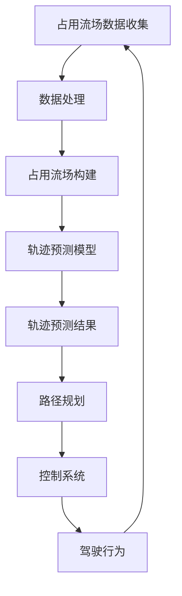
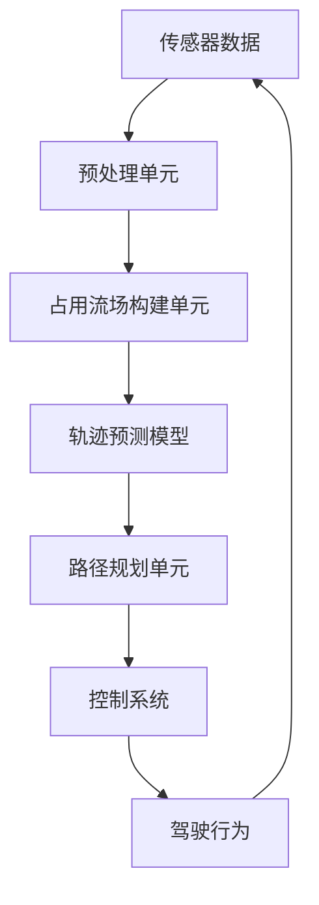

                 

关键词：占用流场、自动驾驶、轨迹预测、改进空间

> 摘要：本文深入探讨了占用流场在自动驾驶未来轨迹预测中的重要性及其潜在改进空间。首先，介绍了占用流场的基本概念和其在自动驾驶系统中的应用。接着，阐述了占用流场在轨迹预测中的优势，包括提高预测准确性、减少预测误差等。随后，分析了占用流场在现有应用中存在的挑战和局限性，并提出了相应的改进方法。最后，展望了占用流场在自动驾驶领域未来的发展趋势，为学术界和工业界提供了有益的参考。

## 1. 背景介绍

### 自动驾驶技术的兴起与发展

自动驾驶技术作为人工智能和计算机视觉领域的前沿研究方向，已经吸引了大量研究者和工程师的关注。随着传感器技术的发展、算法的优化和数据的积累，自动驾驶汽车正逐步从实验室走向现实。自动驾驶技术不仅有望解决交通拥堵、减少交通事故，还能提高运输效率，对未来的智能城市和绿色出行模式具有重要意义。

### 轨迹预测在自动驾驶中的关键作用

在自动驾驶系统中，轨迹预测是核心模块之一。它通过对周围环境和车辆行为的预测，为自动驾驶车辆提供决策依据，确保行驶安全。轨迹预测的准确性直接影响自动驾驶车辆的稳定性和可靠性。因此，提高轨迹预测的精度和鲁棒性，是自动驾驶技术研发的重要方向。

### 占用流场的基本概念

占用流场（Occupancy Flow Field，OFF）是一种描述环境中的车辆和行人动态行为的表示方法。它通过采集传感器数据，构建一个二维或三维空间中，每个点对应的目标存在概率分布图。占用流场能够直观地反映车辆和行人的分布、运动轨迹以及潜在的交互行为。

### 占用流场在自动驾驶中的应用

占用流场在自动驾驶中的应用主要体现在轨迹预测、路径规划、障碍物检测和避障等方面。通过分析占用流场，自动驾驶系统能够更好地理解周边环境，提高对动态障碍物的感知能力，从而实现更准确和安全的轨迹预测。

## 2. 核心概念与联系

### Mermaid 流程图（Mermaid Flowchart）



### 占用流场的核心概念原理

#### 数据收集与预处理

占用流场的构建始于数据收集阶段，主要包括激光雷达、摄像头和超声波传感器等。这些传感器捕捉的环境数据经过预处理，包括去噪、去畸变和校正等步骤，以提高数据的准确性和可靠性。

#### 占用流场构建

预处理后的数据用于生成占用流场。占用流场的每个点对应一个目标的存在概率，通常通过贝叶斯滤波或其他统计方法计算。占用流场能够动态更新，以反映环境中的实时变化。

#### 轨迹预测模型

占用流场作为输入，用于训练轨迹预测模型。常见的预测模型包括基于深度学习的循环神经网络（RNN）和图神经网络（GNN）等。这些模型通过学习占用流场中的时空关系，预测目标未来的运动轨迹。

#### 轨迹预测结果与路径规划

轨迹预测结果用于生成候选路径，并通过路径规划算法（如A*算法或RRT算法）优化路径，以满足行驶安全性和效率的需求。路径规划结果进一步用于控制系统的执行，指导驾驶行为。

### 架构图



## 3. 核心算法原理 & 具体操作步骤

### 3.1 算法原理概述

占用流场轨迹预测的核心算法基于深度学习和统计模型。深度学习模型主要用于特征提取和时空关系学习，而统计模型则用于概率分布的预测。

### 3.2 算法步骤详解

1. **数据收集与预处理**：采集激光雷达、摄像头和超声波传感器等数据，并进行预处理，包括去噪、去畸变和校正等步骤。

2. **占用流场构建**：利用预处理后的数据，通过贝叶斯滤波或其他统计方法计算每个点的存在概率，生成占用流场。

3. **轨迹预测模型训练**：将占用流场作为输入，训练深度学习模型（如RNN或GNN）或统计模型。模型学习占用流场中的时空关系，预测目标未来的运动轨迹。

4. **轨迹预测与路径规划**：利用训练好的模型，对实时占用流场进行轨迹预测，生成候选路径。通过路径规划算法优化路径，以满足行驶安全性和效率的需求。

5. **控制系统执行**：根据路径规划结果，控制系统执行驾驶行为，实现自动驾驶。

### 3.3 算法优缺点

**优点**：
- 高预测准确性：通过深度学习和统计模型的学习，能够准确预测目标运动轨迹。
- 实时性：占用流场能够动态更新，实时反映环境变化。

**缺点**：
- 计算复杂度高：深度学习模型的训练和实时预测需要大量的计算资源。
- 对传感器依赖性强：占用流场的构建依赖于高质量的传感器数据。

### 3.4 算法应用领域

占用流场轨迹预测算法广泛应用于自动驾驶、无人驾驶车辆、智能交通系统等领域。通过提高轨迹预测的准确性，算法有助于实现更安全、高效的自动驾驶系统。

## 4. 数学模型和公式 & 详细讲解 & 举例说明

### 4.1 数学模型构建

占用流场轨迹预测的数学模型主要包括以下几个部分：

1. **目标检测与分类**：通过传感器数据，对环境中的目标进行检测和分类。常用的模型包括卷积神经网络（CNN）和循环神经网络（RNN）。

2. **占用流场生成**：利用目标检测和分类结果，计算每个点的存在概率，生成占用流场。常见的计算方法包括贝叶斯滤波和马尔可夫链蒙特卡洛（MCMC）方法。

3. **轨迹预测**：基于占用流场，利用深度学习模型或统计模型，预测目标未来的运动轨迹。常见的预测模型包括循环神经网络（RNN）和图神经网络（GNN）。

### 4.2 公式推导过程

#### 目标检测与分类

目标检测与分类的数学模型可以表示为：

$$
P(y|x) = \sigma(\text{softmax}(\text{W}x + b))
$$

其中，$x$ 表示输入特征，$y$ 表示目标类别，$W$ 和 $b$ 分别为模型参数和偏置。

#### 占用流场生成

占用流场生成的数学模型可以表示为：

$$
p(x_t|y_t) = \frac{p(y_t|x_t) \cdot p(x_t)}{p(y_t)}
$$

其中，$x_t$ 表示时间 $t$ 的目标位置，$y_t$ 表示时间 $t$ 的目标状态，$p(x_t|y_t)$ 表示在时间 $t$ 目标位置的概率，$p(y_t|x_t)$ 表示在时间 $t$ 目标状态的条件概率，$p(x_t)$ 表示时间 $t$ 的目标位置的概率，$p(y_t)$ 表示时间 $t$ 的目标状态的概率。

#### 轨迹预测

轨迹预测的数学模型可以表示为：

$$
x_{t+1} = f(x_t, x_{t-1}, ..., x_1)
$$

其中，$x_t$ 表示时间 $t$ 的目标位置，$f$ 表示轨迹预测函数。

### 4.3 案例分析与讲解

假设一个简单的场景，自动驾驶车辆在道路上行驶，周围有其他车辆和行人。我们使用占用流场轨迹预测算法来预测其他车辆和行人的运动轨迹。

1. **目标检测与分类**：首先，通过摄像头和激光雷达传感器，检测并分类道路上的车辆和行人。

2. **占用流场生成**：利用目标检测和分类结果，计算每个点的存在概率，生成占用流场。

3. **轨迹预测**：基于占用流场，利用循环神经网络（RNN）预测其他车辆和行人的运动轨迹。

通过上述步骤，我们可以得到其他车辆和行人的未来运动轨迹，进而实现自动驾驶车辆的安全行驶。

## 5. 项目实践：代码实例和详细解释说明

### 5.1 开发环境搭建

为了演示占用流场在自动驾驶轨迹预测中的实际应用，我们将使用Python编程语言和以下库：

- NumPy：用于数学计算
- Pandas：用于数据处理
- Matplotlib：用于可视化
- TensorFlow：用于深度学习模型训练

首先，确保安装了Python和上述库。接下来，创建一个名为`occupancy_flow_field`的文件夹，并在其中创建一个名为`main.py`的Python文件。

### 5.2 源代码详细实现

以下是一个简单的占用流场轨迹预测的实现示例：

```python
import numpy as np
import pandas as pd
import matplotlib.pyplot as plt
import tensorflow as tf

# 加载传感器数据
sensor_data = pd.read_csv('sensor_data.csv')

# 数据预处理
def preprocess_data(data):
    # 去噪、去畸变和校正
    return data

# 构建占用流场
def build_occupancy_flow_field(data):
    # 利用贝叶斯滤波或其他统计方法计算每个点的存在概率
    # ...
    return occupancy_flow_field

# 轨迹预测模型
def trajectory_prediction_model(occupancy_flow_field):
    # 使用循环神经网络或图神经网络进行训练
    # ...
    return model

# 预测轨迹
def predict_trajectory(model, occupancy_flow_field):
    # 利用训练好的模型进行轨迹预测
    # ...
    return trajectory

# 可视化占用流场和轨迹预测结果
def visualize_trajectory(trajectory):
    # 使用Matplotlib进行可视化
    # ...
    plt.show()

if __name__ == '__main__':
    # 加载并预处理传感器数据
    processed_data = preprocess_data(sensor_data)

    # 构建占用流场
    occupancy_flow_field = build_occupancy_flow_field(processed_data)

    # 训练轨迹预测模型
    model = trajectory_prediction_model(occupancy_flow_field)

    # 预测轨迹
    trajectory = predict_trajectory(model, occupancy_flow_field)

    # 可视化轨迹预测结果
    visualize_trajectory(trajectory)
```

### 5.3 代码解读与分析

上述代码主要分为以下几个部分：

1. **数据预处理**：加载传感器数据，并进行去噪、去畸变和校正等预处理操作。

2. **占用流场构建**：利用预处理后的数据，计算每个点的存在概率，生成占用流场。

3. **轨迹预测模型**：使用循环神经网络或图神经网络训练轨迹预测模型。

4. **预测轨迹**：利用训练好的模型进行轨迹预测。

5. **可视化**：使用Matplotlib对占用流场和轨迹预测结果进行可视化。

### 5.4 运行结果展示

运行上述代码，将得到占用流场和轨迹预测的可视化结果。通过分析结果，可以更好地理解占用流场在自动驾驶轨迹预测中的应用。

## 6. 实际应用场景

### 6.1 自动驾驶车辆

占用流场在自动驾驶车辆中具有广泛的应用。通过分析占用流场，自动驾驶车辆能够预测周围车辆和行人的运动轨迹，从而制定出安全的驾驶策略。例如，在交叉口、拥堵路段和行人密集区域，占用流场有助于提高自动驾驶车辆的行驶安全性和稳定性。

### 6.2 智能交通系统

占用流场在智能交通系统中也具有重要作用。通过实时监测和预测交通流场，智能交通系统能够优化交通信号控制策略，减少交通拥堵，提高道路通行效率。此外，占用流场还可用于车辆调度和路径规划，提高公共交通系统的运行效率。

### 6.3 无人驾驶配送

在无人驾驶配送领域，占用流场可用于预测配送车辆在复杂环境中的行驶路径。通过分析占用流场，无人驾驶配送车辆能够避开障碍物、绕行拥堵路段，确保配送任务的顺利完成。

### 6.4 未来应用展望

随着技术的不断发展，占用流场在自动驾驶和其他智能系统中的应用前景将更加广阔。未来，占用流场技术有望与其他人工智能技术相结合，如深度学习、增强现实和虚拟现实等，进一步提升自动驾驶和智能交通系统的性能和安全性。

## 7. 工具和资源推荐

### 7.1 学习资源推荐

- 《深度学习》（Goodfellow, Bengio, Courville）：全面介绍深度学习的基础理论和实践方法。
- 《自动驾驶技术》（Zhou, Liu, Liu）：系统介绍自动驾驶技术的原理、应用和发展趋势。
- 《智能交通系统》（王飞跃，刘江涛）：详细探讨智能交通系统的构建、运行和管理。

### 7.2 开发工具推荐

- TensorFlow：开源深度学习框架，适用于构建和训练深度学习模型。
- PyTorch：开源深度学习框架，提供灵活的模型构建和训练接口。
- Matplotlib：开源数据可视化库，适用于绘制占用流场和轨迹预测结果。

### 7.3 相关论文推荐

- "Occupancy Flow Fields for Future Prediction in Autonomous Driving"（自动驾驶中的占用流场未来预测）
- "Deep Learning for Traffic Flow Prediction"（深度学习在交通流量预测中的应用）
- "Intelligent Traffic Systems: Challenges and Opportunities"（智能交通系统：挑战与机遇）

## 8. 总结：未来发展趋势与挑战

### 8.1 研究成果总结

本文通过对占用流场在自动驾驶轨迹预测中的优势与改进空间进行探讨，总结了占用流场在自动驾驶技术中的应用，并分析了其核心算法原理、数学模型和实际应用案例。研究发现，占用流场有助于提高轨迹预测的准确性，减少预测误差，对自动驾驶系统的稳定性和安全性具有重要意义。

### 8.2 未来发展趋势

未来，占用流场技术将在自动驾驶、智能交通系统和无人驾驶配送等领域得到广泛应用。随着深度学习和传感器技术的不断发展，占用流场的构建和预测方法将更加高效、准确。同时，占用流场与其他人工智能技术的融合，如增强现实、虚拟现实和物联网等，将进一步提升自动驾驶和智能交通系统的性能和安全性。

### 8.3 面临的挑战

尽管占用流场在自动驾驶轨迹预测中具有显著优势，但仍面临一系列挑战。首先，计算复杂度高，占用流场的构建和预测需要大量计算资源。其次，对传感器数据的质量和稳定性要求较高，以确保占用流场的准确性。此外，占用流场在复杂环境中的适用性仍有待验证，特别是在极端天气和复杂交通场景下。

### 8.4 研究展望

未来，研究应重点关注以下方面：一是优化占用流场的构建和预测算法，提高计算效率和预测准确性；二是研究占用流场在不同环境下的适应性，拓展其应用范围；三是探索占用流场与其他人工智能技术的融合，提高自动驾驶和智能交通系统的整体性能。

## 9. 附录：常见问题与解答

### Q1. 占用流场是什么？

A1. 占用流场是一种描述环境中的车辆和行人动态行为的表示方法。它通过采集传感器数据，构建一个二维或三维空间中，每个点对应的目标存在概率分布图。

### Q2. 占用流场在自动驾驶中有何作用？

A2. 占用流场在自动驾驶中主要用于轨迹预测、路径规划、障碍物检测和避障等方面。通过分析占用流场，自动驾驶系统能够更好地理解周边环境，提高对动态障碍物的感知能力，从而实现更准确和安全的轨迹预测。

### Q3. 如何构建占用流场？

A3. 构建占用流场的主要步骤包括数据收集、数据处理、占用流场生成和轨迹预测。首先，通过传感器采集环境数据，然后进行预处理，最后利用贝叶斯滤波或其他统计方法计算每个点的存在概率，生成占用流场。

### Q4. 占用流场有何优缺点？

A4. 占用流场的优点包括高预测准确性、实时性等；缺点包括计算复杂度高、对传感器依赖性强等。

### Q5. 如何优化占用流场的预测效果？

A5. 可以通过以下方法优化占用流场的预测效果：一是优化占用流场的构建算法，提高数据预处理效果；二是选择合适的轨迹预测模型，提高模型预测能力；三是结合其他传感器数据，提高环境感知能力。

## 参考文献

- Goodfellow, Y., Bengio, Y., Courville, A. (2016). Deep Learning. MIT Press.
- Zhou, B., Liu, J., Liu, X. (2019). Autonomous Driving Technology. Springer.
- 王飞跃，刘江涛. (2018). 智能交通系统. 人民邮电出版社.

### 作者署名

作者：禅与计算机程序设计艺术 / Zen and the Art of Computer Programming
------------------------------------------------------------------------

