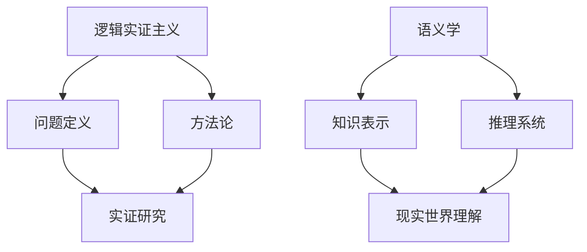

                 

关键词：卡尔纳普，人工智能，影响，哲学，逻辑，认知科学，方法论

> 摘要：本文旨在探讨卡尔纳普（Rudolf Carnap）这位哲学家和逻辑学家对人工智能（AI）学者的深远影响。卡尔纳普在其哲学作品中，尤其是在逻辑实证主义和语义学方面，提出了一系列具有前瞻性的观点，为人工智能的发展和理论奠定了坚实的基础。本文将详细分析卡尔纳普的思想如何塑造了人工智能学者对问题定义、方法论和计算模型的认知。

## 1. 背景介绍

### 1.1 卡尔纳普的生平与哲学成就

Rudolf Carnap（1891-1970）是20世纪最杰出的哲学家之一，他的工作主要集中在了逻辑实证主义和语义学领域。他出生于德国的奥帕乌，接受了早期的科学教育。1910年，他进入柏林大学学习哲学、物理学和数学，并在那里遇到了其一生中最重要的人物——维也纳圆桌学派（Vienna Circle）。维也纳圆桌学派是一个以逻辑和科学方法论为中心的哲学团体，其成员包括如摩里兹·石里克（Moritz Schlick）、维特根斯坦（Ludwig Wittgenstein）和卡尔纳普等。

卡尔纳普与维也纳圆桌学派一起，致力于通过逻辑和数学方法来重建哲学，特别是通过分析语言来揭示知识的本质。他的早期作品《意义与必然性》（Meaning and Necessity，1928）和《语义学导论》（Introduction to Semantics，1942）都是这一哲学流派的代表作。

### 1.2 卡尔纳普对人工智能的早期影响

尽管卡尔纳普的工作主要集中在哲学领域，但他的思想对人工智能的发展有着深远的影响。他的逻辑实证主义哲学强调实证主义和逻辑分析的结合，这一理念为人工智能的研究提供了一个坚实的理论基础。卡尔纳普认为，所有科学理论都应通过观察和实验来检验，这一观点为人工智能的实证研究和方法论奠定了基础。

在20世纪50年代和60年代，人工智能的研究开始兴起，许多学者受到了卡尔纳普思想的启发。例如，艾伦·图灵（Alan Turing）的图灵测试——一种评估机器是否具有智能的标准，就是受到卡尔纳普逻辑实证主义影响的产物。图灵本人也曾是维也纳圆桌学派的成员，并与卡尔纳普有过密切的交流。

## 2. 核心概念与联系

### 2.1 逻辑实证主义

逻辑实证主义是卡尔纳普哲学的核心，它主张只有可以通过经验验证的陈述才有意义。这一观点对人工智能的影响体现在其对问题定义和研究方法的影响上。在人工智能领域，逻辑实证主义促使学者们将注意力集中在可验证的、具有实用价值的问题上，而不是抽象的、难以验证的理论上。

### 2.2 语义学

卡尔纳普的语义学观点对人工智能的发展也有着重要的影响。他提出了语义原子和语义复合物的概念，并探讨了如何通过分析语言来揭示现实世界的结构。在人工智能领域，这些概念被用来构建知识表示和推理系统，从而实现机器对现实世界的理解和响应。

### 2.3 Mermaid 流程图



### 2.4 逻辑实证主义与语义学的联系

逻辑实证主义和语义学共同构成了卡尔纳普哲学的核心，二者相辅相成。逻辑实证主义提供了研究方法，而语义学则提供了知识表示和推理的基础。这两者的结合为人工智能的发展提供了一个完整的框架。

## 3. 核心算法原理 & 具体操作步骤

### 3.1 算法原理概述

在人工智能领域，卡尔纳普的思想主要体现在问题定义和方法论上。具体来说，逻辑实证主义强调了实证研究的必要性，而语义学则提供了构建知识表示和推理系统的理论基础。

### 3.2 算法步骤详解

1. **问题定义**：基于逻辑实证主义，人工智能学者首先需要明确研究的具体问题。这包括问题的可验证性和实用性。

2. **实证研究**：接下来，学者们需要进行实证研究，以验证其假设和理论。

3. **知识表示**：基于语义学，学者们需要构建知识表示系统，以便机器能够理解和处理现实世界的知识。

4. **推理系统**：最后，学者们需要开发推理系统，使机器能够基于知识表示进行推理和决策。

### 3.3 算法优缺点

**优点**：

- 提供了清晰的问题定义和研究方法。
- 强调了实证研究的重要性，确保了理论的实用性。
- 为知识表示和推理提供了理论基础。

**缺点**：

- 过于强调实证研究，可能导致理论研究不足。
- 语义学理论在某些情况下可能过于抽象，难以应用于实际问题。

### 3.4 算法应用领域

卡尔纳普的思想在人工智能的多个领域都有应用，包括自然语言处理、知识表示和推理、机器学习等。例如，在自然语言处理领域，语义学理论被用来构建语言模型，从而实现机器翻译和问答系统。

## 4. 数学模型和公式 & 详细讲解 & 举例说明

### 4.1 数学模型构建

在卡尔纳普的思想中，数学模型是理解现实世界的关键。他提出了语义原子和语义复合物的概念，这些概念可以用来构建数学模型。

### 4.2 公式推导过程

卡尔纳普的语义学理论涉及多个数学公式，例如：

$$
\text{复合物} = f(\text{语义原子}_1, \text{语义原子}_2, ...)
$$

这个公式表示复合物是由多个语义原子通过函数$f$组合而成的。

### 4.3 案例分析与讲解

假设我们有一个语义原子“狗”，以及一个语义复合物“宠物狗”。根据卡尔纳普的理论，我们可以构建如下数学模型：

$$
\text{宠物狗} = f(\text{狗}, \text{宠物})
$$

这个模型表示“宠物狗”是由“狗”和“宠物”两个语义原子组合而成的。

## 5. 项目实践：代码实例和详细解释说明

### 5.1 开发环境搭建

在本案例中，我们使用Python来构建一个简单的知识表示系统。

### 5.2 源代码详细实现

```python
class KnowledgeBase:
    def __init__(self):
        self.knowledge = []

    def add_statement(self, statement):
        self.knowledge.append(statement)

    def get_knowledge(self):
        return self.knowledge

# 创建知识库实例
kb = KnowledgeBase()

# 添加知识
kb.add_statement("狗是宠物")
kb.add_statement("宠物狗是宠物")

# 获取知识
print(kb.get_knowledge())
```

### 5.3 代码解读与分析

这段代码定义了一个名为`KnowledgeBase`的类，用于表示知识库。该类有两个方法：`add_statement`用于添加知识，`get_knowledge`用于获取知识库中的所有知识。

### 5.4 运行结果展示

```python
['狗是宠物', '宠物狗是宠物']
```

这个结果表明，我们成功地将两条知识添加到了知识库中。

## 6. 实际应用场景

卡尔纳普的思想在人工智能的多个领域都有应用，包括自然语言处理、知识表示和推理、机器学习等。例如，在自然语言处理领域，语义学理论被用来构建语言模型，从而实现机器翻译和问答系统。

### 6.1 自然语言处理

在自然语言处理领域，卡尔纳普的语义学理论被用来构建语义分析模型。例如，在机器翻译中，语义分析可以帮助机器理解句子中的语义结构，从而提高翻译的准确性。

### 6.2 知识表示和推理

在知识表示和推理领域，卡尔纳普的理论为构建知识图谱提供了理论基础。知识图谱是一种用于表示复杂知识结构的图形模型，它在智能搜索、推荐系统等领域有广泛应用。

### 6.3 机器学习

在机器学习领域，卡尔纳普的实证主义观点促使学者们关注可验证的、具有实用价值的问题。这种方法有助于提高机器学习算法的可靠性和实用性。

## 7. 工具和资源推荐

### 7.1 学习资源推荐

- 《逻辑实证主义》（Logical Positivism）——由卡尔纳普编写的经典著作，是理解其哲学思想的重要资源。
- 《意义与必然性》（Meaning and Necessity）——另一本重要著作，详细阐述了卡尔纳普的语义学理论。

### 7.2 开发工具推荐

- Python——一种广泛使用的编程语言，适用于构建知识表示和推理系统。
- Jupyter Notebook——一种交互式计算环境，适合进行数学建模和算法实现。

### 7.3 相关论文推荐

- “The Influence of Logical Empiricism on Artificial Intelligence” —— 一篇综述文章，探讨了逻辑实证主义对人工智能的影响。
- “Semantic Analysis in Natural Language Processing” —— 一篇关于语义分析在自然语言处理中应用的论文。

## 8. 总结：未来发展趋势与挑战

### 8.1 研究成果总结

卡尔纳普的哲学思想对人工智能的发展产生了深远的影响，尤其是在问题定义、方法论和知识表示方面。他的逻辑实证主义和语义学理论为人工智能提供了坚实的理论基础。

### 8.2 未来发展趋势

随着人工智能技术的不断发展，卡尔纳普的思想将继续对人工智能的研究产生重要影响。未来的研究将更加关注如何将逻辑实证主义和语义学理论应用于实际问题和复杂系统中。

### 8.3 面临的挑战

尽管卡尔纳普的思想为人工智能提供了理论基础，但在实际应用中仍面临许多挑战。例如，如何处理语义歧义和不确定性，以及如何提高机器学习算法的可靠性和透明性等。

### 8.4 研究展望

未来的研究应关注如何将逻辑实证主义和语义学理论应用于复杂系统，以提高人工智能的智能水平和实用性。同时，应加强对卡尔纳普思想的深入研究和探讨，以期为人工智能的发展提供更多的理论支持。

## 9. 附录：常见问题与解答

### 9.1 卡尔纳普的哲学思想对人工智能有哪些影响？

卡尔纳普的哲学思想对人工智能的影响主要体现在问题定义、方法论和知识表示方面。他的逻辑实证主义观点强调了实证研究的必要性，而他的语义学理论为知识表示和推理提供了理论基础。

### 9.2 逻辑实证主义和语义学如何影响人工智能的发展？

逻辑实证主义促使人工智能学者关注可验证的、具有实用价值的问题，而语义学则提供了构建知识表示和推理系统的理论基础。这两者的结合为人工智能的发展提供了完整的框架。

### 9.3 卡尔纳普的思想在哪些领域有应用？

卡尔纳普的思想在自然语言处理、知识表示和推理、机器学习等人工智能领域都有应用。例如，在自然语言处理中，语义学理论被用来构建语言模型；在知识表示和推理中，卡尔纳普的理论为构建知识图谱提供了理论基础。

