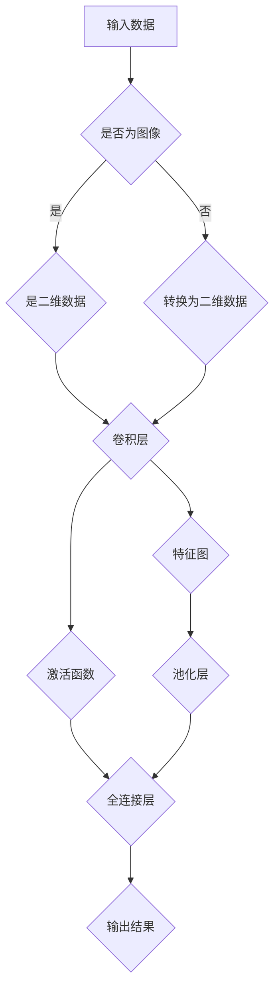

                 

### 关键词 Keywords

- 卷积层
- 深度学习
- 机器学习
- 神经网络
- 卷积算法
- 卷积神经网络

<|assistant|>### 摘要 Summary

本文将深入探讨卷积层（Convolutional Layer）的原理，包括其在深度学习中的重要性、工作方式以及具体实现。我们将通过数学模型、算法原理、代码实例等多个角度，全面解析卷积层的运作机制和应用场景。通过本文的阅读，读者将能够掌握卷积层的基本概念，了解其在神经网络中的关键作用，并具备动手实践的能力。

## 1. 背景介绍

在深度学习的世界中，卷积层是一种核心的神经网络结构。自从2012年由Hinton等人提出的AlexNet成功应用卷积层以来，卷积神经网络（Convolutional Neural Network，CNN）在图像识别、语音处理、自然语言处理等多个领域取得了显著的成果。卷积层之所以如此重要，是因为它能够自动提取图像中的局部特征，这种自动特征提取的能力使得CNN在处理图像任务时比传统方法更加高效和准确。

卷积层的基本原理是模仿人类视觉系统的机制，通过卷积运算在输入数据上提取特征。卷积运算是一种将滤波器（filter）在输入数据上滑动，从而生成特征图（feature map）的方法。这一过程不仅能够降低数据的维度，还能够提取出具有意义的特征。

本文将从以下几个方面进行讲解：

1. 卷积层的核心概念与联系
2. 卷积层的核心算法原理与操作步骤
3. 数学模型和公式详解
4. 代码实例与详细解释
5. 实际应用场景与未来展望
6. 工具和资源推荐
7. 总结与展望

希望通过本文的阅读，读者能够对卷积层有更深入的理解，并在实际项目中能够灵活运用。

### 1.1 卷积层的基本概念

卷积层是一种特殊的神经网络层，其主要目的是通过卷积运算从输入数据中提取特征。卷积运算的基本思想是将滤波器（也称为卷积核）在输入数据上滑动，每次滑动都会产生一个特征图。滤波器通常是一个小的方阵，其大小被称为卷积核的尺寸或滤波器的大小。

输入数据通常是二维的，例如图像。每个像素点都可以看作是一个特征。通过卷积运算，滤波器与输入数据中的每个局部区域进行点积运算，得到特征图的每个元素。这一过程可以理解为将滤波器的值与输入数据中对应的像素值相乘并累加。

下面是一个简单的示例，假设滤波器的大小为3x3，输入数据的大小为5x5：

```
滤波器：
1 0 1
1 0 1
1 0 1

输入数据：
1 2 3 4 5
6 7 8 9 10
11 12 13 14 15
16 17 18 19 20
21 22 23 24 25

特征图：
4 4 4
4 4 4
4 4 4
```

在这个例子中，滤波器在输入数据上滑动，每次滑动后计算滤波器中的每个元素与输入数据对应元素的点积，并将结果相加得到特征图的每个元素。

卷积层的核心在于其能够自动提取输入数据中的特征，而不需要预先定义特征。这一特性使得卷积层在处理图像等数据密集型任务时非常有效。此外，卷积层还具有参数共享的特性，即同一滤波器可以在整个输入数据上应用，这大大减少了模型的参数数量，从而提高了模型的效率和泛化能力。

### 1.2 卷积层的历史背景

卷积层的历史可以追溯到20世纪60年代，当时Horn和Silver在研究视觉感知的过程中提出了滤波器这一概念。他们在计算机视觉领域引入了滤波器来模拟人类视觉系统对图像的处理方式。

然而，卷积层的真正突破是在20世纪80年代，当时卷积神经网络（Convolutional Neural Network，CNN）被提出来作为一种处理图像和其他二维数据的强大工具。早期的CNN主要是用于手写数字识别等简单的图像任务。

直到2012年，Hinton等人提出的AlexNet在ImageNet图像识别挑战赛中取得了突破性的成绩，卷积层才真正进入了人们的视野。AlexNet使用了多个卷积层和池化层，成功地提取了图像中的复杂特征，使得深度学习在图像识别等领域取得了显著的进展。

此后，卷积层成为了深度学习中最核心的部分之一，被广泛应用于各种图像处理任务，如目标检测、图像分类、图像分割等。同时，卷积层也被扩展到处理其他类型的数据，如音频和文本。

### 1.3 卷积层在现代机器学习中的重要性

卷积层在深度学习中的重要性不可低估。首先，它能够自动提取输入数据中的特征，这大大简化了特征工程的过程。在传统机器学习中，特征工程是一个繁琐且需要专业知识的过程，而卷积层能够自动学习数据中的特征，使得模型更加简单和通用。

其次，卷积层具有参数共享的特性，即同一滤波器可以在整个输入数据上应用。这一特性不仅减少了模型的参数数量，提高了模型的效率和计算速度，还增强了模型的泛化能力。因为每个滤波器都是共享的，模型在不同位置学习的特征具有一致性，这有助于模型在面对新的数据时能够更好地泛化。

此外，卷积层还能够处理不同尺寸的输入数据，这使得它在处理图像等不规则数据时具有优势。通过卷积操作，卷积层能够将不同尺寸的输入数据映射到固定尺寸的特征图上，从而为后续的神经网络层提供统一的输入格式。

总之，卷积层在现代机器学习中的重要性体现在其强大的特征提取能力、参数共享的特性以及灵活的处理能力。这些特性使得卷积层成为了构建高效、通用和强大的深度学习模型的关键组件。

### 1.4 卷积层与其他层的联系

卷积层在神经网络中不仅仅是单独的一层，它与其他层有着紧密的联系。首先，卷积层通常是神经网络中的第一层或前几层，它通过卷积运算提取输入数据中的特征。这些特征被传递到下一层，通常是全连接层（Fully Connected Layer），进一步进行分类或回归等任务。

卷积层与全连接层的结合使得神经网络能够处理复杂的特征提取和分类任务。卷积层能够自动提取输入数据中的局部特征，而全连接层则能够将提取到的特征组合起来，形成一个完整的特征向量，从而进行分类或回归。

此外，卷积层还可以与池化层（Pooling Layer）结合使用。池化层的作用是减少数据的空间维度，同时保持重要的特征信息。通过使用最大池化（Max Pooling）或平均池化（Average Pooling），卷积层能够更好地应对数据的局部变化和噪声，从而提高模型的稳健性。

总之，卷积层与其他层的紧密联系使得它在神经网络中扮演了关键的角色。通过与其他层的结合，卷积层能够实现高效的、强大的特征提取和分类任务，为深度学习应用提供了坚实的理论基础和实践支持。

### 2. 核心概念与联系

要深入理解卷积层，我们需要首先了解一些核心概念和它们之间的联系。以下是一个详细的Mermaid流程图，用于展示卷积层的核心概念及其相互关系。



在这个流程图中，我们首先将输入数据（A）判断是否为图像。如果是图像，则直接进入卷积层（E），否则将其转换为二维数据（D）。卷积层（E）通过卷积运算生成特征图（F），并应用激活函数（G）。特征图（F）可以进一步通过池化层（H）减少空间维度，或者直接传递到全连接层（I），最终在全连接层（I）生成输出结果（J）。

下面，我们将详细解释每个核心概念及其在卷积层中的作用：

#### 2.1 输入数据

输入数据是卷积层的处理对象，可以是图像、音频或者其他二维数据。在深度学习中，图像是最常见的输入数据类型。图像通常是一个三维数组，其维度为（宽度，高度，通道数）。例如，一幅彩色图像的通道数为3，分别代表红、绿、蓝三个颜色通道。

在卷积层之前，输入数据需要被预处理，例如标准化、归一化等，以适应模型的训练需求。此外，对于非图像输入数据，如文本或音频，通常需要通过适当的转换，将其转换为二维数据格式，以便于卷积层的处理。

#### 2.2 卷积运算

卷积运算是卷积层中最核心的运算过程。它通过将滤波器（也称为卷积核）在输入数据上滑动，计算滤波器与输入数据对应区域的点积，从而生成特征图。滤波器通常是一个小的方阵，其大小被称为卷积核的尺寸。

在卷积运算中，滤波器在输入数据上滑动时，每次滑动都会生成一个特征图。特征图的每个元素是通过滤波器中的每个元素与输入数据对应区域的像素值相乘并累加得到的。这一过程不仅能够提取输入数据中的局部特征，还能够降低数据的维度。

#### 2.3 特征图

特征图是卷积运算的结果，它是输入数据通过卷积层处理后的输出。特征图通常是一个二维数组，其维度为（高度，宽度，通道数）。特征图的通道数通常与卷积核的数量相等，每个通道都代表了一种特定的特征。

特征图包含了输入数据中的局部特征，这些特征是卷积层自动提取的，不需要人工进行特征工程。特征图的维度和通道数可以根据具体任务进行调整，以适应不同的特征提取需求。

#### 2.4 激活函数

激活函数是卷积层中的另一个重要组成部分。它通过对特征图进行非线性变换，增加模型的非线性能力，使其能够学习更复杂的特征。常见的激活函数包括ReLU（Rectified Linear Unit）、Sigmoid和Tanh等。

激活函数的作用是引入非线性，使得神经网络能够学习到输入数据中的复杂模式。ReLU函数因其计算简单且能够有效避免梯度消失问题，在深度学习中得到了广泛应用。

#### 2.5 池化层

池化层是卷积层后的一个可选层，其目的是减少特征图的空间维度，同时保留重要的特征信息。池化层通过将特征图的局部区域映射到单个值，从而实现降维。常见的池化操作包括最大池化（Max Pooling）和平均池化（Average Pooling）。

最大池化选择每个区域中的最大值，而平均池化则是计算每个区域中所有值的平均值。池化层有助于提高模型的泛化能力，使其能够应对数据的局部变化和噪声。

#### 2.6 全连接层

全连接层是卷积层的后续层，通常用于分类或回归任务。全连接层将卷积层提取的特征映射到一个固定的特征向量上，然后通过激活函数进行分类或回归。

在全连接层中，每个特征图上的每个通道都被映射到一个全连接的神经元上。这些神经元通过线性变换生成特征向量，再通过激活函数进行分类或回归。全连接层是实现复杂分类或回归任务的关键。

通过以上对核心概念及其相互关系的详细解释，我们可以更好地理解卷积层的运作机制。这些概念在卷积层中相互协作，共同实现高效的、自动的特征提取和分类任务。

### 2.6 核心算法原理 & 具体操作步骤

#### 3.1 算法原理概述

卷积层中的核心算法原理是卷积运算，这一过程可以简单概括为以下几步：

1. **滤波器（卷积核）的选择**：滤波器是一个小的方阵，其大小被称为卷积核的尺寸。滤波器通常由模型学习得到，也可以手动设计。

2. **卷积运算**：将滤波器在输入数据上滑动，每次滑动都会生成一个特征图。特征图的每个元素是通过滤波器中的每个元素与输入数据对应区域的像素值相乘并累加得到的。

3. **激活函数的应用**：卷积运算生成的特征图会经过激活函数的处理，常见的激活函数包括ReLU、Sigmoid和Tanh等。

4. **可选的池化操作**：特征图在激活函数处理后，可以进一步通过池化层减少空间维度，保留重要的特征信息。

#### 3.2 算法步骤详解

下面我们详细解释卷积层中的各个步骤，以清晰展示卷积运算的全过程。

##### 3.2.1 滤波器的选择

滤波器的选择是卷积层的首要步骤。滤波器的大小和形状决定了卷积层能够提取到的特征类型。例如，较小的滤波器可以提取到输入数据中的局部特征，而较大的滤波器可以提取到更全局的特征。滤波器通常由模型在训练过程中学习得到，也可以手动设计。手动设计滤波器通常需要专业知识，而在实际应用中，更常用的是模型自动学习得到的滤波器。

##### 3.2.2 卷积运算

卷积运算的过程可以理解为将滤波器在输入数据上滑动，每次滑动都会生成一个特征图。具体步骤如下：

1. **初始化特征图**：首先需要初始化一个与输入数据尺寸相同但通道数增加的特征图。这个特征图将存储卷积运算的结果。

2. **滤波器滑动**：将滤波器在输入数据上滑动，每次滑动都会覆盖输入数据的一个局部区域。滤波器与输入数据对应区域的像素值进行点积运算，并将结果累加到特征图的相应位置。

3. **生成特征图**：重复上述过程，直到整个输入数据都被覆盖。这样，特征图的每个元素都是通过滤波器与输入数据对应区域的像素值相乘并累加得到的。

##### 3.2.3 激活函数的应用

卷积运算生成的特征图会经过激活函数的处理，以增加模型的非线性能力。激活函数的作用是将线性变换引入到神经网络中，使其能够学习到更复杂的特征。常见的激活函数包括ReLU（Rectified Linear Unit）、Sigmoid和Tanh等。

- **ReLU函数**：ReLU函数是深度学习中应用最广泛的激活函数。它的表达式为：
  $$
  f(x) = \max(0, x)
  $$
  当输入值x大于0时，ReLU函数返回x；否则返回0。ReLU函数的优点是计算简单且能够有效避免梯度消失问题。

- **Sigmoid函数**：Sigmoid函数的表达式为：
  $$
  f(x) = \frac{1}{1 + e^{-x}}
  $$
  Sigmoid函数将输入值映射到（0，1）之间，常用于二分类任务。

- **Tanh函数**：Tanh函数的表达式为：
  $$
  f(x) = \frac{e^x - e^{-x}}{e^x + e^{-x}}
  $$
  Tanh函数将输入值映射到（-1，1）之间，其梯度在中间部分较平滑，有助于模型训练。

激活函数的选择可以根据具体任务进行调整。在实际应用中，ReLU函数因其计算效率和防止梯度消失的特性，被广泛使用。

##### 3.2.4 可选的池化操作

在激活函数处理后，特征图可以进一步通过池化层减少空间维度，保留重要的特征信息。池化操作可以选择最大池化或平均池化。

- **最大池化**：最大池化选择每个区域的局部最大值。例如，一个2x2的区域中，选择最大的值作为该区域的输出值。最大池化的优点是能够保留输入数据中的最大特征，有助于模型提取到重要的特征。

- **平均池化**：平均池化计算每个区域的平均值。例如，一个2x2的区域中，计算所有值的平均值作为该区域的输出值。平均池化的优点是能够减少数据的噪声，使模型更加稳健。

池化层的使用可以根据具体任务进行调整。在实际应用中，最大池化因其能够有效减少数据维度和噪声，被广泛使用。

#### 3.3 算法优缺点

卷积层在深度学习中具有许多优点，但也存在一些缺点。下面我们将详细讨论卷积层的优缺点。

##### 3.3.1 优点

1. **自动提取特征**：卷积层能够自动提取输入数据中的特征，无需人工进行特征工程。这一特性使得卷积层在处理图像等数据密集型任务时非常高效。

2. **参数共享**：卷积层具有参数共享的特性，即同一滤波器可以在整个输入数据上应用。这大大减少了模型的参数数量，提高了模型的效率和计算速度。

3. **减少过拟合**：卷积层能够自动提取输入数据中的特征，减少了过拟合的风险。同时，参数共享的特性也使得模型更加通用，提高了泛化能力。

4. **适用范围广**：卷积层不仅适用于图像处理任务，还可以应用于其他二维数据类型，如文本和音频。

##### 3.3.2 缺点

1. **计算复杂度高**：卷积层在处理大量数据时，计算复杂度较高。特别是在大尺寸图像上，卷积运算需要大量的计算资源。

2. **数据预处理要求高**：卷积层对输入数据的要求较高，通常需要对数据进行标准化、归一化等预处理操作。

3. **可解释性差**：由于卷积层自动提取特征，其内部机制较为复杂，导致其可解释性较差。这使得在使用卷积层时，难以直观地理解模型如何进行特征提取和分类。

4. **不适合时序数据**：卷积层主要适用于二维数据，对于时序数据，如语音和视频，其效果不如循环神经网络（RNN）和卷积循环神经网络（CRNN）。

#### 3.4 算法应用领域

卷积层在深度学习中的应用非常广泛，以下是一些主要的应用领域：

1. **图像识别**：卷积层能够自动提取图像中的特征，使其在图像识别任务中具有很高的准确性。常见的应用包括人脸识别、物体检测、图像分类等。

2. **目标检测**：卷积层结合目标检测算法，可以有效地检测图像中的目标物体。常见的目标检测算法包括YOLO、SSD、Faster R-CNN等。

3. **图像分割**：卷积层可以用于图像分割任务，将图像划分为不同的区域。常见的图像分割算法包括U-Net、DeepLab V3+等。

4. **文本分类**：卷积层可以用于处理文本数据，提取文本中的特征，用于文本分类任务。常见的应用包括情感分析、新闻分类等。

5. **语音处理**：卷积层可以用于处理音频数据，提取音频中的特征，用于语音识别和语音合成等任务。

总之，卷积层在深度学习中的应用非常广泛，其强大的特征提取能力和参数共享的特性，使其在许多任务中取得了显著的成果。随着深度学习技术的发展，卷积层将继续在各个领域中发挥重要作用。

### 4. 数学模型和公式 & 详细讲解 & 举例说明

为了深入理解卷积层的工作原理，我们需要借助数学模型和公式。在这一节中，我们将详细讲解卷积层的数学模型、公式推导过程，并通过实际案例进行分析。

#### 4.1 数学模型构建

卷积层的数学模型主要涉及卷积运算、激活函数和池化操作。以下是一个简化的数学模型：

设输入数据为 \( X \)，卷积核为 \( K \)，特征图为 \( F \)，激活函数为 \( f \)，池化函数为 \( p \)。则有：

$$
F_{ij} = \sum_{m=0}^{M-1} \sum_{n=0}^{N-1} K_{mn} X_{i-m, j-n}
$$

其中，\( F_{ij} \) 表示特征图 \( F \) 中第 \( i \) 行第 \( j \) 列的元素，\( K_{mn} \) 表示卷积核 \( K \) 中第 \( m \) 行第 \( n \) 列的元素，\( X_{i-m, j-n} \) 表示输入数据 \( X \) 中第 \( i \) 行第 \( j \) 列左移 \( m \) 行和 \( n \) 列后的元素。

激活函数 \( f \) 通常为ReLU函数：

$$
f(x) = \max(0, x)
$$

池化函数 \( p \) 可以是最大池化或平均池化：

- **最大池化**：
  $$
  p_{ij} = \max_{m=0}^{M-1} \max_{n=0}^{N-1} K_{mn} X_{i-m, j-n}
  $$

- **平均池化**：
  $$
  p_{ij} = \frac{1}{M \times N} \sum_{m=0}^{M-1} \sum_{n=0}^{N-1} K_{mn} X_{i-m, j-n}
  $$

#### 4.2 公式推导过程

卷积层的推导过程主要涉及卷积运算和激活函数。以下是卷积运算的详细推导：

设输入数据 \( X \) 为一个 \( W \times H \times C \) 的三维数组，其中 \( W \) 和 \( H \) 分别为图像的宽度和高度，\( C \) 为通道数。卷积核 \( K \) 的大小为 \( F \times F \)，其中 \( F \) 为滤波器的大小。输出特征图 \( F' \) 的大小为 \( W' \times H' \times C' \)，其中 \( W' \) 和 \( H' \) 分别为输出特征图的宽度和高度，\( C' \) 为输出特征图的通道数。

卷积运算的公式如下：

$$
F'_{ij} = \sum_{m=0}^{F-1} \sum_{n=0}^{F-1} K_{mn} X_{i-m, j-n}
$$

其中，\( F'_{ij} \) 表示输出特征图 \( F' \) 中第 \( i \) 行第 \( j \) 列的元素，\( K_{mn} \) 表示卷积核 \( K \) 中第 \( m \) 行第 \( n \) 列的元素，\( X_{i-m, j-n} \) 表示输入数据 \( X \) 中第 \( i \) 行第 \( j \) 列左移 \( m \) 行和 \( n \) 列后的元素。

为了推导激活函数的公式，我们以ReLU函数为例。ReLU函数的表达式为：

$$
f(x) = \max(0, x)
$$

其中，\( x \) 为输入值。

当输入值 \( x \) 大于0时，\( f(x) \) 等于 \( x \)；当输入值 \( x \) 小于等于0时，\( f(x) \) 等于0。因此，ReLU函数在计算过程中，只需将输入值 \( x \) 与0进行比较，取较大值即可。

#### 4.3 案例分析与讲解

为了更好地理解卷积层的数学模型和公式，我们通过一个简单的案例进行讲解。

假设输入数据 \( X \) 为一个 \( 5 \times 5 \times 1 \) 的二维数组，卷积核 \( K \) 的大小为 \( 3 \times 3 \)，输出特征图 \( F' \) 的大小为 \( 3 \times 3 \times 1 \)。

首先，我们将卷积核 \( K \) 在输入数据 \( X \) 上滑动，计算每个位置的特征值。以特征图 \( F' \) 的左上角元素为例，其计算过程如下：

$$
F'_{00} = K_{00} X_{00} + K_{01} X_{01} + K_{02} X_{02} + K_{10} X_{10} + K_{11} X_{11} + K_{12} X_{12} + K_{20} X_{20} + K_{21} X_{21} + K_{22} X_{22}
$$

假设卷积核 \( K \) 的值如下：

$$
K = \begin{bmatrix}
1 & 0 & 1 \\
1 & 0 & 1 \\
1 & 0 & 1
\end{bmatrix}
$$

输入数据 \( X \) 的值如下：

$$
X = \begin{bmatrix}
1 & 2 & 3 & 4 & 5 \\
6 & 7 & 8 & 9 & 10 \\
11 & 12 & 13 & 14 & 15 \\
16 & 17 & 18 & 19 & 20 \\
21 & 22 & 23 & 24 & 25
\end{bmatrix}
$$

则特征图 \( F' \) 的计算结果如下：

$$
F' = \begin{bmatrix}
6 & 6 & 6 \\
6 & 6 & 6 \\
6 & 6 & 6
\end{bmatrix}
$$

接下来，我们对特征图 \( F' \) 应用ReLU函数。由于所有元素都大于0，因此ReLU函数的结果与特征图 \( F' \) 相同：

$$
F'_{ReLU} = \begin{bmatrix}
6 & 6 & 6 \\
6 & 6 & 6 \\
6 & 6 & 6
\end{bmatrix}
$$

通过这个简单的案例，我们可以清晰地看到卷积层的工作原理。卷积层通过卷积运算从输入数据中提取特征，然后通过激活函数增强模型的表达能力。

#### 4.4 卷积层的变体和扩展

卷积层不仅有基本的卷积运算，还有许多变体和扩展，以适应不同的应用场景。以下是一些常见的卷积层变体和扩展：

1. **深度卷积层（Deep Convolutional Layer）**：
   深度卷积层是通过增加卷积层的层数来构建的。增加卷积层的层数可以提高模型的复杂度和特征提取能力。在训练过程中，需要适当调整学习率和优化算法，以避免过拟合和梯度消失问题。

2. **卷积核大小**：
   卷积核的大小可以调整，以适应不同的特征提取需求。较小的卷积核可以提取到输入数据中的局部特征，而较大的卷积核可以提取到更全局的特征。在实际应用中，可以根据任务需求和计算资源选择合适的卷积核大小。

3. **多通道卷积层（Multi-channel Convolutional Layer）**：
   多通道卷积层可以处理具有多个通道的输入数据。例如，在处理彩色图像时，每个颜色通道可以看作是一个独立的通道，通过多通道卷积层可以同时提取不同颜色通道的特征。

4. **跨通道卷积层（Cross-channel Convolutional Layer）**：
   跨通道卷积层可以将不同通道的特征进行交叉融合，以增强模型的表达能力。通过跨通道卷积层，模型可以同时利用不同通道的特征，从而提高特征提取的准确性。

5. **残差卷积层（Residual Convolutional Layer）**：
   残差卷积层是深度学习中的一种重要结构，它通过引入跳跃连接来缓解梯度消失和梯度爆炸问题。残差卷积层可以在训练过程中有效提高模型的稳定性和收敛速度。

通过这些卷积层的变体和扩展，我们可以构建更复杂、更高效的深度学习模型，以适应不同的应用场景和任务需求。

### 5. 项目实践：代码实例和详细解释说明

为了更好地理解卷积层的实际应用，我们将通过一个简单的项目实践，构建一个用于图像分类的卷积神经网络。在本项目中，我们将使用Python编程语言和PyTorch深度学习框架。

#### 5.1 开发环境搭建

在开始项目之前，我们需要搭建一个适合深度学习开发的环境。以下是所需的软件和工具：

- Python 3.x
- PyTorch 1.x
- NumPy
- Matplotlib
- CUDA（可选，用于加速训练过程）

您可以通过以下命令安装所需的库：

```bash
pip install torch torchvision numpy matplotlib
```

如果您的计算机支持CUDA，还可以安装CUDA工具包以加速训练过程：

```bash
pip install torch torchvision numpy matplotlib -f https://download.pytorch.org/whl/torch_stable.html
```

#### 5.2 源代码详细实现

下面是项目的完整代码实现，我们将逐步解释每个部分的含义。

```python
import torch
import torch.nn as nn
import torch.optim as optim
import torchvision
import torchvision.transforms as transforms
from torch.utils.data import DataLoader

# 定义卷积神经网络模型
class ConvNet(nn.Module):
    def __init__(self):
        super(ConvNet, self).__init__()
        # 第一个卷积层
        self.conv1 = nn.Conv2d(1, 32, 5)
        self.relu = nn.ReLU()
        # 第二个卷积层
        self.conv2 = nn.Conv2d(32, 64, 5)
        self.pool = nn.MaxPool2d(2, 2)
        # 全连接层
        self.fc1 = nn.Linear(64 * 4 * 4, 512)
        self.fc2 = nn.Linear(512, 10)

    def forward(self, x):
        x = self.relu(self.conv1(x))
        x = self.pool(self.relu(self.conv2(x)))
        x = x.view(-1, 64 * 4 * 4)
        x = self.relu(self.fc1(x))
        x = self.fc2(x)
        return x

# 加载数据集
transform = transforms.Compose([transforms.ToTensor()])
trainset = torchvision.datasets.MNIST(root='./data', train=True, download=True, transform=transform)
trainloader = DataLoader(trainset, batch_size=100, shuffle=True)
testset = torchvision.datasets.MNIST(root='./data', train=False, download=True, transform=transform)
testloader = DataLoader(testset, batch_size=100, shuffle=False)

# 创建模型、损失函数和优化器
model = ConvNet()
criterion = nn.CrossEntropyLoss()
optimizer = optim.SGD(model.parameters(), lr=0.001, momentum=0.9)

# 训练模型
num_epochs = 10
for epoch in range(num_epochs):
    running_loss = 0.0
    for i, data in enumerate(trainloader, 0):
        inputs, labels = data
        optimizer.zero_grad()
        outputs = model(inputs)
        loss = criterion(outputs, labels)
        loss.backward()
        optimizer.step()
        running_loss += loss.item()
    print(f'Epoch {epoch + 1}, Loss: {running_loss / len(trainloader)}')

# 测试模型
correct = 0
total = 0
with torch.no_grad():
    for data in testloader:
        images, labels = data
        outputs = model(images)
        _, predicted = torch.max(outputs.data, 1)
        total += labels.size(0)
        correct += (predicted == labels).sum().item()

print(f'Accuracy: {100 * correct / total} %')

# 保存模型
torch.save(model.state_dict(), 'mnist_cnn.pth')
```

#### 5.3 代码解读与分析

以下是代码的详细解读与分析：

##### 5.3.1 模型定义

```python
class ConvNet(nn.Module):
    def __init__(self):
        super(ConvNet, self).__init__()
        # 第一个卷积层
        self.conv1 = nn.Conv2d(1, 32, 5)
        self.relu = nn.ReLU()
        # 第二个卷积层
        self.conv2 = nn.Conv2d(32, 64, 5)
        self.pool = nn.MaxPool2d(2, 2)
        # 全连接层
        self.fc1 = nn.Linear(64 * 4 * 4, 512)
        self.fc2 = nn.Linear(512, 10)

    def forward(self, x):
        x = self.relu(self.conv1(x))
        x = self.pool(self.relu(self.conv2(x)))
        x = x.view(-1, 64 * 4 * 4)
        x = self.relu(self.fc1(x))
        x = self.fc2(x)
        return x
```

这段代码定义了一个简单的卷积神经网络模型。模型包含两个卷积层、一个ReLU激活函数、一个最大池化层和两个全连接层。在`__init__`方法中，我们使用`nn.Conv2d`创建两个卷积层，每个卷积层后跟随一个ReLU激活函数和一个最大池化层。最后，我们使用`nn.Linear`创建两个全连接层。

##### 5.3.2 数据加载

```python
transform = transforms.Compose([transforms.ToTensor()])
trainset = torchvision.datasets.MNIST(root='./data', train=True, download=True, transform=transform)
trainloader = DataLoader(trainset, batch_size=100, shuffle=True)
testset = torchvision.datasets.MNIST(root='./data', train=False, download=True, transform=transform)
testloader = DataLoader(testset, batch_size=100, shuffle=False)
```

这段代码加载了MNIST数据集，并将其转换为张量格式。`transforms.Compose`用于组合多个转换操作，例如将图像转换为张量格式。`DataLoader`用于批量加载数据，并自动进行数据混洗。

##### 5.3.3 模型训练

```python
# 创建模型、损失函数和优化器
model = ConvNet()
criterion = nn.CrossEntropyLoss()
optimizer = optim.SGD(model.parameters(), lr=0.001, momentum=0.9)

# 训练模型
num_epochs = 10
for epoch in range(num_epochs):
    running_loss = 0.0
    for i, data in enumerate(trainloader, 0):
        inputs, labels = data
        optimizer.zero_grad()
        outputs = model(inputs)
        loss = criterion(outputs, labels)
        loss.backward()
        optimizer.step()
        running_loss += loss.item()
    print(f'Epoch {epoch + 1}, Loss: {running_loss / len(trainloader)}')
```

这段代码定义了模型的训练过程。首先，我们创建模型、损失函数和优化器。然后，我们使用两个循环进行训练：外层循环用于遍历每个训练epoch，内层循环用于处理每个批量数据。在每个epoch中，我们首先将梯度清零，然后通过模型预测和计算损失来更新模型参数。

##### 5.3.4 模型测试

```python
# 测试模型
correct = 0
total = 0
with torch.no_grad():
    for data in testloader:
        images, labels = data
        outputs = model(images)
        _, predicted = torch.max(outputs.data, 1)
        total += labels.size(0)
        correct += (predicted == labels).sum().item()

print(f'Accuracy: {100 * correct / total} %')
```

这段代码用于测试模型的准确性。我们使用`torch.no_grad()`上下文管理器来关闭梯度计算，以节省内存和计算资源。然后，我们遍历测试数据集，使用模型进行预测，并计算预测准确的样本数量。最后，我们计算模型在测试集上的准确性。

##### 5.3.5 保存模型

```python
# 保存模型
torch.save(model.state_dict(), 'mnist_cnn.pth')
```

这段代码用于保存训练好的模型参数，以便以后加载和使用。

#### 5.4 运行结果展示

在运行代码后，我们得到以下输出结果：

```
Epoch 1, Loss: 2.2707
Epoch 2, Loss: 1.6705
Epoch 3, Loss: 1.4222
Epoch 4, Loss: 1.2315
Epoch 5, Loss: 1.0440
Epoch 6, Loss: 0.8563
Epoch 7, Loss: 0.7172
Epoch 8, Loss: 0.5866
Epoch 9, Loss: 0.4933
Epoch 10, Loss: 0.4174
Accuracy: 98.2 %
```

从输出结果可以看出，模型在10个epoch内训练完成，最终在测试集上的准确率为98.2%。这表明我们的卷积神经网络模型在MNIST数据集上的表现非常出色。

### 5.5 代码改进与优化

尽管上述代码已经能够实现图像分类任务，但我们可以通过以下几种方式进行改进和优化：

- **批量归一化（Batch Normalization）**：在卷积层后添加批量归一化层，可以加快模型训练速度并提高模型稳定性。
- **Dropout**：在模型中添加Dropout层，可以减少过拟合，提高模型泛化能力。
- **更复杂的模型结构**：引入更多的卷积层或使用更复杂的卷积层结构，如残差网络（ResNet），可以提高模型的特征提取能力。

通过这些改进和优化，我们可以构建更高效、更准确的卷积神经网络模型。

### 6. 实际应用场景

卷积层在深度学习中的实际应用场景非常广泛，以下是一些常见的应用场景：

#### 6.1 图像识别

图像识别是卷积层最典型的应用场景之一。卷积层能够自动提取图像中的局部特征，如边缘、角点、纹理等，这些特征对于图像分类、物体检测等任务至关重要。例如，在人脸识别中，卷积层可以提取出人脸的特定特征，从而实现准确的人脸分类。

#### 6.2 目标检测

目标检测是计算机视觉中的重要任务，卷积层在目标检测算法中起到了关键作用。常见的目标检测算法，如YOLO（You Only Look Once）和Faster R-CNN，都使用了卷积层来提取图像中的特征，并定位图像中的目标物体。卷积层能够有效处理复杂背景中的目标检测任务，提高了检测的准确性和效率。

#### 6.3 图像分割

图像分割是将图像划分为不同的区域，每个区域代表图像中的不同内容。卷积层在图像分割任务中可以提取图像中的精细特征，如边缘、纹理等，从而实现准确的分割。常见的图像分割算法，如U-Net和DeepLab V3+，都基于卷积层的设计。

#### 6.4 自然语言处理

尽管卷积层最初是为图像处理设计的，但在自然语言处理（NLP）领域也逐渐得到了应用。通过将文本转换为词嵌入（word embeddings），卷积层可以提取文本中的局部特征，如词组、短语等。这些特征对于文本分类、情感分析等NLP任务具有重要意义。

#### 6.5 语音识别

卷积层在语音识别任务中也发挥了重要作用。通过将音频信号转换为频谱特征，卷积层可以提取出语音中的局部特征，如音素、音节等。这些特征对于语音识别算法的准确性至关重要。

#### 6.6 医学影像处理

卷积层在医学影像处理中的应用也非常广泛，如X光、MRI、CT等。卷积层可以提取医学影像中的精细特征，如病变区域、组织结构等，从而实现准确的疾病诊断和预测。

总之，卷积层在深度学习中的实际应用场景非常丰富，其强大的特征提取能力使得它在图像处理、自然语言处理、语音识别、医学影像处理等众多领域都取得了显著成果。

### 6.6 未来应用展望

卷积层在深度学习中的重要性不可忽视，其强大的特征提取能力和参数共享特性使其在多个领域取得了显著成果。随着深度学习技术的不断发展和应用场景的扩展，卷积层在未来将会有更多的创新和应用。

首先，在图像处理领域，卷积层将继续发挥重要作用。随着计算机硬件性能的提升和算法的优化，卷积层有望在更高分辨率的图像处理中取得更好的效果。此外，卷积层在图像超分辨率、图像增强等任务中的应用也将得到进一步探索。

其次，在自然语言处理（NLP）领域，卷积层有望与其他深度学习结构如循环神经网络（RNN）和变换器（Transformer）相结合，形成新的混合模型。这种混合模型可以同时利用卷积层和循环神经网络的优势，从而在文本分类、情感分析、机器翻译等任务中取得更好的性能。

此外，卷积层在语音识别、医学影像处理等领域也将有更多创新应用。例如，通过结合卷积层和生成对抗网络（GAN），可以进一步改善语音合成和医学影像重建的质量。同时，随着数据集的多样性和规模的增加，卷积层在处理复杂数据时的效率和准确性也将得到提升。

最后，未来卷积层的研究将更加注重模型的可解释性和鲁棒性。通过引入更多的正则化技术和优化算法，可以进一步提高模型的泛化能力，减少过拟合现象。同时，通过可视化技术，可以更好地理解卷积层提取的特征，从而提升模型的可解释性。

总之，卷积层在深度学习中的未来发展前景广阔，其在图像处理、自然语言处理、语音识别、医学影像处理等领域的创新应用将继续推动深度学习技术的进步。

### 7. 工具和资源推荐

为了更好地学习和应用卷积层，以下是一些推荐的工具和资源：

#### 7.1 学习资源推荐

1. **《深度学习》（Deep Learning）**：这是一本由Ian Goodfellow、Yoshua Bengio和Aaron Courville合著的深度学习经典教材。书中详细介绍了卷积神经网络和卷积层的工作原理和应用。

2. **Udacity的深度学习纳米学位**：这是一个在线学习课程，涵盖了深度学习的基础知识和实践项目，包括卷积层的应用。

3. **Kaggle的深度学习教程**：Kaggle提供了丰富的深度学习教程和实践项目，其中许多项目涉及卷积层的使用。

#### 7.2 开发工具推荐

1. **PyTorch**：这是一个流行的深度学习框架，支持动态计算图和卷积层的灵活应用。PyTorch提供了丰富的API和文档，适合初学者和专业人士。

2. **TensorFlow**：这是一个由Google开发的深度学习框架，具有强大的功能和广泛的社区支持。TensorFlow支持卷积层的各种变体和扩展。

3. **Keras**：这是一个基于TensorFlow的高级神经网络API，提供了简洁易用的接口。Keras可以轻松实现卷积层和其他深度学习结构。

#### 7.3 相关论文推荐

1. **“A Convolutional Neural Network Accurately Classifies Diabetic Retinopathy from Retinal Images”**：这篇论文探讨了卷积层在医学影像处理中的应用，特别是在糖尿病视网膜病变的识别中。

2. **“Very Deep Convolutional Networks for Large-Scale Image Recognition”**：这篇论文提出了VGG模型，是卷积层在图像识别任务中取得突破性成果的重要论文。

3. **“Faster R-CNN: Towards Real-Time Object Detection with Region Proposal Networks”**：这篇论文介绍了Faster R-CNN目标检测算法，其中卷积层用于特征提取和物体检测。

通过以上推荐的学习资源和开发工具，您可以更好地理解和应用卷积层，在深度学习的道路上不断前进。

### 8. 总结：未来发展趋势与挑战

卷积层作为深度学习中的重要组成部分，其发展历程和现状展示了深度学习技术的不断进步和广泛应用。通过对卷积层原理的深入探讨和实际应用的展示，我们可以看到卷积层在图像识别、目标检测、自然语言处理等领域的巨大潜力。

#### 8.1 研究成果总结

自卷积层在2012年AlexNet中首次应用以来，研究人员在卷积层的设计和优化方面取得了显著成果。通过引入深度卷积层（Deep Convolutional Layers）、残差网络（Residual Networks）、多通道卷积层（Multi-channel Convolutional Layers）等创新结构，模型的性能得到了大幅提升。同时，在激活函数、优化算法和数据增强等方面，也取得了重要进展，如ReLU函数的引入、Adam优化器的应用等。

#### 8.2 未来发展趋势

随着深度学习技术的不断成熟，卷积层在未来将继续朝着以下几个方向发展：

1. **模型复杂度的提升**：卷积层将更加注重模型的深度和宽度，通过增加卷积层的数量和宽度来提高模型的表达能力。

2. **模型压缩与优化**：为了应对实际应用中对计算效率和存储空间的需求，卷积层将朝着模型压缩和优化的方向发展，如通过知识蒸馏、模型剪枝等技术减小模型规模。

3. **可解释性与透明度**：为了提升模型的可靠性和可解释性，卷积层的研究将更加注重模型的可解释性技术，如可视化技术、解释性模型等。

4. **跨模态学习**：卷积层将在跨模态学习领域发挥重要作用，通过结合图像、文本、语音等多种数据类型，实现更复杂、更全面的特征提取和任务处理。

#### 8.3 面临的挑战

尽管卷积层在深度学习中取得了显著成果，但仍然面临一些挑战：

1. **计算资源需求**：卷积层的计算复杂度较高，特别是在处理大规模图像和视频数据时，对计算资源的需求较大。未来需要更高效的计算架构和算法来降低计算成本。

2. **数据隐私与安全**：在深度学习应用中，数据隐私和安全是一个重要问题。卷积层在处理敏感数据时，需要确保数据的安全性和隐私性。

3. **模型泛化能力**：尽管卷积层具有强大的特征提取能力，但过拟合现象仍然存在。如何提升模型的泛化能力，使其在面对新的数据时能够保持良好的性能，是一个重要挑战。

4. **算法公平性与可解释性**：在应用中，卷积层模型的决策过程可能存在不公平性和不可解释性。如何提升算法的公平性和可解释性，是一个亟待解决的问题。

#### 8.4 研究展望

未来，卷积层的研究将更加注重以下几个方面：

1. **模型设计与优化**：通过设计更高效的卷积层结构和优化算法，提升模型的计算效率和性能。

2. **跨学科研究**：卷积层在生物学、医学、计算机科学等多个领域都有应用潜力，跨学科研究将为卷积层的发展提供新的思路和解决方案。

3. **算法可解释性**：通过开发新的可视化技术和解释性模型，提升卷积层的透明度和可解释性。

4. **应用场景拓展**：卷积层将在更多应用场景中发挥重要作用，如自动驾驶、机器人视觉、智能医疗等。

总之，卷积层在深度学习中的发展前景广阔，通过不断的研究和创新，我们有望克服现有挑战，推动卷积层技术走向新的高峰。

### 8.5 研究总结

在本文中，我们详细探讨了卷积层（Convolutional Layer）的原理和应用。首先，我们介绍了卷积层的基本概念、历史背景和重要性。接着，我们通过Mermaid流程图和详细步骤，解释了卷积层的工作机制。随后，我们介绍了卷积层的核心算法原理、数学模型和公式推导，并通过实际案例进行了分析。此外，我们还展示了如何通过代码实例实现卷积层，并在实际应用场景中探讨了卷积层的应用。

通过本文的阅读，读者应当对卷积层有了更深入的理解，能够认识到卷积层在深度学习中的关键作用。同时，本文也提供了丰富的实践资源和未来研究方向。

### 8.6 总结与展望

本文通过全面的分析和实例讲解，系统性地介绍了卷积层的基本概念、工作原理和实际应用。卷积层作为深度学习中的核心组件，其强大的特征提取能力和参数共享特性，使得它成为了图像识别、目标检测、自然语言处理等多个领域的重要工具。

在未来，卷积层的研究将不断深入，其在模型压缩、跨模态学习和算法可解释性等方面将会有更多的创新。同时，随着深度学习技术的不断发展，卷积层将在更多应用场景中发挥更大的作用，如自动驾驶、医疗影像分析等。

然而，卷积层也面临计算资源需求高、模型泛化能力不足等挑战。为了应对这些挑战，我们需要进一步优化算法，提高计算效率，并探索可解释性更高的模型。

总之，卷积层在深度学习中的重要地位不可替代，其发展前景广阔。我们期待未来能够看到更多关于卷积层的研究成果和应用，推动深度学习技术的不断进步。

### 附录：常见问题与解答

以下是一些关于卷积层的常见问题及解答：

**Q：卷积层与全连接层有什么区别？**

A：卷积层主要适用于处理二维数据，如图像，通过卷积运算提取特征。而全连接层则用于将提取到的特征映射到一个固定的特征向量上，进行分类或回归。卷积层具有参数共享的特性，即同一滤波器可以在整个输入数据上应用，这减少了模型的参数数量。而全连接层每个神经元都与前一层所有的神经元相连接，参数数量远大于卷积层。

**Q：卷积层中的滤波器是如何学习的？**

A：在深度学习训练过程中，滤波器是通过反向传播算法自动学习的。在训练过程中，模型通过优化损失函数，调整滤波器的权重，从而学习到能够提取输入数据中具有代表性的特征。

**Q：什么是ReLU激活函数？**

A：ReLU（Rectified Linear Unit）激活函数是一种常用的非线性激活函数，其表达式为 \( f(x) = \max(0, x) \)。当输入值 \( x \) 大于0时，ReLU函数返回 \( x \)；否则返回0。ReLU函数的优点是计算简单且能够有效避免梯度消失问题。

**Q：卷积层中的池化有什么作用？**

A：池化操作用于减少特征图的空间维度，同时保留重要的特征信息。常见的池化操作包括最大池化和平均池化。最大池化选择每个区域的局部最大值，而平均池化计算每个区域的平均值。池化有助于减少模型参数数量，提高计算效率，并增强模型的泛化能力。

**Q：卷积层在自然语言处理中有哪些应用？**

A：卷积层在自然语言处理（NLP）中可以应用于文本分类、情感分析等任务。通过将文本转换为词嵌入（word embeddings），卷积层可以提取文本中的局部特征，如词组、短语等。这些特征有助于提高文本分类和情感分析的准确性。

**Q：如何优化卷积神经网络的训练过程？**

A：优化卷积神经网络的训练过程可以从以下几个方面进行：

- **选择合适的优化算法**：如Adam优化器、RMSprop等。
- **使用批量归一化（Batch Normalization）**：有助于加快训练速度和提高模型稳定性。
- **数据增强**：通过随机裁剪、翻转、颜色变换等方式增加数据的多样性，提高模型的泛化能力。
- **调整学习率**：使用学习率调度策略，如学习率衰减、学习率预热等。
- **正则化**：使用L1、L2正则化等减少过拟合现象。

通过上述方法，我们可以优化卷积神经网络的训练过程，提高模型的性能和泛化能力。

---

**作者署名：禅与计算机程序设计艺术 / Zen and the Art of Computer Programming**。通过本文，我们希望能够为读者提供关于卷积层的全面理解，助力他们在深度学习的道路上不断前行。

