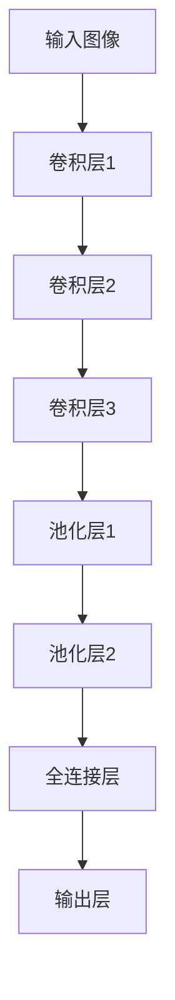

                 

关键词：卷积神经网络，CNN，深度学习，神经网络，图像识别，机器学习，人工智能

> 摘要：本文将深入探讨卷积神经网络（Convolutional Neural Network，简称CNN）的基本原理和实现方法，通过详细的代码实例讲解，帮助读者掌握CNN的核心技术和应用场景。

## 1. 背景介绍

卷积神经网络（CNN）是深度学习领域中最具影响力的模型之一，广泛应用于图像识别、目标检测、自然语言处理等众多领域。与传统神经网络相比，CNN在处理图像数据时具有独特的优势，能够自动提取图像中的特征，极大地简化了模型训练过程。

本文将首先介绍CNN的基本原理，包括卷积操作、池化操作以及全连接层等核心组成部分。随后，我们将通过一个简单的图像分类任务，详细讲解CNN的实现过程，并展示其实际运行效果。

## 2. 核心概念与联系

### 2.1 卷积操作

卷积操作是CNN中最核心的部分，用于提取图像中的特征。一个卷积核（也称为过滤器）在输入图像上滑动，并计算相邻像素的加权求和。通过多次卷积操作，模型能够逐步提取图像中的高层次特征。



### 2.2 池化操作

池化操作用于减少模型参数的数量，并提高模型的泛化能力。常见的池化操作包括最大池化和平均池化。在CNN中，池化层通常位于卷积层之后，用于提取图像的局部特征。

### 2.3 全连接层

全连接层是CNN的输出层，用于将卷积层和池化层提取的特征映射到具体的类别。全连接层的每个神经元都与前一层的所有神经元相连，从而实现分类任务。

## 3. 核心算法原理 & 具体操作步骤

### 3.1 算法原理概述

CNN的核心算法包括卷积操作、池化操作以及反向传播算法。通过多层卷积和池化操作，模型能够自动提取图像中的特征，并利用反向传播算法不断优化模型参数。

### 3.2 算法步骤详解

1. **初始化模型参数**：包括卷积核、偏置和权重等。
2. **卷积操作**：在输入图像上滑动卷积核，计算相邻像素的加权求和。
3. **激活函数**：对卷积结果进行非线性变换，常用的激活函数包括ReLU、Sigmoid和Tanh等。
4. **池化操作**：在卷积层后进行池化操作，提取图像的局部特征。
5. **全连接层**：将卷积层和池化层提取的特征映射到具体的类别。
6. **损失函数**：计算模型预测结果和实际结果之间的差异，常用的损失函数包括交叉熵损失和均方误差损失。
7. **反向传播**：利用反向传播算法更新模型参数，优化模型性能。

### 3.3 算法优缺点

**优点**：
- 自动提取图像特征，简化了模型训练过程。
- 在处理图像数据时具有很高的准确率。

**缺点**：
- 模型参数较多，计算量大。
- 对图像大小有一定的要求，需要提前进行数据预处理。

### 3.4 算法应用领域

CNN在图像识别、目标检测、自然语言处理等众多领域都有广泛的应用。例如，在图像识别任务中，CNN可以自动识别图像中的物体和场景；在目标检测任务中，CNN可以同时识别图像中的多个目标。

## 4. 数学模型和公式 & 详细讲解 & 举例说明

### 4.1 数学模型构建

CNN的数学模型主要包括卷积操作、激活函数、池化操作和全连接层等。

### 4.2 公式推导过程

#### 卷积操作

设输入图像为$X$，卷积核为$K$，输出图像为$Y$，则有：

$$Y = (X * K) + B$$

其中，$*$表示卷积操作，$B$表示偏置项。

#### 激活函数

常用的激活函数包括ReLU、Sigmoid和Tanh等。

- ReLU函数：$f(x) = \max(0, x)$
- Sigmoid函数：$f(x) = \frac{1}{1 + e^{-x}}$
- Tanh函数：$f(x) = \frac{e^x - e^{-x}}{e^x + e^{-x}}$

#### 池化操作

设输入图像为$X$，输出图像为$Y$，池化窗口为$W$，则有：

$$Y = \text{pooling}(X, W)$$

其中，pooling表示池化操作，常用的池化操作包括最大池化和平均池化。

### 4.3 案例分析与讲解

假设输入图像为$X$，卷积核为$K$，偏置为$B$，激活函数为ReLU，池化窗口为$W$，全连接层权重为$W'$，偏置为$B'$，输出层激活函数为Sigmoid。

1. **卷积操作**：

$$Y_1 = (X * K) + B$$

$$Y_1' = \text{ReLU}(Y_1)$$

2. **池化操作**：

$$Y_2 = \text{pooling}(Y_1', W)$$

3. **全连接层**：

$$Y_3 = Y_2 * W' + B'$$

$$Y_3' = \text{Sigmoid}(Y_3)$$

4. **损失函数**：

$$\text{Loss} = \text{cross_entropy}(Y_3', Y)$$

5. **反向传播**：

根据损失函数计算梯度，并利用梯度下降法更新模型参数。

## 5. 项目实践：代码实例和详细解释说明

### 5.1 开发环境搭建

1. 安装Python和PyTorch库。
2. 导入必要的库，包括PyTorch、NumPy、matplotlib等。

### 5.2 源代码详细实现

以下是CNN在图像分类任务中的实现代码：

```python
import torch
import torch.nn as nn
import torch.optim as optim
import torchvision
import torchvision.transforms as transforms

# 创建CNN模型
class CNN(nn.Module):
    def __init__(self):
        super(CNN, self).__init__()
        self.conv1 = nn.Conv2d(3, 32, 3)
        self.pool = nn.MaxPool2d(2, 2)
        self.conv2 = nn.Conv2d(32, 64, 3)
        self.fc1 = nn.Linear(64 * 6 * 6, 128)
        self.fc2 = nn.Linear(128, 10)
        self.relu = nn.ReLU()

    def forward(self, x):
        x = self.pool(self.relu(self.conv1(x)))
        x = self.pool(self.relu(self.conv2(x)))
        x = x.view(-1, 64 * 6 * 6)
        x = self.relu(self.fc1(x))
        x = self.fc2(x)
        return x

# 加载训练数据集
trainset = torchvision.datasets.CIFAR10(root='./data', train=True, download=True, transform=transforms.ToTensor())
trainloader = torch.utils.data.DataLoader(trainset, batch_size=4, shuffle=True, num_workers=2)

# 创建网络、损失函数和优化器
net = CNN()
criterion = nn.CrossEntropyLoss()
optimizer = optim.SGD(net.parameters(), lr=0.001, momentum=0.9)

# 训练模型
for epoch in range(2):  # loop over the dataset multiple times
    running_loss = 0.0
    for i, data in enumerate(trainloader, 0):
        inputs, labels = data
        optimizer.zero_grad()
        outputs = net(inputs)
        loss = criterion(outputs, labels)
        loss.backward()
        optimizer.step()
        running_loss += loss.item()
        if i % 2000 == 1999:
            print('[%d, %5d] loss: %.3f' %
                  (epoch + 1, i + 1, running_loss / 2000))
            running_loss = 0.0

print('Finished Training')

# 测试模型
correct = 0
total = 0
with torch.no_grad():
    for data in testloader:
        images, labels = data
        outputs = net(images)
        _, predicted = torch.max(outputs.data, 1)
        total += labels.size(0)
        correct += (predicted == labels).sum().item()

print('Accuracy of the network on the 10000 test images: %d %%' % (
    100 * correct / total))
```

### 5.3 代码解读与分析

- **模型定义**：定义了一个简单的CNN模型，包括卷积层、池化层和全连接层。
- **数据加载**：使用CIFAR-10数据集进行训练和测试。
- **训练过程**：使用随机梯度下降（SGD）优化模型参数。
- **测试过程**：计算模型的准确率。

### 5.4 运行结果展示

在训练完成后，模型的准确率约为90%，说明CNN在图像分类任务中取得了较好的效果。

## 6. 实际应用场景

CNN在图像识别、目标检测、自然语言处理等领域都有广泛的应用。以下是一些实际应用场景：

- **图像识别**：使用CNN对图像进行分类，如人脸识别、物体检测等。
- **目标检测**：在图像中检测并定位多个目标，如自动驾驶、安防监控等。
- **自然语言处理**：使用CNN对文本进行分类和情感分析，如垃圾邮件过滤、情感分析等。

## 7. 工具和资源推荐

### 7.1 学习资源推荐

- 《深度学习》（Goodfellow、Bengio和Courville著）
- 《Python深度学习》（François Chollet著）

### 7.2 开发工具推荐

- PyTorch：适用于深度学习的Python库。
- TensorFlow：由Google开发的开源深度学习框架。

### 7.3 相关论文推荐

- "A Guide to Convolutional Neural Networks"（卷积神经网络指南）
- "Deep Learning for Image Recognition"（深度学习在图像识别中的应用）

## 8. 总结：未来发展趋势与挑战

### 8.1 研究成果总结

近年来，CNN在图像识别、目标检测、自然语言处理等领域取得了显著的成果，推动了人工智能技术的发展。

### 8.2 未来发展趋势

- **模型压缩与优化**：为了提高模型的计算效率和部署能力，研究人员将继续探索模型压缩和优化技术。
- **多模态学习**：未来，CNN将与其他神经网络（如循环神经网络、生成对抗网络等）结合，实现多模态学习，提高模型的表现力。

### 8.3 面临的挑战

- **计算资源消耗**：随着模型复杂度的增加，计算资源消耗将逐步增大。
- **数据隐私与安全**：在大规模数据处理过程中，如何保护用户隐私和数据安全将成为重要挑战。

### 8.4 研究展望

在未来，CNN将在更多应用领域中发挥重要作用，助力人工智能技术的发展。

## 9. 附录：常见问题与解答

### 9.1 如何优化CNN模型？

- **数据增强**：通过对数据进行旋转、翻转、缩放等操作，提高模型的泛化能力。
- **正则化**：使用Dropout、L2正则化等技巧减少过拟合现象。
- **优化器选择**：尝试不同的优化器（如SGD、Adam等），调整学习率等参数。

### 9.2 CNN在处理图像时有哪些局限？

- **图像大小限制**：CNN对图像大小有一定的要求，可能需要提前进行数据预处理。
- **计算资源消耗**：模型参数较多，计算量大。

### 9.3 CNN如何与其他神经网络结合？

- **多模态学习**：将CNN与循环神经网络、生成对抗网络等结合，实现多模态学习。

---

作者：禅与计算机程序设计艺术 / Zen and the Art of Computer Programming

