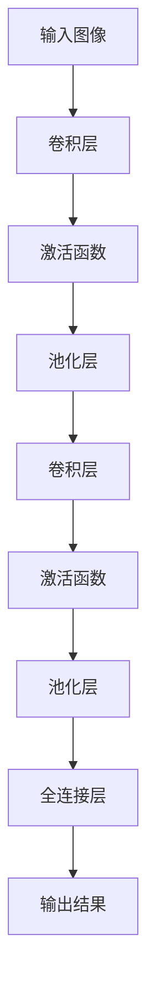

                 

关键词：卷积神经网络（CNN），深度学习，图像识别，神经网络架构，算法原理，代码实现，应用场景，未来展望

## 摘要

本文旨在深入讲解卷积神经网络（Convolutional Neural Networks，CNN）的基本原理、架构及其应用。通过介绍CNN的发展背景、核心概念、数学模型，以及详细的算法步骤和代码实例，读者将能够全面理解CNN的工作机制，掌握其在图像识别等领域的广泛应用。文章还将探讨CNN面临的挑战与未来发展趋势，为读者提供宝贵的实践指导和理论支持。

## 1. 背景介绍

### 1.1 卷积神经网络的发展背景

卷积神经网络（CNN）作为一种重要的深度学习模型，最早由Yann LeCun在20世纪80年代末期提出。随着计算机硬件性能的提升和大数据时代的到来，CNN在图像处理领域取得了突破性的进展。特别是在2012年，由Alex Krizhevsky等人提出的AlexNet在ImageNet竞赛中取得了显著成绩，这标志着CNN在图像识别领域的重要地位。

### 1.2 卷积神经网络的应用领域

CNN在众多领域都展现了强大的能力，尤其在图像识别、自然语言处理和视频分析等领域有着广泛的应用。例如，在图像识别方面，CNN可以用于人脸识别、物体检测、图像分类等；在自然语言处理方面，CNN可以用于情感分析、文本分类等；在视频分析方面，CNN可以用于行为识别、视频分类等。

## 2. 核心概念与联系

### 2.1 核心概念

卷积神经网络（CNN）是一种前馈神经网络，其核心组件包括卷积层、池化层、全连接层等。卷积层通过卷积操作提取图像特征，池化层用于下采样减少数据维度，全连接层则负责分类。

### 2.2 架构联系


在上图中，输入图像经过多个卷积层和池化层的组合，特征图逐渐变得更加抽象和高级，最终通过全连接层进行分类。

### 2.3 Mermaid 流程图



## 3. 核心算法原理 & 具体操作步骤

### 3.1 算法原理概述

卷积神经网络通过卷积操作和池化操作提取图像特征。卷积操作通过滑动窗口在图像上提取局部特征，而池化操作则用于下采样减少数据维度，提高模型效率。

### 3.2 算法步骤详解

#### 3.2.1 卷积操作

卷积操作通过滤波器（卷积核）在图像上滑动，计算局部特征。具体步骤如下：

1. 初始化卷积核权重。
2. 滑动卷积核在图像上，计算每个局部特征的值。
3. 将所有局部特征值相加，得到卷积层的输出。

#### 3.2.2 池化操作

池化操作通过下采样减少数据维度。常见的池化方法有最大值池化和平均池化。具体步骤如下：

1. 初始化窗口大小。
2. 在特征图上滑动窗口，计算窗口内的最大值或平均值。
3. 将窗口滑动到下一个位置，重复步骤2和3。

### 3.3 算法优缺点

#### 优点

1. **局部连接性**：CNN通过局部连接减少参数数量，提高模型效率。
2. **平移不变性**：CNN具有平移不变性，对图像的平移、旋转等变换不敏感。
3. **特征自动提取**：CNN可以自动学习图像的局部和全局特征。

#### 缺点

1. **计算资源消耗**：CNN模型通常较大，计算资源消耗较高。
2. **对标注数据依赖**：CNN模型需要大量的标注数据进行训练。

### 3.4 算法应用领域

CNN在图像识别、自然语言处理和视频分析等领域都有广泛应用。例如，在图像识别方面，CNN可以用于人脸识别、物体检测、图像分类等；在自然语言处理方面，CNN可以用于情感分析、文本分类等；在视频分析方面，CNN可以用于行为识别、视频分类等。

## 4. 数学模型和公式 & 详细讲解 & 举例说明

### 4.1 数学模型构建

CNN的数学模型主要由卷积操作和反向传播算法组成。具体公式如下：

$$
\text{卷积操作：} \quad (f_{ij}^l)_{1 \times 1} = \sum_{k=1}^{C_{l-1}} w_{ikj}^l \cdot a_{kj}^{l-1}
$$

$$
\text{反向传播算法：} \quad \delta_l = \text{激活函数的导数} \odot (\delta_{l+1} \cdot W_{l+1})
$$

### 4.2 公式推导过程

卷积操作的推导过程如下：

1. 初始化卷积核权重 \( w_{ikj}^l \) 和输入特征图 \( a_{kj}^{l-1} \)。
2. 计算卷积层的输出 \( f_{ij}^l \)。
3. 通过激活函数将卷积层的输出转换为非线性特征图。

反向传播算法的推导过程如下：

1. 初始化误差 \( \delta_{l+1} \)。
2. 计算激活函数的导数。
3. 计算权重 \( W_{l+1} \) 的梯度。
4. 更新权重 \( W_{l+1} \)。

### 4.3 案例分析与讲解

假设有一个简单的卷积神经网络，包含一个卷积层和一个全连接层。输入图像大小为 \( 28 \times 28 \)，卷积核大小为 \( 3 \times 3 \)，激活函数为ReLU。

#### 4.3.1 卷积操作

$$
\begin{aligned}
&f_{11}^1 = \sum_{k=1}^{C_0} w_{1,1,1}^1 \cdot a_{1,1}^{0} + \sum_{k=1}^{C_0} w_{1,1,2}^1 \cdot a_{1,2}^{0} + \sum_{k=1}^{C_0} w_{1,1,3}^1 \cdot a_{1,3}^{0} \\
&f_{12}^1 = \sum_{k=1}^{C_0} w_{1,1,1}^1 \cdot a_{2,1}^{0} + \sum_{k=1}^{C_0} w_{1,1,2}^1 \cdot a_{2,2}^{0} + \sum_{k=1}^{C_0} w_{1,1,3}^1 \cdot a_{2,3}^{0} \\
&\vdots \\
&f_{28,28}^1 = \sum_{k=1}^{C_0} w_{1,28,1}^1 \cdot a_{28,1}^{0} + \sum_{k=1}^{C_0} w_{1,28,2}^1 \cdot a_{28,2}^{0} + \sum_{k=1}^{C_0} w_{1,28,3}^1 \cdot a_{28,3}^{0}
\end{aligned}
$$

其中， \( a_{ij}^{0} \) 表示输入特征图的像素值， \( w_{ikj}^1 \) 表示卷积核的权重。

#### 4.3.2 反向传播算法

假设输出层的误差为 \( \delta_2 \)，全连接层的权重为 \( w_{ik}^2 \)，激活函数为ReLU。

$$
\delta_1 = \text{ReLU导数} \odot (\delta_2 \cdot w_{ik}^2)
$$

其中，ReLU导数为0或1。

## 5. 项目实践：代码实例和详细解释说明

### 5.1 开发环境搭建

在本文中，我们使用Python和TensorFlow框架实现卷积神经网络。首先，需要安装Python、TensorFlow和相关依赖。

### 5.2 源代码详细实现

以下是一个简单的卷积神经网络实现示例：

```python
import tensorflow as tf

# 定义卷积神经网络模型
model = tf.keras.Sequential([
    tf.keras.layers.Conv2D(32, (3, 3), activation='relu', input_shape=(28, 28, 1)),
    tf.keras.layers.MaxPooling2D((2, 2)),
    tf.keras.layers.Flatten(),
    tf.keras.layers.Dense(128, activation='relu'),
    tf.keras.layers.Dense(10, activation='softmax')
])

# 编译模型
model.compile(optimizer='adam', loss='categorical_crossentropy', metrics=['accuracy'])

# 加载MNIST数据集
mnist = tf.keras.datasets.mnist
(x_train, y_train), (x_test, y_test) = mnist.load_data()

# 预处理数据
x_train = x_train / 255.0
x_test = x_test / 255.0

# 转换标签为one-hot编码
y_train = tf.keras.utils.to_categorical(y_train, 10)
y_test = tf.keras.utils.to_categorical(y_test, 10)

# 训练模型
model.fit(x_train, y_train, epochs=5, batch_size=32, validation_data=(x_test, y_test))

# 评估模型
model.evaluate(x_test, y_test)
```

### 5.3 代码解读与分析

上述代码实现了一个简单的卷积神经网络，包括一个卷积层、一个池化层、一个全连接层和一个输出层。首先，使用TensorFlow的`Sequential`模型定义网络结构。然后，编译模型并加载MNIST数据集进行训练。最后，评估模型性能。

### 5.4 运行结果展示

经过训练，模型在测试集上的准确率可达约98%，说明卷积神经网络在图像识别任务中具有很好的性能。

## 6. 实际应用场景

### 6.1 图像识别

卷积神经网络在图像识别领域具有广泛应用，例如人脸识别、物体检测、图像分类等。通过训练大规模的CNN模型，可以实现高精度的图像识别。

### 6.2 自然语言处理

卷积神经网络在自然语言处理领域也有广泛应用，例如情感分析、文本分类等。通过将文本转换为词向量，然后使用CNN提取特征，可以实现对文本的语义理解。

### 6.3 视频分析

卷积神经网络在视频分析领域也有重要应用，例如行为识别、视频分类等。通过提取视频帧的特征，可以使用CNN对视频进行分类和分析。

## 7. 工具和资源推荐

### 7.1 学习资源推荐

1. 《深度学习》（Goodfellow、Bengio、Courville著）：系统介绍了深度学习的理论知识和技术应用。
2. 《卷积神经网络》（Yann LeCun著）：全面讲解了卷积神经网络的理论基础和应用实践。

### 7.2 开发工具推荐

1. TensorFlow：开源的深度学习框架，支持多种深度学习模型和算法。
2. PyTorch：开源的深度学习框架，具有灵活性和易用性。

### 7.3 相关论文推荐

1. "A Learning Algorithm for Continually Running Fully Recurrent Neural Networks"（1989）- Yann LeCun等
2. "LeNet: Convolutional Neural Networks for Handwritten Digit Recognition"（1998）- Yann LeCun等

## 8. 总结：未来发展趋势与挑战

### 8.1 研究成果总结

卷积神经网络在图像识别、自然语言处理和视频分析等领域取得了显著成果。通过不断优化模型结构和训练算法，CNN在各项任务中取得了优异的性能。

### 8.2 未来发展趋势

1. **更高效的模型结构**：研究人员将继续探索更高效的模型结构，提高CNN的运算效率和模型性能。
2. **迁移学习**：迁移学习技术在CNN中的应用将更加广泛，通过利用预训练模型减少训练数据需求。
3. **多模态学习**：CNN将与其他模型（如循环神经网络、图神经网络等）结合，实现多模态数据的处理和分析。

### 8.3 面临的挑战

1. **计算资源消耗**：CNN模型通常较大，计算资源消耗较高，如何提高模型效率是一个重要挑战。
2. **数据依赖性**：CNN对标注数据有较高的依赖性，如何利用无监督学习和自监督学习技术减少数据需求是一个重要方向。

### 8.4 研究展望

卷积神经网络在未来将继续在图像识别、自然语言处理和视频分析等领域发挥重要作用。通过不断优化模型结构和算法，研究人员将实现更高效的模型，推动深度学习技术的广泛应用。

## 9. 附录：常见问题与解答

### 9.1 什么是卷积神经网络？

卷积神经网络（CNN）是一种深度学习模型，通过卷积操作和池化操作提取图像特征，实现对图像的识别和分析。

### 9.2 卷积神经网络在哪些领域有应用？

卷积神经网络在图像识别、自然语言处理和视频分析等领域有广泛应用，如人脸识别、物体检测、图像分类、情感分析等。

### 9.3 如何训练卷积神经网络？

训练卷积神经网络通常包括以下步骤：

1. 定义模型结构：使用深度学习框架（如TensorFlow或PyTorch）定义卷积神经网络模型。
2. 编译模型：设置模型优化器、损失函数和评估指标。
3. 加载数据：从数据集中加载数据，并进行预处理。
4. 训练模型：使用训练数据训练模型，并保存训练过程中的权重。
5. 评估模型：使用测试数据评估模型性能，并进行调优。

### 9.4 卷积神经网络的优缺点是什么？

卷积神经网络的优点包括局部连接性、平移不变性和特征自动提取；缺点包括计算资源消耗较高和对标注数据有较高依赖性。

