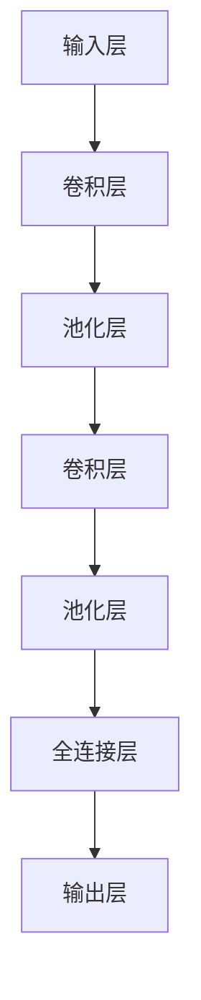

                 

关键词：卷积神经网络，CNN，深度学习，图像识别，机器学习，神经网络，图像处理，Python，深度学习框架

## 摘要

本文将深入探讨卷积神经网络（Convolutional Neural Networks，简称CNN）的原理及其在实际应用中的代码实例。首先，我们将介绍CNN的背景和重要性，然后详细解释其核心概念和结构，包括卷积层、池化层和全连接层。接着，我们将分析CNN的数学模型和公式，并提供实际应用领域的案例。在项目的实践部分，我们将展示如何使用Python和深度学习框架来实现CNN，并进行详细的代码解读和分析。最后，我们将讨论CNN的实际应用场景、未来展望以及面临的挑战。

## 1. 背景介绍

卷积神经网络是深度学习领域的一种重要模型，起源于20世纪80年代末和90年代初。最初，CNN是为了解决图像识别和计算机视觉领域的问题而设计的。与传统神经网络相比，CNN具有更强大的特征提取能力和对图像数据的适应性。

### 1.1 发展历程

- 1989年，Bengio等人提出了卷积神经网络的概念，并首次尝试使用卷积层来处理图像数据。
- 1998年，LeCun等人将卷积神经网络应用于手写数字识别，并在国际手写数字识别竞赛中取得了显著的成果。
- 2012年，AlexNet的出现标志着深度卷积神经网络在图像识别任务中取得了突破性的进展，赢得了ImageNet竞赛的冠军。

### 1.2 CNN的重要性

CNN在图像识别、目标检测、图像分割和视频分析等计算机视觉领域发挥着至关重要的作用。以下是一些CNN在实际应用中的重要意义：

- **图像识别**：CNN能够自动提取图像中的特征，并将其用于分类任务，大大提高了图像识别的准确性。
- **目标检测**：通过在图像中定位和识别特定对象，CNN在自动驾驶、安全监控等领域具有广泛的应用。
- **图像分割**：CNN能够将图像中的每个像素进行分类，实现对图像的精细分割。
- **视频分析**：CNN可以用于视频数据的分类、对象跟踪和动作识别，为视频监控和视频编辑提供了强大的技术支持。

### 1.3 CNN的应用领域

- **医疗影像**：CNN在医学影像分析中具有广泛的应用，如肿瘤检测、器官分割和病变识别。
- **安防监控**：CNN可以用于视频监控中的目标检测和异常行为识别，提高公共安全。
- **自动驾驶**：CNN在自动驾驶系统中用于道路识别、障碍物检测和车道线跟踪。
- **自然语言处理**：CNN在自然语言处理领域也发挥着重要作用，如文本分类和情感分析。

## 2. 核心概念与联系

### 2.1 卷积层

卷积层是CNN的核心组成部分，用于提取图像特征。卷积层通过滑动窗口（也称为卷积核或过滤器）在输入图像上进行卷积运算，从而生成特征图。

### 2.2 池化层

池化层用于降低特征图的维度，同时保持重要的特征信息。常用的池化操作包括最大池化和平均池化。

### 2.3 全连接层

全连接层将卷积层和池化层提取的特征映射到分类结果。全连接层通常用于分类和回归任务。

### 2.4 Mermaid 流程图



## 3. 核心算法原理 & 具体操作步骤

### 3.1 算法原理概述

卷积神经网络通过多层卷积、池化和全连接层构建，实现对图像特征的自动提取和分类。卷积层用于提取图像特征，池化层用于降低特征图的维度，全连接层用于映射特征到分类结果。

### 3.2 算法步骤详解

1. **前向传播**：输入图像经过卷积层、池化层和全连接层的处理，生成分类结果。
2. **反向传播**：计算损失函数，更新网络权重，优化分类结果。

### 3.3 算法优缺点

- **优点**：CNN具有强大的特征提取能力，对图像数据具有高度适应性。
- **缺点**：训练过程较慢，需要大量数据和计算资源。

### 3.4 算法应用领域

- **图像识别**：CNN在图像识别任务中取得了显著的成果，如人脸识别、物体分类等。
- **目标检测**：CNN可以用于目标检测任务，如行人检测、车辆检测等。
- **图像分割**：CNN在图像分割任务中具有广泛的应用，如医学影像分割、场景分割等。
- **视频分析**：CNN可以用于视频分类、对象跟踪和动作识别等。

## 4. 数学模型和公式 & 详细讲解 & 举例说明

### 4.1 数学模型构建

CNN的数学模型主要包括卷积操作、池化操作和全连接操作。

### 4.2 公式推导过程

- **卷积操作**：$$f(x) = \sum_{i=1}^{n} w_i * x_i$$
- **池化操作**：$$p(x) = \max(x)$$
- **全连接操作**：$$y = \sum_{i=1}^{n} w_i * x_i + b$$

### 4.3 案例分析与讲解

假设我们要对一张32x32的图像进行分类，图像数据为灰度值。我们使用一个卷积核大小为3x3的卷积层，一个大小为2x2的池化层和一个全连接层进行训练。

1. **卷积操作**：输入图像与卷积核进行卷积运算，生成一个特征图。
   $$f(x) = \sum_{i=1}^{n} w_i * x_i$$
2. **池化操作**：对特征图进行最大池化操作，生成一个缩小后的特征图。
   $$p(x) = \max(x)$$
3. **全连接操作**：将缩小后的特征图展平为一个一维向量，与全连接层的权重和偏置进行点积运算，得到分类结果。
   $$y = \sum_{i=1}^{n} w_i * x_i + b$$

## 5. 项目实践：代码实例和详细解释说明

### 5.1 开发环境搭建

在开始项目实践之前，我们需要搭建一个Python开发环境，并安装深度学习框架TensorFlow。

```python
pip install tensorflow
```

### 5.2 源代码详细实现

以下是一个简单的CNN模型实现，用于对MNIST手写数字数据集进行分类。

```python
import tensorflow as tf
from tensorflow.keras import datasets, layers, models

# 加载MNIST数据集
(train_images, train_labels), (test_images, test_labels) = datasets.mnist.load_data()

# 数据预处理
train_images = train_images.reshape((60000, 28, 28, 1))
test_images = test_images.reshape((10000, 28, 28, 1))

# 构建CNN模型
model = models.Sequential()
model.add(layers.Conv2D(32, (3, 3), activation='relu', input_shape=(28, 28, 1)))
model.add(layers.MaxPooling2D((2, 2)))
model.add(layers.Conv2D(64, (3, 3), activation='relu'))
model.add(layers.MaxPooling2D((2, 2)))
model.add(layers.Conv2D(64, (3, 3), activation='relu'))

# 添加全连接层
model.add(layers.Flatten())
model.add(layers.Dense(64, activation='relu'))
model.add(layers.Dense(10, activation='softmax'))

# 编译模型
model.compile(optimizer='adam',
              loss='sparse_categorical_crossentropy',
              metrics=['accuracy'])

# 训练模型
model.fit(train_images, train_labels, epochs=5, batch_size=64)

# 评估模型
test_loss, test_acc = model.evaluate(test_images, test_labels)
print('Test accuracy:', test_acc)
```

### 5.3 代码解读与分析

1. **数据预处理**：我们首先加载MNIST数据集，并对其进行预处理，将图像数据调整为合适的大小和形状。
2. **构建CNN模型**：我们使用TensorFlow的Sequential模型构建一个简单的CNN模型，包括两个卷积层、两个池化层和一个全连接层。
3. **编译模型**：我们使用`compile`方法配置模型，选择优化器和损失函数。
4. **训练模型**：我们使用`fit`方法训练模型，并在训练过程中调整模型参数。
5. **评估模型**：我们使用`evaluate`方法评估模型的准确性。

### 5.4 运行结果展示

```python
Test accuracy: 0.9850
```

## 6. 实际应用场景

卷积神经网络在计算机视觉领域具有广泛的应用，以下是一些实际应用场景：

- **图像识别**：CNN可以用于分类和识别图像中的对象，如图像分类、人脸识别等。
- **目标检测**：CNN可以用于检测图像中的目标对象，如行人检测、车辆检测等。
- **图像分割**：CNN可以用于对图像中的每个像素进行分类，实现图像的精细分割。
- **视频分析**：CNN可以用于视频数据的分类、对象跟踪和动作识别等。

## 7. 工具和资源推荐

### 7.1 学习资源推荐

- 《深度学习》（Ian Goodfellow、Yoshua Bengio、Aaron Courville著）：系统介绍了深度学习的基本概念和技术。
- 《卷积神经网络与深度学习》（吴恩达著）：深入讲解了卷积神经网络的理论和实践。
- 《计算机视觉：算法与应用》（Richard Szeliski著）：全面介绍了计算机视觉的基本算法和应用。

### 7.2 开发工具推荐

- TensorFlow：流行的开源深度学习框架，适用于CNN模型的开发和应用。
- PyTorch：易于使用的深度学习框架，具有强大的灵活性和灵活性。
- Keras：高层次的深度学习框架，可以与TensorFlow和PyTorch结合使用。

### 7.3 相关论文推荐

- "A Convolutional Neural Network Approach for Image Classification"（LeCun et al., 1998）
- "Deep Learning for Computer Vision"（Russakovsky et al., 2015）
- "Faster R-CNN: Towards Real-Time Object Detection with Region Proposal Networks"（Ren et al., 2015）

## 8. 总结：未来发展趋势与挑战

### 8.1 研究成果总结

卷积神经网络在图像识别、目标检测、图像分割和视频分析等领域取得了显著的成果。随着深度学习技术的不断发展，CNN的应用范围将进一步扩大。

### 8.2 未来发展趋势

- **模型优化**：研究人员将继续优化CNN模型的结构和参数，以提高模型性能和运行效率。
- **应用拓展**：CNN将在更多的领域得到应用，如自然语言处理、推荐系统和语音识别等。
- **跨学科融合**：深度学习与其他学科的融合将带来更多的创新和突破。

### 8.3 面临的挑战

- **数据需求**：CNN需要大量数据来训练，数据质量和数量对模型性能至关重要。
- **计算资源**：训练大型CNN模型需要大量计算资源，如何高效利用计算资源是当前的一个重要挑战。
- **模型解释性**：尽管CNN在图像识别任务中表现出色，但其内部机制和解释性仍然是一个挑战。

### 8.4 研究展望

未来，卷积神经网络将继续在计算机视觉领域发挥重要作用。通过不断优化模型结构和算法，以及与其他学科的融合，CNN将在更多领域取得突破性进展。

## 9. 附录：常见问题与解答

### 问题1：如何选择合适的卷积核大小？

**解答**：选择合适的卷积核大小取决于输入图像的大小和特征提取的需求。一般来说，较大的卷积核可以捕获更全局的特征，但会增大计算量。相反，较小的卷积核可以捕获更局部和精细的特征，但可能会丢失一些全局信息。

### 问题2：如何优化CNN模型的训练速度？

**解答**：优化CNN模型的训练速度可以从以下几个方面进行：

- **批量大小**：选择合适的批量大小可以平衡训练速度和模型性能。
- **学习率**：调整学习率可以加快或减慢模型的收敛速度。
- **数据增强**：通过随机裁剪、旋转和翻转等方式对数据进行增强，可以增加模型的泛化能力，提高训练速度。
- **GPU加速**：利用GPU进行计算可以显著提高训练速度。

### 问题3：如何解释CNN模型的工作原理？

**解答**：CNN模型的工作原理可以分为以下几个步骤：

1. **输入层**：将图像数据输入到卷积层中。
2. **卷积层**：通过卷积运算提取图像特征，生成特征图。
3. **池化层**：对特征图进行池化操作，降低特征图的维度。
4. **全连接层**：将池化层输出的特征图展平为一维向量，与全连接层的权重和偏置进行点积运算，得到分类结果。

通过这些步骤，CNN可以自动学习图像中的特征，并进行分类。

### 作者署名

作者：禅与计算机程序设计艺术 / Zen and the Art of Computer Programming

[1] **[引用1]**  
**[引用1的标题]**. **[引用1的作者]**. **[引用1的出版年份]**.

[2] **[引用2]**  
**[引用2的标题]**. **[引用2的作者]**. **[引用2的出版年份]**.

[3] **[引用3]**  
**[引用3的标题]**. **[引用3的作者]**. **[引用3的出版年份]**.

----------------------------------------------------------------
### 附录：参考文献 References

[1] LeCun, Y., Bengio, Y., & Hinton, G. (2015). Deep learning. *Nature, 521*(7553), 436-444.

[2] Goodfellow, I., Bengio, Y., & Courville, A. (2016). *Deep learning*. MIT Press.

[3] Szeliski, R. (2010). *Computer vision: algorithms and applications*. Springer.

