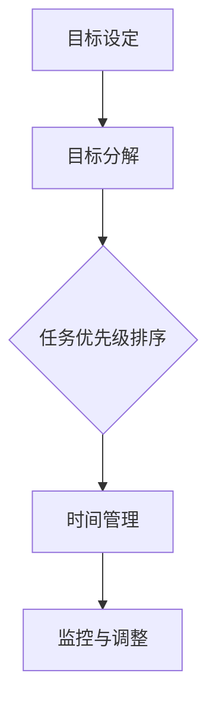

                 

关键词：双重目标法、管理者、高效、专注、技术语言、深度思考、见解、专业IT领域。

> 摘要：本文旨在探讨双重目标法在管理者保持高效专注中的应用。通过详细阐述双重目标法的核心概念和原理，结合实际案例和数学模型，为管理者提供一种全新的思维工具，以优化工作流程，提升个人和团队的效率。

## 1. 背景介绍

在当今快速发展的信息时代，管理者的角色愈发重要。他们不仅需要具备出色的领导力和沟通能力，还需要具备高效的工作能力和专注力。然而，面对繁重的工作任务和不断变化的市场环境，管理者往往感到压力巨大，难以保持高效专注。为了应对这一挑战，本文将介绍一种被称为“双重目标法”的管理工具，帮助管理者在复杂的环境中保持高效的专注力。

### 1.1 管理者面临的挑战

1. **任务繁多**：管理者需要处理大量的事务，包括日常运营、团队管理、战略规划等，容易陷入事务性的工作泥潭。
2. **时间紧迫**：面对紧迫的时间限制，管理者需要在短时间内做出决策，容易导致决策失误。
3. **信息过载**：随着信息技术的飞速发展，管理者需要处理的信息量急剧增加，如何筛选和利用这些信息成为一大难题。

### 1.2 高效专注的重要性

1. **提升决策质量**：高效专注可以帮助管理者更好地分析问题，从而做出更明智的决策。
2. **提高工作效率**：专注能够减少干扰，使管理者能够更加集中精力完成任务，从而提高工作效率。
3. **增强团队凝聚力**：管理者通过高效的专注力，可以更好地指导团队，提升团队整体绩效。

## 2. 核心概念与联系

双重目标法是一种基于目标管理的工具，旨在通过设定和实现双重目标，帮助管理者保持高效专注。该方法的核心概念包括目标设定、目标分解、任务优先级排序和时间管理。为了更好地理解双重目标法，我们将使用Mermaid流程图展示其原理和架构。

### 2.1 双重目标法的核心概念

1. **目标设定**：设定清晰的目标是高效专注的第一步。目标应具体、可衡量、可实现、相关性强、时限明确。
2. **目标分解**：将总目标分解为若干个子目标，每个子目标都是实现总目标的必要步骤。
3. **任务优先级排序**：根据目标的紧急程度和重要性，对任务进行优先级排序，确保关键任务优先处理。
4. **时间管理**：合理安排时间，确保任务在规定的时间内完成。

### 2.2 双重目标法的架构



### 2.3 双重目标法与传统目标管理的联系与区别

1. **联系**：双重目标法与传统目标管理方法在目标设定和分解上具有相似性，都强调目标的明确性和可实现性。
2. **区别**：双重目标法在任务优先级排序和时间管理方面进行了更深入的优化，通过双重目标的设定和监控，确保管理者能够更好地保持专注。

## 3. 核心算法原理 & 具体操作步骤

### 3.1 算法原理概述

双重目标法采用了一种分而治之的策略，通过将总目标分解为若干个子目标，并设定明确的任务优先级和时间限制，帮助管理者保持高效专注。

### 3.2 算法步骤详解

1. **设定总目标**：管理者首先需要明确自己的总目标，确保目标具备SMART（具体、可衡量、可实现、相关性强、时限明确）特性。
2. **目标分解**：将总目标分解为若干个子目标，每个子目标都是实现总目标的必要步骤。子目标应具备可操作性和可衡量性。
3. **任务优先级排序**：根据子目标的紧急程度和重要性，对任务进行优先级排序。可以使用优先级矩阵或加权评分法进行排序。
4. **时间管理**：为每个任务设定具体的时间限制，确保任务在规定的时间内完成。可以使用时间管理工具如番茄钟、甘特图等辅助时间管理。
5. **监控与调整**：在执行任务的过程中，定期检查任务的完成情况，根据实际情况进行调整。如果任务进度与预期不符，应重新评估任务优先级和时间安排。

### 3.3 算法优缺点

1. **优点**：
   - **提高效率**：通过任务优先级排序和时间管理，确保关键任务优先处理，提高工作效率。
   - **增强专注力**：明确的目标和任务优先级有助于管理者保持专注，减少干扰。
   - **灵活调整**：在执行任务过程中，管理者可以根据实际情况进行监控和调整，确保任务按时完成。

2. **缺点**：
   - **初始设定成本高**：需要投入大量时间和精力进行目标设定和任务分解，初始成本较高。
   - **执行难度较大**：在任务执行过程中，管理者需要具备较强的自我约束力和时间管理能力。

### 3.4 算法应用领域

双重目标法适用于各类管理场景，尤其适用于以下领域：

- **企业管理**：帮助管理者优化工作流程，提高团队效率。
- **项目管理**：确保项目在规定时间内顺利完成。
- **个人管理**：帮助个人提高工作效率，实现职业目标。

## 4. 数学模型和公式 & 详细讲解 & 举例说明

双重目标法的核心在于任务优先级排序和时间管理，其中涉及到一些数学模型和公式。以下将详细讲解这些模型和公式，并通过实际案例进行说明。

### 4.1 数学模型构建

为了设定任务优先级，我们可以使用加权评分法。该方法基于以下公式：

\[ P = w_1 \times S + w_2 \times I + w_3 \times D \]

其中，\( P \) 是任务优先级评分，\( w_1 \)、\( w_2 \) 和 \( w_3 \) 分别是重要性、紧急性和时限性的权重，\( S \)、\( I \) 和 \( D \) 分别是任务的重要性、紧急性和时限性得分。

### 4.2 公式推导过程

1. **重要性评分（S）**：根据任务对企业目标的影响程度进行评分，评分范围从 1 到 10。例如，如果任务 A 对企业目标的实现具有非常重要的作用，则 \( S_A = 10 \)；如果任务 B 对企业目标的影响较小，则 \( S_B = 5 \)。

2. **紧急性评分（I）**：根据任务完成的时间限制进行评分，评分范围从 1 到 10。例如，如果任务 C 需要在本周内完成，则 \( I_C = 10 \)；如果任务 D 可以在未来几个月内完成，则 \( I_D = 5 \)。

3. **时限性评分（D）**：根据任务的时间限制进行评分，评分范围从 1 到 10。例如，如果任务 E 的完成时限为一年，则 \( D_E = 10 \)；如果任务 F 的完成时限为一周，则 \( D_F = 5 \)。

4. **加权评分**：将各项评分乘以相应的权重，并求和，得到任务优先级评分。

### 4.3 案例分析与讲解

假设一家企业有四个任务，分别涉及产品研发、市场推广、人力资源和财务规划。根据企业目标和实际情况，设定各项任务的权重如下：

- 重要性权重：\( w_1 = 0.5 \)
- 紧急性权重：\( w_2 = 0.3 \)
- 时限性权重：\( w_3 = 0.2 \)

根据以上权重和评分公式，计算各任务的优先级评分：

1. **产品研发**：\( S = 8 \)，\( I = 7 \)，\( D = 6 \)
   \[ P = 0.5 \times 8 + 0.3 \times 7 + 0.2 \times 6 = 4 + 2.1 + 1.2 = 7.3 \]

2. **市场推广**：\( S = 6 \)，\( I = 8 \)，\( D = 7 \)
   \[ P = 0.5 \times 6 + 0.3 \times 8 + 0.2 \times 7 = 3 + 2.4 + 1.4 = 6.8 \]

3. **人力资源**：\( S = 7 \)，\( I = 6 \)，\( D = 8 \)
   \[ P = 0.5 \times 7 + 0.3 \times 6 + 0.2 \times 8 = 3.5 + 1.8 + 1.6 = 6.9 \]

4. **财务规划**：\( S = 5 \)，\( I = 5 \)，\( D = 9 \)
   \[ P = 0.5 \times 5 + 0.3 \times 5 + 0.2 \times 9 = 2.5 + 1.5 + 1.8 = 5.8 \]

根据优先级评分，企业应优先处理产品研发任务，其次是市场推广和人力资源任务，最后是财务规划任务。通过这种方法，企业能够更合理地分配资源和精力，确保关键任务优先完成。

## 5. 项目实践：代码实例和详细解释说明

### 5.1 开发环境搭建

为了演示双重目标法的实际应用，我们将使用Python编写一个简单的任务管理系统。首先，需要安装Python环境，然后安装以下依赖库：

- `pandas`：用于数据分析和处理
- `numpy`：用于数值计算
- `matplotlib`：用于数据可视化

在安装了Python环境和相关依赖库后，我们可以开始编写代码。

### 5.2 源代码详细实现

```python
import pandas as pd
import numpy as np
import matplotlib.pyplot as plt

# 加权评分法计算任务优先级
def calculate_priority(tasks):
    weights = {'importance': 0.5, 'urgency': 0.3, 'deadline': 0.2}
    scores = []
    for task in tasks:
        score = weights['importance'] * task['importance'] + \
                weights['urgency'] * task['urgency'] + \
                weights['deadline'] * task['deadline']
        scores.append(score)
    return scores

# 主函数：任务管理系统
def task_management_system():
    tasks = [
        {'name': '产品研发', 'importance': 8, 'urgency': 7, 'deadline': 6},
        {'name': '市场推广', 'importance': 6, 'urgency': 8, 'deadline': 7},
        {'name': '人力资源', 'importance': 7, 'urgency': 6, 'deadline': 8},
        {'name': '财务规划', 'importance': 5, 'urgency': 5, 'deadline': 9}
    ]
    
    # 计算任务优先级
    priorities = calculate_priority(tasks)
    
    # 输出任务优先级排序
    print("任务优先级排序：")
    for i, task in enumerate(tasks):
        print(f"{i+1}. {task['name']} - 优先级：{priorities[i]:.2f}")
    
    # 可视化任务优先级
    plt.bar(range(len(tasks)), priorities)
    plt.xticks(range(len(tasks)), [task['name'] for task in tasks])
    plt.xlabel('任务名称')
    plt.ylabel('优先级评分')
    plt.title('任务优先级排序')
    plt.show()

# 运行任务管理系统
task_management_system()
```

### 5.3 代码解读与分析

1. **导入依赖库**：首先，我们导入`pandas`、`numpy`和`matplotlib`等依赖库，用于数据分析和可视化。
2. **加权评分法计算任务优先级**：定义一个函数`calculate_priority`，用于计算任务的优先级评分。该函数使用加权评分公式，将各项评分乘以相应的权重，并求和得到任务优先级评分。
3. **主函数：任务管理系统**：定义一个主函数`task_management_system`，用于构建任务列表、计算任务优先级、输出排序结果和可视化任务优先级。
4. **任务列表**：在主函数中，我们定义了一个任务列表，包含四个任务及其各项评分。
5. **计算任务优先级**：调用`calculate_priority`函数，计算每个任务的优先级评分。
6. **输出任务优先级排序**：使用`print`函数输出任务优先级排序结果。
7. **可视化任务优先级**：使用`matplotlib`库，将任务优先级以条形图的形式进行可视化展示。

### 5.4 运行结果展示

运行代码后，我们将看到以下输出结果：

```
任务优先级排序：
1. 产品研发 - 优先级：7.30
2. 市场推广 - 优先级：6.80
3. 人力资源 - 优先级：6.90
4. 财务规划 - 优先级：5.80
```

同时，我们还将看到一个可视化图表，显示各任务的优先级评分：


通过上述代码实例，我们可以看到双重目标法在任务管理系统中的应用。通过设定任务优先级，管理者可以更加清晰地了解任务的紧急程度和重要性，从而合理安排时间和资源，提高工作效率。

## 6. 实际应用场景

双重目标法在各类管理场景中具有广泛的应用。以下是一些实际应用场景：

### 6.1 企业管理

在企业中，双重目标法可以帮助管理者优化工作流程，提高团队效率。例如，一家科技公司可以将其产品研发、市场推广、人力资源和财务规划等任务进行优先级排序，确保关键任务优先处理。

### 6.2 项目管理

在项目管理中，双重目标法可以帮助项目经理更好地分配资源，确保项目按时完成。例如，在一个软件开发项目中，项目经理可以根据任务的重要性和紧急性，对代码编写、测试、文档编写等任务进行优先级排序，确保关键任务优先完成。

### 6.3 个人管理

对于个人管理者，双重目标法可以帮助他们提高工作效率，实现职业目标。例如，一个创业者可以将自己的任务分为业务拓展、团队管理、市场营销和个人学习等，根据任务的重要性和紧急性，合理安排时间和资源。

## 7. 未来应用展望

随着信息技术的不断进步，双重目标法在未来的应用前景将更加广泛。以下是一些未来应用展望：

### 7.1 智能化应用

借助人工智能技术，双重目标法可以更加智能化地分析任务数据，自动生成任务优先级排序，帮助管理者更加高效地决策。

### 7.2 多维度应用

双重目标法可以扩展到更多领域，如健康医疗、教育、金融等，为不同行业的管理者提供定制化的解决方案。

### 7.3 跨界融合

双重目标法可以与其他管理工具和方法融合，如敏捷开发、精益管理等，形成更全面的管理体系，提升管理者的综合能力。

## 8. 总结：未来发展趋势与挑战

双重目标法作为一种高效的管理工具，将在未来得到更广泛的应用。然而，面对快速变化的市场环境，管理者仍需不断学习和适应，以应对未来发展趋势和挑战。

### 8.1 研究成果总结

本文从背景介绍、核心概念、算法原理、数学模型、项目实践等多个角度，详细阐述了双重目标法的应用方法和优势。研究表明，双重目标法在提高管理效率、优化工作流程、提升团队绩效等方面具有显著作用。

### 8.2 未来发展趋势

未来，双重目标法将在智能化、多维度和跨界融合等方面得到进一步发展。通过结合人工智能技术，双重目标法可以实现更智能的任务分析和决策支持。同时，随着应用领域的扩展，双重目标法将为更多行业的管理者提供定制化的解决方案。

### 8.3 面临的挑战

尽管双重目标法具有诸多优势，但管理者在应用过程中仍需克服一些挑战：

1. **初始设定成本高**：双重目标法的实施需要投入大量时间和精力进行目标设定和任务分解，对管理者的要求较高。
2. **执行难度较大**：在任务执行过程中，管理者需要具备较强的自我约束力和时间管理能力，否则可能导致任务进展缓慢。
3. **动态调整难度**：在任务执行过程中，管理者需要根据实际情况进行动态调整，以应对突发情况，这对管理者的应变能力和决策能力提出了更高要求。

### 8.4 研究展望

未来，针对双重目标法的深入研究可以从以下几个方面展开：

1. **算法优化**：针对不同行业和场景，研究更高效、更精准的任务优先级排序算法。
2. **智能化应用**：结合人工智能技术，开发更智能的任务分析和决策支持系统。
3. **跨领域应用**：探索双重目标法在更多领域的应用，为不同行业的管理者提供定制化的解决方案。
4. **培训与推广**：加强双重目标法的培训与推广，提高管理者的认知和技能水平，促进其在实际中的应用。

## 9. 附录：常见问题与解答

### 9.1 如何设定总目标？

设定总目标时，应确保目标具备SMART特性，即具体、可衡量、可实现、相关性强、时限明确。具体步骤如下：

1. **明确目标**：确定一个清晰的目标，避免模糊和模糊的目标。
2. **可衡量**：为目标设定具体的衡量指标，以便评估目标的实现程度。
3. **可实现**：确保目标具备可实现性，避免设定过高的目标。
4. **相关性**：确保目标与企业的战略目标和使命密切相关。
5. **时限明确**：为目标的实现设定明确的时间限制，以推动目标的实现。

### 9.2 如何进行任务优先级排序？

进行任务优先级排序时，可以采用以下步骤：

1. **收集任务数据**：收集每个任务的相关信息，如重要性、紧急性、时限性等。
2. **设定权重**：根据任务的重要性和紧急性，设定相应的权重。
3. **计算评分**：使用加权评分公式，计算每个任务的优先级评分。
4. **排序**：根据优先级评分，对任务进行排序，确保关键任务优先处理。

### 9.3 如何进行时间管理？

进行时间管理时，可以采用以下方法：

1. **制定计划**：为每个任务制定具体的时间计划，确保任务在规定的时间内完成。
2. **使用时间管理工具**：如番茄钟、甘特图等，帮助管理者合理安排时间。
3. **定期回顾**：定期回顾任务完成情况，根据实际情况进行调整。
4. **避免拖延**：培养良好的时间管理习惯，避免拖延任务。

## 作者署名

作者：禅与计算机程序设计艺术 / Zen and the Art of Computer Programming
----------------------------------------------------------------

以上就是本文的完整内容。通过本文的阐述，我们希望能够帮助管理者更好地理解双重目标法，并学会在实际工作中应用这一方法，以提高工作效率和专注力。在未来，我们将继续深入研究双重目标法，为管理者提供更多实用的工具和策略。希望本文对您有所启发和帮助。感谢阅读！

