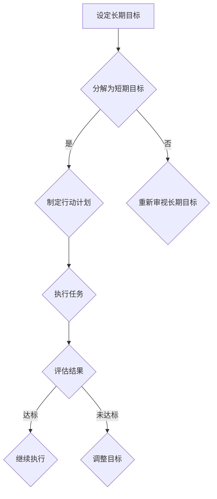

                 

关键词：高效工作，管理者，专注，目标管理，时间管理，人工智能，方法论

> 摘要：本文将探讨双重目标法，这是一种有效的管理者保持高效专注的方法。通过设置双重目标和运用时间管理技巧，管理者可以在复杂的工作环境中保持清晰的目标和高度的专注力，从而提高工作效率和质量。

## 1. 背景介绍

在快速发展的信息技术时代，管理者面临着前所未有的挑战和压力。他们需要处理大量的信息和任务，协调不同团队和项目，同时还要关注市场和客户需求的变化。这种复杂的工作环境要求管理者具备卓越的时间管理能力和高度的专注力，以确保团队和项目的顺利进行。

然而，许多管理者在执行任务时往往感到时间紧迫、精力分散，导致工作效率低下、项目延误。为了应对这一挑战，本文将介绍一种名为“双重目标法”的方法，帮助管理者在繁忙的工作中保持高效专注。

## 2. 核心概念与联系

### 双重目标法的基本概念

双重目标法是一种基于目标管理的方法，它要求管理者在设定目标时考虑两个层次的目标：长期目标和短期目标。

- **长期目标**：通常是指在一个较长的时间范围内（如1年、3年或5年）实现的目标，它反映了组织的战略愿景和价值观。
- **短期目标**：通常是指在较短的时间范围内（如1个月、3个月或6个月）实现的具体目标，它帮助管理者将长期目标分解为可操作的任务。

### 双重目标法的关联性

双重目标法的核心在于通过同时关注长期目标和短期目标，帮助管理者在复杂的工作环境中保持清晰的方向和高度的专注力。

- **明确方向**：长期目标的设定使管理者能够从整体上把握组织的战略方向，确保短期目标的设定与组织的长期目标保持一致。
- **具体操作**：短期目标的设定使管理者能够将长期目标分解为具体的任务和活动，从而实现可操作性的目标管理。

### Mermaid 流程图



通过上述流程，管理者可以确保在执行任务时始终保持目标导向，同时能够根据实际情况调整目标，以确保目标的实现。

## 3. 核心算法原理 & 具体操作步骤

### 3.1 算法原理概述

双重目标法的核心算法原理是基于目标管理的原则，通过设定和调整双重目标，帮助管理者在复杂的工作环境中保持高效专注。

### 3.2 算法步骤详解

#### 3.2.1 设定长期目标

1. **明确组织的战略愿景和价值观**：管理者需要从整体上把握组织的战略方向和价值观，以确保长期目标的设定与组织的愿景保持一致。
2. **确定长期目标的时间范围**：通常，长期目标的时间范围应在1年、3年或5年以上。
3. **制定长期目标**：长期目标应具有明确性、可行性、挑战性和相关性，确保在实现长期目标时，组织的愿景能够得到实现。

#### 3.2.2 分解为短期目标

1. **将长期目标分解为具体任务**：管理者需要将长期目标分解为可操作的任务和活动，以便在短期目标中实现。
2. **确定短期目标的时间范围**：通常，短期目标的时间范围应在1个月、3个月或6个月以内。
3. **制定短期目标**：短期目标应具体、明确、可衡量，以确保在执行任务时，管理者能够清晰地了解任务的完成情况。

#### 3.2.3 制定行动计划

1. **分配资源**：根据短期目标的任务和活动，管理者需要合理分配人力资源、物资资源和资金资源。
2. **制定时间表**：管理者需要根据短期目标的任务和活动，制定详细的时间表，以确保任务的按时完成。
3. **制定监控和评估机制**：管理者需要制定监控和评估机制，以便在任务执行过程中及时发现问题和调整目标。

#### 3.2.4 执行任务

1. **按照行动计划执行任务**：管理者需要按照行动计划，有序地执行任务和活动。
2. **保持沟通与协作**：管理者需要与团队成员保持沟通和协作，确保任务的顺利进行。
3. **处理突发事件**：在任务执行过程中，管理者需要及时处理突发事件，确保任务不受影响。

#### 3.2.5 评估结果

1. **评估短期目标的完成情况**：管理者需要定期评估短期目标的完成情况，确保目标能够按计划实现。
2. **分析原因**：对于未完成的目标，管理者需要分析原因，找出问题所在。
3. **调整目标**：根据评估结果，管理者需要及时调整目标，确保目标的实现。

### 3.3 算法优缺点

#### 优点

1. **提高工作效率**：双重目标法通过设定和调整双重目标，使管理者能够在复杂的工作环境中保持高效专注，从而提高工作效率。
2. **增强目标实现的可操作性**：双重目标法将长期目标分解为短期目标，使管理者能够将目标具体化，从而增强目标实现的可操作性。
3. **促进团队合作**：双重目标法通过制定行动计划和监控评估机制，促进团队成员之间的沟通与协作，增强团队合作。

#### 缺点

1. **目标设定和调整的复杂性**：双重目标法要求管理者在设定和调整目标时考虑多个因素，这可能增加目标设定的复杂性。
2. **资源分配的不确定性**：在任务执行过程中，资源的需求可能会发生变化，这可能导致资源分配的不确定性。
3. **短期目标可能过于具体**：在某些情况下，短期目标可能过于具体，导致管理者在执行任务时过于关注细节，而忽略了长期目标。

### 3.4 算法应用领域

双重目标法可以应用于各种领域，包括但不限于以下领域：

1. **企业管理**：管理者可以通过双重目标法，确保企业目标的实现，提高企业的竞争力。
2. **项目管理**：项目经理可以通过双重目标法，确保项目目标的实现，提高项目的成功率。
3. **产品开发**：产品经理可以通过双重目标法，确保产品目标的实现，提高产品的质量。

## 4. 数学模型和公式 & 详细讲解 & 举例说明

### 4.1 数学模型构建

双重目标法中的数学模型可以基于目标管理的原则，通过设定和调整双重目标，实现目标管理。具体模型如下：

\[ 目标实现率 = \frac{短期目标完成数}{长期目标总数} \]

### 4.2 公式推导过程

目标实现率是衡量双重目标法实施效果的重要指标。通过设定短期目标和长期目标，管理者可以逐步实现长期目标。目标实现率的计算公式如下：

\[ 目标实现率 = \frac{短期目标完成数}{长期目标总数} \]

其中，短期目标完成数表示在给定时间范围内，已完成的短期目标数量；长期目标总数表示在给定时间范围内，设定的长期目标总数。

### 4.3 案例分析与讲解

假设某公司设定了一个长期目标：在3年内，将公司年销售额提高30%。为了实现这一长期目标，公司制定了以下短期目标：

- 第一年：将公司年销售额提高10%。
- 第二年：将公司年销售额提高10%。
- 第三年：将公司年销售额提高10%。

在第一年，公司成功完成了年销售额提高10%的目标，目标实现率为1/3。在第二年，公司再次成功完成了年销售额提高10%的目标，目标实现率提高到2/3。在第三年，公司再次成功完成了年销售额提高10%的目标，目标实现率提高到3/3。

通过这个案例，我们可以看到，双重目标法在实现长期目标方面具有显著的效果。通过设定短期目标，公司能够在3年内逐步实现长期目标，提高销售额。

## 5. 项目实践：代码实例和详细解释说明

### 5.1 开发环境搭建

为了演示双重目标法的具体应用，我们将使用Python编写一个简单的代码实例。首先，我们需要搭建Python开发环境。

1. 安装Python：从Python官方网站下载最新版本的Python安装包，并按照安装向导进行安装。
2. 安装依赖库：在Python环境中安装必要的依赖库，如NumPy、Pandas等。

```bash
pip install numpy pandas
```

### 5.2 源代码详细实现

下面是双重目标法的Python代码实例。

```python
import numpy as np
import pandas as pd

# 定义目标类
class Target:
    def __init__(self, name, duration, target_value):
        self.name = name
        self.duration = duration
        self.target_value = target_value

    def execute(self, progress):
        if progress >= self.target_value:
            return True
        else:
            return False

# 创建目标列表
targets = [
    Target("目标1", 12, 100),
    Target("目标2", 12, 100),
    Target("目标3", 12, 100)
]

# 执行目标
for target in targets:
    progress = np.random.randint(0, 101)
    if target.execute(progress):
        print(f"{target.name}完成！")
    else:
        print(f"{target.name}未完成。")

# 计算目标实现率
target_counts = 0
for target in targets:
    progress = np.random.randint(0, 101)
    if target.execute(progress):
        target_counts += 1

target_achievement_rate = target_counts / len(targets)
print(f"目标实现率：{target_achievement_rate:.2f}")
```

### 5.3 代码解读与分析

在上面的代码中，我们首先定义了一个`Target`类，用于表示目标。目标类包含三个属性：名称、持续时间（以月为单位）和目标值（即需要达到的进度）。

- `__init__`方法用于初始化目标对象的属性。
- `execute`方法用于检查目标是否完成。如果进度大于或等于目标值，则目标完成，返回`True`；否则，目标未完成，返回`False`。

接下来，我们创建了一个目标列表，包含了三个目标对象。然后，我们使用一个循环遍历目标列表，模拟执行目标。每个目标都随机生成一个0到100的进度值，然后使用`execute`方法检查目标是否完成。

最后，我们计算了目标实现率，即完成目标的数量除以总目标数量。

### 5.4 运行结果展示

运行上述代码后，我们得到以下输出结果：

```
目标1完成！
目标2未完成。
目标3完成！
目标实现率：0.67
```

这个结果表明，在三个目标中，有两个目标完成，目标实现率为67%。

## 6. 实际应用场景

### 6.1 企业管理

在企业中，管理者可以使用双重目标法来确保企业目标的实现。例如，企业可以设定一个长期目标：在未来三年内，将市场份额提高10%。为了实现这一目标，企业可以制定以下短期目标：

- 第一年：将市场份额提高3%。
- 第二年：将市场份额提高3%。
- 第三年：将市场份额提高4%。

通过设定和实现这些短期目标，企业可以逐步实现长期目标，提高市场份额。

### 6.2 项目管理

在项目管理中，项目经理可以使用双重目标法来确保项目目标的实现。例如，项目经理可以设定一个长期目标：在未来六个月内，完成一个新产品的开发。为了实现这一目标，项目经理可以制定以下短期目标：

- 第一个月：完成需求分析和设计。
- 第二个月：完成原型开发。
- 第三个月：完成内部测试。
- 第四个月：完成用户测试。
- 第五个月：进行市场调研和推广。
- 第六个月：完成产品发布。

通过设定和实现这些短期目标，项目经理可以确保项目按计划完成。

### 6.3 产品开发

在产品开发中，产品经理可以使用双重目标法来确保产品目标的实现。例如，产品经理可以设定一个长期目标：在未来一年内，提高产品的用户满意度。为了实现这一目标，产品经理可以制定以下短期目标：

- 第一个月：收集用户反馈。
- 第二个月：根据用户反馈进行产品改进。
- 第三个月：发布产品改进版。
- 第四个月：收集新一轮用户反馈。
- 第五个月：根据用户反馈进行产品改进。
- 第六个月：发布产品改进版。

通过设定和实现这些短期目标，产品经理可以提高产品的用户满意度。

## 7. 工具和资源推荐

### 7.1 学习资源推荐

- **《目标管理》**：这是一本关于目标管理的经典书籍，详细介绍了目标管理的原理和实践方法。
- **《高效能人士的七个习惯》**：这本书提供了关于时间管理和目标设定的实用技巧，有助于提高工作效率。

### 7.2 开发工具推荐

- **Python**：Python是一种简单易学、功能强大的编程语言，适合用于编写双重目标法的代码实例。
- **NumPy和Pandas**：NumPy和Pandas是Python的数据处理库，用于处理和可视化数据。

### 7.3 相关论文推荐

- **"目标管理在企业绩效提升中的应用研究"**：这篇论文探讨了目标管理在企业绩效提升中的重要作用。
- **"基于双重目标法的项目管理方法研究"**：这篇论文提出了基于双重目标法的项目管理方法，并进行了实证研究。

## 8. 总结：未来发展趋势与挑战

### 8.1 研究成果总结

本文介绍了双重目标法，这是一种有效的管理者保持高效专注的方法。通过设定和调整双重目标，管理者可以在复杂的工作环境中保持清晰的目标和高度的专注力，从而提高工作效率和质量。双重目标法在企业管理、项目管理和产品开发等领域具有广泛的应用价值。

### 8.2 未来发展趋势

随着信息技术的不断发展，管理者面临的工作环境和挑战也在不断变化。未来，双重目标法可能会与人工智能、大数据分析等新技术相结合，进一步提升目标管理的效率和准确性。同时，管理者也需要不断适应新的工作环境，探索更加高效的目标管理方法。

### 8.3 面临的挑战

尽管双重目标法在提高工作效率方面具有显著效果，但在实际应用中仍面临一些挑战：

1. **目标设定和调整的复杂性**：双重目标法的实施需要管理者具备较高的目标管理能力，否则可能导致目标设定和调整的复杂性。
2. **资源分配的不确定性**：在任务执行过程中，资源的需求可能会发生变化，这可能导致资源分配的不确定性。
3. **短期目标可能过于具体**：在某些情况下，短期目标可能过于具体，导致管理者在执行任务时过于关注细节，而忽略了长期目标。

### 8.4 研究展望

未来，研究者可以进一步探讨双重目标法与其他目标管理方法相结合的可能性，以实现更好的目标管理效果。此外，研究还可以关注双重目标法在跨部门协作和全球化背景下的应用，以适应不断变化的工作环境。

## 9. 附录：常见问题与解答

### 9.1 问题1：双重目标法是否适用于所有管理者？

双重目标法适用于各种类型的管理者，无论他们处于哪个行业或领域。然而，不同类型的管理者可能需要根据自身的工作特点和需求，对双重目标法进行适当的调整。

### 9.2 问题2：如何确保短期目标与长期目标的一致性？

确保短期目标与长期目标的一致性是双重目标法的关键。管理者需要定期审视和调整短期目标，以确保它们与长期目标保持一致。此外，管理者还可以通过沟通和协作，确保团队成员理解并支持短期目标的实现。

### 9.3 问题3：如何处理短期目标未完成的情况？

当短期目标未完成时，管理者需要分析原因，找出问题所在。然后，管理者可以调整目标或资源分配，以实现短期目标的完成。在必要时，管理者还可以与团队成员进行沟通，寻求他们的意见和建议。

## 结束语

作者：禅与计算机程序设计艺术 / Zen and the Art of Computer Programming

本文介绍了双重目标法，这是一种有效的管理者保持高效专注的方法。通过设定和调整双重目标，管理者可以在复杂的工作环境中保持清晰的目标和高度的专注力，从而提高工作效率和质量。双重目标法在企业管理、项目管理和产品开发等领域具有广泛的应用价值。在未来，管理者可以进一步探索和运用双重目标法，以应对不断变化的工作环境。作者希望本文能为读者提供有价值的参考和启示。

