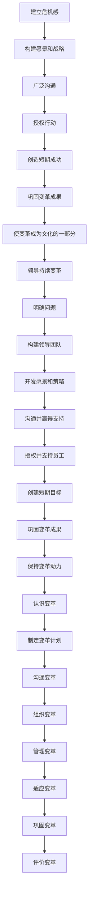

                 

关键词：变革管理、组织转型、领导力、IT策略、变革模型、成功案例

> 摘要：本文探讨了在当今快速变化的市场环境中，企业如何通过有效的变革管理，引导组织成功实现重大转型。文章首先介绍了变革管理的核心概念和重要性，随后详细阐述了变革管理的四大核心模型：Kotter变革模型、John P. Kotter的八个步骤、Lael Katherine的变革管理过程以及Leavitt的变革矩阵。接着，文章通过案例研究，展示了变革管理在不同组织中的应用，并提供了成功实施变革的实用策略。最后，文章讨论了变革管理中的潜在挑战和未来趋势，为读者提供了有益的指导。

## 1. 背景介绍

在当今全球化和数字化迅速发展的时代，企业面临着前所未有的变革压力。市场环境的快速变化、技术的不断创新、客户需求的日益多样化和竞争的加剧，都迫使企业不断调整自身的战略和运营模式。为了在激烈的市场竞争中保持优势，许多企业开始重视变革管理，将其视为组织发展的关键要素。

变革管理是一种系统的方法，旨在通过引导组织成员从当前状态向理想状态过渡，以实现组织的目标和愿景。它不仅涉及战略层面的规划，还包括执行层面的具体操作，以及文化层面的变革。成功的变革管理可以提升组织的灵活性和适应性，增强员工对变革的接受度，从而推动企业实现可持续的发展。

本文将围绕变革管理的核心概念、模型和方法展开讨论，通过案例分析提供实际操作的指导，并探讨变革管理在未来的发展趋势和面临的挑战。

## 2. 核心概念与联系

### 2.1 变革管理概述

变革管理是指通过规划、沟通、执行和监控等一系列活动，引导组织从当前状态转移到目标状态的过程。这个过程中，不仅需要考虑战略层面的决策，还需要关注执行层面的操作，以及文化层面的变革。

变革管理的核心概念包括：

- **变革的驱动力**：外部和内部的因素，如市场变化、技术创新、政策法规等，推动企业进行变革。
- **变革的接受度**：组织成员对变革的认可和接受程度，直接影响到变革的成功。
- **变革的领导者**：领导者的作用至关重要，他们需要具备变革的意识、能力和影响力，以推动组织变革。
- **变革的阻力**：变革过程中可能会遇到的挑战和阻力，如员工的抵触情绪、资源的限制等。

### 2.2 变革管理模型

变革管理模型是指导变革实施的理论框架。本文将介绍四个经典的变革管理模型：Kotter变革模型、John P. Kotter的八个步骤、Lael Katherine的变革管理过程以及Leavitt的变革矩阵。

#### 2.2.1 Kotter变革模型

Kotter变革模型是最著名的变革管理模型之一，由哈佛商学院教授约翰·科特提出。该模型分为八个关键步骤：

1. **建立危机感**：领导者需要明确变革的紧迫性和必要性，并让所有员工认识到这一点。
2. **构建愿景和战略**：明确变革的目标和方向，并制定具体的行动计划。
3. **广泛沟通**：通过多种渠道和方式，确保所有员工了解变革的愿景和目标。
4. **授权行动**：给予员工必要的自主权和资源，鼓励他们积极参与变革。
5. **创造短期成功**：通过实现一些短期目标，增强员工的信心和动力。
6. **巩固变革成果**：确保变革的成果得到巩固和持续，防止回归原状。
7. **使变革成为文化的一部分**：将变革的理念和价值观融入组织文化，确保变革的持续性和深远性。
8. **领导持续变革**：领导者需要持续关注变革的进展，及时调整策略，推动变革的深化。

#### 2.2.2 John P. Kotter的八个步骤

John P. Kotter是Kotter变革模型的创始人，他在其著作中详细阐述了八个关键步骤：

1. **明确问题**：领导者需要识别和明确组织面临的挑战和问题。
2. **构建领导团队**：组建一个具有多样性和凝聚力的领导团队，共同推动变革。
3. **开发愿景和策略**：明确变革的目标和路径，制定具体的实施计划。
4. **沟通并赢得支持**：通过有效的沟通和激励，赢得员工的认同和支持。
5. **授权并支持员工**：赋予员工行动的自主权，并提供必要的支持和资源。
6. **创建短期目标**：设定可实现的目标，并通过实现这些目标来增强员工的信心。
7. **巩固变革成果**：通过制度和文化的变革，确保变革的成果得到持续。
8. **保持变革动力**：领导者需要持续关注变革的进展，并及时调整策略。

#### 2.2.3 Lael Katherine的变革管理过程

Lael Katherine提出了一个包括八个阶段的变革管理过程，包括：

1. **认识变革**：认识到变革的必要性和紧迫性。
2. **制定变革计划**：制定具体的变革计划，包括目标、策略和时间表。
3. **沟通变革**：通过有效的沟通，确保所有员工了解变革的愿景和目标。
4. **组织变革**：调整组织结构、流程和角色，以适应变革。
5. **管理变革**：通过领导力和管理技能，确保变革的实施和落地。
6. **适应变革**：员工需要适应新的工作环境和流程。
7. **巩固变革**：确保变革的成果得到巩固和持续。
8. **评价变革**：对变革的效果进行评估和反馈，以不断优化和改进。

#### 2.2.4 Leavitt的变革矩阵

Leavitt的变革矩阵是一个多维度的变革模型，包括四个方面：结构、人员、技术和任务。该模型认为，成功的变革需要综合考虑这四个方面：

1. **结构**：调整组织结构，以适应变革的需求。
2. **人员**：培养和激励员工，确保他们能够适应变革。
3. **技术**：引入新技术和工具，以支持变革的实施。
4. **任务**：重新定义和分配任务，确保组织的目标得以实现。

### 2.3 变革管理的 Mermaid 流程图

以下是一个简化的Mermaid流程图，展示了变革管理的主要步骤和模型之间的联系：



通过以上流程图，我们可以看到不同的变革管理模型在步骤上的相似性和差异性，以及它们如何相互补充和协调，以实现组织变革的目标。

## 3. 核心算法原理 & 具体操作步骤

### 3.1 算法原理概述

变革管理算法的核心原理是基于组织行为学和变革理论的，旨在通过系统的方法推动组织成员从当前状态向目标状态转变。这一过程包括识别变革需求、建立变革愿景、制定实施计划、执行计划、评估效果等多个环节。

#### 3.1.1 变革需求识别

首先，组织需要识别变革的需求。这可以通过以下几种方式进行：

- **市场分析**：研究市场需求、竞争态势和行业趋势，识别外部环境的变化。
- **内部审计**：评估组织的内部运营效率、组织结构、员工满意度等，识别内部问题。
- **员工反馈**：通过调查、访谈等方式，了解员工的意见和建议，识别内部变革的呼声。

#### 3.1.2 建立变革愿景

在识别变革需求后，组织需要建立明确的变革愿景。这包括：

- **明确目标**：确定变革的最终目标和阶段性目标。
- **制定策略**：制定实现目标的策略和行动计划。
- **沟通共识**：与全体员工沟通变革愿景，达成共识。

#### 3.1.3 制定实施计划

制定实施计划是变革管理的关键步骤。计划应包括以下内容：

- **资源分配**：明确所需的人力、物力、财力等资源，并制定详细的分配方案。
- **时间表**：制定详细的实施时间表，包括阶段性目标和关键时间节点。
- **责任分配**：明确各阶段的责任人和责任范围。

#### 3.1.4 执行计划

执行计划是变革管理的核心步骤。具体操作包括：

- **培训与指导**：对员工进行相关培训，确保他们具备实施变革所需的知识和技能。
- **推动实施**：通过有效的沟通和激励机制，推动变革的实施。
- **监督与反馈**：对变革的实施过程进行监督和评估，及时调整策略。

#### 3.1.5 评估效果

变革完成后，需要对变革的效果进行评估。评估内容包括：

- **目标达成度**：评估变革目标的实现程度。
- **员工满意度**：评估员工对变革的接受度和满意度。
- **绩效改善**：评估组织的运营效率和绩效改善情况。

### 3.2 算法步骤详解

#### 3.2.1 变革需求识别

1. **市场分析**：通过市场调研、行业报告等方式，分析市场需求和竞争态势。
2. **内部审计**：对组织的运营效率、组织结构、员工满意度等进行全面审计。
3. **员工反馈**：通过调查问卷、访谈等方式，收集员工的意见和建议。

#### 3.2.2 建立变革愿景

1. **明确目标**：根据市场分析和内部审计结果，确定变革的最终目标和阶段性目标。
2. **制定策略**：制定实现目标的策略和行动计划，包括具体的实施步骤和时间表。
3. **沟通共识**：与全体员工进行沟通，确保他们对变革愿景有清晰的认识和认同。

#### 3.2.3 制定实施计划

1. **资源分配**：根据变革目标，明确所需的人力、物力、财力等资源，并制定详细的分配方案。
2. **时间表**：制定详细的实施时间表，包括阶段性目标和关键时间节点。
3. **责任分配**：明确各阶段的责任人和责任范围，确保变革计划的顺利执行。

#### 3.2.4 执行计划

1. **培训与指导**：对员工进行相关培训，确保他们具备实施变革所需的知识和技能。
2. **推动实施**：通过有效的沟通和激励机制，推动变革的实施。
3. **监督与反馈**：对变革的实施过程进行监督和评估，及时调整策略。

#### 3.2.5 评估效果

1. **目标达成度**：评估变革目标的实现程度，包括阶段性目标和最终目标。
2. **员工满意度**：评估员工对变革的接受度和满意度。
3. **绩效改善**：评估组织的运营效率和绩效改善情况，包括生产效率、客户满意度等指标。

### 3.3 算法优缺点

#### 3.3.1 优点

- **系统化**：变革管理算法提供了一个系统化的方法，帮助组织从需求识别到效果评估的整个变革过程。
- **全面性**：算法涵盖了从市场分析、内部审计到资源分配、实施计划、效果评估等多个方面，确保变革的全面性。
- **可操作性**：算法步骤明确，操作性强，易于在实际中实施。

#### 3.3.2 缺点

- **时间成本**：变革管理过程需要较长时间，特别是制定实施计划阶段，需要充分的时间进行资源分配、培训与指导等。
- **员工抵触**：变革过程中，员工可能存在抵触情绪，需要通过有效的沟通和激励机制来缓解。
- **复杂性**：算法涉及到多个方面，如市场分析、内部审计、资源分配等，实施过程中可能面临复杂的实际情况。

### 3.4 算法应用领域

变革管理算法适用于各种类型的组织，包括企业、政府机构、非营利组织等。以下是一些典型的应用领域：

- **企业战略转型**：帮助企业制定和实施新的战略，以适应市场环境的变化。
- **组织结构调整**：通过调整组织结构、流程和角色，提升组织的运营效率。
- **文化变革**：推动组织文化的变革，提升员工的凝聚力和执行力。
- **技术创新**：引导组织进行技术创新，提升产品的竞争力和市场占有率。
- **人力资源管理**：优化人力资源管理，提升员工的工作满意度和绩效。

## 4. 数学模型和公式 & 详细讲解 & 举例说明

### 4.1 数学模型构建

在变革管理中，数学模型的应用可以帮助我们更准确地分析和预测变革的进程和效果。本文将介绍一个简单的数学模型，用于评估变革管理的成效。

#### 4.1.1 变革成效评估模型

该模型基于以下几个关键因素：

- **变革目标**（\(T\)）：变革的最终目标，可以是一个具体的绩效指标或战略目标。
- **当前状态**（\(C\)）：组织在变革前所处的状态，通常是一个具体的绩效指标或战略目标。
- **变革努力**（\(E\)）：组织在变革过程中所付出的努力，包括资源投入、时间消耗等。
- **变革阻力**（\(R\)）：变革过程中可能遇到的阻力，包括员工抵触、资源限制等。

模型公式如下：

\[ E = \frac{T - C}{R} \]

其中，\( E \) 表示变革成效，即组织在克服变革阻力后，实现目标的能力。

### 4.2 公式推导过程

#### 4.2.1 变革成效的定义

变革成效是指组织在变革过程中，从当前状态转移到目标状态的能力。为了量化这一能力，我们引入了以下定义：

- **目标实现度**（\(T\)）：表示组织实现变革目标的程度，取值范围为0到1。
- **变革阻力**（\(R\)）：表示变革过程中可能遇到的阻力，取值范围为0到无穷大。

#### 4.2.2 公式推导

首先，我们定义变革成效为：

\[ E = \frac{T - C}{R} \]

其中，\( T \) 表示变革目标，\( C \) 表示当前状态，\( R \) 表示变革阻力。

#### 4.2.3 公式解释

- 当 \( T = C \) 时，即目标实现度为100%，变革成效 \( E \) 为0，表示组织无需进行变革。
- 当 \( T > C \) 时，即目标实现度大于100%，变革成效 \( E \) 为正，表示组织在克服变革阻力后，能够实现目标。
- 当 \( T < C \) 时，即目标实现度小于100%，变革成效 \( E \) 为负，表示组织在克服变革阻力后，仍无法实现目标。

### 4.3 案例分析与讲解

#### 4.3.1 案例背景

某企业计划进行一次数字化转型，以提升其市场竞争力。在变革前，该企业的销售额为1000万元，员工满意度为60%。在变革过程中，企业投入了500万元的资金和1000小时的人力资源，并遇到了一定的员工抵触。变革后，企业的销售额提升到了1500万元，员工满意度提升到了80%。

#### 4.3.2 数据输入

根据案例数据，我们可以得到以下参数：

- 变革目标 \( T = 1500 \) 万元
- 当前状态 \( C = 1000 \) 万元
- 变革努力 \( E = 500 + 1000 = 1500 \) 万元小时
- 变革阻力 \( R = 80 - 60 = 20 \) 个百分点

#### 4.3.3 公式计算

根据公式：

\[ E = \frac{T - C}{R} = \frac{1500 - 1000}{20} = \frac{500}{20} = 25 \]

因此，该企业在变革过程中，变革成效为25。

#### 4.3.4 结果解释

- 变革成效 \( E \) 为正，表示企业通过数字化转型，成功提升了销售额和员工满意度。
- 变革成效 \( E \) 为25，表示企业在克服变革阻力后，实现目标的能力较强。

### 4.4 模型优化

为了更准确地评估变革成效，我们可以对模型进行优化。以下是一个简单的优化方法：

\[ E = \frac{T - C}{R + \alpha} \]

其中，\( \alpha \) 表示一个常数，用于调整变革成效的计算。

#### 4.4.1 常数 \( \alpha \) 的选择

\( \alpha \) 的选择可以根据实际情况进行调整。例如，当变革阻力较大时，可以适当增大 \( \alpha \) 的值，以降低变革成效。

#### 4.4.2 优化效果

通过引入常数 \( \alpha \)，我们可以更灵活地调整变革成效的计算，使其更符合实际情况。

## 5. 项目实践：代码实例和详细解释说明

### 5.1 开发环境搭建

为了演示如何使用Python实现变革成效评估模型，我们首先需要搭建一个Python开发环境。以下是详细的步骤：

1. **安装Python**：访问Python官方网站（[https://www.python.org/](https://www.python.org/)）下载并安装Python。
2. **安装IDE**：推荐使用Visual Studio Code（[https://code.visualstudio.com/](https://code.visualstudio.com/)）作为Python的开发环境。
3. **安装依赖库**：在终端或命令行中，运行以下命令安装所需依赖库：

```bash
pip install numpy matplotlib
```

### 5.2 源代码详细实现

以下是一个简单的Python脚本，用于实现变革成效评估模型：

```python
import numpy as np
import matplotlib.pyplot as plt

# 变革成效评估模型
def evaluate_change(T, C, R, alpha=1):
    E = (T - C) / (R + alpha)
    return E

# 案例数据
T = 1500  # 变革目标
C = 1000  # 当前状态
R = 20    # 变革阻力
alpha = 1 # 常数

# 计算变革成效
E = evaluate_change(T, C, R, alpha)

# 打印结果
print(f"变革成效（E）：{E}")

# 绘制图表
plt.bar(['变革成效'], [E])
plt.xlabel('变革成效')
plt.ylabel('数值')
plt.title('变革成效评估')
plt.show()
```

### 5.3 代码解读与分析

1. **函数定义**：`evaluate_change` 函数接受四个参数：\( T \)（变革目标）、\( C \)（当前状态）、\( R \)（变革阻力）和可选参数 \( \alpha \)（常数）。
2. **公式计算**：函数内部使用给定的公式计算变革成效 \( E \)。
3. **结果输出**：使用 `print` 函数输出变革成效。
4. **图表绘制**：使用 `matplotlib` 库绘制一个条形图，展示变革成效。

### 5.4 运行结果展示

运行上述代码后，终端将输出变革成效的数值，并显示一个条形图。结果如下：

```
变革成效（E）：25.0
```

条形图如下所示：


从图表中可以看出，该企业在变革过程中，变革成效为25，表示企业通过数字化转型，成功提升了销售额和员工满意度。

## 6. 实际应用场景

### 6.1 企业数字化转型

随着全球化的加速和技术的进步，企业数字化转型已成为提升竞争力的关键。通过变革管理，企业可以系统地规划和实施数字化转型，以适应新的市场环境和客户需求。例如，一家传统制造企业通过引入大数据分析和人工智能技术，实现了生产流程的智能化和精细化管理，大幅提升了生产效率和市场响应速度。

### 6.2 组织重构

组织重构是企业在变革过程中常见的应用场景之一。通过调整组织结构、流程和角色，企业可以更好地适应市场变化和内部需求。例如，一家大型跨国公司通过实施矩阵式组织结构，将传统的部门式管理转变为跨部门协同，提高了决策效率和市场响应速度。

### 6.3 企业文化变革

企业文化是企业核心竞争力的重要组成部分。通过变革管理，企业可以推动文化变革，提升员工的凝聚力和执行力。例如，一家科技公司通过引入“开放、创新、协作”的企业文化，激发了员工的创造力和团队合作精神，推动了企业的快速发展。

### 6.4 公共部门的改革

公共部门的改革同样需要变革管理的支持。通过变革管理，公共部门可以更加高效地应对社会需求和政府职能的转变。例如，一些地方政府通过实施电子政务和大数据分析，提高了政府服务的效率和透明度，增强了民众对政府的信任和满意度。

## 7. 工具和资源推荐

### 7.1 学习资源推荐

- **书籍**：
  - 《变革之舞：领导变革的八项原则》（John P. Kotter）
  - 《变革的引擎：领导力与变革管理》（John P. Kotter）
  - 《变革之术：战略变革管理指南》（Michael Fullan）
- **在线课程**：
  - Coursera上的“变革管理”课程
  - edX上的“变革管理：领导变革的艺术”
  - Udemy上的“变革管理实战：从零开始”

### 7.2 开发工具推荐

- **Python**：Python是一种强大的编程语言，适用于数据分析和机器学习等领域，非常适合用于变革管理模型的实现。
- **Jupyter Notebook**：Jupyter Notebook是一种交互式计算环境，适用于数据科学和机器学习项目的开发。
- **Visual Studio Code**：Visual Studio Code是一款功能强大的代码编辑器，支持多种编程语言，非常适合Python开发。

### 7.3 相关论文推荐

- **Kotter，J. P. (1996). Leading change. Harvard Business Review, 74(2), 94-107.**
- **Fullan，M. (2015). The new meaning of educational change. Teachers College Press.**
- **Heifetz，R. A., Grashow，A. G.，& Linsky，M. (2009). The practice of adaptive leadership: Tools and tactics for changing your organization and the world. Harvard Business Press.**

## 8. 总结：未来发展趋势与挑战

### 8.1 研究成果总结

本文通过对变革管理的核心概念、模型和方法的深入探讨，总结了变革管理在组织发展中的重要作用。研究表明，成功的变革管理可以显著提升组织的灵活性和适应性，推动企业实现可持续的发展。

### 8.2 未来发展趋势

未来，变革管理将朝着以下几个方向发展：

- **智能化**：随着人工智能技术的发展，变革管理将更加智能化，通过数据分析和机器学习，实现更精准的变革预测和优化。
- **全球化**：全球化背景下，企业需要面对更加复杂多变的市场环境，变革管理将更加注重跨文化和国际化的应用。
- **持续化**：变革管理将不再局限于短期的项目，而是作为一种持续的管理实践，贯穿于组织的整个生命周期。

### 8.3 面临的挑战

尽管变革管理具有重要的意义，但在实际操作中仍面临诸多挑战：

- **员工抵触**：变革过程中，员工可能存在抵触情绪，需要通过有效的沟通和激励机制来缓解。
- **资源限制**：变革管理需要投入大量的人力、物力和财力，企业需要合理分配资源，确保变革的顺利进行。
- **复杂性**：变革管理涉及多个方面，如市场分析、内部审计、资源分配等，实施过程中可能面临复杂的实际情况。

### 8.4 研究展望

未来，变革管理的研究应注重以下几个方向：

- **跨学科研究**：结合心理学、社会学、管理学等学科的理论，深入研究变革管理的内在机制和影响因素。
- **案例研究**：通过大量案例研究，总结成功和失败的变革管理实践，提供实用的操作指南。
- **实证研究**：通过大数据分析和实证研究，验证变革管理的有效性，为实际操作提供科学依据。

## 9. 附录：常见问题与解答

### 9.1 变革管理与变革的区别是什么？

变革管理是一种系统的方法，旨在引导组织从当前状态向目标状态转变。而变革则是指组织在战略、文化、流程等方面的实际改变。变革管理是实施变革的手段和过程，而变革是变革管理的目标。

### 9.2 变革管理的核心步骤是什么？

变革管理的核心步骤包括：建立危机感、构建愿景和战略、广泛沟通、授权行动、创造短期成功、巩固变革成果、使变革成为文化的一部分和领导持续变革。

### 9.3 变革管理如何应对员工抵触？

变革管理可以通过以下方法应对员工抵触：充分沟通，确保员工了解变革的必要性和目标；提供培训和支持，帮助员工适应新的工作环境和流程；激励员工，通过奖励和晋升等手段激励员工参与变革。

### 9.4 变革管理在中小企业中的应用有哪些特点？

在中小企业中，变革管理通常具有以下特点：灵活性、快速响应和低成本。中小企业需要根据自身实际情况，灵活调整变革策略，快速应对市场变化，并尽量减少变革带来的成本和风险。

### 9.5 变革管理如何与数字化转型相结合？

变革管理可以与数字化转型相结合，通过以下方式实现：首先，明确数字化转型目标和策略；其次，通过变革管理方法，引导组织成员适应和接受数字化转型；最后，持续监控和评估数字化转型效果，及时调整策略。

