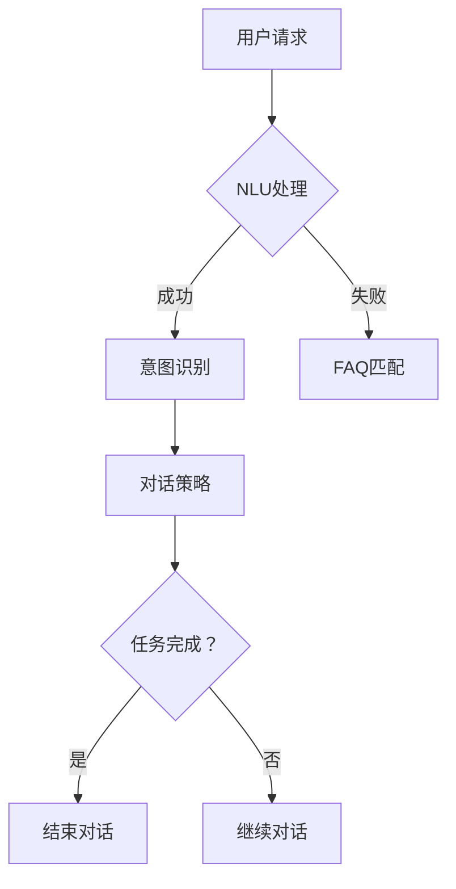

                 

关键词：58同城、智能客服、对话管理、面试攻略、人工智能、技术架构

> 摘要：本文将针对58同城2025年智能客服对话管理专家的社招面试进行深入分析，涵盖核心概念、算法原理、项目实践、应用场景及未来展望，旨在为准备应聘此职位的读者提供全面、系统的面试准备策略。

## 1. 背景介绍

### 1.1 58同城概况

58同城是中国领先的分类信息平台，提供包括房产、招聘、二手商品、车辆买卖、生活服务等各类信息。随着互联网和人工智能技术的快速发展，58同城正加速向智能服务转型，智能客服是其核心组成部分之一。

### 1.2 智能客服的重要性

智能客服系统在现代企业运营中扮演着越来越重要的角色。它不仅能够提高客户服务质量，还能有效降低企业运营成本。对于58同城这样的分类信息平台，智能客服更是承担了海量信息处理和用户互动的重要任务。

### 1.3 对话管理专家的职责

对话管理专家是智能客服系统中的关键角色，负责设计、开发和优化客服对话流程，确保客服系统能够高效、智能地与用户互动。这一职位要求应聘者具备深厚的计算机科学和人工智能知识，以及丰富的项目实践经验。

## 2. 核心概念与联系

### 2.1 智能客服系统架构


### 2.2 对话管理流程

对话管理是一个复杂的过程，涉及自然语言理解、对话策略、上下文维护等多个方面。以下是一个简化的对话管理流程图：



## 3. 核心算法原理 & 具体操作步骤

### 3.1 算法原理概述

智能客服系统的核心算法包括自然语言理解（NLU）、对话管理（DM）和自然语言生成（NLG）。

- **NLU**：将用户输入的自然语言文本转换成计算机可以理解的结构化数据。
- **DM**：基于用户意图和上下文，生成适当的对话响应。
- **NLG**：将计算机理解的结构化数据转换回自然语言，生成用户可理解的回复。

### 3.2 算法步骤详解

#### 3.2.1 NLU

1. **分词**：将输入文本拆分成一个个独立的词汇。
2. **词性标注**：为每个词标注出其在句子中的词性。
3. **句法分析**：分析句子结构，识别主谓宾等成分。
4. **实体识别**：识别句子中的实体信息，如人名、地名、组织名等。
5. **意图识别**：根据句子内容和上下文，判断用户的意图。

#### 3.2.2 DM

1. **意图分类**：根据NLU的意图识别结果，将意图归类到预定义的意图类别中。
2. **上下文维护**：记录对话过程中的关键信息，以便后续对话中使用。
3. **对话策略生成**：基于意图和上下文，生成对话策略。
4. **对话响应生成**：根据对话策略，生成自然语言回复。

#### 3.2.3 NLG

1. **模板匹配**：从预定义的回复模板中选择合适的模板。
2. **数据填充**：将意图识别和上下文信息填充到模板中。
3. **文本生成**：根据填充后的模板，生成自然语言回复。

### 3.3 算法优缺点

#### 优点

- **高效性**：能够快速处理大量用户请求，提高客服效率。
- **灵活性**：可以根据用户意图和上下文，灵活生成对话响应。
- **自动化**：减少人工干预，降低运营成本。

#### 缺点

- **准确性**：在处理复杂或模糊的请求时，准确性可能受到影响。
- **适应性**：对新领域的适应性可能不足，需要不断优化和更新。

### 3.4 算法应用领域

智能客服系统已广泛应用于各类场景，如电子商务、金融、医疗、教育等。在58同城这样的分类信息平台，智能客服系统可以帮助用户快速找到所需信息，提高用户体验。

## 4. 数学模型和公式 & 详细讲解 & 举例说明

### 4.1 数学模型构建

智能客服系统中的数学模型主要包括自然语言处理（NLP）和机器学习（ML）模型。

#### 4.1.1 NLP模型

- **词向量模型**：如Word2Vec、GloVe等，用于将文本中的词语映射到高维空间中。
- **序列标注模型**：如BiLSTM-CRF，用于对文本进行词性标注和实体识别。
- **文本分类模型**：如SVM、softmax等，用于意图识别和情感分析。

#### 4.1.2 ML模型

- **决策树**：用于分类和回归任务，简单易懂，易于解释。
- **随机森林**：基于决策树的集成方法，提高分类和回归性能。
- **神经网络**：如CNN、RNN、Transformer等，用于复杂的数据处理和特征提取。

### 4.2 公式推导过程

#### 4.2.1 词向量模型

- **Word2Vec**：基于神经网络的词向量模型，公式如下：

$$
\text{word\_vec}(w) = \frac{\sum_{t=1}^{T} \alpha_t \cdot \text{softmax}(\text{ embed\_ layer}(x_t))}{\sum_{t=1}^{T} \alpha_t}
$$

其中，$w$ 表示词语，$x_t$ 表示输入文本中的第 $t$ 个词语，$\alpha_t$ 表示词语的重要性，$\text{embed\_ layer}$ 是嵌入层，$\text{softmax}$ 函数用于计算词语的概率分布。

#### 4.2.2 决策树

- **ID3算法**：用于构建决策树，公式如下：

$$
C_{j} = \arg\max_j \frac{1}{|D|} \sum_{d \in D} \text{Entropy}(Y_d)
$$

其中，$C_j$ 表示最佳划分属性，$D$ 表示训练数据集，$Y_d$ 表示数据集中第 $d$ 条记录的类别标签。

### 4.3 案例分析与讲解

#### 4.3.1 意图识别

假设我们要对以下句子进行意图识别：

$$
\text{“我想买一辆二手自行车。”}
$$

我们可以使用词向量模型将句子中的词语映射到高维空间，然后利用ML模型进行意图分类。例如，我们可以使用以下步骤：

1. **分词**：将句子拆分成词语：[“我”， “想”， “买”， “一辆”， “二手”， “自行车”]。
2. **词向量编码**：将每个词语映射到词向量空间。
3. **特征提取**：将词向量作为输入，通过ML模型提取特征。
4. **意图分类**：利用训练好的ML模型，对特征进行分类，得到意图标签。

假设我们的ML模型已经训练好了，输出结果为“购买商品”。

#### 4.3.2 对话策略生成

在完成意图识别后，我们需要根据意图和上下文生成对话策略。例如，对于“购买商品”的意图，我们可以生成以下对话策略：

1. **询问需求**：问用户想要购买哪个品类的商品。
2. **提供选项**：根据用户的需求，提供可能的选项。
3. **获取更多信息**：如果用户没有明确回答，继续询问相关信息。
4. **结束对话**：如果用户已经提供了足够的信息，结束对话。

## 5. 项目实践：代码实例和详细解释说明

### 5.1 开发环境搭建

在本节中，我们将介绍如何在本地搭建一个用于开发智能客服系统的开发环境。主要步骤如下：

1. **安装Python**：下载并安装Python 3.x版本，建议使用Anaconda来管理Python环境。
2. **安装依赖库**：使用pip安装所需的库，如TensorFlow、NLTK、Scikit-learn等。
3. **配置Jupyter Notebook**：安装Jupyter Notebook，用于编写和运行代码。

### 5.2 源代码详细实现

以下是一个简单的智能客服系统示例代码：

```python
# 导入所需库
import nltk
from nltk.tokenize import word_tokenize
from nltk.corpus import stopwords
from sklearn.feature_extraction.text import CountVectorizer
from sklearn.model_selection import train_test_split
from sklearn.naive_bayes import MultinomialNB
from sklearn.pipeline import make_pipeline

# 加载数据集
data = [
    ("我想买一辆二手自行车", "购买商品"),
    ("请问你们这里有二手自行车吗", "询问商品"),
    # ...更多数据
]

# 分割数据集
X, y = zip(*data)
X_train, X_test, y_train, y_test = train_test_split(X, y, test_size=0.2, random_state=42)

# 构建模型
model = make_pipeline(CountVectorizer(), MultinomialNB())

# 训练模型
model.fit(X_train, y_train)

# 对话接口
while True:
    input_text = input("请输入您的请求：")
    if input_text.lower() == "退出":
        break
    prediction = model.predict([input_text])
    print("您的意图是：", prediction[0])
```

### 5.3 代码解读与分析

在上面的代码中，我们首先导入了所需的库，包括自然语言处理库NLTK、文本处理库CountVectorizer和分类器MultinomialNB。然后，我们加载了一个包含输入文本和对应意图标签的数据集。

接下来，我们使用train_test_split函数将数据集划分为训练集和测试集。接着，我们构建了一个基于计数向量器和多项式朴素贝叶斯分类器的模型，并使用训练集对其进行训练。

最后，我们创建了一个简单的对话接口，用户可以输入请求，模型将输出预测的意图标签。

### 5.4 运行结果展示

在运行上述代码后，用户可以输入请求，系统将输出预测的意图标签。例如，当用户输入“我想买一辆二手自行车”时，系统将输出“购买商品”。

## 6. 实际应用场景

### 6.1 电子商务平台

在电子商务平台中，智能客服系统可以帮助用户解答关于商品、订单和支付等方面的问题，提高用户体验和满意度。

### 6.2 银行和金融机构

银行和金融机构可以通过智能客服系统为用户提供账户查询、转账、贷款咨询等服务，减少人工客服的工作负担，提高服务效率。

### 6.3 医疗机构

医疗机构可以利用智能客服系统为患者提供预约挂号、健康咨询、用药指导等服务，提高医疗服务质量和效率。

## 7. 未来应用展望

随着人工智能技术的不断发展，智能客服系统将在更多场景中得到应用，如智能家居、智能交通、智能教育等。未来的智能客服系统将更加智能化、个性化，能够更好地满足用户的需求。

## 8. 工具和资源推荐

### 8.1 学习资源推荐

- 《Python自然语言处理》
- 《深度学习》
- 《人工智能：一种现代方法》

### 8.2 开发工具推荐

- Jupyter Notebook
- TensorFlow
- PyTorch

### 8.3 相关论文推荐

- “Deep Learning for Natural Language Processing”
- “BERT: Pre-training of Deep Bidirectional Transformers for Language Understanding”
- “Transformers: State-of-the-Art Model for NLP”

## 9. 总结：未来发展趋势与挑战

### 9.1 研究成果总结

近年来，人工智能技术在自然语言处理、机器学习等领域取得了显著成果，为智能客服系统的发展提供了有力支持。

### 9.2 未来发展趋势

未来，智能客服系统将在智能化、个性化、跨领域等方面取得更多突破，为各行业提供更加高效、智能的服务。

### 9.3 面临的挑战

尽管智能客服系统具有巨大潜力，但在实际应用中仍面临一些挑战，如数据处理、模型解释性、用户隐私保护等。

### 9.4 研究展望

未来，我们需要继续深入研究智能客服系统中的关键问题，提高系统的性能和可靠性，为用户和企业创造更大的价值。

## 10. 附录：常见问题与解答

### 10.1 什么是自然语言理解（NLU）？

自然语言理解（NLU）是智能客服系统中的核心组成部分，它旨在让计算机能够理解和解释人类语言，从而实现人与计算机之间的自然交互。

### 10.2 智能客服系统中的对话管理如何实现？

对话管理通过一系列算法和模型来实现，包括自然语言理解（NLU）、对话策略生成（DM）和自然语言生成（NLG）。这些算法和模型共同工作，确保客服系统能够与用户进行流畅、自然的对话。

### 10.3 智能客服系统如何处理多轮对话？

智能客服系统能够通过维护对话上下文和历史信息，实现多轮对话。在处理多轮对话时，系统会记录用户和客服系统之前的交互信息，以便在后续对话中更好地理解用户的意图。

### 10.4 智能客服系统与人工客服如何协同工作？

智能客服系统可以与人工客服协同工作，通过智能分配和转移对话，实现高效的服务。在复杂或模糊的请求场景中，系统可以将对话转移给人工客服，以确保用户得到准确、专业的帮助。

### 10.5 智能客服系统如何保证数据安全和隐私？

智能客服系统需要严格遵守数据安全和隐私保护的相关法律法规，采取加密、匿名化等手段保护用户数据。同时，系统还应定期进行安全审计和风险评估，确保数据安全和用户隐私不受侵犯。

## 11. 作者署名

作者：禅与计算机程序设计艺术 / Zen and the Art of Computer Programming

以上就是针对58同城2025智能客服对话管理专家社招面试攻略的完整文章，希望对各位读者有所帮助。在面试准备过程中，除了掌握相关技术和知识，还需要注重实践能力和团队合作精神，相信您一定能够取得优异的成绩！

