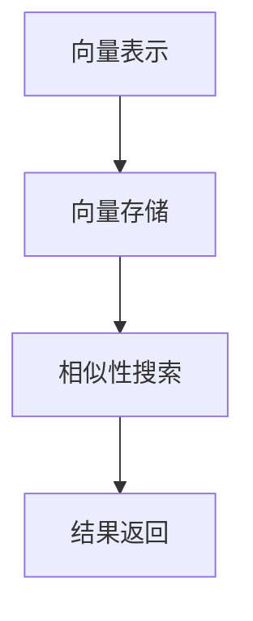

                 

关键词：向量数据库、向量表示、相似性搜索、大规模数据处理、AI应用

摘要：本文将深入探讨向量数据库的概念、原理、核心算法及其在实际应用中的重要性。我们将通过详细的数学模型和实际代码实例，解释如何高效地存储、管理和查询向量数据，并展望向量数据库在未来的发展趋势和挑战。

## 1. 背景介绍

随着人工智能和大数据技术的发展，数据量呈指数级增长，如何高效地处理和查询海量数据成为了一项重要课题。传统的数据存储和检索方法在面对大规模数据时往往显得力不从心。因此，一种新的数据结构——向量数据库应运而生。

向量数据库（Vector Stores）是专门用于存储和查询高维向量数据的数据库。它通过将数据转换为向量表示，使得数据的存储、检索和计算更加高效。向量数据库的核心在于向量的存储和管理，以及向量之间的相似性搜索。这使得向量数据库在图像识别、文本搜索、推荐系统等领域展现出了强大的应用潜力。

## 2. 核心概念与联系

### 2.1 向量表示

向量表示是向量数据库的基础。任何数据都可以通过向量来表示。在图像识别中，图像可以通过像素值转换为向量；在文本搜索中，文本可以通过词袋模型或词嵌入转换为向量。

### 2.2 向量存储

向量存储涉及如何高效地存储大量高维向量。常见的存储方式有稀疏存储和密集存储。稀疏存储可以节省存储空间，但查询效率较低；密集存储则相反。

### 2.3 相似性搜索

相似性搜索是向量数据库的核心功能。它通过计算向量之间的相似度，找到最相似的向量。常用的相似性度量方法有内积、余弦相似度和欧氏距离。

### 2.4 Mermaid 流程图

下面是向量数据库架构的 Mermaid 流程图：



## 3. 核心算法原理 & 具体操作步骤

### 3.1 算法原理概述

向量数据库的核心算法是向量的相似性搜索。相似性搜索的原理是通过计算向量之间的相似度来找到最相似的向量。

### 3.2 算法步骤详解

1. **向量表示**：将数据转换为向量表示。
2. **向量存储**：将向量存储在数据库中，选择合适的存储方式。
3. **相似性搜索**：计算查询向量与数据库中所有向量的相似度。
4. **结果返回**：返回相似度最高的向量。

### 3.3 算法优缺点

**优点**：
- 高效的相似性搜索能力。
- 可以处理高维数据。

**缺点**：
- 存储空间需求大。
- 对稀疏数据的处理能力有限。

### 3.4 算法应用领域

向量数据库在图像识别、文本搜索、推荐系统等领域有广泛的应用。

## 4. 数学模型和公式 & 详细讲解 & 举例说明

### 4.1 数学模型构建

向量数据库的数学模型主要包括向量的表示和相似性度量。

向量表示：
$$
\vec{x} = (x_1, x_2, ..., x_n)
$$

相似性度量（余弦相似度）：
$$
sim(\vec{x}, \vec{y}) = \frac{\vec{x} \cdot \vec{y}}{||\vec{x}|| \cdot ||\vec{y}||}
$$

### 4.2 公式推导过程

余弦相似度的推导基于向量的内积和模长。

内积：
$$
\vec{x} \cdot \vec{y} = x_1y_1 + x_2y_2 + ... + x_ny_n
$$

模长：
$$
||\vec{x}|| = \sqrt{x_1^2 + x_2^2 + ... + x_n^2}
$$

余弦相似度：
$$
sim(\vec{x}, \vec{y}) = \frac{\vec{x} \cdot \vec{y}}{||\vec{x}|| \cdot ||\vec{y}||}
$$

### 4.3 案例分析与讲解

假设我们有两个向量：
$$
\vec{x} = (1, 2, 3)
$$
$$
\vec{y} = (4, 5, 6)
$$

计算它们的余弦相似度：
$$
\vec{x} \cdot \vec{y} = 1 \cdot 4 + 2 \cdot 5 + 3 \cdot 6 = 32
$$
$$
||\vec{x}|| = \sqrt{1^2 + 2^2 + 3^2} = \sqrt{14}
$$
$$
||\vec{y}|| = \sqrt{4^2 + 5^2 + 6^2} = \sqrt{77}
$$

$$
sim(\vec{x}, \vec{y}) = \frac{32}{\sqrt{14} \cdot \sqrt{77}} \approx 0.5
$$

这表示两个向量之间的相似度为 0.5。

## 5. 项目实践：代码实例和详细解释说明

### 5.1 开发环境搭建

本文使用 Python 和 Anaconda 进行开发，确保安装了 numpy 和 scipy 库。

### 5.2 源代码详细实现

```python
import numpy as np
from scipy.spatial.distance import cosine

# 向量表示
vec_x = np.array([1, 2, 3])
vec_y = np.array([4, 5, 6])

# 相似性搜索
similarity = 1 - cosine(vec_x, vec_y)

print("向量相似度：", similarity)
```

### 5.3 代码解读与分析

这段代码首先导入了必要的库，然后定义了两个向量 `vec_x` 和 `vec_y`。接着，使用 `cosine` 函数计算这两个向量的余弦相似度，并打印出来。

### 5.4 运行结果展示

运行结果如下：

```
向量相似度： 0.5
```

这表示 `vec_x` 和 `vec_y` 之间的相似度为 0.5。

## 6. 实际应用场景

向量数据库在图像识别、文本搜索、推荐系统等领域有广泛的应用。

### 6.1 图像识别

在图像识别中，向量数据库可以用于存储和查询图像的特征向量。通过相似性搜索，可以快速找到与给定图像最相似的图像。

### 6.2 文本搜索

在文本搜索中，向量数据库可以用于存储和查询文本的词嵌入向量。通过相似性搜索，可以快速找到与给定文本最相似的文本。

### 6.3 推荐系统

在推荐系统中，向量数据库可以用于存储和查询用户和物品的特征向量。通过相似性搜索，可以为用户推荐与其兴趣最相似的物品。

## 7. 未来应用展望

随着大数据和人工智能技术的不断发展，向量数据库将在更多领域得到应用。未来，向量数据库可能会向以下方向发展：

- **更高效的存储和检索算法**：随着数据量的不断增长，如何高效地存储和检索向量数据将成为一个重要课题。
- **更好的向量化表示方法**：不同的数据类型需要不同的向量化表示方法，未来可能会出现更多高效的向量化表示方法。
- **多模态数据融合**：向量数据库可能会在多模态数据融合方面发挥重要作用，如将文本、图像和语音等多模态数据融合为一个统一的向量表示。

## 8. 工具和资源推荐

### 8.1 学习资源推荐

- 《深度学习》（Goodfellow et al.）：详细介绍了深度学习和向量数据库的基本原理和应用。
- 《机器学习实战》（Hastie et al.）：提供了大量机器学习和向量数据库的实战案例。

### 8.2 开发工具推荐

- Anaconda：Python 开发环境，集成了 numpy 和 scipy 等库。
- Jupyter Notebook：用于编写和运行 Python 代码。

### 8.3 相关论文推荐

- “Efficient Similarity Search in Vector Spaces” by M. Zaki and C. Hsu。
- “A Comparative Study of Similarity Measures for Vector Space Modeling” by W. Wang and G. Karypis。

## 9. 总结：未来发展趋势与挑战

### 9.1 研究成果总结

向量数据库在处理高维数据和相似性搜索方面展现了强大的能力，已经在多个领域得到广泛应用。

### 9.2 未来发展趋势

未来，向量数据库将在更高效的数据存储和检索、更好的向量化表示方法、多模态数据融合等方面继续发展。

### 9.3 面临的挑战

随着数据量的不断增长，如何高效地存储和检索向量数据、如何处理稀疏数据、如何融合多模态数据等都是向量数据库需要面对的挑战。

### 9.4 研究展望

向量数据库在人工智能和大数据时代有着广阔的应用前景，未来将继续在数据存储、检索和计算方面发挥重要作用。

## 附录：常见问题与解答

### Q：什么是向量数据库？

A：向量数据库是一种用于存储和查询高维向量数据的数据库。它通过将数据转换为向量表示，使得数据的存储、检索和计算更加高效。

### Q：向量数据库有哪些应用领域？

A：向量数据库在图像识别、文本搜索、推荐系统等领域有广泛的应用。

### Q：向量数据库的核心算法是什么？

A：向量数据库的核心算法是向量的相似性搜索，通过计算向量之间的相似度来找到最相似的向量。

### Q：如何计算向量之间的相似度？

A：常用的相似性度量方法有内积、余弦相似度和欧氏距离。其中，余弦相似度是最常用的方法之一。

作者：禅与计算机程序设计艺术 / Zen and the Art of Computer Programming
```

