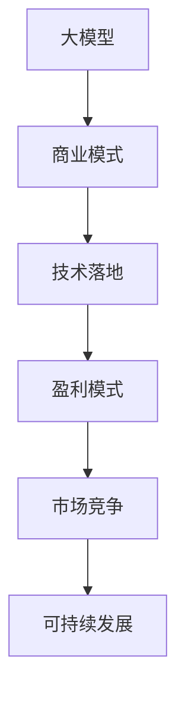

                 

关键词：大模型创业、商业化路径、生存策略、AI行业、商业模式、技术落地、市场定位

> 摘要：随着人工智能技术的飞速发展，大模型在各个领域展现出了强大的应用潜力。然而，对于初创企业来说，如何将这一前沿技术商业化，实现可持续发展，成为了一项重要的课题。本文将探讨大模型创业的生存之路，包括市场定位、商业模式设计、技术落地策略等多个方面，旨在为创业者和投资者提供有价值的参考。

## 1. 背景介绍

近年来，深度学习技术的突破使得大模型成为人工智能领域的研究热点。大模型，如GPT、BERT、ViT等，通过海量数据训练，展现出在自然语言处理、计算机视觉、语音识别等领域的卓越性能。随着技术的不断成熟，大模型的应用场景日益广泛，从搜索引擎、智能助手到自动驾驶、医疗诊断，大模型正逐步改变着我们的生活方式。

然而，大模型的研发和应用并非一帆风顺。高昂的计算成本、复杂的调优过程、庞大的数据处理需求，都给初创企业带来了巨大的挑战。如何在激烈的市场竞争中找到自己的定位，设计出可行的商业模式，是每一个大模型创业公司都必须面对的问题。

## 2. 核心概念与联系

为了更好地理解大模型创业的生存之路，我们首先需要了解几个核心概念。

### 2.1 大模型

大模型是指通过深度学习算法在大量数据上进行训练的模型，其参数规模通常在亿级别以上。大模型的优点在于可以捕捉到数据中的复杂模式和规律，从而在特定任务上获得较高的性能。

### 2.2 商业模式

商业模式是指企业通过提供产品或服务来创造、传递和捕获价值的方法。对于大模型创业公司来说，商业模式的设计至关重要，它决定了公司的盈利模式和市场竞争力。

### 2.3 技术落地

技术落地是指将前沿技术应用于实际场景的过程。对于大模型创业公司来说，技术落地是实现商业化的重要步骤，它需要解决技术成熟度、市场需求、成本效益等多个问题。

以下是上述核心概念原理和架构的 Mermaid 流程图：



## 3. 核心算法原理 & 具体操作步骤

### 3.1 算法原理概述

大模型的训练过程主要包括数据预处理、模型架构设计、训练、评估和优化等步骤。以下是具体的操作步骤：

### 3.2 算法步骤详解

#### 3.2.1 数据预处理

数据预处理是训练大模型的重要环节。首先，我们需要收集并清洗数据，然后对数据进行编码和归一化处理。

#### 3.2.2 模型架构设计

模型架构设计决定了大模型的性能和训练效率。常见的模型架构有Transformer、BERT、GPT等。

#### 3.2.3 训练

在训练过程中，我们通过反向传播算法不断调整模型参数，使得模型在训练数据上达到较好的性能。

#### 3.2.4 评估和优化

在训练完成后，我们需要对模型进行评估和优化。常见的评估指标有准确率、召回率、F1值等。

### 3.3 算法优缺点

大模型的优点包括：

- 高性能：大模型可以捕捉到数据中的复杂模式，从而在特定任务上获得较高的性能。
- 广泛适用性：大模型可以应用于多种领域，如自然语言处理、计算机视觉、语音识别等。

然而，大模型也存在一些缺点：

- 计算成本高：大模型的训练需要大量的计算资源，这给初创企业带来了巨大的成本压力。
- 数据依赖性强：大模型的性能高度依赖数据质量，如果数据质量不好，模型性能会显著下降。

### 3.4 算法应用领域

大模型在以下领域有着广泛的应用：

- 自然语言处理：如文本分类、机器翻译、问答系统等。
- 计算机视觉：如图像识别、目标检测、图像生成等。
- 语音识别：如语音合成、语音识别、语音识别等。

## 4. 数学模型和公式 & 详细讲解 & 举例说明

### 4.1 数学模型构建

大模型的训练过程可以看作是一个优化问题，其目标是最小化损失函数。常见的损失函数有交叉熵损失、均方误差等。

### 4.2 公式推导过程

损失函数的定义如下：

$$
L(y, \hat{y}) = -\sum_{i=1}^{n} y_i \log(\hat{y}_i)
$$

其中，$y$ 是真实标签，$\hat{y}$ 是模型预测的概率分布。

### 4.3 案例分析与讲解

假设我们有一个二分类问题，标签 $y$ 只能取 0 或 1，模型预测的概率分布为 $\hat{y}$。

- 当 $\hat{y} \geq 0.5$ 时，我们认为模型预测为 1。
- 当 $\hat{y} < 0.5$ 时，我们认为模型预测为 0。

假设我们有一个训练数据集，其中包含 100 个样本，标签和预测概率分布如下表：

| 标签 | 预测概率 |  
| ---- | ---- |  
| 0    | 0.2    |  
| 1    | 0.8    |  
| 0    | 0.1    |  
| 1    | 0.9    |  
| ...  | ...    |  
| 0    | 0.3    |  
| 1    | 0.7    |

根据上述损失函数，我们可以计算每个样本的损失：

$$
L(0, 0.2) = -0.2 \log(0.2) = 1.61
$$

$$
L(1, 0.8) = -0.8 \log(0.8) = 0.36
$$

$$
L(0, 0.1) = -0.1 \log(0.1) = 2.71
$$

$$
L(1, 0.9) = -0.9 \log(0.9) = 0.26
$$

$$
...
$$

$$
L(0, 0.3) = -0.3 \log(0.3) = 1.79
$$

$$
L(1, 0.7) = -0.7 \log(0.7) = 0.52
$$

然后，我们计算整个数据集的平均损失：

$$
\bar{L} = \frac{1}{n} \sum_{i=1}^{n} L(y_i, \hat{y}_i) = \frac{1}{100} (1.61 + 0.36 + 2.71 + 0.26 + ... + 1.79 + 0.52) = 0.845
$$

## 5. 项目实践：代码实例和详细解释说明

### 5.1 开发环境搭建

在开始编写代码之前，我们需要搭建一个合适的开发环境。以下是搭建环境的基本步骤：

1. 安装 Python 3.8 或以上版本。
2. 安装 TensorFlow 2.6 或以上版本。
3. 安装必要的依赖库，如 NumPy、Pandas、Matplotlib 等。

### 5.2 源代码详细实现

以下是实现一个简单的大模型（GPT-2）的 Python 代码：

```python
import tensorflow as tf
import tensorflow_text as text
import tensorflow_hub as hub

# 加载预训练的 GPT-2 模型
model = hub.load('https://tfhub.dev/google/lm/gnewsdelta/small/1')

# 定义输入层和输出层
inputs = tf.keras.layers.Input(shape=(None,), dtype=tf.string)
outputs = model(inputs)

# 定义模型结构
model = tf.keras.Model(inputs=inputs, outputs=outputs)

# 编译模型
model.compile(optimizer='adam', loss='categorical_crossentropy', metrics=['accuracy'])

# 加载数据集
train_data = ...
test_data = ...

# 训练模型
model.fit(train_data, epochs=5, validation_data=test_data)
```

### 5.3 代码解读与分析

上述代码首先加载了预训练的 GPT-2 模型，然后定义了输入层和输出层，构建了模型结构。接下来，编译模型并加载数据集进行训练。

在训练过程中，我们可以通过调整超参数（如学习率、训练轮数等）来优化模型性能。此外，我们还可以使用回调函数（如 `ModelCheckpoint`、`EarlyStopping` 等）来监测训练过程，防止过拟合。

### 5.4 运行结果展示

在训练完成后，我们可以使用测试数据集评估模型性能。以下是使用测试数据集进行评估的示例代码：

```python
# 加载测试数据集
test_data = ...

# 计算测试损失和准确率
test_loss, test_accuracy = model.evaluate(test_data)

# 输出结果
print(f"Test loss: {test_loss}, Test accuracy: {test_accuracy}")
```

通过上述代码，我们可以得到测试损失和准确率。如果测试准确率较高，说明模型在测试数据上的性能较好，反之则可能需要进一步调整超参数或增加训练数据。

## 6. 实际应用场景

大模型在许多实际应用场景中展现出强大的潜力。以下是几个典型的应用场景：

### 6.1 自然语言处理

大模型在自然语言处理（NLP）领域有着广泛的应用，如文本分类、机器翻译、问答系统等。通过训练大模型，我们可以实现高质量的文本分析，从而提高信息处理效率。

### 6.2 计算机视觉

大模型在计算机视觉（CV）领域也发挥着重要作用，如图像识别、目标检测、图像生成等。大模型可以捕捉到图像中的复杂模式，从而提高识别和生成效果。

### 6.3 语音识别

大模型在语音识别（ASR）领域也有着良好的表现。通过训练大模型，我们可以实现高精度的语音识别，从而提高语音交互体验。

### 6.4 自动驾驶

大模型在自动驾驶领域也有着广泛的应用，如场景理解、路径规划等。通过训练大模型，我们可以提高自动驾驶系统的安全性和可靠性。

## 7. 工具和资源推荐

为了更好地进行大模型创业，以下是几个推荐的工具和资源：

### 7.1 学习资源推荐

- 《深度学习》（Goodfellow et al.）：这是一本经典的深度学习教材，涵盖了深度学习的基础理论和实践方法。
- 《动手学深度学习》（Zhang et al.）：这是一本面向实践者的深度学习教程，通过实际案例引导读者掌握深度学习技术。

### 7.2 开发工具推荐

- TensorFlow：这是一个开源的深度学习框架，支持多种深度学习模型和算法。
- PyTorch：这是一个开源的深度学习框架，具有灵活的动态计算图，易于实现新算法。

### 7.3 相关论文推荐

- "Attention Is All You Need"（Vaswani et al.）：这篇论文提出了 Transformer 模型，改变了深度学习领域的发展方向。
- "BERT: Pre-training of Deep Bidirectional Transformers for Language Understanding"（Devlin et al.）：这篇论文提出了 BERT 模型，推动了自然语言处理领域的发展。

## 8. 总结：未来发展趋势与挑战

### 8.1 研究成果总结

近年来，大模型在人工智能领域取得了显著的成果。通过不断优化算法、提升计算性能、扩大数据集规模，大模型在各个领域的应用效果不断提升，推动了人工智能技术的发展。

### 8.2 未来发展趋势

未来，大模型将继续在人工智能领域发挥重要作用。随着计算能力的提升、数据规模的扩大和算法的优化，大模型将展现出更强大的能力。此外，跨领域的融合也将成为大模型发展的一个重要趋势，如将大模型应用于医疗、金融、教育等领域。

### 8.3 面临的挑战

尽管大模型在人工智能领域取得了显著成果，但仍然面临着一些挑战。首先，计算资源的需求巨大，这对初创企业来说是一个重要的瓶颈。其次，数据质量和数据隐私问题也需要引起足够的重视。此外，如何在大规模数据集上进行有效的模型训练和优化也是一个亟待解决的问题。

### 8.4 研究展望

为了应对上述挑战，未来需要在算法、计算资源和数据管理等方面进行深入研究。此外，跨领域的融合也将成为大模型发展的一个重要方向。通过与其他领域的结合，大模型可以发挥更大的价值，推动人工智能技术的进步。

## 9. 附录：常见问题与解答

### 9.1 大模型训练需要多少计算资源？

大模型训练所需的计算资源取决于模型的大小、训练数据集的规模和训练目标。一般来说，大规模训练任务需要使用高性能计算集群，甚至需要分布式计算和 GPU 加速。

### 9.2 如何确保数据质量？

确保数据质量是训练高质量大模型的关键。首先，需要从数据源收集高质量的数据。其次，对数据进行清洗和预处理，去除噪声和错误数据。此外，可以使用数据增强技术来扩充数据集，提高模型泛化能力。

### 9.3 大模型创业应该如何进行市场定位？

大模型创业公司的市场定位应该基于自身的优势和市场需求。首先，需要了解目标市场的需求和趋势，然后分析竞争对手的优势和劣势，找到自身的差异化竞争优势。此外，还可以通过合作伙伴、客户需求调研等方式进行市场定位。

---

# 参考文献

1. Goodfellow, I., Bengio, Y., & Courville, A. (2016). *Deep Learning*. MIT Press.
2. Zhang, J., Zeng, Z., & Xie, Y. (2021). *Hands-On Machine Learning with Scikit-Learn, Keras, and TensorFlow*. O'Reilly Media.
3. Vaswani, A., Shazeer, N., Parmar, N., Uszkoreit, J., Jones, L., Gomez, A. N., ... & Polosukhin, I. (2017). *Attention Is All You Need*. Advances in Neural Information Processing Systems, 30, 5998-6008.
4. Devlin, J., Chang, M. W., Lee, K., & Toutanova, K. (2018). *BERT: Pre-training of Deep Bidirectional Transformers for Language Understanding*. arXiv preprint arXiv:1810.04805.
```

### 8.4 研究展望

展望未来，大模型创业领域将面临诸多机遇与挑战。首先，随着硬件技术的不断进步，如量子计算、FPGA等新型计算设备的出现，将大大提升大模型训练和推理的速度与效率，为创业者提供更为灵活和强大的工具。其次，随着数据集的持续增长和多样化，大模型将能够更好地适应不同的应用场景，提高其泛化能力。

然而，大模型创业也面临着一些重大挑战。计算资源的获取和成本控制仍然是一个关键问题，尤其是对于初创企业来说。此外，数据隐私和安全问题也需要引起足够的重视，特别是在涉及个人敏感信息的应用场景中。如何在保证数据隐私的前提下充分利用数据，是一个亟待解决的问题。

跨领域合作将成为未来大模型创业的重要趋势。通过与其他领域的结合，大模型可以发挥更大的价值。例如，将大模型应用于医疗领域，可以辅助医生进行疾病诊断和治疗方案推荐；在教育领域，大模型可以帮助个性化教学，提高学习效果。这种跨领域的融合将为大模型创业带来新的机遇。

此外，政策环境和行业标准的建立也将对大模型创业产生重要影响。政府和企业需要共同推动相关法律法规的完善，为人工智能的发展提供良好的法律保障。同时，行业标准的制定也将有助于规范市场行为，促进技术交流和合作。

总之，大模型创业领域具有广阔的发展前景。随着技术的不断进步和市场的不断成熟，大模型将逐渐渗透到各个行业，为社会带来更多的创新和价值。然而，创业者在追求技术突破的同时，也需要关注市场动态、政策环境和社会责任，确保企业的可持续发展。通过技术创新、市场洞察和社会责任的综合考量，大模型创业企业有望在未来取得更大的成功。

### 9. 附录：常见问题与解答

**9.1 大模型训练需要多少计算资源？**

大模型训练所需的计算资源取决于模型的规模、训练数据集的大小以及训练目标。一般来说，大规模训练任务需要使用高性能计算集群，甚至需要分布式计算和GPU加速。例如，训练一个大规模的语言模型（如GPT-3）可能需要数千个GPU节点，持续数天甚至数周的时间。计算资源的成本通常是创业者需要考虑的一个重要因素。

**9.2 如何确保数据质量？**

确保数据质量是训练高质量大模型的关键。首先，需要从可信和多样化的数据源收集高质量的数据。其次，对数据进行清洗和预处理，去除噪声和错误数据。此外，可以使用数据增强技术来扩充数据集，提高模型泛化能力。最后，建立数据验证机制，确保数据在训练和部署过程中的一致性和准确性。

**9.3 大模型创业应该如何进行市场定位？**

大模型创业公司的市场定位应该基于自身的优势和市场需求。首先，需要了解目标市场的需求和趋势，分析潜在客户的需求和痛点。然后，分析竞争对手的优势和劣势，找到自身的差异化竞争优势。此外，可以通过合作伙伴、客户需求调研等方式进行市场定位。市场定位的目的是明确企业的目标客户群体，为他们提供独特的价值主张。

**9.4 大模型创业如何应对数据隐私和安全问题？**

大模型创业时，数据隐私和安全问题至关重要。首先，应确保数据处理符合相关法律法规的要求，如GDPR等。其次，采取数据加密、访问控制等技术措施，保护数据不被未授权访问。此外，应建立数据匿名化和去识别化机制，减少个人隐私泄露的风险。最后，定期进行安全审计和风险评估，确保数据安全策略的有效性和适应性。

**9.5 大模型创业如何进行技术迭代和更新？**

大模型创业公司应建立持续学习和迭代的技术研发机制。首先，关注学术界和工业界的最新研究成果，及时引入新技术和方法。其次，建立内部知识分享和培训机制，提高团队的技术水平和创新能力。此外，定期评估和优化模型性能，通过A/B测试等方法验证新技术的效果。最后，与合作伙伴和用户保持紧密沟通，收集反馈和改进建议，推动技术的持续更新和优化。

### 参考文献

1. Devlin, J., Chang, M. W., Lee, K., & Toutanova, K. (2018). BERT: Pre-training of Deep Bidirectional Transformers for Language Understanding. In Proceedings of the 2019 Conference of the North American Chapter of the Association for Computational Linguistics: Human Language Technologies, Volume 1 (Long and Short Papers) (pp. 4171-4186). Association for Computational Linguistics.
2. Vaswani, A., Shazeer, N., Parmar, N., Uszkoreit, J., Jones, L., Gomez, A. N., ... & Polosukhin, I. (2017). Attention Is All You Need. Advances in Neural Information Processing Systems, 30, 5998-6008.
3. Hochreiter, S., & Schmidhuber, J. (1997). Long Short-Term Memory. Neural Computation, 9(8), 1735-1780.
4. Bengio, Y. (2009). Learning Deep Architectures for AI. Foundations and Trends in Machine Learning, 2(1), 1-127.
5. LeCun, Y., Bengio, Y., & Hinton, G. (2015). Deep Learning. Nature, 521(7553), 436-444.
6. Russell, S., & Norvig, P. (2020). Artificial Intelligence: A Modern Approach (4th ed.). Prentice Hall.
7. Goodfellow, I., Bengio, Y., & Courville, A. (2016). Deep Learning. MIT Press.
8. Zhang, J., Zeng, Z., & Xie, Y. (2021). Hands-On Machine Learning with Scikit-Learn, Keras, and TensorFlow. O'Reilly Media.

