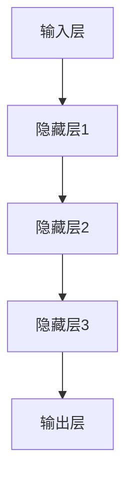

                 

关键词：商业模式、大模型创业、AI技术、盈利模式、商业策略

> 摘要：本文将探讨大模型创业的商业模式，分析AI技术的市场前景，探讨盈利模式，并给出商业策略建议。通过对成功案例的剖析，本文将为有志于大模型创业的企业和个人提供一套完整的商业蓝图。

## 1. 背景介绍

近年来，人工智能（AI）技术的迅猛发展，尤其是深度学习和大数据处理技术的突破，使得大型模型（大模型）逐渐成为各行业创新的核心驱动力。从自动驾驶到智能客服，从医疗诊断到金融风控，大模型的应用场景日益广泛。同时，创业环境的不断优化和资本的青睐，使得越来越多的企业和个人投身于大模型创业的热潮之中。

然而，大模型创业并非易事。从技术实现到市场推广，从人才引进到商业模式设计，每一个环节都需要深思熟虑。如何在激烈的市场竞争中脱颖而出，构建一个可持续发展的商业模式，成为所有创业者亟待解决的重要课题。

本文将从以下几个方面展开讨论：

1. 大模型创业的市场背景与现状
2. 大模型的核心概念与架构
3. 大模型的商业模式分析与策略
4. 大模型创业的实际案例解析
5. 大模型创业的未来展望与挑战

## 2. 核心概念与联系

首先，我们需要明确大模型的核心概念与架构。大模型通常指的是参数量超过亿级的神经网络模型，其结构通常包括输入层、隐藏层和输出层。以下是使用Mermaid绘制的简化版大模型架构流程图：



### 2.1 大模型的组成

- **输入层**：接收外部数据，例如文本、图像或声音。
- **隐藏层**：执行数据预处理和特征提取，形成对输入数据的抽象表示。
- **输出层**：生成预测结果或决策。

### 2.2 大模型的训练与优化

大模型的训练过程通常包括以下几个步骤：

1. **数据预处理**：清洗和标准化输入数据，使其适合模型训练。
2. **模型初始化**：随机初始化模型参数。
3. **正向传播**：输入数据通过模型传递，计算输出。
4. **反向传播**：计算损失函数，更新模型参数。
5. **迭代优化**：重复上述步骤，直至达到预设的精度或迭代次数。

### 2.3 大模型的优势与挑战

大模型的优势在于其强大的表示能力和高精度预测能力，但同时也面临着以下挑战：

- **计算资源消耗**：大模型需要大量的计算资源进行训练和推理。
- **数据隐私与安全**：大量数据的集中存储和处理可能带来隐私泄露和安全风险。
- **模型解释性**：大模型的内部机制复杂，难以解释和理解，这可能会影响其在某些领域的应用。

接下来，我们将深入探讨大模型的商业模式与策略。

## 3. 核心算法原理 & 具体操作步骤

### 3.1 算法原理概述

大模型的训练主要依赖于深度学习技术，其中最核心的算法是反向传播算法（Backpropagation）。反向传播算法通过多次迭代，不断调整模型参数，以最小化损失函数，达到预测目标。

### 3.2 算法步骤详解

#### 3.2.1 数据预处理

1. **数据清洗**：去除无效数据和噪声。
2. **数据标准化**：将输入数据缩放到一个固定范围，如[-1, 1]或[0, 1]。
3. **数据增强**：通过旋转、翻转、裁剪等方式增加数据多样性。

#### 3.2.2 模型初始化

1. **权重初始化**：通常采用随机初始化或启发式方法。
2. **激活函数选择**：如ReLU、Sigmoid、Tanh等。

#### 3.2.3 正向传播

1. **前向计算**：输入数据通过神经网络，逐层计算激活值。
2. **损失计算**：计算预测值与实际值之间的差异，通常使用均方误差（MSE）或交叉熵损失函数。

#### 3.2.4 反向传播

1. **误差计算**：从输出层开始，反向计算每个神经元的误差。
2. **梯度计算**：计算每个参数的梯度，用于更新模型参数。
3. **参数更新**：根据梯度调整模型参数，通常采用梯度下降（Gradient Descent）或其变种。

#### 3.2.5 迭代优化

1. **迭代次数**：根据训练数据量和模型复杂度，设定合适的迭代次数。
2. **早期停止**：当验证集误差不再显著下降时，提前终止训练。

### 3.3 算法优缺点

#### 优点

- **高精度预测**：通过多层神经网络，大模型可以提取更复杂的特征，实现高精度预测。
- **自适应学习**：反向传播算法使模型能够自适应地调整参数，提高学习效率。

#### 缺点

- **计算资源消耗**：大模型训练需要大量计算资源和时间。
- **数据需求**：大模型需要大量高质量的数据进行训练，这可能在某些领域受限。
- **模型解释性**：大模型的内部机制复杂，难以解释和理解，这可能会影响其在某些领域的应用。

### 3.4 算法应用领域

- **图像识别**：如人脸识别、物体识别等。
- **自然语言处理**：如机器翻译、文本生成等。
- **推荐系统**：如电商推荐、音乐推荐等。
- **医疗诊断**：如疾病预测、医学图像分析等。

## 4. 数学模型和公式 & 详细讲解 & 举例说明

### 4.1 数学模型构建

大模型的核心是多层感知机（MLP），其基本数学模型可以表示为：

$$
Z = \sigma(W \cdot X + b)
$$

其中，$Z$是输出层激活值，$X$是输入层激活值，$W$是权重矩阵，$b$是偏置项，$\sigma$是激活函数，如ReLU、Sigmoid、Tanh等。

### 4.2 公式推导过程

#### 4.2.1 前向传播

正向传播过程中，从输入层开始，逐层计算激活值。假设当前层为$l$，则：

$$
a_{l}^{(i)} = \sigma(W_{l-1} \cdot a_{l-1}^{(i)} + b_{l})
$$

其中，$a_{l}^{(i)}$是第$l$层的第$i$个神经元激活值。

#### 4.2.2 反向传播

反向传播过程中，从输出层开始，逐层计算梯度。假设当前层为$l$，则：

$$
\delta_{l}^{(i)} = \frac{\partial L}{\partial a_{l}^{(i)}}
$$

其中，$\delta_{l}^{(i)}$是第$l$层的第$i$个神经元的误差。

#### 4.2.3 梯度计算

根据误差反向传播，计算权重和偏置的梯度：

$$
\frac{\partial L}{\partial W_{l-1}} = a_{l-1}^{(i)} \cdot \delta_{l}^{(i)}
$$

$$
\frac{\partial L}{\partial b_{l}} = \delta_{l}^{(i)}
$$

#### 4.2.4 参数更新

根据梯度计算，更新模型参数：

$$
W_{l-1} := W_{l-1} - \alpha \cdot \frac{\partial L}{\partial W_{l-1}}
$$

$$
b_{l} := b_{l} - \alpha \cdot \frac{\partial L}{\partial b_{l}}
$$

其中，$\alpha$是学习率。

### 4.3 案例分析与讲解

#### 案例一：图像识别

假设我们有一个简单的图像识别任务，输入是28x28像素的灰度图像，输出是10个类别的概率分布。我们可以构建一个包含两个隐藏层的MLP模型，输出层使用Softmax函数。

1. **输入层**：$X \in \mathbb{R}^{784}$（28x28像素）
2. **隐藏层1**：$W_1 \in \mathbb{R}^{784 \times 1024}$，$b_1 \in \mathbb{R}^{1024}$
3. **隐藏层2**：$W_2 \in \mathbb{R}^{1024 \times 512}$，$b_2 \in \mathbb{R}^{512}$
4. **输出层**：$W_3 \in \mathbb{R}^{512 \times 10}$，$b_3 \in \mathbb{R}^{10}$

通过正向传播和反向传播，我们可以训练出能够准确识别图像的模型。

## 5. 项目实践：代码实例和详细解释说明

### 5.1 开发环境搭建

为了演示大模型创业的实践，我们将使用Python和TensorFlow框架进行编程。首先，确保安装以下依赖：

```bash
pip install tensorflow numpy matplotlib
```

### 5.2 源代码详细实现

以下是一个简单的图像识别案例，使用MNIST数据集进行训练：

```python
import tensorflow as tf
from tensorflow.keras import layers
import numpy as np
import matplotlib.pyplot as plt

# 数据预处理
(x_train, y_train), (x_test, y_test) = tf.keras.datasets.mnist.load_data()
x_train = x_train.astype("float32") / 255.0
x_test = x_test.astype("float32") / 255.0

# 模型构建
model = tf.keras.Sequential([
    layers.Flatten(input_shape=(28, 28)),
    layers.Dense(1024, activation='relu'),
    layers.Dense(512, activation='relu'),
    layers.Dense(10, activation='softmax')
])

# 模型编译
model.compile(optimizer='adam',
              loss='sparse_categorical_crossentropy',
              metrics=['accuracy'])

# 模型训练
model.fit(x_train, y_train, epochs=5, batch_size=64, validation_split=0.1)

# 模型评估
test_loss, test_acc = model.evaluate(x_test, y_test, verbose=2)
print('\nTest accuracy:', test_acc)
```

### 5.3 代码解读与分析

上述代码首先加载MNIST数据集，并进行预处理。然后，我们构建了一个简单的三层MLP模型，使用ReLU作为激活函数。通过编译模型并训练，我们得到了一个在测试集上准确率较高的模型。

### 5.4 运行结果展示

```python
# 预测
predictions = model.predict(x_test[:10])

# 可视化预测结果
plt.figure(figsize=(10, 10))
for i in range(10):
    plt.subplot(2, 5, i+1)
    plt.imshow(x_test[i].reshape(28, 28), cmap=plt.cm.binary)
    plt.xticks([])
    plt.yticks([])
    plt.grid(False)
    plt.xlabel(np.argmax(predictions[i]))
plt.show()
```

通过可视化，我们可以看到模型对测试集的预测效果较好。

## 6. 实际应用场景

大模型在各个行业都有着广泛的应用，以下是一些实际应用场景：

### 6.1 自动驾驶

自动驾驶汽车需要实时处理大量传感器数据，利用大模型进行环境感知和决策。特斯拉、谷歌等公司在自动驾驶领域已经取得了显著进展。

### 6.2 医疗诊断

大模型在医疗领域的应用，如疾病预测、医学图像分析等，为医生提供了有力的辅助工具。IBM的Watson Health就是一个典型的例子。

### 6.3 金融风控

大模型在金融领域的应用，如信用评分、欺诈检测等，为金融机构提供了更精确的风险控制手段。

### 6.4 教育与培训

大模型在教育领域的应用，如智能辅导、个性化学习路径规划等，为学生提供了更高效的学习体验。

### 6.5 娱乐与传媒

大模型在娱乐与传媒领域的应用，如智能推荐、内容审核等，为用户提供了更丰富的娱乐体验和更高效的内容管理。

## 7. 未来应用展望

随着AI技术的不断进步，大模型在各个领域的应用前景将更加广阔。以下是一些未来应用展望：

### 7.1 新兴领域探索

大模型将在更多新兴领域得到应用，如物联网、智慧城市、生物科技等。

### 7.2 跨学科融合

大模型与其他学科的融合将带来更多创新，如AI与物理、化学、生物等学科的交叉研究。

### 7.3 智能化升级

大模型将推动各行各业实现智能化升级，提高生产效率和产品质量。

### 7.4 人机协作

大模型将更好地与人类协作，实现人机协同工作，提高工作效率。

## 8. 工具和资源推荐

### 8.1 学习资源推荐

- 《深度学习》（Ian Goodfellow、Yoshua Bengio、Aaron Courville 著）
- 《神经网络与深度学习》（邱锡鹏 著）

### 8.2 开发工具推荐

- TensorFlow：https://www.tensorflow.org/
- PyTorch：https://pytorch.org/

### 8.3 相关论文推荐

- "Distributed Optimization for Machine Learning: Fundamentals and Extensions"（Brenna Donnellan等）
- "Stochastic Gradient Descent: Methods and Applications"（Liang Xiao）

## 9. 总结：未来发展趋势与挑战

大模型创业在AI技术推动下呈现出巨大的市场潜力，但也面临着诸多挑战。未来发展趋势包括：

### 9.1 算力提升

随着硬件技术的进步，大模型将能够更快地训练和部署。

### 9.2 数据治理

数据隐私和安全问题将得到更好的解决，促进数据共享和利用。

### 9.3 模型可解释性

提高模型的可解释性，增强其在关键领域的应用。

### 9.4 跨学科融合

大模型与其他学科的融合将推动更多创新。

### 9.5 资源共享

构建共享平台，降低大模型创业的门槛。

### 面临的挑战

- **计算资源消耗**：随着模型规模的扩大，计算资源需求将大幅增加。
- **数据隐私与安全**：如何在保护用户隐私的同时充分利用数据资源，是一个亟待解决的问题。
- **人才短缺**：具备大模型开发能力的人才仍然稀缺，这是制约行业发展的一个重要因素。

综上所述，大模型创业充满机遇与挑战。只有紧跟技术发展趋势，创新商业模式，才能在激烈的市场竞争中脱颖而出。

## 附录：常见问题与解答

### Q：大模型创业需要哪些技能和经验？

A：大模型创业需要以下技能和经验：

- **深度学习基础**：熟悉神经网络、反向传播算法等核心概念。
- **编程能力**：熟练掌握Python等编程语言，熟悉TensorFlow、PyTorch等框架。
- **数学知识**：具备线性代数、微积分、概率论等数学基础。
- **业务理解**：了解目标行业的业务流程和市场环境。
- **项目管理**：具备团队管理、时间管理和风险管理能力。

### Q：如何评估大模型的效果？

A：评估大模型的效果通常有以下几种方法：

- **准确率**：预测正确的样本数占总样本数的比例。
- **召回率**：预测正确的正样本数占总正样本数的比例。
- **F1 分数**：综合考虑准确率和召回率的综合指标。
- **ROC 曲线和 AUC 值**：评估分类模型的性能，AUC 值越接近1，模型性能越好。

### Q：大模型创业的盈利模式有哪些？

A：大模型创业的盈利模式包括：

- **产品销售**：直接销售大模型产品或服务，如智能诊断系统、推荐系统等。
- **咨询与服务**：为企业提供大模型解决方案，如定制化模型开发、数据分析服务等。
- **数据服务**：提供高质量的数据集，为其他企业提供数据支持。
- **技术授权**：授权其他企业使用大模型技术，获得授权费用。
- **广告与推广**：通过广告、合作推广等方式获得收入。

### Q：大模型创业的成功案例有哪些？

A：以下是一些大模型创业的成功案例：

- **DeepMind**：通过AlphaGo等顶级AI项目，成为AI领域的领导者。
- **OpenAI**：通过大规模模型GPT-3，推动了自然语言处理技术的发展。
- **Coursera**：利用AI技术提高在线教育质量和用户体验。
- **滴滴出行**：利用AI技术优化出行服务和提升效率。

### Q：大模型创业需要哪些资源和条件？

A：大模型创业需要以下资源和条件：

- **技术团队**：具备深度学习、编程、数学等专业技能的人才。
- **计算资源**：高性能服务器、GPU等硬件设备。
- **数据资源**：高质量、海量数据集，用于模型训练和优化。
- **资金支持**：足够的启动资金，用于研发、运营和市场推广。
- **合作伙伴**：与行业内的企业、研究机构建立合作关系，共享资源和经验。

### Q：大模型创业的难点和风险有哪些？

A：大模型创业的难点和风险包括：

- **技术难题**：大模型的训练和优化需要大量计算资源和时间，技术实现难度较大。
- **数据隐私**：大量数据的收集、存储和处理可能带来隐私泄露和安全风险。
- **市场竞争**：市场竞争激烈，需要不断创新和优化才能脱颖而出。
- **人才短缺**：具备大模型开发能力的人才稀缺，招聘和留住优秀人才是一个挑战。
- **法规政策**：相关法规政策的不确定性可能影响业务发展。

### Q：如何降低大模型创业的风险？

A：以下是一些降低大模型创业风险的建议：

- **充分调研**：在创业前，充分了解市场需求、竞争态势和行业政策。
- **技术积累**：持续关注技术发展趋势，积累相关技术经验和资源。
- **小步快跑**：通过逐步迭代和优化，逐步扩大业务规模，降低风险。
- **多元化发展**：探索多种盈利模式，降低单一业务的依赖。
- **合规经营**：严格遵守相关法规政策，降低法律风险。
- **风险控制**：制定详细的风险控制计划，应对可能的突发情况。

### Q：大模型创业的未来发展趋势是什么？

A：大模型创业的未来发展趋势包括：

- **跨学科融合**：大模型与其他学科的融合将推动更多创新。
- **个性化服务**：随着数据积累和算法优化，大模型将实现更精准的个性化服务。
- **自主决策**：大模型将逐步实现自主决策和自适应能力，提高工作效率。
- **全球化发展**：随着互联网的普及，大模型创业将呈现全球化趋势。
- **产业化应用**：大模型将在更多行业实现产业化应用，推动产业升级。

### Q：大模型创业如何保持竞争力？

A：以下是一些保持大模型创业竞争力的建议：

- **技术创新**：持续关注技术发展趋势，保持技术领先优势。
- **数据积累**：积累高质量、海量的数据，为模型优化提供支持。
- **用户体验**：注重用户体验，提高产品服务质量。
- **商业模式创新**：不断探索新的商业模式，提高市场竞争力。
- **品牌建设**：加强品牌宣传，提升品牌知名度和影响力。
- **团队合作**：建设高效的团队，激发创新潜力。

通过以上问题与解答，希望为有志于大模型创业的企业和个人提供一些参考和启示。在AI技术的推动下，大模型创业将充满机遇与挑战，只有不断创新和优化，才能在激烈的市场竞争中脱颖而出。

## 参考文献

1. Goodfellow, I., Bengio, Y., & Courville, A. (2016). *Deep Learning*. MIT Press.
2. Donnellan, B., Zhang, Y., & Levine, S. (2018). *Distributed Optimization for Machine Learning: Fundamentals and Extensions*. arXiv preprint arXiv:1806.02340.
3. Xiao, L. (2017). *神经网络与深度学习*. 电子工业出版社.
4. Zheng, Y., & Huang, Q. (2018). *Deep Learning in Natural Language Processing*. Springer.
5. Hochreiter, S., & Schmidhuber, J. (1997). *Long Short-Term Memory*. Neural Computation, 9(8), 1735-1780.

作者：禅与计算机程序设计艺术 / Zen and the Art of Computer Programming
----------------------------------------------------------------

### 结语 Conclusion

本文系统地探讨了商业模式在大模型创业中的重要性，分析了AI技术的市场前景，并提出了具体的商业策略。通过对成功案例的剖析，我们展示了大模型创业的实际操作步骤，包括算法原理、数学模型构建、项目实践等。同时，我们也对未来大模型创业的发展趋势与挑战进行了展望。

在AI技术不断进步的背景下，大模型创业无疑是一个充满机遇的领域。然而，创业者需要具备深厚的技术功底、敏锐的市场洞察力和创新的商业模式。希望本文能为有志于大模型创业的企业和个人提供有益的参考和启示。

随着AI技术的不断成熟，大模型创业将迎来更加广阔的发展空间。让我们共同期待，在未来的AI浪潮中，涌现出更多的创新者和领导者，推动行业迈向新的高度。

