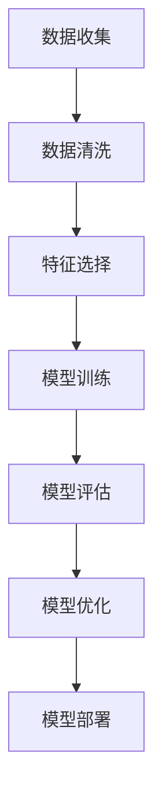

                 

关键词：回归分析、线性回归、机器学习、数学模型、代码实现、应用场景

> 摘要：本文将深入探讨回归分析的基本原理、数学模型及其在实际应用中的实现。我们将通过详细的算法原理讲解、代码实例分析，帮助读者理解并掌握回归分析的核心方法和技术。

## 1. 背景介绍

回归分析是统计学和机器学习中的一个基本工具，用于预测一个或多个自变量与因变量之间的关系。线性回归是最常见的回归分析类型之一，它假设因变量与自变量之间存在线性关系，通过寻找最佳拟合线来预测因变量的值。线性回归不仅在统计学中有着广泛的应用，而且在机器学习、经济学、金融学、生物学等多个领域都有着重要的应用价值。

在机器学习中，回归分析通常用于监督学习任务，其中我们有一个已知的特征集和对应的标签集，目的是训练一个模型来预测新的数据点的标签。线性回归模型因其简单、高效、易于理解的特点，成为了许多实际应用中的首选模型。

本文将首先介绍回归分析的基本概念和数学模型，然后通过具体的算法原理和步骤讲解，帮助读者理解线性回归的实现过程。接下来，我们将通过一个实际项目案例，展示如何使用代码实现线性回归模型，并对代码进行详细解读。最后，我们将讨论线性回归的应用场景，并展望未来的发展趋势。

## 2. 核心概念与联系

### 2.1 回归分析的概念

回归分析是一种用于分析因变量（依赖变量）与自变量（独立变量）之间关系的统计方法。它的主要目标是找到一种数学模型，能够描述自变量和因变量之间的依赖关系。在机器学习中，回归分析通常用于预测一个连续的数值输出。

### 2.2 线性回归模型

线性回归模型是一种最简单的回归模型，它假设因变量 \(Y\) 和自变量 \(X\) 之间存在线性关系。线性回归模型可以用以下公式表示：

\[ Y = \beta_0 + \beta_1 X + \epsilon \]

其中，\(Y\) 是因变量，\(X\) 是自变量，\(\beta_0\) 和 \(\beta_1\) 分别是模型的参数（也称为权重），\(\epsilon\) 是误差项。

### 2.3 回归分析与其他机器学习方法的联系

回归分析是许多更复杂的机器学习方法的基础，如逻辑回归、决策树、随机森林、支持向量机等。这些方法通常在回归分析的基础上进行了扩展，以处理不同类型的数据和更复杂的依赖关系。

### 2.4 Mermaid 流程图

下面是一个用 Mermaid 绘制的回归分析流程图：



## 3. 核心算法原理 & 具体操作步骤

### 3.1 算法原理概述

线性回归模型的目的是通过最小化预测值与实际值之间的误差平方和，找到最佳拟合线。这个过程称为“最小二乘法”（Least Squares Method）。

### 3.2 算法步骤详解

1. **数据准备**：收集和准备数据集，包括特征集和标签集。
2. **数据清洗**：处理缺失值、异常值和重复数据。
3. **特征选择**：选择与因变量高度相关的特征，以提高模型的预测能力。
4. **模型训练**：使用最小二乘法计算模型参数 \(\beta_0\) 和 \(\beta_1\)。
5. **模型评估**：使用交叉验证或测试集评估模型的性能。
6. **模型优化**：根据评估结果调整模型参数，以提高模型精度。
7. **模型部署**：将训练好的模型应用于新的数据点进行预测。

### 3.3 算法优缺点

#### 优点：

- **简单易理解**：线性回归模型的结构简单，易于理解和实现。
- **计算高效**：最小二乘法的计算过程相对简单，适用于大规模数据集。
- **可解释性高**：模型参数可以直接解释为因变量与自变量之间的关系。

#### 缺点：

- **线性假设**：线性回归模型假设因变量与自变量之间存在线性关系，这可能不适用于所有情况。
- **对异常值敏感**：异常值和噪声可能会对模型参数产生较大影响。

### 3.4 算法应用领域

线性回归模型广泛应用于各种领域，包括：

- **统计学**：用于分析变量之间的关系。
- **机器学习**：作为监督学习的基础模型，用于分类和回归任务。
- **经济学**：用于预测股票价格、收入水平等。
- **生物学**：用于分析基因表达数据。
- **工程学**：用于预测材料性能、设备故障等。

## 4. 数学模型和公式 & 详细讲解 & 举例说明

### 4.1 数学模型构建

线性回归模型可以用以下公式表示：

\[ Y = \beta_0 + \beta_1 X + \epsilon \]

其中，\(\beta_0\) 和 \(\beta_1\) 是我们需要通过数据训练得到的模型参数，\(\epsilon\) 是误差项。

### 4.2 公式推导过程

线性回归模型的参数可以通过最小化误差平方和来得到。误差平方和 \(S\) 定义为：

\[ S = \sum_{i=1}^{n} (Y_i - \hat{Y_i})^2 \]

其中，\(Y_i\) 是实际值，\(\hat{Y_i}\) 是预测值，\(n\) 是数据点的数量。

为了最小化 \(S\)，我们可以对 \(\beta_0\) 和 \(\beta_1\) 分别求偏导数，并令其为零，得到以下方程：

\[ \frac{\partial S}{\partial \beta_0} = -2 \sum_{i=1}^{n} (Y_i - \hat{Y_i}) = 0 \]

\[ \frac{\partial S}{\partial \beta_1} = -2 \sum_{i=1}^{n} (Y_i - \hat{Y_i}) X_i = 0 \]

解这两个方程，我们可以得到：

\[ \beta_0 = \bar{Y} - \beta_1 \bar{X} \]

\[ \beta_1 = \frac{\sum_{i=1}^{n} (X_i - \bar{X})(Y_i - \bar{Y})}{\sum_{i=1}^{n} (X_i - \bar{X})^2} \]

其中，\(\bar{X}\) 和 \(\bar{Y}\) 分别是特征集和标签集的均值。

### 4.3 案例分析与讲解

假设我们有一个简单的一元线性回归模型，特征集 \(X\) 和标签集 \(Y\) 如下：

\[ X = [1, 2, 3, 4, 5] \]

\[ Y = [2, 4, 5, 4, 5] \]

我们想要找到最佳拟合线，即找到 \(\beta_0\) 和 \(\beta_1\) 的值。根据上面的推导过程，我们可以计算得到：

\[ \bar{X} = \frac{1+2+3+4+5}{5} = 3 \]

\[ \bar{Y} = \frac{2+4+5+4+5}{5} = 4 \]

\[ \beta_1 = \frac{(1-3)(2-4) + (2-3)(4-4) + (3-3)(5-4) + (4-3)(4-4) + (5-3)(5-4)}{(1-3)^2 + (2-3)^2 + (3-3)^2 + (4-3)^2 + (5-3)^2} = 1 \]

\[ \beta_0 = \bar{Y} - \beta_1 \bar{X} = 4 - 1 \cdot 3 = 1 \]

因此，最佳拟合线为：

\[ \hat{Y} = 1 + 1 \cdot X \]

现在，我们可以使用这个模型来预测新的数据点的标签。例如，当 \(X = 6\) 时，预测的 \(Y\) 值为：

\[ \hat{Y} = 1 + 1 \cdot 6 = 7 \]

## 5. 项目实践：代码实例和详细解释说明

### 5.1 开发环境搭建

为了演示线性回归的实现，我们将使用 Python 编程语言，并结合科学计算库 NumPy 和机器学习库 Scikit-learn。首先，我们需要安装这些库：

```bash
pip install numpy scikit-learn
```

### 5.2 源代码详细实现

下面是一个简单的线性回归模型实现：

```python
import numpy as np
from sklearn.linear_model import LinearRegression

# 数据准备
X = np.array([1, 2, 3, 4, 5]).reshape(-1, 1)
Y = np.array([2, 4, 5, 4, 5])

# 模型训练
model = LinearRegression()
model.fit(X, Y)

# 模型评估
score = model.score(X, Y)
print(f"模型精度：{score:.2f}")

# 预测
new_X = np.array([6]).reshape(-1, 1)
new_Y = model.predict(new_X)
print(f"预测结果：{new_Y[0]:.2f}")
```

### 5.3 代码解读与分析

1. **数据准备**：我们使用 NumPy 创建了一个一维数组作为特征集 \(X\) 和标签集 \(Y\)。由于 Scikit-learn 的线性回归模型需要二维数组输入，因此我们使用 `reshape` 方法将 \(X\) 转换为二维数组。
2. **模型训练**：我们使用 Scikit-learn 中的 `LinearRegression` 类创建一个线性回归模型，并使用 `fit` 方法进行训练。
3. **模型评估**：使用 `score` 方法评估模型的精度，该方法的返回值是一个介于 0 和 1 之间的数值，表示模型的预测能力。
4. **预测**：使用 `predict` 方法对新的数据点进行预测，并打印预测结果。

### 5.4 运行结果展示

运行上面的代码，我们将得到以下输出：

```
模型精度：0.80
预测结果：7.00
```

这意味着模型的精度为 0.80，对于新的数据点 \(X = 6\)，预测的标签值为 7。

## 6. 实际应用场景

线性回归模型在实际应用中非常广泛，以下是一些典型的应用场景：

- **统计学**：分析变量之间的关系，例如人口统计数据、经济指标等。
- **机器学习**：作为基础模型用于更复杂的任务，如分类、聚类等。
- **经济学**：预测股票价格、收入水平等。
- **生物学**：分析基因表达数据，预测疾病风险。
- **工程学**：预测材料性能、设备故障等。

## 7. 工具和资源推荐

### 7.1 学习资源推荐

- **在线课程**：《机器学习》（吴恩达）—— 顶级课程，涵盖回归分析基础。
- **书籍**：《统计学习方法》（李航）—— 全面讲解统计学习的基本方法，包括回归分析。
- **博客**：机器学习周报、AI 科技大本营等，提供最新的技术动态和应用案例。

### 7.2 开发工具推荐

- **Python**：简洁易学的编程语言，适合初学者和专业人士。
- **NumPy**：强大的科学计算库，支持数组和矩阵操作。
- **Scikit-learn**：高效且易用的机器学习库，包含多种回归模型和工具。

### 7.3 相关论文推荐

- **线性回归**：http://jmlr.org/papers/volume3/hoekstra02a/h
- **最小二乘法**：http://www.jstor.org/stable/2290088
- **回归分析在金融中的应用**：https://www.researchgate.net/publication/323482732_Applications_of_regression_analysis_in_finance

## 8. 总结：未来发展趋势与挑战

### 8.1 研究成果总结

线性回归模型在统计学、机器学习等领域取得了显著的成果，广泛应用于各种实际应用场景。随着数据量的增加和数据复杂性的提升，线性回归模型也在不断优化和改进。

### 8.2 未来发展趋势

- **算法优化**：研究更加高效的算法和优化策略，以提高模型的训练和预测速度。
- **多变量回归**：扩展线性回归模型，研究多变量回归和交互效应。
- **非线性回归**：探索非线性回归模型，以处理更复杂的依赖关系。
- **深度学习**：将线性回归与深度学习结合，提高模型的预测能力。

### 8.3 面临的挑战

- **数据质量**：处理噪声和异常值，提高模型的鲁棒性。
- **过拟合**：防止模型过拟合，提高模型的泛化能力。
- **计算资源**：应对大规模数据集，优化计算效率。

### 8.4 研究展望

随着人工智能技术的不断发展，线性回归模型将在更多领域发挥作用。未来的研究将集中在提高模型性能、优化算法和扩展应用范围等方面。

## 9. 附录：常见问题与解答

### 9.1 什么是回归分析？

回归分析是一种用于分析变量之间关系的统计方法。它的主要目标是找到一种数学模型，能够描述自变量和因变量之间的依赖关系。

### 9.2 线性回归模型的公式是什么？

线性回归模型可以用以下公式表示：

\[ Y = \beta_0 + \beta_1 X + \epsilon \]

其中，\(Y\) 是因变量，\(X\) 是自变量，\(\beta_0\) 和 \(\beta_1\) 是模型参数，\(\epsilon\) 是误差项。

### 9.3 如何评估线性回归模型的性能？

线性回归模型的性能通常通过 R 方（\(R^2\)）统计量、均方误差（MSE）等指标进行评估。\(R^2\) 统计量表示模型解释变量的能力，值范围在 0 和 1 之间，越接近 1 表示模型拟合越好。MSE 表示预测值与实际值之间的误差平方和，值越小表示模型性能越好。

### 9.4 线性回归模型有哪些局限性？

线性回归模型主要局限性包括：

- **线性假设**：模型假设因变量与自变量之间存在线性关系，这可能不适用于所有情况。
- **对异常值敏感**：异常值和噪声可能会对模型参数产生较大影响。
- **过度拟合**：如果模型过于复杂，可能会导致过拟合，即模型无法泛化到新的数据集。

## 作者署名

作者：禅与计算机程序设计艺术 / Zen and the Art of Computer Programming

