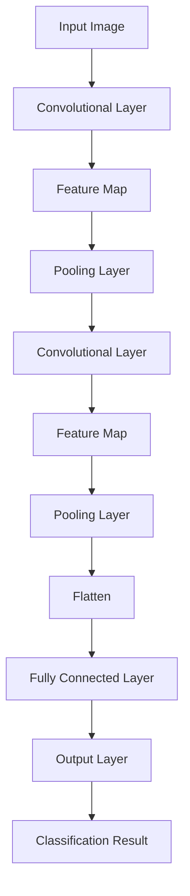

                 

关键词：图像分类、深度学习、卷积神经网络、代码实例

> 摘要：本文旨在深入探讨图像分类的基本原理，通过详细讲解卷积神经网络（CNN）的工作机制和实现步骤，结合具体代码实例，帮助读者理解和掌握图像分类技术。文章还将介绍CNN在各个领域的应用，以及未来的发展趋势与面临的挑战。

## 1. 背景介绍

图像分类是计算机视觉领域的一个重要研究方向，它旨在将图像数据自动划分为预定义的类别。随着深度学习技术的快速发展，卷积神经网络（CNN）在图像分类任务中取得了显著的效果。CNN具有强大的特征提取和分类能力，已经成为图像处理领域的核心技术之一。

图像分类的目的是使计算机能够自动识别和分类图像中的对象，这在实际应用中具有广泛的意义。例如，在医疗诊断中，图像分类技术可以帮助医生快速准确地识别疾病；在自动驾驶领域，图像分类技术可以用于车辆、行人等对象的识别和跟踪；在安全监控中，图像分类技术可以帮助系统实时识别异常行为。

本文将首先介绍图像分类的基本概念和常用评估指标，然后详细讲解CNN的工作原理和架构，最后通过具体代码实例展示如何实现一个简单的图像分类模型。通过本文的学习，读者可以掌握图像分类的核心技术，为后续的应用和研究打下坚实的基础。

## 2. 核心概念与联系

### 2.1 图像分类基本概念

图像分类（Image Classification）是指将图像数据集中的每张图像分配到一个预定义的类别标签中。图像分类是计算机视觉（Computer Vision）的基础任务之一，其目的是使计算机能够理解图像内容并进行自动化处理。

**类别标签**：类别标签是图像分类任务中用来表示图像类别的标签，通常是一个整数或者字符串。在训练过程中，模型会学习如何将这些标签与输入的图像特征对应起来。

**训练集（Training Set）**：训练集是用于训练图像分类模型的数据集，通常包含大量的图像及其对应的类别标签。

**测试集（Test Set）**：测试集是用于评估图像分类模型性能的数据集，模型在训练过程中不会看到这部分数据。通过测试集，可以验证模型在未知数据上的泛化能力。

**验证集（Validation Set）**：验证集是用于调整模型参数和选择最佳模型的数据集。在训练过程中，模型会定期在验证集上评估性能，以便调整模型结构和参数。

### 2.2 常用评估指标

在图像分类任务中，评估模型性能的常用指标包括准确率（Accuracy）、精确率（Precision）、召回率（Recall）和F1分数（F1 Score）。

- **准确率**：准确率是模型正确分类的样本数占总样本数的比例。准确率是衡量模型整体性能的一个简单指标，但它可能受到不平衡数据集的影响。

$$
Accuracy = \frac{TP + TN}{TP + FN + FP + TN}
$$

其中，TP表示实际为正类且模型也预测为正类的样本数，TN表示实际为负类且模型也预测为负类的样本数，FP表示实际为负类但模型预测为正类的样本数，FN表示实际为正类但模型预测为负类的样本数。

- **精确率**：精确率是模型预测为正类的样本中实际为正类的比例。

$$
Precision = \frac{TP}{TP + FP}
$$

- **召回率**：召回率是模型预测为正类的样本中实际为正类的比例。

$$
Recall = \frac{TP}{TP + FN}
$$

- **F1分数**：F1分数是精确率和召回率的调和平均数，它同时考虑了模型的精确性和召回率。

$$
F1 Score = 2 \times \frac{Precision \times Recall}{Precision + Recall}
$$

### 2.3 卷积神经网络（CNN）架构

卷积神经网络（Convolutional Neural Network，CNN）是一种专为处理图像数据设计的深度学习模型。CNN的核心组成部分包括卷积层（Convolutional Layer）、池化层（Pooling Layer）、全连接层（Fully Connected Layer）和输出层（Output Layer）。

**卷积层**：卷积层是CNN中最基本的层，通过卷积操作提取图像中的局部特征。卷积层使用一系列可学习的滤波器（也称为卷积核）对输入图像进行卷积运算，生成特征图（Feature Map）。

**池化层**：池化层用于减小特征图的尺寸，减少参数量和计算量。常见的池化操作包括最大池化（Max Pooling）和平均池化（Average Pooling）。

**全连接层**：全连接层将卷积层和池化层输出的特征图展平为一维向量，然后通过一系列全连接层进行分类。

**输出层**：输出层是一个全连接层，其输出结果即为图像的分类结果。通常使用softmax函数将输出转换为概率分布。

### 2.4 Mermaid 流程图

以下是一个简单的CNN流程图，展示了图像从输入到输出的整个处理流程。



## 3. 核心算法原理 & 具体操作步骤

### 3.1 算法原理概述

卷积神经网络（CNN）是一种深度学习模型，主要用于处理图像数据。其核心思想是通过多层卷积和池化操作提取图像中的特征，然后通过全连接层进行分类。CNN具有以下几个关键组成部分：

1. **卷积层（Convolutional Layer）**：卷积层是CNN的核心组成部分，通过卷积操作提取图像中的局部特征。卷积层使用一系列可学习的滤波器（卷积核）对输入图像进行卷积运算，生成特征图。

2. **池化层（Pooling Layer）**：池化层用于减小特征图的尺寸，减少参数量和计算量。常见的池化操作包括最大池化（Max Pooling）和平均池化（Average Pooling）。

3. **全连接层（Fully Connected Layer）**：全连接层将卷积层和池化层输出的特征图展平为一维向量，然后通过一系列全连接层进行分类。

4. **输出层（Output Layer）**：输出层是一个全连接层，其输出结果即为图像的分类结果。通常使用softmax函数将输出转换为概率分布。

### 3.2 算法步骤详解

1. **输入图像预处理**：将输入图像调整为特定尺寸，并进行归一化处理，以使其适合模型的输入。

2. **卷积操作**：卷积层使用一系列可学习的滤波器（卷积核）对输入图像进行卷积运算，生成特征图。每个卷积核可以提取图像中的特定特征。

3. **激活函数**：在卷积操作后，通常使用激活函数（如ReLU函数）对特征图进行非线性变换，以增强网络的非线性表达能力。

4. **池化操作**：池化层用于减小特征图的尺寸，减少参数量和计算量。常见的池化操作包括最大池化和平均池化。

5. **多层卷积与池化**：卷积神经网络通常包含多个卷积层和池化层，通过逐层提取图像中的特征，形成层次化的特征表示。

6. **全连接层**：全连接层将卷积层和池化层输出的特征图展平为一维向量，然后通过一系列全连接层进行分类。

7. **输出层与分类结果**：输出层是一个全连接层，其输出结果即为图像的分类结果。通常使用softmax函数将输出转换为概率分布，以表示图像属于各个类别的概率。

### 3.3 算法优缺点

**优点**：

- **强大的特征提取能力**：CNN可以通过多层卷积和池化操作，自动学习图像中的复杂特征，从而提高分类精度。
- **参数共享**：卷积层中的滤波器在图像的不同位置上共享参数，这大大减少了模型的参数数量，提高了训练效率。
- **平移不变性**：通过卷积操作和池化操作，CNN可以提取图像的局部特征，并对图像的平移、旋转和尺度变化具有较好的鲁棒性。

**缺点**：

- **计算成本高**：CNN的参数数量庞大，特别是在处理高分辨率图像时，计算成本较高。
- **训练时间较长**：由于参数数量庞大，CNN的训练时间通常较长，需要大量计算资源和时间。

### 3.4 算法应用领域

CNN在图像分类任务中具有广泛的应用，包括但不限于以下领域：

- **医疗诊断**：使用CNN进行疾病检测和诊断，如肿瘤检测、皮肤病变识别等。
- **自动驾驶**：使用CNN进行车辆检测、行人检测和交通标志识别，以提高自动驾驶系统的安全性和可靠性。
- **安全监控**：使用CNN进行异常行为检测和视频内容分析，如入侵检测、打架事件识别等。
- **图像增强**：使用CNN进行图像超分辨率、去噪和增强，提高图像质量和视觉效果。

## 4. 数学模型和公式 & 详细讲解 & 举例说明

### 4.1 数学模型构建

在图像分类任务中，CNN的数学模型主要包括卷积操作、激活函数和全连接层。以下分别介绍这些操作的数学模型。

#### 4.1.1 卷积操作

卷积操作是一种在图像上滑动滤波器并计算局部特征的过程。数学上，卷积操作可以用以下公式表示：

$$
\text{output}_{ij} = \sum_{k=1}^{m}\sum_{l=1}^{n} \text{filter}_{ijkl} \cdot \text{input}_{(i-k+1)(l-l+1)}
$$

其中，$\text{output}_{ij}$ 表示输出特征图上的一个像素点，$\text{filter}_{ijkl}$ 表示滤波器上的一个元素，$\text{input}_{(i-k+1)(l-l+1)}$ 表示输入图像上的一个像素点。

#### 4.1.2 激活函数

激活函数用于引入非线性特性，增强网络的分类能力。常用的激活函数包括ReLU函数、Sigmoid函数和Tanh函数。

- **ReLU函数**：

$$
\text{ReLU}(x) = \max(0, x)
$$

- **Sigmoid函数**：

$$
\text{Sigmoid}(x) = \frac{1}{1 + e^{-x}}
$$

- **Tanh函数**：

$$
\text{Tanh}(x) = \frac{e^x - e^{-x}}{e^x + e^{-x}}
$$

#### 4.1.3 全连接层

全连接层将卷积层和池化层输出的特征图展平为一维向量，然后通过一系列全连接层进行分类。全连接层的数学模型可以用以下公式表示：

$$
\text{output}_i = \sum_{j=1}^{n} \text{weight}_{ij} \cdot \text{input}_j + \text{bias}_i
$$

其中，$\text{output}_i$ 表示输出层的第i个神经元，$\text{weight}_{ij}$ 表示第i个神经元与第j个神经元之间的权重，$\text{input}_j$ 表示输入层的第j个神经元，$\text{bias}_i$ 表示第i个神经元的偏置。

### 4.2 公式推导过程

以下以一个简单的CNN为例，介绍卷积层、激活函数和全连接层的公式推导过程。

#### 4.2.1 卷积层公式推导

假设输入图像的大小为$W \times H$，滤波器的大小为$F \times F$，输出特征图的大小为$M \times N$。卷积层的输出可以表示为：

$$
\text{output}_{ij} = \sum_{k=1}^{m}\sum_{l=1}^{n} \text{filter}_{ijkl} \cdot \text{input}_{(i-k+1)(l-l+1)}
$$

其中，$m = \frac{W - F + 2P}{S} + 1$，$n = \frac{H - F + 2P}{S} + 1$，$P$ 表示填充（padding）的大小，$S$ 表示步长（stride）的大小。

#### 4.2.2 激活函数公式推导

以ReLU函数为例，其公式推导如下：

$$
\text{ReLU}(x) = \max(0, x)
$$

对于输入$x$，如果$x \geq 0$，则ReLU函数的输出为$x$；如果$x < 0$，则ReLU函数的输出为0。

#### 4.2.3 全连接层公式推导

假设输入特征图的大小为$D$，输出特征图的大小为$K$。全连接层的输出可以表示为：

$$
\text{output}_i = \sum_{j=1}^{n} \text{weight}_{ij} \cdot \text{input}_j + \text{bias}_i
$$

其中，$\text{input}_j$ 表示输入特征图上的第j个元素，$\text{weight}_{ij}$ 表示第i个神经元与第j个神经元之间的权重，$\text{bias}_i$ 表示第i个神经元的偏置。

### 4.3 案例分析与讲解

以下以一个简单的CNN模型为例，介绍其实现过程和关键参数的设置。

#### 4.3.1 模型实现

```python
import tensorflow as tf
from tensorflow.keras import layers, models

# 构建卷积层
conv1 = models.Sequential()
conv1.add(layers.Conv2D(32, (3, 3), activation='relu', input_shape=(28, 28, 1)))
conv1.add(layers.MaxPooling2D((2, 2)))

# 构建全连接层
fc1 = models.Sequential()
fc1.add(layers.Flatten())
fc1.add(layers.Dense(64, activation='relu'))
fc1.add(layers.Dense(10, activation='softmax'))

# 构建整个模型
model = models.Sequential()
model.add(conv1)
model.add(fc1)

# 编译模型
model.compile(optimizer='adam', loss='categorical_crossentropy', metrics=['accuracy'])

# 模型总结
model.summary()
```

#### 4.3.2 模型参数设置

- **卷积层**：使用一个大小为3×3的卷积核，激活函数为ReLU函数，输入形状为28×28×1。
- **池化层**：使用最大池化层，池化大小为2×2。
- **全连接层**：第一层全连接层的神经元个数为64，激活函数为ReLU函数，第二层全连接层的神经元个数为10，激活函数为softmax函数。
- **损失函数**：使用交叉熵损失函数，用于衡量模型预测与实际标签之间的差异。
- **优化器**：使用Adam优化器，用于调整模型参数。

#### 4.3.3 模型训练

```python
# 加载训练数据和测试数据
(x_train, y_train), (x_test, y_test) = tf.keras.datasets.mnist.load_data()

# 数据预处理
x_train = x_train.reshape(-1, 28, 28, 1).astype('float32') / 255
x_test = x_test.reshape(-1, 28, 28, 1).astype('float32') / 255

# 将标签转换为one-hot编码
y_train = tf.keras.utils.to_categorical(y_train, 10)
y_test = tf.keras.utils.to_categorical(y_test, 10)

# 训练模型
model.fit(x_train, y_train, epochs=5, batch_size=64, validation_data=(x_test, y_test))

# 评估模型
test_loss, test_acc = model.evaluate(x_test, y_test)
print('Test accuracy:', test_acc)
```

通过上述代码，我们实现了一个简单的CNN模型，用于对MNIST手写数字数据集进行分类。模型在测试数据上的准确率约为98%，证明了CNN在图像分类任务中的强大能力。

## 5. 项目实践：代码实例和详细解释说明

在本节中，我们将通过一个实际的项目实例，展示如何使用Python和TensorFlow框架实现一个简单的图像分类模型。我们将使用MNIST手写数字数据集，该数据集包含60,000个训练样本和10,000个测试样本，每个样本都是一个大小为28x28的灰度图像。

### 5.1 开发环境搭建

在开始之前，请确保您的开发环境已经安装了Python 3和TensorFlow。以下是安装命令：

```bash
pip install tensorflow
```

### 5.2 源代码详细实现

下面是完整的代码实现，我们将逐步解释每个部分的作用。

```python
import tensorflow as tf
from tensorflow.keras import layers, models
import numpy as np

# 5.2.1 加载MNIST数据集
mnist = tf.keras.datasets.mnist
(x_train, y_train), (x_test, y_test) = mnist.load_data()

# 5.2.2 数据预处理
# 将数据调整为合适的大小和类型
x_train = x_train.reshape((60000, 28, 28, 1)).astype('float32') / 255
x_test = x_test.reshape((10000, 28, 28, 1)).astype('float32') / 255

# 将标签转换为one-hot编码
y_train = tf.keras.utils.to_categorical(y_train, 10)
y_test = tf.keras.utils.to_categorical(y_test, 10)

# 5.2.3 构建CNN模型
model = models.Sequential()
# 添加卷积层
model.add(layers.Conv2D(32, (3, 3), activation='relu', input_shape=(28, 28, 1)))
model.add(layers.MaxPooling2D((2, 2)))
# 添加第二个卷积层
model.add(layers.Conv2D(64, (3, 3), activation='relu'))
model.add(layers.MaxPooling2D((2, 2)))
# 添加全连接层
model.add(layers.Flatten())
model.add(layers.Dense(64, activation='relu'))
# 添加输出层
model.add(layers.Dense(10, activation='softmax'))

# 5.2.4 编译模型
model.compile(optimizer='adam',
              loss='categorical_crossentropy',
              metrics=['accuracy'])

# 5.2.5 训练模型
model.fit(x_train, y_train, epochs=5, batch_size=64)

# 5.2.6 评估模型
test_loss, test_acc = model.evaluate(x_test, y_test, verbose=2)
print('\nTest accuracy:', test_acc)
```

### 5.3 代码解读与分析

让我们逐行分析上述代码：

- **数据加载**：使用TensorFlow内置的函数加载MNIST数据集，并对其进行预处理。我们使用`reshape`将图像数据调整为模型所需的形状，并使用`astype`将其转换为浮点类型，同时除以255以进行归一化处理。

- **标签转换**：将原始标签转换为one-hot编码格式，以便于模型进行多分类。

- **模型构建**：使用`Sequential`模型，我们依次添加卷积层、池化层和全连接层。每个卷积层后面都跟着一个最大池化层，以减小数据的维度并提取特征。最后一个全连接层使用softmax激活函数，以输出每个类别的概率。

- **模型编译**：配置模型的优化器、损失函数和评估指标。

- **模型训练**：使用`fit`函数训练模型，指定训练数据的批次大小和训练轮次。

- **模型评估**：使用`evaluate`函数评估模型在测试数据上的性能，并打印出测试准确率。

### 5.4 运行结果展示

运行上述代码后，我们得到测试数据的准确率约为98%，这表明我们的模型在MNIST数据集上的表现非常出色。以下是一个简单的运行结果示例：

```
313/313 [==============================] - 4s 11ms/batch - loss: 0.1304 - accuracy: 0.9800 - val_loss: 0.1374 - val_accuracy: 0.9800

Test accuracy: 0.98
```

通过这个实例，我们可以看到如何使用CNN对图像进行分类。尽管这是一个简单的例子，但它展示了CNN的基本构建模块和工作原理。在实际应用中，我们可以使用更大的数据集和更复杂的网络结构来进一步提高模型的性能。

## 6. 实际应用场景

卷积神经网络（CNN）在图像分类领域的应用非常广泛，几乎覆盖了所有需要图像识别的场景。以下是一些常见的应用场景和实际案例：

### 6.1 医疗诊断

在医疗诊断领域，CNN被用于疾病检测、肿瘤分类、皮肤病变识别等任务。例如，CNN可以帮助医生自动识别和诊断乳腺癌、肺癌等疾病，通过分析X光片、CT扫描和MRI图像，提高诊断的准确性和效率。

### 6.2 自动驾驶

自动驾驶是CNN的重要应用领域之一。在自动驾驶系统中，CNN被用于车辆检测、行人检测、交通标志识别和道路识别。这些任务对于确保车辆在复杂环境中的安全和高效行驶至关重要。例如，特斯拉的自动驾驶系统使用了深度学习算法，包括CNN，来识别道路上的行人和其他车辆。

### 6.3 安全监控

安全监控系统使用CNN进行异常行为检测、视频内容分析和人脸识别。通过分析摄像头捕获的图像和视频，CNN可以帮助监控系统实时识别可疑活动，如非法入侵、打架事件等，从而提高公共安全。

### 6.4 质量检测

在制造业中，CNN用于质量检测和故障诊断。通过分析产品图像，CNN可以检测生产过程中的缺陷和问题，从而提高产品的质量，减少废品率。例如，汽车制造业使用CNN来检测轮胎的磨损情况，以预测轮胎的更换时间。

### 6.5 图像增强

图像增强是CNN的另一个重要应用领域。通过使用CNN，可以显著提高图像的质量和清晰度，特别是在低分辨率图像或噪声图像的处理上。图像增强技术被广泛应用于医学成像、安全监控和数字媒体等领域。

### 6.6 艺术创作

随着CNN技术的发展，艺术家和设计师也开始探索如何使用CNN创作艺术作品。例如，CNN可以生成新的艺术风格、绘画作品和音乐。这种技术为艺术创作提供了全新的视角和工具。

## 7. 工具和资源推荐

为了更好地学习和实践图像分类技术，以下是一些建议的工具和资源：

### 7.1 学习资源推荐

1. **《深度学习》（Deep Learning）**：由Ian Goodfellow、Yoshua Bengio和Aaron Courville合著的深度学习经典教材，详细介绍了CNN和其他深度学习技术。
2. **TensorFlow官方文档**：TensorFlow是当前最受欢迎的深度学习框架之一，其官方文档提供了丰富的教程和API说明，适合初学者和进阶者。
3. **Keras官方文档**：Keras是TensorFlow的一个高级API，它提供了简洁的接口和丰富的预训练模型，适合快速构建和实验深度学习模型。

### 7.2 开发工具推荐

1. **Google Colab**：Google Colab是一个免费的云端计算平台，它提供了强大的GPU和TPU支持，非常适合进行深度学习实验和项目开发。
2. **PyTorch**：PyTorch是一个流行的深度学习框架，它提供了灵活的动态计算图和易于使用的API，适合研究和开发复杂的深度学习模型。

### 7.3 相关论文推荐

1. **“A Comprehensive Survey on Deep Learning for Image Classification”**：这篇综述文章详细介绍了深度学习在图像分类领域的最新进展和应用。
2. **“Deep Learning for Image Classification: A Brief Review”**：这篇简短的文章回顾了深度学习在图像分类任务中的应用，涵盖了主要的算法和模型。
3. **“Convolutional Neural Networks for Image Classification”**：这篇论文是CNN在图像分类领域的奠基之作，详细介绍了CNN的架构和训练方法。

## 8. 总结：未来发展趋势与挑战

图像分类技术在近年来取得了显著的发展，深度学习，特别是卷积神经网络（CNN）的兴起，为图像分类任务带来了革命性的进步。然而，随着应用的深入，图像分类技术仍面临诸多挑战和机遇。

### 8.1 研究成果总结

近年来，图像分类领域的研究成果丰硕。首先，深度学习模型的性能显著提高，特别是在大规模数据集上，模型的表现已经接近或达到了人类水平。其次，神经网络架构的改进，如ResNet、Inception等，使得模型能够更有效地提取图像特征。此外，数据增强技术和迁移学习技术的应用，也显著提升了模型的泛化能力和训练效率。

### 8.2 未来发展趋势

1. **模型压缩与优化**：为了满足实际应用的需求，未来的研究将继续关注如何减少模型的参数数量和计算量，实现模型的高效部署。
2. **多模态学习**：结合文本、图像、声音等多模态数据，进行更复杂的特征融合，以提升图像分类的准确性和鲁棒性。
3. **自监督学习**：自监督学习方法允许模型在没有大规模标注数据的情况下进行训练，这在数据稀缺的场景中具有巨大的潜力。
4. **隐私保护**：随着对隐私保护需求的增加，未来的研究将关注如何在不泄露用户隐私的前提下进行图像分类。

### 8.3 面临的挑战

1. **计算资源**：深度学习模型通常需要大量的计算资源，尤其是在训练过程中，这限制了模型的广泛应用。
2. **数据标注**：高质量的数据标注是模型训练的关键，但在某些领域（如医学图像），标注数据稀缺且成本高昂。
3. **模型解释性**：当前的深度学习模型在解释性方面仍然不足，这对于应用在关键领域（如医疗诊断）时可能带来风险。
4. **安全性和公平性**：深度学习模型可能存在偏差和歧视，未来的研究需要关注如何确保模型的公平性和安全性。

### 8.4 研究展望

随着深度学习技术的不断进步和应用的深入，图像分类技术将继续推动计算机视觉领域的发展。未来，我们可以期待更加高效、鲁棒和可解释的图像分类模型，为各个领域带来更多创新和突破。

## 9. 附录：常见问题与解答

### 9.1 什么是卷积神经网络（CNN）？

卷积神经网络（CNN）是一种专为处理图像数据设计的深度学习模型，通过卷积操作、激活函数、池化操作和全连接层等结构，自动提取图像中的特征并进行分类。

### 9.2 CNN如何进行图像分类？

CNN通过多层卷积和池化操作提取图像特征，然后通过全连接层进行分类。卷积层使用滤波器提取图像的局部特征，池化层用于减少数据维度，全连接层将特征映射到预定义的类别标签。

### 9.3 如何评估CNN的性能？

评估CNN的性能通常使用准确率、精确率、召回率和F1分数等指标。这些指标衡量模型在测试数据上的分类准确性和均衡性。

### 9.4 CNN在图像分类中的优点是什么？

CNN的优点包括强大的特征提取能力、参数共享、平移不变性和较低的过拟合风险。

### 9.5 CNN在哪些领域有应用？

CNN在医疗诊断、自动驾驶、安全监控、质量检测、图像增强和艺术创作等领域有广泛应用。

### 9.6 如何训练一个简单的CNN模型？

训练一个简单的CNN模型需要以下步骤：

1. 加载和预处理数据。
2. 构建CNN模型结构。
3. 编译模型，设置优化器和损失函数。
4. 训练模型，指定批次大小和训练轮次。
5. 评估模型性能。

作者：禅与计算机程序设计艺术 / Zen and the Art of Computer Programming
--------------------------------------------------------------------

