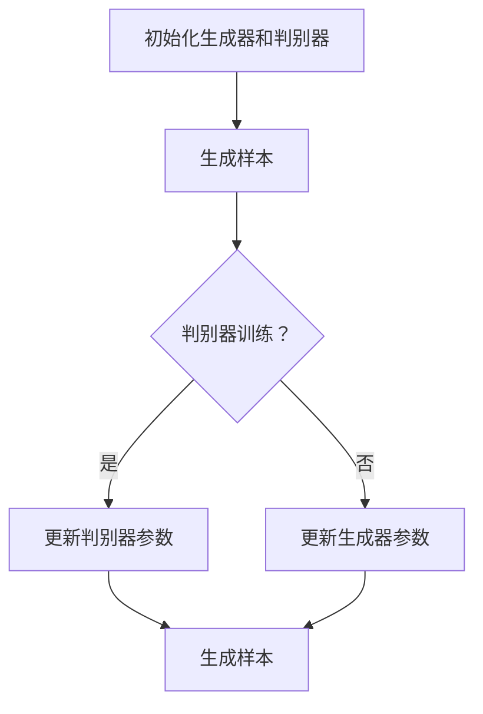

                 

关键词：图像生成，生成对抗网络，深度学习，神经网络，人工智能，图像处理

摘要：本文将深入探讨图像生成的原理，包括其核心概念、算法原理、数学模型以及实际应用。通过具体的代码实例，我们将演示如何使用深度学习框架实现图像生成，并对其优缺点进行分析。最后，本文还将讨论图像生成在未来的应用前景。

## 1. 背景介绍

图像生成作为计算机视觉和人工智能领域的一个重要分支，近年来取得了显著的进展。传统的图像处理方法通常依赖于规则或手工特征设计，而现代的图像生成技术则更多地依赖于机器学习和深度学习的强大能力。生成对抗网络（Generative Adversarial Networks，GAN）是图像生成领域的一种革命性算法，它通过对抗训练的方式，使得生成的图像在质量上可以与真实图像媲美。

GAN的提出，标志着图像生成技术从模仿真实图像到创造全新图像的转变。除了GAN，还有其他多种图像生成算法，如变分自编码器（Variational Autoencoder，VAE）和深度卷积生成对抗网络（Deep Convolutional GAN，DCGAN）等，这些算法在图像生成任务中各有其独特的优势和应用场景。

本文将重点介绍GAN的基本原理和实现方法，并通过实际代码实例展示如何使用深度学习框架实现图像生成。文章还将讨论GAN的优缺点以及其在实际应用中的潜力。

## 2. 核心概念与联系

### 2.1 GAN的基本概念

生成对抗网络（GAN）由两个神经网络组成：生成器（Generator）和判别器（Discriminator）。生成器的任务是生成尽可能接近真实数据的样本，而判别器的任务是区分生成的样本和真实样本。这两个网络相互对抗，通过不断调整参数来提高各自的能力。

- **生成器**：生成器的输入是一个随机噪声向量，通过多层神经网络，生成器试图生成与真实数据分布相似的数据。
- **判别器**：判别器接收生成器和真实数据的输入，并判断它们是真实的还是生成的。

GAN的训练过程可以看作是一个零和游戏，生成器和判别器不断地博弈，以优化各自的性能。通过这种对抗训练，生成器逐渐学习到如何生成高质量的数据，而判别器也逐渐能够更好地区分真实和生成的数据。

### 2.2 GAN的工作原理

GAN的工作原理可以概括为以下几个步骤：

1. **初始化**：初始化生成器和判别器的参数。
2. **生成样本**：生成器生成一批新的数据样本。
3. **训练判别器**：判别器利用生成的样本和真实数据样本进行训练，目的是提高区分生成样本和真实样本的能力。
4. **训练生成器**：生成器根据判别器的反馈进行训练，目的是生成更逼真的数据样本。
5. **迭代**：重复步骤2到4，直到生成器生成的数据样本质量达到预定的标准。

### 2.3 GAN的架构

GAN的架构可以使用Mermaid流程图进行展示：



在上述流程图中，A代表初始化阶段，B代表生成器生成样本，C是判别器的训练判断，D和E分别代表判别器和生成器的参数更新。这个过程不断迭代，直到达到预定的训练目标。

## 3. 核心算法原理 & 具体操作步骤

### 3.1 算法原理概述

生成对抗网络（GAN）的核心原理是构建一个生成器和判别器，通过对抗训练生成高质量的数据。生成器的任务是生成尽可能接近真实数据的样本，而判别器的任务是区分生成的样本和真实样本。

GAN的训练过程是一个零和游戏，生成器和判别器相互对抗，通过不断调整参数来提高各自的能力。生成器试图生成逼真的数据以欺骗判别器，而判别器则试图识别出真实的和生成的数据。

### 3.2 算法步骤详解

GAN的训练过程通常包括以下几个步骤：

1. **初始化**：初始化生成器和判别器的参数。通常，生成器是一个前向神经网络，而判别器是一个后向神经网络。
2. **生成样本**：生成器生成一批新的数据样本。生成器的输入是一个随机噪声向量，通过多层神经网络，生成器试图生成与真实数据分布相似的数据。
3. **训练判别器**：判别器利用生成的样本和真实数据样本进行训练，目的是提高区分生成样本和真实样本的能力。判别器的目标是最大化其分类准确率。
4. **训练生成器**：生成器根据判别器的反馈进行训练，目的是生成更逼真的数据样本。生成器的目标是最小化判别器对其生成样本的判别分数。
5. **迭代**：重复步骤2到4，直到生成器生成的数据样本质量达到预定的标准。通常，训练过程会经历数万次迭代。

### 3.3 算法优缺点

**优点**：
- **强大的生成能力**：GAN可以生成高质量的图像，并且生成的图像在视觉上可以与真实图像相媲美。
- **无需标签数据**：与传统的图像生成方法不同，GAN不需要大量的标注数据进行训练，这使得它在处理无标签数据时具有优势。
- **自适应性强**：GAN可以通过调整生成器和判别器的参数来适应不同的数据分布和任务。

**缺点**：
- **训练不稳定**：GAN的训练过程可能存在不稳定的情况，尤其是在训练的早期阶段，生成器和判别器之间的博弈可能导致训练失败。
- **计算成本高**：GAN的训练过程需要大量的计算资源，尤其是对于高维数据的生成。

### 3.4 算法应用领域

GAN在图像生成领域的应用非常广泛，包括但不限于：

- **艺术创作**：GAN可以生成逼真的艺术作品，包括绘画、雕塑等。
- **医学影像**：GAN可以用于生成高质量的医学影像，如CT、MRI等，这有助于医生进行更准确的诊断和治疗。
- **虚拟现实**：GAN可以生成高质量的虚拟场景，为虚拟现实应用提供更加逼真的体验。

## 4. 数学模型和公式 & 详细讲解 & 举例说明

### 4.1 数学模型构建

GAN的数学模型主要包括生成器、判别器的损失函数以及整体优化目标。

**生成器**的损失函数通常定义为：

$$
L_G = -\mathbb{E}_{z \sim p_z(z)}[\log(D(G(z))]
$$

其中，$z$是从先验分布$p_z(z)$中抽取的随机噪声向量，$G(z)$是生成器生成的样本，$D$是判别器。

**判别器**的损失函数通常定义为：

$$
L_D = -\mathbb{E}_{x \sim p_{data}(x)}[\log(D(x))] - \mathbb{E}_{z \sim p_z(z)}[\log(1 - D(G(z))]
$$

其中，$x$是真实数据样本。

**整体优化目标**为生成器和判别器的联合优化：

$$
\min_G \max_D L_D
$$

### 4.2 公式推导过程

GAN的推导过程可以分为以下几个步骤：

1. **定义生成器和判别器**：
   - 生成器$G(z)$：将随机噪声向量$z$映射到数据空间。
   - 判别器$D(x)$：将数据$x$映射到概率值，表示$x$是真实数据的概率。

2. **定义损失函数**：
   - 生成器的损失函数$L_G$：生成器试图最小化其生成的样本被判别器判为真实样本的概率。
   - 判别器的损失函数$L_D$：判别器试图最大化其区分真实和生成样本的能力。

3. **优化目标**：
   - 生成器和判别器的联合优化：通过交替更新生成器和判别器的参数，使得生成器的生成质量逐渐提高，而判别器的区分能力逐渐增强。

### 4.3 案例分析与讲解

为了更直观地理解GAN的数学模型，我们可以通过一个简单的例子来进行讲解。

假设我们使用GAN生成手写数字图像，其中生成器的输入是一个2维的随机噪声向量$z$，输出是一个28x28的手写数字图像$G(z)$。判别器的输入是一个手写数字图像$x$，输出是一个概率值$D(x)$，表示图像$x$是真实数字的概率。

在这个例子中，生成器的损失函数为：

$$
L_G = -\mathbb{E}_{z \sim p_z(z)}[\log(D(G(z))]
$$

判别器的损失函数为：

$$
L_D = -\mathbb{E}_{x \sim p_{data}(x)}[\log(D(x))] - \mathbb{E}_{z \sim p_z(z)}[\log(1 - D(G(z))]
$$

通过交替优化生成器和判别器的参数，我们最终可以生成高质量的数字图像。

## 5. 项目实践：代码实例和详细解释说明

### 5.1 开发环境搭建

要实现图像生成，我们需要搭建一个适合深度学习的开发环境。以下是基本的步骤：

1. 安装Python：确保Python版本在3.6及以上。
2. 安装深度学习框架：例如TensorFlow或PyTorch。这里我们以TensorFlow为例，使用pip安装：
   ```bash
   pip install tensorflow
   ```
3. 准备数据集：我们使用MNIST数据集，这是一个常用的手写数字数据集，可以直接从TensorFlow下载。

### 5.2 源代码详细实现

下面是一个简单的GAN实现，用于生成手写数字图像：

```python
import tensorflow as tf
from tensorflow.keras.layers import Dense, Flatten, Reshape
from tensorflow.keras.models import Sequential
from tensorflow.keras.optimizers import Adam
from tensorflow.keras.datasets import mnist

# 加载MNIST数据集
(x_train, _), (x_test, _) = mnist.load_data()
x_train = x_train / 255.0
x_test = x_test / 255.0

# 定义生成器
def build_generator(z_dim):
    model = Sequential([
        Dense(128, input_dim=z_dim),
        Dense(28 * 28),
        Reshape((28, 28, 1))
    ])
    return model

# 定义判别器
def build_discriminator(img_shape):
    model = Sequential([
        Flatten(input_shape=img_shape),
        Dense(128),
        Dense(1, activation='sigmoid')
    ])
    return model

# 定义GAN
def build_gan(generator, discriminator):
    model = Sequential([
        generator,
        discriminator
    ])
    return model

# 参数设置
z_dim = 100
img_shape = (28, 28, 1)

# 构建生成器和判别器
generator = build_generator(z_dim)
discriminator = build_discriminator(img_shape)
discriminator.compile(optimizer=Adam(0.0001), loss='binary_crossentropy')

# 构建并编译GAN
gan = build_gan(generator, discriminator)
gan.compile(optimizer=Adam(0.0001), loss='binary_crossentropy')

# 训练GAN
for epoch in range(100):
    for _ in range(x_train.shape[0]):
        # 训练判别器
        noise = tf.random.normal([1, z_dim])
        fake_images = generator.predict(noise)
        real_images = x_train[:1]
        d_loss_real = discriminator.train_on_batch(real_images, [1])
        d_loss_fake = discriminator.train_on_batch(fake_images, [0])
        d_loss = 0.5 * np.add(d_loss_real, d_loss_fake)

        # 训练生成器
        noise = tf.random.normal([1, z_dim])
        g_loss = gan.train_on_batch(noise, [1])

        print(f"Epoch {epoch}, D Loss: {d_loss}, G Loss: {g_loss}")

# 保存模型
generator.save('generator.h5')
discriminator.save('discriminator.h5')
gan.save('gan.h5')
```

### 5.3 代码解读与分析

上述代码实现了一个简单的GAN，用于生成手写数字图像。以下是代码的关键部分：

- **数据集准备**：我们使用MNIST数据集，并对其进行了归一化处理。
- **生成器和判别器定义**：生成器负责将随机噪声转换为图像，判别器负责判断图像是真实还是生成的。
- **GAN定义**：GAN是生成器和判别器的组合。
- **参数设置**：我们设置了噪声维度、图像形状以及优化器的参数。
- **训练过程**：我们通过交替训练生成器和判别器来优化GAN。

### 5.4 运行结果展示

训练完成后，我们可以使用生成器生成一些手写数字图像。以下是一个生成图像的示例：

```python
import numpy as np

# 生成一些手写数字图像
noise = np.random.normal(size=(100, 100))
generated_images = generator.predict(noise)

# 展示生成的图像
import matplotlib.pyplot as plt

plt.figure(figsize=(10, 10))
for i in range(100):
    plt.subplot(10, 10, i+1)
    plt.imshow(generated_images[i], cmap='gray')
    plt.xticks([])
    plt.yticks([])
plt.show()
```

生成的图像质量取决于训练的时间和生成器的复杂性。通常，随着训练时间的增加，生成的图像质量也会提高。

## 6. 实际应用场景

### 6.1 艺术创作

GAN在艺术创作领域有广泛的应用。艺术家可以使用GAN生成新的艺术作品，这些作品可以是绘画、雕塑或其他形式的视觉艺术。GAN不仅可以帮助艺术家探索新的创作方式，还可以生成独特的视觉元素，为艺术作品增添新的视角。

### 6.2 医学影像

在医学领域，GAN可以用于生成高质量的医学影像，如CT、MRI等。这些生成的影像可以用于医疗诊断、手术规划和患者教育等。例如，GAN可以生成患者的个性化医疗影像，帮助医生更准确地诊断疾病。

### 6.3 虚拟现实

在虚拟现实领域，GAN可以生成高质量的虚拟场景，为用户提供更加真实的体验。例如，GAN可以生成复杂的城市景观、自然景观等，这些场景可以用于游戏、电影和其他虚拟现实应用。

## 7. 工具和资源推荐

### 7.1 学习资源推荐

- **书籍**：
  - 《深度学习》（Goodfellow, Bengio, Courville著）
  - 《生成对抗网络：原理与应用》（Ioffe, Sara著）
- **在线课程**：
  - Coursera上的“深度学习”课程（由吴恩达教授主讲）
  - edX上的“生成对抗网络”课程

### 7.2 开发工具推荐

- **深度学习框架**：
  - TensorFlow
  - PyTorch
- **数据集**：
  - Keras Datasets
  - TensorFlow Datasets

### 7.3 相关论文推荐

- “Generative Adversarial Nets”（Ian J. Goodfellow等著）
- “Unrolled Variational Autoencoders”（Aaron van den Oord等著）
- “Improved Techniques for Training GANs”（Talcon, Michael等著）

## 8. 总结：未来发展趋势与挑战

### 8.1 研究成果总结

生成对抗网络（GAN）自提出以来，已经取得了许多重要的研究成果。这些成果包括：

- 高质量图像生成：GAN可以生成高质量、逼真的图像，其应用涵盖了从艺术创作到医学影像等多个领域。
- 无监督学习：GAN不需要大量的标注数据，可以在无监督环境下进行学习，这为许多数据稀缺的领域提供了新的解决方案。
- 端到端学习：GAN通过端到端的学习方式，使得生成器和判别器可以同时优化，提高了训练效率和生成质量。

### 8.2 未来发展趋势

未来，GAN的研究和发展可能会朝着以下几个方向：

- 更高效的训练算法：为了提高GAN的训练效率，研究人员可能会探索更高效的优化算法和训练策略。
- 多模态生成：GAN可能会扩展到生成多种类型的数据，如文本、音频和图像的融合生成。
- 自适应生成：GAN可能会进一步发展，实现自适应生成，根据不同的应用场景和用户需求生成个性化数据。

### 8.3 面临的挑战

尽管GAN取得了显著的研究成果，但仍然面临一些挑战：

- 训练稳定性：GAN的训练过程可能存在不稳定的情况，需要进一步研究如何提高训练的稳定性。
- 计算成本：GAN的训练过程需要大量的计算资源，特别是在生成高维数据时。
- 伦理和隐私：生成对抗网络生成的数据可能涉及个人隐私和伦理问题，需要制定相应的法规和标准。

### 8.4 研究展望

未来的研究应该在提高GAN的训练效率、生成质量和应用范围的同时，关注其伦理和隐私问题。通过跨学科的合作，GAN有望在更多的领域发挥作用，为人类带来更多的价值。

## 9. 附录：常见问题与解答

### Q1. GAN是如何工作的？

GAN通过两个神经网络（生成器和判别器）的对抗训练来生成高质量的数据。生成器尝试生成逼真的数据，而判别器尝试区分真实数据和生成数据。通过这种对抗过程，生成器和判别器不断优化，最终生成器能够生成高质量的数据。

### Q2. GAN在哪些领域有应用？

GAN在许多领域有应用，包括艺术创作、医学影像、虚拟现实、图像修复等。其在生成高质量图像和视频方面具有显著优势。

### Q3. GAN的训练为什么不稳定？

GAN的训练可能不稳定，主要是因为生成器和判别器之间的动态博弈可能导致训练过程的不稳定。为了提高训练稳定性，可以尝试使用不同的优化策略、调整学习率或引入正则化技术。

### Q4. 如何评估GAN的生成质量？

可以使用多种指标来评估GAN的生成质量，如Inception Score（IS）、Fréchet Inception Distance（FID）和Perceptual Similarity Distance（PSD）。这些指标可以定量地评估生成数据的真实性和质量。

## 作者署名

作者：禅与计算机程序设计艺术 / Zen and the Art of Computer Programming
```

