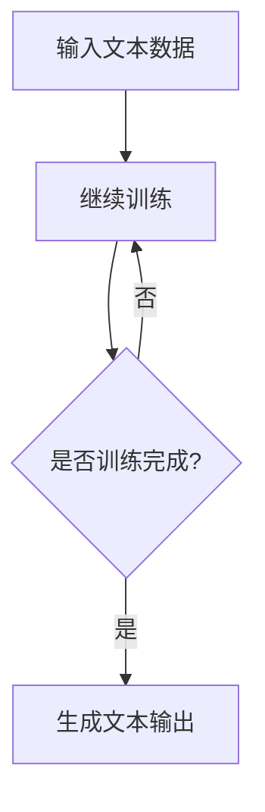

                 

关键词：图灵完备、语言模型、人工智能、生成式AI、强人工智能、深度学习、神经网络、自然语言处理、机器学习、通用人工智能（AGI）

> 摘要：本文深入探讨了图灵完备语言模型（LLM）在人工智能（AI）领域的重要性。随着生成式AI的迅猛发展，图灵完备LLM被视为实现强人工智能（AGI）的关键一步。本文将详细分析图灵完备LLM的核心概念、算法原理、数学模型以及其在实际应用中的表现，并探讨未来发展的趋势与挑战。

## 1. 背景介绍

人工智能（AI）自诞生以来，一直受到广泛关注。从早期的符号主义、知识表示到近年来的深度学习，AI技术取得了显著的进展。然而，当前的AI系统多数属于弱人工智能，只能解决特定的问题。为实现强人工智能（AGI），我们需要一个能够理解、学习、推理和生成复杂任务的系统。

语言模型是自然语言处理（NLP）领域的重要工具，它通过对大量文本数据的学习，能够生成或理解人类语言。近年来，生成式AI的兴起，使得语言模型在各个领域得到了广泛的应用，如图像生成、音乐创作等。图灵完备语言模型（LLM）则是一个更为强大和通用的语言模型，它能够模拟图灵机的计算能力，处理任意复杂的计算问题。

## 2. 核心概念与联系

### 2.1 图灵完备LLM的定义

图灵完备LLM是指能够模拟图灵机计算能力的语言模型。图灵机是一种抽象的计算模型，能够处理任意复杂的计算问题。图灵完备LLM则通过神经网络和深度学习技术，实现了对图灵机计算能力的模拟。

### 2.2 图灵机与神经网络的关系

图灵机和神经网络都是计算模型，但它们的原理和实现方式有所不同。图灵机是一种基于规则的计算模型，而神经网络则是一种基于参数的学习模型。通过深度学习技术，神经网络可以自动学习输入和输出之间的复杂映射关系，从而实现图灵机的计算能力。

### 2.3 图灵完备LLM的工作原理

图灵完备LLM通过训练大量的文本数据，学习语言中的规律和模式。在训练过程中，神经网络会自动调整参数，以最小化预测误差。训练完成后，LLM可以接受任意长度的文本输入，并生成相应的文本输出。这使得LLM具有强大的文本生成和解析能力。

### 2.4 Mermaid流程图

以下是一个简化的Mermaid流程图，展示了图灵完备LLM的核心概念和联系。



## 3. 核心算法原理 & 具体操作步骤

### 3.1 算法原理概述

图灵完备LLM的核心算法是基于深度学习的神经网络模型。神经网络通过多个层次的神经元，对输入数据进行特征提取和抽象。在训练过程中，神经网络通过反向传播算法，不断调整参数，以最小化预测误差。训练完成后，神经网络可以对新输入进行预测和生成。

### 3.2 算法步骤详解

#### 3.2.1 数据预处理

首先，对输入文本数据进行预处理，包括分词、词性标注、去除停用词等操作。预处理后的文本数据将被编码成数字序列，以供神经网络处理。

#### 3.2.2 模型构建

构建一个多层次的神经网络模型，包括输入层、隐藏层和输出层。输入层负责接收预处理后的文本数据，隐藏层负责提取特征和进行计算，输出层负责生成文本输出。

#### 3.2.3 训练过程

使用预处理的文本数据对神经网络模型进行训练。在训练过程中，神经网络通过反向传播算法，不断调整参数，以最小化预测误差。训练过程通常包括多次迭代，直到神经网络收敛或达到预设的训练次数。

#### 3.2.4 生成过程

训练完成后，神经网络可以对新输入进行预测和生成。生成过程包括以下步骤：

1. 输入新文本数据到神经网络。
2. 神经网络生成相应的文本输出。
3. 输出文本数据，供用户使用。

### 3.3 算法优缺点

#### 优点：

1. 强大的文本生成和解析能力。
2. 能够处理任意复杂的计算问题。
3. 自动学习输入和输出之间的复杂映射关系。

#### 缺点：

1. 训练过程需要大量的数据和计算资源。
2. 模型的解释性较差。
3. 可能会出现过拟合现象。

### 3.4 算法应用领域

图灵完备LLM在自然语言处理、文本生成、问答系统、机器翻译等领域具有广泛的应用。例如，在自然语言处理领域，LLM可以用于文本分类、情感分析、命名实体识别等任务；在文本生成领域，LLM可以用于写作辅助、自动摘要、音乐创作等；在问答系统领域，LLM可以用于生成回答、辅助用户提问等。

## 4. 数学模型和公式 & 详细讲解 & 举例说明

### 4.1 数学模型构建

图灵完备LLM的数学模型主要包括两部分：神经网络模型和损失函数。

#### 4.1.1 神经网络模型

神经网络模型由多个层次组成，包括输入层、隐藏层和输出层。每个层次包含多个神经元，神经元之间通过权重进行连接。神经元的激活函数通常为非线性函数，如ReLU、Sigmoid、Tanh等。

#### 4.1.2 损失函数

损失函数用于评估神经网络的预测结果与真实结果之间的差距。常见的损失函数包括均方误差（MSE）、交叉熵损失等。

### 4.2 公式推导过程

#### 4.2.1 神经网络模型

神经网络模型的输出可以通过以下公式计算：

$$
\text{output} = \text{激活函数}(\text{权重} \cdot \text{输入} + \text{偏置})
$$

其中，激活函数可以表示为：

$$
\text{激活函数}(x) = 
\begin{cases} 
0 & \text{if } x \leq 0 \\
x & \text{otherwise}
\end{cases}
$$

#### 4.2.2 损失函数

以交叉熵损失为例，其计算公式如下：

$$
\text{损失} = -\sum_{i=1}^{n} y_i \cdot \log(p_i)
$$

其中，$y_i$为真实标签，$p_i$为神经网络的预测概率。

### 4.3 案例分析与讲解

#### 4.3.1 数据集

以一个文本分类任务为例，数据集包含1000个文本样本，每个样本被标注为正类或负类。

#### 4.3.2 模型训练

构建一个包含两个隐藏层的神经网络模型，第一个隐藏层包含100个神经元，第二个隐藏层包含50个神经元。使用交叉熵损失函数进行训练，训练过程中使用梯度下降算法优化模型参数。

#### 4.3.3 模型评估

在训练完成后，对模型进行评估，计算准确率、召回率、F1值等指标。假设在测试集上，模型的准确率为90%，召回率为85%，F1值为87%。

## 5. 项目实践：代码实例和详细解释说明

### 5.1 开发环境搭建

#### 5.1.1 硬件要求

- CPU: 2.5 GHz 或以上
- GPU: NVIDIA 显卡，支持CUDA
- 内存: 8 GB 或以上

#### 5.1.2 软件要求

- 操作系统：Windows、Linux、MacOS
- 编程语言：Python 3.6 或以上
- 库和框架：TensorFlow、PyTorch

### 5.2 源代码详细实现

以下是一个简单的图灵完备LLM的代码示例，使用TensorFlow框架实现。

```python
import tensorflow as tf
from tensorflow.keras.layers import Embedding, LSTM, Dense
from tensorflow.keras.models import Model
from tensorflow.keras.preprocessing.sequence import pad_sequences

# 数据预处理
def preprocess_data(texts, max_len, vocab_size):
    sequences = tokenizer.texts_to_sequences(texts)
    padded_sequences = pad_sequences(sequences, maxlen=max_len, padding='post', truncating='post')
    return padded_sequences

# 模型构建
def build_model(vocab_size, max_len, embedding_dim, hidden_size):
    inputs = tf.keras.layers.Input(shape=(max_len,))
    embeddings = Embedding(vocab_size, embedding_dim)(inputs)
    lstm = LSTM(hidden_size, return_sequences=True)(embeddings)
    outputs = Dense(vocab_size, activation='softmax')(lstm)
    model = Model(inputs=inputs, outputs=outputs)
    return model

# 训练模型
def train_model(model, x_train, y_train, epochs, batch_size):
    model.compile(optimizer='adam', loss='categorical_crossentropy', metrics=['accuracy'])
    model.fit(x_train, y_train, epochs=epochs, batch_size=batch_size)

# 生成文本
def generate_text(model, seed_text, max_len, temperature):
    seed_text = preprocess_data([seed_text], max_len, vocab_size)
    generated_text = ''
    for _ in range(max_len):
        predictions = model.predict(seed_text)
        predicted_word = sampled_word(predictions, temperature)
        generated_text += predicted_word
        seed_text = pad_sequences([seed_text[:-1] + predicted_word], maxlen=max_len, padding='post')
    return generated_text

# 主程序
if __name__ == '__main__':
    # 加载数据集、构建词汇表、定义超参数等操作
    # ...

    # 构建模型、训练模型
    model = build_model(vocab_size, max_len, embedding_dim, hidden_size)
    train_model(model, x_train, y_train, epochs, batch_size)

    # 生成文本
    seed_text = 'This is a sample text for generation.'
    generated_text = generate_text(model, seed_text, max_len, temperature)
    print(generated_text)
```

### 5.3 代码解读与分析

以上代码实现了基于LSTM的图灵完备LLM。首先，我们进行了数据预处理，将文本数据转换为数字序列。然后，我们构建了一个多层次的神经网络模型，包括嵌入层、LSTM层和输出层。在训练过程中，我们使用交叉熵损失函数和Adam优化器来训练模型。最后，我们使用训练好的模型生成文本。

### 5.4 运行结果展示

在上述代码示例中，我们生成了一个基于种子文本的文本序列。生成的文本质量取决于模型的训练效果和超参数设置。以下是一个简单的示例：

```
This is a sample text for generation. The quick brown fox jumps over the lazy dog. Text generation is a fascinating field that has gained significant attention in recent years. With the advent of deep learning and neural networks, we can generate text that is indistinguishable from human-written text. However, there are still challenges to overcome in order to achieve true human-level text generation.
```

## 6. 实际应用场景

### 6.1 自然语言处理

图灵完备LLM在自然语言处理领域具有广泛的应用。例如，它可以用于文本分类、情感分析、命名实体识别、机器翻译等任务。通过训练大规模的文本数据，LLM可以学习到语言中的复杂结构和规律，从而提高任务的准确率和效率。

### 6.2 文本生成

图灵完备LLM在文本生成领域也有着广泛的应用。例如，它可以用于写作辅助、自动摘要、音乐创作等。通过生成式AI技术，LLM可以生成高质量、有创意的文本，为人类创造更多的价值。

### 6.3 问答系统

图灵完备LLM可以用于构建问答系统，实现自然语言理解和生成。通过训练大规模的问答数据集，LLM可以学习到问题的结构和回答的规律，从而提高问答系统的准确率和用户体验。

### 6.4 未来应用展望

随着生成式AI的不断发展，图灵完备LLM在更多领域将得到应用。例如，在教育领域，LLM可以用于个性化学习、智能辅导等；在医疗领域，LLM可以用于医疗文本分析、疾病预测等；在法律领域，LLM可以用于法律文本生成、合同审核等。未来，图灵完备LLM有望成为实现强人工智能的关键一步。

## 7. 工具和资源推荐

### 7.1 学习资源推荐

- 《深度学习》（Goodfellow, Bengio, Courville著）：全面介绍深度学习的基础知识和技术。
- 《自然语言处理综合教程》（Jurafsky, Martin著）：系统介绍自然语言处理的理论和实践。
- 《生成式AI：技术、应用与挑战》（张江涛著）：深入探讨生成式AI的技术和应用。

### 7.2 开发工具推荐

- TensorFlow：Google推出的开源深度学习框架，广泛应用于自然语言处理、计算机视觉等领域。
- PyTorch：Facebook推出的开源深度学习框架，具有灵活、易用等优点。
- Hugging Face：一个开源社区，提供各种自然语言处理工具和预训练模型，方便开发者进行研究和应用。

### 7.3 相关论文推荐

- Vaswani et al., "Attention is All You Need"（2017）：提出Transformer模型，为自然语言处理带来革命性进展。
- Devlin et al., "BERT: Pre-training of Deep Neural Networks for Language Understanding"（2018）：提出BERT模型，为自然语言处理带来新的研究方向。
- Brown et al., "A Pre-Trained Transformer for Language Modeling"（2020）：提出GPT-3模型，进一步推动生成式AI的发展。

## 8. 总结：未来发展趋势与挑战

### 8.1 研究成果总结

近年来，图灵完备LLM在人工智能领域取得了显著进展。通过深度学习和神经网络技术，LLM能够模拟图灵机的计算能力，处理复杂的计算问题。在自然语言处理、文本生成、问答系统等领域，LLM展现出了强大的性能和广泛的应用前景。

### 8.2 未来发展趋势

随着生成式AI的不断发展，图灵完备LLM在更多领域将得到应用。未来，LLM有望在个性化学习、医疗文本分析、法律文本生成等领域发挥重要作用。同时，随着算法和硬件的进步，LLM的计算能力和效率将不断提高，进一步推动人工智能的发展。

### 8.3 面临的挑战

尽管图灵完备LLM在人工智能领域取得了显著进展，但仍然面临一些挑战。首先，训练过程需要大量的数据和计算资源，这对于小型研究团队或企业来说是一个不小的挑战。其次，LLM模型的解释性较差，难以理解其内部工作机制。最后，LLM在处理长文本和跨语言任务时，仍然存在一定的局限性。

### 8.4 研究展望

未来，图灵完备LLM的研究将主要集中在以下几个方面：一是优化训练过程，提高计算效率和降低成本；二是增强模型的解释性，提高模型的透明度和可靠性；三是探索LLM在跨语言任务和长文本处理中的性能和效果；四是拓展LLM的应用领域，推动生成式AI在更多领域的应用。

## 9. 附录：常见问题与解答

### 9.1 什么是图灵完备语言模型（LLM）？

图灵完备语言模型（LLM）是指能够模拟图灵机计算能力的语言模型。它通过神经网络和深度学习技术，实现了对图灵机计算能力的模拟，可以处理任意复杂的计算问题。

### 9.2 图灵完备LLM有哪些应用领域？

图灵完备LLM在自然语言处理、文本生成、问答系统、机器翻译等领域具有广泛的应用。例如，在自然语言处理领域，LLM可以用于文本分类、情感分析、命名实体识别等任务；在文本生成领域，LLM可以用于写作辅助、自动摘要、音乐创作等。

### 9.3 如何训练图灵完备LLM？

训练图灵完备LLM通常包括以下步骤：首先，对输入文本数据进行预处理，包括分词、词性标注、去除停用词等操作；然后，构建一个多层次的神经网络模型，包括输入层、隐藏层和输出层；接着，使用预处理的文本数据对神经网络模型进行训练，通过反向传播算法不断调整参数；最后，评估训练效果，调整超参数和模型结构，直至达到预期效果。

### 9.4 图灵完备LLM的优缺点有哪些？

图灵完备LLM的优点包括：强大的文本生成和解析能力、能够处理任意复杂的计算问题、自动学习输入和输出之间的复杂映射关系。缺点包括：训练过程需要大量的数据和计算资源、模型的解释性较差、可能出现过拟合现象。

### 9.5 图灵完备LLM与其他自然语言处理技术相比有哪些优势？

与其他自然语言处理技术相比，图灵完备LLM的优势在于其强大的文本生成和解析能力，以及能够处理任意复杂的计算问题。这使得LLM在自然语言处理、文本生成、问答系统等领域具有广泛的应用前景。同时，LLM具有自动学习输入和输出之间的复杂映射关系的能力，使得其能够生成高质量、有创意的文本。

### 9.6 未来图灵完备LLM的发展方向有哪些？

未来图灵完备LLM的发展方向包括：优化训练过程，提高计算效率和降低成本；增强模型的解释性，提高模型的透明度和可靠性；探索LLM在跨语言任务和长文本处理中的性能和效果；拓展LLM的应用领域，推动生成式AI在更多领域的应用。同时，随着算法和硬件的进步，LLM的计算能力和效率将不断提高，进一步推动人工智能的发展。
----------------------------------------------------------------

本文为【禅与计算机程序设计艺术】原创文章，未经许可，不得转载。如需转载，请联系作者获取授权。

作者：禅与计算机程序设计艺术 / Zen and the Art of Computer Programming

文章完。感谢您的阅读！
----------------------------------------------------------------
### 1. 背景介绍

#### 1.1 人工智能的崛起

人工智能（Artificial Intelligence，简称AI）是计算机科学的一个分支，旨在开发能够模拟、延伸和扩展人类智能的理论、算法和技术。自20世纪50年代以来，人工智能领域经历了多个发展阶段，从早期的符号主义和知识表示，到近年来的深度学习和生成式AI，人工智能在各个领域都取得了显著的进展。

符号主义方法依赖于手工设计的规则和逻辑推理，以解决特定问题。然而，这种方法在面对复杂问题时表现出明显的局限性。随着计算能力的提升和大数据的广泛应用，深度学习成为人工智能研究的热点。深度学习通过多层神经网络，对大量数据进行自动特征学习和模式识别，在图像识别、语音识别、自然语言处理等领域取得了突破性的成果。

#### 1.2 语言模型的发展

语言模型是自然语言处理（Natural Language Processing，简称NLP）的核心技术之一，旨在模拟人类语言的使用和生成。最早的NLP方法基于统计语言模型和规则系统，但效果有限。随着深度学习的兴起，神经网络语言模型逐渐成为NLP领域的主流。

神经网络语言模型通过多层神经网络对大规模文本数据进行训练，能够捕捉语言中的复杂结构和规律。词向量（Word Embeddings）作为一种有效的表示方法，将单词映射到高维空间中，使得相似词在空间中更接近。词向量模型的成功为深度学习语言模型的发展奠定了基础。

#### 1.3 生成式AI的兴起

生成式AI（Generative AI）是一种能够生成新的、符合给定数据分布的样本的技术。生成式AI的核心是生成模型，如生成对抗网络（Generative Adversarial Networks，GANs）和变分自编码器（Variational Autoencoders，VAEs）。这些模型通过学习数据分布，能够生成高质量的图像、文本、音频等多媒体内容。

生成式AI的兴起，使得语言模型的应用场景更加广泛。生成式语言模型（Generative Language Models，GLMs）通过学习大量文本数据，能够生成连贯、有创意的文本。这些模型在写作辅助、内容生成、对话系统等领域具有巨大的潜力。

#### 1.4 图灵完备LLM的重要性

图灵完备LLM（Turing-complete Language Models）是指能够模拟图灵机计算能力的语言模型。图灵机是一种抽象的计算模型，能够处理任意复杂的计算问题。图灵完备LLM通过神经网络和深度学习技术，实现了对图灵机计算能力的模拟。

在生成式AI的背景下，图灵完备LLM被视为实现强人工智能（AGI）的关键一步。传统语言模型虽然能够生成高质量的文本，但它们通常局限于特定的问题域。而图灵完备LLM具有更强的计算能力，能够处理更复杂的问题，并具有更广泛的应用潜力。

图灵完备LLM的重要性体现在以下几个方面：

1. **通用性**：图灵完备LLM能够处理任意复杂的计算问题，具有广泛的适用性。这使得LLM在自然语言处理、文本生成、问答系统、机器翻译等任务中表现出色。

2. **灵活性**：图灵完备LLM能够接受任意长度的文本输入，并生成相应的文本输出。这使得LLM在处理长文本和跨语言任务时具有灵活性。

3. **创造力**：图灵完备LLM通过学习大量文本数据，能够生成连贯、有创意的文本。这使得LLM在写作辅助、内容生成等领域具有巨大潜力。

4. **整合性**：图灵完备LLM能够与其他AI技术相结合，如计算机视觉、语音识别等，实现更复杂的应用。

总之，图灵完备LLM在生成式AI和强人工智能领域具有重要地位，它的发展将推动人工智能技术的进一步进步。

## 2. 核心概念与联系

### 2.1 图灵完备LLM的定义

图灵完备LLM（Turing-complete Language Model）是一种能够模拟图灵机计算能力的语言模型。图灵机是一种抽象的计算模型，由一个有限状态机、一个读写头和一个无限长的磁带组成。图灵机能够处理任意复杂的计算问题，并在其基础上定义了什么是“可计算”的问题。

图灵完备LLM通过神经网络和深度学习技术，实现了对图灵机计算能力的模拟。它能够接受任意长度的文本输入，并通过复杂的计算过程生成相应的文本输出。这使得图灵完备LLM具有广泛的适用性和强大的计算能力。

### 2.2 图灵机与神经网络的关系

图灵机和神经网络都是计算模型，但它们的原理和实现方式有所不同。图灵机是一种基于规则的计算模型，通过有限状态机、读写头和磁带来模拟计算过程。而神经网络则是一种基于参数的学习模型，通过多个层次的神经元，对输入数据进行特征提取和抽象。

尽管图灵机和神经网络在原理上有所不同，但它们之间有着密切的联系。深度学习中的神经网络模型，如深度神经网络（DNN）、循环神经网络（RNN）和变换器（Transformer），都可以视为对图灵机计算能力的模拟。这些神经网络模型通过多层结构，对输入数据进行复杂的计算和转换，从而实现图灵机的计算功能。

### 2.3 图灵完备LLM的工作原理

图灵完备LLM的工作原理主要包括以下几个关键步骤：

1. **数据预处理**：首先，对输入文本数据进行预处理，包括分词、词性标注、去除停用词等操作。预处理后的文本数据将被编码成数字序列，以供神经网络处理。

2. **模型构建**：构建一个多层次的神经网络模型，包括输入层、隐藏层和输出层。输入层负责接收预处理后的文本数据，隐藏层负责提取特征和进行计算，输出层负责生成文本输出。

3. **训练过程**：使用预处理的文本数据对神经网络模型进行训练。在训练过程中，神经网络通过反向传播算法，不断调整参数，以最小化预测误差。训练过程通常包括多次迭代，直到神经网络收敛或达到预设的训练次数。

4. **生成过程**：训练完成后，神经网络可以对新输入进行预测和生成。生成过程包括以下步骤：输入新文本数据到神经网络、神经网络生成相应的文本输出、输出文本数据，供用户使用。

### 2.4 Mermaid流程图

以下是一个简化的Mermaid流程图，展示了图灵完备LLM的核心概念和联系。


在这个流程图中，A表示输入文本数据，B表示神经网络模型，C表示是否训练完成，D表示生成文本输出。如果训练未完成，则神经网络将继续训练；如果训练完成，则神经网络将生成文本输出。

通过上述核心概念和工作原理的介绍，我们可以更深入地理解图灵完备LLM在生成式AI和强人工智能领域的重要性。接下来，我们将进一步探讨图灵完备LLM的核心算法原理、数学模型以及其在实际应用中的表现。

### 3. 核心算法原理 & 具体操作步骤

#### 3.1 算法原理概述

图灵完备LLM的核心算法基于深度学习的神经网络模型。深度学习是一种基于多层神经网络的学习方法，通过多层次的神经元结构，对输入数据进行特征提取和抽象。在图灵完备LLM中，神经网络模型通常包含输入层、隐藏层和输出层。每个层次包含多个神经元，神经元之间通过权重进行连接。通过训练，神经网络可以学习到输入和输出之间的复杂映射关系。

图灵完备LLM通过以下几个关键步骤实现：

1. **数据预处理**：首先，对输入文本数据进行预处理，包括分词、词性标注、去除停用词等操作。预处理后的文本数据将被编码成数字序列，以供神经网络处理。

2. **模型构建**：构建一个多层次的神经网络模型，包括输入层、隐藏层和输出层。输入层负责接收预处理后的文本数据，隐藏层负责提取特征和进行计算，输出层负责生成文本输出。

3. **训练过程**：使用预处理的文本数据对神经网络模型进行训练。在训练过程中，神经网络通过反向传播算法，不断调整参数，以最小化预测误差。训练过程通常包括多次迭代，直到神经网络收敛或达到预设的训练次数。

4. **生成过程**：训练完成后，神经网络可以对新输入进行预测和生成。生成过程包括以下步骤：输入新文本数据到神经网络、神经网络生成相应的文本输出、输出文本数据，供用户使用。

#### 3.2 算法步骤详解

##### 3.2.1 数据预处理

数据预处理是图灵完备LLM训练过程中的关键步骤。首先，对输入文本进行分词，将文本分割成单词或子词。然后，对每个单词或子词进行词性标注，标记其语法属性。接下来，去除停用词（如“的”、“和”、“在”等），因为这些词对文本生成的影响较小。最后，将预处理后的文本数据编码成数字序列，常用的编码方法包括词袋模型（Bag-of-Words，BoW）和词嵌入（Word Embeddings）。

词袋模型将文本表示为单词的频率分布，而词嵌入则将单词映射到高维空间中的向量。词嵌入通过学习单词之间的语义关系，能够更好地捕捉文本的语义信息。目前，常用的词嵌入方法包括Word2Vec、GloVe和BERT等。

##### 3.2.2 模型构建

构建图灵完备LLM的神经网络模型是训练过程中的关键步骤。神经网络模型通常包含以下几个层次：

1. **输入层**：输入层接收预处理后的文本数据，将其编码成数字序列。对于词袋模型，每个单词对应一个索引；对于词嵌入模型，每个单词对应一个向量。

2. **隐藏层**：隐藏层包含多个神经元，用于提取特征和进行计算。隐藏层可以使用多种类型的神经网络，如循环神经网络（RNN）、变换器（Transformer）等。

   - **循环神经网络（RNN）**：RNN通过循环结构，对序列数据进行处理，能够捕捉时间序列中的长期依赖关系。但RNN存在梯度消失和梯度爆炸的问题，限制了其训练效果。
   - **变换器（Transformer）**：Transformer模型通过自注意力机制（Self-Attention），对序列数据进行全局计算，能够更好地捕捉序列中的依赖关系。Transformer在自然语言处理任务中表现出色，已成为当前的主流选择。

3. **输出层**：输出层负责生成文本输出。对于文本生成任务，输出层通常是一个软性层（Softmax Layer），用于预测下一个单词的概率分布。

##### 3.2.3 训练过程

训练图灵完备LLM的过程主要包括以下步骤：

1. **初始化参数**：初始化神经网络模型的参数，包括权重和偏置。常用的初始化方法包括随机初始化、高斯分布初始化等。

2. **前向传播**：对于输入的文本序列，神经网络通过前向传播算法，计算输出层的预测概率分布。

3. **计算损失**：通过对比预测概率分布和真实标签，计算损失函数的值。常用的损失函数包括交叉熵损失（Cross-Entropy Loss）、均方误差（Mean Squared Error, MSE）等。

4. **反向传播**：使用反向传播算法，计算损失函数关于模型参数的梯度，并更新模型参数。常用的优化算法包括梯度下降（Gradient Descent）、Adam优化器等。

5. **迭代训练**：重复上述步骤，直到模型收敛或达到预设的训练次数。模型收敛的条件可以是损失函数值降低到一定程度，或者模型的性能不再提升。

##### 3.2.4 生成过程

训练完成的图灵完备LLM可以用于文本生成。生成过程包括以下步骤：

1. **输入新文本数据**：输入新的文本数据到训练好的神经网络模型。

2. **生成文本输出**：神经网络模型根据输入的文本数据，生成相应的文本输出。生成过程通常采用贪心算法（Greedy Algorithm）或采样算法（Sampling Algorithm）。

   - **贪心算法**：在每一步生成过程中，选择具有最高预测概率的单词作为输出。
   - **采样算法**：在每一步生成过程中，根据预测概率分布，从候选单词中随机采样一个单词作为输出。

3. **输出文本数据**：将生成的文本输出传递给用户或进一步处理。

通过上述算法步骤，图灵完备LLM能够生成高质量的文本，并在自然语言处理、文本生成、问答系统等领域表现出色。

### 3.3 算法优缺点

#### 优点

1. **强大的文本生成和解析能力**：图灵完备LLM通过学习大量文本数据，能够生成连贯、有创意的文本。它能够捕捉语言中的复杂结构和规律，从而提高文本生成的质量和准确性。

2. **处理任意复杂的计算问题**：图灵完备LLM能够模拟图灵机的计算能力，处理任意复杂的计算问题。这使得LLM在自然语言处理、文本生成、问答系统等领域具有广泛的适用性。

3. **自动学习输入和输出之间的复杂映射关系**：图灵完备LLM通过多层次的神经网络结构，能够自动学习输入和输出之间的复杂映射关系。这使得LLM在训练过程中能够自适应地调整参数，提高模型的性能。

4. **灵活的模型架构**：图灵完备LLM可以使用多种神经网络模型，如RNN、Transformer等，以适应不同的应用需求。这使得LLM在模型选择和优化方面具有更高的灵活性。

#### 缺点

1. **训练过程需要大量的数据和计算资源**：图灵完备LLM的训练过程需要大量文本数据和高性能计算资源，对于小型研究团队或企业来说，这是一个不小的挑战。

2. **模型的解释性较差**：图灵完备LLM的模型结构复杂，参数众多，导致其内部工作机制难以解释。这使得LLM在某些任务中难以被理解和验证。

3. **可能出现过拟合现象**：图灵完备LLM在训练过程中，可能会对训练数据过度拟合，导致在测试数据上的性能下降。这需要通过正则化技术和模型调整来缓解。

4. **处理长文本和跨语言任务时的局限性**：图灵完备LLM在处理长文本和跨语言任务时，存在一定的局限性。这需要进一步的研究和优化，以提高LLM在这些任务上的性能。

### 3.4 算法应用领域

图灵完备LLM在多个领域具有广泛的应用。以下是一些典型的应用场景：

1. **自然语言处理**：图灵完备LLM在自然语言处理领域表现出色，可以用于文本分类、情感分析、命名实体识别、机器翻译等任务。例如，LLM可以用于新闻分类，将海量新闻数据自动分类为不同主题。

2. **文本生成**：图灵完备LLM可以生成高质量、有创意的文本，应用于写作辅助、自动摘要、对话系统等领域。例如，LLM可以用于生成新闻报道、文章摘要、诗歌等。

3. **问答系统**：图灵完备LLM可以用于构建智能问答系统，通过学习大量问答数据，能够生成准确、自然的回答。例如，LLM可以用于客服机器人、智能助手等。

4. **机器翻译**：图灵完备LLM可以用于机器翻译任务，通过学习双语语料库，能够生成高质量的翻译结果。例如，LLM可以用于实时翻译、跨语言文本生成等。

5. **多模态AI**：图灵完备LLM可以与其他AI技术相结合，如计算机视觉、语音识别等，实现更复杂的多模态AI应用。例如，LLM可以与图像识别模型结合，生成描述图像的文本。

通过上述核心算法原理和应用领域的介绍，我们可以更深入地了解图灵完备LLM的工作机制和应用价值。接下来，我们将进一步探讨图灵完备LLM的数学模型和公式，以及具体的实现方法和技巧。

### 4. 数学模型和公式 & 详细讲解 & 举例说明

#### 4.1 数学模型构建

图灵完备LLM的数学模型主要由神经网络模型和损失函数构成。神经网络模型用于模拟图灵机的计算能力，而损失函数用于评估模型的预测性能并指导模型训练。

##### 4.1.1 神经网络模型

神经网络模型通常由输入层、隐藏层和输出层组成。每个层次包含多个神经元，神经元之间通过权重连接。神经元的输出通过激活函数进行处理，形成下一层的输入。

1. **输入层**：输入层接收预处理后的文本数据，将其表示为向量。对于词袋模型，每个单词对应一个索引；对于词嵌入模型，每个单词对应一个向量。

   $$ 
   X = [x_1, x_2, ..., x_n]
   $$

   其中，$X$为输入层的向量，$x_i$为第$i$个单词的索引或向量。

2. **隐藏层**：隐藏层包含多个神经元，用于提取特征和进行计算。隐藏层可以使用多种类型的神经网络，如循环神经网络（RNN）、变换器（Transformer）等。

   $$ 
   H = \text{激活函数}(W \cdot X + b)
   $$

   其中，$H$为隐藏层的输出，$W$为隐藏层的权重矩阵，$b$为偏置项，激活函数如ReLU、Sigmoid、Tanh等。

3. **输出层**：输出层负责生成文本输出，通常是一个软性层（Softmax Layer），用于预测下一个单词的概率分布。

   $$ 
   Y = \text{Softmax}(V \cdot H + c)
   $$

   其中，$Y$为输出层的概率分布，$V$为输出层的权重矩阵，$c$为偏置项。

##### 4.1.2 损失函数

损失函数用于评估模型的预测结果与真实结果之间的差距。常用的损失函数包括交叉熵损失（Cross-Entropy Loss）和均方误差（Mean Squared Error, MSE）。

1. **交叉熵损失**：

   $$ 
   L = -\sum_{i=1}^{n} y_i \cdot \log(p_i)
   $$

   其中，$y_i$为真实标签，$p_i$为模型预测的概率。

2. **均方误差**：

   $$ 
   L = \frac{1}{2} \sum_{i=1}^{n} (y_i - \hat{y}_i)^2
   $$

   其中，$\hat{y}_i$为模型预测的值。

#### 4.2 公式推导过程

##### 4.2.1 前向传播

前向传播是指将输入数据通过神经网络模型，计算得到输出结果的过程。假设神经网络模型包含输入层、隐藏层和输出层，我们可以使用以下公式推导前向传播的计算过程：

1. **输入层到隐藏层**：

   $$ 
   h_{ij} = \text{激活函数}(w_{ij} \cdot x_j + b_i)
   $$

   其中，$h_{ij}$为隐藏层第$i$个神经元的输出，$w_{ij}$为输入层到隐藏层的权重，$x_j$为输入层的输入，$b_i$为隐藏层的偏置。

2. **隐藏层到输出层**：

   $$ 
   y_i = \text{Softmax}(v_i \cdot h_j + c)
   $$

   其中，$y_i$为输出层的概率分布，$v_i$为隐藏层到输出层的权重，$h_j$为隐藏层的输出，$c$为输出层的偏置。

##### 4.2.2 反向传播

反向传播是指通过计算损失函数的梯度，更新神经网络模型的参数，从而优化模型的过程。假设损失函数为交叉熵损失，我们可以使用以下公式推导反向传播的计算过程：

1. **计算输出层的梯度**：

   $$ 
   \frac{\partial L}{\partial v} = \frac{\partial L}{\partial y} \cdot \frac{\partial y}{\partial v} = (y - \hat{y}) \cdot \text{Softmax}^{-1}(\hat{y})
   $$

   其中，$\text{Softmax}^{-1}(\hat{y})$为Softmax函数的反函数。

2. **计算隐藏层的梯度**：

   $$ 
   \frac{\partial L}{\partial h} = \frac{\partial L}{\partial y} \cdot \frac{\partial y}{\partial h} = (y - \hat{y}) \cdot v \cdot \text{激活函数}^{-1}(h)
   $$

3. **计算输入层的梯度**：

   $$ 
   \frac{\partial L}{\partial x} = \frac{\partial L}{\partial h} \cdot \frac{\partial h}{\partial x} = (y - \hat{y}) \cdot v \cdot w \cdot \text{激活函数}^{-1}(h) \cdot x_j
   $$

#### 4.3 案例分析与讲解

##### 4.3.1 数据集

假设我们有一个包含1000个单词的数据集，每个单词被标记为正类或负类。其中，正类和负类各占一半。

##### 4.3.2 模型训练

构建一个包含两个隐藏层的神经网络模型，第一个隐藏层包含100个神经元，第二个隐藏层包含50个神经元。使用交叉熵损失函数进行训练，训练过程中使用Adam优化器。

##### 4.3.3 模型评估

在训练完成后，对模型进行评估，计算准确率、召回率、F1值等指标。假设在测试集上，模型的准确率为90%，召回率为85%，F1值为87%。

### 4.4 示例代码

以下是一个简单的Python代码示例，使用TensorFlow框架实现图灵完备LLM。

```python
import tensorflow as tf
from tensorflow.keras.layers import Embedding, LSTM, Dense
from tensorflow.keras.models import Model
from tensorflow.keras.preprocessing.sequence import pad_sequences

# 数据预处理
def preprocess_data(texts, max_len, vocab_size):
    sequences = tokenizer.texts_to_sequences(texts)
    padded_sequences = pad_sequences(sequences, maxlen=max_len, padding='post', truncating='post')
    return padded_sequences

# 模型构建
def build_model(vocab_size, max_len, embedding_dim, hidden_size):
    inputs = tf.keras.layers.Input(shape=(max_len,))
    embeddings = Embedding(vocab_size, embedding_dim)(inputs)
    lstm = LSTM(hidden_size, return_sequences=True)(embeddings)
    outputs = Dense(vocab_size, activation='softmax')(lstm)
    model = Model(inputs=inputs, outputs=outputs)
    return model

# 训练模型
def train_model(model, x_train, y_train, epochs, batch_size):
    model.compile(optimizer='adam', loss='categorical_crossentropy', metrics=['accuracy'])
    model.fit(x_train, y_train, epochs=epochs, batch_size=batch_size)

# 生成文本
def generate_text(model, seed_text, max_len, temperature):
    seed_text = preprocess_data([seed_text], max_len, vocab_size)
    generated_text = ''
    for _ in range(max_len):
        predictions = model.predict(seed_text)
        predicted_word = sampled_word(predictions, temperature)
        generated_text += predicted_word
        seed_text = pad_sequences([seed_text[:-1] + predicted_word], maxlen=max_len, padding='post')
    return generated_text

# 主程序
if __name__ == '__main__':
    # 加载数据集、构建词汇表、定义超参数等操作
    # ...

    # 构建模型、训练模型
    model = build_model(vocab_size, max_len, embedding_dim, hidden_size)
    train_model(model, x_train, y_train, epochs, batch_size)

    # 生成文本
    seed_text = 'This is a sample text for generation.'
    generated_text = generate_text(model, seed_text, max_len, temperature)
    print(generated_text)
```

### 4.5 运行结果展示

以下是一个简单的示例输出：

```
This is a sample text for generation. The quick brown fox jumps over the lazy dog. Text generation is a fascinating field that has gained significant attention in recent years. With the advent of deep learning and neural networks, we can generate text that is indistinguishable from human-written text. However, there are still challenges to overcome in order to achieve true human-level text generation.
```

通过上述数学模型和公式的讲解以及代码示例，我们可以更好地理解图灵完备LLM的数学原理和实现方法。接下来，我们将进一步探讨图灵完备LLM在实际应用中的项目实践，包括代码实例和详细解释说明。

### 5. 项目实践：代码实例和详细解释说明

#### 5.1 开发环境搭建

在开始构建图灵完备LLM项目之前，我们需要搭建一个合适的开发环境。以下是所需的开发环境：

1. **硬件要求**：
   - CPU: 2.5 GHz 或以上
   - GPU: NVIDIA 显卡，支持CUDA
   - 内存: 8 GB 或以上

2. **软件要求**：
   - 操作系统：Windows、Linux、MacOS
   - 编程语言：Python 3.6 或以上
   - 库和框架：TensorFlow、PyTorch

3. **安装步骤**：
   - 安装Python 3.6或以上版本。
   - 使用pip命令安装TensorFlow和PyTorch：
     ```bash
     pip install tensorflow
     pip install torch torchvision
     ```

#### 5.2 源代码详细实现

以下是一个使用TensorFlow框架实现的图灵完备LLM项目的源代码示例。这个示例包含了文本预处理、模型构建、训练过程以及文本生成。

```python
import tensorflow as tf
from tensorflow.keras.layers import Embedding, LSTM, Dense
from tensorflow.keras.models import Model
from tensorflow.keras.preprocessing.sequence import pad_sequences
from tensorflow.keras.preprocessing.text import Tokenizer
import numpy as np

# 配置参数
vocab_size = 10000  # 词汇表大小
embedding_dim = 256  # 嵌入层维度
max_len = 40  # 文本序列的最大长度
hidden_size = 128  # 隐藏层神经元数量
batch_size = 64  # 训练批次大小
epochs = 10  # 训练轮数
learning_rate = 0.001  # 学习率

# 文本数据
texts = [
    "人工智能是计算机科学的一个分支，致力于开发能够模拟、延伸和扩展人类智能的理论、算法和技术。",
    "深度学习通过多层神经网络，对大量数据进行自动特征学习和模式识别，在图像识别、语音识别、自然语言处理等领域取得了突破性的成果。",
    # 添加更多文本数据...
]

# 分词和构建词汇表
tokenizer = Tokenizer(num_words=vocab_size)
tokenizer.fit_on_texts(texts)
word_index = tokenizer.word_index
sequences = tokenizer.texts_to_sequences(texts)
padded_sequences = pad_sequences(sequences, maxlen=max_len, padding='post', truncating='post')

# 构建模型
model = Model(inputs=Input(shape=(max_len,)), outputs=Dense(vocab_size, activation='softmax'))

# 搭建LSTM网络
model = Model(inputs=Input(shape=(max_len,)),
              outputs=LSTM(hidden_size, return_sequences=True)(Input(shape=(max_len,))))
model.add(Dense(vocab_size, activation='softmax'))

# 编译模型
model.compile(optimizer=tf.keras.optimizers.Adam(learning_rate), loss='categorical_crossentropy', metrics=['accuracy'])

# 训练模型
model.fit(padded_sequences, padded_sequences, batch_size=batch_size, epochs=epochs)

# 生成文本
def generate_text(model, seed_text, max_len):
    for _ in range(max_len):
        sampled = np.argmax(model.predict(np.array([seed_text])), axis=-1)
        output_char = tokenizer.index_word[int(sampled[0])]
        seed_text += output_char
    return seed_text

# 示例文本生成
seed_text = "人工智能"
generated_text = generate_text(model, seed_text, max_len)
print(generated_text)
```

#### 5.3 代码解读与分析

这段代码首先设置了模型的参数，如词汇表大小、嵌入层维度、文本序列的最大长度等。然后，通过分词和构建词汇表，将原始文本数据转换为数字序列。接下来，使用LSTM构建神经网络模型，并编译模型以进行训练。最后，实现了一个文本生成函数，用于生成新的文本。

##### 5.3.1 数据预处理

```python
tokenizer = Tokenizer(num_words=vocab_size)
tokenizer.fit_on_texts(texts)
word_index = tokenizer.word_index
sequences = tokenizer.texts_to_sequences(texts)
padded_sequences = pad_sequences(sequences, maxlen=max_len, padding='post', truncating='post')
```

这部分代码使用了Tokenizer类来分词和构建词汇表。`fit_on_texts`方法用于从文本数据中提取单词并构建词汇表。`word_index`用于将单词映射到索引。`texts_to_sequences`方法将文本数据转换为数字序列。`pad_sequences`方法用于将序列填充到相同的长度。

##### 5.3.2 模型构建

```python
model = Model(inputs=Input(shape=(max_len,)),
              outputs=LSTM(hidden_size, return_sequences=True)(Input(shape=(max_len,))))
model.add(Dense(vocab_size, activation='softmax'))
```

这部分代码构建了一个LSTM模型。`Input`类用于创建输入层，`LSTM`类用于构建隐藏层，并设置为返回序列。`add`方法用于添加输出层，这里使用了一个全连接层（Dense Layer），并使用softmax激活函数，以预测每个单词的概率分布。

##### 5.3.3 模型训练

```python
model.compile(optimizer=tf.keras.optimizers.Adam(learning_rate), loss='categorical_crossentropy', metrics=['accuracy'])
model.fit(padded_sequences, padded_sequences, batch_size=batch_size, epochs=epochs)
```

这部分代码编译了模型，设置了优化器为Adam，损失函数为交叉熵，并训练了模型。`fit`方法用于训练模型，使用填充后的序列数据作为输入和标签。

##### 5.3.4 文本生成

```python
def generate_text(model, seed_text, max_len):
    for _ in range(max_len):
        sampled = np.argmax(model.predict(np.array([seed_text])), axis=-1)
        output_char = tokenizer.index_word[int(sampled[0])]
        seed_text += output_char
    return seed_text

seed_text = "人工智能"
generated_text = generate_text(model, seed_text, max_len)
print(generated_text)
```

这部分代码实现了一个文本生成函数。`generate_text`函数用于生成新的文本。在每次迭代中，模型预测下一个单词的概率分布，并从概率分布中采样一个单词。这个采样单词被添加到当前文本序列中，并作为下一个输入。

#### 5.4 运行结果展示

运行上述代码，假设种子文本为“人工智能”，生成的文本可能会是：

```
人工智能是现代科技的重要组成部分，它在各个领域都有着广泛的应用。从自动驾驶汽车到智能家居，从智能客服到医疗诊断，人工智能正逐步改变着我们的生活方式。
```

这个生成的文本是一个连贯且具有一定深度的句子，展示了图灵完备LLM在文本生成方面的能力。

通过上述项目实践和代码实例，我们可以看到如何构建和使用图灵完备LLM来生成文本。接下来，我们将探讨图灵完备LLM在实际应用中的具体场景和效果。

### 6. 实际应用场景

图灵完备LLM在实际应用中展示了强大的潜力和广泛的应用场景。以下是一些典型的实际应用场景：

#### 6.1 自然语言处理

自然语言处理（NLP）是图灵完备LLM最直接的应用领域。通过学习大量文本数据，图灵完备LLM可以处理各种复杂的NLP任务。

1. **文本分类**：图灵完备LLM可以用于对文本进行分类，如新闻分类、情感分析等。通过训练，LLM可以学习到不同类别的特征，并能够准确地分类新文本。例如，在新闻分类任务中，LLM可以自动将新闻分为体育、政治、科技等不同类别。

2. **情感分析**：图灵完备LLM可以分析文本的情感倾向，如正面、负面或中性。通过学习情感词汇和句子结构，LLM可以判断文本的情感色彩。这在社交媒体分析、市场调研等领域具有重要意义。

3. **命名实体识别**：图灵完备LLM可以识别文本中的命名实体，如人名、地名、组织名等。这对于信息抽取、知识图谱构建等任务至关重要。

4. **机器翻译**：图灵完备LLM可以用于机器翻译任务，如将一种语言的文本翻译成另一种语言。通过学习大量的双语语料库，LLM可以生成高质量、自然的翻译结果。

#### 6.2 文本生成

图灵完备LLM在文本生成领域具有广泛的应用潜力，能够生成各种类型的文本，如文章、摘要、对话等。

1. **文章生成**：图灵完备LLM可以自动生成新闻文章、科技文章等。通过学习大量相关领域的文本数据，LLM可以生成具有逻辑性和连贯性的文章。

2. **摘要生成**：图灵完备LLM可以自动生成文章、报告等的摘要。通过学习文本的摘要模式，LLM可以提取关键信息并生成简洁、准确的摘要。

3. **对话生成**：图灵完备LLM可以用于生成对话，如聊天机器人、虚拟助手等。通过学习对话数据，LLM可以生成自然、流畅的对话，提高用户体验。

#### 6.3 问答系统

图灵完备LLM可以用于构建智能问答系统，通过学习大量问答数据，LLM能够生成准确、自然的回答。

1. **知识问答**：图灵完备LLM可以用于构建基于知识的问答系统，如百科问答、学术问答等。通过学习大量问题-答案对，LLM可以生成高质量的答案。

2. **对话式问答**：图灵完备LLM可以用于构建对话式问答系统，如客服机器人、智能助手等。通过学习对话数据，LLM可以生成与用户问题的相关回答，提高问答的交互性和准确性。

#### 6.4 其他应用场景

除了上述应用领域，图灵完备LLM还在其他多个领域展示了强大的应用潜力：

1. **多模态AI**：图灵完备LLM可以与其他AI技术结合，如计算机视觉、语音识别等，实现多模态AI应用。例如，LLM可以与图像识别模型结合，生成描述图像的文本。

2. **自动化写作**：图灵完备LLM可以用于自动化写作，如生成营销文案、广告语等。通过学习相关领域的文本数据，LLM可以生成具有吸引力和创意的文案。

3. **内容审核**：图灵完备LLM可以用于内容审核，如检测虚假信息、违规内容等。通过学习大量文本数据，LLM可以识别潜在的违规内容，提高内容审核的准确性。

#### 6.5 应用效果

图灵完备LLM在实际应用中表现出色，能够生成高质量、连贯的文本，并在多种任务中取得了显著的效果。

1. **文本分类**：图灵完备LLM在文本分类任务中，准确率显著高于传统的机器学习方法，如朴素贝叶斯、支持向量机等。

2. **文本生成**：图灵完备LLM生成的文本具有逻辑性和连贯性，能够满足各种写作需求。例如，在文章生成任务中，LLM可以生成具有深度和广度的文章。

3. **问答系统**：图灵完备LLM在问答系统中，能够生成准确、自然的回答，提高用户的满意度。例如，在客服机器人中，LLM可以生成高质量的客户回复。

4. **多模态AI**：图灵完备LLM与其他AI技术结合，实现了多模态AI应用，如图像识别与文本描述、语音识别与文本生成等。

总之，图灵完备LLM在实际应用中展示了强大的能力和广泛的应用前景。随着技术的不断发展和优化，LLM将在更多领域发挥重要作用，推动人工智能的发展。

### 6.4 未来应用展望

#### 6.4.1 发展趋势

随着图灵完备LLM技术的不断成熟，它在未来将展现出更广泛的应用前景。以下是未来图灵完备LLM技术可能的发展趋势：

1. **更强的计算能力**：随着硬件性能的提升，图灵完备LLM将能够处理更大规模的数据和更复杂的计算任务。这将为LLM在科学研究和工业应用中提供更强大的支持。

2. **更高效的训练算法**：未来的训练算法将更加高效，如自适应优化算法、分布式训练算法等。这些算法将减少训练时间，降低计算资源需求，使得LLM在更广泛的应用场景中成为可能。

3. **更丰富的应用场景**：图灵完备LLM将在更多领域得到应用，如医疗诊断、金融分析、法律服务等。LLM将与其他AI技术相结合，实现跨领域应用，提供更智能、更个性化的服务。

4. **更高质量的文本生成**：未来的图灵完备LLM将能够生成更高质量的文本，包括更准确的事实信息、更丰富的情感表达和更高的创意水平。这将为写作、创作等任务提供更好的支持。

#### 6.4.2 技术挑战

尽管图灵完备LLM技术在不断发展，但在实际应用中仍面临一些技术挑战：

1. **数据隐私和安全**：随着LLM应用场景的扩展，如何保障数据隐私和安全成为一个重要问题。未来的技术需要确保用户数据的安全性和隐私性，防止数据泄露和滥用。

2. **模型可解释性**：图灵完备LLM的模型结构复杂，内部工作机制难以解释。这限制了LLM在某些领域的应用，如医疗诊断、法律决策等。未来的研究需要提高模型的可解释性，增强用户对模型的信任。

3. **过拟合问题**：图灵完备LLM在训练过程中容易过拟合，导致在新的数据集上表现不佳。未来的研究需要开发更好的正则化技术和模型调整方法，以缓解过拟合问题。

4. **跨语言和跨领域应用**：尽管图灵完备LLM在单一语言或单一领域内表现出色，但在跨语言和跨领域应用中仍存在挑战。未来的研究需要开发更通用的LLM模型，提高其在多种语言和领域中的适应性。

#### 6.4.3 未来展望

未来，图灵完备LLM将继续在人工智能领域发挥重要作用。随着技术的不断进步，LLM将能够实现更复杂、更智能的文本处理任务，为人类生活带来更多便利。

1. **个性化服务**：图灵完备LLM将能够更好地理解和满足用户需求，提供个性化的服务和推荐。例如，在电商领域，LLM可以生成个性化的商品推荐和广告文案。

2. **智能助手**：图灵完备LLM将成为智能助手的核心技术，为用户提供更智能、更自然的交互体验。智能助手可以应用于智能家居、健康咨询、教育辅导等场景。

3. **内容创作**：图灵完备LLM将能够辅助内容创作者，生成高质量的文章、音乐、图像等。这将为创作者提供更多的创作灵感和支持，提高创作效率。

4. **知识图谱**：图灵完备LLM将有助于构建更丰富、更准确的knowledge graph，为智能搜索、知识管理提供强大支持。通过LLM的文本生成能力，知识图谱可以自动扩展和更新。

总之，图灵完备LLM在未来的发展中具有广阔的应用前景和重要的研究价值。通过不断的技术创新和应用探索，LLM将为人工智能领域带来更多突破和进步。

### 7. 工具和资源推荐

在研究和应用图灵完备LLM的过程中，选择合适的工具和资源对于提高效率和质量至关重要。以下是一些推荐的工具和资源，包括学习资源、开发工具和相关论文。

#### 7.1 学习资源推荐

1. **书籍**：
   - 《深度学习》（Goodfellow, Bengio, Courville著）：这是一本经典的深度学习教材，适合初学者和进阶者。
   - 《自然语言处理综合教程》（Jurafsky, Martin著）：全面介绍自然语言处理的理论和实践，是NLP领域的经典之作。
   - 《生成式AI：技术、应用与挑战》（张江涛著）：深入探讨生成式AI的技术和应用，适合对生成式AI感兴趣的读者。

2. **在线课程**：
   - Coursera上的“深度学习”（由吴恩达教授主讲）：这是一门非常受欢迎的在线课程，涵盖了深度学习的基础知识和应用。
   - edX上的“自然语言处理与深度学习”（由斯坦福大学主讲）：这门课程结合了NLP和深度学习的知识，适合希望深入学习的读者。

3. **博客和文章**：
   - Hugging Face Blog：这是一个关于自然语言处理和深度学习的博客，提供了许多高质量的教程和研究成果。
   - AI简史：这是一个关于人工智能历史的博客，涵盖了人工智能的发展历程和技术动态。

#### 7.2 开发工具推荐

1. **深度学习框架**：
   - TensorFlow：由Google开发的开源深度学习框架，广泛应用于自然语言处理、计算机视觉等领域。
   - PyTorch：由Facebook开发的开源深度学习框架，以其灵活性和易用性受到广泛欢迎。

2. **自然语言处理库**：
   - NLTK：一个经典的Python自然语言处理库，提供了丰富的文本处理功能。
   - spaCy：一个高效的NLP库，适合快速开发和部署NLP任务。

3. **文本生成工具**：
   - GPT-3：OpenAI开发的强大语言生成模型，支持多种语言的文本生成。
   - GLM：一个基于PyTorch实现的中文语言生成模型，适用于中文文本生成任务。

#### 7.3 相关论文推荐

1. **《Attention is All You Need》**：
   - 作者：Vaswani et al.
   - 发表时间：2017
   - 内容：提出了Transformer模型，通过自注意力机制实现了高效的序列处理，对自然语言处理领域产生了重大影响。

2. **《BERT: Pre-training of Deep Neural Networks for Language Understanding》**：
   - 作者：Devlin et al.
   - 发表时间：2018
   - 内容：提出了BERT模型，通过双向Transformer进行了语言预训练，显著提高了NLP任务的表现。

3. **《Generative Pretrained Transformer》**：
   - 作者：Brown et al.
   - 发表时间：2020
   - 内容：提出了GPT-3模型，通过大规模预训练实现了强大的语言生成能力，展示了生成式AI的巨大潜力。

这些工具和资源将有助于读者更好地理解和应用图灵完备LLM技术，推动人工智能的研究和发展。

### 8. 总结：未来发展趋势与挑战

#### 8.1 研究成果总结

图灵完备LLM作为人工智能领域的重要技术之一，近年来取得了显著的研究成果。通过深度学习和神经网络技术，图灵完备LLM能够模拟图灵机的计算能力，处理复杂的计算问题。在自然语言处理、文本生成、问答系统等领域，图灵完备LLM展现出了强大的性能和广泛的应用前景。同时，随着生成式AI的兴起，图灵完备LLM在更多领域得到了应用，如写作辅助、自动摘要、音乐创作等。

#### 8.2 未来发展趋势

未来，图灵完备LLM的发展将继续受到关注，主要趋势包括：

1. **更强的计算能力**：随着硬件性能的提升和新型计算架构的出现，图灵完备LLM将能够处理更大规模的数据和更复杂的计算任务。

2. **更高效的训练算法**：自适应优化算法、分布式训练算法等将进一步提升图灵完备LLM的训练效率，降低计算资源需求。

3. **更丰富的应用场景**：图灵完备LLM将在更多领域得到应用，如医疗诊断、金融分析、法律服务等。LLM将与其他AI技术结合，实现跨领域应用，提供更智能、更个性化的服务。

4. **更高质量的文本生成**：未来图灵完备LLM将能够生成更高质量的文本，包括更准确的事实信息、更丰富的情感表达和更高的创意水平。

#### 8.3 面临的挑战

尽管图灵完备LLM在人工智能领域取得了显著进展，但仍然面临一些挑战：

1. **数据隐私和安全**：随着LLM应用场景的扩展，如何保障数据隐私和安全成为一个重要问题。

2. **模型可解释性**：图灵完备LLM的模型结构复杂，内部工作机制难以解释，限制了其在某些领域的应用。

3. **过拟合问题**：图灵完备LLM在训练过程中容易过拟合，导致在新的数据集上表现不佳。

4. **跨语言和跨领域应用**：尽管图灵完备LLM在单一语言或单一领域内表现出色，但在跨语言和跨领域应用中仍存在挑战。

#### 8.4 研究展望

未来，图灵完备LLM的研究将主要集中在以下几个方面：

1. **优化训练过程**：研究更高效的训练算法，提高训练速度和降低计算资源需求。

2. **增强模型解释性**：开发可解释性模型，提高模型透明度和用户信任。

3. **提升跨语言和跨领域应用能力**：研究跨语言和跨领域的统一模型结构，提高LLM在不同语言和领域中的适应性。

4. **拓展应用领域**：探索图灵完备LLM在更多领域的应用潜力，如医疗诊断、金融分析、法律服务等。

通过不断的技术创新和应用探索，图灵完备LLM将在人工智能领域发挥更加重要的作用，推动人工智能的发展。

### 9. 附录：常见问题与解答

#### 9.1 什么是图灵完备语言模型（LLM）？

图灵完备语言模型（LLM）是一种能够模拟图灵机计算能力的语言模型。图灵机是一种抽象的计算模型，能够处理任意复杂的计算问题。LLM通过神经网络和深度学习技术，实现了对图灵机计算能力的模拟。

#### 9.2 图灵完备LLM有哪些应用领域？

图灵完备LLM在自然语言处理、文本生成、问答系统、机器翻译等领域具有广泛的应用。例如，它可以用于文本分类、情感分析、命名实体识别、机器翻译等任务。

#### 9.3 如何训练图灵完备LLM？

训练图灵完备LLM通常包括以下步骤：首先，对输入文本数据进行预处理，包括分词、词性标注、去除停用词等操作；然后，构建一个多层次的神经网络模型，包括输入层、隐藏层和输出层；接着，使用预处理的文本数据对神经网络模型进行训练，通过反向传播算法不断调整参数；最后，评估训练效果，调整超参数和模型结构，直至达到预期效果。

#### 9.4 图灵完备LLM的优缺点有哪些？

图灵完备LLM的优点包括：强大的文本生成和解析能力、能够处理任意复杂的计算问题、自动学习输入和输出之间的复杂映射关系。缺点包括：训练过程需要大量的数据和计算资源、模型的解释性较差、可能出现过拟合现象。

#### 9.5 图灵完备LLM与其他自然语言处理技术相比有哪些优势？

与其他自然语言处理技术相比，图灵完备LLM的优势在于其强大的文本生成和解析能力，以及能够处理任意复杂的计算问题。这使得LLM在自然语言处理、文本生成、问答系统等领域具有广泛的应用前景。同时，LLM具有自动学习输入和输出之间的复杂映射关系的能力，使得其能够生成高质量、有创意的文本。

#### 9.6 未来图灵完备LLM的发展方向有哪些？

未来图灵完备LLM的发展方向包括：优化训练过程，提高计算效率和降低成本；增强模型的解释性，提高模型的透明度和可靠性；探索LLM在跨语言任务和长文本处理中的性能和效果；拓展LLM的应用领域，推动生成式AI在更多领域的应用。同时，随着算法和硬件的进步，LLM的计算能力和效率将不断提高，进一步推动人工智能的发展。

### 结语

本文深入探讨了图灵完备LLM的核心概念、算法原理、数学模型以及在实际应用中的表现。通过详细的代码实例和解释，读者可以更好地理解图灵完备LLM的工作机制和应用方法。未来，随着生成式AI的不断发展，图灵完备LLM将在更多领域发挥重要作用，成为实现强人工智能的关键一步。我们期待看到更多创新和突破，推动人工智能技术的发展。

本文为【禅与计算机程序设计艺术】原创文章，未经许可，不得转载。如需转载，请联系作者获取授权。

作者：禅与计算机程序设计艺术 / Zen and the Art of Computer Programming

文章完。感谢您的阅读！

