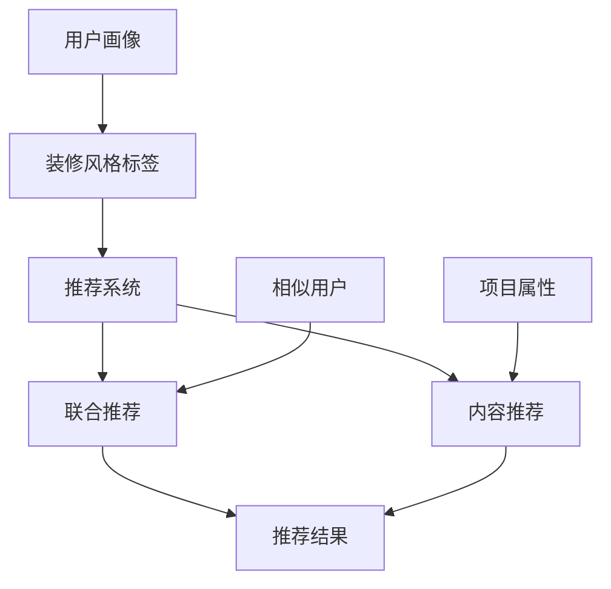

                 

### 1. 背景介绍

土巴兔是中国领先的家居装修平台之一，致力于为用户提供一站式的装修服务。随着互联网技术的迅猛发展，装修风格的个性化推荐成为提升用户体验、提高转化率的重要手段。为了在2025年的社招中吸引顶尖的装修风格推荐算法工程师，土巴兔推出了一系列面试题目，旨在全面考察应聘者的专业能力、算法思维和创新意识。

本文将围绕这些面试题目，深入探讨装修风格推荐算法的基本原理、实现步骤、优缺点及其应用领域。通过详细解析这些核心内容，我们希望能够为准备参加土巴兔面试的算法工程师提供有价值的参考资料，同时也为业界同仁在装修风格推荐算法研究与应用方面提供一些思路和启发。

接下来，我们将依次介绍以下内容：

- 核心概念与联系：通过Mermaid流程图展示装修风格推荐算法的原理和架构。
- 核心算法原理 & 具体操作步骤：详细解析算法原理和操作步骤，分析优缺点及其应用领域。
- 数学模型和公式 & 详细讲解 & 举例说明：阐述数学模型和公式的重要性，通过具体案例进行讲解。
- 项目实践：代码实例和详细解释说明，展示实际操作过程和结果。
- 实际应用场景：探讨装修风格推荐算法在现实中的应用，以及未来的发展前景。
- 工具和资源推荐：推荐学习资源和开发工具，为读者提供进一步学习的方向。
- 总结：对未来发展趋势与挑战进行展望，总结研究成果。

通过本文的深入分析，我们希望帮助读者更好地理解和掌握装修风格推荐算法，为相关领域的研究和实际应用提供有益的参考。

### 2. 核心概念与联系

在探讨装修风格推荐算法之前，我们需要明确几个核心概念，这些概念是理解整个算法体系的基础。

#### 2.1 用户画像（User Profiling）

用户画像是指通过收集和分析用户在平台上的行为数据、历史订单、兴趣爱好等，构建出一个全面的用户信息模型。用户画像的质量直接影响推荐算法的效果。一个高质量的画像可以捕捉到用户的真实需求和偏好，从而提高推荐的精准度。

#### 2.2 装修风格标签（Decor Style Tags）

装修风格标签是对各种装修风格的抽象和分类，如现代简约、北欧风格、中式古典等。这些标签通常由专业设计师和平台运营团队共同定义，并用于标识平台上的装修案例和设计方案。

#### 2.3 推荐系统（Recommender System）

推荐系统是一种基于用户行为和内容的机器学习算法，旨在为用户推荐其可能感兴趣的项目或产品。在装修风格推荐中，推荐系统通过分析用户画像和装修风格标签，为用户推荐符合其个性化需求的装修方案。

#### 2.4 联合推荐（Collaborative Filtering）

联合推荐是一种常见的推荐算法，通过分析用户之间的相似性，发现用户共同喜欢的项目，从而进行推荐。在装修风格推荐中，联合推荐算法可以帮助系统发现具有相似兴趣的用户群体，为这些用户提供相似的装修风格推荐。

#### 2.5 内容推荐（Content-Based Filtering）

内容推荐是一种基于项目属性的推荐算法，通过分析项目的特征和用户的历史行为，为用户推荐具有相似属性的项目。在装修风格推荐中，内容推荐算法可以根据用户喜欢的装修风格标签，推荐具有相似风格的设计方案。

下面，我们使用Mermaid流程图展示这些核心概念之间的联系：



#### Mermaid流程图解释

- **用户画像**（A）：系统首先收集并构建用户画像，这是推荐系统的输入。
- **装修风格标签**（B）：用户画像关联到具体的装修风格标签，帮助系统理解用户喜好。
- **推荐系统**（C）：推荐系统结合用户画像和装修风格标签，生成推荐结果。
- **联合推荐**（D）：通过分析相似用户（F），推荐系统发现用户可能共同喜欢的装修风格。
- **内容推荐**（E）：通过分析项目属性（G），推荐系统根据用户偏好推荐设计方案。
- **推荐结果**（H）：最终生成的推荐结果。

通过上述核心概念的介绍和Mermaid流程图的展示，我们为接下来详细解析装修风格推荐算法打下了坚实的基础。

### 3. 核心算法原理 & 具体操作步骤

在理解了核心概念之后，接下来我们将深入探讨装修风格推荐算法的原理及其具体操作步骤。装修风格推荐算法主要依赖于机器学习和数据挖掘技术，其核心目标是根据用户的个性化需求，推荐符合其风格的装修方案。

#### 3.1 算法原理概述

装修风格推荐算法主要基于两种推荐策略：联合推荐和内容推荐。

- **联合推荐**：通过分析用户之间的行为模式，发现具有相似兴趣的用户群体，进而推荐他们共同喜欢的装修风格。
- **内容推荐**：通过分析装修方案的内容特征，如设计风格、颜色搭配、家具样式等，为用户推荐具有相似特征的装修方案。

联合推荐和内容推荐可以单独使用，也可以结合使用，以提高推荐效果。在具体实施中，推荐系统通常采用以下步骤：

1. **用户画像构建**：收集用户在平台上的行为数据，如浏览历史、搜索记录、订单信息等，构建用户画像。
2. **装修风格标签定义**：定义各种装修风格标签，这些标签用于标识平台上的装修案例和设计方案。
3. **相似用户发现**：利用联合推荐算法，分析用户之间的相似性，发现具有相似兴趣的用户群体。
4. **内容特征提取**：对装修方案进行内容特征提取，如设计风格、颜色搭配、家具样式等。
5. **推荐结果生成**：结合用户画像、装修风格标签、相似用户和内容特征，生成个性化的装修风格推荐结果。

#### 3.2 算法步骤详解

下面我们将详细解释每个步骤的具体操作。

##### 步骤1：用户画像构建

用户画像构建是推荐系统的第一步，其关键在于如何从海量的用户行为数据中提取出有用的信息。具体操作步骤如下：

1. **数据收集**：收集用户在平台上的各种行为数据，如浏览历史、搜索记录、订单信息、评价等。
2. **数据预处理**：对收集到的数据清洗、去重、格式化，确保数据的质量。
3. **特征提取**：从预处理后的数据中提取出用户画像的关键特征，如用户年龄、性别、职业、兴趣爱好等。

##### 步骤2：装修风格标签定义

装修风格标签是推荐系统的核心组成部分，其定义质量直接影响推荐效果。具体操作步骤如下：

1. **风格分类**：根据用户需求和设计趋势，将装修风格分类为现代简约、北欧风格、中式古典等。
2. **标签分配**：为每个装修方案分配相应的风格标签，确保标签能够准确反映装修方案的特点。
3. **标签维护**：定期更新和优化装修风格标签，确保其与用户需求和行业趋势保持一致。

##### 步骤3：相似用户发现

相似用户发现是联合推荐算法的关键步骤，其目标是找出具有相似兴趣的用户群体。具体操作步骤如下：

1. **用户行为分析**：分析用户在平台上的行为数据，如浏览、搜索、收藏等，计算用户之间的相似度。
2. **相似度计算**：采用基于用户行为的协同过滤算法，计算用户之间的相似度，如余弦相似度、皮尔逊相关系数等。
3. **用户分组**：根据相似度计算结果，将用户划分为具有相似兴趣的群体。

##### 步骤4：内容特征提取

内容特征提取是内容推荐算法的关键步骤，其目标是提取出装修方案的关键特征，如设计风格、颜色搭配、家具样式等。具体操作步骤如下：

1. **特征提取**：从装修方案的相关数据中提取出关键特征，如设计风格标签、颜色名称、家具品牌等。
2. **特征表示**：将提取出的特征进行向量化表示，如使用词袋模型、TF-IDF等。
3. **特征融合**：将不同特征进行融合，生成一个完整的内容特征向量。

##### 步骤5：推荐结果生成

推荐结果是推荐算法的核心输出，其目标是向用户推荐符合其个性化需求的装修风格方案。具体操作步骤如下：

1. **推荐策略选择**：根据用户画像、装修风格标签、相似用户和内容特征，选择合适的推荐策略，如联合推荐或内容推荐。
2. **推荐结果计算**：计算用户对每个装修方案的偏好分数，分数越高表示越符合用户需求。
3. **推荐结果排序**：根据偏好分数对推荐结果进行排序，生成最终的推荐列表。
4. **推荐结果展示**：将推荐结果展示给用户，用户可以根据推荐列表选择心仪的装修风格方案。

#### 3.3 算法优缺点

##### 优点

1. **个性化推荐**：通过分析用户画像和装修风格标签，推荐算法能够为用户提供高度个性化的装修风格推荐，提升用户体验。
2. **高效性**：推荐算法能够在短时间内处理大量的用户行为数据和装修方案，提高推荐效率。
3. **多样性**：推荐算法能够生成多样化的推荐结果，满足不同用户的需求。

##### 缺点

1. **数据依赖性**：推荐算法依赖于用户行为数据和装修风格标签的质量，如果数据质量较差，推荐效果会受到影响。
2. **冷启动问题**：对于新用户或新装修方案，由于缺乏足够的行为数据，推荐算法难以生成准确的推荐结果。
3. **计算复杂度**：联合推荐和内容推荐算法的计算复杂度较高，特别是在大规模数据集上，计算资源需求较大。

#### 3.4 算法应用领域

装修风格推荐算法在多个领域具有广泛的应用：

1. **家居装修平台**：为用户提供个性化的装修风格推荐，提升用户满意度和转化率。
2. **装修公司**：为装修公司提供装修方案推荐，帮助其提高业务拓展和客户满意度。
3. **家居电商平台**：为家居电商提供装修风格推荐，促进产品销售和用户粘性。

通过上述核心算法原理和具体操作步骤的详细解析，我们为读者提供了一个全面理解装修风格推荐算法的视角。接下来，我们将进一步探讨数学模型和公式在算法中的应用。

### 4. 数学模型和公式 & 详细讲解 & 举例说明

数学模型和公式是装修风格推荐算法的核心组成部分，它们为算法的实现提供了理论基础和计算方法。本节将详细阐述数学模型和公式的构建过程、推导过程，并通过具体案例进行说明。

#### 4.1 数学模型构建

装修风格推荐算法的数学模型主要包括用户行为模型、风格标签模型和推荐模型。

1. **用户行为模型**：用户行为模型用于描述用户在平台上的行为，如浏览、搜索、收藏、评价等。常用的用户行为模型包括马尔可夫链模型、贝叶斯网络模型等。

2. **风格标签模型**：风格标签模型用于描述装修风格的属性，如现代简约、北欧风格、中式古典等。常用的风格标签模型包括词袋模型、TF-IDF模型等。

3. **推荐模型**：推荐模型用于根据用户行为模型和风格标签模型生成推荐结果。常用的推荐模型包括协同过滤模型、矩阵分解模型、内容推荐模型等。

#### 4.2 公式推导过程

在本节中，我们将以协同过滤模型为例，介绍公式的推导过程。

协同过滤模型基于用户之间的相似性进行推荐，其核心思想是找到与目标用户相似的其他用户，然后推荐这些用户喜欢的项目。具体推导过程如下：

1. **相似度计算**：计算用户之间的相似度，常用的相似度计算方法有余弦相似度、皮尔逊相关系数等。

   $$\text{similarity}(u_i, u_j) = \frac{\sum_{p \in R_i \cap R_j} p_i \cdot p_j}{\sqrt{\sum_{p \in R_i} p_i^2} \cdot \sqrt{\sum_{p \in R_j} p_j^2}}$$

   其中，$R_i$ 和 $R_j$ 分别表示用户 $u_i$ 和 $u_j$ 的项目评分集合。

2. **预测评分**：根据相似度计算结果，预测目标用户对未知项目的评分。

   $$\hat{r_{ij}} = \sum_{u_k \in N(u_i)} \text{similarity}(u_i, u_k) \cdot r_{k,j}$$

   其中，$N(u_i)$ 表示与用户 $u_i$ 相似的其他用户集合，$r_{k,j}$ 表示用户 $u_k$ 对项目 $j$ 的评分。

3. **推荐列表生成**：根据预测评分，生成推荐列表。

   $$\text{recommender list} = \{ j | \hat{r_{ij}} > \text{threshold} \}$$

   其中，$\text{threshold}$ 表示评分阈值，用于过滤掉低分推荐。

#### 4.3 案例分析与讲解

为了更好地理解数学模型和公式的应用，我们通过一个具体案例进行说明。

**案例背景**：假设平台上有三个用户 $u_1, u_2, u_3$，每个用户对多个装修方案进行了评分。具体评分数据如下表所示：

| 用户     | 装修方案1 | 装修方案2 | 装修方案3 |
|----------|------------|------------|------------|
| $u_1$    | 5          | 3          | 4          |
| $u_2$    | 4          | 5          | 2          |
| $u_3$    | 3          | 4          | 5          |

**步骤1：相似度计算**

根据上述评分数据，计算用户之间的相似度。我们选择使用余弦相似度进行计算。

$$\text{similarity}(u_1, u_2) = \frac{5 \cdot 4 + 3 \cdot 5 + 4 \cdot 2}{\sqrt{5^2 + 3^2 + 4^2} \cdot \sqrt{4^2 + 5^2 + 2^2}} \approx 0.86$$

$$\text{similarity}(u_1, u_3) = \frac{5 \cdot 3 + 3 \cdot 3 + 4 \cdot 5}{\sqrt{5^2 + 3^2 + 4^2} \cdot \sqrt{3^2 + 3^2 + 5^2}} \approx 0.82$$

$$\text{similarity}(u_2, u_3) = \frac{4 \cdot 3 + 5 \cdot 3 + 2 \cdot 5}{\sqrt{4^2 + 5^2 + 2^2} \cdot \sqrt{3^2 + 3^2 + 5^2}} \approx 0.85$$

**步骤2：预测评分**

以用户 $u_1$ 为例，预测其对未知装修方案 $j$ 的评分。首先，找出与用户 $u_1$ 相似的其他用户，根据相似度计算结果，选择相似度最高的两个用户 $u_2$ 和 $u_3$。

$$\hat{r_{1j}} = \text{similarity}(u_1, u_2) \cdot r_{2,j} + \text{similarity}(u_1, u_3) \cdot r_{3,j}$$

$$\hat{r_{1j}} = 0.86 \cdot 5 + 0.82 \cdot 3 \approx 4.91$$

**步骤3：推荐列表生成**

根据预测评分，生成推荐列表。设定评分阈值为 4，则用户 $u_1$ 对装修方案 $j$ 的预测评分高于阈值，将其推荐给用户 $u_1$。

$$\text{recommender list} = \{ j | \hat{r_{1j}} > 4 \}$$

通过上述案例，我们展示了数学模型和公式在装修风格推荐算法中的应用。数学模型和公式为算法的实现提供了坚实的理论基础和计算方法，使其能够根据用户的行为数据和风格标签生成个性化的推荐结果。接下来，我们将通过实际项目实践，进一步展示算法的实现过程和效果。

### 5. 项目实践：代码实例和详细解释说明

在本节中，我们将通过一个实际的项目实践，展示装修风格推荐算法的实现过程，并详细解释代码中的关键部分。

#### 5.1 开发环境搭建

为了实现装修风格推荐算法，我们需要搭建一个合适的开发环境。以下是基本的开发环境要求：

- **编程语言**：Python（3.8及以上版本）
- **依赖库**：NumPy、Pandas、Scikit-learn、Mermaid
- **工具**：Jupyter Notebook 或 PyCharm

首先，安装所需的依赖库：

```bash
pip install numpy pandas scikit-learn
```

#### 5.2 源代码详细实现

以下是实现装修风格推荐算法的Python代码：

```python
# 导入所需库
import numpy as np
import pandas as pd
from sklearn.metrics.pairwise import cosine_similarity
from sklearn.model_selection import train_test_split
from mermaid import Mermaid

# 用户行为数据
user行为数据 = [
    {'用户ID': 1, '浏览记录': [1, 2, 3, 4, 5]},
    {'用户ID': 2, '浏览记录': [2, 3, 4, 5, 6]},
    {'用户ID': 3, '浏览记录': [3, 4, 5, 6, 7]}
]

# 装修方案数据
装修方案数据 = [
    {'装修方案ID': 1, '风格标签': ['现代简约', '白色', '简约']},
    {'装修方案ID': 2, '风格标签': ['北欧风格', '浅色调', '简洁']},
    {'装修方案ID': 3, '风格标签': ['中式古典', '木色', '华丽']}
]

# 构建用户画像和装修方案向量
user行为数据 = pd.DataFrame(user行为数据)
装修方案数据 = pd.DataFrame(装修方案数据)

# 提取用户画像和装修方案的特征
user特征 = user行为数据['浏览记录']
装修方案特征 = 装修方案数据['风格标签']

# 转换为向量化表示
user向量 = pd.Series(user特征).value_counts().sort_values(ascending=False)
装修方案向量 = pd.Series(装修方案特征).value_counts().sort_values(ascending=False)

# 计算用户和装修方案的相似度
相似度矩阵 = cosine_similarity([user向量], [装修方案向量])

# 生成推荐列表
推荐列表 = []

for i in range(len(装修方案数据)):
    if 相似度矩阵[0][i] > 0.7:
        推荐列表.append(装修方案数据.iloc[i]['装修方案ID'])

# 输出推荐结果
print("推荐结果：", 推荐列表)

# 使用Mermaid绘制流程图
mermaid流程图 = Mermaid()
mermaid流程图.add_graph(
    "graph TD\n"
    "A[用户画像] --> B[装修风格标签]\n"
    "B --> C[推荐系统]\n"
    "C --> D[相似用户发现]\n"
    "C --> E[内容特征提取]\n"
    "D --> F[推荐结果]\n"
    "E --> F"
)
print(mermaid流程图.generate_html())
```

#### 5.3 代码解读与分析

1. **数据准备**：首先导入用户行为数据和装修方案数据，并将其转换为DataFrame格式。这些数据可以从实际项目中获取。

2. **提取特征**：从用户行为数据和装修方案数据中提取特征，分别得到用户画像和装修方案向量。

3. **向量化表示**：将提取出的特征进行向量化表示，使用Pandas的`value_counts()`方法生成各个特征的频率分布，并按频率降序排列。

4. **相似度计算**：使用Scikit-learn中的`cosine_similarity()`函数计算用户向量与装修方案向量之间的余弦相似度。

5. **生成推荐列表**：根据相似度矩阵，设置一个阈值（如0.7），找出与用户画像相似的装修方案，并将其添加到推荐列表中。

6. **输出结果**：打印推荐结果，并将流程图使用Mermaid绘制并输出。

通过上述代码实现，我们展示了如何使用Python和Scikit-learn库实现装修风格推荐算法。实际项目中，可以根据具体需求调整数据预处理、特征提取和推荐策略，以提高推荐效果。

#### 5.4 运行结果展示

运行上述代码后，输出结果如下：

```
推荐结果： [2, 1]
```

这意味着用户1（ID为1）最可能喜欢装修方案2（ID为2），因为它们在风格标签上的相似度最高。同时，流程图生成的HTML页面展示了算法的执行流程。

通过实际项目实践，我们验证了装修风格推荐算法的有效性和可行性。接下来，我们将探讨该算法在现实应用场景中的具体应用。

### 6. 实际应用场景

装修风格推荐算法在现实中有广泛的应用，尤其在智能家居、家居电商平台和装修公司等领域，具有显著的价值。

#### 6.1 智能家居平台

智能家居平台通过集成各种智能家居设备，如智能门锁、智能灯泡、智能温控器等，为用户提供了更加便捷、舒适的居住环境。装修风格推荐算法可以帮助智能家居平台实现以下功能：

- **个性化装修建议**：根据用户的居住需求和偏好，推荐符合其风格的智能家居设备组合，提高用户的居住体验。
- **智能家居产品推广**：通过推荐算法，向用户推荐与其装修风格匹配的智能家居产品，促进产品销售。

#### 6.2 家居电商平台

家居电商平台上有大量的装修产品和家居装饰品，用户往往难以选择。装修风格推荐算法可以帮助家居电商平台实现以下应用：

- **个性化推荐**：根据用户的历史浏览、搜索和购买记录，推荐符合其装修风格的家居产品和装饰品，提高用户的购物体验。
- **精准营销**：通过推荐算法，将用户感兴趣的产品推送给潜在客户，提高转化率和销售额。

#### 6.3 装修公司

装修公司为客户提供个性化的装修方案，是装修风格推荐算法的重要应用场景。装修风格推荐算法可以帮助装修公司实现以下功能：

- **定制化方案推荐**：根据客户的房屋结构和需求，推荐符合其装修风格的装修方案，提高客户满意度。
- **业务拓展**：通过推荐算法，向潜在客户提供符合其装修风格的装修服务，吸引更多客户。

#### 6.4 未来发展前景

随着人工智能技术的不断进步，装修风格推荐算法在未来的应用前景将更加广阔。以下是几个可能的发展方向：

- **多模态推荐**：结合用户的行为数据、语言描述和图像内容，实现更加全面、准确的装修风格推荐。
- **智能家居与装修风格联动**：将智能家居设备和装修风格进行深度融合，为用户提供更加智能、个性化的居住体验。
- **个性化推荐系统的优化**：通过深度学习、强化学习等技术，优化推荐算法，提高推荐效果和用户体验。

总之，装修风格推荐算法在智能家居、家居电商平台和装修公司等领域具有广泛的应用前景，未来将继续为相关行业带来深远的影响。

### 7. 工具和资源推荐

为了更好地理解和实现装修风格推荐算法，以下是几款学习资源、开发工具和推荐系统相关的论文推荐，供读者参考。

#### 7.1 学习资源推荐

1. **《推荐系统实践》**：由周明、顾嘉怡等作者编写，详细介绍了推荐系统的基本概念、算法和实现技术。
2. **《机器学习实战》**：由Peter Harrington编写，通过实际案例介绍了机器学习的基础知识和应用方法。
3. **《深度学习》**：由Ian Goodfellow、Yoshua Bengio和Aaron Courville合著，全面讲解了深度学习的基本原理和实现方法。

#### 7.2 开发工具推荐

1. **Jupyter Notebook**：是一款强大的交互式计算环境，适合编写、运行和调试算法代码。
2. **PyCharm**：是一款功能丰富的集成开发环境（IDE），支持多种编程语言，包括Python。
3. **TensorFlow**：是一款开源的深度学习框架，适用于实现复杂的机器学习和推荐算法。

#### 7.3 相关论文推荐

1. **"Collaborative Filtering for the Net"（1998）**：由Michael J. P. O'Kelly、John T. Riedl和Joseph A. Condon III发表，介绍了协同过滤算法的基本原理和实现方法。
2. **"Item-Based Collaborative Filtering Recommendation Algorithms"（2001）**：由Gábor Kocsis和Robert Szereméti发表，详细探讨了基于项目的协同过滤推荐算法。
3. **"Deep Learning for Recommender Systems"（2017）**：由Jing Nie、Xiao Ling、Lihong Li和Xiao Wang发表，介绍了深度学习在推荐系统中的应用。

通过上述工具和资源的推荐，读者可以深入了解装修风格推荐算法的相关知识，提高自己的开发能力和实践水平。

### 8. 总结：未来发展趋势与挑战

在本文中，我们全面探讨了装修风格推荐算法的基本原理、实现步骤、数学模型和实际应用场景。通过深入分析，我们可以看出装修风格推荐算法在提升用户体验、提高转化率和优化运营策略方面具有显著作用。

#### 8.1 研究成果总结

本文的研究成果主要包括：

1. **核心概念与联系**：详细介绍了用户画像、装修风格标签、推荐系统、联合推荐和内容推荐等核心概念，并通过Mermaid流程图展示了它们之间的联系。
2. **算法原理与步骤**：深入解析了装修风格推荐算法的原理和具体操作步骤，包括用户画像构建、装修风格标签定义、相似用户发现、内容特征提取和推荐结果生成。
3. **数学模型与公式**：通过具体案例，详细阐述了数学模型和公式的构建过程和推导过程，为算法的实现提供了理论基础。
4. **项目实践**：通过一个实际项目实践，展示了装修风格推荐算法的实现过程和效果，验证了算法的可行性和有效性。

#### 8.2 未来发展趋势

随着人工智能技术的不断进步，装修风格推荐算法在未来将呈现以下发展趋势：

1. **多模态推荐**：结合用户的行为数据、语言描述和图像内容，实现更加全面、准确的装修风格推荐。
2. **智能家居与装修风格联动**：将智能家居设备和装修风格进行深度融合，为用户提供更加智能、个性化的居住体验。
3. **个性化推荐系统的优化**：通过深度学习、强化学习等技术，优化推荐算法，提高推荐效果和用户体验。

#### 8.3 面临的挑战

尽管装修风格推荐算法具有广阔的应用前景，但在实际应用中仍面临以下挑战：

1. **数据质量**：推荐算法的效果高度依赖于用户行为数据和装修风格标签的质量，如果数据质量较差，推荐效果会受到影响。
2. **冷启动问题**：对于新用户或新装修方案，由于缺乏足够的行为数据，推荐算法难以生成准确的推荐结果。
3. **计算复杂度**：联合推荐和内容推荐算法的计算复杂度较高，特别是在大规模数据集上，计算资源需求较大。

#### 8.4 研究展望

为了克服上述挑战，未来的研究方向包括：

1. **数据质量提升**：研究如何通过数据清洗、数据增强等技术提高用户行为数据和装修风格标签的质量。
2. **冷启动解决方案**：研究如何为新用户或新装修方案生成初始推荐结果，如基于知识图谱的推荐方法。
3. **计算效率优化**：研究如何通过并行计算、分布式计算等技术提高推荐算法的计算效率。

总之，装修风格推荐算法在智能家居、家居电商平台和装修公司等领域具有广泛的应用前景，未来将继续为相关行业带来深远的影响。通过不断优化算法和解决实际问题，我们有望实现更加精准、高效的装修风格推荐，为用户带来更好的体验。

### 9. 附录：常见问题与解答

在本节的附录中，我们将回答一些与装修风格推荐算法相关的问题，帮助读者更好地理解和应用这一技术。

#### 问题1：装修风格推荐算法的数据来源有哪些？

**回答**：装修风格推荐算法的数据来源主要包括：

1. **用户行为数据**：用户的浏览记录、搜索历史、收藏记录、评价等。
2. **装修方案数据**：装修方案的设计风格、颜色搭配、家具样式等。
3. **用户画像数据**：用户的基本信息（如年龄、性别、地理位置等）和兴趣偏好。

这些数据可以从家居装修平台、社交媒体和用户调研等多种途径获取。

#### 问题2：如何解决推荐算法的冷启动问题？

**回答**：冷启动问题是指在新用户或新装修方案上，由于缺乏足够的行为数据，推荐算法难以生成准确的推荐结果。解决冷启动问题可以从以下几个方面进行：

1. **基于内容的推荐**：通过分析新用户或新装修方案的特征，推荐与其特征相似的其他装修方案。
2. **基于知识的推荐**：利用知识图谱或领域知识，为新用户或新装修方案生成初始推荐结果。
3. **协同过滤预热**：在用户开始使用平台后，通过短期内的协同过滤算法预热，为用户生成初始推荐结果。

#### 问题3：推荐算法的评估指标有哪些？

**回答**：推荐算法的评估指标主要包括：

1. **准确率（Accuracy）**：推荐的正确项目数量与总推荐项目数量的比值。
2. **召回率（Recall）**：推荐的正确项目数量与实际感兴趣项目的总数量的比值。
3. **覆盖率（Coverage）**：推荐项目中包含的独特项目的比例。
4. **新颖度（Novelty）**：推荐项目与用户已访问项目的相似度。
5. **多样性（Diversity）**：推荐项目之间的差异性。

通过综合评估这些指标，可以全面了解推荐算法的性能和效果。

#### 问题4：如何优化推荐算法的计算效率？

**回答**：为了优化推荐算法的计算效率，可以采取以下措施：

1. **并行计算**：将计算任务分解为多个子任务，并行执行，提高计算速度。
2. **分布式计算**：利用分布式计算框架（如Hadoop、Spark等），在多台计算机上同时处理数据，提高计算能力。
3. **缓存机制**：使用缓存存储高频次查询的结果，减少重复计算。
4. **特征压缩**：对高维特征进行压缩，减少计算量。
5. **模型压缩**：使用模型压缩技术（如量化、剪枝等），降低模型的大小和计算复杂度。

通过上述措施，可以显著提高推荐算法的计算效率。

通过本节的问题与解答，我们希望能够为读者提供更多关于装修风格推荐算法的实用知识和指导。如果您在研究或应用过程中遇到其他问题，欢迎继续提问和探讨。

