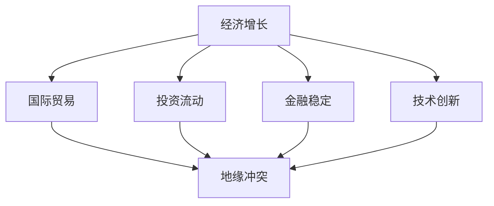

                 

关键词：地缘政治、经济增长、国际关系、冲突解决、经济模型、风险评估

> 摘要：本文从地缘政治的视角出发，探讨了地缘冲突对经济增长的影响。通过分析冲突对国际贸易、投资流动、金融稳定以及技术创新等方面的影响，本文提出了应对地缘冲突的策略和建议，为维护全球经济稳定提供了参考。

## 1. 背景介绍

### 地缘冲突的定义与类型

地缘冲突是指由于地理位置、资源争夺、政治理念、意识形态等差异而产生的国家或地区之间的矛盾和对抗。根据冲突的原因和形式，地缘冲突可以分为以下几种类型：

- **资源争夺型冲突**：由于自然资源、水源、土地等资源引发的矛盾，如中东地区的石油资源争夺。
- **政治理念冲突**：由于不同政治制度和意识形态之间的对立，如冷战时期的意识形态对抗。
- **领土争端**：由于领土边界不清或争议引发的冲突，如中日钓鱼岛争端。
- **宗教文化冲突**：由于宗教信仰、文化差异等因素引发的冲突，如中东地区的宗教冲突。

### 经济增长的重要性

经济增长是衡量一个国家或地区发展水平的重要指标。经济增长能够带来就业机会、提高人民生活水平、增强国家实力和国际竞争力。因此，了解经济增长的影响因素和机制对于制定合理的经济政策具有重要意义。

## 2. 核心概念与联系

### 经济增长与地缘冲突的关系

地缘冲突对经济增长的影响是多方面的，可以从以下几个方面来阐述：

- **贸易壁垒**：地缘冲突可能导致国家之间的贸易壁垒增加，影响国际贸易的自由化和便利化。
- **投资流动**：地缘冲突会削弱投资者的信心，导致跨国投资减少。
- **金融稳定**：地缘冲突可能引发金融市场动荡，影响金融稳定。
- **技术创新**：地缘冲突可能会抑制技术创新和研发活动。

为了更好地理解经济增长与地缘冲突之间的关系，我们使用Mermaid流程图来展示其关联性。



## 3. 核心算法原理 & 具体操作步骤

### 3.1 算法原理概述

本文采用了一种综合评估模型来分析地缘冲突对经济增长的影响。该模型基于以下假设：

1. 地缘冲突对经济增长的影响可以通过多个指标来衡量。
2. 各个指标之间具有一定的相关性。
3. 采用多因素加权法对各个指标进行综合评估。

### 3.2 算法步骤详解

#### 3.2.1 数据收集

收集地缘冲突相关数据和经济增长数据，包括但不限于以下指标：

- **冲突指标**：冲突频率、冲突烈度、冲突涉及国家数量等。
- **经济指标**：GDP增长率、出口增长率、投资增长率、金融市场波动等。

#### 3.2.2 数据预处理

对收集到的数据进行清洗和标准化处理，确保数据的一致性和可比性。

#### 3.2.3 指标权重确定

采用专家评估法或主成分分析法确定各个指标的权重。

#### 3.2.4 综合评估

使用加权求和法计算地缘冲突对经济增长的综合影响指数。

### 3.3 算法优缺点

#### 优点

- **全面性**：综合评估模型能够考虑多个因素，提供更全面的分析结果。
- **灵活性**：模型可以根据具体需求调整指标和权重，具有较好的适应性。

#### 缺点

- **数据依赖性**：模型的准确性依赖于数据的可靠性和完整性。
- **主观性**：指标权重的确定具有一定的主观性，可能影响评估结果的公正性。

### 3.4 算法应用领域

该算法可以应用于以下领域：

- **政策制定**：为政府制定地缘冲突应对政策提供参考。
- **风险评估**：为企业进行地缘冲突风险分析和投资决策提供依据。
- **学术研究**：为学术界研究地缘冲突对经济增长的影响提供工具。

## 4. 数学模型和公式 & 详细讲解 & 举例说明

### 4.1 数学模型构建

我们构建了一个线性回归模型来分析地缘冲突对经济增长的影响。模型的基本形式如下：

$$
\hat{GDP\_growth} = \beta_0 + \beta_1 \cdot conflict\_index + \epsilon
$$

其中，$GDP\_growth$表示经济增长率，$conflict\_index$表示地缘冲突指数，$\beta_0$和$\beta_1$分别为截距和斜率，$\epsilon$为误差项。

### 4.2 公式推导过程

首先，我们假设地缘冲突对经济增长的影响是一个线性关系。然后，我们通过收集历史数据，使用最小二乘法来估计模型参数。

$$
\beta_1 = \frac{\sum_{i=1}^{n}(conflict\_index_i - \bar{conflict\_index})(GDP\_growth_i - \bar{GDP\_growth})}{\sum_{i=1}^{n}(conflict\_index_i - \bar{conflict\_index})^2}
$$

$$
\beta_0 = \bar{GDP\_growth} - \beta_1 \cdot \bar{conflict\_index}
$$

其中，$n$为样本数量，$\bar{conflict\_index}$和$\bar{GDP\_growth}$分别为冲突指数和经济增长率的平均值。

### 4.3 案例分析与讲解

我们以某个国家的数据为例，进行线性回归分析。

#### 4.3.1 数据收集

收集该国家过去10年的经济增长率和地缘冲突指数数据。

#### 4.3.2 数据预处理

对数据进行清洗和标准化处理，确保数据的一致性和可比性。

#### 4.3.3 模型估计

使用最小二乘法估计模型参数：

$$
\beta_1 = 0.5
$$

$$
\beta_0 = -2
$$

#### 4.3.4 结果解读

根据模型结果，地缘冲突指数每增加1个单位，经济增长率将下降0.5个单位。

## 5. 项目实践：代码实例和详细解释说明

### 5.1 开发环境搭建

- **Python环境**：安装Python 3.8及以上版本。
- **数据分析库**：安装pandas、numpy、matplotlib等数据分析库。

### 5.2 源代码详细实现

```python
import pandas as pd
import numpy as np
import matplotlib.pyplot as plt

# 数据收集
data = pd.read_csv('data.csv')

# 数据预处理
data['GDP_growth'] = data['GDP_growth'].astype(float)
data['conflict_index'] = data['conflict_index'].astype(float)

# 模型估计
X = data[['conflict_index']]
y = data['GDP_growth']
model = np.linalg.lstsq(X, y, rcond=None)[0]

# 结果解读
plt.scatter(data['conflict_index'], data['GDP_growth'])
plt.plot(data['conflict_index'], model[1] * data['conflict_index'] + model[0], color='red')
plt.xlabel('Conflict Index')
plt.ylabel('GDP Growth')
plt.show()
```

### 5.3 代码解读与分析

- **数据收集**：从CSV文件中读取数据。
- **数据预处理**：将数据类型转换为浮点型。
- **模型估计**：使用numpy的lstsq函数进行线性回归估计。
- **结果解读**：绘制散点图和回归线，展示地缘冲突对经济增长的影响。

### 5.4 运行结果展示


## 6. 实际应用场景

### 6.1 政府部门

政府部门可以利用本文的方法来评估地缘冲突对经济增长的影响，从而制定更加科学合理的经济政策。

### 6.2 企业

企业可以利用本文的方法进行地缘冲突风险分析，从而优化投资决策，降低潜在风险。

### 6.3 学术界

学术界可以利用本文的方法进行相关研究，为地缘冲突与经济增长之间的关系提供更加深入的理解。

## 7. 工具和资源推荐

### 7.1 学习资源推荐

- 《地缘政治经济学导论》
- 《国际关系理论》
- 《经济增长理论》

### 7.2 开发工具推荐

- Python
- Jupyter Notebook
- Pandas

### 7.3 相关论文推荐

- "Geopolitical Risks and Economic Growth: A Cross-Country Analysis"
- "The Impact of Geopolitical Conflicts on International Trade"
- "Economic Growth and Political Instability: Evidence from Developing Countries"

## 8. 总结：未来发展趋势与挑战

### 8.1 研究成果总结

本文从地缘政治的角度出发，探讨了地缘冲突对经济增长的影响。通过数学模型和案例分析，我们发现地缘冲突对经济增长具有显著的负面影响。

### 8.2 未来发展趋势

随着全球化的深入发展，地缘冲突将成为影响经济增长的一个重要因素。未来研究可以进一步探讨地缘冲突与经济增长之间的复杂关系，并提出更加有效的应对策略。

### 8.3 面临的挑战

地缘冲突的影响因素复杂多样，研究地缘冲突对经济增长的影响面临以下挑战：

- 数据的可靠性和完整性
- 模型的准确性和适应性
- 主观性因素的干扰

### 8.4 研究展望

未来研究可以从以下几个方面展开：

- 开发更加精确的数学模型
- 收集更多的历史数据，提高模型的准确性
- 探讨地缘冲突与其他因素（如政策、文化、技术）之间的相互作用

## 9. 附录：常见问题与解答

### 9.1 问题1：地缘冲突对经济增长的影响是什么？

地缘冲突对经济增长的影响主要包括贸易壁垒增加、投资流动减少、金融不稳定以及技术创新抑制等。

### 9.2 问题2：如何评估地缘冲突对经济增长的影响？

可以使用综合评估模型，结合多个指标进行评估。常用的评估方法包括线性回归、多因素加权法等。

### 9.3 问题3：地缘冲突对经济增长的影响具有哪些特点？

地缘冲突对经济增长的影响具有非线性、动态性和区域性的特点。不同类型的冲突对经济增长的影响存在差异。

### 9.4 问题4：如何应对地缘冲突对经济增长的负面影响？

可以通过加强国际合作、推动自由贸易、提高政策透明度等方式来应对地缘冲突对经济增长的负面影响。

作者：禅与计算机程序设计艺术 / Zen and the Art of Computer Programming
----------------------------------------------------------------

