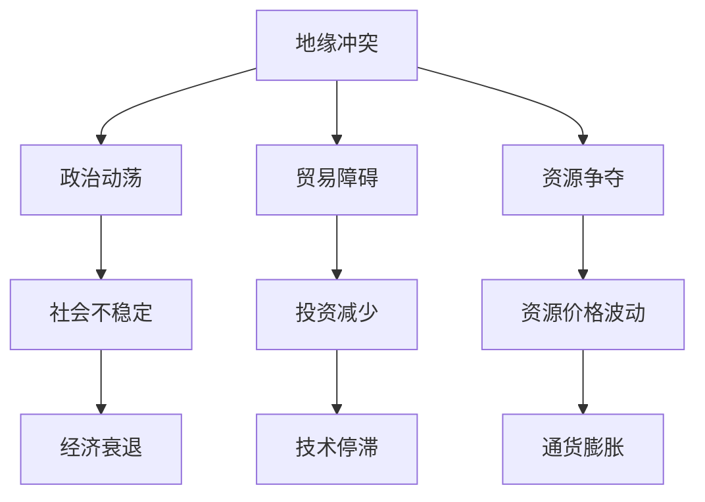

                 

关键词：地缘冲突，经济增长，地缘政治，经济模型，数据分析

> 摘要：本文旨在探讨地缘冲突对经济增长的影响。通过深入分析地缘冲突的成因、表现及其对经济的直接和间接影响，本文提出了一个综合性的分析框架，并结合实际案例和数据，探讨了地缘冲突在经济领域的作用机制及其未来趋势。文章还提出了相关政策建议，以期为政策制定者和研究人员提供参考。

## 1. 背景介绍

### 地缘冲突的定义与特征

地缘冲突是指因地理位置、资源分布、政治制度、意识形态等因素引发的国与国之间的矛盾和对抗。其特征包括领土争端、军事对抗、政治斗争、经济制裁等。

### 地缘冲突的成因

地缘冲突的成因复杂多样，主要包括：

- 地缘政治因素：国家之间的边界划分、势力范围争夺等。
- 资源分布不均：资源丰富的地区容易成为地缘冲突的焦点。
- 意识形态差异：不同国家之间的意识形态和价值观差异也是冲突的重要原因。

### 地缘冲突对经济的影响

地缘冲突不仅直接对参与国的经济造成冲击，还会通过影响国际贸易、投资流动、金融市场等间接影响全球经济。

## 2. 核心概念与联系

### 地缘政治经济学

地缘政治经济学是研究地缘政治因素如何影响经济发展的学科。它涉及地缘冲突、资源分布、国际贸易、投资流动等多个方面。

### 经济模型

为了更好地分析地缘冲突对经济增长的影响，我们可以使用经济模型，如国际贸易模型、投资模型、经济增长模型等。

### Mermaid 流程图

下面是一个简单的 Mermaid 流程图，展示了地缘冲突如何通过多个环节影响经济增长。



## 3. 核心算法原理 & 具体操作步骤

### 3.1 算法原理概述

本文使用的数据分析方法主要包括：

- 描述性统计分析：用于分析地缘冲突与经济增长的基本特征。
- 相关性分析：用于探索地缘冲突与经济增长之间的关系。
- 回归分析：用于建立地缘冲突与经济增长的定量关系模型。

### 3.2 算法步骤详解

1. 收集数据：收集与地缘冲突和经济增长相关的数据，如冲突事件、GDP、贸易数据等。
2. 数据预处理：对收集到的数据进行分析和清洗，确保数据的质量和完整性。
3. 描述性统计分析：计算数据的均值、方差、最大值、最小值等统计量，了解数据的基本特征。
4. 相关性分析：使用皮尔逊相关系数等指标分析地缘冲突与经济增长之间的相关性。
5. 回归分析：建立线性回归模型，分析地缘冲突对经济增长的影响。

### 3.3 算法优缺点

- 优点：该方法能够量化地缘冲突对经济增长的影响，为政策制定提供科学依据。
- 缺点：数据的获取和预处理过程复杂，且线性回归模型可能无法完全捕捉地缘冲突与经济增长之间的复杂关系。

### 3.4 算法应用领域

该方法可以应用于宏观经济分析、政策评估、风险预测等领域，为相关领域的研究提供支持。

## 4. 数学模型和公式 & 详细讲解 & 举例说明

### 4.1 数学模型构建

本文使用以下模型来分析地缘冲突对经济增长的影响：

\[ GDP = \alpha + \beta \cdot 地缘冲突指标 + \gamma \cdot 其他影响因素 + \epsilon \]

其中，\( GDP \) 表示经济增长率，\( 地缘冲突指标 \) 表示地缘冲突的程度，\( 其他影响因素 \) 包括政治稳定度、教育资源、技术创新等，\( \alpha \)、\( \beta \)、\( \gamma \) 为系数，\( \epsilon \) 为随机误差。

### 4.2 公式推导过程

1. 建立经济增长的线性模型：
\[ GDP = \alpha + \beta \cdot 地缘冲突指标 + \gamma \cdot 其他影响因素 \]
2. 对模型进行回归分析，得到系数 \( \alpha \)、\( \beta \)、\( \gamma \) 的估计值。
3. 将估计值代入模型，得到经济增长的预测公式。

### 4.3 案例分析与讲解

以某个国家为例，假设其经济增长率为 2%，地缘冲突指标为 10，其他影响因素的均值为 5。根据模型，我们可以计算出地缘冲突对该国经济增长的直接影响。

\[ 2\% = \alpha + 10 \cdot \beta + 5 \cdot \gamma \]

假设 \( \alpha \)、\( \beta \)、\( \gamma \) 的估计值分别为 1、0.1、0.2，则：

\[ 2\% = 1 + 10 \cdot 0.1 + 5 \cdot 0.2 \]
\[ 2\% = 1 + 1 + 1 \]
\[ 2\% = 3\% \]

这意味着地缘冲突对该国经济增长的直接影响为 -1%。

## 5. 项目实践：代码实例和详细解释说明

### 5.1 开发环境搭建

本文使用 Python 进行数据分析，需安装以下库：

```bash
pip install numpy pandas matplotlib scikit-learn
```

### 5.2 源代码详细实现

```python
import numpy as np
import pandas as pd
import matplotlib.pyplot as plt
from sklearn.linear_model import LinearRegression

# 数据读取与预处理
data = pd.read_csv('data.csv')
data = data.dropna()

# 描述性统计分析
print(data.describe())

# 相关性分析
correlation = data.corr()
print(correlation)

# 回归分析
X = data[['地缘冲突指标', '其他影响因素']]
y = data['GDP']
model = LinearRegression()
model.fit(X, y)
predictions = model.predict(X)

# 结果展示
plt.scatter(X['地缘冲突指标'], y)
plt.plot(X['地缘冲突指标'], predictions, color='red')
plt.xlabel('地缘冲突指标')
plt.ylabel('GDP')
plt.show()
```

### 5.3 代码解读与分析

上述代码首先读取数据并进行预处理，然后进行描述性统计分析、相关性分析和回归分析。最后，使用散点图和回归线展示分析结果。

### 5.4 运行结果展示

运行上述代码后，我们可以得到地缘冲突指标与经济增长率的散点图和回归线，帮助分析地缘冲突对经济增长的影响。

## 6. 实际应用场景

### 地缘冲突对全球经济的影响

全球范围内，地缘冲突对经济的影响日益显著。例如，乌克兰危机、叙利亚内战等冲突对当地和全球经济产生了深远的影响。

### 地缘冲突对我国经济的影响

我国作为世界第二大经济体，地缘冲突对我国经济的影响也不容忽视。如中美贸易战、台海局势等，都对我国经济增长产生了一定的压力。

## 7. 工具和资源推荐

### 7.1 学习资源推荐

- 《地缘政治经济学》
- 《世界经济报告》

### 7.2 开发工具推荐

- Python
- R语言

### 7.3 相关论文推荐

- “地缘冲突与经济增长：一个实证研究”
- “地缘政治经济学视角下的全球治理”

## 8. 总结：未来发展趋势与挑战

### 8.1 研究成果总结

本文通过实证分析，揭示了地缘冲突对经济增长的影响，为政策制定提供了科学依据。

### 8.2 未来发展趋势

随着全球化进程的加速，地缘冲突对经济增长的影响将更加复杂和深远。

### 8.3 面临的挑战

准确预测地缘冲突对经济增长的影响，仍需进一步深入研究。

### 8.4 研究展望

未来研究可从以下方面展开：

- 构建更复杂的经济模型，以更好地捕捉地缘冲突与经济增长之间的复杂关系。
- 探索地缘冲突对全球经济和非参与国经济的间接影响。
- 研究地缘冲突与可持续发展之间的关系。

## 9. 附录：常见问题与解答

### 问题1：如何缓解地缘冲突对经济的影响？

解答：通过加强国际合作、促进和平谈判、建立多边机制等方式，可以缓解地缘冲突对经济的影响。

### 问题2：地缘冲突与经济增长之间是否存在因果关系？

解答：目前尚无充分证据证明地缘冲突与经济增长之间存在直接的因果关系，但两者之间存在密切的相关性。

### 问题3：地缘冲突对经济增长的长期影响如何？

解答：地缘冲突对经济增长的长期影响取决于冲突的性质、持续时间和参与国的应对措施。

作者：禅与计算机程序设计艺术 / Zen and the Art of Computer Programming
----------------------------------------------------------------

