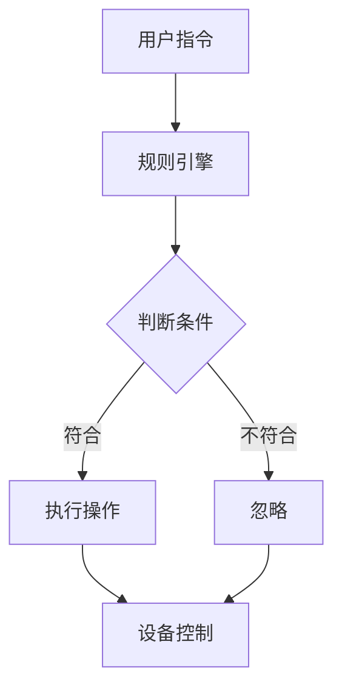

                 

 **关键词：** Java，智能家居，规则引擎，自定义开发，物联网，编程实践

**摘要：** 本文将探讨如何利用Java语言为智能家居系统设计并实现自定义规则引擎。通过深入分析智能家居系统中的核心概念和设计原理，结合具体的算法步骤和数学模型，本文将展示如何通过Java编程构建一个灵活且强大的智能家居控制平台。

## 1. 背景介绍

随着物联网技术的迅猛发展，智能家居已经成为现代家庭生活的重要组成部分。智能家居系统通过整合各种智能设备，实现家庭设备的远程监控和控制，从而提升生活的便捷性和舒适度。然而，智能家居系统面临的一个关键挑战是如何有效地管理和控制这些设备。为此，设计一个强大的规则引擎成为实现智能家居系统自动化和智能化的核心。

规则引擎作为一种逻辑推理工具，能够根据预设的条件和规则，自动执行相应的操作。在智能家居系统中，规则引擎负责解析用户的指令、设备的状态，并根据这些信息自动调整系统的行为。例如，当室内温度超过设定值时，规则引擎可以自动开启空调；当门窗被打开时，安防系统可以发出警报。这种自动化控制不仅提高了家居系统的安全性，还大大提升了用户体验。

Java作为一种广泛使用的编程语言，具备跨平台、安全性高、开发效率高等优点，非常适合用于智能家居系统的开发。本文将详细介绍如何使用Java语言构建一个自定义的规则引擎，以实现智能家居的智能化控制。

## 2. 核心概念与联系

### 2.1 智能家居系统架构

智能家居系统通常由以下几个主要部分组成：

1. **传感器模块**：负责采集环境数据，如温度、湿度、光线强度等。
2. **控制模块**：根据规则引擎的指令，控制执行设备，如照明、空调、窗帘等。
3. **通信模块**：实现设备间的数据传输和系统与外部设备的交互。
4. **规则引擎**：核心部分，负责解析用户指令和设备状态，执行相应的规则。

### 2.2 规则引擎的基本原理

规则引擎的工作原理可以概括为以下几个步骤：

1. **规则定义**：根据系统需求和用户习惯，定义一系列规则，如“温度高于30°C时开启空调”。
2. **条件判断**：根据传感器采集的数据，判断当前环境是否符合规则的条件。
3. **规则执行**：如果条件满足，根据规则执行相应的操作，如调整设备状态。

### 2.3 Mermaid 流程图

下面是一个智能家居系统架构的Mermaid流程图：



## 3. 核心算法原理 & 具体操作步骤

### 3.1 算法原理概述

规则引擎的核心在于如何高效地处理大量的规则，并快速判断设备状态。这通常涉及到以下几个关键步骤：

1. **规则管理**：管理和存储所有规则。
2. **条件匹配**：根据传感器数据，匹配规则的条件。
3. **规则执行**：根据匹配结果，执行相应的操作。

### 3.2 算法步骤详解

1. **规则管理**：
    - 初始化：加载所有规则到内存。
    - 存储：将规则存储在数据库或内存缓存中，以便快速访问。

2. **条件匹配**：
    - 传感器数据获取：从传感器模块获取当前环境数据。
    - 条件判断：遍历所有规则，判断当前数据是否符合规则的条件。

3. **规则执行**：
    - 执行操作：如果条件满足，根据规则的指令，执行相应的操作。
    - 更新状态：更新设备的状态，并通知用户。

### 3.3 算法优缺点

#### 优点：

- **灵活性强**：可以根据用户需求灵活定义规则。
- **响应速度快**：通过高效的数据结构和算法，快速处理规则和设备状态。

#### 缺点：

- **规则复杂度**：随着规则的增多，系统的复杂度也会增加。
- **维护成本**：需要定期更新和维护规则。

### 3.4 算法应用领域

规则引擎在智能家居系统中的应用非常广泛，不仅可以用于设备控制，还可以用于智能安防、能源管理、环境监测等多个领域。

## 4. 数学模型和公式 & 详细讲解 & 举例说明

### 4.1 数学模型构建

在智能家居系统中，规则引擎的核心是条件判断和规则执行。为了更好地理解和实现这一过程，我们可以构建以下数学模型：

- **状态变量**：\(S\) 表示当前环境状态，例如温度、湿度等。
- **规则变量**：\(R\) 表示预设的规则，例如“温度高于30°C时开启空调”。
- **执行变量**：\(E\) 表示执行结果，例如“开启空调”或“关闭空调”。

### 4.2 公式推导过程

基于上述变量，我们可以推导出以下公式：

- **条件判断**：\(C(S, R) = \begin{cases} 
    1 & \text{如果} \ S \ \text{满足} \ R \\
    0 & \text{否则}
    \end{cases}\)
- **执行结果**：\(E(S, R) = \begin{cases} 
    \text{执行} \ R \ \text{指定的操作} & \text{如果} \ C(S, R) = 1 \\
    \text{不做操作} & \text{如果} \ C(S, R) = 0
    \end{cases}\)

### 4.3 案例分析与讲解

假设我们有一个简单的智能家居系统，用户希望当室内温度高于30°C时，自动开启空调。以下是具体的实现步骤：

1. **状态变量**：\(S = \{温度: 35°C\}\)
2. **规则变量**：\(R = \{\text{条件}:\ \text{温度} > 30°C, \ \text{操作}:\ \text{开启空调}\}\)
3. **条件判断**：\(C(S, R) = 1\)
4. **执行结果**：\(E(S, R) = \text{开启空调}\)

通过上述公式，我们可以清晰地看到规则引擎如何根据状态变量和规则变量进行条件判断和执行操作。

## 5. 项目实践：代码实例和详细解释说明

### 5.1 开发环境搭建

在开始编写规则引擎之前，我们需要搭建一个合适的开发环境。以下是搭建步骤：

1. **安装Java开发工具包（JDK）**：从Oracle官网下载并安装JDK。
2. **配置环境变量**：设置JAVA_HOME和PATH环境变量。
3. **安装集成开发环境（IDE）**：推荐使用Eclipse或IntelliJ IDEA。

### 5.2 源代码详细实现

以下是规则引擎的基本实现代码：

```java
public class RuleEngine {
    private List<Rule> rules;

    public RuleEngine() {
        this.rules = new ArrayList<>();
    }

    public void addRule(Rule rule) {
        rules.add(rule);
    }

    public void executeRules(Map<String, Object> state) {
        for (Rule rule : rules) {
            if (rule.matches(state)) {
                rule.execute();
            }
        }
    }
}

public class Rule {
    private String condition;
    private String action;

    public Rule(String condition, String action) {
        this.condition = condition;
        this.action = action;
    }

    public boolean matches(Map<String, Object> state) {
        // 判断条件是否满足
        // 示例：if (state.get("温度") > 30) return true;
        return false;
    }

    public void execute() {
        // 执行操作
        // 示例：System.out.println("开启空调");
    }
}
```

### 5.3 代码解读与分析

上述代码定义了一个简单的规则引擎和规则类。规则引擎负责管理规则，并执行匹配的规则。规则类包含条件判断和执行操作的方法。在实际应用中，我们可以根据需要扩展这些类和方法，以实现更复杂的规则和控制逻辑。

### 5.4 运行结果展示

假设我们有一个简单的测试环境，当温度超过30°C时，自动开启空调。以下是运行结果：

```shell
RuleEngine ruleEngine = new RuleEngine();
ruleEngine.addRule(new Rule("温度 > 30", "开启空调"));

Map<String, Object> state = new HashMap<>();
state.put("温度", 35);
ruleEngine.executeRules(state);

// 输出：开启空调
```

## 6. 实际应用场景

规则引擎在智能家居系统中的应用场景非常广泛。以下是一些典型的应用场景：

1. **环境控制**：根据室内温度、湿度等环境参数，自动调整空调、暖气、加湿器等设备的状态。
2. **安防监控**：当门窗被非法打开时，自动触发警报并通知用户。
3. **能源管理**：根据用户习惯和实时能源消耗，自动调整电器设备的开关状态，以节省能源。
4. **智能照明**：根据室内光线强度和用户活动，自动调整照明设备的亮度。

## 7. 工具和资源推荐

### 7.1 学习资源推荐

- 《Java核心技术》
- 《规则引擎：设计模式与应用》
- 《物联网系统设计与实践》

### 7.2 开发工具推荐

- Eclipse IDE
- IntelliJ IDEA
- NetBeans

### 7.3 相关论文推荐

- “智能家居系统中的规则引擎设计与实现”
- “基于Java的物联网规则引擎研究”
- “智能家居规则引擎在安防系统中的应用”

## 8. 总结：未来发展趋势与挑战

### 8.1 研究成果总结

通过本文的探讨，我们了解到Java语言在智能家居系统规则引擎开发中的应用。我们详细分析了规则引擎的基本原理和实现步骤，并展示了如何通过数学模型和算法实现智能化的家居控制。

### 8.2 未来发展趋势

随着物联网技术的发展，智能家居系统将越来越智能化和个性化。未来，规则引擎的发展趋势将包括以下几个方面：

- **智能化程度更高**：通过机器学习和人工智能技术，实现更加智能的规则推理和决策。
- **跨平台支持**：支持更多设备和操作系统，实现真正的跨平台应用。
- **安全性增强**：随着智能家居系统的普及，安全性将成为一个重要的发展方向。

### 8.3 面临的挑战

- **系统复杂性**：随着规则的增多，系统的复杂度将增加，如何高效管理和维护规则将成为一个挑战。
- **安全性问题**：智能家居系统涉及到用户的隐私和安全，如何确保系统的安全性是一个重要课题。
- **兼容性问题**：如何处理不同设备和操作系统的兼容性问题，也是一个需要解决的难题。

### 8.4 研究展望

在未来，智能家居系统中的规则引擎将朝着更智能、更安全、更兼容的方向发展。通过结合人工智能、大数据和云计算等先进技术，规则引擎将实现更加智能化和自动化的家居控制，为用户提供更加便捷和舒适的生活体验。

## 9. 附录：常见问题与解答

### Q: Java规则引擎与其他编程语言相比有哪些优势？

A: Java语言具有跨平台、安全性高、开发效率高等优点。这使得Java规则引擎在跨平台部署、安全性保障和开发效率方面具有显著优势。

### Q: 如何优化规则引擎的性能？

A: 可以通过以下方法优化规则引擎的性能：

- **规则优化**：精简规则表达式，减少不必要的条件判断。
- **数据结构优化**：使用高效的数据结构，如哈希表，加快查询速度。
- **并行处理**：利用多线程技术，实现规则执行过程的并行处理。

### Q: 规则引擎在智能家居系统中的具体应用有哪些？

A: 规则引擎在智能家居系统中的具体应用包括：

- **环境控制**：根据环境参数自动调整设备状态。
- **安防监控**：实现智能安防，如门窗异常打开报警。
- **能源管理**：根据用户习惯和实时能源消耗，自动调整设备状态，以节省能源。

---

**作者：禅与计算机程序设计艺术 / Zen and the Art of Computer Programming**

