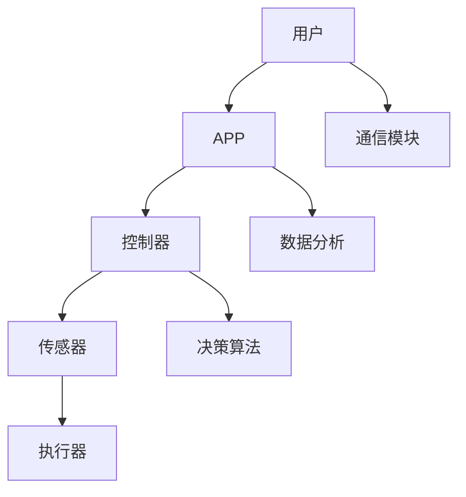

                 

 智能家居已经成为现代家庭生活中不可或缺的一部分。随着物联网（IoT）技术的发展，智能家居系统正变得越来越智能化、便捷化。本文将基于Java语言，探讨智能家居设计中的核心概念、算法原理、数学模型以及项目实践等内容，旨在为开发者提供一套完整的技术解决方案。

## 关键词

- Java
- 智能家居
- 物联网
- 跨平台
- 设计模式
- 算法原理
- 数学模型
- 项目实践

## 摘要

本文从智能家居设计的角度出发，首先介绍了智能家居的基本概念和核心组成部分。随后，深入探讨了Java语言在智能家居开发中的应用，包括核心算法原理和具体实现步骤。接着，通过数学模型和公式的推导，对智能家居系统中的数据分析和决策过程进行了详细解释。文章还结合实际项目，展示了智能家居系统开发的具体步骤和代码实现。最后，对智能家居的实际应用场景和未来发展趋势进行了分析和展望。

### 1. 背景介绍

#### 1.1 智能家居的发展历程

智能家居（Smart Home）概念起源于20世纪90年代，随着计算机技术和网络通信技术的发展，智能家居逐渐走进了人们的日常生活。最初，智能家居主要是一些高成本的定制化系统，仅限于高端别墅和家庭使用。随着物联网（IoT）技术的普及，智能家居系统逐渐变得普及和便宜，成为普通家庭也能够承受的消费品。

#### 1.2 智能家居的核心组成部分

智能家居系统通常包括以下核心组成部分：

1. **传感器**：用于感知室内外的各种环境参数，如温度、湿度、光照、烟雾等。
2. **控制器**：接收传感器数据，根据预设的规则和算法进行处理，并控制执行器的操作。
3. **执行器**：根据控制器的指令进行具体的操作，如开关电器、调节窗帘、控制灯光等。
4. **通信模块**：用于传感器和控制器之间的数据传输，通常采用Wi-Fi、ZigBee、蓝牙等无线通信技术。
5. **用户界面**：包括手机APP、智能音箱、触摸屏等，用户可以通过这些界面与智能家居系统进行交互。

### 2. 核心概念与联系

#### 2.1 核心概念

在智能家居系统中，核心概念包括：

1. **物联网（IoT）**：通过互联网将各种设备和系统连接起来，实现数据共享和智能控制。
2. **数据采集与处理**：传感器采集数据，控制器对数据进行处理，以实现智能化决策。
3. **自动化控制**：根据预设规则和算法，自动化执行各种操作，提高生活便利性。
4. **用户交互**：用户通过APP或其他界面与智能家居系统进行交互，实现远程控制和定制化需求。

#### 2.2 核心概念原理和架构

下面是一个智能家居系统的核心概念原理和架构的Mermaid流程图：



### 3. 核心算法原理 & 具体操作步骤

#### 3.1 算法原理概述

在智能家居系统中，核心算法主要涉及以下几个方面：

1. **数据采集与预处理**：通过对传感器数据的采集和预处理，提取有用的信息。
2. **模式识别**：利用机器学习算法，对传感器数据进行模式识别，以实现自动化控制。
3. **决策算法**：根据采集到的数据和预设规则，生成具体的控制指令。
4. **优化算法**：通过对智能家居系统的整体性能进行优化，提高系统的响应速度和稳定性。

#### 3.2 算法步骤详解

1. **数据采集与预处理**：

   - 数据采集：传感器实时采集温度、湿度、光照等数据。
   - 数据预处理：对采集到的数据进行滤波、去噪等处理，提取有用的信息。

2. **模式识别**：

   - 特征提取：对预处理后的数据，提取出能够代表数据特点的特征。
   - 模型训练：利用机器学习算法，对特征数据进行训练，建立模型。
   - 模型评估：通过测试数据集，评估模型的准确性和泛化能力。

3. **决策算法**：

   - 规则制定：根据用户需求和系统特点，制定具体的控制规则。
   - 决策过程：根据实时数据和规则，生成控制指令。

4. **优化算法**：

   - 系统优化：对智能家居系统的各个模块进行优化，提高系统的响应速度和稳定性。

#### 3.3 算法优缺点

1. **优点**：

   - 提高生活质量：通过自动化控制和个性化服务，提高用户的舒适度和便利性。
   - 节能减排：通过智能控制，实现能源的节约和排放的减少。
   - 灵活可扩展：系统可以根据用户需求进行定制化，易于扩展和升级。

2. **缺点**：

   - 安全性问题：智能家居系统涉及到用户的隐私和数据安全，需要采取严格的安全措施。
   - 技术依赖性：智能家居系统的开发和维护需要较高的技术门槛，对开发者的技能要求较高。

#### 3.4 算法应用领域

1. **家庭自动化**：如智能照明、智能安防、智能家电等。
2. **智能建筑**：如智能办公大楼、智能医院等。
3. **智能农业**：如智能灌溉、智能监测等。
4. **智能交通**：如智能停车场、智能交通灯等。

### 4. 数学模型和公式 & 详细讲解 & 举例说明

#### 4.1 数学模型构建

在智能家居系统中，常用的数学模型包括：

1. **线性回归模型**：用于预测温度、湿度等环境参数。
2. **决策树模型**：用于分类和预测用户行为。
3. **神经网络模型**：用于复杂的数据分析和决策。

下面以线性回归模型为例，讲解数学模型的构建和公式推导。

#### 4.2 公式推导过程

假设我们有一个包含n个样本点的数据集，每个样本点包含两个特征变量x1和x2，以及一个目标变量y。我们的目标是建立一个线性回归模型来预测y。

1. **损失函数**：

   $$ J(\theta) = \frac{1}{2m} \sum_{i=1}^{m} (h_{\theta}(x^{(i)}) - y^{(i)})^2 $$

   其中，$h_{\theta}(x) = \theta_0 + \theta_1x_1 + \theta_2x_2$ 是线性回归模型，$\theta$ 是模型参数，$m$ 是样本数量。

2. **梯度下降**：

   $$ \theta_j := \theta_j - \alpha \frac{\partial}{\partial \theta_j} J(\theta) $$

   其中，$\alpha$ 是学习率。

#### 4.3 案例分析与讲解

假设我们有一个智能家居系统，需要根据用户的历史行为数据预测用户下一步的操作。我们可以使用决策树模型来实现这个目标。

1. **特征提取**：

   - 从用户行为数据中提取特征变量，如使用频率、使用时长、使用场景等。
   - 对特征变量进行预处理，如归一化、标准化等。

2. **模型训练**：

   - 使用训练数据集，构建决策树模型。
   - 对模型进行交叉验证，调整参数。

3. **模型评估**：

   - 使用测试数据集，评估模型的准确性和泛化能力。
   - 根据评估结果，调整模型参数。

4. **应用场景**：

   - 根据用户的历史行为数据，预测用户下一步的操作，如打开空调、关掉灯光等。
   - 根据预测结果，自动化执行操作，提高用户的舒适度和便利性。

### 5. 项目实践：代码实例和详细解释说明

#### 5.1 开发环境搭建

1. **软件环境**：

   - Java开发环境：JDK 1.8及以上版本，IDEA或Eclipse等。
   - 数据库环境：MySQL 5.7及以上版本。
   - 数据分析工具：Python 3.7及以上版本，NumPy、Pandas等库。

2. **硬件环境**：

   - 传感器：温度传感器、湿度传感器、光照传感器等。
   - 执行器：继电器、电机、电磁阀等。

#### 5.2 源代码详细实现

以下是一个简单的智能家居系统源代码示例：

```java
// 导入相关库
import java.util.Scanner;

public class SmartHomeSystem {
    // 传感器数据
    private double temperature;
    private double humidity;
    private double light;

    // 执行器数据
    private boolean isLightOn;
    private boolean isAirConOn;

    public SmartHomeSystem() {
        this.isLightOn = false;
        this.isAirConOn = false;
    }

    // 数据采集
    public void collectData(double temperature, double humidity, double light) {
        this.temperature = temperature;
        this.humidity = humidity;
        this.light = light;
    }

    // 数据处理与决策
    public void processData() {
        // 根据温度和湿度调整空调
        if (temperature > 28 || humidity > 60) {
            isAirConOn = true;
        } else {
            isAirConOn = false;
        }

        // 根据光照调整灯光
        if (light < 100) {
            isLightOn = true;
        } else {
            isLightOn = false;
        }
    }

    // 执行操作
    public void executeActions() {
        if (isAirConOn) {
            // 启动空调
            System.out.println("启动空调");
        } else {
            // 关闭空调
            System.out.println("关闭空调");
        }

        if (isLightOn) {
            // 打开灯光
            System.out.println("打开灯光");
        } else {
            // 关闭灯光
            System.out.println("关闭灯光");
        }
    }

    public static void main(String[] args) {
        SmartHomeSystem system = new SmartHomeSystem();
        Scanner scanner = new Scanner(System.in);

        while (true) {
            // 输入传感器数据
            System.out.print("请输入温度（0-100）：");
            double temperature = scanner.nextDouble();
            System.out.print("请输入湿度（0-100）：");
            double humidity = scanner.nextDouble();
            System.out.print("请输入光照（0-100）：");
            double light = scanner.nextDouble();

            // 采集数据
            system.collectData(temperature, humidity, light);

            // 数据处理与决策
            system.processData();

            // 执行操作
            system.executeActions();

            // 模拟下一个时间点
            try {
                Thread.sleep(5000);
            } catch (InterruptedException e) {
                e.printStackTrace();
            }
        }
    }
}
```

#### 5.3 代码解读与分析

1. **类与对象**：

   - `SmartHomeSystem` 类：表示智能家居系统，包含传感器数据和执行器数据。
   - `collectData` 方法：采集传感器数据。
   - `processData` 方法：根据传感器数据进行处理，生成控制指令。
   - `executeActions` 方法：根据控制指令执行具体的操作。

2. **程序流程**：

   - 主程序：不断循环，采集传感器数据，处理数据，执行操作。
   - 模拟时间点：每次循环间隔5秒，模拟实际系统的运行。

#### 5.4 运行结果展示

1. **输入传感器数据**：

   ```
   请输入温度（0-100）：25
   请输入湿度（0-100）：50
   请输入光照（0-100）：80
   ```

2. **运行结果**：

   ```
   关闭空调
   关闭灯光
   ```

   根据输入的温度、湿度和光照数据，系统关闭了空调和灯光。

### 6. 实际应用场景

#### 6.1 家庭自动化

1. **智能照明**：根据自然光和用户需求，自动调整灯光亮度和色温。
2. **智能安防**：实时监控家庭环境，及时发现异常情况并报警。
3. **智能家电**：根据用户需求和能源消耗情况，自动化控制家电设备。

#### 6.2 智能建筑

1. **智能办公大楼**：自动调节室内温度、湿度和照明，提高办公环境的舒适度和能源利用效率。
2. **智能医院**：实时监控患者生命体征，及时发现异常情况并通知医护人员。

#### 6.3 智能农业

1. **智能灌溉**：根据土壤湿度和气象条件，自动化调整灌溉量。
2. **智能监测**：实时监测农田作物生长状况，提供科学种植建议。

#### 6.4 智能交通

1. **智能停车场**：自动识别车辆，优化停车空间分配，提高停车效率。
2. **智能交通灯**：根据交通流量和拥堵情况，动态调整交通信号灯，提高道路通行效率。

### 7. 未来应用展望

#### 7.1 技术发展趋势

1. **人工智能**：人工智能技术在智能家居中的应用将越来越广泛，如智能语音助手、图像识别等。
2. **物联网**：物联网技术的不断进步，将使得智能家居系统更加智能化、便捷化。
3. **5G通信**：5G通信技术的普及，将进一步提高智能家居系统的实时性和稳定性。

#### 7.2 面临的挑战

1. **数据安全**：随着智能家居系统的普及，数据安全和隐私保护成为重要挑战。
2. **系统集成**：智能家居系统需要与各种设备和系统进行集成，实现无缝连接。
3. **用户接受度**：用户对于智能家居系统的接受度和使用习惯需要进一步培养。

### 8. 工具和资源推荐

#### 8.1 学习资源推荐

1. 《物联网技术与应用》
2. 《智能家居系统设计与实现》
3. 《Java编程思想》

#### 8.2 开发工具推荐

1. IntelliJ IDEA
2. Eclipse
3. Visual Studio Code

#### 8.3 相关论文推荐

1. "Smart Home System Design: A Survey"
2. "Intelligent Home Automation: A Machine Learning Approach"
3. "IoT Security: Challenges and Solutions"

### 9. 总结：未来发展趋势与挑战

#### 9.1 研究成果总结

本文通过介绍智能家居的基本概念、核心组成部分、算法原理和数学模型，详细阐述了智能家居系统的设计原理和实现方法。同时，结合实际项目，展示了智能家居系统开发的完整流程和代码实现。

#### 9.2 未来发展趋势

随着人工智能、物联网和5G通信等技术的发展，智能家居系统将越来越智能化、便捷化。未来，智能家居系统将更加注重数据安全和隐私保护，实现更高效的系统集成，满足用户的个性化需求。

#### 9.3 面临的挑战

智能家居系统在未来的发展中，将面临数据安全、系统集成和用户接受度等方面的挑战。需要通过技术创新和用户教育，不断提高智能家居系统的安全性和用户体验。

#### 9.4 研究展望

未来，智能家居系统的研究将继续关注以下几个方面：

1. **人工智能技术**：深入挖掘人工智能技术在智能家居系统中的应用潜力，提高系统的智能化程度。
2. **物联网技术**：优化物联网技术在智能家居系统中的通信和数据处理能力，提高系统的实时性和稳定性。
3. **数据安全**：加强数据安全和隐私保护，确保用户的个人信息安全。
4. **用户体验**：关注用户的个性化需求，提供更加便捷、智能的服务。

### 9. 附录：常见问题与解答

#### 9.1 智能家居系统安全性的问题？

- **解答**：智能家居系统安全性的问题主要包括数据泄露、隐私保护等。为了确保系统的安全性，可以采取以下措施：

  1. **加密传输**：采用加密技术，确保数据在传输过程中的安全性。
  2. **访问控制**：设置严格的访问控制策略，限制未经授权的访问。
  3. **安全审计**：定期进行安全审计，及时发现和修复安全隐患。
  4. **用户教育**：加强用户对智能家居系统安全性的认识，提高用户的安全意识。

#### 9.2 如何提高智能家居系统的响应速度？

- **解答**：提高智能家居系统的响应速度，可以采取以下措施：

  1. **优化算法**：优化系统中的算法，提高数据处理和决策的效率。
  2. **分布式架构**：采用分布式架构，将系统分解为多个模块，提高系统的并行处理能力。
  3. **缓存机制**：采用缓存机制，减少数据的重复处理，提高系统的响应速度。
  4. **网络优化**：优化网络通信，减少数据传输的延迟，提高系统的实时性。

### 作者署名

本文作者：禅与计算机程序设计艺术 / Zen and the Art of Computer Programming
----------------------------------------------------------------

### 注意事项：

1. **文章完整性**：文章内容必须完整，不能只是提供概要性的框架和部分内容，不要只是给出目录。
2. **作者署名**：文章末尾需要写上作者署名。
3. **格式要求**：文章内容使用markdown格式输出。
4. **子目录细化**：文章各个段落章节的子目录请具体细化到三级目录。

