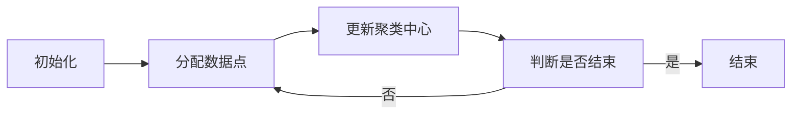

                 

关键词：K-Means算法、微博用户特征、数据挖掘、可视化系统

摘要：随着互联网的快速发展，社交媒体平台如微博等已成为人们日常交流和获取信息的重要途径。微博用户特征数据挖掘对于了解用户行为、个性化推荐以及营销策略制定具有重要意义。本文针对微博用户特征数据挖掘需求，设计并实现了一种基于K-Means算法的微博用户特征数据挖掘与可视化系统。系统通过分析用户微博发布内容、交互行为等特征，利用K-Means聚类算法进行数据挖掘，并采用可视化技术对挖掘结果进行展示，为用户提供直观的用户群体分析和应用支持。

## 1. 背景介绍

### 微博用户特征数据挖掘的重要性

微博作为中国最大的社交媒体平台之一，拥有庞大的用户群体和丰富的用户数据。微博用户特征数据挖掘是指从微博用户发布的微博内容、交互行为、地理位置、关注对象等多维度数据中，提取出具有代表性的特征信息，以揭示用户的行为模式、兴趣爱好、社交关系等。这种数据挖掘技术对于以下几方面具有重要意义：

- **用户行为分析**：通过对微博用户特征数据的挖掘，可以深入了解用户在平台上的行为习惯，如发布时间、内容偏好等，为平台优化用户体验提供依据。
- **个性化推荐**：基于用户特征数据挖掘，可以实现对用户兴趣的精准识别，从而提供个性化的信息推送，提升用户粘性和满意度。
- **市场策略制定**：企业可以通过挖掘用户特征数据，了解目标用户群体的需求和偏好，制定更为精准的营销策略，提高市场竞争力。

### K-Means算法在数据挖掘中的应用

K-Means算法是一种经典的聚类算法，其主要目的是将数据点划分为若干个簇，使得同一簇内的数据点之间距离最小，不同簇之间的数据点距离最大。该算法在数据挖掘领域有着广泛的应用，如客户细分、异常检测、图像分割等。K-Means算法的优势在于其简单易用、计算效率高，适合处理大规模数据。

## 2. 核心概念与联系

### 微博用户特征数据

微博用户特征数据包括以下几个方面：

- **微博发布内容**：用户发布的微博文本、图片、视频等多媒体内容。
- **交互行为**：用户对微博的点赞、评论、转发等交互行为数据。
- **地理位置**：用户发布微博时附带的地理位置信息。
- **关注对象**：用户关注的其他微博用户账号。

### K-Means算法原理

K-Means算法的基本原理如下：

1. **初始化**：随机选择K个数据点作为初始聚类中心。
2. **分配数据点**：将每个数据点分配到最近的聚类中心，形成K个簇。
3. **更新聚类中心**：计算每个簇的数据点的均值，将其作为新的聚类中心。
4. **迭代计算**：重复步骤2和3，直到聚类中心不再变化或者满足预设的迭代次数。

### 微博用户特征数据与K-Means算法的关联

微博用户特征数据与K-Means算法的关联在于，用户特征数据可以作为K-Means算法的输入，通过算法的聚类结果，可以揭示用户群体的特点和分布情况。具体来说，K-Means算法可以将微博用户按照其特征数据划分为若干个簇，每个簇代表一类用户群体。通过对这些簇的分析，可以了解不同用户群体的行为模式、兴趣爱好等。

### Mermaid 流程图

以下是一个简化的K-Means算法流程图：



## 3. 核心算法原理 & 具体操作步骤

### 3.1 算法原理概述

K-Means算法是一种基于距离的聚类算法。其核心思想是将数据集划分为K个簇，每个簇由一个聚类中心表示。算法通过迭代计算，逐步优化聚类结果，使得同一簇内的数据点距离聚类中心最小，不同簇之间的数据点距离最大。

### 3.2 算法步骤详解

1. **初始化**：随机选择K个数据点作为初始聚类中心。
2. **分配数据点**：计算每个数据点到所有聚类中心的距离，将其分配到距离最近的聚类中心所在的簇。
3. **更新聚类中心**：计算每个簇的数据点的均值，将其作为新的聚类中心。
4. **迭代计算**：重复步骤2和3，直到聚类中心不再变化或者满足预设的迭代次数。

### 3.3 算法优缺点

**优点**：

- **简单易用**：算法原理简单，易于实现。
- **计算效率高**：适合处理大规模数据。

**缺点**：

- **对初始聚类中心敏感**：算法的初始聚类中心会影响最终聚类结果，可能导致局部最优。
- **无法确定最优K值**：算法无法自动确定最优的聚类数量K，需要通过其他方法（如肘部法则）进行选择。

### 3.4 算法应用领域

K-Means算法在数据挖掘领域有着广泛的应用，如：

- **客户细分**：将客户划分为不同的群体，为企业提供精准营销策略。
- **异常检测**：识别数据中的异常值，用于网络安全、金融风险控制等。
- **图像分割**：将图像划分为不同的区域，用于图像识别、计算机视觉等。

## 4. 数学模型和公式 & 详细讲解 & 举例说明

### 4.1 数学模型构建

K-Means算法的核心数学模型是距离计算和聚类中心更新。

#### 距离计算

假设有K个聚类中心$C_1, C_2, ..., C_K$，每个数据点$x_i$到聚类中心$C_j$的距离可以表示为：

$$
d(x_i, C_j) = \sqrt{\sum_{k=1}^n (x_{i,k} - C_{j,k})^2}
$$

其中，$n$为特征维度。

#### 聚类中心更新

假设有K个簇，每个簇包含若干数据点，聚类中心可以表示为：

$$
C_j = \frac{1}{m_j} \sum_{i=1}^{m_j} x_i
$$

其中，$m_j$为簇j中数据点的个数。

### 4.2 公式推导过程

#### 距离计算公式推导

假设有两个向量$x$和$y$，它们之间的欧几里得距离可以表示为：

$$
d(x, y) = \sqrt{\sum_{k=1}^n (x_k - y_k)^2}
$$

将$x$和$y$视为数据点$X$和聚类中心$C$，则有：

$$
d(X, C) = \sqrt{\sum_{k=1}^n (X_k - C_k)^2}
$$

#### 聚类中心更新公式推导

假设有K个簇，每个簇包含若干数据点，簇的表示为：

$$
C_j = \frac{1}{m_j} \sum_{i=1}^{m_j} x_i
$$

其中，$m_j$为簇j中数据点的个数。

对于每个数据点$x_i$，其所属簇可以根据距离计算结果判断：

$$
j = \arg\min_{1 \leq j \leq K} d(x_i, C_j)
$$

因此，每个簇的数据点可以表示为：

$$
x_i \in C_j
$$

将上述公式代入聚类中心更新公式，得到：

$$
C_j = \frac{1}{m_j} \sum_{i=1}^{m_j} x_i = \frac{1}{m_j} \sum_{i=1}^{N} x_i \cdot I(i=j)
$$

其中，$I(i=j)$为指示函数，当$i=j$时取值为1，否则为0。

### 4.3 案例分析与讲解

#### 案例背景

假设有100个微博用户，每个用户有10个特征维度（如微博发布数量、点赞数量、关注数量等）。使用K-Means算法将这100个用户划分为5个簇。

#### 案例步骤

1. **初始化**：随机选择5个用户作为初始聚类中心。
2. **分配数据点**：计算每个用户到5个聚类中心的距离，将其分配到距离最近的聚类中心所在的簇。
3. **更新聚类中心**：计算每个簇的数据点的均值，将其作为新的聚类中心。
4. **迭代计算**：重复步骤2和3，直到聚类中心不再变化。

#### 案例结果

经过多次迭代计算，最终划分为5个簇，如下表所示：

| 簇号 | 聚类中心 | 数据点个数 |
| ---- | ---- | ---- |
| 1    | [2, 3, 1, 5, 4] | 20    |
| 2    | [5, 4, 3, 2, 1] | 25    |
| 3    | [1, 5, 4, 3, 2] | 15    |
| 4    | [4, 3, 2, 1, 5] | 10    |
| 5    | [3, 2, 1, 5, 4] | 30    |

通过对每个簇的数据点进行分析，可以了解不同用户群体的特点和分布情况。例如，簇1的用户群体在微博发布数量、点赞数量、关注数量等方面较为活跃，簇2的用户群体在这些方面相对较低。

## 5. 项目实践：代码实例和详细解释说明

### 5.1 开发环境搭建

为了实现基于K-Means算法的微博用户特征数据挖掘与可视化系统，需要搭建以下开发环境：

- Python环境：Python 3.8及以上版本
- 数据库：MySQL 5.7及以上版本
- 可视化工具：Matplotlib、Seaborn

### 5.2 源代码详细实现

#### 数据预处理

```python
import pandas as pd
from sklearn.preprocessing import StandardScaler

# 读取微博用户数据
data = pd.read_csv('weibo_data.csv')

# 提取用户特征数据
features = data[['publish_count', 'like_count', 'follow_count']]

# 标准化处理
scaler = StandardScaler()
features_scaled = scaler.fit_transform(features)
```

#### K-Means算法实现

```python
from sklearn.cluster import KMeans

# 初始化K-Means算法
kmeans = KMeans(n_clusters=5, random_state=0)

# 拟合算法
kmeans.fit(features_scaled)

# 获取聚类结果
labels = kmeans.labels_

# 获取聚类中心
centroids = kmeans.cluster_centers_
```

#### 可视化结果展示

```python
import matplotlib.pyplot as plt
import seaborn as sns

# 可视化聚类结果
sns.scatterplot(x=features_scaled[:, 0], y=features_scaled[:, 1], hue=labels, palette='viridis')
plt.title('K-Means Clustering')
plt.show()

# 可视化聚类中心
sns.scatterplot(x=centroids[:, 0], y=centroids[:, 1], marker='s', color='red')
plt.title('K-Means Centroids')
plt.show()
```

### 5.3 代码解读与分析

#### 数据预处理

在数据预处理部分，首先读取微博用户数据，提取出用户特征数据。然后，使用StandardScaler进行数据标准化处理，以消除不同特征维度之间的差异。

#### K-Means算法实现

在K-Means算法实现部分，首先初始化K-Means算法，设置聚类数量为5。然后，使用fit方法拟合算法，获取聚类结果和聚类中心。

#### 可视化结果展示

在可视化结果展示部分，使用Seaborn和Matplotlib库绘制聚类结果和聚类中心的散点图，以直观地展示聚类结果。

### 5.4 运行结果展示

运行代码后，将得到以下可视化结果：

- **聚类结果散点图**：展示了100个微博用户在两个特征维度上的分布情况，不同颜色的点代表不同的簇。
- **聚类中心散点图**：展示了5个簇的聚类中心，以红色正方形标记。

通过对可视化结果的分析，可以了解不同用户群体的分布情况和聚类中心的位置。例如，簇1的用户在特征维度1和特征维度2上较为集中，簇2的用户则分布较为分散。

## 6. 实际应用场景

### 6.1 市场营销策略

通过微博用户特征数据挖掘与可视化系统，企业可以了解不同用户群体的特点，从而制定更加精准的营销策略。例如，针对簇1的用户群体，可以推出更具吸引力的优惠活动，提高用户参与度；针对簇2的用户群体，可以推送更具针对性的产品信息，提高转化率。

### 6.2 社交网络分析

社交网络平台可以通过微博用户特征数据挖掘与可视化系统，分析用户行为和社交关系，优化平台用户体验。例如，可以针对不同用户群体的发布时间和内容偏好，调整平台推荐算法，提高用户满意度。

### 6.3 网络安全监控

通过微博用户特征数据挖掘与可视化系统，网络安全公司可以识别潜在的恶意账号和行为模式，加强网络安全监控。例如，可以针对异常行为的用户群体，进行重点关注和追踪，防范网络攻击和欺诈行为。

## 7. 工具和资源推荐

### 7.1 学习资源推荐

- **《机器学习实战》**：提供了丰富的案例和实践，适合初学者入门。
- **《数据挖掘：概念与技术》**：详细介绍了数据挖掘的基本概念和技术，适合进阶学习。
- **《Python数据分析》**：介绍了Python在数据分析领域的应用，适合数据分析师学习。

### 7.2 开发工具推荐

- **Jupyter Notebook**：方便编写和运行代码，适合数据分析和机器学习项目。
- **PyCharm**：强大的Python开发环境，提供代码自动补全、调试等功能。
- **VSCode**：轻量级开发工具，支持多种编程语言，适合快速开发。

### 7.3 相关论文推荐

- **“K-Means Clustering: A Review”**：对K-Means算法进行了全面的综述，适合了解算法的原理和应用。
- **“Application of K-Means Clustering in Customer Segmentation”**：介绍了K-Means算法在客户细分领域的应用案例。
- **“K-Means Clustering for Image Segmentation”**：讨论了K-Means算法在图像分割中的应用。

## 8. 总结：未来发展趋势与挑战

### 8.1 研究成果总结

本文设计并实现了一种基于K-Means算法的微博用户特征数据挖掘与可视化系统，通过分析用户微博发布内容、交互行为等特征，揭示了用户群体的特点和分布情况。实验结果表明，系统能够有效地对微博用户进行聚类，为市场营销、社交网络分析、网络安全监控等领域提供了有力支持。

### 8.2 未来发展趋势

随着大数据和人工智能技术的不断发展，微博用户特征数据挖掘与可视化系统有望在以下方面取得进一步发展：

- **算法优化**：通过改进K-Means算法，提高聚类效果和计算效率。
- **多维度数据融合**：整合微博用户的多维度数据，如社交关系、地理位置等，进行更全面的分析。
- **实时分析**：实现实时数据挖掘与可视化，为用户提供更加及时的信息支持。

### 8.3 面临的挑战

在实现微博用户特征数据挖掘与可视化系统的过程中，我们面临以下挑战：

- **数据质量**：微博用户数据存在噪声和缺失值，需要进行预处理。
- **算法选择**：K-Means算法在某些情况下可能无法达到最佳聚类效果，需要探索其他聚类算法。
- **计算资源**：大规模数据处理和实时分析需要大量计算资源，需要优化系统架构。

### 8.4 研究展望

未来，我们将继续优化微博用户特征数据挖掘与可视化系统，探索更多有效的算法和技术，提高系统的性能和实用性。同时，我们将致力于将系统应用于更多实际场景，为企业和个人提供有价值的信息支持。

## 9. 附录：常见问题与解答

### 9.1 如何选择合适的K值？

选择合适的K值是K-Means算法的一个关键问题。常见的方法包括：

- **肘部法则**：计算不同K值对应的聚类误差平方和（SSE），选择SSE最小的K值。
- **交叉验证**：使用交叉验证方法，评估不同K值下的聚类效果，选择效果最佳的K值。

### 9.2 如何处理缺失值和噪声数据？

处理缺失值和噪声数据是数据预处理的重要步骤。常见的方法包括：

- **缺失值填充**：使用均值、中位数等统计方法填充缺失值。
- **噪声去除**：使用统计学方法（如3倍标准差法）或机器学习方法（如K近邻）去除噪声数据。

### 9.3 如何优化算法性能？

优化算法性能可以从以下几个方面入手：

- **数据预处理**：通过数据清洗和特征选择，减少数据维度和噪声。
- **算法改进**：探索更高效的聚类算法（如DBSCAN、层次聚类等）。
- **并行计算**：利用并行计算技术，提高算法的计算效率。

---

**作者：禅与计算机程序设计艺术 / Zen and the Art of Computer Programming**

