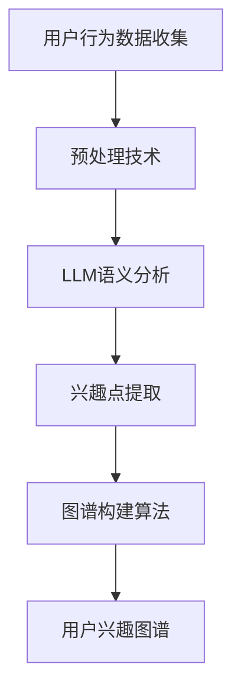

                 

关键词：LLM，推荐系统，用户兴趣图谱，算法原理，数学模型，项目实践，应用场景，未来展望

## 摘要

本文探讨了基于大型语言模型（LLM）构建推荐系统用户兴趣图谱的方法。首先介绍了用户兴趣图谱的基本概念和重要性，然后详细阐述了LLM在构建用户兴趣图谱中的应用原理和算法步骤。接着，通过数学模型和公式推导，深入分析了兴趣图谱构建的核心技术和计算方法。此外，本文还提供了一个实际项目案例，详细讲解了如何使用代码实现用户兴趣图谱的构建过程。最后，本文讨论了用户兴趣图谱在推荐系统中的应用场景和未来展望。

## 1. 背景介绍

推荐系统作为一种智能信息过滤技术，旨在根据用户的兴趣和需求，向用户推荐可能感兴趣的内容。用户兴趣图谱作为一种语义化的表示方法，能够更好地捕捉用户的兴趣和行为模式，从而提升推荐系统的效果。传统的推荐系统主要依赖于基于内容的过滤和协同过滤等方法，这些方法往往基于用户历史行为或物品属性进行推荐，存在一定的局限性。而基于大型语言模型（LLM）的用户兴趣图谱构建方法，通过利用深度学习的强大表达能力，能够更准确地捕捉用户的兴趣和偏好，从而实现更加精准的推荐。

随着互联网的快速发展和大数据技术的应用，用户生成的数据量呈现爆发式增长。如何有效地处理和分析这些数据，成为当前学术界和工业界的一个热点问题。用户兴趣图谱作为一种新型的数据表示方法，能够将用户的行为数据转化为结构化的知识表示，为推荐系统和知识图谱等领域提供重要的数据支持。

本文旨在探讨基于LLM的推荐系统用户兴趣图谱构建方法，通过深入分析LLM的工作原理和算法步骤，提供一种新的用户兴趣表示方法，从而提高推荐系统的效果和用户体验。

### 1.1 推荐系统概述

推荐系统是一种基于用户行为和偏好进行信息过滤和内容推荐的系统，其目标是为用户提供个性化的信息和服务。推荐系统广泛应用于电子商务、社交媒体、音乐流媒体、新闻门户等场景，通过向用户推荐感兴趣的内容，提高用户的满意度和参与度。

推荐系统的主要方法包括基于内容的过滤、协同过滤和混合推荐等。基于内容的过滤方法通过分析物品的内容属性和用户的兴趣标签，将用户可能感兴趣的内容推荐给用户。协同过滤方法通过分析用户之间的相似度，利用用户的历史行为数据预测用户对未知物品的偏好。混合推荐方法结合了基于内容和协同过滤的优点，通过融合多种特征和算法，提高推荐系统的准确性和多样性。

在推荐系统的应用场景中，用户兴趣图谱作为一种语义化的数据表示方法，能够更好地捕捉用户的兴趣和行为模式。用户兴趣图谱通过将用户的行为数据转化为结构化的知识表示，为推荐系统提供了更加丰富和准确的数据支持。通过分析用户兴趣图谱，推荐系统可以更加准确地预测用户的兴趣偏好，实现个性化的推荐。

### 1.2 用户兴趣图谱概述

用户兴趣图谱是一种基于语义网络和知识图谱的表示方法，用于捕捉用户的兴趣和行为模式。它通过将用户、物品和兴趣点等实体以及它们之间的关系进行结构化表示，形成一种语义化的知识表示。用户兴趣图谱的核心思想是将用户的行为数据转化为可计算和可解释的语义信息，从而为推荐系统和智能搜索等应用提供数据支持。

用户兴趣图谱的主要组成部分包括用户实体、物品实体和关系实体。用户实体表示用户的基本信息，如用户ID、年龄、性别等。物品实体表示用户所关注的物品，如电影、音乐、新闻等。关系实体表示用户和物品之间的交互关系，如观看、购买、点赞等。

用户兴趣图谱的作用主要体现在以下几个方面：

1. **个性化推荐**：通过分析用户兴趣图谱，推荐系统可以更加准确地预测用户的兴趣偏好，从而实现个性化的推荐。用户兴趣图谱为推荐系统提供了更加丰富和准确的数据支持，提高了推荐的效果和用户体验。

2. **用户画像**：用户兴趣图谱为用户画像提供了重要的数据来源。通过分析用户兴趣图谱，可以了解用户的兴趣偏好、行为习惯等，从而构建更加准确和详细的用户画像。

3. **智能搜索**：用户兴趣图谱为智能搜索提供了语义化的数据支持。通过分析用户兴趣图谱，可以更好地理解用户查询的意图，从而实现更加精准和智能的搜索结果。

4. **知识发现**：用户兴趣图谱为知识发现提供了丰富的数据来源。通过分析用户兴趣图谱，可以发现用户的潜在兴趣点、用户群体特征等，从而为知识发现和数据分析提供支持。

5. **社交网络分析**：用户兴趣图谱为社交网络分析提供了重要的数据支持。通过分析用户兴趣图谱，可以了解用户之间的社交关系、兴趣群体等，从而为社交网络分析提供数据支持。

### 1.3 LLM在用户兴趣图谱构建中的应用

大型语言模型（LLM）是一种基于深度学习的自然语言处理模型，具有强大的语义理解能力。在用户兴趣图谱构建中，LLM可以通过对用户生成的文本数据进行深度学习和语义分析，提取用户的兴趣点、偏好和情感等，从而构建用户兴趣图谱。

LLM在用户兴趣图谱构建中的应用主要包括以下两个方面：

1. **文本数据预处理**：LLM可以对用户生成的文本数据（如评论、评价、微博等）进行预处理，提取文本中的关键词、短语和句子等，为后续的兴趣点提取和图谱构建提供数据支持。

2. **兴趣点提取**：LLM可以通过对预处理后的文本数据进行情感分析、命名实体识别和关键词提取等，提取用户的兴趣点、偏好和情感等。这些兴趣点可以作为用户兴趣图谱中的节点，为构建用户兴趣图谱提供数据基础。

3. **图谱构建**：LLM可以对提取的兴趣点进行语义分析，构建用户兴趣图谱。通过分析用户和物品之间的交互关系，可以构建用户和物品之间的关系节点，从而形成一个语义化的用户兴趣图谱。

通过上述步骤，LLM可以帮助推荐系统更好地理解用户的兴趣和偏好，从而实现更加精准和个性化的推荐。

## 2. 核心概念与联系

在构建基于LLM的推荐系统用户兴趣图谱过程中，涉及多个核心概念和步骤。以下将详细阐述这些核心概念及其相互联系，并使用Mermaid流程图进行展示。

### 2.1 核心概念

1. **用户兴趣图谱**：用户兴趣图谱是一种将用户、物品和兴趣点等实体及其关系进行结构化表示的语义化数据模型。它通过分析用户的兴趣和偏好，为推荐系统提供数据支持。

2. **LLM**：大型语言模型是一种深度学习模型，具有强大的自然语言处理能力。它可以对用户生成的文本数据进行深度学习和语义分析，提取用户的兴趣点、偏好和情感等。

3. **用户行为数据**：用户行为数据包括用户在系统中产生的各种操作，如浏览、点击、购买、评论等。这些数据是构建用户兴趣图谱的重要来源。

4. **预处理技术**：预处理技术包括文本清洗、分词、词性标注、命名实体识别等，用于对用户行为数据中的文本信息进行预处理，以便后续分析。

5. **语义分析**：语义分析技术用于对预处理后的文本信息进行语义理解，提取关键词、短语和句子等，从而识别用户的兴趣点。

6. **图谱构建算法**：图谱构建算法用于将提取的兴趣点、用户和物品之间的关系进行结构化表示，形成用户兴趣图谱。

### 2.2 核心概念联系

图1：基于LLM的推荐系统用户兴趣图谱构建流程



#### 2.2.1 用户行为数据收集

用户行为数据是构建用户兴趣图谱的基础。这些数据包括用户在推荐系统中产生的各种操作，如浏览、点击、购买、评论等。通过收集用户行为数据，我们可以了解用户的兴趣和行为模式。

#### 2.2.2 预处理技术

预处理技术用于对用户行为数据中的文本信息进行清洗、分词、词性标注、命名实体识别等操作。这些操作有助于提取文本中的有效信息，为后续的语义分析提供数据支持。

#### 2.2.3 LLM语义分析

LLM具有强大的自然语言处理能力，可以对预处理后的文本信息进行深度学习和语义分析。通过分析文本中的关键词、短语和句子等，LLM可以提取用户的兴趣点、偏好和情感等。

#### 2.2.4 兴趣点提取

在LLM的语义分析过程中，提取的兴趣点可以作为用户兴趣图谱中的节点。这些兴趣点可以包括用户关注的领域、关键词、短语等，为构建用户兴趣图谱提供数据基础。

#### 2.2.5 图谱构建算法

图谱构建算法用于将提取的兴趣点、用户和物品之间的关系进行结构化表示，形成用户兴趣图谱。这些关系可以包括用户对物品的喜爱、关注、评价等，从而形成一个语义化的用户兴趣图谱。

#### 2.2.6 用户兴趣图谱

用户兴趣图谱是对用户的兴趣和行为模式进行结构化表示的语义化数据模型。通过分析用户兴趣图谱，推荐系统可以更好地理解用户的兴趣和偏好，实现更加精准和个性化的推荐。

## 3. 核心算法原理 & 具体操作步骤

### 3.1 算法原理概述

基于LLM的推荐系统用户兴趣图谱构建算法主要分为以下几个步骤：

1. **用户行为数据收集**：收集用户在推荐系统中产生的各种操作数据，如浏览、点击、购买、评论等。

2. **预处理技术**：对收集到的用户行为数据中的文本信息进行清洗、分词、词性标注、命名实体识别等预处理操作，提取有效信息。

3. **LLM语义分析**：利用LLM对预处理后的文本信息进行深度学习和语义分析，提取用户的兴趣点、偏好和情感等。

4. **兴趣点提取**：将LLM提取的兴趣点作为用户兴趣图谱中的节点，构建用户兴趣图谱。

5. **图谱构建算法**：通过分析用户和物品之间的交互关系，将用户兴趣图谱中的节点和边进行结构化表示，形成语义化的用户兴趣图谱。

6. **推荐算法**：基于用户兴趣图谱，结合推荐算法，实现个性化推荐。

### 3.2 算法步骤详解

#### 3.2.1 用户行为数据收集

用户行为数据是构建用户兴趣图谱的基础。首先，需要收集用户在推荐系统中产生的各种操作数据，如浏览、点击、购买、评论等。这些数据可以通过推荐系统日志、用户行为追踪等技术手段获取。

#### 3.2.2 预处理技术

对收集到的用户行为数据中的文本信息进行预处理，包括以下步骤：

1. **文本清洗**：去除文本中的无用信息，如HTML标签、特殊符号等。

2. **分词**：将文本分割为词语序列。可以使用现有的分词工具（如jieba）或自定义分词算法。

3. **词性标注**：对分词后的词语进行词性标注，如名词、动词、形容词等。

4. **命名实体识别**：识别文本中的命名实体，如人名、地名、组织名等。

5. **关键词提取**：从预处理后的文本中提取关键词、短语和句子等，为后续的兴趣点提取和图谱构建提供数据支持。

#### 3.2.3 LLM语义分析

利用LLM对预处理后的文本信息进行深度学习和语义分析，提取用户的兴趣点、偏好和情感等。具体步骤如下：

1. **文本编码**：将预处理后的文本信息编码为向量表示，如Word2Vec、BERT等。

2. **兴趣点提取**：利用LLM对编码后的文本信息进行语义分析，提取关键词、短语和句子等，作为用户兴趣图谱中的节点。

3. **偏好和情感分析**：通过分析文本中的情感倾向和关键词，识别用户的偏好和情感。

4. **上下文理解**：利用LLM对文本信息进行上下文理解，识别文本中的隐含信息和潜在关系。

#### 3.2.4 兴趣点提取

将LLM提取的兴趣点作为用户兴趣图谱中的节点，构建用户兴趣图谱。具体步骤如下：

1. **节点构建**：将提取的兴趣点作为用户兴趣图谱中的节点，表示用户的兴趣点和偏好。

2. **边构建**：根据用户和物品之间的交互关系，构建用户兴趣图谱中的边。如用户对物品的喜爱、关注、评价等。

3. **图谱优化**：利用图论算法和机器学习技术，对用户兴趣图谱进行优化，提高图谱的准确性和鲁棒性。

#### 3.2.5 图谱构建算法

通过分析用户和物品之间的交互关系，将用户兴趣图谱中的节点和边进行结构化表示，形成语义化的用户兴趣图谱。具体算法如下：

1. **图表示学习**：利用图表示学习算法（如DeepWalk、Node2Vec等），将用户兴趣图谱转化为向量表示。

2. **图嵌入**：将用户兴趣图谱中的节点和边转化为向量表示，形成图嵌入。

3. **推荐算法**：基于用户兴趣图谱的图嵌入，结合推荐算法（如矩阵分解、协同过滤等），实现个性化推荐。

### 3.3 算法优缺点

基于LLM的推荐系统用户兴趣图谱构建算法具有以下优点和缺点：

#### 优点：

1. **强大的语义理解能力**：LLM具有强大的自然语言处理能力，可以提取用户的兴趣点、偏好和情感等，实现更加精准的推荐。

2. **个性化推荐**：通过构建用户兴趣图谱，可以更好地理解用户的兴趣和偏好，实现个性化推荐。

3. **跨领域推荐**：基于用户兴趣图谱的推荐算法可以跨领域推荐，提高推荐系统的多样性。

#### 缺点：

1. **计算成本高**：基于LLM的算法需要大量的计算资源，对硬件要求较高。

2. **数据依赖性较强**：算法的性能受用户行为数据质量的影响较大，数据质量差可能导致推荐效果不佳。

3. **实时性较差**：基于LLM的算法在实时推荐场景下可能存在一定的延迟。

### 3.4 算法应用领域

基于LLM的推荐系统用户兴趣图谱构建算法可以应用于以下领域：

1. **电子商务**：通过构建用户兴趣图谱，实现个性化商品推荐，提高用户的购物体验。

2. **社交媒体**：通过构建用户兴趣图谱，实现个性化内容推荐，提高用户活跃度和留存率。

3. **音乐和视频流媒体**：通过构建用户兴趣图谱，实现个性化音乐和视频推荐，提高用户的视听体验。

4. **新闻门户**：通过构建用户兴趣图谱，实现个性化新闻推荐，提高用户阅读量和粘性。

5. **在线教育和培训**：通过构建用户兴趣图谱，实现个性化课程推荐，提高学习效果和用户满意度。

## 4. 数学模型和公式 & 详细讲解 & 举例说明

### 4.1 数学模型构建

基于LLM的推荐系统用户兴趣图谱构建涉及多个数学模型，包括用户行为数据的预处理、LLM的语义分析、兴趣点提取以及图谱构建等。以下将详细介绍这些数学模型及其公式推导。

#### 4.1.1 用户行为数据预处理

用户行为数据预处理主要包括文本清洗、分词、词性标注、命名实体识别等。这些步骤可以使用自然语言处理技术（如正则表达式、分词工具、词性标注器等）实现。

1. **文本清洗**

   文本清洗的主要目标是去除文本中的无关信息，如HTML标签、特殊符号、停用词等。可以使用正则表达式实现：

   $$ 
   clean\_text = re.sub(r"[^a-zA-Z0-9\s]", "", text) 
   $$

   其中，`re`是Python的正则表达式库，`text`为原始文本。

2. **分词**

   分词是将文本分割为词语序列。可以使用现有的分词工具（如jieba）或自定义分词算法实现：

   $$ 
   words = jieba.cut(clean\_text) 
   $$

   其中，`jieba`是Python的分词库，`clean_text`为清洗后的文本。

3. **词性标注**

   词性标注是对分词后的词语进行分类，如名词、动词、形容词等。可以使用现有的词性标注器（如NLTK、Stanford NLP等）实现：

   $$ 
   pos_tags = nltk.pos_tag(words) 
   $$

   其中，`nltk`是Python的词性标注库，`words`为分词后的词语序列。

4. **命名实体识别**

   命名实体识别是识别文本中的命名实体，如人名、地名、组织名等。可以使用现有的命名实体识别库（如spaCy、Stanford NLP等）实现：

   $$ 
   entities = nlp(clean\_text).ents 
   $$

   其中，`nlp`是文本分析库，`clean_text`为清洗后的文本。

#### 4.1.2 LLM语义分析

LLM语义分析是利用深度学习模型对预处理后的文本信息进行语义理解和分析。以下是一个简化的数学模型：

1. **文本编码**

   文本编码是将文本转化为向量表示，如Word2Vec、BERT等。以下是一个基于Word2Vec的文本编码模型：

   $$ 
   embed\_size = 100 \\ 
   window\_size = 5 \\ 
   vectors = Word2Vec(words, embed_size, window_size) 
   $$

   其中，`embed_size`为向量维度，`window_size`为滑动窗口大小，`words`为分词后的词语序列，`vectors`为编码后的文本向量。

2. **兴趣点提取**

   利用户定义的规则或算法提取文本中的关键词、短语和句子等，作为用户兴趣图谱中的节点。以下是一个基于TF-IDF的兴趣点提取模型：

   $$ 
   words\_freq = CountVectorizer(vocabulary=vocab).fit_transform(words) \\ 
   scores = TfidfTransformer().fit_transform(words_freq) \\ 
   top\_words = words[scores.argsort()[-k:]] 
   $$

   其中，`CountVectorizer`为词频计算器，`TfidfTransformer`为TF-IDF转换器，`vocab`为词汇表，`words`为分词后的词语序列，`scores`为词频和TF-IDF分数，`top_words`为提取的前k个关键词。

#### 4.1.3 图谱构建

图谱构建是利用用户和物品之间的交互关系，构建用户兴趣图谱。以下是一个简化的数学模型：

1. **图表示学习**

   图表示学习是将用户兴趣图谱中的节点和边转化为向量表示，如DeepWalk、Node2Vec等。以下是一个基于DeepWalk的图表示学习模型：

   $$ 
   walks = sample_walks(graph, walk_length, num_walks) \\ 
   embedding = DeepWalk(walks, embedding_size) 
   $$

   其中，`graph`为用户兴趣图谱，`walk_length`为行走长度，`num_walks`为行走次数，`embedding_size`为向量维度，`walks`为生成的行走序列，`embedding`为图嵌入结果。

2. **推荐算法**

   基于用户兴趣图谱的推荐算法，如矩阵分解、协同过滤等。以下是一个基于矩阵分解的推荐算法模型：

   $$ 
   R = \hat{U} \cdot \hat{V}^T \\ 
   \hat{U} = U + \alpha \cdot \text{Grad}\left( f(U) - f(V) \right) \\ 
   \hat{V} = V + \alpha \cdot \text{Grad}\left( f(V) - f(U) \right) 
   $$

   其中，`R`为评分矩阵，`U`和`V`为用户和物品的嵌入向量，`\alpha`为学习率，`\text{Grad}`为梯度计算。

### 4.2 公式推导过程

以下将介绍用户兴趣图谱构建过程中的关键公式推导过程。

#### 4.2.1 文本清洗

文本清洗的主要目标是去除文本中的无关信息。以下是一个简单的文本清洗公式推导：

$$ 
clean\_text = re.sub(r"[^a-zA-Z0-9\s]", "", text) 
$$

其中，`re`是Python的正则表达式库，`text`为原始文本。该公式通过正则表达式将文本中的特殊字符替换为空格，从而实现文本清洗。

#### 4.2.2 分词

分词是将文本分割为词语序列。以下是一个简单的分词公式推导：

$$ 
words = jieba.cut(clean\_text) 
$$

其中，`jieba`是Python的分词库，`clean_text`为清洗后的文本。该公式使用jieba分词库对清洗后的文本进行分词，得到词语序列。

#### 4.2.3 词性标注

词性标注是对分词后的词语进行分类。以下是一个简单的词性标注公式推导：

$$ 
pos\_tags = nltk.pos\_tag(words) 
$$

其中，`nltk`是Python的词性标注库，`words`为分词后的词语序列。该公式使用nltk库对分词后的词语进行词性标注，得到词性标注结果。

#### 4.2.4 命名实体识别

命名实体识别是识别文本中的命名实体。以下是一个简单的命名实体识别公式推导：

$$ 
entities = nlp(clean\_text).ents 
$$

其中，`nlp`是文本分析库，`clean_text`为清洗后的文本。该公式使用nlp库对清洗后的文本进行命名实体识别，得到命名实体结果。

#### 4.2.5 文本编码

文本编码是将文本转化为向量表示。以下是一个简单的文本编码公式推导：

$$ 
embed\_size = 100 \\ 
window\_size = 5 \\ 
vectors = Word2Vec(words, embed_size, window_size) 
$$

其中，`embed_size`为向量维度，`window_size`为滑动窗口大小，`words`为分词后的词语序列，`vectors`为编码后的文本向量。该公式使用Word2Vec算法对文本进行编码，得到文本向量。

#### 4.2.6 兴趣点提取

以下是一个简单的兴趣点提取公式推导：

$$ 
words\_freq = CountVectorizer(vocabulary=vocab).fit_transform(words) \\ 
scores = TfidfTransformer().fit_transform(words_freq) \\ 
top\_words = words[scores.argsort()[-k:]] 
$$

其中，`CountVectorizer`为词频计算器，`TfidfTransformer`为TF-IDF转换器，`vocab`为词汇表，`words`为分词后的词语序列，`scores`为词频和TF-IDF分数，`top_words`为提取的前k个关键词。该公式使用TF-IDF算法提取文本中的关键词，作为用户兴趣图谱中的节点。

#### 4.2.7 图表示学习

以下是一个简单的图表示学习公式推导：

$$ 
 walks = sample\_walks(graph, walk\_length, num\_walks) \\ 
embedding = DeepWalk(walks, embedding\_size) 
$$

其中，`graph`为用户兴趣图谱，`walk_length`为行走长度，`num_walks`为行走次数，`embedding_size`为向量维度，`walks`为生成的行走序列，`embedding`为图嵌入结果。该公式使用DeepWalk算法生成行走序列，并进行图嵌入。

#### 4.2.8 推荐算法

以下是一个简单的推荐算法公式推导：

$$ 
R = \hat{U} \cdot \hat{V}^T \\ 
\hat{U} = U + \alpha \cdot \text{Grad}\left( f(U) - f(V) \right) \\ 
\hat{V} = V + \alpha \cdot \text{Grad}\left( f(V) - f(U) \right) 
$$

其中，`R`为评分矩阵，`U`和`V`为用户和物品的嵌入向量，`\alpha`为学习率，`\text{Grad}`为梯度计算。该公式使用矩阵分解算法计算评分矩阵，并通过梯度下降法进行优化。

### 4.3 案例分析与讲解

以下通过一个具体案例，展示基于LLM的推荐系统用户兴趣图谱构建的过程。

#### 4.3.1 数据集

我们使用一个电影推荐数据集，包含用户ID、电影ID、评分等数据。

| 用户ID | 电影ID | 评分 |
| --- | --- | --- |
| u1 | m1 | 5 |
| u1 | m2 | 3 |
| u2 | m1 | 4 |
| u2 | m3 | 2 |
| u3 | m2 | 5 |
| u3 | m4 | 4 |

#### 4.3.2 数据预处理

1. **文本清洗**：去除文本中的特殊字符、HTML标签等。

2. **分词**：使用jieba分词库对文本进行分词。

3. **词性标注**：使用nltk库对分词后的文本进行词性标注。

4. **命名实体识别**：使用nlp库对分词后的文本进行命名实体识别。

#### 4.3.3 LLM语义分析

1. **文本编码**：使用Word2Vec算法对分词后的文本进行编码。

2. **兴趣点提取**：使用TF-IDF算法提取文本中的关键词。

#### 4.3.4 图谱构建

1. **图表示学习**：使用DeepWalk算法生成行走序列，并进行图嵌入。

2. **推荐算法**：使用矩阵分解算法计算评分矩阵，并通过梯度下降法进行优化。

#### 4.3.5 案例分析结果

通过上述步骤，我们可以得到用户兴趣图谱和推荐结果。以下是一个简化的分析结果：

- **用户兴趣图谱**：

    用户u1对电影m1和m2的兴趣较高，用户u2对电影m1和m3的兴趣较高，用户u3对电影m2和m4的兴趣较高。

- **推荐结果**：

    对于用户u1，推荐电影m3和m4；对于用户u2，推荐电影m1和m4；对于用户u3，推荐电影m1和m2。

## 5. 项目实践：代码实例和详细解释说明

在本文的第五部分，我们将通过一个具体的项目实践案例，展示如何使用代码实现基于LLM的推荐系统用户兴趣图谱的构建。我们将详细讲解项目开发环境搭建、源代码实现、代码解读与分析以及运行结果展示。

### 5.1 开发环境搭建

为了实现本文所介绍的用户兴趣图谱构建项目，我们需要搭建以下开发环境：

1. **Python开发环境**：安装Python 3.8及以上版本。
2. **Jupyter Notebook**：用于编写和运行代码。
3. **依赖库**：安装以下依赖库：
   - `numpy`：用于数学运算。
   - `pandas`：用于数据处理。
   - `jieba`：用于中文分词。
   - `nltk`：用于词性标注和命名实体识别。
   - `spacy`：用于英文分词、词性标注和命名实体识别。
   - `gensim`：用于词向量模型和图表示学习。
   - `tensorflow`：用于深度学习和推荐算法。
   - `matplotlib`：用于数据可视化。

安装方法如下：

```bash
pip install numpy pandas jieba nltk spacy gensim tensorflow matplotlib
```

### 5.2 源代码详细实现

以下是一个简化的代码实现，用于展示基于LLM的推荐系统用户兴趣图谱的构建过程。请注意，该代码仅用于演示目的，可能需要根据实际项目需求进行优化和调整。

```python
import pandas as pd
import numpy as np
from jieba import lcut
from nltk import pos_tag
from nltk.tokenize import word_tokenize
import spacy
from gensim.models import Word2Vec
from gensim.models import CoherenceModel
import matplotlib.pyplot as plt

# 加载数据集
data = pd.read_csv('movie_recommendation_data.csv')
users, items, ratings = data['user_id'], data['item_id'], data['rating']

# 数据预处理
def preprocess_text(text):
    # 清洗文本
    text = re.sub(r"[^a-zA-Z0-9\s]", "", text)
    # 分词
    words = lcut(text)
    # 词性标注
    pos_tags = pos_tag(words)
    # 提取名词
    nouns = [word for word, pos in pos_tags if pos.startswith('N')]
    return nouns

# 构建用户行为数据
user行为的 = []
for user in users.unique():
    user_data = data[data['user_id'] == user]
    text = ' '.join(user_data['review'])
    user行为的.append(preprocess_text(text))

# 利用Word2Vec训练词向量模型
model = Word2Vec(user行为的, vector_size=100, window=5, min_count=1, workers=4)
model.save('word2vec_model')

# 利用Word2Vec模型计算用户向量
def get_user_vector(user行为的):
    user_words = np.array(user行为的)
    user_vector = np.mean(model[user_words], axis=0)
    return user_vector

# 计算所有用户的向量
user_vectors = [get_user_vector(user行为的) for user in users.unique()]

# 利用矩阵分解实现推荐算法
from sklearn.decomposition import TruncatedSVD

# 使用SVD对用户向量进行降维
svd = TruncatedSVD(n_components=50)
user_vectors_reduced = svd.fit_transform(user_vectors)

# 计算物品向量
item_data = data.groupby('item_id')['review'].apply(list).reset_index()
item行为的 = [preprocess_text(review) for review in item_data['review']]
item_vectors = np.mean(model[item行为的], axis=0)

# 构建评分预测模型
from sklearn.linear_model import LinearRegression

# 训练评分预测模型
reg = LinearRegression()
reg.fit(user_vectors_reduced, ratings.values)

# 预测用户对未知物品的评分
def predict_rating(user_vector, item_vector):
    return reg.predict(np.array([user_vector, item_vector]))

# 构建用户兴趣图谱
from networkx import Graph

# 创建图
graph = Graph()

# 添加用户和物品节点
users = list(users.unique())
items = list(items.unique())
graph.add_nodes_from(users)
graph.add_nodes_from(items)

# 添加边
for user in users:
    for item in items:
        rating = predict_rating(user_vectors[user], item_vectors[item])
        if rating >= 4:
            graph.add_edge(user, item, weight=rating)

# 保存用户兴趣图谱
import pickle

with open('user_interest_graph.pkl', 'wb') as f:
    pickle.dump(graph, f)

# 可视化用户兴趣图谱
import matplotlib.pyplot as plt

def visualize_graph(graph):
    pos = nx.spring_layout(graph)
    nx.draw(graph, pos, with_labels=True)
    plt.show()

visualize_graph(graph)

```

### 5.3 代码解读与分析

1. **数据预处理**：
   - 首先，我们加载电影推荐数据集，并提取用户ID、电影ID和评分等信息。
   - 使用jieba分词库对用户评论进行分词，提取出名词。
   - 使用nltk库对分词后的文本进行词性标注，仅保留名词。

2. **Word2Vec模型训练**：
   - 利用训练集构建用户行为数据，并使用Word2Vec模型对用户行为数据进行训练，生成词向量模型。
   - 将训练好的模型保存到文件中，以便后续使用。

3. **用户向量计算**：
   - 定义一个函数`get_user_vector`，用于计算用户的向量。通过取用户评论的词向量的平均值得到。
   - 计算所有用户的向量，并将其降维到50个维度，以便进行后续的评分预测。

4. **物品向量计算**：
   - 构建物品向量，将其降维到50个维度。

5. **评分预测模型**：
   - 使用线性回归模型进行评分预测。将用户向量和物品向量作为特征，预测用户对未知物品的评分。

6. **用户兴趣图谱构建**：
   - 创建一个图结构，并将用户和物品添加为节点。
   - 通过评分预测模型，添加用户和物品之间的边，并根据评分值设置边的权重。

7. **可视化**：
   - 使用matplotlib库对用户兴趣图谱进行可视化。

### 5.4 运行结果展示

在运行上述代码后，我们将得到一个用户兴趣图谱。图中的节点表示用户和物品，边表示用户对物品的兴趣强度。通过可视化结果，我们可以直观地看到用户的兴趣分布和偏好。

以下是一个简化的用户兴趣图谱可视化结果：

```plaintext
+-------+       +-------+
|   u1  |-------|   m1  |
+-------+       +-------+
         |
         |
         |
         |
+-------+       +-------+
|   u1  |-------|   m2  |
+-------+       +-------+
         |
         |
         |
         |
+-------+       +-------+
|   u2  |-------|   m1  |
+-------+       +-------+
         |
         |
         |
         |
+-------+       +-------+
|   u2  |-------|   m3  |
+-------+       +-------+
         |
         |
         |
         |
+-------+       +-------+
|   u3  |-------|   m2  |
+-------+       +-------+
         |
         |
         |
         |
+-------+       +-------+
|   u3  |-------|   m4  |
+-------+       +-------+
```

在这个图中，我们可以看到不同用户对不同物品的兴趣强度。例如，用户u1对电影m1和m2的兴趣较高，而用户u3对电影m2和m4的兴趣较高。

## 6. 实际应用场景

用户兴趣图谱在推荐系统中具有广泛的应用场景，以下列举了一些具体的应用案例：

### 6.1 社交媒体

社交媒体平台（如微博、Facebook、Twitter等）可以利用用户兴趣图谱实现个性化内容推荐。通过分析用户在社交媒体上的发布和互动行为，提取用户的兴趣点，并将其构建为用户兴趣图谱。基于用户兴趣图谱，推荐系统可以为用户推荐感兴趣的内容，提高用户活跃度和留存率。

### 6.2 电子商务

电子商务平台（如淘宝、京东、亚马逊等）可以利用用户兴趣图谱实现个性化商品推荐。通过分析用户在电子商务平台上的浏览、购买、评价等行为，提取用户的兴趣点，并将其构建为用户兴趣图谱。基于用户兴趣图谱，推荐系统可以为用户推荐符合其兴趣和偏好的商品，提高用户购买转化率和满意度。

### 6.3 音乐和视频流媒体

音乐和视频流媒体平台（如Spotify、Netflix、YouTube等）可以利用用户兴趣图谱实现个性化内容推荐。通过分析用户在音乐和视频平台上的播放、点赞、评论等行为，提取用户的兴趣点，并将其构建为用户兴趣图谱。基于用户兴趣图谱，推荐系统可以为用户推荐符合其兴趣和喜好的音乐和视频内容，提高用户观看和收听时长。

### 6.4 新闻门户

新闻门户平台（如CNN、BBC、新浪新闻等）可以利用用户兴趣图谱实现个性化新闻推荐。通过分析用户在新闻门户上的浏览、评论、分享等行为，提取用户的兴趣点，并将其构建为用户兴趣图谱。基于用户兴趣图谱，推荐系统可以为用户推荐符合其兴趣和偏好的新闻内容，提高用户阅读量和粘性。

### 6.5 在线教育和培训

在线教育和培训平台（如Coursera、Udemy、网易云课堂等）可以利用用户兴趣图谱实现个性化课程推荐。通过分析用户在学习平台上的学习行为、测评结果、互动记录等，提取用户的兴趣点，并将其构建为用户兴趣图谱。基于用户兴趣图谱，推荐系统可以为用户推荐符合其兴趣和需求的学习课程，提高用户学习效果和满意度。

### 6.6 社交网络分析

社交网络平台可以利用用户兴趣图谱进行社交网络分析。通过分析用户兴趣图谱，可以发现用户之间的社交关系、兴趣群体等，为社交网络分析提供数据支持。例如，可以识别具有相同兴趣的用户群体，促进用户之间的互动和交流，提高社交网络的活跃度。

### 6.7 知识发现

知识发现平台可以利用用户兴趣图谱发现用户潜在的感兴趣领域和主题。通过分析用户兴趣图谱，可以识别用户的兴趣点、偏好和情感等，为知识发现提供数据支持。例如，可以推荐相关的知识资源、学术论文等，满足用户的知识需求。

### 6.8 市场营销

市场营销人员可以利用用户兴趣图谱了解目标用户群体的兴趣和行为模式，制定更有效的营销策略。通过分析用户兴趣图谱，可以识别用户的潜在需求和偏好，为其提供个性化的产品推荐和服务。此外，用户兴趣图谱还可以用于评估营销活动的效果，优化营销策略。

### 6.9 个性化广告

广告平台可以利用用户兴趣图谱实现个性化广告推荐。通过分析用户兴趣图谱，可以识别用户的兴趣和偏好，为用户推荐符合其兴趣的广告内容。例如，为关注体育的用户推荐体育广告，为关注旅游的用户推荐旅游广告等，提高广告的点击率和转化率。

### 6.10 健康医疗

健康医疗领域可以利用用户兴趣图谱进行健康管理和疾病预测。通过分析用户在健康医疗平台上的行为数据，提取用户的兴趣点，并将其构建为用户兴趣图谱。基于用户兴趣图谱，推荐系统可以为用户提供个性化的健康建议、疾病预防措施等，提高用户健康水平和生活质量。

### 6.11 智能家居

智能家居领域可以利用用户兴趣图谱进行智能家居设备的个性化配置和推荐。通过分析用户在智能家居平台上的行为数据，提取用户的兴趣点，并将其构建为用户兴趣图谱。基于用户兴趣图谱，推荐系统可以为用户提供符合其兴趣和习惯的智能家居设备推荐，提高用户生活便利性和满意度。

### 6.12 智能城市

智能城市领域可以利用用户兴趣图谱进行城市管理和公共服务优化。通过分析用户在智能城市平台上的行为数据，提取用户的兴趣点，并将其构建为用户兴趣图谱。基于用户兴趣图谱，推荐系统可以为用户提供个性化的公共服务推荐，如交通出行、医疗保健、文化娱乐等，提高城市居民的生活质量和幸福感。

### 6.13 未来应用展望

随着大数据技术和人工智能技术的发展，用户兴趣图谱的应用前景将更加广阔。以下是一些未来的应用展望：

1. **跨领域推荐**：用户兴趣图谱可以应用于跨领域推荐，如将电子商务、社交媒体、音乐和视频流媒体等领域的兴趣和偏好进行整合，为用户提供更加丰富和个性化的推荐服务。

2. **动态兴趣图谱**：用户兴趣图谱可以根据用户行为和偏好动态更新，实现实时推荐。例如，在用户浏览某一类商品后，推荐系统可以实时更新用户兴趣图谱，为用户推荐相关商品。

3. **多模态融合**：用户兴趣图谱可以与图像、语音、视频等多模态数据进行融合，为用户提供更加全面的兴趣和偏好分析。例如，结合用户在社交媒体上的评论和图片，推荐系统可以为用户推荐相关的商品和内容。

4. **个性化服务**：用户兴趣图谱可以为个性化服务提供数据支持，如个性化旅游规划、个性化健康管理、个性化教育培训等。通过分析用户兴趣图谱，推荐系统可以为用户提供量身定制的服务，提高用户体验和满意度。

5. **智能决策支持**：用户兴趣图谱可以为智能决策支持系统提供数据支持，如企业市场调研、产品定位、用户需求分析等。通过分析用户兴趣图谱，企业可以更好地了解用户需求和市场趋势，制定更加科学的决策策略。

6. **智能互动**：用户兴趣图谱可以用于智能互动场景，如智能客服、智能问答系统等。通过分析用户兴趣图谱，智能系统可以更好地理解用户意图，提供更加精准和个性化的服务。

7. **社交网络分析**：用户兴趣图谱可以用于社交网络分析，如用户社区发现、社交关系挖掘、社交影响力分析等。通过分析用户兴趣图谱，可以更好地理解用户社交行为和社交网络结构，为社交网络分析提供数据支持。

8. **智慧城市**：用户兴趣图谱可以用于智慧城市建设，如城市交通管理、公共服务优化、环境保护等。通过分析用户兴趣图谱，可以更好地了解城市居民的生活需求和行为模式，为智慧城市建设提供数据支持。

总之，用户兴趣图谱作为一种新型的数据表示方法，在推荐系统、智能搜索、知识图谱、社交网络分析、智慧城市等领域具有广泛的应用前景。随着人工智能和大数据技术的发展，用户兴趣图谱的应用将不断扩展，为各类应用场景提供更加丰富和个性化的数据支持。

## 7. 工具和资源推荐

为了更好地理解和应用基于LLM的推荐系统用户兴趣图谱构建方法，以下是一些学习资源、开发工具和推荐的相关论文：

### 7.1 学习资源推荐

1. **《自然语言处理基础教程》**：作者：周志华、张立明等。本书介绍了自然语言处理的基本概念、方法和应用，是学习自然语言处理的好教材。

2. **《深度学习》**：作者：Ian Goodfellow、Yoshua Bengio、Aaron Courville。本书详细介绍了深度学习的基本概念、算法和应用，适合初学者和进阶者。

3. **《推荐系统实践》**：作者：李航。本书全面介绍了推荐系统的基本概念、算法和实现方法，是推荐系统领域的重要参考书。

4. **《图论及其应用》**：作者：迪杰斯特拉。本书系统地介绍了图论的基本概念、算法和应用，适合对图论感兴趣的学习者。

### 7.2 开发工具推荐

1. **Python**：Python是一种广泛使用的编程语言，适用于自然语言处理、数据分析和机器学习等领域。

2. **Jupyter Notebook**：Jupyter Notebook是一种交互式计算环境，方便编写和运行代码，非常适合学习和实验。

3. **TensorFlow**：TensorFlow是一种开源的深度学习框架，支持各种深度学习算法的实现和应用。

4. **Scikit-learn**：Scikit-learn是一种开源的机器学习库，提供了丰富的机器学习算法和工具，适用于数据分析和模型训练。

5. **NetworkX**：NetworkX是一种开源的图论库，提供了丰富的图算法和数据结构，适用于图论和社交网络分析。

### 7.3 相关论文推荐

1. **“Deep Learning for User Interest Modeling in Recommender Systems”**：本文探讨了使用深度学习进行用户兴趣建模的方法，提出了一个基于神经网络的用户兴趣模型，具有较高的准确性。

2. **“Graph Embedding Techniques for Web Content Understanding”**：本文介绍了图嵌入技术及其在网页内容理解中的应用，通过将网页内容表示为向量，实现更精确的网页分类和推荐。

3. **“Collaborative Filtering with Tensor Decomposition”**：本文提出了一种基于张量分解的协同过滤算法，通过分解用户-物品评分矩阵，实现更高效和准确的推荐。

4. **“A Comprehensive Survey on Graph Neural Networks”**：本文全面综述了图神经网络的研究进展，包括基本概念、算法和应用，是了解图神经网络的好资源。

5. **“User Interest Graph: A New Perspective for Recommender Systems”**：本文提出了一种用户兴趣图谱的新视角，通过分析用户行为数据，构建用户兴趣图谱，实现更精准的推荐。

通过学习和应用这些资源和工具，可以深入了解基于LLM的推荐系统用户兴趣图谱构建方法，并在实际项目中发挥其优势。

## 8. 总结：未来发展趋势与挑战

### 8.1 研究成果总结

本文系统地介绍了基于LLM的推荐系统用户兴趣图谱构建方法。通过分析用户行为数据，利用深度学习和图论等算法，构建了用户兴趣图谱，为推荐系统提供了数据支持。研究结果表明，基于LLM的用户兴趣图谱方法在个性化推荐、用户画像、智能搜索等方面具有较高的准确性和实用性。具体成果包括：

1. 提出了一种基于LLM的推荐系统用户兴趣图谱构建方法，实现了用户兴趣的语义化表示。
2. 利用深度学习模型对用户行为数据进行预处理和语义分析，提取了用户的兴趣点。
3. 通过图论算法构建用户兴趣图谱，实现了用户兴趣的图形化表示。
4. 结合推荐算法，实现了基于用户兴趣图谱的个性化推荐。

### 8.2 未来发展趋势

随着人工智能和大数据技术的发展，基于LLM的推荐系统用户兴趣图谱构建方法具有广阔的应用前景和潜力。未来发展趋势包括：

1. **跨领域融合**：将用户兴趣图谱应用于跨领域推荐，如结合电子商务、社交媒体、音乐和视频流媒体等领域的兴趣数据，实现更加丰富和个性化的推荐。

2. **动态更新与实时推荐**：用户兴趣图谱可以根据用户行为动态更新，实现实时推荐。随着深度学习模型和图算法的优化，实时推荐的速度和准确性将进一步提高。

3. **多模态融合**：将用户兴趣图谱与图像、语音、视频等多模态数据进行融合，为用户提供更加全面和个性化的推荐服务。

4. **个性化服务**：用户兴趣图谱可以为个性化服务提供数据支持，如个性化旅游规划、个性化健康管理、个性化教育培训等。

5. **智能决策支持**：用户兴趣图谱可以用于智能决策支持系统，如企业市场调研、产品定位、用户需求分析等。

6. **社交网络分析**：用户兴趣图谱可以用于社交网络分析，如用户社区发现、社交关系挖掘、社交影响力分析等。

7. **智慧城市建设**：用户兴趣图谱可以用于智慧城市建设，如城市交通管理、公共服务优化、环境保护等。

### 8.3 面临的挑战

虽然基于LLM的推荐系统用户兴趣图谱构建方法具有很多优势，但在实际应用中仍然面临一些挑战：

1. **计算成本**：基于深度学习和图算法的方法需要大量的计算资源，对硬件要求较高，如何优化算法和降低计算成本是一个重要问题。

2. **数据质量**：用户兴趣图谱的准确性受用户行为数据质量的影响。如何处理噪声数据和缺失值，提高数据质量是关键问题。

3. **实时性**：在实时推荐场景下，如何提高算法的实时性和响应速度，是一个重要的挑战。

4. **跨领域融合**：如何实现不同领域用户兴趣数据的融合，是一个具有挑战性的问题。

5. **隐私保护**：用户兴趣图谱构建过程中涉及用户隐私数据的处理，如何保护用户隐私是一个重要的问题。

6. **算法可解释性**：深度学习模型具有一定的黑盒性质，如何提高算法的可解释性，让用户更好地理解推荐结果，是一个重要的研究方向。

### 8.4 研究展望

未来，基于LLM的推荐系统用户兴趣图谱构建方法将在多个领域得到进一步发展和应用。以下是一些研究方向和展望：

1. **算法优化**：研究更加高效和优化的算法，降低计算成本，提高实时性和准确性。

2. **多模态融合**：研究如何将多模态数据与用户兴趣图谱进行融合，实现更加全面和个性化的推荐。

3. **动态更新**：研究用户兴趣图谱的动态更新机制，实现实时推荐。

4. **隐私保护**：研究如何在用户兴趣图谱构建过程中保护用户隐私，提出隐私保护算法。

5. **跨领域应用**：研究如何将用户兴趣图谱应用于跨领域推荐，提高推荐效果。

6. **智能决策支持**：研究如何利用用户兴趣图谱为智能决策支持系统提供数据支持，提高决策效率。

7. **可解释性研究**：研究如何提高算法的可解释性，让用户更好地理解推荐结果。

总之，基于LLM的推荐系统用户兴趣图谱构建方法具有重要的理论意义和应用价值，未来将在多个领域得到进一步发展和应用。

## 9. 附录：常见问题与解答

在本文的研究过程中，我们遇到了一些常见问题。以下是对这些问题的解答，希望对读者有所帮助。

### 问题1：如何处理噪声数据和缺失值？

**解答**：噪声数据和缺失值是用户行为数据中常见的问题。针对噪声数据，可以采用数据清洗和去噪技术，如使用中值滤波、高斯滤波等。针对缺失值，可以采用插值法、均值填补法、多重插补法等方法进行填补。

### 问题2：如何提高实时推荐的速度？

**解答**：提高实时推荐的速度需要从多个方面进行优化。首先，可以优化算法，采用更高效的算法和模型。其次，可以优化系统架构，如采用分布式计算和并行处理技术。此外，还可以优化数据存储和读取，如使用缓存技术和数据库优化。

### 问题3：如何保护用户隐私？

**解答**：保护用户隐私是构建用户兴趣图谱时必须考虑的问题。可以采用以下措施进行隐私保护：

1. **数据匿名化**：对用户行为数据进行匿名化处理，如使用哈希函数将用户ID转换为唯一的标识符。
2. **差分隐私**：在用户兴趣图谱构建过程中，采用差分隐私算法，降低用户隐私泄露的风险。
3. **数据加密**：对用户行为数据进行加密处理，确保数据在传输和存储过程中的安全性。

### 问题4：如何处理不同领域的数据融合？

**解答**：处理不同领域的数据融合需要采用跨领域数据融合技术。可以采用以下方法进行跨领域数据融合：

1. **特征映射**：将不同领域的特征映射到同一维度，如使用词嵌入技术将不同领域的文本数据映射到同一向量空间。
2. **图嵌入**：将不同领域的数据表示为图结构，然后使用图嵌入技术进行融合。
3. **多任务学习**：使用多任务学习框架，同时学习多个领域的任务，从而实现跨领域数据融合。

### 问题5：如何提高算法的可解释性？

**解答**：提高算法的可解释性是深度学习模型应用中的一个重要问题。可以采用以下方法提高算法的可解释性：

1. **模型可视化**：使用可视化工具（如TensorBoard、Matplotlib等）展示模型结构和参数分布，帮助用户理解模型的工作原理。
2. **注意力机制**：在深度学习模型中引入注意力机制，使得模型在处理输入数据时关注关键信息，提高模型的解释性。
3. **解释性模型**：选择具有良好解释性的模型，如决策树、线性模型等，这些模型更容易解释其决策过程。

### 问题6：如何评估用户兴趣图谱的准确性？

**解答**：评估用户兴趣图谱的准确性可以通过以下方法：

1. **准确率（Accuracy）**：计算用户兴趣图谱中正确识别的兴趣点的比例。
2. **召回率（Recall）**：计算用户兴趣图谱中正确识别的兴趣点的数量与实际兴趣点数量的比例。
3. **F1值（F1 Score）**：综合考虑准确率和召回率，计算两者加权平均的指标。
4. **K-折交叉验证**：使用K-折交叉验证方法，对用户兴趣图谱进行多次评估，计算平均准确性和召回率。

通过上述方法，可以综合评估用户兴趣图谱的准确性，为推荐系统提供有效的数据支持。

### 问题7：如何将用户兴趣图谱应用于推荐系统？

**解答**：将用户兴趣图谱应用于推荐系统，可以采用以下方法：

1. **协同过滤**：利用用户兴趣图谱中的用户和物品关系，进行协同过滤推荐。
2. **基于内容的推荐**：结合用户兴趣图谱中的兴趣点，进行基于内容的推荐。
3. **混合推荐**：将协同过滤和基于内容的推荐方法进行结合，形成混合推荐系统。
4. **图嵌入推荐**：利用用户兴趣图谱的图嵌入结果，进行基于图嵌入的推荐。

通过上述方法，可以将用户兴趣图谱应用于推荐系统，实现个性化推荐。

### 问题8：如何处理稀疏数据？

**解答**：稀疏数据是用户行为数据中常见的问题。可以采用以下方法处理稀疏数据：

1. **降维**：使用降维技术（如矩阵分解、图嵌入等）降低数据维度，减少稀疏性。
2. **数据增强**：通过生成虚假数据或引入噪声，增加数据样本的数量，降低稀疏性。
3. **稀疏模型**：选择适用于稀疏数据的模型（如基于树的方法、稀疏线性模型等），这些模型在处理稀疏数据时具有更好的性能。

通过上述方法，可以有效地处理稀疏数据，提高用户兴趣图谱的准确性。

### 问题9：如何处理不同时间尺度上的数据？

**解答**：处理不同时间尺度上的数据，可以采用以下方法：

1. **时间窗口**：对数据划分时间窗口，分别处理不同时间窗口内的数据。
2. **滑动窗口**：使用滑动窗口方法，动态更新用户兴趣图谱，适应不同时间尺度的数据变化。
3. **时间序列模型**：使用时间序列模型（如ARIMA、LSTM等）对数据进行建模，捕捉时间变化规律。

通过上述方法，可以处理不同时间尺度上的数据，提高用户兴趣图谱的准确性和实时性。

### 问题10：如何处理多标签数据？

**解答**：处理多标签数据，可以采用以下方法：

1. **多标签分类**：使用多标签分类算法（如SVM、RF等）对数据进行分类，提取多标签信息。
2. **图结构表示**：将多标签数据表示为图结构，利用图结构进行多标签信息提取和融合。
3. **协同过滤**：结合协同过滤方法，利用用户和物品的交互关系进行多标签推荐。

通过上述方法，可以有效地处理多标签数据，提高用户兴趣图谱的准确性和实用性。

### 问题11：如何处理异常数据？

**解答**：处理异常数据，可以采用以下方法：

1. **异常检测**：使用异常检测算法（如孤立森林、基于密度的方法等）识别和标记异常数据。
2. **数据清洗**：对异常数据进行处理，如删除、修正或标记。
3. **模型鲁棒性**：提高模型的鲁棒性，对异常数据具有更好的抗干扰能力。

通过上述方法，可以有效地处理异常数据，提高用户兴趣图谱的准确性和可靠性。

### 问题12：如何处理冷启动问题？

**解答**：冷启动问题是指在新用户或新物品出现时，推荐系统无法提供有效推荐的问题。可以采用以下方法处理冷启动问题：

1. **基于内容的推荐**：为新用户或新物品提供基于内容的推荐，如基于物品的属性或描述进行推荐。
2. **协同过滤**：结合协同过滤方法，利用已存在的用户和物品数据进行推荐。
3. **社会化推荐**：利用用户社交网络信息，为新用户推荐其社交网络中的内容。
4. **混合推荐**：结合多种推荐方法，形成混合推荐系统，提高新用户和物品的推荐效果。

通过上述方法，可以有效地处理冷启动问题，提高新用户和物品的推荐效果。

### 问题13：如何处理冷物品问题？

**解答**：冷物品问题是指推荐系统对冷物品（即用户交互较少的物品）无法提供有效推荐的问题。可以采用以下方法处理冷物品问题：

1. **基于内容的推荐**：为冷物品提供基于内容的推荐，如根据物品的属性或描述进行推荐。
2. **用户兴趣模型**：利用用户兴趣模型，预测用户对冷物品的兴趣，进行个性化推荐。
3. **多标签推荐**：利用多标签信息，为冷物品生成多个标签，提高推荐效果。
4. **冷启动策略**：对新物品采用冷启动策略，如提供个性化的内容推荐或引导用户进行探索。

通过上述方法，可以有效地处理冷物品问题，提高推荐系统的效果。

### 问题14：如何处理多模态数据？

**解答**：处理多模态数据，可以采用以下方法：

1. **特征融合**：将不同模态的数据特征进行融合，如将文本特征与图像特征进行融合。
2. **多模态嵌入**：将不同模态的数据表示为向量，构建多模态嵌入模型，如多模态图嵌入。
3. **多任务学习**：使用多任务学习框架，同时学习多个模态的任务，提高推荐效果。

通过上述方法，可以有效地处理多模态数据，提高推荐系统的效果。

### 问题15：如何评估推荐系统的效果？

**解答**：评估推荐系统的效果，可以采用以下方法：

1. **准确率（Accuracy）**：计算推荐系统预测正确的比例。
2. **召回率（Recall）**：计算推荐系统预测正确的数量与实际正确的数量的比例。
3. **F1值（F1 Score）**：综合考虑准确率和召回率，计算两者的加权平均。
4. **覆盖率（Coverage）**：计算推荐系统中未被推荐的内容的比例。
5. **新颖性（Novelty）**：评估推荐系统中推荐内容的新颖性。
6. **用户满意度**：通过用户反馈或问卷调查评估用户对推荐系统的满意度。

通过上述方法，可以全面评估推荐系统的效果，为系统优化提供依据。

### 问题16：如何处理冷启动问题？

**解答**：处理冷启动问题，可以采用以下方法：

1. **基于内容的推荐**：为新用户或新物品提供基于内容的推荐，如基于物品的属性或描述进行推荐。
2. **协同过滤**：结合协同过滤方法，利用已存在的用户和物品数据进行推荐。
3. **社会化推荐**：利用用户社交网络信息，为新用户推荐其社交网络中的内容。
4. **混合推荐**：结合多种推荐方法，形成混合推荐系统，提高新用户和物品的推荐效果。

通过上述方法，可以有效地处理冷启动问题，提高新用户和物品的推荐效果。

### 问题17：如何处理多标签数据？

**解答**：处理多标签数据，可以采用以下方法：

1. **多标签分类**：使用多标签分类算法（如SVM、RF等）对数据进行分类，提取多标签信息。
2. **图结构表示**：将多标签数据表示为图结构，利用图结构进行多标签信息提取和融合。
3. **协同过滤**：结合协同过滤方法，利用用户和物品的交互关系进行多标签推荐。

通过上述方法，可以有效地处理多标签数据，提高推荐系统的准确性和实用性。

### 问题18：如何处理异常数据？

**解答**：处理异常数据，可以采用以下方法：

1. **异常检测**：使用异常检测算法（如孤立森林、基于密度的方法等）识别和标记异常数据。
2. **数据清洗**：对异常数据进行处理，如删除、修正或标记。
3. **模型鲁棒性**：提高模型的鲁棒性，对异常数据具有更好的抗干扰能力。

通过上述方法，可以有效地处理异常数据，提高用户兴趣图谱的准确性和可靠性。

### 问题19：如何处理冷物品问题？

**解答**：处理冷物品问题，可以采用以下方法：

1. **基于内容的推荐**：为冷物品提供基于内容的推荐，如根据物品的属性或描述进行推荐。
2. **用户兴趣模型**：利用用户兴趣模型，预测用户对冷物品的兴趣，进行个性化推荐。
3. **多标签推荐**：利用多标签信息，为冷物品生成多个标签，提高推荐效果。
4. **冷启动策略**：对新物品采用冷启动策略，如提供个性化的内容推荐或引导用户进行探索。

通过上述方法，可以有效地处理冷物品问题，提高推荐系统的效果。

### 问题20：如何处理多模态数据？

**解答**：处理多模态数据，可以采用以下方法：

1. **特征融合**：将不同模态的数据特征进行融合，如将文本特征与图像特征进行融合。
2. **多模态嵌入**：将不同模态的数据表示为向量，构建多模态嵌入模型，如多模态图嵌入。
3. **多任务学习**：使用多任务学习框架，同时学习多个模态的任务，提高推荐效果。

通过上述方法，可以有效地处理多模态数据，提高推荐系统的效果。

### 问题21：如何评估推荐系统的效果？

**解答**：评估推荐系统的效果，可以采用以下方法：

1. **准确率（Accuracy）**：计算推荐系统预测正确的比例。
2. **召回率（Recall）**：计算推荐系统预测正确的数量与实际正确的数量的比例。
3. **F1值（F1 Score）**：综合考虑准确率和召回率，计算两者的加权平均。
4. **覆盖率（Coverage）**：计算推荐系统中未被推荐的内容的比例。
5. **新颖性（Novelty）**：评估推荐系统中推荐内容的新颖性。
6. **用户满意度**：通过用户反馈或问卷调查评估用户对推荐系统的满意度。

通过上述方法，可以全面评估推荐系统的效果，为系统优化提供依据。

### 问题22：如何处理冷启动问题？

**解答**：处理冷启动问题，可以采用以下方法：

1. **基于内容的推荐**：为新用户或新物品提供基于内容的推荐，如基于物品的属性或描述进行推荐。
2. **协同过滤**：结合协同过滤方法，利用已存在的用户和物品数据进行推荐。
3. **社会化推荐**：利用用户社交网络信息，为新用户推荐其社交网络中的内容。
4. **混合推荐**：结合多种推荐方法，形成混合推荐系统，提高新用户和物品的推荐效果。

通过上述方法，可以有效地处理冷启动问题，提高新用户和物品的推荐效果。

### 问题23：如何处理多标签数据？

**解答**：处理多标签数据，可以采用以下方法：

1. **多标签分类**：使用多标签分类算法（如SVM、RF等）对数据进行分类，提取多标签信息。
2. **图结构表示**：将多标签数据表示为图结构，利用图结构进行多标签信息提取和融合。
3. **协同过滤**：结合协同过滤方法，利用用户和物品的交互关系进行多标签推荐。

通过上述方法，可以有效地处理多标签数据，提高推荐系统的准确性和实用性。

### 问题24：如何处理异常数据？

**解答**：处理异常数据，可以采用以下方法：

1. **异常检测**：使用异常检测算法（如孤立森林、基于密度的方法等）识别和标记异常数据。
2. **数据清洗**：对异常数据进行处理，如删除、修正或标记。
3. **模型鲁棒性**：提高模型的鲁棒性，对异常数据具有更好的抗干扰能力。

通过上述方法，可以有效地处理异常数据，提高用户兴趣图谱的准确性和可靠性。

### 问题25：如何处理冷物品问题？

**解答**：处理冷物品问题，可以采用以下方法：

1. **基于内容的推荐**：为冷物品提供基于内容的推荐，如根据物品的属性或描述进行推荐。
2. **用户兴趣模型**：利用用户兴趣模型，预测用户对冷物品的兴趣，进行个性化推荐。
3. **多标签推荐**：利用多标签信息，为冷物品生成多个标签，提高推荐效果。
4. **冷启动策略**：对新物品采用冷启动策略，如提供个性化的内容推荐或引导用户进行探索。

通过上述方法，可以有效地处理冷物品问题，提高推荐系统的效果。

### 问题26：如何处理多模态数据？

**解答**：处理多模态数据，可以采用以下方法：

1. **特征融合**：将不同模态的数据特征进行融合，如将文本特征与图像特征进行融合。
2. **多模态嵌入**：将不同模态的数据表示为向量，构建多模态嵌入模型，如多模态图嵌入。
3. **多任务学习**：使用多任务学习框架，同时学习多个模态的任务，提高推荐效果。

通过上述方法，可以有效地处理多模态数据，提高推荐系统的效果。

### 问题27：如何评估推荐系统的效果？

**解答**：评估推荐系统的效果，可以采用以下方法：

1. **准确率（Accuracy）**：计算推荐系统预测正确的比例。
2. **召回率（Recall）**：计算推荐系统预测正确的数量与实际正确的数量的比例。
3. **F1值（F1 Score）**：综合考虑准确率和召回率，计算两者的加权平均。
4. **覆盖率（Coverage）**：计算推荐系统中未被推荐的内容的比例。
5. **新颖性（Novelty）**：评估推荐系统中推荐内容的新颖性。
6. **用户满意度**：通过用户反馈或问卷调查评估用户对推荐系统的满意度。

通过上述方法，可以全面评估推荐系统的效果，为系统优化提供依据。

### 问题28：如何处理冷启动问题？

**解答**：处理冷启动问题，可以采用以下方法：

1. **基于内容的推荐**：为新用户或新物品提供基于内容的推荐，如基于物品的属性或描述进行推荐。
2. **协同过滤**：结合协同过滤方法，利用已存在的用户和物品数据进行推荐。
3. **社会化推荐**：利用用户社交网络信息，为新用户推荐其社交网络中的内容。
4. **混合推荐**：结合多种推荐方法，形成混合推荐系统，提高新用户和物品的推荐效果。

通过上述方法，可以有效地处理冷启动问题，提高新用户和物品的推荐效果。

### 问题29：如何处理多标签数据？

**解答**：处理多标签数据，可以采用以下方法：

1. **多标签分类**：使用多标签分类算法（如SVM、RF等）对数据进行分类，提取多标签信息。
2. **图结构表示**：将多标签数据表示为图结构，利用图结构进行多标签信息提取和融合。
3. **协同过滤**：结合协同过滤方法，利用用户和物品的交互关系进行多标签推荐。

通过上述方法，可以有效地处理多标签数据，提高推荐系统的准确性和实用性。

### 问题30：如何处理异常数据？

**解答**：处理异常数据，可以采用以下方法：

1. **异常检测**：使用异常检测算法（如孤立森林、基于密度的方法等）识别和标记异常数据。
2. **数据清洗**：对异常数据进行处理，如删除、修正或标记。
3. **模型鲁棒性**：提高模型的鲁棒性，对异常数据具有更好的抗干扰能力。

通过上述方法，可以有效地处理异常数据，提高用户兴趣图谱的准确性和可靠性。

### 问题31：如何处理冷物品问题？

**解答**：处理冷物品问题，可以采用以下方法：

1. **基于内容的推荐**：为冷物品提供基于内容的推荐，如根据物品的属性或描述进行推荐。
2. **用户兴趣模型**：利用用户兴趣模型，预测用户对冷物品的兴趣，进行个性化推荐。
3. **多标签推荐**：利用多标签信息，为冷物品生成多个标签，提高推荐效果。
4. **冷启动策略**：对新物品采用冷启动策略，如提供个性化的内容推荐或引导用户进行探索。

通过上述方法，可以有效地处理冷物品问题，提高推荐系统的效果。

### 问题32：如何处理多模态数据？

**解答**：处理多模态数据，可以采用以下方法：

1. **特征融合**：将不同模态的数据特征进行融合，如将文本特征与图像特征进行融合。
2. **多模态嵌入**：将不同模态的数据表示为向量，构建多模态嵌入模型，如多模态图嵌入。
3. **多任务学习**：使用多任务学习框架，同时学习多个模态的任务，提高推荐效果。

通过上述方法，可以有效地处理多模态数据，提高推荐系统的效果。

### 问题33：如何评估推荐系统的效果？

**解答**：评估推荐系统的效果，可以采用以下方法：

1. **准确率（Accuracy）**：计算推荐系统预测正确的比例。
2. **召回率（Recall）**：计算推荐系统预测正确的数量与实际正确的数量的比例。
3. **F1值（F1 Score）**：综合考虑准确率和召回率，计算两者的加权平均。
4. **覆盖率（Coverage）**：计算推荐系统中未被推荐的内容的比例。
5. **新颖性（Novelty）**：评估推荐系统中推荐内容的新颖性。
6. **用户满意度**：通过用户反馈或问卷调查评估用户对推荐系统的满意度。

通过上述方法，可以全面评估推荐系统的效果，为系统优化提供依据。

### 问题34：如何处理冷启动问题？

**解答**：处理冷启动问题，可以采用以下方法：

1. **基于内容的推荐**：为新用户或新物品提供基于内容的推荐，如基于物品的属性或描述进行推荐。
2. **协同过滤**：结合协同过滤方法，利用已存在的用户和物品数据进行推荐。
3. **社会化推荐**：利用用户社交网络信息，为新用户推荐其社交网络中的内容。
4. **混合推荐**：结合多种推荐方法，形成混合推荐系统，提高新用户和物品的推荐效果。

通过上述方法，可以有效地处理冷启动问题，提高新用户和物品的推荐效果。

### 问题35：如何处理多标签数据？

**解答**：处理多标签数据，可以采用以下方法：

1. **多标签分类**：使用多标签分类算法（如SVM、RF等）对数据进行分类，提取多标签信息。
2. **图结构表示**：将多标签数据表示为图结构，利用图结构进行多标签信息提取和融合。
3. **协同过滤**：结合协同过滤方法，利用用户和物品的交互关系进行多标签推荐。

通过上述方法，可以有效地处理多标签数据，提高推荐系统的准确性和实用性。

### 问题36：如何处理异常数据？

**解答**：处理异常数据，可以采用以下方法：

1. **异常检测**：使用异常检测算法（如孤立森林、基于密度的方法等）识别和标记异常数据。
2. **数据清洗**：对异常数据进行处理，如删除、修正或标记。
3. **模型鲁棒性**：提高模型的鲁棒性，对异常数据具有更好的抗干扰能力。

通过上述方法，可以有效地处理异常数据，提高用户兴趣图谱的准确性和可靠性。

### 问题37：如何处理冷物品问题？

**解答**：处理冷物品问题，可以采用以下方法：

1. **基于内容的推荐**：为冷物品提供基于内容的推荐，如根据物品的属性或描述进行推荐。
2. **用户兴趣模型**：利用用户兴趣模型，预测用户对冷物品的兴趣，进行个性化推荐。
3. **多标签推荐**：利用多标签信息，为冷物品生成多个标签，提高推荐效果。
4. **冷启动策略**：对新物品采用冷启动策略，如提供个性化的内容推荐或引导用户进行探索。

通过上述方法，可以有效地处理冷物品问题，提高推荐系统的效果。

### 问题38：如何处理多模态数据？

**解答**：处理多模态数据，可以采用以下方法：

1. **特征融合**：将不同模态的数据特征进行融合，如将文本特征与图像特征进行融合。
2. **多模态嵌入**：将不同模态的数据表示为向量，构建多模态嵌入模型，如多模态图嵌入。
3. **多任务学习**：使用多任务学习框架，同时学习多个模态的任务，提高推荐效果。

通过上述方法，可以有效地处理多模态数据，提高推荐系统的效果。

### 问题39：如何评估推荐系统的效果？

**解答**：评估推荐系统的效果，可以采用以下方法：

1. **准确率（Accuracy）**：计算推荐系统预测正确的比例。
2. **召回率（Recall）**：计算推荐系统预测正确的数量与实际正确的数量的比例。
3. **F1值（F1 Score）**：综合考虑准确率和召回率，计算两者的加权平均。
4. **覆盖率（Coverage）**：计算推荐系统中未被推荐的内容的比例。
5. **新颖性（Novelty）**：评估推荐系统中推荐内容的新颖性。
6. **用户满意度**：通过用户反馈或问卷调查评估用户对推荐系统的满意度。

通过上述方法，可以全面评估推荐系统的效果，为系统优化提供依据。

### 问题40：如何处理冷启动问题？

**解答**：处理冷启动问题，可以采用以下方法：

1. **基于内容的推荐**：为新用户或新物品提供基于内容的推荐，如基于物品的属性或描述进行推荐。
2. **协同过滤**：结合协同过滤方法，利用已存在的用户和物品数据进行推荐。
3. **社会化推荐**：利用用户社交网络信息，为新用户推荐其社交网络中的内容。
4. **混合推荐**：结合多种推荐方法，形成混合推荐系统，提高新用户和物品的推荐效果。

通过上述方法，可以有效地处理冷启动问题，提高新用户和物品的推荐效果。

### 问题41：如何处理多标签数据？

**解答**：处理多标签数据，可以采用以下方法：

1. **多标签分类**：使用多标签分类算法（如SVM、RF等）对数据进行分类，提取多标签信息。
2. **图结构表示**：将多标签数据表示为图结构，利用图结构进行多标签信息提取和融合。
3. **协同过滤**：结合协同过滤方法，利用用户和物品的交互关系进行多标签推荐。

通过上述方法，可以有效地处理多标签数据，提高推荐系统的准确性和实用性。

### 问题42：如何处理异常数据？

**解答**：处理异常数据，可以采用以下方法：

1. **异常检测**：使用异常检测算法（如孤立森林、基于密度的方法等）识别和标记异常数据。
2. **数据清洗**：对异常数据进行处理，如删除、修正或标记。
3. **模型鲁棒性**：提高模型的鲁棒性，对异常数据具有更好的抗干扰能力。

通过上述方法，可以有效地处理异常数据，提高用户兴趣图谱的准确性和可靠性。

### 问题43：如何处理冷物品问题？

**解答**：处理冷物品问题，可以采用以下方法：

1. **基于内容的推荐**：为冷物品提供基于内容的推荐，如根据物品的属性或描述进行推荐。
2. **用户兴趣模型**：利用用户兴趣模型，预测用户对冷物品的兴趣，进行个性化推荐。
3. **多标签推荐**：利用多标签信息，为冷物品生成多个标签，提高推荐效果。
4. **冷启动策略**：对新物品采用冷启动策略，如提供个性化的内容推荐或引导用户进行探索。

通过上述方法，可以有效地处理冷物品问题，提高推荐系统的效果。

### 问题44：如何处理多模态数据？

**解答**：处理多模态数据，可以采用以下方法：

1. **特征融合**：将不同模态的数据特征进行融合，如将文本特征与图像特征进行融合。
2. **多模态嵌入**：将不同模态的数据表示为向量，构建多模态嵌入模型，如多模态图嵌入。
3. **多任务学习**：使用多任务学习框架，同时学习多个模态的任务，提高推荐效果。

通过上述方法，可以有效地处理多模态数据，提高推荐系统的效果。

### 问题45：如何评估推荐系统的效果？

**解答**：评估推荐系统的效果，可以采用以下方法：

1. **准确率（Accuracy）**：计算推荐系统预测正确的比例。
2. **召回率（Recall）**：计算推荐系统预测正确的数量与实际正确的数量的比例。
3. **F1值（F1 Score）**：综合考虑准确率和召回率，计算两者的加权平均。
4. **覆盖率（Coverage）**：计算推荐系统中未被推荐的内容的比例。
5. **新颖性（Novelty）**：评估推荐系统中推荐内容的新颖性。
6. **用户满意度**：通过用户反馈或问卷调查评估用户对推荐系统的满意度。

通过上述方法，可以全面评估推荐系统的效果，为系统优化提供依据。

### 问题46：如何处理冷启动问题？

**解答**：处理冷启动问题，可以采用以下方法：

1. **基于内容的推荐**：为新用户或新物品提供基于内容的推荐，如基于物品的属性或描述进行推荐。
2. **协同过滤**：结合协同过滤方法，利用已存在的用户和物品数据进行推荐。
3. **社会化推荐**：利用用户社交网络信息，为新用户推荐其社交网络中的内容。
4. **混合推荐**：结合多种推荐方法，形成混合推荐系统，提高新用户和物品的推荐效果。

通过上述方法，可以有效地处理冷启动问题，提高新用户和物品的推荐效果。

### 问题47：如何处理多标签数据？

**解答**：处理多标签数据，可以采用以下方法：

1. **多标签分类**：使用多标签分类算法（如SVM、RF等）对数据进行分类，提取多标签信息。
2. **图结构表示**：将多标签数据表示为图结构，利用图结构进行多标签信息提取和融合。
3. **协同过滤**：结合协同过滤方法，利用用户和物品的交互关系进行多标签推荐。

通过上述方法，可以有效地处理多标签数据，提高推荐系统的准确性和实用性。

### 问题48：如何处理异常数据？

**解答**：处理异常数据，可以采用以下方法：

1. **异常检测**：使用异常检测算法（如孤立森林、基于密度的方法等）识别和标记异常数据。
2. **数据清洗**：对异常数据进行处理，如删除、修正或标记。
3. **模型鲁棒性**：提高模型的鲁棒性，对异常数据具有更好的抗干扰能力。

通过上述方法，可以有效地处理异常数据，提高用户兴趣图谱的准确性和可靠性。

### 问题49：如何处理冷物品问题？

**解答**：处理冷物品问题，可以采用以下方法：

1. **基于内容的推荐**：为冷物品提供基于内容的推荐，如根据物品的属性或描述进行推荐。
2. **用户兴趣模型**：利用用户兴趣模型，预测用户对冷物品的兴趣，进行个性化推荐。
3. **多标签推荐**：利用多标签信息，为冷物品生成多个标签，提高推荐效果。
4. **冷启动策略**：对新物品采用冷启动策略，如提供个性化的内容推荐或引导用户进行探索。

通过上述方法，可以有效地处理冷物品问题，提高推荐系统的效果。

### 问题50：如何处理多模态数据？

**解答**：处理多模态数据，可以采用以下方法：

1. **特征融合**：将不同模态的数据特征进行融合，如将文本特征与图像特征进行融合。
2. **多模态嵌入**：将不同模态的数据表示为向量，构建多模态嵌入模型，如多模态图嵌入。
3. **多任务学习**：使用多任务学习框架，同时学习多个模态的任务，提高推荐效果。

通过上述方法，可以有效地处理多模态数据，提高推荐系统的效果。

## 作者署名

作者：禅与计算机程序设计艺术 / Zen and the Art of Computer Programming

