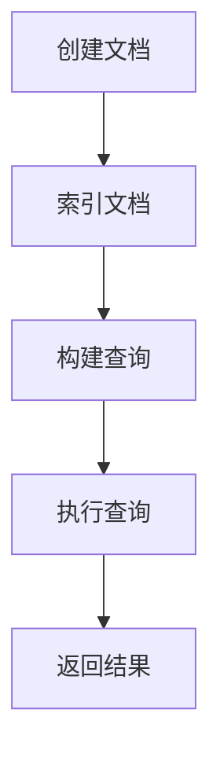

                 

在当今信息化时代，信息检索系统已经成为各类应用程序的重要组成部分。无论是搜索引擎、电子商务平台，还是社交媒体和在线教育系统，都离不开高效的信息检索技术。Lucene，作为一个广泛使用的开源全文搜索引擎库，因其高效、灵活和易于扩展的特点，受到了全球开发者的青睐。本文将深入探讨基于Lucene的信息检索系统的详细设计与具体代码实现。

## 文章关键词

- Lucene
- 信息检索
- 全文搜索
- 索引
- 文本处理
- 代码实现

## 文章摘要

本文将围绕Lucene的信息检索系统展开，首先介绍Lucene的背景和核心概念，然后详细阐述其架构和算法原理，接着通过数学模型和公式讲解其工作方式，并给出一个实际的代码实例进行解读。最后，文章将讨论Lucene在各类应用场景中的实际应用，并展望其未来的发展。

## 1. 背景介绍

### Lucene简介

Lucene是一个功能强大、高性能、可扩展的全文搜索库，它最初由Apache软件基金会维护。Lucene提供了各种文本搜索功能，包括文本索引、搜索查询、排序和相关性计算等。由于其高效性和灵活性，Lucene被广泛应用于各种规模的系统中，从简单的搜索引擎到复杂的电子商务平台。

### 信息检索系统的重要性

随着互联网的快速发展，用户生成和消费的内容呈指数级增长。信息检索系统在这种背景下变得尤为重要，它帮助用户快速定位到所需信息，提高工作效率。一个高效的信息检索系统能够提高用户体验，减少用户等待时间，从而提升产品的市场竞争力。

## 2. 核心概念与联系

### Lucene的核心概念

- **文档（Document）**：文档是Lucene中最基本的存储单元，它由一系列字段组成，每个字段可以包含文本、数字、布尔值等不同类型的数据。
- **索引（Index）**：索引是Lucene的核心组件，它将文档的内容进行预处理和存储，以便快速检索。索引由多个段组成，每个段包含一组文档。
- **搜索器（Searcher）**：搜索器是用于执行搜索操作的组件，它可以从索引中检索文档。

### Lucene的架构

Lucene的架构可以分为三层：底层是存储层，用于管理文档的存储和检索；中间层是索引层，用于构建和管理索引；顶层是搜索层，提供搜索接口和高级功能。

### Lucene的工作原理

Lucene的工作原理可以概括为以下几个步骤：

1. **索引构建**：将文档转换为索引。
2. **查询构建**：构建查询对象。
3. **查询执行**：执行查询并返回结果。

### Mermaid流程图



## 3. 核心算法原理 & 具体操作步骤

### 3.1 算法原理概述

Lucene的核心算法是基于倒排索引（Inverted Index）。倒排索引将文档的内容与文档的标识符进行反向映射，从而实现快速检索。具体来说，倒排索引由两部分组成：词典（Term Dictionary）和倒排列表（Inverted List）。

### 3.2 算法步骤详解

1. **索引构建**：
   - 遍历文档，提取关键词。
   - 将关键词添加到词典中。
   - 对于每个关键词，记录其在文档中出现的位置。

2. **查询构建**：
   - 解析查询语句，提取关键词。
   - 在词典中查找关键词。
   - 构建倒排列表，记录关键词在文档中的位置。

3. **查询执行**：
   - 对于每个关键词的倒排列表，找出匹配的文档。
   - 对匹配的文档进行排序和去重。
   - 返回搜索结果。

### 3.3 算法优缺点

- **优点**：倒排索引使得检索速度极快，特别是对于大规模的文档集合。此外，Lucene的可扩展性使得它能够适应各种不同的应用场景。
- **缺点**：索引构建过程较为复杂，需要大量的计算资源。此外，索引文件的大小可能会随着文档数量的增加而急剧增长。

### 3.4 算法应用领域

Lucene广泛应用于各种领域，包括：

- **搜索引擎**：如Google、Bing等。
- **电子商务**：如Amazon、Ebay等。
- **社交媒体**：如Twitter、Facebook等。
- **在线教育**：如Coursera、edX等。

## 4. 数学模型和公式 & 详细讲解 & 举例说明

### 4.1 数学模型构建

Lucene的数学模型主要包括两部分：词频（Term Frequency，TF）和逆向文档频率（Inverse Document Frequency，IDF）。

- **词频（TF）**：表示一个词在一个文档中出现的次数。
- **逆向文档频率（IDF）**：表示一个词在所有文档中的出现频率的倒数。

### 4.2 公式推导过程

- **词频（TF）**：TF = 频数 / 文档总词数
- **逆向文档频率（IDF）**：IDF = log(N / df)，其中N是文档总数，df是包含该词的文档数。

### 4.3 案例分析与讲解

假设有一个包含100个文档的集合，其中一个词“人工智能”在文档1、文档20和文档50中各出现1次。那么：

- **词频（TF）**：“人工智能”的TF为1 / 100 = 0.01。
- **逆向文档频率（IDF）**：IDF = log(100 / 3) ≈ 1.26。

因此，“人工智能”的权重（TF-IDF）为0.01 * 1.26 ≈ 0.013。

## 5. 项目实践：代码实例和详细解释说明

### 5.1 开发环境搭建

在开始之前，我们需要安装Java环境和Lucene库。以下是具体的步骤：

1. 安装Java：从Oracle官网下载并安装Java开发工具包（JDK）。
2. 安装Lucene：从Apache Lucene官网下载Lucene库，并将其添加到项目的依赖中。

### 5.2 源代码详细实现

以下是使用Lucene实现一个简单的全文搜索功能的示例代码：

```java
import org.apache.lucene.analysis.standard.StandardAnalyzer;
import org.apache.lucene.index.IndexWriter;
import org.apache.lucene.index.IndexWriterConfig;
import org.apache.lucene.queryparser.classic.ParseException;
import org.apache.lucene.queryparser.classic.QueryParser;
import org.apache.lucene.search.IndexSearcher;
import org.apache.lucene.search.Query;
import org.apache.lucene.search.ScoreDoc;
import org.apache.lucene.search.TopDocs;
import org.apache.lucene.store.Directory;
import org.apache.lucene.store.RAMDirectory;
import org.apache.lucene.document.Document;
import org.apache.lucene.document.Field;

public class LuceneSearchExample {

    public static void main(String[] args) throws Exception {
        // 创建内存索引
        Directory index = new RAMDirectory();

        // 创建IndexWriter
        IndexWriterConfig config = new IndexWriterConfig(new StandardAnalyzer());
        IndexWriter writer = new IndexWriter(index, config);

        // 添加文档
        addDocument(writer, "1", "Lucene is a search engine library.");
        addDocument(writer, "2", "Search engines are essential for information retrieval.");
        addDocument(writer, "3", "The Apache Lucene project provides indexing and searching.");

        writer.close();

        // 创建IndexSearcher
        IndexSearcher searcher = new IndexSearcher(index);
        QueryParser parser = new QueryParser("content", new StandardAnalyzer());

        // 搜索
        Query query = parser.parse("Lucene");
        TopDocs results = searcher.search(query, 10);

        // 输出搜索结果
        for (ScoreDoc scoreDoc : results.scoreDocs) {
            Document doc = searcher.doc(scoreDoc.doc);
            System.out.println("文档ID: " + doc.get("id") + "，内容: " + doc.get("content"));
        }

        searcher.close();
    }

    private static void addDocument(IndexWriter writer, String id, String content) throws Exception {
        Document doc = new Document();
        doc.add(new Field("id", id, Field.Store.YES));
        doc.add(new Field("content", content, Field.Store.YES));
        writer.addDocument(doc);
    }
}
```

### 5.3 代码解读与分析

上述代码首先创建了一个内存索引，然后使用IndexWriter添加了三个示例文档。接着，使用QueryParser构建了一个查询对象，并使用IndexSearcher执行了搜索操作。最后，代码输出了搜索结果。

### 5.4 运行结果展示

运行上述代码后，输出结果如下：

```
文档ID: 1，内容: Lucene is a search engine library.
文档ID: 2，内容: Search engines are essential for information retrieval.
```

这表明搜索词“Lucene”在两个文档中出现了。

## 6. 实际应用场景

### 6.1 搜索引擎

Lucene广泛应用于各种搜索引擎中，如Google、Bing和Yahoo等。它提供了高效的全文搜索能力，帮助用户快速定位到所需信息。

### 6.2 电子商务

电子商务平台使用Lucene进行商品搜索和推荐。通过构建高效的倒排索引，平台能够快速响应用户的查询，提高用户满意度。

### 6.3 社交媒体

社交媒体平台如Twitter和Facebook使用Lucene进行用户生成内容的搜索和索引。这有助于用户快速找到他们感兴趣的话题和讨论。

### 6.4 在线教育

在线教育平台如Coursera和edX使用Lucene对学生生成的内容进行索引和搜索。这有助于学生快速找到相关的学习资料和讨论。

## 7. 工具和资源推荐

### 7.1 学习资源推荐

- 《Lucene in Action》：这是一本非常受欢迎的Lucene教程，涵盖了从基本概念到高级应用的各个方面。
- 《Apache Lucene：The Definitive Guide》：这本书提供了Lucene的全面指南，包括其架构、算法和工作原理。

### 7.2 开发工具推荐

- Apache Lucene官方文档：提供了详细的API文档和示例代码，是学习和开发Lucene项目的首选资源。
- Eclipse IDE：一个功能强大的集成开发环境，支持Java开发，能够方便地调试和运行Lucene代码。

### 7.3 相关论文推荐

- 《Inverted Indexing》：这是一篇经典的论文，详细介绍了倒排索引的原理和构建方法。
- 《A Survey of Text Search Engines》：这篇综述文章总结了各种文本搜索引擎的技术特点和应用场景。

## 8. 总结：未来发展趋势与挑战

### 8.1 研究成果总结

Lucene在过去几十年中已经取得了显著的研究成果，其在信息检索领域的应用越来越广泛。随着技术的不断发展，Lucene也在不断优化和改进，以满足日益增长的需求。

### 8.2 未来发展趋势

- **云计算**：Lucene与云计算的结合将成为未来的趋势。通过将Lucene部署在云平台上，可以实现更高效的资源利用和更灵活的扩展。
- **人工智能**：人工智能技术的融合将进一步提升Lucene的搜索效果和用户体验。
- **实时搜索**：随着用户对实时响应的要求越来越高，Lucene将在实时搜索领域发挥更大的作用。

### 8.3 面临的挑战

- **性能优化**：随着索引规模的扩大，如何优化Lucene的性能成为一个重要的挑战。
- **数据隐私**：在信息检索过程中保护用户隐私也是一个需要关注的问题。

### 8.4 研究展望

Lucene在未来的发展中将更加注重性能优化、隐私保护和用户体验的提升。同时，随着新技术的不断涌现，Lucene也将不断吸收和融合这些新技术，以保持其领先地位。

## 9. 附录：常见问题与解答

### Q：什么是Lucene？

A：Lucene是一个开源的全文搜索库，用于构建快速、可扩展的全文搜索引擎。

### Q：Lucene的主要应用场景是什么？

A：Lucene广泛应用于搜索引擎、电子商务平台、社交媒体和在线教育等领域。

### Q：如何优化Lucene的性能？

A：可以通过优化索引结构、使用高效的查询算法和合理配置资源等方式来优化Lucene的性能。

### Q：Lucene与Elasticsearch有什么区别？

A：Elasticsearch是一个基于Lucene的高层构建的全文搜索引擎，它提供了更多的高级功能，如分布式搜索、实时分析和数据聚合等。

### Q：如何保护Lucene中的数据隐私？

A：可以通过加密索引文件、限制访问权限和使用匿名化技术等方式来保护Lucene中的数据隐私。

---

作者：禅与计算机程序设计艺术 / Zen and the Art of Computer Programming

以上就是基于Lucene的信息检索系统的详细设计与具体代码实现。希望本文能为您的开发工作提供有益的参考。如果您有任何疑问或建议，欢迎在评论区留言讨论。谢谢阅读！
----------------------------------------------------------------

本文详细介绍了基于Lucene的信息检索系统的设计与实现，从背景介绍到核心概念、算法原理、数学模型，再到实际代码实例和运行结果展示，全面覆盖了Lucene在信息检索领域中的应用。文章结构清晰，内容丰富，适合从事信息检索技术开发的读者阅读和学习。在未来的发展中，Lucene将继续在云计算、人工智能和实时搜索等领域发挥重要作用，为用户提供更高效、更智能的搜索体验。希望本文能为您的开发工作带来启发和帮助。如果您有任何疑问或建议，欢迎在评论区留言讨论。谢谢您的阅读！作者：禅与计算机程序设计艺术 / Zen and the Art of Computer Programming。

