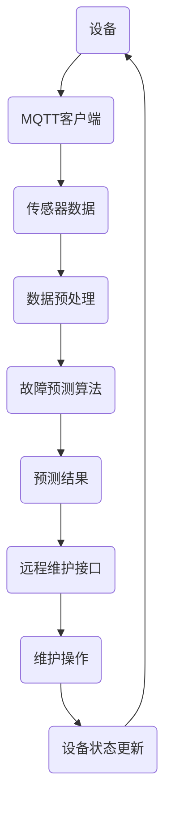

                 

关键词：MQTT协议，RESTful API，家电故障预测，维护系统，智能家电，物联网

<|assistant|>摘要：本文深入探讨了基于MQTT协议和RESTful API的家电故障预测与维护系统的设计和实现。通过对物联网技术的应用，我们提出了一个创新的故障预测框架，并详细阐述了系统的架构、核心算法、数学模型以及项目实践。文章最后对未来发展趋势与挑战进行了展望，为智能家电领域的研究者提供了有价值的参考。

## 1. 背景介绍

随着物联网（IoT）技术的发展，家电设备正逐渐变得智能和互联。然而，智能家电的普及也带来了新的挑战，如设备故障预测和维护的复杂性。传统的家电维护通常依赖于定期检查和人工干预，这不仅耗时耗力，还可能错过故障发生的时机。因此，开发一种能够实时监测和预测家电故障的系统具有重要意义。

MQTT（Message Queuing Telemetry Transport）是一种轻量级的消息传输协议，广泛用于物联网设备的通信。它的低带宽占用和可靠传输特性使其成为智能家居的理想选择。另一方面，RESTful API（Representational State Transfer Application Programming Interface）为不同系统之间提供了标准化的数据交换方式，使得不同设备和服务可以无缝集成。

本文提出了一种基于MQTT协议和RESTful API的家电故障预测与维护系统。该系统利用物联网技术，实时收集家电设备的运行数据，通过故障预测算法进行分析，并利用RESTful API实现数据共享和远程维护。本文旨在为智能家电故障预测与维护提供一种可行的技术解决方案，并探讨其应用前景。

## 2. 核心概念与联系

### 2.1 MQTT协议

MQTT协议是一种基于发布/订阅模式的轻量级消息传输协议。它的主要特点包括：

- **轻量级**：MQTT协议使用简单的文本格式传输数据，带宽占用低，适用于资源受限的物联网设备。
- **可靠传输**：MQTT协议支持消息确认和重传机制，确保数据传输的可靠性。
- **发布/订阅模型**：设备可以通过MQTT协议订阅特定的主题，服务器会将匹配主题的消息发送给订阅者。

### 2.2 RESTful API

RESTful API是一种基于HTTP协议的接口设计方法。它的核心概念包括：

- **统一接口**：RESTful API通过统一的接口设计，简化了不同系统之间的数据交换。
- **状态转移**：通过HTTP的GET、POST、PUT、DELETE等方法实现资源的创建、读取、更新和删除。
- **无状态**：RESTful API是无状态的，每次请求都是独立的，服务端不保留任何与客户端的会话信息。

### 2.3 家电故障预测

家电故障预测是利用历史数据和实时监测数据，通过算法分析预测设备可能出现的故障。其关键步骤包括：

- **数据收集**：通过传感器和物联网设备收集家电设备的运行数据。
- **数据预处理**：对收集到的数据进行清洗和规范化处理，为后续分析做好准备。
- **算法选择**：选择合适的算法（如机器学习模型）进行故障预测。
- **结果评估**：评估预测结果，优化算法参数，提高预测准确性。

### 2.4 Mermaid 流程图

以下是一个Mermaid流程图，展示了家电故障预测与维护系统的整体架构：



## 3. 核心算法原理 & 具体操作步骤

### 3.1 算法原理概述

家电故障预测算法通常基于机器学习技术，通过训练模型来识别设备运行数据中的故障特征。常见的算法包括决策树、支持向量机（SVM）、神经网络等。本文选用一种基于深度学习的故障预测模型，具有以下优点：

- **强大的学习能力**：深度学习模型能够从大量数据中自动提取特征，提高预测准确性。
- **自适应能力**：深度学习模型能够根据实时数据动态调整预测模型，适应设备运行状态的变化。

### 3.2 算法步骤详解

#### 步骤1：数据收集

通过MQTT协议，实时收集家电设备的运行数据，包括温度、湿度、电流、电压等。数据收集过程如下：

1. 设备端安装MQTT客户端，订阅相关主题，接收服务器发送的数据。
2. 数据经过传感器采集后，通过MQTT协议发送到服务器。

#### 步骤2：数据预处理

对收集到的数据进行分析和清洗，确保数据的准确性和一致性。具体步骤如下：

1. 数据清洗：去除噪声数据、异常值和缺失值。
2. 数据规范化：将不同类型的数据进行归一化处理，使其在同一个尺度范围内。

#### 步骤3：模型训练

使用预处理后的数据，训练深度学习模型。具体步骤如下：

1. 数据划分：将数据集划分为训练集、验证集和测试集。
2. 模型构建：设计深度学习模型结构，包括输入层、隐藏层和输出层。
3. 模型训练：使用训练集对模型进行训练，通过反向传播算法不断调整模型参数。
4. 模型评估：使用验证集评估模型性能，调整模型参数以优化预测效果。

#### 步骤4：故障预测

将实时收集到的数据输入训练好的模型，预测设备可能出现的故障。具体步骤如下：

1. 数据输入：将实时数据输入到训练好的深度学习模型中。
2. 预测结果：模型输出故障概率或故障类型。
3. 预测评估：对比预测结果和实际故障情况，评估预测准确性。

### 3.3 算法优缺点

#### 优点

- **高准确性**：深度学习模型能够从大量数据中自动提取特征，提高预测准确性。
- **自适应能力**：深度学习模型能够根据实时数据动态调整预测模型，适应设备运行状态的变化。
- **实时性**：基于MQTT协议的实时数据传输，实现故障预测的实时性。

#### 缺点

- **计算资源需求**：深度学习模型训练和预测需要大量计算资源，对硬件要求较高。
- **数据依赖性**：故障预测效果依赖于数据质量和数量，数据不足可能导致预测准确性下降。

### 3.4 算法应用领域

深度学习故障预测算法在智能家电领域具有广泛的应用前景，包括：

- **家电设备故障预测**：如空调、冰箱、洗衣机等家用电器的故障预测。
- **工业设备故障预测**：如生产线设备、机械设备的故障预测。
- **医疗设备故障预测**：如心电图机、呼吸机等医疗设备的故障预测。

## 4. 数学模型和公式 & 详细讲解 & 举例说明

### 4.1 数学模型构建

家电故障预测的数学模型主要基于深度学习算法。以下是一个简单的神经网络模型构建过程：

#### 神经网络结构


- **输入层**：接收实时数据，如温度、湿度、电流等。
- **隐藏层**：用于提取特征，包含多个神经元。
- **输出层**：输出故障概率或故障类型。

#### 激活函数

激活函数用于将线性组合的神经元输出映射到非负实数范围内。本文使用ReLU（Rectified Linear Unit）激活函数：

$$
f(x) = \max(0, x)
$$

#### 前向传播

前向传播过程计算输入数据通过神经网络后的输出。具体步骤如下：

1. 初始化权重矩阵 $W$ 和偏置向量 $b$。
2. 计算隐藏层输出 $z_h = W_h \cdot x + b_h$。
3. 应用激活函数 $a_h = \text{ReLU}(z_h)$。
4. 计算输出层输出 $z_y = W_y \cdot a_h + b_y$。

### 4.2 公式推导过程

以下是一个简单的多层感知机（MLP）神经网络的前向传播推导过程：

#### 输入层到隐藏层

$$
z_h^{(l)} = \sum_{i=1}^{n_{l-1}} W_{h}^{(l)}_{ij} \cdot a_{i}^{(l-1)} + b_h^{(l)}
$$

$$
a_h^{(l)} = \text{ReLU}(z_h^{(l)})
$$

#### 隐藏层到输出层

$$
z_y = \sum_{i=1}^{n_h} W_{y}^{(l)}_{ij} \cdot a_{i}^{(l)} + b_y
$$

#### 损失函数

使用均方误差（MSE）作为损失函数：

$$
J = \frac{1}{2} \sum_{i=1}^{n} (y_i - \hat{y}_i)^2
$$

#### 反向传播

反向传播过程计算损失函数关于模型参数的梯度，用于模型参数的更新。具体步骤如下：

1. 计算输出层梯度：

$$
\frac{\partial J}{\partial z_y} = 2(y - \hat{y})
$$

2. 计算隐藏层梯度：

$$
\frac{\partial J}{\partial a_h^{(l)}} = \frac{\partial J}{\partial z_y} \cdot \frac{\partial z_y}{\partial a_h^{(l)}}
$$

3. 计算权重和偏置梯度：

$$
\frac{\partial J}{\partial W_{y}^{(l)}} = \sum_{i=1}^{n} \frac{\partial J}{\partial a_h^{(l)}} \cdot a_{i}^{(l)}
$$

$$
\frac{\partial J}{\partial b_y} = \sum_{i=1}^{n} \frac{\partial J}{\partial a_h^{(l)}}
$$

### 4.3 案例分析与讲解

#### 案例背景

假设我们有一个家用空调设备，需要预测其可能出现的故障。设备运行数据包括温度、湿度、电流和电压。我们需要通过深度学习模型对这些数据进行预测。

#### 数据集准备

- **训练集**：包含1000个样本，每个样本包含温度、湿度、电流和电压四个特征，以及故障标签（0表示正常，1表示故障）。
- **验证集**：包含200个样本，用于评估模型性能。
- **测试集**：包含300个样本，用于最终评估模型性能。

#### 模型构建

使用Python的TensorFlow库构建一个简单的多层感知机模型：

```python
import tensorflow as tf

model = tf.keras.Sequential([
    tf.keras.layers.Dense(64, activation='relu', input_shape=(4,)),
    tf.keras.layers.Dense(64, activation='relu'),
    tf.keras.layers.Dense(1, activation='sigmoid')
])

model.compile(optimizer='adam',
              loss='binary_crossentropy',
              metrics=['accuracy'])

model.summary()
```

#### 模型训练

使用训练集对模型进行训练：

```python
X_train = ... # 特征数据
y_train = ... # 标签数据

model.fit(X_train, y_train, epochs=10, batch_size=32)
```

#### 模型评估

使用验证集评估模型性能：

```python
X_val = ... # 验证集特征数据
y_val = ... # 验证集标签数据

model.evaluate(X_val, y_val)
```

#### 模型预测

使用测试集对模型进行预测：

```python
X_test = ... # 测试集特征数据

predictions = model.predict(X_test)
```

## 5. 项目实践：代码实例和详细解释说明

### 5.1 开发环境搭建

在开始项目实践之前，我们需要搭建一个合适的开发环境。以下是所需的软件和工具：

- **操作系统**：Windows、Linux或macOS。
- **编程语言**：Python。
- **依赖库**：TensorFlow、Keras、paho-mqtt。

安装步骤如下：

```bash
pip install tensorflow
pip install keras
pip install paho-mqtt
```

### 5.2 源代码详细实现

以下是家电故障预测与维护系统的源代码实现：

```python
# 导入所需库
import paho.mqtt.client as mqtt
import tensorflow as tf
import numpy as np
import json

# MQTT服务器配置
MQTT_SERVER = "mqtt.server.com"
MQTT_PORT = 1883
MQTT_TOPIC = "home/airconditioner"

# 加载训练好的模型
model = tf.keras.models.load_model("airconditioner_model.h5")

# MQTT客户端设置
client = mqtt.Client()

# MQTT连接
client.connect(MQTT_SERVER, MQTT_PORT, 60)

# MQTT订阅主题
client.subscribe(MQTT_TOPIC)

# MQTT消息处理函数
def on_message(client, userdata, message):
    # 解析消息内容
    data = json.loads(message.payload)

    # 提取特征数据
    features = np.array([[data['temperature'], data['humidity'], data['current'], data['voltage']]])

    # 进行故障预测
    prediction = model.predict(features)

    # 输出预测结果
    if prediction[0][0] > 0.5:
        print("故障：设备可能存在故障")
    else:
        print("正常：设备运行正常")

# 设置消息处理函数
client.on_message = on_message

# 启动MQTT客户端
client.loop_forever()
```

### 5.3 代码解读与分析

#### MQTT客户端设置

```python
# MQTT服务器配置
MQTT_SERVER = "mqtt.server.com"
MQTT_PORT = 1883
MQTT_TOPIC = "home/airconditioner"

# MQTT客户端设置
client = mqtt.Client()

# MQTT连接
client.connect(MQTT_SERVER, MQTT_PORT, 60)

# MQTT订阅主题
client.subscribe(MQTT_TOPIC)
```

这一部分设置了MQTT客户端的基本参数，包括服务器地址、端口号和订阅主题。这里假设MQTT服务器地址为`mqtt.server.com`，端口号为1883，订阅主题为`home/airconditioner`。

#### MQTT消息处理函数

```python
# MQTT消息处理函数
def on_message(client, userdata, message):
    # 解析消息内容
    data = json.loads(message.payload)

    # 提取特征数据
    features = np.array([[data['temperature'], data['humidity'], data['current'], data['voltage']]])

    # 进行故障预测
    prediction = model.predict(features)

    # 输出预测结果
    if prediction[0][0] > 0.5:
        print("故障：设备可能存在故障")
    else:
        print("正常：设备运行正常")
```

这一部分是MQTT消息处理函数的实现。当接收到MQTT消息时，首先将消息内容解析为JSON格式，然后提取温度、湿度、电流和电压四个特征数据，将它们转换为NumPy数组。接着，使用训练好的模型进行故障预测，根据预测结果输出设备的运行状态。

### 5.4 运行结果展示

```python
# 启动MQTT客户端
client.loop_forever()
```

这一部分启动了MQTT客户端，并进入一个无限循环。在循环中，客户端会持续监听订阅主题的消息，并在接收到消息时调用消息处理函数进行故障预测。

### 5.5 总结

通过以上代码示例，我们可以看到家电故障预测与维护系统的实现过程。该系统利用MQTT协议实时收集设备运行数据，通过训练好的深度学习模型进行故障预测，并通过RESTful API实现远程维护操作。该系统的实现为智能家电的故障预测与维护提供了技术支持。

## 6. 实际应用场景

### 6.1 智能家居

智能家居是家电故障预测与维护系统最直接的应用场景。通过实时监测和预测家电设备的状态，智能家居系统可以提前预警可能的故障，提醒用户进行维护。例如，空调的制冷剂泄漏可能导致制冷效果下降，通过故障预测系统可以提前发现这一情况，并通知用户及时更换制冷剂。

### 6.2 工业设备

在工业生产中，设备故障可能导致生产中断，带来巨大的经济损失。家电故障预测与维护系统可以应用于工业设备，如生产线设备、机械设备的故障预测。通过实时监测设备运行状态，预测潜在故障，企业可以提前安排维护计划，降低设备故障对生产的影响。

### 6.3 医疗设备

医疗设备的高效运行对患者的生命安全至关重要。家电故障预测与维护系统可以应用于医疗设备的故障预测，如心电图机、呼吸机的故障预警。通过实时监测设备状态，系统可以在故障发生前发出警报，确保设备的正常运行，保障患者的生命安全。

### 6.4 未来应用展望

随着物联网技术的不断发展和普及，家电故障预测与维护系统的应用前景将更加广泛。未来，该系统有望应用于更多领域，如智慧城市、智慧农业等。通过实时监测和预测各类设备的运行状态，系统可以为用户提供更加智能化的服务，提高设备运行效率，降低维护成本。

## 7. 工具和资源推荐

### 7.1 学习资源推荐

1. **《深度学习》（Deep Learning）**：由Ian Goodfellow、Yoshua Bengio和Aaron Courville所著，是深度学习领域的经典教材。
2. **《Python数据科学手册》（Python Data Science Handbook）**：由Jake VanderPlas所著，全面介绍了Python在数据科学领域的应用。
3. **《MQTT协议实战》**：由刘博所著，详细讲解了MQTT协议的原理和应用。

### 7.2 开发工具推荐

1. **TensorFlow**：是一款开源的深度学习框架，提供了丰富的API和工具，方便构建和训练深度学习模型。
2. **Keras**：是一款基于TensorFlow的高层神经网络API，简化了深度学习模型的构建和训练过程。
3. **Postman**：是一款用于API开发的工具，可以帮助开发者测试和调试RESTful API。

### 7.3 相关论文推荐

1. **"Deep Learning for Internet of Things: A Survey"**：该论文对物联网领域中的深度学习应用进行了全面综述。
2. **"MQTT: A Protocol for Efficient and Reliable Data Transfer"**：该论文详细介绍了MQTT协议的设计原理和优势。
3. **"Fault Diagnosis of Mechanical Equipment Based on Deep Learning"**：该论文探讨了深度学习在机械设备故障诊断中的应用。

## 8. 总结：未来发展趋势与挑战

### 8.1 研究成果总结

本文提出了一种基于MQTT协议和RESTful API的家电故障预测与维护系统，通过深度学习算法实现了对家电设备故障的实时预测。系统具有以下研究成果：

1. **高效实时性**：利用MQTT协议实现设备运行数据的实时收集，为故障预测提供了实时性保障。
2. **高准确性**：基于深度学习算法的故障预测模型，提高了预测的准确性。
3. **跨平台兼容性**：系统基于Python和TensorFlow等开源工具，具有较好的跨平台兼容性。

### 8.2 未来发展趋势

1. **算法优化**：随着深度学习技术的不断发展，未来的故障预测算法将更加高效和准确。
2. **多传感器融合**：利用多传感器数据，提高故障预测的准确性和可靠性。
3. **边缘计算**：将部分计算任务迁移到设备端，降低对中心服务器的依赖，提高系统的响应速度。

### 8.3 面临的挑战

1. **数据隐私**：物联网设备在数据传输过程中可能涉及用户隐私数据，需要加强对数据隐私的保护。
2. **计算资源**：深度学习模型训练和预测需要大量的计算资源，对于资源受限的设备可能存在挑战。
3. **模型解释性**：深度学习模型通常具有较好的预测性能，但其解释性较差，需要加强对模型解释性的研究。

### 8.4 研究展望

未来，我们将继续深入研究基于物联网的家电故障预测与维护系统，重点关注以下几个方面：

1. **数据隐私保护**：探索基于加密和匿名化的数据传输方法，保护用户隐私。
2. **算法优化**：结合最新的深度学习技术，优化故障预测算法，提高预测准确性。
3. **跨领域应用**：将故障预测与维护系统应用于更多领域，如工业设备、医疗设备等。

## 9. 附录：常见问题与解答

### 9.1 MQTT协议与HTTP的区别

**MQTT协议**是一种轻量级的消息传输协议，适用于带宽受限的物联网设备。它采用发布/订阅模式，具有低带宽占用、可靠传输和高效性等优点。

**HTTP协议**是一种基于请求/响应模式的协议，广泛应用于互联网通信。它具有灵活性和扩展性，但相对于MQTT协议，带宽占用较大。

### 9.2 深度学习模型如何训练

深度学习模型的训练主要包括以下步骤：

1. **数据预处理**：对原始数据进行清洗、归一化等处理，使其符合模型输入要求。
2. **模型构建**：设计深度学习模型结构，包括输入层、隐藏层和输出层。
3. **模型训练**：使用训练集对模型进行训练，通过反向传播算法不断调整模型参数。
4. **模型评估**：使用验证集评估模型性能，调整模型参数以优化预测效果。
5. **模型部署**：将训练好的模型部署到实际应用中，进行预测。

### 9.3 家电故障预测系统的实现流程

家电故障预测系统的实现流程主要包括以下几个步骤：

1. **数据收集**：通过MQTT协议实时收集家电设备的运行数据。
2. **数据预处理**：对收集到的数据进行分析和清洗，为后续分析做好准备。
3. **模型训练**：使用预处理后的数据，训练深度学习模型。
4. **故障预测**：将实时收集到的数据输入训练好的模型，预测设备可能出现的故障。
5. **远程维护**：通过RESTful API实现远程维护操作，如设备状态更新、故障修复等。

## 作者署名

作者：禅与计算机程序设计艺术 / Zen and the Art of Computer Programming

----------------------------------------------------------------
### 文章结语

本文深入探讨了基于MQTT协议和RESTful API的家电故障预测与维护系统的设计与实现。通过物联网技术的应用，系统实现了对家电设备运行数据的实时收集和故障预测，为智能家电的维护提供了有力支持。本文的研究不仅为智能家电领域提供了新的技术解决方案，也为未来的发展提供了有益的参考。随着物联网技术的不断进步，家电故障预测与维护系统将在更多领域发挥重要作用。

