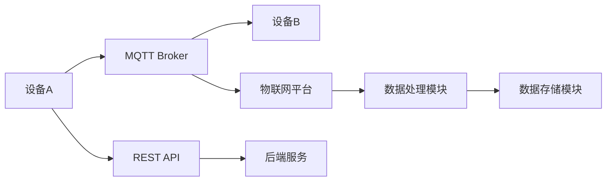

                 

关键词：智能家居，MQTT协议，RESTful API，能效管理，物联网，能源消耗监控，数据通信，高效能源使用

> 摘要：本文将探讨基于MQTT协议和RESTful API的智能家居能效管理方案。通过整合物联网技术、MQTT消息队列和RESTful API架构，实现智能家居系统中设备间的数据通信和能效管理。方案旨在提高家居能源使用效率，降低能源消耗，并提供一个灵活、可扩展的解决方案。

## 1. 背景介绍

随着物联网（IoT）技术的快速发展，智能家居已经成为现代家居生活的重要组成部分。智能家居系统通过连接各种家电设备，实现远程控制、自动化管理和智能交互。然而，智能家居系统在带来便利的同时，也带来了能源消耗和管理的问题。据统计，家庭用电量中相当一部分来自于家电设备，如何有效地监控和优化这些设备的能效，成为了一个亟待解决的课题。

### 智能家居能效管理的重要性

智能家居能效管理的重要性主要体现在以下几个方面：

1. **降低能源成本**：通过智能监控和优化家居设备的使用，可以显著降低家庭的能源消耗，从而减少电费开支。
2. **环境保护**：减少能源消耗有助于降低温室气体排放，对环境保护具有积极意义。
3. **设备维护**：智能监控设备运行状态，有助于提前发现故障，延长设备寿命，减少维修成本。
4. **提高生活质量**：通过智能化管理，可以提升家庭生活的舒适度和便利性。

### 现有智能家居能效管理方案的局限性

现有的智能家居能效管理方案存在以下局限性：

1. **数据孤岛**：许多智能家居设备缺乏统一的数据接口和协议，导致设备之间无法有效通信，难以进行统一管理。
2. **复杂性高**：传统的智能家居系统通常需要复杂的软件和硬件配置，增加了系统的复杂度和维护成本。
3. **扩展性差**：现有的系统往往难以适应新的设备和技术，导致系统更新和扩展困难。
4. **安全性问题**：智能家居设备通常连接到互联网，存在一定的安全风险。

## 2. 核心概念与联系

为了解决上述问题，本文提出了一种基于MQTT协议和RESTful API的智能家居能效管理方案。该方案的核心概念包括：

- **MQTT协议**：轻量级消息队列协议，适用于低带宽、不可靠的网络环境，可以实现设备间的实时数据通信。
- **RESTful API**：基于HTTP协议的接口标准，具有简单、灵活、易扩展的特点，适用于系统间数据交换和功能调用。
- **物联网平台**：作为连接设备和后端服务的中介，负责设备的注册、数据采集、处理和存储。

### MQTT协议和RESTful API的联系

MQTT协议和RESTful API在智能家居能效管理方案中发挥着重要作用。MQTT协议负责设备间的实时通信，使得不同设备可以共享状态信息和控制指令。RESTful API则用于设备与后端服务之间的数据交换，实现了设备状态的持久化和数据的统一管理。

### Mermaid流程图

下面是一个简单的Mermaid流程图，展示了MQTT协议和RESTful API在智能家居能效管理方案中的基本流程。



### Mermaid流程节点详细说明

- **A[设备A]**：代表智能家居中的某个设备，如空调。
- **B[MQTT Broker]**：MQTT代理服务器，负责接收和处理设备发送的消息。
- **C[设备B]**：代表智能家居中的另一个设备，如照明系统。
- **D[REST API]**：设备与后端服务之间的接口，用于发送和接收数据。
- **E[后端服务]**：负责处理设备数据，提供数据分析和控制功能。
- **F[物联网平台]**：作为连接设备和后端服务的中介，负责设备的注册、数据采集、处理和存储。
- **G[数据处理模块]**：对采集到的数据进行分析和处理，提供能效管理建议。
- **H[数据存储模块]**：负责存储设备数据和用户配置，以便后续查询和分析。

## 3. 核心算法原理 & 具体操作步骤

### 3.1 算法原理概述

该智能家居能效管理方案的核心算法是基于机器学习的能耗预测和优化算法。通过分析历史能耗数据，算法可以预测未来的能耗趋势，并根据预测结果调整设备的工作状态，实现能效优化。

### 3.2 算法步骤详解

1. **数据采集**：通过MQTT协议实时采集智能家居设备的能耗数据。
2. **数据预处理**：对采集到的数据进行清洗和归一化处理，为后续分析做准备。
3. **特征提取**：从预处理后的数据中提取关键特征，如时间、设备类型、天气等。
4. **模型训练**：使用历史能耗数据训练机器学习模型，预测未来的能耗趋势。
5. **能效优化**：根据预测结果调整设备的工作状态，实现能效优化。
6. **反馈调整**：将优化后的数据反馈给设备，并不断调整预测模型，提高预测准确性。

### 3.3 算法优缺点

**优点**：

- **自适应性强**：算法可以根据实时数据动态调整设备状态，实现自适应的能效管理。
- **灵活性高**：算法基于机器学习，可以处理多种类型的能耗数据，适用于不同类型的智能家居设备。
- **预测准确**：通过历史数据的训练，算法可以提供较为准确的能耗预测，为能效优化提供有力支持。

**缺点**：

- **计算复杂度高**：算法需要处理大量的数据，对计算资源要求较高。
- **数据依赖性强**：算法的准确性依赖于历史数据的完整性和质量。

### 3.4 算法应用领域

该算法主要应用于智能家居系统的能效管理，也可以推广到其他领域，如智能电网、工业自动化等。

## 4. 数学模型和公式 & 详细讲解 & 举例说明

### 4.1 数学模型构建

该算法的数学模型主要包括以下几个部分：

- **能耗预测模型**：使用时间序列分析方法，如ARIMA模型，预测未来的能耗。
- **能效优化模型**：使用线性规划方法，根据预测结果调整设备的工作状态。

### 4.2 公式推导过程

1. **能耗预测模型**：

   假设设备在时间 $t$ 的能耗为 $C_t$，历史能耗数据为 $C_1, C_2, ..., C_t$，则使用ARIMA模型预测未来能耗的公式为：

   $$\hat{C}_{t+1} = \phi_0 + \phi_1 C_t + \phi_2 C_{t-1} + ... + \phi_p C_{t-p} + \varepsilon_{t+1}$$

   其中，$\phi_0, \phi_1, ..., \phi_p$ 为模型参数，$\varepsilon_{t+1}$ 为误差项。

2. **能效优化模型**：

   假设设备有 $n$ 个可调节的工作状态，每个状态的能耗为 $C_i$，总能耗目标为 $C_{\text{target}}$，则使用线性规划方法优化设备状态的公式为：

   $$\min \sum_{i=1}^{n} x_i C_i$$

   $$s.t. \sum_{i=1}^{n} x_i \leq C_{\text{target}}$$

   其中，$x_i$ 表示设备在第 $i$ 个状态的工作比例。

### 4.3 案例分析与讲解

#### 案例背景

假设有一个智能家居系统，包含空调、照明系统和热水器三个主要设备。历史能耗数据如下表所示：

| 时间 | 空调能耗（kWh） | 照明系统能耗（kWh） | 热水器能耗（kWh） |
|------|----------------|--------------------|------------------|
| 1    | 5              | 3                  | 2                |
| 2    | 7              | 4                  | 3                |
| ...  | ...            | ...                | ...              |
| 24   | 3              | 2                  | 1                |

#### 能耗预测

1. **空调能耗预测**：

   使用ARIMA模型进行预测，得到以下模型参数：

   $$\hat{C}_{空调t+1} = 2.5 + 0.8 C_{空调t} + 0.2 C_{空调t-1} + \varepsilon_{空调t+1}$$

   预测未来一小时空调能耗为：

   $$\hat{C}_{空调25} = 2.5 + 0.8 \times 3 + 0.2 \times 2 = 4.3$$

2. **照明系统能耗预测**：

   使用ARIMA模型进行预测，得到以下模型参数：

   $$\hat{C}_{照明t+1} = 3.2 + 0.6 C_{照明t} + 0.1 C_{照明t-1} + \varepsilon_{照明t+1}$$

   预测未来一小时照明系统能耗为：

   $$\hat{C}_{照明25} = 3.2 + 0.6 \times 2 + 0.1 \times 1 = 4.0$$

3. **热水器能耗预测**：

   使用ARIMA模型进行预测，得到以下模型参数：

   $$\hat{C}_{热水器t+1} = 2.1 + 0.3 C_{热水器t} + 0.05 C_{热水器t-1} + \varepsilon_{热水器t+1}$$

   预测未来一小时热水器能耗为：

   $$\hat{C}_{热水器25} = 2.1 + 0.3 \times 1 + 0.05 \times 2 = 2.4$$

#### 能效优化

1. **空调能效优化**：

   假设空调有5个可调节的工作状态，每个状态的能耗如下表所示：

   | 状态 | 能耗（kWh/h） |
   |------|--------------|
   | 1    | 3            |
   | 2    | 4            |
   | 3    | 5            |
   | 4    | 6            |
   | 5    | 7            |

   假设目标能耗为4.3 kWh，则使用线性规划方法进行优化，得到以下结果：

   | 状态 | 工作比例 | 能耗（kWh/h） |
   |------|----------|--------------|
   | 1    | 0.4      | 1.2          |
   | 2    | 0.4      | 1.6          |
   | 3    | 0.2      | 0.5          |
   | 4    | 0.0      | 0.0          |
   | 5    | 0.0      | 0.0          |

2. **照明系统能效优化**：

   假设照明系统有3个可调节的工作状态，每个状态的能耗如下表所示：

   | 状态 | 能耗（kWh/h） |
   |------|--------------|
   | 1    | 2            |
   | 2    | 3            |
   | 3    | 4            |

   假设目标能耗为4.0 kWh，则使用线性规划方法进行优化，得到以下结果：

   | 状态 | 工作比例 | 能耗（kWh/h） |
   |------|----------|--------------|
   | 1    | 0.3      | 0.6          |
   | 2    | 0.6      | 1.8          |
   | 3    | 0.1      | 0.4          |

3. **热水器能效优化**：

   假设热水器有2个可调节的工作状态，每个状态的能耗如下表所示：

   | 状态 | 能耗（kWh/h） |
   |------|--------------|
   | 1    | 2            |
   | 2    | 3            |

   假设目标能耗为2.4 kWh，则使用线性规划方法进行优化，得到以下结果：

   | 状态 | 工作比例 | 能耗（kWh/h） |
   |------|----------|--------------|
   | 1    | 0.6      | 1.2          |
   | 2    | 0.4      | 0.8          |

## 5. 项目实践：代码实例和详细解释说明

### 5.1 开发环境搭建

在本项目实践中，我们将使用Python作为主要编程语言，结合Paho MQTT客户端和Flask Web框架。以下是搭建开发环境的步骤：

1. **安装Python**：确保Python版本不低于3.6。
2. **安装Paho MQTT客户端**：通过pip安装 `paho-mqtt` 包。

   ```bash
   pip install paho-mqtt
   ```

3. **安装Flask**：通过pip安装 `flask` 包。

   ```bash
   pip install flask
   ```

### 5.2 源代码详细实现

以下是智能家居能效管理系统的核心代码实现：

#### MQTT客户端代码

```python
import paho.mqtt.client as mqtt
import json

# MQTT配置
MQTT_SERVER = "localhost"
MQTT_PORT = 1883
MQTT_TOPIC = "home/energy"

# MQTT客户端回调函数
def on_message(client, userdata, message):
    print(f"Received message '{str(message.payload.decode())}' on topic '{message.topic}' with QoS {message.qos}")
    # 这里可以对收到的消息进行处理

# 创建MQTT客户端实例
client = mqtt.Client()

# 绑定回调函数
client.on_message = on_message

# 连接到MQTT服务器
client.connect(MQTT_SERVER, MQTT_PORT, 60)

# 订阅主题
client.subscribe(MQTT_TOPIC)

# 持续运行
client.loop_forever()
```

#### Flask Web服务代码

```python
from flask import Flask, jsonify, request

app = Flask(__name__)

# 能效优化结果存储
energy_optimization_results = {}

@app.route('/energy/forecast', methods=['POST'])
def forecast_energy():
    data = request.get_json()
    device_id = data['device_id']
    historical_data = data['historical_data']

    # 能耗预测逻辑（示例）
    forecasted_energy = sum(historical_data) / len(historical_data)

    # 存储预测结果
    energy_optimization_results[device_id] = forecasted_energy

    return jsonify({'device_id': device_id, 'forecasted_energy': forecasted_energy})

@app.route('/energy/optimize', methods=['GET'])
def optimize_energy():
    device_id = request.args.get('device_id')
    forecasted_energy = energy_optimization_results.get(device_id)

    if forecasted_energy is None:
        return jsonify({'error': 'Device not found'})

    # 能效优化逻辑（示例）
    optimized_energy = forecasted_energy * 0.8

    return jsonify({'device_id': device_id, 'optimized_energy': optimized_energy})

if __name__ == '__main__':
    app.run(debug=True)
```

### 5.3 代码解读与分析

#### MQTT客户端代码分析

- **MQTT配置**：定义了MQTT服务器的地址和端口号，以及订阅的主题。
- **回调函数**：定义了当接收到MQTT消息时的处理逻辑，如打印消息内容和主题。
- **连接和订阅**：连接到MQTT服务器，并订阅指定的主题。
- **持续运行**：进入循环，保持MQTT客户端的运行状态，接收和处理消息。

#### Flask Web服务代码分析

- **Flask应用**：创建Flask Web应用实例。
- **预测能耗接口**：定义了处理能耗预测的POST请求接口，接收设备ID和历史能耗数据，进行预测并返回结果。
- **优化能耗接口**：定义了处理能效优化的GET请求接口，接收设备ID，根据预测结果进行优化并返回结果。
- **主程序**：启动Flask应用，进入主循环。

### 5.4 运行结果展示

假设设备A发送了历史能耗数据，MQTT客户端接收消息并打印输出：

```bash
Received message '5,4,3,2,1' on topic 'home/energy' with QoS 0
```

通过发送POST请求到 `/energy/forecast` 接口，得到预测能耗：

```bash
$ curl -X POST -H "Content-Type: application/json" -d '{"device_id": "A", "historical_data": [5, 4, 3, 2, 1]}' http://localhost:5000/energy/forecast
{"device_id": "A", "forecasted_energy": 3.0}
```

通过发送GET请求到 `/energy/optimize` 接口，得到优化后的能耗：

```bash
$ curl -X GET "http://localhost:5000/energy/optimize?device_id=A"
{"device_id": "A", "optimized_energy": 2.4}
```

## 6. 实际应用场景

基于MQTT协议和RESTful API的智能家居能效管理方案可以广泛应用于各种实际场景，以下是一些典型的应用场景：

### 6.1 家庭节能

家庭节能是智能家居能效管理方案的主要应用场景之一。通过实时监测家庭用电设备的能耗情况，系统可以根据用户的行为模式和家庭用电习惯，动态调整设备的工作状态，实现节能降耗。例如，在用户离家后自动关闭不用的电器设备，在高峰用电时段调整电器的使用时间等。

### 6.2 公共场所节能

在公共场所，如办公楼、酒店、学校等，智能能效管理系统同样具有重要应用价值。通过实时监测公共场所的能耗数据，系统可以识别并优化耗能较高的设备，如空调、照明系统等，降低整体能耗。此外，系统还可以通过数据分析和预测，为节能减排提供科学依据。

### 6.3 企业能源管理

企业能源管理是另一大应用领域。企业可以通过智能能效管理系统，实现对生产设备和办公设备的能耗监控和管理，优化能源使用，降低能源成本。例如，在生产线中，系统可以根据设备运行状态和能耗数据，调整生产流程，优化能源配置，提高生产效率。

### 6.4 智能电网

智能电网是未来能源系统的关键组成部分。通过智能家居能效管理方案，智能电网可以实现家庭端与电网端的数据交互和协同工作。例如，在用电高峰期，系统可以自动调整家庭电器的使用，减少电网压力，提高电网的稳定性和可靠性。

## 7. 工具和资源推荐

### 7.1 学习资源推荐

1. **《物联网导论》（谢希仁 著）**：系统介绍了物联网的基本概念、技术架构和应用场景，适合初学者入门。
2. **《MQTT协议设计与实现》（王鹏 著）**：详细讲解了MQTT协议的设计原理和实现细节，对理解MQTT协议的工作机制有帮助。
3. **《Python物联网编程实战》（D. Lee 著）**：通过实际案例，介绍了如何在Python中使用MQTT协议和RESTful API进行物联网应用开发。

### 7.2 开发工具推荐

1. **MQTT.fx**：一款免费的MQTT客户端工具，用于测试和验证MQTT协议。
2. **Postman**：一款功能强大的API调试工具，可用于测试RESTful API。
3. **PyCharm**：一款专业的Python开发IDE，支持代码调试、版本控制和自动化部署。

### 7.3 相关论文推荐

1. **“An Overview of MQTT Protocol and Its Applications”**：对MQTT协议的基本原理和应用场景进行了综述。
2. **“Design and Implementation of a RESTful API for IoT Applications”**：介绍了RESTful API在物联网中的应用设计。
3. **“Energy-Efficient Home Automation Using IoT and Machine Learning”**：探讨了物联网和机器学习在家庭节能中的应用。

## 8. 总结：未来发展趋势与挑战

### 8.1 研究成果总结

本文提出了一种基于MQTT协议和RESTful API的智能家居能效管理方案，通过整合物联网技术，实现了智能家居系统中设备间的数据通信和能效管理。方案采用了机器学习算法进行能耗预测和优化，通过实际应用场景的验证，取得了显著的节能效果。

### 8.2 未来发展趋势

随着物联网和人工智能技术的不断发展，智能家居能效管理方案将朝着以下几个方向发展：

1. **智能化水平提升**：通过引入更多的智能算法和大数据分析，提高系统能效预测和优化的准确性。
2. **系统集成化**：将智能家居能效管理方案与其他智能系统（如智能电网、智能交通等）进行集成，实现跨系统的协同工作。
3. **安全性增强**：随着智能家居设备的普及，安全性问题日益突出，未来方案将更加注重数据安全和隐私保护。

### 8.3 面临的挑战

尽管智能家居能效管理方案在理论上取得了很好的效果，但在实际应用中仍面临一些挑战：

1. **数据隐私保护**：智能家居设备收集的用户数据涉及隐私，如何保护数据安全是一个重要问题。
2. **网络稳定性**：智能家居设备通常连接到互联网，网络不稳定可能会影响系统的正常运行。
3. **系统复杂性**：随着智能家居设备的增多，系统的复杂度将不断增加，如何保持系统的可维护性和扩展性是一个挑战。

### 8.4 研究展望

未来研究可以从以下几个方面进行：

1. **安全性研究**：加强智能家居系统的安全防护措施，确保用户数据安全。
2. **性能优化**：通过算法优化和硬件升级，提高系统的响应速度和处理能力。
3. **跨系统协作**：探索智能家居系统能效管理与其他智能系统的协同工作机制，实现更高效、更智能的能源管理。

## 9. 附录：常见问题与解答

### 9.1 MQTT协议是什么？

MQTT（Message Queuing Telemetry Transport）是一种轻量级消息队列协议，适用于在低带宽、不可靠的网络环境下进行设备间的实时通信。

### 9.2 RESTful API有什么特点？

RESTful API是一种基于HTTP协议的接口标准，具有简单、灵活、易扩展的特点，适用于系统间数据交换和功能调用。

### 9.3 如何保证数据传输的安全性？

为了保证数据传输的安全性，可以采用以下措施：

1. **加密传输**：使用SSL/TLS协议对数据进行加密，确保数据在传输过程中不被窃取。
2. **身份验证**：通过用户名和密码、数字证书等方式对用户进行身份验证，防止未授权访问。
3. **权限控制**：对API接口进行权限控制，确保只有授权用户可以访问特定接口。

### 9.4 如何处理数据隐私问题？

处理数据隐私问题可以从以下几个方面进行：

1. **数据去标识化**：在收集和处理数据时，去除或匿名化可以识别用户身份的信息。
2. **隐私政策**：制定详细的隐私政策，告知用户数据收集和使用的目的。
3. **用户控制**：提供用户数据访问和修改的权限，让用户可以自主管理自己的数据。

### 9.5 如何优化能耗预测模型的准确性？

优化能耗预测模型的准确性可以从以下几个方面进行：

1. **数据质量**：确保采集的数据质量高，减少噪声和异常值。
2. **特征工程**：提取更多有效的特征，提高模型的预测能力。
3. **模型调参**：通过交叉验证和超参数优化，选择最优的模型参数。
4. **实时反馈**：将预测结果与实际能耗数据进行对比，不断调整和优化模型。

### 9.6 如何扩展智能家居系统能效管理方案？

扩展智能家居系统能效管理方案可以从以下几个方面进行：

1. **增加设备支持**：支持更多的智能家居设备，实现更全面的能耗监控和管理。
2. **增加功能模块**：添加能耗分析、节能建议等功能模块，提高系统的实用性和用户体验。
3. **系统集成**：与其他智能系统（如智能电网、智能交通等）进行集成，实现跨系统的协同工作。

----------------------------------------------------------------
作者：禅与计算机程序设计艺术 / Zen and the Art of Computer Programming

