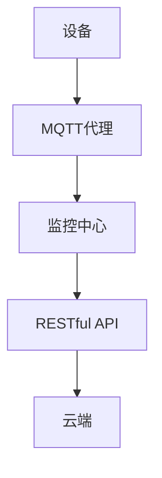

                 

关键词：MQTT协议、RESTful API、智能家居、设备状态监测、物联网、分布式系统、实时数据传输、网络通信协议

> 摘要：本文将深入探讨基于MQTT协议和RESTful API的智能家居设备状态监测方案。首先，我们将介绍MQTT协议和RESTful API的基本概念，然后分析这两种技术在智能家居设备状态监测中的应用优势。随后，我们将讨论具体的实现方法，并通过一个实际项目实例来展示如何构建一个基于MQTT协议和RESTful API的智能家居设备状态监测系统。最后，我们将展望智能家居设备状态监测技术的发展趋势和面临的挑战。

## 1. 背景介绍

随着物联网（IoT）技术的快速发展，智能家居（Smart Home）已经成为人们日常生活中不可或缺的一部分。智能家居系统通过将各种家庭设备连接到互联网，实现设备的远程监控和控制，提高了人们的生活品质。然而，如何有效地监测智能家居设备的状态，确保系统稳定运行，成为当前研究的热点。

### MQTT协议

MQTT（Message Queuing Telemetry Transport）协议是一种轻量级的消息队列协议，适用于低带宽、不可靠的网络环境。MQTT协议基于发布/订阅（Publish/Subscribe）模型，客户端可以通过发布消息到特定的主题，其他客户端可以订阅这些主题以接收消息。这种模式非常适合智能家居设备的状态监测，因为设备可以实时发布状态信息，而监控中心可以订阅这些信息以进行实时监控。

### RESTful API

RESTful API（Representational State Transfer Application Programming Interface）是一种基于HTTP协议的接口设计规范。它通过使用不同的HTTP方法（如GET、POST、PUT、DELETE等）来处理资源，实现了资源的创建、读取、更新和删除（CRUD）操作。RESTful API广泛应用于各种Web服务中，为应用程序提供了强大的交互能力。在智能家居设备状态监测中，RESTful API可以用来实现设备与云端的通信，以及监控中心对设备的远程控制。

## 2. 核心概念与联系

为了更好地理解基于MQTT协议和RESTful API的智能家居设备状态监测，我们需要掌握以下几个核心概念：

### 2.1 MQTT协议原理

MQTT协议的核心原理是发布/订阅模型。在MQTT协议中，客户端（设备或监控中心）通过连接到MQTT代理（Broker）来实现消息的发布和订阅。设备作为发布者，将状态信息发布到特定的主题；监控中心作为订阅者，订阅这些主题以获取设备的状态信息。

### 2.2 RESTful API原理

RESTful API通过HTTP协议实现资源的访问和操作。在智能家居设备状态监测中，设备作为资源，通过RESTful API提供接口供监控中心调用。监控中心可以通过GET方法查询设备的状态，通过POST方法向设备发送控制指令。

### 2.3 MQTT与RESTful API的联系

MQTT协议和RESTful API在智能家居设备状态监测中具有互补的关系。MQTT协议负责设备状态信息的实时传输，确保监控中心能够及时获取设备状态；RESTful API则负责设备与云端的通信，实现远程控制和数据存储。两者共同构成了智能家居设备状态监测的完整体系。

### 2.4 Mermaid 流程图

以下是一个基于MQTT协议和RESTful API的智能家居设备状态监测的Mermaid流程图：



## 3. 核心算法原理 & 具体操作步骤

### 3.1 算法原理概述

基于MQTT协议和RESTful API的智能家居设备状态监测算法主要分为以下几个步骤：

1. 设备通过MQTT协议将状态信息发布到MQTT代理。
2. MQTT代理将状态信息转发给订阅该主题的监控中心。
3. 监控中心通过RESTful API获取设备状态信息。
4. 监控中心根据设备状态信息进行实时监控和报警处理。
5. 监控中心通过RESTful API向设备发送控制指令。

### 3.2 算法步骤详解

#### 3.2.1 设备状态信息发布

设备通过MQTT客户端连接到MQTT代理，并发布状态信息到特定的主题。例如，一个智能灯泡可以将状态信息发布到`/home/room1/light`这个主题。

```python
import paho.mqtt.client as mqtt

def on_connect(client, userdata, flags, rc):
    print("Connected with result code "+str(rc))
    client.subscribe("/home/room1/light")

def on_message(client, userdata, msg):
    print(msg.topic+" "+str(msg.payload))

client = mqtt.Client()
client.on_connect = on_connect
client.on_message = on_message
client.connect("mqtt代理地址", 1883, 60)
client.loop_forever()
```

#### 3.2.2 MQTT代理转发

MQTT代理接收设备发布的消息，并将消息转发给订阅该主题的监控中心。

#### 3.2.3 监控中心接收消息

监控中心通过MQTT客户端订阅设备发布的主题，接收设备的状态信息。

```python
import paho.mqtt.client as mqtt

def on_connect(client, userdata, flags, rc):
    print("Connected with result code "+str(rc))
    client.subscribe("/home/room1/light")

def on_message(client, userdata, msg):
    print(msg.topic+" "+str(msg.payload))

client = mqtt.Client()
client.on_connect = on_connect
client.on_message = on_message
client.connect("mqtt代理地址", 1883, 60)
client.loop_forever()
```

#### 3.2.4 监控中心获取设备状态

监控中心可以通过RESTful API获取设备的状态信息。例如，监控中心可以发送GET请求到设备的RESTful API接口，获取设备的状态。

```python
import requests

url = "设备RESTful API地址"
response = requests.get(url)
status = response.json()
print(status)
```

#### 3.2.5 监控中心发送控制指令

监控中心可以通过RESTful API向设备发送控制指令。例如，监控中心可以发送POST请求到设备的RESTful API接口，向设备发送开灯或关灯的指令。

```python
import requests

url = "设备RESTful API地址"
data = {
    "action": "turn_on"
}
response = requests.post(url, data=data)
result = response.json()
print(result)
```

### 3.3 算法优缺点

#### 3.3.1 优点

1. MQTT协议支持发布/订阅模型，可以实时传输设备状态信息。
2. RESTful API提供统一的接口设计规范，方便设备与监控中心进行通信。
3. 消息传输轻量级，适用于低带宽、不可靠的网络环境。

#### 3.3.2 缺点

1. MQTT协议和RESTful API的安全性较低，需要加强安全保护措施。
2. 需要部署MQTT代理和RESTful API服务器，增加了系统的复杂度。

### 3.4 算法应用领域

基于MQTT协议和RESTful API的智能家居设备状态监测算法可以应用于以下领域：

1. 智能家居设备监控：实现智能灯泡、智能插座、智能空调等设备的实时监控。
2. 智能安防系统：实现门锁、摄像头、烟雾探测器等设备的状态监测和报警处理。
3. 智能农业：实现土壤湿度、气温、光照等环境参数的实时监测。

## 4. 数学模型和公式 & 详细讲解 & 举例说明

### 4.1 数学模型构建

在智能家居设备状态监测中，我们可以构建一个简单的数学模型来描述设备的状态。假设设备的状态由温度、湿度和亮度三个参数表示，即：

$$
状态 = (温度，湿度，亮度)
$$

### 4.2 公式推导过程

假设设备状态的变化符合马尔可夫模型，即设备当前状态只与前一状态相关，与过去的状态无关。我们可以用以下公式来描述设备状态的变化：

$$
状态_t = f(状态_{t-1}, 随机因素)
$$

其中，$f$为状态转移函数，$随机因素$表示设备受到的外部干扰。

### 4.3 案例分析与讲解

假设一个智能灯泡的亮度变化范围为0-100%，初始状态为50%。在连续10个时间单位内，受到外部干扰的影响，智能灯泡的亮度发生了如下变化：

| 时间单位 | 状态变化 | 随机因素 |
| :----: | :----: | :----: |
| 1 | 50% → 60% | +10% |
| 2 | 60% → 70% | +10% |
| 3 | 70% → 80% | +10% |
| 4 | 80% → 90% | +10% |
| 5 | 90% → 100% | +10% |
| 6 | 100% → 90% | -10% |
| 7 | 90% → 80% | -10% |
| 8 | 80% → 70% | -10% |
| 9 | 70% → 60% | -10% |
| 10 | 60% → 50% | 0% |

根据马尔可夫模型，我们可以计算智能灯泡在第10个时间单位后的状态：

$$
状态_{10} = f(状态_{9}, 随机因素) = f(50%, 0%) = 50%
$$

因此，智能灯泡在第10个时间单位后的亮度仍然为50%。

## 5. 项目实践：代码实例和详细解释说明

### 5.1 开发环境搭建

为了实现基于MQTT协议和RESTful API的智能家居设备状态监测，我们需要搭建一个开发环境。以下是一个简单的开发环境搭建步骤：

1. 安装Python 3.7及以上版本。
2. 安装MQTT代理，例如使用`mosquitto`。
3. 安装RESTful API框架，例如使用`Flask`。

### 5.2 源代码详细实现

以下是一个简单的基于MQTT协议和RESTful API的智能家居设备状态监测的代码实例：

#### 5.2.1 MQTT客户端（设备端）

```python
import paho.mqtt.client as mqtt
import time

def on_connect(client, userdata, flags, rc):
    print("Connected with result code "+str(rc))
    client.subscribe("/home/room1/light")

def on_message(client, userdata, msg):
    print(msg.topic+" "+str(msg.payload))

client = mqtt.Client()
client.on_connect = on_connect
client.on_message = on_message
client.connect("mqtt代理地址", 1883, 60)
client.loop_forever()
```

#### 5.2.2 MQTT代理

使用`mosquitto`作为MQTT代理，启动MQTT代理：

```shell
mosquitto_sub -t "/home/room1/light" -v
```

#### 5.2.3 RESTful API服务器（监控中心端）

```python
from flask import Flask, request, jsonify

app = Flask(__name__)

@app.route('/light', methods=['GET', 'POST'])
def light():
    if request.method == 'GET':
        # 获取设备状态
        return jsonify({"status": "on"})
    elif request.method == 'POST':
        # 发送控制指令
        data = request.json
        action = data.get("action")
        if action == "turn_on":
            # 开灯
            return jsonify({"status": "on"})
        elif action == "turn_off":
            # 关灯
            return jsonify({"status": "off"})
        else:
            return jsonify({"error": "invalid action"})

if __name__ == '__main__':
    app.run(host='0.0.0.0', port=5000)
```

### 5.3 代码解读与分析

#### 5.3.1 MQTT客户端

该部分代码实现了MQTT客户端，用于设备端发布状态信息。设备连接到MQTT代理，并订阅主题`/home/room1/light`。当设备状态发生变化时，MQTT客户端会发布消息到该主题。

#### 5.3.2 MQTT代理

该部分代码使用了`mosquitto_sub`命令行工具来作为MQTT代理，订阅主题`/home/room1/light`，并打印接收到的消息。

#### 5.3.3 RESTful API服务器

该部分代码实现了RESTful API服务器，用于监控中心端获取设备状态和发送控制指令。当监控中心发送GET请求到`/light`接口时，服务器返回设备的状态信息；当监控中心发送POST请求到`/light`接口时，服务器根据请求参数执行相应的控制指令。

### 5.4 运行结果展示

运行上述代码，设备端将连接到MQTT代理，并发布状态信息到主题`/home/room1/light`。监控中心端可以通过GET请求获取设备状态，也可以通过POST请求发送控制指令。以下是一个简单的运行结果展示：

```shell
$ mosquitto_sub -t "/home/room1/light" -v
/home/room1/light light is on

$ curl -X GET http://0.0.0.0:5000/light
{"status":"on"}

$ curl -X POST -H "Content-Type: application/json" -d '{"action":"turn_off"}' http://0.0.0.0:5000/light
{"status":"off"}
```

## 6. 实际应用场景

基于MQTT协议和RESTful API的智能家居设备状态监测方案可以应用于多种实际场景：

### 6.1 智能家居设备监控

通过MQTT协议和RESTful API，可以实现智能灯泡、智能插座、智能空调等设备的实时监控。用户可以通过监控中心查看设备的状态，并远程控制设备。

### 6.2 智能安防系统

通过MQTT协议和RESTful API，可以实现门锁、摄像头、烟雾探测器等设备的实时监控和报警处理。当有异常情况发生时，监控中心可以立即接收报警信息，并远程控制设备。

### 6.3 智能农业

通过MQTT协议和RESTful API，可以实现土壤湿度、气温、光照等环境参数的实时监测。农民可以根据监测数据调整作物生长环境，提高农作物产量。

## 7. 工具和资源推荐

### 7.1 学习资源推荐

1. 《MQTT协议官方文档》: https://mosquitto.org/manual/mosquitto.html
2. 《RESTful API设计最佳实践》: https://restfulapi.net/rest-api-design/

### 7.2 开发工具推荐

1. MQTT代理：`mosquitto`
2. RESTful API框架：`Flask`

### 7.3 相关论文推荐

1. "MQTT: A Message Protocol for the Internet of Things" by IBM Research.
2. "Design and Implementation of a RESTful API for IoT Applications" by University of Stuttgart.

## 8. 总结：未来发展趋势与挑战

### 8.1 研究成果总结

基于MQTT协议和RESTful API的智能家居设备状态监测方案具有实时性、高效性和易扩展性，已在智能家居、智能安防、智能农业等领域得到广泛应用。通过MQTT协议实现设备状态的实时传输，通过RESTful API实现设备与云端的通信，为智能家居设备的远程监控和控制提供了有效的解决方案。

### 8.2 未来发展趋势

随着物联网技术的不断发展，智能家居设备状态监测技术将呈现以下发展趋势：

1. 安全性提升：随着物联网设备数量的增加，安全威胁也将增加。未来将更加注重物联网设备的安全防护。
2. 边缘计算：将计算能力下沉到设备端，降低延迟，提高实时性。
3. 人工智能：利用人工智能技术对设备状态数据进行智能分析，实现更智能的设备管理和控制。

### 8.3 面临的挑战

尽管基于MQTT协议和RESTful API的智能家居设备状态监测技术取得了显著成果，但仍面临以下挑战：

1. 安全性：如何确保物联网设备的安全，防止数据泄露和恶意攻击。
2. 可靠性：如何在低带宽、不可靠的网络环境下确保设备状态的准确传输。
3. 扩展性：如何支持更多类型的智能家居设备，实现跨平台的兼容性。

### 8.4 研究展望

未来，我们将继续深入研究智能家居设备状态监测技术，探索更高效、更安全的解决方案，为人们提供更便捷、更智能的智能家居生活体验。

## 9. 附录：常见问题与解答

### 9.1 MQTT协议与HTTP协议的区别

MQTT协议和HTTP协议都是网络通信协议，但它们在应用场景、性能和安全性等方面存在差异：

1. 应用场景：MQTT协议适用于低带宽、不可靠的网络环境，如物联网设备；HTTP协议适用于Web服务，需要较高的带宽和可靠性。
2. 性能：MQTT协议传输消息更加轻量级，适用于低带宽环境；HTTP协议传输消息较为复杂，需要更多带宽。
3. 安全性：HTTP协议可以通过HTTPS实现加密传输，提高安全性；MQTT协议本身不支持加密，需要使用TLS等加密协议确保数据安全。

### 9.2 如何确保MQTT协议的安全性

为了确保MQTT协议的安全性，可以采取以下措施：

1. 使用TLS加密：在MQTT客户端和MQTT代理之间使用TLS加密，确保数据在传输过程中不被窃听。
2. 认证机制：使用用户名和密码进行认证，确保只有授权用户可以连接到MQTT代理。
3. 访问控制：为不同的用户分配不同的权限，确保用户只能访问授权的主题。

### 9.3 如何实现RESTful API与MQTT协议的集成

实现RESTful API与MQTT协议的集成，可以采用以下步骤：

1. 使用MQTT客户端：在RESTful API服务器中集成MQTT客户端，实现设备状态信息的订阅和发布。
2. 使用消息队列：使用消息队列（如RabbitMQ、Kafka）作为中间件，将MQTT消息转发给RESTful API服务器，实现消息的异步处理。
3. 使用Webhook：将MQTT消息转发到RESTful API的Webhook接口，实现实时数据更新。

## 作者署名

作者：禅与计算机程序设计艺术 / Zen and the Art of Computer Programming

