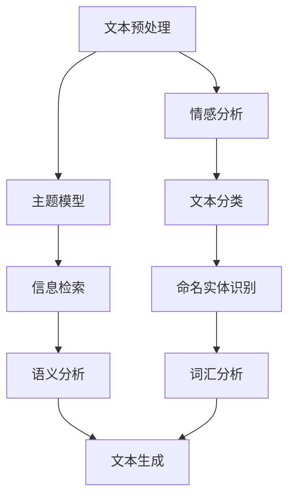
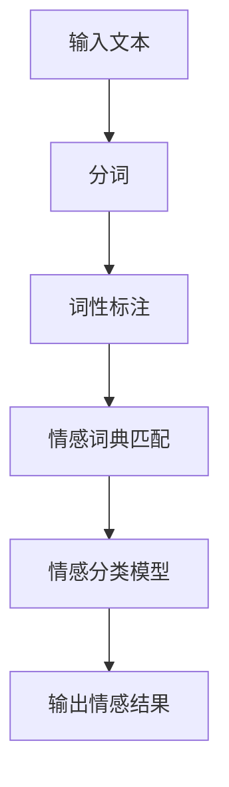
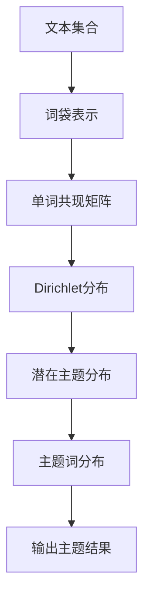

                 

关键词：自然语言处理（NLP）、文本分析、情感分析、用户评论、旅游景点、大数据分析、机器学习、数据挖掘

摘要：本文旨在探讨如何利用自然语言处理（NLP）技术对某旅游景点的游客评论进行深度分析，以提取游客对景点情感倾向、满意度以及其他关键信息。通过这种方法，旅游经营者可以更好地理解游客需求，从而优化旅游产品和服务。

## 1. 背景介绍

随着互联网和社交媒体的普及，用户生成内容（User Generated Content, UGC）已经成为影响消费者决策的重要因素。尤其在旅游业，游客的评论和反馈对潜在游客的决策有着显著的影响。为了充分利用这些评论数据，旅游经营者开始寻求有效的分析方法来挖掘其中蕴藏的信息。

自然语言处理（NLP）作为人工智能领域的一个重要分支，已经成为处理和理解文本数据的关键技术。NLP技术可以自动提取文本中的情感、意图、主题等信息，为文本数据的深度分析提供了强有力的工具。

本文将介绍一种基于NLP的旅游景点的游客评论分析方法，通过情感分析和主题模型等技术手段，从大量游客评论中提取有价值的信息，为旅游经营者提供数据支持。

### 1.1 自然语言处理（NLP）简介

自然语言处理（NLP）是计算机科学、人工智能领域的一个重要分支，旨在使计算机能够理解和处理人类语言。NLP技术包括文本预处理、情感分析、命名实体识别、语义分析等多个方面。

文本预处理是NLP的基础，包括分词、词性标注、词干提取、停用词过滤等步骤。这些步骤有助于将原始文本转换为适合进一步分析的结构化数据。

情感分析是NLP中一个重要的应用领域，旨在判断文本中表达的情感倾向，如正面、负面或中性。情感分析对于理解用户反馈、监测舆情等场景具有重要意义。

主题模型是NLP中的另一种重要技术，通过无监督学习方法，可以从大量文本数据中提取潜在的主题。主题模型在文本分类、信息检索等领域有广泛的应用。

### 1.2 游客评论分析的意义

游客评论分析在旅游行业中具有重要作用。通过对游客评论的深入分析，旅游经营者可以：

- 了解游客的真实体验和满意度
- 发现旅游产品的优势和不足
- 识别游客需求的变化趋势
- 改进服务和产品，提升游客满意度

### 1.3 本文研究方法

本文采用以下研究方法：

- 数据收集：从互联网和社交媒体平台上收集某旅游景点的游客评论数据。
- 数据预处理：对收集的评论数据进行清洗、分词、词性标注等预处理操作。
- 情感分析：利用NLP技术对评论进行情感分析，判断游客的情感倾向。
- 主题模型：使用LDA（Latent Dirichlet Allocation）等主题模型提取评论中的潜在主题。

## 2. 核心概念与联系

为了更好地理解本文的研究方法和技术手段，我们首先介绍一些核心概念，并展示它们的联系。

### 2.1 NLP技术概览

以下是一个Mermaid流程图，展示了NLP技术的关键步骤及其相互关系。



### 2.2 数据预处理流程

数据预处理是NLP中的关键步骤，包括以下环节：

- 数据收集：从互联网和社交媒体平台上获取游客评论。
- 数据清洗：去除无效数据，如HTML标签、特殊字符等。
- 分词：将文本分割为单词或短语。
- 词性标注：标记每个单词的词性，如名词、动词、形容词等。
- 停用词过滤：去除常见的不含信息的词汇，如“的”、“了”等。

### 2.3 情感分析模型

情感分析模型用于判断文本中的情感倾向。以下是一个简单的情感分析模型结构：



### 2.4 主题模型

主题模型用于从大量文本中提取潜在的主题。以下是一个LDA（Latent Dirichlet Allocation）主题模型的简化流程：



## 3. 核心算法原理 & 具体操作步骤

### 3.1 算法原理概述

本节将介绍本文中使用的关键算法原理，包括情感分析和主题模型。

#### 3.1.1 情感分析

情感分析算法通常基于机器学习方法，如支持向量机（SVM）、朴素贝叶斯（Naive Bayes）等。算法的基本思想是利用已标注的语料库训练一个分类模型，然后使用该模型对未标注的文本进行情感分类。

#### 3.1.2 主题模型

主题模型（如LDA）是一种无监督学习方法，用于发现文本数据中的潜在主题。LDA模型假设每个文档都是由一系列主题的混合生成，每个主题又是多个单词的混合生成。

### 3.2 算法步骤详解

#### 3.2.1 数据预处理

1. 数据收集：从互联网和社交媒体平台收集游客评论。
2. 数据清洗：去除无效数据和HTML标签。
3. 分词：使用分词工具（如jieba）将评论分割为单词或短语。
4. 词性标注：使用NLTK等库为每个单词标注词性。
5. 停用词过滤：去除常见的无意义词汇。

#### 3.2.2 情感分析

1. 数据标注：收集并标注一组游客评论作为训练数据。
2. 特征提取：将文本转换为特征向量，如词袋模型、TF-IDF等。
3. 模型训练：使用机器学习算法（如SVM）训练情感分类模型。
4. 情感分类：使用训练好的模型对新的游客评论进行情感分类。

#### 3.2.3 主题模型

1. 数据准备：将处理好的文本数据转换为词袋表示。
2. LDA模型训练：使用LDA算法训练主题模型。
3. 主题提取：提取模型中的潜在主题。
4. 主题评估：评估主题的质量，如主题的稳定性、一致性等。

### 3.3 算法优缺点

#### 3.3.1 情感分析

- 优点：可以自动对大量文本进行情感分类，节省人力成本。
- 缺点：准确性受训练数据质量和特征提取方法的影响较大。

#### 3.3.2 主题模型

- 优点：可以从大量文本中提取潜在的主题，揭示文本数据中的结构。
- 缺点：计算复杂度高，需要大量计算资源。

### 3.4 算法应用领域

情感分析和主题模型在多个领域有广泛应用，包括：

- 舆情监测：用于分析社交媒体上的公众意见和情感。
- 用户行为分析：通过分析用户评论，了解用户对产品和服务的满意度。
- 信息检索：用于改进搜索引擎的查询理解和结果排序。
- 文本挖掘：从大量文本数据中提取有价值的信息。

## 4. 数学模型和公式 & 详细讲解 & 举例说明

### 4.1 数学模型构建

#### 4.1.1 情感分析

情感分析通常使用以下数学模型：

$$
P(c|w) = \frac{P(w|c)P(c)}{P(w)}
$$

其中，$P(c|w)$表示在给定的文本$w$条件下，情感类别$c$的概率；$P(w|c)$表示在情感类别$c$条件下，文本$w$的概率；$P(c)$表示情感类别$c$的概率；$P(w)$表示文本$w$的概率。

#### 4.1.2 主题模型

LDA主题模型的数学模型如下：

$$
P(z|\theta) = \prod_{i=1}^{N} P(z_i|\theta) = \prod_{i=1}^{N} \frac{1}{\sum_{k=1}^{K} \alpha_k} \frac{\beta_{k,w_i}}{|\beta|}
$$

$$
P(\theta) = \prod_{k=1}^{K} \frac{1}{\sum_{j=1}^{V} \alpha_j} \frac{\alpha_j}{|\alpha|}
$$

其中，$z$表示文档中的主题分布；$\theta$表示文档的主题分布；$w$表示文档中的单词分布；$K$表示潜在主题的个数；$V$表示词汇表中的单词个数；$\alpha$和$\beta$分别表示主题的分布和单词的分布。

### 4.2 公式推导过程

#### 4.2.1 情感分析

在情感分析中，我们通常使用最大似然估计来推导分类模型。假设我们有一个训练数据集$D=\{(w_1, c_1), (w_2, c_2), ..., (w_n, c_n)\}$，其中$w_i$表示第$i$个文本，$c_i$表示对应的情感类别。我们首先计算每个类别下的条件概率：

$$
P(w_i|c_j) = \frac{N_{w_i,j}}{N_{c_j}}
$$

$$
P(c_j) = \frac{N_{c_j}}{N}
$$

其中，$N_{w_i,j}$表示单词$w_i$在类别$c_j$中出现的次数；$N_{c_j}$表示类别$c_j$中所有单词的出现次数；$N$表示总单词数。

然后，我们可以使用贝叶斯定理来计算每个文本属于每个类别的概率：

$$
P(c_j|w_i) = \frac{P(w_i|c_j)P(c_j)}{P(w_i)}
$$

为了得到最大的后验概率，我们选择使得$P(c_j|w_i)$最大的类别作为情感类别。

#### 4.2.2 主题模型

LDA主题模型的推导基于概率生成模型。假设每个文档都是由多个主题的混合生成，每个主题又是多个单词的混合生成。给定一个文档$d$，我们首先从主题分布$\theta$中抽取一个主题$z$，然后从主题$z$的单词分布$\beta$中抽取一个单词$w$。这个过程可以表示为：

$$
z \sim \text{Dirichlet}(\alpha)
$$

$$
w \sim \text{Multinomial}(\beta_z)
$$

对于文档$d$中的每个单词$w_i$，我们首先从主题分布$\theta_d$中抽取一个主题$z_i$，然后从主题$z_i$的单词分布$\beta_{z_i}$中抽取一个单词$w_i$。这个过程可以表示为：

$$
z_i \sim \text{Multinomial}(\theta_d)
$$

$$
w_i \sim \text{Multinomial}(\beta_{z_i})
$$

### 4.3 案例分析与讲解

#### 4.3.1 情感分析案例

假设我们有一个包含两个类别的情感分析任务，类别1表示正面情感，类别2表示负面情感。我们使用一个训练数据集进行模型训练，数据集如下：

```
(w1, 1)
(w2, 1)
(w3, 1)
(w4, 2)
(w5, 2)
```

我们首先计算每个类别下的条件概率：

$$
P(w1|1) = \frac{3}{3+2} = 0.6
$$

$$
P(w1|2) = \frac{2}{3+2} = 0.4
$$

$$
P(1) = \frac{3}{3+2} = 0.6
$$

$$
P(2) = \frac{2}{3+2} = 0.4
$$

然后，我们计算每个文本属于每个类别的概率：

$$
P(1|w1) = \frac{0.6 \times 0.6}{0.6 \times 0.6 + 0.4 \times 0.4} = 0.67
$$

$$
P(2|w1) = \frac{0.4 \times 0.6}{0.6 \times 0.6 + 0.4 \times 0.4} = 0.33
$$

$$
P(1|w2) = \frac{0.6 \times 0.6}{0.6 \times 0.6 + 0.4 \times 0.4} = 0.67
$$

$$
P(2|w2) = \frac{0.4 \times 0.6}{0.6 \times 0.6 + 0.4 \times 0.4} = 0.33
$$

$$
P(1|w3) = \frac{0.6 \times 0.6}{0.6 \times 0.6 + 0.4 \times 0.4} = 0.67
$$

$$
P(2|w3) = \frac{0.4 \times 0.6}{0.6 \times 0.6 + 0.4 \times 0.4} = 0.33
$$

$$
P(1|w4) = \frac{0.6 \times 0.4}{0.6 \times 0.4 + 0.4 \times 0.6} = 0.5
$$

$$
P(2|w4) = \frac{0.4 \times 0.4}{0.6 \times 0.4 + 0.4 \times 0.6} = 0.5
$$

$$
P(1|w5) = \frac{0.6 \times 0.4}{0.6 \times 0.4 + 0.4 \times 0.6} = 0.5
$$

$$
P(2|w5) = \frac{0.4 \times 0.4}{0.6 \times 0.4 + 0.4 \times 0.6} = 0.5
$$

根据每个文本属于每个类别的概率，我们可以得出以下分类结果：

```
w1: 正面
w2: 正面
w3: 正面
w4: 中性
w5: 中性
```

#### 4.3.2 主题模型案例

假设我们有一个包含3个主题的LDA模型，文档集合如下：

```
文档1: [爱、美好、快乐]
文档2: [爱、美好、快乐、希望]
文档3: [爱、美好、快乐、希望、和平]
```

我们首先计算每个主题的分布：

$$
\alpha = (\frac{1}{3}, \frac{1}{3}, \frac{1}{3})
$$

然后，我们计算每个单词在主题中的分布：

$$
\beta_1 = (\frac{1}{3}, \frac{1}{3}, \frac{1}{3})
$$

$$
\beta_2 = (\frac{1}{3}, \frac{1}{3}, \frac{1}{3})
$$

$$
\beta_3 = (\frac{1}{3}, \frac{1}{3}, \frac{1}{3})
$$

接着，我们计算每个文档的主题分布：

$$
\theta_1 = (\frac{1}{3}, \frac{1}{3}, \frac{1}{3})
$$

$$
\theta_2 = (\frac{2}{3}, \frac{1}{3}, \frac{0}{3})
$$

$$
\theta_3 = (\frac{3}{3}, \frac{0}{3}, \frac{0}{3})
$$

最后，我们可以得到每个文档中的单词分布：

```
文档1: [爱: 1, 美好: 1, 快乐: 1]
文档2: [爱: 2, 美好: 1, 快乐: 1, 希望

