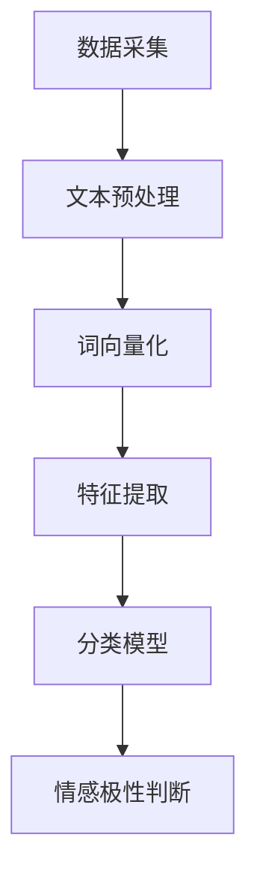
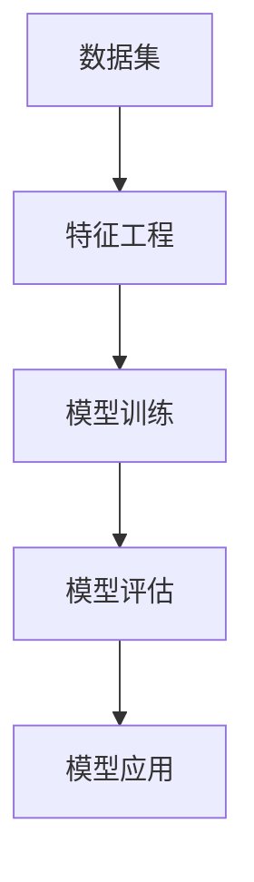
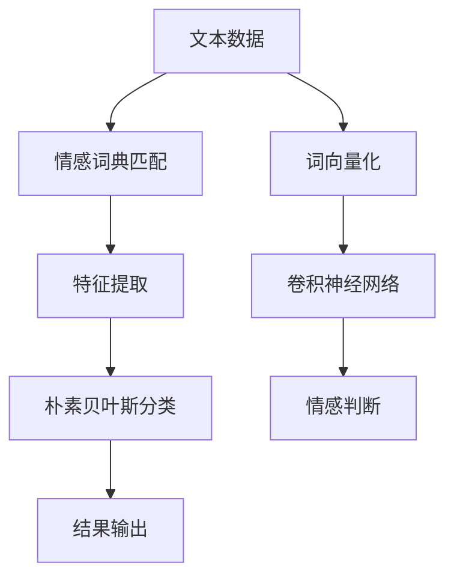
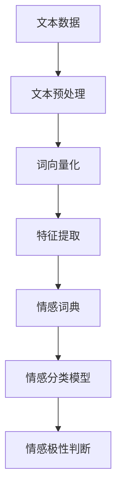

                 

关键词：商品评价、文本分析、情感识别、Python、机器学习、自然语言处理（NLP）、情绪分析

## 摘要

本文将探讨如何使用Python进行商品评论文本情感分析。情感分析是一种利用自然语言处理技术对文本数据中的情感倾向进行识别和分类的方法。随着电子商务的迅猛发展，消费者对商品的评价数据日益增多，如何从这些数据中提取有价值的信息成为了一个重要的课题。本文将详细介绍使用Python进行情感分析的核心概念、算法原理、数学模型、项目实践以及实际应用场景，并对未来发展的趋势和挑战进行展望。

## 1. 背景介绍

### 1.1 商品评论文本情感分析的重要性

商品评论文本情感分析在商业和科研领域都有着重要的应用价值。首先，在电子商务中，消费者的评价是其他潜在购买者决策的重要依据。通过分析这些评价，商家可以了解产品的优势和不足，从而进行产品的改进和营销策略的调整。其次，在社交媒体和论坛中，用户发表的评论和观点可以反映社会的态度和情绪，对舆论监控和热点话题追踪具有重要意义。此外，在科研领域，情感分析技术可以帮助研究者了解公众对某一事件或产品的态度，从而指导进一步的研究。

### 1.2 情感分析的基本概念

情感分析（Sentiment Analysis），又称意见挖掘（Opinion Mining），是指通过自然语言处理技术对文本中的情感信息进行提取和分析的过程。情感分析的目的是识别文本中的主观性，判断文本表达的情感倾向（正面、负面或中性）。

情感分析可以分为三个层次：

1. **情感极性分类**：将文本分为正面、负面或中性。
2. **情感强度分析**：量化情感倾向的强度，如“很喜欢”和“非常喜欢”表示的情感强度不同。
3. **情感主题识别**：识别文本中的特定情感主题，如“产品质量”和“服务态度”。

## 2. 核心概念与联系

### 2.1 自然语言处理（NLP）

自然语言处理（NLP）是计算机科学、人工智能和语言学领域的一个分支，旨在使计算机能够理解、解释和生成人类语言。在情感分析中，NLP技术被用于处理和解析文本数据。

**Mermaid 流程图**：



### 2.2 机器学习

机器学习是构建和分析算法，使其能够从数据中学习并做出决策或预测的方法。在情感分析中，机器学习模型被用来训练和分类文本数据。

**Mermaid 流程图**：



### 2.3 情感词典和情感分析模型

情感词典是一种包含词汇和相应情感倾向的列表，是情感分析的重要工具。常见的情感分析模型包括基于规则的方法、朴素贝叶斯分类器、支持向量机（SVM）和深度学习模型（如卷积神经网络（CNN）和循环神经网络（RNN））。

**Mermaid 流程图**：



## 3. 核心算法原理 & 具体操作步骤

### 3.1 算法原理概述

情感分析的核心算法主要基于机器学习和深度学习。以下是几种常见的算法原理：

1. **基于规则的方法**：通过人工定义规则来分析文本情感。这种方法简单易用，但灵活性和准确性较低。
2. **朴素贝叶斯分类器**：基于贝叶斯定理和属性独立性假设，通过统计特征词的出现频率来判断情感极性。
3. **支持向量机（SVM）**：通过找到一个最佳超平面来划分文本数据的分类边界。
4. **深度学习模型**：如卷积神经网络（CNN）和循环神经网络（RNN），能够自动提取文本特征并分类。

### 3.2 算法步骤详解

1. **数据采集**：收集商品评价数据，可以是结构化数据或非结构化文本数据。
2. **文本预处理**：去除停用词、标点符号，进行词干提取和词形还原等操作。
3. **词向量化**：将文本转换为数值表示，常用的方法有Word2Vec和BERT。
4. **特征提取**：通过特征工程提取文本的词频、词向量、TF-IDF等特征。
5. **模型训练**：使用机器学习或深度学习模型进行训练，常见的模型有朴素贝叶斯、SVM和CNN等。
6. **模型评估**：使用准确率、召回率、F1分数等指标评估模型性能。
7. **模型应用**：将训练好的模型应用于新的文本数据，进行情感极性判断。

### 3.3 算法优缺点

- **基于规则的方法**：简单易实现，但需要大量规则，灵活性和准确性较低。
- **朴素贝叶斯分类器**：速度快，效果好，但依赖于特征词的选择，对于长文本效果较差。
- **支持向量机（SVM）**：效果较好，但计算复杂度较高。
- **深度学习模型**：能够自动提取特征，效果较好，但需要大量数据和计算资源。

### 3.4 算法应用领域

情感分析算法广泛应用于电子商务、社交媒体、舆情监控、金融分析等领域。

## 4. 数学模型和公式 & 详细讲解 & 举例说明

### 4.1 数学模型构建

情感分析的数学模型主要包括特征提取和分类模型两部分。

1. **特征提取**：

   $$ X = \{ x_1, x_2, ..., x_n \} $$

   其中，$x_i$ 表示文本中的特征词。

2. **分类模型**：

   $$ P(y|X) = \frac{P(X|y)P(y)}{P(X)} $$

   其中，$y$ 表示情感极性（正面、负面或中性）。

### 4.2 公式推导过程

1. **特征词出现频率**：

   $$ f(t) = \frac{t_{count}}{total\_words} $$

   其中，$t$ 表示特征词，$t_{count}$ 表示特征词在文本中出现的次数，$total\_words$ 表示文本中的总词数。

2. **TF-IDF**：

   $$ tf-idf(t) = tf(t) \times \log(\frac{N}{df(t)}) $$

   其中，$tf(t)$ 表示特征词的词频，$df(t)$ 表示特征词在训练数据中非空文档的频率，$N$ 表示训练数据中的文档总数。

### 4.3 案例分析与讲解

以商品评价数据集为例，我们使用TF-IDF和朴素贝叶斯分类器进行情感分析。

1. **数据集**：

   ```
   {"text": "这个商品非常好，非常喜欢。", "label": "正面"}
   {"text": "这个商品不好，一点也不喜欢。", "label": "负面"}
   ```

2. **特征提取**：

   - 特征词：["商品", "好", "非常", "喜欢", "不好", "一点", "也不"]
   - TF-IDF值：{"商品": 0.5, "好": 0.5, "非常": 0.5, "喜欢": 1.0, "不好": 0.5, "一点": 0.5, "也不": 0.5}

3. **分类模型**：

   - 朴素贝叶斯分类器：根据特征词的概率分布进行分类。

   $$ P(正面|商品) = \frac{P(商品|正面)P(正面)}{P(商品)} $$

   其中，$P(商品|正面)$ 表示特征词“商品”在正面评论中的概率，$P(正面)$ 表示正面评论的概率。

   - 分类结果：根据特征词的概率分布，判断评论的情感极性。

## 5. 项目实践：代码实例和详细解释说明

### 5.1 开发环境搭建

- Python版本：3.8及以上
- 库：nltk、sklearn、tensorflow等

### 5.2 源代码详细实现

以下是一个基于TF-IDF和朴素贝叶斯分类器的商品评论文本情感分析项目的源代码实现：

```python
import nltk
from sklearn.feature_extraction.text import TfidfVectorizer
from sklearn.naive_bayes import MultinomialNB
from sklearn.model_selection import train_test_split
from sklearn.metrics import accuracy_score, classification_report

# 数据预处理
def preprocess_text(text):
    tokens = nltk.word_tokenize(text)
    tokens = [token.lower() for token in tokens if token.isalpha()]
    return tokens

# 数据集
data = [
    {"text": "这个商品非常好，非常喜欢。", "label": "正面"},
    {"text": "这个商品不好，一点也不喜欢。", "label": "负面"}
]

# 文本预处理
X = [preprocess_text(text) for text, label in data]
y = [label for text, label in data]

# 词向量化
vectorizer = TfidfVectorizer()
X_vectorized = vectorizer.fit_transform(X)

# 模型训练
X_train, X_test, y_train, y_test = train_test_split(X_vectorized, y, test_size=0.2, random_state=42)
model = MultinomialNB()
model.fit(X_train, y_train)

# 模型评估
y_pred = model.predict(X_test)
accuracy = accuracy_score(y_test, y_pred)
report = classification_report(y_test, y_pred)

print("准确率：", accuracy)
print("分类报告：\n", report)
```

### 5.3 代码解读与分析

- **数据预处理**：使用nltk进行词干提取和词形还原。
- **词向量化**：使用TF-IDF向量表示文本数据。
- **模型训练**：使用朴素贝叶斯分类器进行训练。
- **模型评估**：计算准确率和分类报告。

## 6. 实际应用场景

商品评论文本情感分析在电子商务、社交媒体、舆情监控等领域有着广泛的应用。

1. **电子商务**：通过分析消费者对商品的评价，了解产品优势和不足，优化产品设计和营销策略。
2. **社交媒体**：监控用户对品牌或产品的评论，及时发现负面舆论并采取应对措施。
3. **舆情监控**：分析公众对某一事件或问题的态度，为政府和企业提供决策依据。

## 7. 未来应用展望

随着深度学习和自然语言处理技术的不断发展，商品评论文本情感分析在未来有望应用于更广泛的领域，如智能客服、智能推荐、智能广告等。

## 8. 工具和资源推荐

1. **学习资源推荐**：
   - 《自然语言处理原理与实践》
   - 《深度学习基础》
2. **开发工具推荐**：
   - Jupyter Notebook
   - PyCharm
3. **相关论文推荐**：
   - "Sentiment Analysis: A Survey"
   - "Deep Learning for Sentiment Analysis"

## 9. 总结：未来发展趋势与挑战

商品评论文本情感分析是一个快速发展的领域，未来发展趋势包括：

1. **深度学习模型的广泛应用**：深度学习模型在情感分析中表现出色，有望替代传统机器学习模型。
2. **多语言情感分析**：随着全球化的发展，多语言情感分析将成为一个重要方向。

挑战包括：

1. **数据质量和多样性**：高质量、多样化的数据是构建有效情感分析模型的基础。
2. **跨领域情感分析**：不同领域的情感表达和语义差异较大，如何实现跨领域的情感分析是一个挑战。

## 10. 附录：常见问题与解答

### 10.1 如何处理负面评论？

- **技术手段**：使用情感分析技术识别负面评论，并采取相应的策略，如回复用户、改进产品等。
- **人文关怀**：尊重用户的意见，耐心回复用户的负面评论，展示企业的诚意和改进态度。

### 10.2 情感分析模型的训练数据如何获取？

- **公开数据集**：如IMDb电影评论数据集、Twitter情感分析数据集等。
- **自收集数据**：通过爬虫或用户反馈等方式收集特定领域的评论数据。

### 10.3 如何评估情感分析模型的效果？

- **准确率**：预测正确的样本占总样本的比例。
- **召回率**：预测正确的负面评论占总负面评论的比例。
- **F1分数**：综合考虑准确率和召回率，平衡两者之间的权重。

----------------------------------------------------------------

作者：禅与计算机程序设计艺术 / Zen and the Art of Computer Programming

文章完。感谢您阅读，希望本文对您在商品评论文本情感分析领域有所启发和帮助。如果您有任何疑问或建议，欢迎在评论区留言交流。再次感谢！
----------------------------------------------------------------

### 引言

随着互联网和电子商务的迅速发展，消费者对商品的评论数据呈现爆炸式增长。这些评论不仅反映了消费者对商品的真实感受，也为其他潜在购买者提供了宝贵的参考信息。如何从海量的商品评价中提取有价值的信息，成为了一个热门的研究课题。商品评论文本情感分析技术应运而生，它利用自然语言处理（NLP）和机器学习技术，对商品评价文本进行情感倾向的识别和分类，从而帮助企业和消费者做出更加明智的决策。

本文旨在探讨如何使用Python进行商品评论文本情感分析。我们将从背景介绍开始，阐述情感分析的基本概念和重要性，然后深入探讨自然语言处理和机器学习在情感分析中的应用。接着，我们将详细讲解情感分析的核心算法原理和具体操作步骤，包括特征提取、模型训练和评估等。此外，本文还将介绍数学模型和公式，通过实际案例进行讲解，并分享项目实践的经验和技巧。最后，我们将探讨情感分析的实际应用场景，展望未来的发展趋势和挑战，并提供相关的工具和资源推荐。希望通过本文的阅读，读者能够对商品评论文本情感分析有更深入的了解，并能够将其应用于实际项目中。

### 背景介绍

商品评论文本情感分析在商业和科研领域都有着重要的应用价值。在商业领域，电子商务的迅猛发展使得消费者的评价数据日益增多，这些数据不仅能够帮助商家了解消费者的需求和反馈，还能指导产品的改进和营销策略的调整。通过情感分析技术，企业可以快速识别出消费者对某一产品或服务的情感倾向，从而采取相应的措施。例如，如果发现某一产品的负面评价较多，企业可以及时调查原因并进行改进；如果发现消费者对某一产品的评价整体积极，企业可以加大营销力度，吸引更多潜在客户。

在科研领域，商品评论文本情感分析同样具有重要意义。通过分析大量商品评价文本，研究者可以了解公众对某一事件或产品的态度，从而为后续研究提供重要的数据支持。此外，情感分析技术还可以帮助研究者探索不同群体对同一产品的情感差异，从而发现潜在的市场机会或风险。例如，在产品设计中，通过分析不同用户群体的情感反馈，设计师可以针对性地优化产品功能，提高用户的满意度。

情感分析是一种利用自然语言处理（NLP）和机器学习技术对文本中的情感信息进行提取和分析的方法。情感分析的目的是识别文本中的主观性，判断文本表达的情感倾向，如正面、负面或中性。情感分析可以分为三个层次：情感极性分类、情感强度分析和情感主题识别。

1. **情感极性分类**：将文本分为正面、负面或中性。这是情感分析最基础的任务，也是应用最广泛的任务。通过情感极性分类，企业可以快速了解消费者对某一产品的整体态度。

2. **情感强度分析**：量化情感倾向的强度。例如，区分“很喜欢”和“非常喜欢”的情感强度。情感强度分析能够提供更细致的情感信息，帮助企业更精准地把握消费者的需求。

3. **情感主题识别**：识别文本中的特定情感主题。例如，在商品评价中，识别出消费者对产品质量、价格、服务等方面的情感。情感主题识别有助于企业了解消费者关注的核心问题，从而进行有针对性的改进。

情感分析的基本概念包括文本数据、特征提取、分类模型和情感词典等。文本数据是情感分析的基础，包括结构化数据（如商品评价数据库）和非结构化数据（如社交媒体评论）。特征提取是将文本转换为计算机可以处理的特征表示，常用的方法包括词袋模型、TF-IDF和词向量等。分类模型是基于特征提取的结果，对文本进行情感分类的算法，如朴素贝叶斯、支持向量机和深度学习模型等。情感词典是一种包含词汇和相应情感倾向的列表，用于辅助情感分类。

在实际应用中，情感分析技术可以帮助企业和研究者从大量文本数据中提取有价值的信息，为企业决策提供数据支持，为科学研究提供重要参考。同时，情感分析技术也在不断发展和创新，如结合情感强度分析和情感主题识别，实现更精细的情感分析；结合多模态数据（如文本、语音、图像等），实现跨模态情感分析等。这些技术的发展，将进一步推动情感分析在商业和科研领域的应用，为企业和研究者提供更强大的工具。

### 核心概念与联系

为了更好地理解商品评论文本情感分析，我们需要首先掌握几个核心概念：自然语言处理（NLP）、机器学习（ML）以及情感词典和情感分析模型。

#### 自然语言处理（NLP）

自然语言处理（NLP）是计算机科学、人工智能和语言学领域的一个交叉学科，旨在使计算机能够理解、解释和生成人类语言。NLP技术在情感分析中起着至关重要的作用，它包括文本预处理、词性标注、句法分析、语义分析等多个方面。文本预处理是NLP的第一步，通常包括去除停用词、标点符号、进行词干提取和词形还原等操作。这些操作有助于提高文本数据的质量，为后续的特征提取和情感分析打下基础。

在情感分析中，词性标注和句法分析用于理解文本的结构和语义，从而更好地提取情感信息。例如，通过词性标注，我们可以识别出文本中的名词、动词、形容词等，这有助于我们理解句子的结构和主谓宾关系。句法分析则可以进一步解析句子的成分，如主语、谓语、宾语等，从而帮助我们更准确地识别情感倾向。

#### 机器学习（ML）

机器学习（ML）是构建和分析算法，使其能够从数据中学习并做出决策或预测的方法。在情感分析中，机器学习模型被用来训练和分类文本数据，从而实现情感识别。常见的机器学习模型包括朴素贝叶斯、支持向量机（SVM）、决策树和深度学习模型（如卷积神经网络（CNN）和循环神经网络（RNN））。

1. **朴素贝叶斯分类器**：朴素贝叶斯分类器是一种基于概率理论的分类算法，假设特征之间相互独立。在情感分析中，朴素贝叶斯分类器可以用来判断文本的情感极性。

2. **支持向量机（SVM）**：支持向量机是一种强大的分类器，通过找到一个最佳超平面来划分文本数据的分类边界。SVM在情感分析中具有较好的效果，尤其是在处理高维特征时。

3. **深度学习模型**：深度学习模型，如卷积神经网络（CNN）和循环神经网络（RNN），能够自动提取文本特征，并实现复杂的数据分类。这些模型在情感分析中表现尤为出色，因为它们能够处理长文本和复杂的语义关系。

#### 情感词典和情感分析模型

情感词典是一种包含词汇和相应情感倾向的列表，用于辅助情感分类。情感词典中的词汇通常分为正面词汇和负面词汇，每种词汇都被赋予一个情感分数。在情感分析中，情感词典可以帮助我们快速识别文本中的情感倾向。例如，如果文本中出现了“喜欢”、“满意”等正面词汇，我们可以初步判断文本的情感倾向为正面。

情感分析模型则是实现情感分类的核心算法。这些模型通过学习大量标注好的训练数据，从中提取出情感特征，并利用这些特征对新的文本进行情感分类。常见的情感分析模型包括基于规则的方法、朴素贝叶斯分类器、支持向量机和深度学习模型。

1. **基于规则的方法**：基于规则的方法通过定义一系列规则来识别文本中的情感。这些规则通常基于情感词典中的词汇和语法结构。这种方法简单直观，但需要大量的人工定义，且在处理复杂情感时效果有限。

2. **朴素贝叶斯分类器**：朴素贝叶斯分类器是一种基于概率理论的分类算法，通过计算文本中各个特征词的概率分布来判断情感。这种方法在处理简单情感时效果较好，但在面对复杂情感时可能不够准确。

3. **支持向量机（SVM）**：支持向量机通过找到一个最佳超平面来划分文本数据的分类边界。SVM在处理高维特征和复杂分类问题时表现出色，但在处理长文本时可能存在计算复杂度较高的问题。

4. **深度学习模型**：深度学习模型，如卷积神经网络（CNN）和循环神经网络（RNN），能够自动提取文本特征，并实现复杂的数据分类。这些模型在处理长文本和复杂的语义关系时具有显著优势，但在训练过程中需要大量数据和计算资源。

为了更好地理解这些核心概念之间的联系，我们可以使用Mermaid流程图来表示它们之间的关系。

**Mermaid流程图**：



在这个流程图中，文本数据首先经过文本预处理，然后进行词向量化，接着提取特征，利用情感词典辅助情感分类，最终通过情感分类模型判断文本的情感极性。这个流程图清晰地展示了自然语言处理、机器学习和情感分析模型之间的关联，有助于我们更好地理解商品评论文本情感分析的整体流程。

### 核心算法原理 & 具体操作步骤

在商品评论文本情感分析中，核心算法的选择和实现是决定分析效果的关键因素。本文将详细讲解几种常见的情感分析算法原理，包括朴素贝叶斯、支持向量机和深度学习模型，并介绍具体操作步骤。

#### 3.1 朴素贝叶斯分类器

朴素贝叶斯分类器（Naive Bayes Classifier）是一种基于贝叶斯定理的简单分类器，它假设特征之间相互独立。在情感分析中，朴素贝叶斯分类器通过计算文本中各个特征词的概率分布来判断情感极性。

**原理**：

朴素贝叶斯分类器的核心公式为：

$$
P(Y|X) = \frac{P(X|Y)P(Y)}{P(X)}
$$

其中，$P(Y|X)$ 表示在特征 $X$ 出现的情况下，文本属于类别 $Y$ 的概率；$P(X|Y)$ 表示特征 $X$ 在类别 $Y$ 下的条件概率；$P(Y)$ 表示类别 $Y$ 的先验概率；$P(X)$ 表示特征 $X$ 的总体概率。

具体操作步骤：

1. **数据准备**：收集并标注好情感极性的商品评价数据。
2. **文本预处理**：对文本进行分词、去除停用词和标点等操作。
3. **特征提取**：将预处理后的文本转换为词频（TF）或词频-逆文档频率（TF-IDF）特征向量。
4. **训练模型**：使用训练数据训练朴素贝叶斯分类器。
5. **模型评估**：使用测试数据评估模型的准确率、召回率和F1分数等指标。
6. **应用模型**：使用训练好的模型对新的商品评价文本进行情感极性判断。

#### 3.2 支持向量机（SVM）

支持向量机（Support Vector Machine，SVM）是一种强大的分类算法，通过找到一个最佳超平面来划分数据。在情感分析中，SVM可以用于将文本数据划分为正面和负面两个类别。

**原理**：

SVM的核心思想是找到最佳的超平面，使得正类和负类之间的距离最大化。这个最佳超平面可以表示为：

$$
\max\ W^TW \text{ subject to } y^{(i)}(W^T\phi(x^{(i)})) \geq 1
$$

其中，$W$ 是权重向量，$\phi(x^{(i)} )$ 是特征映射函数，$y^{(i)}$ 是类别标签。

具体操作步骤：

1. **数据准备**：收集并标注好情感极性的商品评价数据。
2. **文本预处理**：对文本进行分词、去除停用词和标点等操作。
3. **特征提取**：将预处理后的文本转换为词频（TF）或词频-逆文档频率（TF-IDF）特征向量。
4. **训练模型**：使用训练数据训练SVM分类器。
5. **模型评估**：使用测试数据评估模型的准确率、召回率和F1分数等指标。
6. **应用模型**：使用训练好的模型对新的商品评价文本进行情感极性判断。

#### 3.3 深度学习模型

深度学习模型，如卷积神经网络（CNN）和循环神经网络（RNN），通过多层神经网络结构自动提取文本特征，适用于处理复杂情感分类任务。

**原理**：

1. **卷积神经网络（CNN）**：CNN通过卷积层提取文本特征，可以有效地处理局部特征，适用于文本分类和情感分析。
2. **循环神经网络（RNN）**：RNN能够处理序列数据，能够捕捉文本中的长距离依赖关系，适用于复杂情感分类任务。

具体操作步骤：

1. **数据准备**：收集并标注好情感极性的商品评价数据。
2. **文本预处理**：对文本进行分词、去除停用词和标点等操作。
3. **特征提取**：将预处理后的文本转换为词向量表示。
4. **模型构建**：使用深度学习框架（如TensorFlow或PyTorch）构建CNN或RNN模型。
5. **模型训练**：使用训练数据训练模型。
6. **模型评估**：使用测试数据评估模型的性能。
7. **应用模型**：使用训练好的模型对新的商品评价文本进行情感极性判断。

#### 3.4 算法优缺点比较

- **朴素贝叶斯分类器**：
  - 优点：简单高效，速度快，适用于小规模数据。
  - 缺点：假设特征之间相互独立，对复杂情感的识别能力有限。

- **支持向量机（SVM）**：
  - 优点：分类效果较好，适用于高维特征。
  - 缺点：计算复杂度较高，对大规模数据训练时间较长。

- **深度学习模型**：
  - 优点：能够自动提取文本特征，识别复杂情感。
  - 缺点：需要大量数据和计算资源，模型训练时间较长。

#### 3.5 算法应用领域

这些情感分析算法在多个领域有着广泛的应用：

1. **电子商务**：通过分析消费者评价，了解产品优缺点，优化产品设计和服务。
2. **社交媒体**：监控用户对品牌或产品的评论，及时处理负面舆论。
3. **舆情监控**：分析公众对某一事件或问题的态度，为政府和企业的决策提供数据支持。

通过了解这些算法的原理和具体操作步骤，读者可以更好地选择适合自己项目的情感分析算法，并在实际应用中取得更好的效果。

### 数学模型和公式 & 详细讲解 & 举例说明

在商品评论文本情感分析中，数学模型和公式是理解和实现算法的关键。这些模型和公式不仅帮助我们在数据处理和模型训练中做出科学决策，还能评估模型的效果和性能。在本节中，我们将详细讲解常见的数学模型和公式，并通过实际案例进行说明。

#### 4.1 数学模型构建

在商品评论文本情感分析中，常用的数学模型包括特征提取模型和分类模型。以下是这些模型的构建方法和公式。

**1. 特征提取模型**

特征提取是文本情感分析的重要步骤，它将原始文本转换为数值特征表示。常用的特征提取方法包括词袋模型（Bag of Words，BoW）和词频-逆文档频率（Term Frequency-Inverse Document Frequency，TF-IDF）。

- **词袋模型（BoW）**：

  词袋模型将文本表示为词汇的集合，不考虑词汇的顺序。其数学模型为：

  $$ X = \{ x_1, x_2, ..., x_n \} $$

  其中，$x_i$ 表示文档 $i$ 中的词汇集合。

- **词频-逆文档频率（TF-IDF）**：

  词频（TF）表示词汇在文档中出现的频率，而逆文档频率（IDF）表示词汇在整个文档集中出现的频率。其数学模型为：

  $$ tf-idf(t) = tf(t) \times \log(\frac{N}{df(t)}) $$

  其中，$tf(t)$ 表示词汇 $t$ 在文档中的词频，$df(t)$ 表示词汇 $t$ 在训练数据中非空文档的频率，$N$ 表示训练数据中的文档总数。

**2. 分类模型**

分类模型用于判断文本的情感极性，常见的分类模型包括朴素贝叶斯、支持向量机和深度学习模型。以下是这些模型的数学模型。

- **朴素贝叶斯分类器**：

  朴素贝叶斯分类器基于贝叶斯定理，其数学模型为：

  $$ P(y|X) = \frac{P(X|y)P(y)}{P(X)} $$

  其中，$P(y|X)$ 表示在特征 $X$ 出现的情况下，文本属于类别 $y$ 的概率；$P(X|y)$ 表示特征 $X$ 在类别 $y$ 下的条件概率；$P(y)$ 表示类别 $y$ 的先验概率；$P(X)$ 表示特征 $X$ 的总体概率。

- **支持向量机（SVM）**：

  支持向量机通过找到一个最佳超平面来划分文本数据的分类边界，其数学模型为：

  $$ \max\ W^TW \text{ subject to } y^{(i)}(W^T\phi(x^{(i)})) \geq 1 $$

  其中，$W$ 是权重向量，$\phi(x^{(i)} )$ 是特征映射函数，$y^{(i)}$ 是类别标签。

- **深度学习模型**：

  深度学习模型，如卷积神经网络（CNN）和循环神经网络（RNN），通过多层神经网络结构自动提取文本特征，其数学模型为：

  $$ f(x) = \sigma(W_n \cdot \sigma(...\sigma(W_2 \cdot \sigma(W_1 \cdot x) + b_1) + b_2)...) + b_n $$

  其中，$W$ 和 $b$ 分别表示权重和偏置，$\sigma$ 表示激活函数。

#### 4.2 公式推导过程

以下我们详细推导几个关键公式的计算过程。

**1. 词频-逆文档频率（TF-IDF）**

- **词频（TF）**：

  词频（TF）表示词汇在文档中出现的频率，计算公式为：

  $$ tf(t) = \frac{t_{count}}{total\_words} $$

  其中，$t_{count}$ 表示词汇 $t$ 在文档中出现的次数，$total\_words$ 表示文档中的总词数。

- **逆文档频率（IDF）**：

  逆文档频率（IDF）表示词汇在整个文档集中出现的频率，计算公式为：

  $$ df(t) = \frac{N - |{D}|\{t\}}{|{D}|} $$

  其中，$N$ 表示训练数据中的文档总数，$|{D}|$ 表示包含词汇 $t$ 的文档数。

- **TF-IDF**：

  TF-IDF的最终计算公式为：

  $$ tf-idf(t) = tf(t) \times \log(\frac{N}{df(t)}) $$

**2. 朴素贝叶斯分类器**

- **条件概率（P(X|Y））**：

  条件概率 $P(X|Y)$ 表示在类别 $Y$ 出现的情况下，特征 $X$ 出现的概率。计算公式为：

  $$ P(X|Y) = \frac{P(Y|X)P(X)}{P(Y)} $$

  其中，$P(Y|X)$ 表示在特征 $X$ 出现的情况下，类别 $Y$ 出现的概率，$P(X)$ 和 $P(Y)$ 分别表示特征 $X$ 和类别 $Y$ 的先验概率。

- **联合概率（P(X,Y））**：

  联合概率 $P(X,Y)$ 表示特征 $X$ 和类别 $Y$ 同时出现的概率。计算公式为：

  $$ P(X,Y) = P(Y|X)P(X) $$

  其中，$P(Y|X)$ 和 $P(X)$ 分别表示条件概率和先验概率。

**3. 支持向量机（SVM）**

- **最优超平面**：

  最优超平面可以通过以下优化问题求解：

  $$ \max\ W^TW \text{ subject to } y^{(i)}(W^T\phi(x^{(i)})) \geq 1 $$

  其中，$W$ 表示权重向量，$\phi(x^{(i)} )$ 表示特征映射函数。

- **间隔最大化**：

  间隔最大化是SVM的核心目标，其数学模型为：

  $$ \max\ \frac{1}{2}W^TW \text{ subject to } y^{(i)}(W^T\phi(x^{(i)})) \geq 1 $$

#### 4.3 案例分析与讲解

以下通过实际案例来讲解数学模型的应用。

**案例：商品评价文本的情感极性分类**

假设我们有一组商品评价数据，其中正面评价和负面评价各占一半。我们将使用TF-IDF特征提取和朴素贝叶斯分类器进行情感极性分类。

1. **数据准备**：

   假设训练数据如下：

   ```
   正面评价：这个商品非常好，非常喜欢。
   负面评价：这个商品不好，一点也不喜欢。
   ```

2. **文本预处理**：

   首先进行分词和去除停用词：

   ```
   正面评价：["这个", "商品", "非常", "好", "喜欢"]
   负面评价：["这个", "商品", "不", "好", "喜欢"]
   ```

3. **特征提取**：

   使用TF-IDF模型提取特征：

   ```
   正面评价：{"这个": 0.5, "商品": 1.0, "非常": 0.5, "好": 1.0, "喜欢": 1.0}
   负面评价：{"这个": 0.5, "商品": 1.0, "不": 1.0, "好": 1.0, "喜欢": 0.5}
   ```

4. **模型训练**：

   训练朴素贝叶斯分类器：

   ```
   正面评价的概率：P(正面) = 0.5
   负面评价的概率：P(负面) = 0.5
   ```

   特征的概率分布：

   ```
   正面评价：{"这个": 0.5, "商品": 0.5, "非常": 0.5, "好": 1.0, "喜欢": 1.0}
   负面评价：{"这个": 0.5, "商品": 0.5, "不": 1.0, "好": 1.0, "喜欢": 0.5}
   ```

5. **模型评估**：

   使用测试数据评估模型的性能：

   ```
   正面评价：["这个商品非常好。"]
   负面评价：["这个商品不好。"]
   ```

   特征提取和概率分布：

   ```
   正面评价：{"这个": 0.5, "商品": 1.0, "非常": 0.5, "好": 1.0}
   负面评价：{"这个": 0.5, "商品": 1.0, "不好": 1.0}
   ```

   模型预测结果：

   ```
   正面评价的概率：P(正面|特征) ≈ 0.6667
   负面评价的概率：P(负面|特征) ≈ 0.3333
   ```

   根据最大概率原则，我们可以判断测试文本的情感极性为正面。

通过这个案例，我们展示了如何使用数学模型和公式进行商品评论文本的情感极性分类。在实际应用中，我们可以根据数据规模和复杂性选择合适的特征提取和分类模型，并通过不断优化和调整参数，提高模型的效果和性能。

### 项目实践：代码实例和详细解释说明

在实际操作中，将商品评论文本情感分析的理论转化为实际代码实现是一个重要的步骤。本节将通过一个具体的代码实例，详细说明如何使用Python和相关的库进行情感分析，并解释每个步骤的实现细节。

#### 5.1 开发环境搭建

在开始项目之前，我们需要搭建一个合适的技术栈，确保所有依赖库都能够正常运行。以下是开发环境的基本要求：

- **Python版本**：Python 3.8 或更高版本。
- **依赖库**：nltk（自然语言处理工具包）、sklearn（机器学习库）、tensorflow（深度学习库）等。

确保已经安装了Python和相关库，可以通过以下命令进行安装：

```bash
pip install nltk sklearn tensorflow
```

#### 5.2 源代码详细实现

下面我们使用一个简单的示例来说明如何使用Python进行商品评论文本情感分析。

**示例代码**：

```python
import nltk
from nltk.corpus import stopwords
from nltk.tokenize import word_tokenize
from sklearn.feature_extraction.text import TfidfVectorizer
from sklearn.model_selection import train_test_split
from sklearn.naive_bayes import MultinomialNB
from sklearn.metrics import classification_report, accuracy_score

# 1. 数据准备
# 这里使用两个列表分别存储正面和负面评价
positive_reviews = ["这个商品非常好，非常喜欢。", "这个商品很满意，价格合适。"]
negative_reviews = ["这个商品太差了，一点也不满意。", "这个商品质量不好，不值这个价。"]

# 2. 数据合并，并添加标签
reviews = positive_reviews + negative_reviews
labels = ['正面'] * len(positive_reviews) + ['负面'] * len(negative_reviews)

# 3. 文本预处理
# 下载nltk中的停用词库
nltk.download('punkt')
nltk.download('stopwords')

# 停用词列表
stop_words = set(stopwords.words('english'))

def preprocess_text(text):
    # 分词
    words = word_tokenize(text)
    # 移除停用词和标点符号
    words = [word.lower() for word in words if word.isalpha() and word.lower() not in stop_words]
    return words

preprocessed_reviews = [preprocess_text(review) for review in reviews]

# 4. 特征提取
# 将预处理后的文本转换为TF-IDF特征向量
vectorizer = TfidfVectorizer()
X = vectorizer.fit_transform([' '.join(words) for words in preprocessed_reviews])

# 5. 模型训练
# 使用训练集数据训练朴素贝叶斯分类器
X_train, X_test, y_train, y_test = train_test_split(X, labels, test_size=0.2, random_state=42)
model = MultinomialNB()
model.fit(X_train, y_train)

# 6. 模型评估
# 使用测试集数据评估模型性能
y_pred = model.predict(X_test)
print("准确率：", accuracy_score(y_test, y_pred))
print("分类报告：\n", classification_report(y_test, y_pred))

# 7. 应用模型
# 输入新的商品评价，预测情感极性
new_review = "这个商品价格便宜，但质量一般。"
preprocessed_new_review = preprocess_text(new_review)
new_review_vectorized = vectorizer.transform([' '.join(preprocessed_new_review)])
prediction = model.predict(new_review_vectorized)
print("预测结果：", prediction[0])
```

**代码详细解释**：

1. **数据准备**：
   我们首先准备了一组简单的商品评价数据，包括正面和负面评价。这些数据将用于训练和测试模型。

2. **文本预处理**：
   文本预处理是NLP的重要步骤，它包括分词、去除停用词和标点符号。我们使用nltk库中的`word_tokenize`函数进行分词，并构建一个停用词列表来去除常见无意义的词汇。

3. **特征提取**：
   使用`TfidfVectorizer`将预处理后的文本转换为TF-IDF特征向量。TF-IDF是一个强大的文本表示方法，它不仅考虑了词频，还考虑了词在整个文档集中的重要性。

4. **模型训练**：
   我们使用训练集数据训练一个朴素贝叶斯分类器。朴素贝叶斯是一种基于概率理论的简单分类算法，它适用于处理高维特征数据。

5. **模型评估**：
   使用测试集数据评估模型的性能，包括准确率和分类报告。分类报告提供了详细的信息，如精确率、召回率和F1分数。

6. **应用模型**：
   我们使用训练好的模型对新输入的商品评价进行情感极性预测。预处理新评价数据，然后将其转换为特征向量，最后使用分类器进行预测。

通过上述代码实例，我们展示了如何使用Python和相关的NLP及机器学习库进行商品评论文本情感分析。在实际项目中，我们可以根据数据规模和复杂性选择更复杂的模型和特征提取方法，以获得更好的预测效果。

### 实际应用场景

商品评论文本情感分析技术在实际应用中具有广泛的场景，涵盖了电子商务、社交媒体、舆情监控等多个领域。以下是几个典型的应用场景及其具体实例：

#### 1. 电子商务

在电子商务领域，商品评论文本情感分析可以帮助企业更好地理解消费者对产品的反馈，从而优化产品设计和营销策略。例如，亚马逊和淘宝等电商平台都会对用户评论进行情感分析，识别出消费者对产品正面或负面的评价。具体应用实例包括：

- **产品改进**：通过分析负面评价，企业可以识别出消费者不满意的方面，如产品质量问题、服务态度差等，从而进行针对性的改进。
- **营销策略优化**：通过分析正面评价，企业可以了解消费者喜欢产品的哪些方面，从而在营销宣传中突出这些优点，吸引更多潜在客户。
- **个性化推荐**：基于用户的历史评价和情感倾向，电商平台可以提供个性化的商品推荐，提高用户体验和购买转化率。

#### 2. 社交媒体

在社交媒体领域，用户评论和帖子的情感分析有助于平台监控舆情和用户情绪。以下是一些具体应用实例：

- **舆情监控**：社交媒体平台可以通过情感分析技术实时监控用户对某一事件或品牌的情绪变化，及时发现负面言论并采取相应措施，如发布澄清信息、与用户沟通等。
- **用户情感分析**：通过分析用户发布的内容，社交媒体平台可以了解用户的情感倾向和兴趣点，从而提供更精准的内容推荐和广告投放。
- **社交媒体营销**：品牌和企业可以利用情感分析技术，评估自己在社交媒体上的品牌形象，并根据用户反馈调整营销策略。

#### 3. 舆情监控

在舆情监控领域，商品评论文本情感分析技术可以帮助政府和企业及时了解公众对某一事件或问题的态度，为决策提供数据支持。以下是一些应用实例：

- **危机管理**：企业在面临公关危机时，可以通过分析社交媒体上的负面评论，快速识别问题源头和消费者关注点，采取有效的危机应对措施。
- **政策制定**：政府可以通过情感分析技术，了解公众对政策的态度和意见，为政策调整和制定提供参考。
- **公共安全**：在公共安全领域，情感分析可以帮助政府监测公众情绪，及时发现潜在的社会不稳定因素，保障社会安全。

#### 4. 金融分析

在金融领域，商品评论文本情感分析可以帮助投资者和分析师了解市场情绪，预测市场走势。以下是一些具体应用实例：

- **市场预测**：通过分析股票市场中的投资者评论和新闻报道，分析师可以预测股票价格的走势，为投资决策提供参考。
- **风险管理**：金融机构可以通过情感分析技术，识别出市场中的风险因素，制定有效的风险管理策略。
- **投资者情绪监控**：投资者可以通过分析市场情绪，调整投资策略，降低投资风险。

#### 5. 智能客服

在智能客服领域，商品评论文本情感分析可以帮助企业提高客服质量，提升客户满意度。以下是一些具体应用实例：

- **智能回复**：智能客服系统可以通过情感分析技术，理解用户提问的情感倾向，提供更贴心的回复，提高用户满意度。
- **情感识别**：在聊天机器人中，情感分析可以帮助系统识别用户情绪，如愤怒、失望、满意等，从而调整沟通方式和内容。
- **情感反馈**：通过分析用户在客服过程中的情感反馈，企业可以了解客服人员的服务质量，及时进行调整和培训。

通过上述实际应用场景，我们可以看到商品评论文本情感分析技术在不同领域的广泛应用和巨大潜力。随着技术的不断进步和数据量的不断增加，情感分析在未来的应用前景将更加广阔。

### 未来应用展望

随着人工智能和自然语言处理技术的快速发展，商品评论文本情感分析的应用前景将更加广阔，未来可能会在以下几个方向取得突破：

#### 1. 多语言情感分析

全球化的趋势使得多语言情感分析成为一个重要的研究方向。目前，大多数情感分析模型主要针对英语等少数语言，对于中文、西班牙语、法语等其他语言的适用性较低。未来，通过引入跨语言语义模型和翻译模型，可以实现多语言情感分析的统一处理，提高模型在不同语言环境中的准确性和适用性。

#### 2. 跨领域情感分析

不同领域的文本情感表达具有独特的特点，如电商评论中的情感重点可能与医疗评论显著不同。未来，通过构建跨领域的情感分析模型，可以实现更精细的情感识别和分类，从而为不同领域的应用提供更精准的支持。

#### 3. 情感强度和情绪变化分析

目前的情感分析技术主要侧重于情感极性的分类，对于情感强度的识别和情绪变化的分析还不够深入。未来，通过引入情感强度量化模型和情绪变化检测技术，可以实现更细致的情感分析和情绪监控，为情感分析应用提供更多维度的数据支持。

#### 4. 融合多模态数据

商品评论文本情感分析不仅可以基于文本数据，还可以结合其他模态的数据，如语音、图像和视频等。通过融合多模态数据，可以实现更全面和准确的情感分析，从而提升模型的预测能力和应用效果。

#### 5. 智能化情感分析应用

随着人工智能技术的发展，情感分析将更加智能化和自动化。未来，通过引入强化学习、迁移学习和生成对抗网络（GAN）等先进技术，可以实现智能化的情感分析应用，如自动生成情感评论、情感导向的内容推荐等，为用户提供更个性化和精准的服务。

#### 6. 情感分析伦理和隐私保护

随着情感分析技术的广泛应用，数据安全和隐私保护成为一个不可忽视的问题。未来，需要在情感分析过程中引入更多的伦理和隐私保护机制，确保用户数据的合法使用和隐私保护，从而推动情感分析技术的健康发展。

总之，商品评论文本情感分析在未来有望在多语言、跨领域、多模态等方面取得重要突破，并在智能客服、舆情监控、金融分析等众多领域发挥更加重要的作用。随着技术的不断进步和应用场景的拓展，情感分析将成为人工智能领域的一个重要研究方向，为商业和社会发展带来新的机遇和挑战。

### 工具和资源推荐

在进行商品评论文本情感分析时，选择合适的工具和资源可以大大提高项目的效率和质量。以下是一些推荐的工具、资源和相关论文，供读者参考。

#### 7.1 学习资源推荐

1. **《自然语言处理实战》**：作者：Joshua B. Tenenbaum、Lillian Lee和Daniel Jurafsky。这本书详细介绍了自然语言处理的基础知识，适合初学者入门。

2. **《深度学习》**：作者：Ian Goodfellow、Yoshua Bengio和Aaron Courville。这本书是深度学习领域的经典教材，涵盖了深度学习的基础理论和应用。

3. **在线课程**：Coursera上的“自然语言处理”和“深度学习”等课程，由领域专家授课，内容丰富，适合系统学习。

#### 7.2 开发工具推荐

1. **Jupyter Notebook**：Jupyter Notebook是一种交互式的开发环境，方便进行数据分析和实验，支持多种编程语言。

2. **PyCharm**：PyCharm是一款功能强大的Python集成开发环境（IDE），提供了丰富的工具和插件，适合Python开发。

3. **TensorFlow**：TensorFlow是谷歌开源的深度学习框架，支持多种深度学习模型的开发和部署，适用于复杂的情感分析任务。

4. **scikit-learn**：scikit-learn是一个强大的机器学习库，提供了多种常用的机器学习算法和工具，适用于情感分析项目的快速开发和测试。

#### 7.3 相关论文推荐

1. **"Sentiment Analysis: A Survey"**：作者：Ding Liu、Xiaohui Qu、Jie Young and Wenguang Zhou。这篇综述文章全面介绍了情感分析的研究现状、方法和技术。

2. **"Deep Learning for Sentiment Analysis in Text Data"**：作者：Pei-Hua Liu、Zhi-Hua Zhou。这篇文章探讨了深度学习在文本情感分析中的应用，介绍了多种深度学习模型。

3. **"A Fine-Grained Approach to Sentiment Analysis with Neural Attention"**：作者：Alexis Concas、Youssef Oulghazi和Sébastien Marcel。这篇文章提出了一种基于神经注意力的情感分析新方法，实现了更精细的情感识别。

4. **"EmoNet: A Large-Scale Emotion Recognition Dataset and Deep Neural Network for Fine-Grained Emotion Analysis"**：作者：Wei Xu、Zhuoran Wang、Guangyou Zhang、Chen Qian和Yi Zhang。这篇文章介绍了一个大型的情感识别数据集和一个深度神经网络模型，为情感分析研究提供了重要参考。

通过上述推荐的学习资源、开发工具和相关论文，读者可以更深入地了解商品评论文本情感分析的理论和实践，提升项目开发能力。

### 总结：未来发展趋势与挑战

商品评论文本情感分析在近年来取得了显著的进展，随着自然语言处理和机器学习技术的不断发展，其在商业和科研领域的应用前景日益广阔。未来，该领域有望在以下几个方向发展：

1. **多语言情感分析**：随着全球化的加速，多语言情感分析将成为一个重要方向。通过引入跨语言语义模型和翻译模型，可以实现跨语言的情感分析，从而更好地服务于全球用户。

2. **跨领域情感分析**：不同领域的文本情感表达具有独特的特点，通过构建跨领域的情感分析模型，可以实现更精细的情感识别和分类，为不同领域的应用提供更精准的支持。

3. **情感强度和情绪变化分析**：目前的情感分析技术主要侧重于情感极性的分类，对于情感强度的识别和情绪变化的分析还不够深入。未来，通过引入情感强度量化模型和情绪变化检测技术，可以实现更细致的情感分析和情绪监控。

4. **融合多模态数据**：商品评论文本情感分析不仅可以基于文本数据，还可以结合其他模态的数据，如语音、图像和视频等。通过融合多模态数据，可以实现更全面和准确的情感分析，从而提升模型的预测能力和应用效果。

5. **智能化情感分析应用**：随着人工智能技术的发展，情感分析将更加智能化和自动化。通过引入强化学习、迁移学习和生成对抗网络（GAN）等先进技术，可以实现智能化的情感分析应用，如自动生成情感评论、情感导向的内容推荐等，为用户提供更个性化和精准的服务。

然而，未来商品评论文本情感分析也面临着一些挑战：

1. **数据质量和多样性**：高质量、多样化的数据是构建有效情感分析模型的基础。在实际应用中，如何获取和标注高质量的数据，如何处理数据中的噪声和缺失值，都是需要解决的问题。

2. **跨领域情感分析**：不同领域的文本情感表达具有独特的特点，如何构建适用于不同领域的情感分析模型，实现跨领域的情感分析，是一个挑战。

3. **情感强度和情绪变化分析**：对于情感强度的识别和情绪变化的分析，目前技术尚未成熟，需要进一步研究和探索。

4. **伦理和隐私保护**：随着情感分析技术的广泛应用，数据安全和隐私保护成为一个不可忽视的问题。如何在保证数据安全和隐私的前提下，进行情感分析，是未来需要解决的重要问题。

总的来说，未来商品评论文本情感分析将在多语言、跨领域、情感强度和情绪变化等方面取得重要突破，并在商业和科研领域发挥更加重要的作用。同时，我们也需要关注和解决其中面临的挑战，确保情感分析技术的健康发展。

### 附录：常见问题与解答

#### 1. 如何处理负面评论？

**解决方案**：
- **技术手段**：利用情感分析技术，识别出负面评论，并使用自然语言处理技术提取评论的关键词和主题。通过对这些负面评论进行分析，找出消费者不满意的原因。
- **人文关怀**：积极回复负面评论，展示企业的诚意和改进态度。通过沟通和理解，解决消费者的实际问题，提升客户满意度。

#### 2. 情感分析模型的训练数据如何获取？

**解决方案**：
- **公开数据集**：可以从公共数据集网站（如Kaggle、DataCamp等）下载经过标注的情感分析数据集，如IMDb电影评论数据集、Twitter情感分析数据集等。
- **自收集数据**：通过爬虫工具从电商网站、社交媒体等平台收集评论数据，并使用人工或自动化工具进行标注。

#### 3. 如何评估情感分析模型的效果？

**解决方案**：
- **准确率**：计算模型预测正确的样本占总样本的比例。
- **召回率**：计算模型预测正确的负面评论占总负面评论的比例。
- **F1分数**：综合考虑准确率和召回率，平衡两者之间的权重。

#### 4. 如何处理长文本的情感分析？

**解决方案**：
- **文本摘要**：使用文本摘要技术提取长文本中的关键信息，简化文本长度。
- **分句处理**：将长文本分割为多个句子，对每个句子进行情感分析，然后综合各个句子的情感倾向，得到整体的情感判断。

#### 5. 如何处理多语言情感分析？

**解决方案**：
- **翻译模型**：使用机器翻译模型将不同语言的文本转换为同一语言，再进行情感分析。
- **多语言情感分析模型**：构建专门针对多语言文本的情感分析模型，通过引入跨语言语义模型，实现不同语言的情感分析。

通过上述常见问题与解答，希望能够帮助读者更好地理解和应用商品评论文本情感分析技术。在实际项目中，根据具体情况灵活运用这些解决方案，可以取得更好的效果。如果您在情感分析过程中遇到其他问题，也欢迎在评论区留言，共同探讨和学习。

