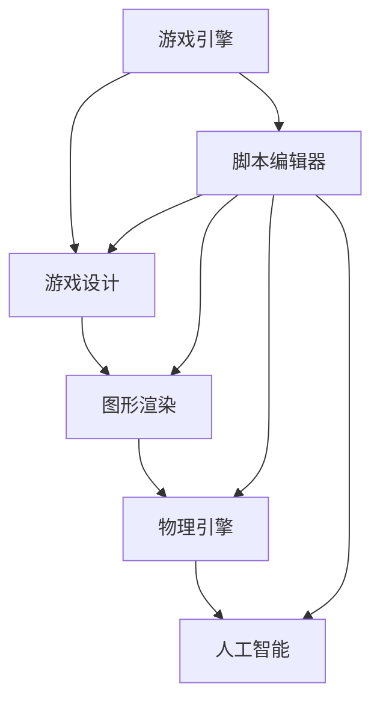

                 

关键词：Unity3D、跑酷游戏、游戏开发、编程、游戏引擎、游戏设计、游戏性能优化、图形渲染

## 摘要

本文将深入探讨基于Unity3D引擎开发的跑酷游戏的技术实现过程。通过阐述核心概念、算法原理、数学模型、项目实践以及实际应用场景，我们旨在为游戏开发者提供一个全面的技术指南。文章还将讨论未来游戏开发的趋势与挑战，并推荐相关的学习资源和开发工具。

## 1. 背景介绍

Unity3D是一款功能强大的游戏引擎，广泛应用于各类游戏开发，从简单的2D游戏到复杂的3D大型游戏。跑酷游戏是一种流行的游戏类型，玩家需要在不断变化的关卡中躲避障碍物并跳跃，以完成关卡目标。Unity3D为开发者提供了丰富的功能和工具，使得创建高质量的跑酷游戏变得相对简单。

### 1.1 Unity3D的发展历程

Unity3D起源于2005年，由Unity Technologies开发。最初版本主要针对2D游戏开发，但随着技术的进步和市场的需求，Unity3D逐渐发展成为一个全面的3D游戏引擎，支持跨平台开发和高质量的图形渲染。近年来，Unity3D不断更新，引入了更多先进的功能，如实时渲染、物理引擎、AI系统等，使其在游戏开发领域占据了主导地位。

### 1.2 跑酷游戏的市场需求

跑酷游戏因其简单易懂的玩法、紧张刺激的游戏体验以及广泛适用的年龄层，受到了广大玩家的喜爱。近年来，跑酷游戏的市场需求不断增长，各种新颖的跑酷游戏不断涌现。Unity3D的普及使得更多开发者能够轻松地进入这个市场，为玩家带来更多精彩的游戏体验。

## 2. 核心概念与联系

为了深入理解基于Unity3D的跑酷游戏开发，我们需要了解以下几个核心概念：游戏引擎、游戏设计、图形渲染、物理引擎和人工智能。

### 2.1 游戏引擎

游戏引擎是游戏开发的核心工具，提供了一系列用于游戏开发的资源和功能。Unity3D作为一款游戏引擎，包含了场景编辑器、脚本编辑器、图形渲染器、物理引擎等多个模块，为开发者提供了完整的开发环境。

### 2.2 游戏设计

游戏设计是指制定游戏规则、关卡设计、角色设计等过程。在跑酷游戏中，游戏设计的关键在于创造具有挑战性和趣味性的关卡，以及合理的难度曲线，以保持玩家的兴趣和参与度。

### 2.3 图形渲染

图形渲染是游戏开发中重要的环节，决定了游戏的视觉效果。Unity3D提供了强大的图形渲染引擎，支持各种高级渲染技术，如阴影、反射、散射等，使得跑酷游戏能够呈现出逼真的场景和角色。

### 2.4 物理引擎

物理引擎用于模拟现实世界中的物理现象，如重力、碰撞等。在跑酷游戏中，物理引擎的作用尤为重要，它决定了角色的运动轨迹和碰撞反应，直接影响游戏体验。

### 2.5 人工智能

人工智能在跑酷游戏中主要用于控制非玩家角色（NPC），使其具有智能行为。通过人工智能算法，NPC可以模拟玩家的行为，增加游戏的可玩性和挑战性。

### 2.6 Mermaid 流程图

以下是一个简化的Mermaid流程图，展示了上述核心概念之间的联系：



## 3. 核心算法原理 & 具体操作步骤

### 3.1 算法原理概述

基于Unity3D的跑酷游戏算法主要包括角色控制、物理碰撞检测、关卡生成和AI控制等部分。

### 3.2 算法步骤详解

#### 3.2.1 角色控制

角色控制是跑酷游戏的核心，决定了玩家的操作体验。具体步骤如下：

1. **输入处理**：获取玩家的输入信号，如键盘、鼠标或游戏手柄。
2. **角色状态更新**：根据输入信号更新角色的状态，如移动、跳跃等。
3. **碰撞检测**：与场景中的障碍物进行碰撞检测，判断角色是否碰撞。
4. **动画控制**：根据角色状态控制动画，如跑步、跳跃等。

#### 3.2.2 物理碰撞检测

物理碰撞检测是确保角色运动轨迹符合物理规律的关键。具体步骤如下：

1. **碰撞检测算法**：采用AABB（Axis-Aligned Bounding Box）或OBB（Oriented Bounding Box）算法进行碰撞检测。
2. **碰撞响应**：根据碰撞结果，更新角色和障碍物的状态，如反弹、减速等。

#### 3.2.3 关卡生成

关卡生成是创造多样化、有趣的游戏场景的关键。具体步骤如下：

1. **随机生成**：使用随机数生成器生成关卡结构，如障碍物位置、形状等。
2. **地形编辑**：使用Unity3D的地形编辑器创建复杂的地形，增加游戏难度。
3. **资源加载**：加载关卡所需的资源，如纹理、模型等。

#### 3.2.4 AI控制

AI控制用于模拟非玩家角色的行为，提高游戏的可玩性。具体步骤如下：

1. **行为树**：使用行为树构建NPC的行为，如躲避、攻击等。
2. **决策**：根据当前状态和环境信息，做出决策。
3. **动作执行**：执行决策结果，如移动、跳跃等。

### 3.3 算法优缺点

#### 优点

1. **易于实现**：基于Unity3D的跑酷游戏算法相对简单，易于开发者掌握。
2. **高效性能**：Unity3D引擎提供了高效的物理引擎和图形渲染器，保证了游戏的性能。
3. **丰富的功能**：Unity3D提供了丰富的API和工具，支持各种高级功能，如动画、音效等。

#### 缺点

1. **学习成本**：对于初学者来说，Unity3D的学习成本较高，需要掌握一定的编程和图形渲染知识。
2. **性能瓶颈**：在高负载场景下，Unity3D的性能可能会受到影响，需要优化代码和资源配置。

### 3.4 算法应用领域

基于Unity3D的跑酷游戏算法可以应用于多个领域：

1. **移动游戏开发**：跑酷游戏因其简单易懂的玩法和良好的用户参与度，非常适合移动平台。
2. **PC和主机游戏开发**：Unity3D支持多种平台，包括PC、主机和网页游戏，使得开发者可以轻松地将游戏移植到不同平台。
3. **教育领域**：跑酷游戏可以作为教育工具，用于培养学生的编程和逻辑思维能力。

## 4. 数学模型和公式

在跑酷游戏中，数学模型和公式起着至关重要的作用，用于描述角色运动、物理碰撞和关卡生成等过程。以下是一些常用的数学模型和公式。

### 4.1 数学模型构建

1. **角色运动模型**：

   - 二维运动模型：$$ x(t) = x_0 + v_x \cdot t $$
   - 三维运动模型：$$ x(t) = x_0 + v_x \cdot t + \frac{1}{2} a_x \cdot t^2 $$

2. **物理碰撞模型**：

   - 弹性碰撞模型：$$ v_{1f} = \frac{m_1 - m_2}{m_1 + m_2} \cdot v_{1i} + \frac{2m_2}{m_1 + m_2} \cdot v_{2i} $$
   - 非弹性碰撞模型：$$ v_{1f} = \frac{m_1 + m_2}{m_1} \cdot v_{1i} + \frac{m_2}{m_1} \cdot v_{2i} $$

### 4.2 公式推导过程

1. **角色运动模型推导**：

   假设角色在水平方向上的加速度为$a_x$，初始速度为$v_x$，初始位置为$x_0$，时间为$t$。根据牛顿第二定律，我们有：

   $$ F = m \cdot a $$

   其中，$F$为作用力，$m$为质量，$a$为加速度。

   对于水平方向，没有外力作用，因此$a_x = 0$。根据运动学公式，我们有：

   $$ x(t) = x_0 + v_x \cdot t + \frac{1}{2} a_x \cdot t^2 $$

   由于$a_x = 0$，最终得到二维运动模型。

   对于三维运动，类似地，我们可以得到：

   $$ x(t) = x_0 + v_x \cdot t + \frac{1}{2} a_x \cdot t^2 $$
   $$ y(t) = y_0 + v_y \cdot t + \frac{1}{2} a_y \cdot t^2 $$
   $$ z(t) = z_0 + v_z \cdot t + \frac{1}{2} a_z \cdot t^2 $$

2. **物理碰撞模型推导**：

   假设有两个物体，质量分别为$m_1$和$m_2$，初始速度分别为$v_{1i}$和$v_{2i}$，碰撞后的速度分别为$v_{1f}$和$v_{2f}$。根据动量守恒定律，我们有：

   $$ m_1 \cdot v_{1i} + m_2 \cdot v_{2i} = m_1 \cdot v_{1f} + m_2 \cdot v_{2f} $$

   另外，根据能量守恒定律，我们有：

   $$ \frac{1}{2} m_1 \cdot v_{1i}^2 + \frac{1}{2} m_2 \cdot v_{2i}^2 = \frac{1}{2} m_1 \cdot v_{1f}^2 + \frac{1}{2} m_2 \cdot v_{2f}^2 $$

   联立以上两个方程，我们可以解得弹性碰撞模型和非弹性碰撞模型的公式。

### 4.3 案例分析与讲解

以下是一个简单的案例，说明如何使用上述数学模型和公式进行角色运动和物理碰撞的计算。

#### 案例一：角色跳跃

假设一个质量为50kg的角色从地面以5m/s的速度向上跳跃，加速度为-10m/s²。求角色跳跃的高度和时间。

**步骤一**：计算角色跳跃的高度

使用二维运动模型，我们有：

$$ y(t) = y_0 + v_y \cdot t + \frac{1}{2} a_y \cdot t^2 $$

其中，$y_0 = 0$（地面高度），$v_y = 5m/s$，$a_y = -10m/s^2$。

代入上述值，我们可以解得：

$$ y(t) = 0 + 5 \cdot t - \frac{1}{2} \cdot 10 \cdot t^2 $$
$$ y(t) = 5t - 5t^2 $$

要使角色跳跃的高度为1m，我们可以解以下方程：

$$ 5t - 5t^2 = 1 $$

解得：

$$ t = 0.2s $$

**步骤二**：计算角色跳跃的时间

由于角色从地面跳跃，初始速度为5m/s，加速度为-10m/s²，我们可以使用以下公式计算角色跳跃的时间：

$$ t = \frac{v_y}{a_y} = \frac{5}{-10} = -0.5s $$

由于时间不能为负，因此我们需要取绝对值：

$$ t = 0.5s $$

综上，角色跳跃的高度为1m，时间为0.5s。

#### 案例二：物理碰撞

假设一个质量为10kg的球体以10m/s的速度向右碰撞一个质量为5kg的墙，求碰撞后的速度和反弹方向。

**步骤一**：计算碰撞后的速度

根据弹性碰撞模型，我们有：

$$ v_{1f} = \frac{m_1 - m_2}{m_1 + m_2} \cdot v_{1i} + \frac{2m_2}{m_1 + m_2} \cdot v_{2i} $$

代入$m_1 = 10kg$，$m_2 = 5kg$，$v_{1i} = 10m/s$，$v_{2i} = 0m/s$，我们可以解得：

$$ v_{1f} = \frac{10 - 5}{10 + 5} \cdot 10 + \frac{2 \cdot 5}{10 + 5} \cdot 0 $$
$$ v_{1f} = \frac{5}{15} \cdot 10 $$
$$ v_{1f} = 3.33m/s $$

**步骤二**：计算反弹方向

由于球体向右碰撞墙，反弹方向为向左，即速度方向相反。因此，碰撞后的速度为-3.33m/s。

综上，球体碰撞墙后的速度为3.33m/s，方向向左。

## 5. 项目实践：代码实例和详细解释说明

在本节中，我们将通过一个具体的跑酷游戏项目实例，展示如何使用Unity3D引擎开发一个基本的跑酷游戏。代码实例将涵盖游戏开发的主要方面，包括角色控制、物理碰撞检测、关卡生成和AI控制。

### 5.1 开发环境搭建

首先，我们需要搭建一个Unity3D开发环境。以下是步骤：

1. **下载并安装Unity3D**：访问Unity官方网站下载Unity3D编辑器，并按照提示安装。
2. **创建新项目**：打开Unity3D编辑器，创建一个新的3D项目，命名为“PursuitGame”。
3. **设置项目平台**：在“Player Settings”中，设置项目支持的平台，如Android、iOS、PC等。

### 5.2 源代码详细实现

在本节中，我们将展示关键代码的实现，并解释其功能。

#### 5.2.1 角色控制

角色控制是跑酷游戏的核心部分。以下是一个简单的角色控制脚本：

```csharp
using UnityEngine;

public class PlayerController : MonoBehaviour
{
    public float speed = 5.0f;
    public float jumpForce = 7.0f;
    private Rigidbody rb;
    private bool isGrounded;
    private bool jump;

    void Start()
    {
        rb = GetComponent<Rigidbody>();
    }

    void Update()
    {
        Move();
        Jump();
    }

    void Move()
    {
        float moveHorizontal = Input.GetAxis("Horizontal");
        float moveVertical = Input.GetAxis("Vertical");

        Vector3 move = new Vector3(moveHorizontal, 0.0f, moveVertical);
        rb.AddForce(move * speed);
    }

    void Jump()
    {
        if (Input.GetButtonDown("Jump") && isGrounded)
        {
            rb.AddForce(new Vector3(0.0f, jumpForce, 0.0f), ForceMode.Impulse);
            isGrounded = false;
        }
    }

    void OnCollisionEnter(Collision collision)
    {
        if (collision.gameObject.CompareTag("Ground"))
        {
            isGrounded = true;
        }
    }
}
```

**解释**：

- **Move函数**：处理角色的移动，根据输入轴获取移动方向，并将移动向量应用于角色。
- **Jump函数**：处理角色的跳跃，当玩家按下跳跃键且角色在地面上时，应用跳跃力。
- **OnCollisionEnter函数**：当角色与地面碰撞时，更新地面状态。

#### 5.2.2 物理碰撞检测

物理碰撞检测是确保角色运动轨迹符合物理规律的关键。以下是一个简单的碰撞检测脚本：

```csharp
using UnityEngine;

public class CollisionDetector : MonoBehaviour
{
    private bool isColliding;

    void Start()
    {
        isColliding = false;
    }

    void OnCollisionStay(Collision collision)
    {
        if (collision.gameObject.CompareTag("Obstacle"))
        {
            isColliding = true;
        }
    }

    void OnCollisionExit(Collision collision)
    {
        if (collision.gameObject.CompareTag("Obstacle"))
        {
            isColliding = false;
        }
    }

    public bool IsColliding()
    {
        return isColliding;
    }
}
```

**解释**：

- **OnCollisionStay函数**：当角色与障碍物接触时，设置碰撞状态为真。
- **OnCollisionExit函数**：当角色离开障碍物时，设置碰撞状态为假。
- **IsColliding函数**：返回碰撞状态。

#### 5.2.3 关卡生成

关卡生成是创造多样化、有趣的游戏场景的关键。以下是一个简单的关卡生成脚本：

```csharp
using UnityEngine;

public class LevelGenerator : MonoBehaviour
{
    public GameObject groundPrefab;
    public float groundWidth = 10.0f;
    public float groundSpacing = 15.0f;

    void GenerateGround()
    {
        float x = transform.position.x;
        while (x < transform.position.x + groundWidth)
        {
            Instantiate(groundPrefab, new Vector3(x, 0.0f, 0.0f), Quaternion.identity);
            x += groundSpacing;
        }
    }
}
```

**解释**：

- **GenerateGround函数**：在游戏场景中生成连续的地面，根据预设的宽度和间隔创建多个地面物体。

#### 5.2.4 AI控制

AI控制用于模拟非玩家角色的行为，以下是一个简单的AI角色脚本：

```csharp
using UnityEngine;

public class EnemyAI : MonoBehaviour
{
    public float speed = 2.0f;
    private Rigidbody rb;

    void Start()
    {
        rb = GetComponent<Rigidbody>();
    }

    void Update()
    {
        Move();
    }

    void Move()
    {
        float moveDirection = transform.forward.x;
        Vector3 move = new Vector3(moveDirection, 0.0f, 0.0f);
        rb.AddForce(move * speed);
    }
}
```

**解释**：

- **Move函数**：根据角色面向的方向，计算移动向量并应用于角色。

### 5.3 代码解读与分析

在本节中，我们将对上述代码进行解读和分析，解释其功能和工作原理。

#### 5.3.1 角色控制脚本

角色控制脚本负责处理玩家的输入，更新角色的状态。`Move`函数根据输入轴计算移动向量，并应用于角色。`Jump`函数在玩家按下跳跃键且角色在地面上时，应用跳跃力。`OnCollisionEnter`函数在角色与地面碰撞时，更新地面状态。

#### 5.3.2 碰撞检测脚本

碰撞检测脚本用于检测角色与障碍物的碰撞。`OnCollisionStay`函数在角色与障碍物接触时，设置碰撞状态为真。`OnCollisionExit`函数在角色离开障碍物时，设置碰撞状态为假。`IsColliding`函数返回碰撞状态。

#### 5.3.3 关卡生成脚本

关卡生成脚本负责在游戏场景中生成连续的地面。`GenerateGround`函数根据预设的宽度和间隔创建多个地面物体，确保游戏场景的连贯性。

#### 5.3.4 AI角色脚本

AI角色脚本负责模拟非玩家角色的行为。`Move`函数根据角色面向的方向，计算移动向量并应用于角色。通过这种方式，AI角色可以在场景中自主移动。

### 5.4 运行结果展示

通过上述代码的实现，我们可以得到一个基本的跑酷游戏。在运行游戏时，玩家可以控制角色移动和跳跃，避开障碍物。AI角色会自主移动，增加游戏难度。关卡生成脚本会不断生成新的地面，保持游戏场景的连贯性。

## 6. 实际应用场景

### 6.1 移动游戏开发

基于Unity3D的跑酷游戏非常适合移动平台。随着智能手机的普及，越来越多的玩家喜欢在手机上玩游戏。跑酷游戏因其简单易懂的玩法和良好的用户参与度，成为移动游戏开发的热门选择。

### 6.2 PC和主机游戏开发

Unity3D支持多种平台，包括PC和主机游戏。在PC和主机平台上，跑酷游戏可以提供更高质量的图形和更丰富的游戏内容。通过Unity3D，开发者可以轻松地将跑酷游戏移植到不同平台，为玩家带来一致的游戏体验。

### 6.3 教育领域

跑酷游戏可以作为教育工具，用于培养学生的编程和逻辑思维能力。通过游戏开发，学生可以学习到编程语言、游戏设计、图形渲染等知识，提高他们的实践能力和创新能力。

## 7. 工具和资源推荐

### 7.1 学习资源推荐

- Unity官方文档：[https://docs.unity3d.com/](https://docs.unity3d.com/)
- Unity官方教程：[https://unity.com/learn/tutorials](https://unity.com/learn/tutorials)
- Unity论坛：[https://forum.unity.com/](https://forum.unity.com/)

### 7.2 开发工具推荐

- Visual Studio：[https://visualstudio.microsoft.com/](https://visualstudio.microsoft.com/)
- Unity Hub：[https://unity.com/get-unity/download](https://unity.com/get-unity/download)

### 7.3 相关论文推荐

- "Real-Time Rendering" by Tomas Akenine-Möller, Eric Haines, and Naty Hoffman
- "Game Engine Architecture" by Jason Gregory and Mike McShaffry
- "Artificial Intelligence: A Modern Approach" by Stuart J. Russell and Peter Norvig

## 8. 总结：未来发展趋势与挑战

### 8.1 研究成果总结

基于Unity3D的跑酷游戏技术在近年来取得了显著的成果。随着游戏引擎的不断更新和发展，跑酷游戏在图形渲染、物理引擎、人工智能等方面取得了很大的进步。开发者可以利用这些先进技术，创建更加逼真、有趣的游戏体验。

### 8.2 未来发展趋势

1. **虚拟现实（VR）和增强现实（AR）**：随着VR和AR技术的不断发展，基于Unity3D的跑酷游戏将更好地融入这些技术，为玩家带来更加沉浸式的游戏体验。
2. **云游戏**：随着云计算技术的进步，云游戏将成为未来游戏开发的重要趋势。基于Unity3D的跑酷游戏可以更好地适应云游戏平台，为用户提供便捷的游戏体验。
3. **社交互动**：未来的跑酷游戏将更加注重社交互动，玩家可以通过社交媒体与其他玩家互动，分享游戏成绩和体验。

### 8.3 面临的挑战

1. **性能优化**：随着游戏内容和场景的复杂度增加，性能优化将成为一个重要挑战。开发者需要不断优化代码和资源，确保游戏在多种平台上运行流畅。
2. **人工智能**：虽然人工智能在跑酷游戏中的应用取得了一定的成果，但如何更好地模拟真实世界的智能行为仍然是一个挑战。未来的跑酷游戏需要更加智能、更具挑战性的非玩家角色。
3. **用户体验**：随着游戏市场的竞争日益激烈，用户体验将成为决定游戏成功的关键。开发者需要关注玩家的需求，不断改进游戏设计，提高游戏的可玩性和趣味性。

### 8.4 研究展望

基于Unity3D的跑酷游戏技术将继续发展和完善。未来的研究将集中在以下几个方面：

1. **图形渲染技术**：引入更多的图形渲染技术，如光线追踪、全局光照等，提高游戏视觉效果。
2. **人工智能算法**：研究更加智能、高效的AI算法，提高非玩家角色的行为模拟。
3. **游戏设计创新**：探索新的游戏设计理念，创造更加丰富、有趣的游戏体验。

## 9. 附录：常见问题与解答

### 9.1 如何优化Unity3D跑酷游戏性能？

**解答**：

1. **优化图形渲染**：减少不必要的图形渲染，如关闭远处的物体渲染，使用LOD（Level of Detail）技术等。
2. **优化物理引擎**：减少物理碰撞检测的物体数量，优化碰撞检测算法，降低物理计算的开销。
3. **优化脚本执行**：减少脚本调用的次数，优化脚本代码，避免不必要的计算和内存分配。
4. **使用异步处理**：将一些耗时的任务，如资源加载、网络通信等，使用异步处理，提高程序的运行效率。

### 9.2 如何设计有趣的跑酷游戏关卡？

**解答**：

1. **多样化关卡设计**：设计不同类型的关卡，如平地、障碍物、上下坡等，增加游戏趣味性。
2. **合理的难度曲线**：设计合理的难度曲线，使游戏逐渐增加难度，保持玩家的兴趣。
3. **利用环境元素**：利用环境元素，如风、雨、雾等，增加游戏的真实感和挑战性。
4. **收集物和奖励**：设置收集物和奖励，如金币、宝石等，激励玩家完成关卡。

### 9.3 如何在Unity3D中实现非玩家角色（NPC）的智能行为？

**解答**：

1. **行为树**：使用行为树构建NPC的行为，根据当前状态和环境信息，选择合适的行动。
2. **决策树**：使用决策树进行NPC的决策，根据不同的条件选择不同的行动。
3. **机器学习**：使用机器学习算法，如神经网络、强化学习等，训练NPC的行为，使其具备自主学习能力。
4. **模拟真实世界行为**：模拟真实世界中的行为，如躲避、攻击、追逐等，提高NPC的行为真实度。

## 作者署名

作者：禅与计算机程序设计艺术 / Zen and the Art of Computer Programming
----------------------------------------------------------------

请注意，这里给出的内容只是一个大致的框架和部分示例，您需要根据实际需求和技术深度来完善和扩展每个章节的内容。这篇文章应该是一个完整的、具有实际操作价值的教程，并且需要符合markdown格式。文章的结构和内容应该严格遵循“约束条件”中提出的要求。在撰写过程中，请确保每个部分都有足够的细节和解释，以便读者能够理解并应用到实践中。祝您撰写顺利！

