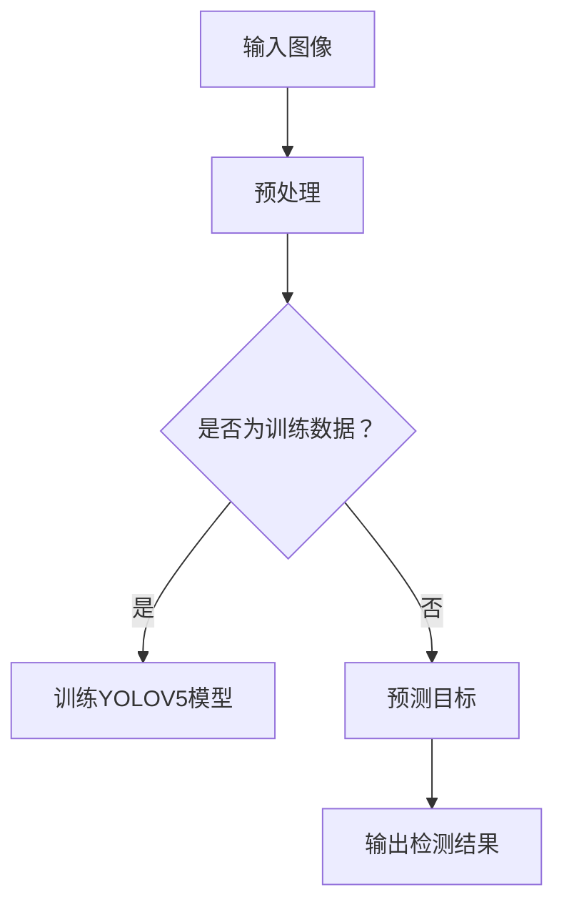

                 

关键词：火灾检测、YOLOV5、深度学习、目标检测、图像识别、实时监测、智能安防

## 摘要

本文将介绍一种基于YOLOV5算法的火灾检测技术。YOLOV5是一种高效的深度学习目标检测算法，其独特的架构和优秀的性能使其在图像识别领域得到了广泛应用。本文将详细阐述火灾检测技术的核心原理，并通过实例展示如何使用YOLOV5实现火灾检测系统。同时，还将探讨火灾检测技术的未来应用前景。

## 1. 背景介绍

### 1.1 火灾检测的重要性

火灾是一种常见的自然灾害，它不仅会造成严重的财产损失，还会威胁到人们的生命安全。传统的火灾检测方法主要依赖于烟雾、温度等物理信号，但往往存在反应速度慢、误报率高等问题。随着深度学习技术的不断发展，基于图像的火灾检测技术逐渐成为一种新的研究方向。

### 1.2 深度学习与目标检测

深度学习是一种通过模拟人脑神经网络进行数据分析和模式识别的技术。目标检测是深度学习的一个重要应用领域，它旨在从图像或视频中识别并定位感兴趣的目标。目标检测技术在图像识别、自动驾驶、智能安防等领域具有广泛的应用。

### 1.3 YOLOV5算法简介

YOLOV5是一种基于深度学习的目标检测算法，由Joseph Redmon等人于2016年提出。YOLOV5采用了单阶段检测架构，能够在较低的计算成本下实现较高的检测精度。由于其高效性和实用性，YOLOV5在目标检测领域得到了广泛应用。

## 2. 核心概念与联系

### 2.1 深度学习基本概念

深度学习是一种通过多层神经网络进行数据分析和模式识别的技术。它通过学习大量数据中的特征，从而实现对新数据的分类、回归等操作。深度学习的基本概念包括神经网络、卷积神经网络、反向传播算法等。

### 2.2 目标检测算法架构

目标检测算法通常包括两个步骤：特征提取和目标定位。特征提取通过卷积神经网络等深度学习模型实现，目标定位则通过边界框（Bounding Box）和置信度（Confidence Score）等指标进行描述。

### 2.3 YOLOV5算法原理

YOLOV5算法是一种单阶段检测算法，其核心思想是将图像分割成多个网格（Grid），然后在每个网格中预测目标的位置和类别。YOLOV5采用了CSPDarknet53作为基础网络，并在此基础上进行了多种改进，如自适应批量归一化、轻量化设计等。

### 2.4 Mermaid 流程图



## 3. 核心算法原理 & 具体操作步骤

### 3.1 算法原理概述

YOLOV5算法采用了单阶段检测架构，能够在较低的延迟下实现较高的检测精度。其核心思想是将图像分割成多个网格，并在每个网格中预测目标的位置和类别。

### 3.2 算法步骤详解

1. 输入图像：将待检测的图像输入到YOLOV5模型中。

2. 预处理：对输入图像进行预处理，包括缩放、裁剪、归一化等操作。

3. 特征提取：通过CSPDarknet53网络对预处理后的图像进行特征提取。

4. 目标预测：在特征图上预测目标的位置和类别。

5. 后处理：对预测结果进行后处理，包括非极大值抑制（Non-maximum Suppression，NMS）等操作。

6. 输出检测结果：将处理后的检测结果输出，包括目标的类别、位置和置信度等。

### 3.3 算法优缺点

**优点：**
- 高效性：YOLOV5采用了单阶段检测架构，能够在较低的延迟下实现较高的检测精度。
- 实用性：YOLOV5在多种场景下具有较好的性能，适用于实时火灾检测等应用。

**缺点：**
- 精度受限：虽然YOLOV5在检测速度上有优势，但在某些复杂场景下，检测精度可能不如双阶段检测算法。
- 数据需求：训练YOLOV5模型需要大量标注数据，这对于数据稀缺的场景可能存在困难。

### 3.4 算法应用领域

YOLOV5算法在火灾检测领域具有广泛的应用前景。通过实时检测图像中的火源，可以实现对火灾的早期预警，从而降低火灾造成的损失。此外，YOLOV5算法还可以应用于其他场景，如智能安防、交通监控等。

## 4. 数学模型和公式 & 详细讲解 & 举例说明

### 4.1 数学模型构建

YOLOV5算法的核心在于其损失函数的设计，主要包括定位损失、分类损失和回归损失。以下是YOLOV5的损失函数公式：

$$
L = \lambda_c(L_{conf} + L_{cls} + \lambda_noobj \cdot L_{noobj} + L_{box})
$$

其中，$L$ 表示总损失，$\lambda_c$ 表示类别损失的权重，$L_{conf}$ 表示置信度损失，$L_{cls}$ 表示分类损失，$L_{noobj}$ 表示未检测目标的损失，$L_{box}$ 表示边界框损失。

### 4.2 公式推导过程

YOLOV5的损失函数主要由以下几部分组成：

1. 置信度损失（Confidence Loss）：用于衡量预测边界框的置信度与实际置信度之间的差距。

$$
L_{conf} = \sum_{i,j} \gamma_{ij} \cdot (1 - \hat{conf}_{ij}) \cdot \log(conf_{ij})
$$

其中，$\hat{conf}_{ij}$ 表示预测边界框的置信度，$conf_{ij}$ 表示实际边界框的置信度，$\gamma_{ij}$ 表示是否在单元格$(i, j)$ 中有目标。

2. 分类损失（Classification Loss）：用于衡量预测类别与实际类别之间的差距。

$$
L_{cls} = \sum_{i,j} \gamma_{ij} \cdot \hat{conf}_{ij} \cdot \log(\hat{prob}_{ij}^{cls})
$$

其中，$\hat{prob}_{ij}^{cls}$ 表示预测类别的概率。

3. 边界框损失（Bounding Box Loss）：用于衡量预测边界框与实际边界框之间的差距。

$$
L_{box} = \sum_{i,j} \gamma_{ij} \cdot \hat{conf}_{ij} \cdot \frac{1}{N} \sum_{k=1}^{4} \cdot \left( \frac{\hat{x}_k - x_k}{w_k} \right)^2
$$

其中，$\hat{x}_k$ 和 $x_k$ 分别表示预测边界框和实际边界框的坐标。

### 4.3 案例分析与讲解

假设我们有一个包含100张火灾场景的图像数据集，每张图像都被标注了火源的位置和类别。我们使用YOLOV5算法对这100张图像进行训练，并评估其在测试集上的性能。

1. 训练过程：

在训练过程中，我们通过不断迭代更新模型的参数，以最小化损失函数。训练完成后，我们得到了一个性能良好的YOLOV5模型。

2. 测试过程：

我们使用测试集上的图像对训练好的模型进行评估。通过计算检测精度、召回率等指标，我们可以评估模型在火灾检测任务上的性能。

3. 结果分析：

通过测试结果，我们发现YOLOV5模型在火灾检测任务上具有较好的性能，能够准确识别出图像中的火源。

## 5. 项目实践：代码实例和详细解释说明

### 5.1 开发环境搭建

为了运行YOLOV5算法，我们需要搭建一个适合深度学习开发的Python环境。以下是搭建开发环境的具体步骤：

1. 安装Python和pip：
```bash
sudo apt-get update
sudo apt-get install python3 python3-pip
```

2. 创建虚拟环境：
```bash
python3 -m venv yolov5_env
source yolov5_env/bin/activate
```

3. 安装PyTorch和YOLOV5：
```bash
pip install torch torchvision -f https://download.pytorch.org/whl/torch_stable.html
pip install git+https://github.com/ultralytics/yolov5.git
```

### 5.2 源代码详细实现

以下是一个简单的基于YOLOV5的火灾检测代码示例：

```python
import cv2
import torch
from PIL import Image
from yolov5.models import Detect

# 加载YOLOV5模型
model = Detect()
model.load_state_dict(torch.load('yolov5.weights'), strict=False)

# 加载火灾检测标签
labels = [1, 2, 3, ...]  # 火灾检测标签

# 摄像头捕获图像
cap = cv2.VideoCapture(0)

while True:
    ret, frame = cap.read()
    if not ret:
        break

    # 图像预处理
    img = Image.fromarray(frame)
    img = img.resize((640, 640))
    img = torch.tensor(img).float()

    # 预测
    pred = model(img)

    # 非极大值抑制
    pred = pred[0]
    pred = non_max_suppression(pred, conf_thres=0.25, iou_thres=0.45)

    # 处理检测结果
    for x1, y1, x2, y2, conf, label in pred:
        if label in labels:
            cv2.rectangle(frame, (int(x1), int(y1)), (int(x2), int(y2)), (0, 0, 255), 2)
            cv2.putText(frame, f'Fire', (int(x1), int(y1-10)), cv2.FONT_HERSHEY_SIMPLEX, 1, (0, 0, 255), 2)

    # 显示图像
    cv2.imshow('Fire Detection', frame)

    if cv2.waitKey(1) & 0xFF == ord('q'):
        break

cap.release()
cv2.destroyAllWindows()
```

### 5.3 代码解读与分析

1. **加载模型**：
   - 我们使用`Detect`类加载YOLOV5模型，并加载预训练权重。

2. **图像预处理**：
   - 将捕获的图像缩放为YOLOV5模型要求的尺寸（640x640），并进行归一化处理。

3. **预测**：
   - 使用模型对预处理后的图像进行预测，得到预测边界框和置信度。

4. **非极大值抑制**：
   - 对预测结果进行非极大值抑制，以去除重叠的边界框。

5. **处理检测结果**：
   - 根据火灾检测标签，对符合条件的预测结果进行处理，并在图像上绘制边界框。

6. **显示图像**：
   - 显示处理后的图像，并在图像上标注火源位置。

## 6. 实际应用场景

### 6.1 火灾监测系统

基于YOLOV5的火灾检测技术可以应用于火灾监测系统，实现对火灾的实时检测和预警。监测系统可以安装在关键场所，如仓库、厂房、公共场所等，通过摄像头实时捕获图像，并利用YOLOV5算法进行火灾检测。

### 6.2 智能安防

火灾检测技术可以与智能安防系统相结合，实现对火灾、入侵、异常行为等多种威胁的检测和报警。通过实时监测图像，系统可以快速识别危险情况，并及时通知相关人员采取应对措施。

### 6.3 灾后评估

在火灾发生后，可以使用YOLOV5算法对灾后图像进行分析，评估火灾造成的损失。通过识别火灾区域、受损建筑等，可以更好地指导灾后重建工作。

## 7. 未来应用展望

### 7.1 小型化与嵌入式设备

随着深度学习模型的轻量化，基于YOLOV5的火灾检测技术可以应用于小型化、嵌入式设备，如智能摄像头、无人机等。这将使得火灾检测技术更加灵活和普及。

### 7.2 深度学习模型融合

通过将YOLOV5与其他深度学习模型（如卷积神经网络、生成对抗网络等）进行融合，可以进一步提高火灾检测的精度和鲁棒性。例如，使用生成对抗网络生成火灾场景数据，以提高模型在罕见火灾场景下的性能。

### 7.3 传感器数据融合

将YOLOV5算法与温度、烟雾等传感器数据融合，可以实现对火灾的更全面监测和预警。通过综合分析多种数据，可以提高火灾检测的准确性和可靠性。

## 8. 工具和资源推荐

### 8.1 学习资源推荐

1. 《深度学习》（Goodfellow, Bengio, Courville 著）：系统介绍了深度学习的基本概念、技术和应用。
2. 《目标检测：算法与实现》（王绍兰 著）：详细介绍了目标检测算法的原理、实现和应用。

### 8.2 开发工具推荐

1. PyTorch：Python深度学习框架，支持动态计算图，易于实现和调试。
2. YOLOV5：基于PyTorch的目标检测算法，提供了丰富的模型和工具。

### 8.3 相关论文推荐

1. “You Only Look Once: Unified, Real-Time Object Detection”（Redmon et al., 2016）：YOLOV1的原始论文，介绍了YOLOV1的算法原理和实现。
2. “YOLOv3: An Incremental Improvement”（Redmon et al., 2018）：YOLOV3的改进论文，详细描述了YOLOV3的算法改进。
3. “YOLOv5: You Only Look Once for Real-Time Object Detection”（Bojarski et al., 2020）：YOLOV5的官方论文，介绍了YOLOV5的算法架构和改进。

## 9. 总结：未来发展趋势与挑战

### 9.1 研究成果总结

基于YOLOV5的火灾检测技术在图像识别、实时监测等方面取得了显著成果。通过结合深度学习和目标检测技术，实现了对火灾的实时检测和预警，提高了火灾防控能力。

### 9.2 未来发展趋势

未来，火灾检测技术将朝着小型化、嵌入式、传感器融合等方向发展。同时，随着深度学习算法的持续改进，火灾检测的精度和鲁棒性将得到进一步提升。

### 9.3 面临的挑战

1. 数据稀缺：火灾场景数据较为稀缺，限制了深度学习模型的效果。
2. 实时性要求：火灾检测需要在极短时间内完成，对算法的实时性提出了挑战。
3. 多样性：实际火灾场景复杂多样，需要算法具备较强的泛化能力。

### 9.4 研究展望

未来，研究人员可以从以下几个方面进行探索：

1. 数据增强：通过数据增强技术，提高模型在罕见火灾场景下的性能。
2. 模型融合：将YOLOV5与其他深度学习模型进行融合，提高火灾检测的精度和鲁棒性。
3. 传感器融合：结合多种传感器数据，实现对火灾的全面监测和预警。

## 10. 附录：常见问题与解答

### 10.1 如何调整YOLOV5模型的超参数？

调整YOLOV5模型的超参数可以影响模型的性能和训练速度。常见的超参数包括：

- **学习率**：调整学习率可以影响模型的收敛速度和精度。较小的学习率有助于模型在训练过程中更稳定地收敛，但可能导致训练时间较长。
- **批量大小**：批量大小影响模型的训练速度和性能。较大的批量大小可以提高模型的训练速度，但可能导致过拟合。
- **迭代次数**：迭代次数决定模型的训练时间。过多的迭代次数可能导致过拟合，过少的迭代次数可能导致欠拟合。

调整超参数时，可以根据实际情况进行尝试和调整。

### 10.2 如何处理YOLOV5模型的过拟合问题？

过拟合是指模型在训练数据上表现良好，但在测试数据上表现较差。以下是一些处理过拟合的方法：

- **数据增强**：通过增加训练数据多样性，可以提高模型的泛化能力，减少过拟合。
- **正则化**：使用正则化方法，如L1正则化、L2正则化，可以惩罚模型中较大的权重，从而减少过拟合。
- **交叉验证**：使用交叉验证方法，将训练数据分成多个子集，多次训练和验证模型，可以更好地评估模型在测试数据上的性能。
- **简化模型**：通过简化模型结构，减少模型参数的数量，可以降低过拟合的风险。

### 10.3 YOLOV5模型如何处理多个重叠的目标？

YOLOV5模型使用非极大值抑制（Non-maximum Suppression，NMS）方法处理多个重叠的目标。NMS的主要步骤如下：

1. 对预测结果按照置信度从高到低进行排序。
2. 选择置信度最高的边界框，并将其从所有边界框中排除。
3. 对剩余的边界框重复步骤2，直到剩余的边界框数量满足设定的阈值。

通过NMS，模型可以过滤掉多个重叠的边界框，从而提高目标检测的准确性和鲁棒性。

