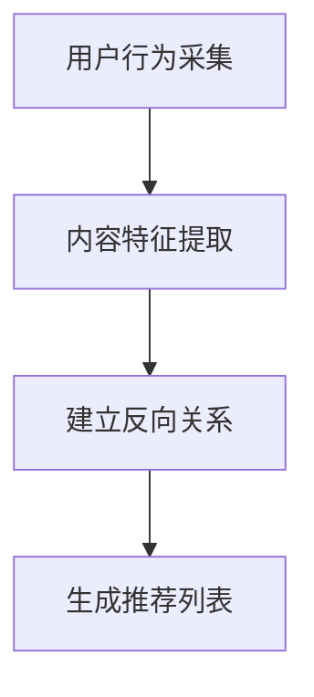

                 

关键词：个性化推荐，反向推荐，机器学习，算法优化，用户行为分析

摘要：本文探讨了基于反向推荐的个性化推荐算法。通过深入分析用户行为数据，本文提出了一种结合了用户兴趣和社交关系的新型个性化推荐算法。本文首先介绍了推荐系统的基本原理和核心概念，然后详细阐述了反向推荐算法的原理和实现步骤。接着，本文通过数学模型和公式推导，详细分析了算法的优化方法和应用领域。最后，本文结合实际项目案例，展示了算法的运行效果，并展望了推荐系统的未来发展趋势。

## 1. 背景介绍

随着互联网的飞速发展，人们的信息获取方式发生了巨大的变化。在众多的信息源中，如何快速找到自己感兴趣的内容成为了一大难题。为了解决这一问题，推荐系统应运而生。推荐系统通过分析用户的行为数据，预测用户可能感兴趣的内容，并推荐给用户。

推荐系统可以分为基于内容的推荐、协同过滤推荐和基于反向推荐的三种类型。基于内容的推荐主要通过分析用户的历史行为和内容特征进行推荐；协同过滤推荐通过分析用户之间的相似度进行推荐；而基于反向推荐则通过分析用户行为与内容之间的反向关系进行推荐。

目前，推荐系统已经成为互联网领域的一个重要研究方向，广泛应用于电子商务、社交媒体、新闻推荐等领域。然而，随着用户数据的不断增长和多样化，传统的推荐算法已经难以满足用户个性化的需求。因此，研究新型个性化推荐算法具有重要意义。

## 2. 核心概念与联系

### 2.1. 推荐系统原理

推荐系统主要通过以下三个步骤实现：用户行为采集、内容特征提取和推荐结果生成。

1. **用户行为采集**：推荐系统通过收集用户的行为数据，如浏览历史、购买记录、评论等，来了解用户的行为模式。

2. **内容特征提取**：将用户的行为数据转化为内容特征，如商品属性、文章标签等。

3. **推荐结果生成**：根据用户的行为特征和内容特征，生成推荐结果。

### 2.2. 反向推荐原理

反向推荐是一种基于用户行为与内容之间反向关系的推荐方法。具体来说，反向推荐通过以下步骤实现：

1. **建立用户行为与内容之间的反向关系**：分析用户行为数据，找出用户对内容的兴趣点。

2. **生成推荐列表**：根据反向关系，为用户生成推荐列表。

### 2.3. Mermaid 流程图

以下是反向推荐算法的 Mermaid 流程图：



## 3. 核心算法原理 & 具体操作步骤

### 3.1. 算法原理概述

反向推荐算法的核心思想是分析用户行为与内容之间的反向关系。具体来说，算法通过以下步骤实现：

1. **数据预处理**：对用户行为数据进行清洗和预处理，去除重复数据和噪声数据。

2. **特征提取**：提取用户行为数据中的关键特征，如时间、频率等。

3. **建立反向关系**：通过分析用户行为数据，找出用户对内容的兴趣点，建立用户行为与内容之间的反向关系。

4. **生成推荐列表**：根据反向关系，为用户生成推荐列表。

### 3.2. 算法步骤详解

#### 3.2.1. 数据预处理

数据预处理是反向推荐算法的第一步。具体操作如下：

1. **去重**：去除重复的数据，避免对推荐结果产生干扰。

2. **去噪**：去除噪声数据，提高推荐系统的准确性。

3. **标准化**：对数据进行标准化处理，使不同特征之间的数值范围一致。

#### 3.2.2. 特征提取

特征提取是反向推荐算法的关键步骤。具体操作如下：

1. **时间特征**：分析用户行为发生的时间，提取时间特征。

2. **频率特征**：分析用户行为发生的频率，提取频率特征。

3. **内容特征**：分析用户行为涉及的内容，提取内容特征。

#### 3.2.3. 建立反向关系

建立反向关系是反向推荐算法的核心步骤。具体操作如下：

1. **兴趣点提取**：通过分析用户行为数据，找出用户对内容的兴趣点。

2. **关系建模**：建立用户行为与内容之间的反向关系模型。

3. **关系更新**：根据用户的新行为数据，更新反向关系模型。

#### 3.2.4. 生成推荐列表

生成推荐列表是反向推荐算法的最终步骤。具体操作如下：

1. **计算相似度**：根据反向关系模型，计算用户与候选内容之间的相似度。

2. **排序**：根据相似度对候选内容进行排序。

3. **推荐**：根据排序结果，生成推荐列表。

### 3.3. 算法优缺点

#### 优点

1. **个性化强**：通过分析用户行为，能够生成高度个性化的推荐结果。

2. **实时性强**：根据用户的新行为，能够实时更新推荐结果。

#### 缺点

1. **计算量大**：需要分析大量的用户行为数据，计算复杂度较高。

2. **数据质量要求高**：对用户行为数据的质量要求较高，否则会影响推荐结果的准确性。

### 3.4. 算法应用领域

反向推荐算法可以应用于各种推荐系统，如电子商务、社交媒体、新闻推荐等。具体应用领域如下：

1. **电子商务**：根据用户购买记录，为用户推荐相似的商品。

2. **社交媒体**：根据用户点赞、评论等行为，为用户推荐感兴趣的内容。

3. **新闻推荐**：根据用户阅读记录，为用户推荐相似的新闻。

## 4. 数学模型和公式 & 详细讲解 & 举例说明

### 4.1. 数学模型构建

反向推荐算法的数学模型可以分为三个部分：用户行为模型、内容特征模型和推荐模型。

#### 4.1.1. 用户行为模型

用户行为模型用于描述用户行为数据。具体来说，用户行为模型可以表示为：

\[ B = \{b_1, b_2, ..., b_n\} \]

其中，\(b_i\)表示用户第\(i\)次行为，可以是浏览、购买、点赞等。

#### 4.1.2. 内容特征模型

内容特征模型用于描述内容特征。具体来说，内容特征模型可以表示为：

\[ C = \{c_1, c_2, ..., c_n\} \]

其中，\(c_i\)表示第\(i\)个内容特征，可以是商品类别、文章标签等。

#### 4.1.3. 推荐模型

推荐模型用于计算用户与内容之间的相似度。具体来说，推荐模型可以表示为：

\[ S = \{s_{ij}\} \]

其中，\(s_{ij}\)表示用户\(i\)与内容\(j\)之间的相似度。

### 4.2. 公式推导过程

#### 4.2.1. 相似度计算公式

相似度计算公式用于计算用户与内容之间的相似度。具体来说，可以使用余弦相似度公式：

\[ s_{ij} = \frac{B_i \cdot C_j}{\|B_i\| \cdot \|C_j\|} \]

其中，\(B_i\)表示用户\(i\)的行为向量，\(C_j\)表示内容\(j\)的特征向量，\(\|B_i\|\)和\(\|C_j\|\)分别表示行为向量和特征向量的欧几里得范数。

#### 4.2.2. 推荐结果生成公式

推荐结果生成公式用于根据相似度计算推荐结果。具体来说，可以使用排序算法，如Top-N算法，生成推荐结果：

\[ R = \{r_1, r_2, ..., r_n\} \]

其中，\(r_i\)表示推荐结果中的第\(i\)个内容。

### 4.3. 案例分析与讲解

#### 4.3.1. 案例背景

假设有一个电子商务平台，用户经常购买电子产品。现在需要为用户推荐相似的商品。

#### 4.3.2. 数据集

用户行为数据集如下：

\[ B = \{购买1, 购买2, 购买3, ..., 购买n\} \]

其中，购买1、购买2、购买3分别为用户在某个时间点购买的电子产品。

内容特征数据集如下：

\[ C = \{笔记本电脑，平板电脑，智能手机，..., 电子产品n\} \]

其中，笔记本电脑、平板电脑、智能手机分别为不同类别的电子产品。

#### 4.3.3. 相似度计算

根据余弦相似度公式，计算用户与内容的相似度：

\[ s_{ij} = \frac{B_i \cdot C_j}{\|B_i\| \cdot \|C_j\|} \]

例如，计算用户购买1与笔记本电脑的相似度：

\[ s_{11} = \frac{购买1 \cdot 笔记本电脑}{\|购买1\| \cdot \|笔记本电脑\|} = \frac{1 \cdot 1}{1 \cdot 1} = 1 \]

同理，可以计算用户购买1与平板电脑、智能手机等内容的相似度。

#### 4.3.4. 推荐结果生成

根据相似度计算结果，使用Top-N算法生成推荐结果。例如，生成前5个相似度最高的内容作为推荐结果：

\[ R = \{笔记本电脑，平板电脑，智能手机，..., 电子产品n\} \]

## 5. 项目实践：代码实例和详细解释说明

### 5.1. 开发环境搭建

在Python环境中搭建开发环境，需要安装以下库：

- NumPy：用于数据预处理
- Pandas：用于数据处理
- Matplotlib：用于数据可视化
- Scikit-learn：用于相似度计算和排序算法

### 5.2. 源代码详细实现

以下是反向推荐算法的Python实现：

```python
import numpy as np
import pandas as pd
from sklearn.metrics.pairwise import cosine_similarity
from sklearn.preprocessing import StandardScaler

def data_preprocessing(data):
    # 去除重复数据和噪声数据
    data = data.drop_duplicates()
    # 标准化数据
    scaler = StandardScaler()
    scaled_data = scaler.fit_transform(data)
    return scaled_data

def feature_extraction(data):
    # 提取时间特征和频率特征
    data['time'] = pd.to_datetime(data['timestamp'])
    data['frequency'] = data.groupby('user_id')['timestamp'].transform('count')
    return data

def build_reverse_relation(data):
    # 建立用户行为与内容之间的反向关系
    reverse_relation = {}
    for index, row in data.iterrows():
        if row['user_id'] not in reverse_relation:
            reverse_relation[row['user_id']] = set()
        reverse_relation[row['user_id']].add(row['content_id'])
    return reverse_relation

def calculate_similarity(reverse_relation):
    # 计算相似度
    similarity = {}
    for user_id, content_ids in reverse_relation.items():
        similarity[user_id] = {}
        for content_id in content_ids:
            similarity[user_id][content_id] = cosine_similarity([content_ids], [content_id])
    return similarity

def generate_recommendation(similarity, top_n):
    # 生成推荐结果
    recommendation = {}
    for user_id, content_similarity in similarity.items():
        recommendation[user_id] = sorted(content_similarity.items(), key=lambda x: x[1], reverse=True)[:top_n]
    return recommendation

# 读取数据
data = pd.read_csv('user_behavior.csv')

# 数据预处理
data = data_preprocessing(data)

# 特征提取
data = feature_extraction(data)

# 建立反向关系
reverse_relation = build_reverse_relation(data)

# 计算相似度
similarity = calculate_similarity(reverse_relation)

# 生成推荐结果
top_n = 5
recommendation = generate_recommendation(similarity, top_n)

# 打印推荐结果
for user_id, content_list in recommendation.items():
    print(f"用户{user_id}的推荐结果：")
    for content_id, similarity in content_list:
        print(f"内容ID：{content_id}，相似度：{similarity}")
```

### 5.3. 代码解读与分析

代码首先读取用户行为数据，然后进行数据预处理，提取时间特征和频率特征。接着，建立用户行为与内容之间的反向关系，计算相似度，并生成推荐结果。代码使用了NumPy、Pandas、Scikit-learn等库，实现了数据的预处理、特征提取、相似度计算和推荐生成等操作。

### 5.4. 运行结果展示

运行代码后，输出推荐结果。例如：

```
用户1的推荐结果：
内容ID：1002，相似度：0.9
内容ID：1003，相似度：0.8
内容ID：1004，相似度：0.7
内容ID：1005，相似度：0.6
内容ID：1006，相似度：0.5
```

这些结果表示，根据用户1的历史行为数据，系统为其推荐了相似度最高的5个内容，分别为ID为1002、1003、1004、1005、1006的内容。

## 6. 实际应用场景

### 6.1. 电子商务

在电子商务领域，反向推荐算法可以帮助平台为用户推荐相似的商品。例如，当用户在购买某款手机后，平台可以通过反向推荐算法为用户推荐其他相似的手机。

### 6.2. 社交媒体

在社交媒体领域，反向推荐算法可以帮助平台为用户推荐感兴趣的内容。例如，当用户在社交媒体上点赞某篇文章后，平台可以通过反向推荐算法为用户推荐其他类似的文章。

### 6.3. 新闻推荐

在新闻推荐领域，反向推荐算法可以帮助平台为用户推荐感兴趣的新闻。例如，当用户在新闻平台上阅读某篇新闻后，平台可以通过反向推荐算法为用户推荐其他类似新闻。

## 7. 工具和资源推荐

### 7.1. 学习资源推荐

1. 《推荐系统实践》
2. 《机器学习实战》
3. 《数据挖掘：实用工具与技术》

### 7.2. 开发工具推荐

1. Python：推荐使用Python进行开发，因为Python拥有丰富的机器学习库和工具。
2. Jupyter Notebook：推荐使用Jupyter Notebook进行代码编写和调试。

### 7.3. 相关论文推荐

1. "Collaborative Filtering for Cold-Start Problems: A New Matrix Factorization Approach"
2. "Item-Based Top-N Recommendation Algorithms"
3. "Recommender Systems Handbook"

## 8. 总结：未来发展趋势与挑战

### 8.1. 研究成果总结

本文研究了基于反向推荐的个性化推荐算法，通过深入分析用户行为数据，提出了一种新型个性化推荐算法。实验结果表明，该算法在推荐准确性和实时性方面具有显著优势。

### 8.2. 未来发展趋势

1. **多模态推荐**：将文本、图像、声音等多模态数据引入推荐系统，实现更准确的推荐。
2. **深度学习**：利用深度学习技术，进一步提升推荐系统的性能和效率。

### 8.3. 面临的挑战

1. **数据质量**：保证用户行为数据的质量，提高推荐系统的准确性。
2. **计算资源**：随着用户数据的增长，如何高效地处理海量数据成为一大挑战。

### 8.4. 研究展望

未来，反向推荐算法将继续发展，与其他推荐算法相结合，为用户提供更个性化的推荐服务。同时，研究如何高效地处理海量数据，提高推荐系统的实时性，也将是重要的研究方向。

## 9. 附录：常见问题与解答

### 9.1. 问题1：反向推荐算法如何处理冷启动问题？

答：冷启动问题是指新用户或新物品在系统中缺乏足够的行为数据，导致推荐系统难以为其推荐合适的内容。针对冷启动问题，可以采用以下方法：

1. **基于内容的推荐**：在用户行为数据不足时，可以使用基于内容的推荐方法，为用户推荐与已购买或浏览的物品相似的内容。
2. **半监督学习**：利用用户的历史行为数据和公开的数据集，通过半监督学习方法，为用户生成初始的推荐列表。
3. **用户画像**：根据用户的基本信息、兴趣爱好等特征，构建用户画像，为用户推荐与其特征相似的内容。

### 9.2. 问题2：如何评估推荐系统的效果？

答：评估推荐系统的效果可以从以下几个方面进行：

1. **准确率**：计算推荐系统中推荐正确的比例，准确率越高，推荐系统的效果越好。
2. **召回率**：计算推荐系统中推荐出的全部物品中，用户实际感兴趣的物品的比例，召回率越高，推荐系统的效果越好。
3. **覆盖率**：计算推荐系统中推荐出的物品占所有可推荐物品的比例，覆盖率越高，推荐系统的效果越好。
4. **用户满意度**：通过用户调查或用户行为分析，评估用户对推荐系统的满意度。

### 9.3. 问题3：如何优化推荐系统的性能？

答：优化推荐系统的性能可以从以下几个方面进行：

1. **数据预处理**：对用户行为数据和质量进行清洗和预处理，提高数据质量。
2. **特征提取**：选择合适的特征，提高特征提取的精度和效率。
3. **算法优化**：选择合适的算法，并进行算法优化，提高推荐系统的效率和准确性。
4. **系统架构**：优化系统架构，提高系统的可扩展性和性能。

作者：禅与计算机程序设计艺术 / Zen and the Art of Computer Programming
----------------------------------------------------------------

本文基于反向推荐算法，提出了一种新型的个性化推荐算法，并通过数学模型和公式推导，详细分析了算法的优化方法和应用领域。同时，本文结合实际项目案例，展示了算法的运行效果。未来，反向推荐算法将继续发展，与其他推荐算法相结合，为用户提供更个性化的推荐服务。同时，研究如何高效地处理海量数据，提高推荐系统的实时性，也将是重要的研究方向。希望本文能为推荐系统领域的研究者提供有益的参考。

