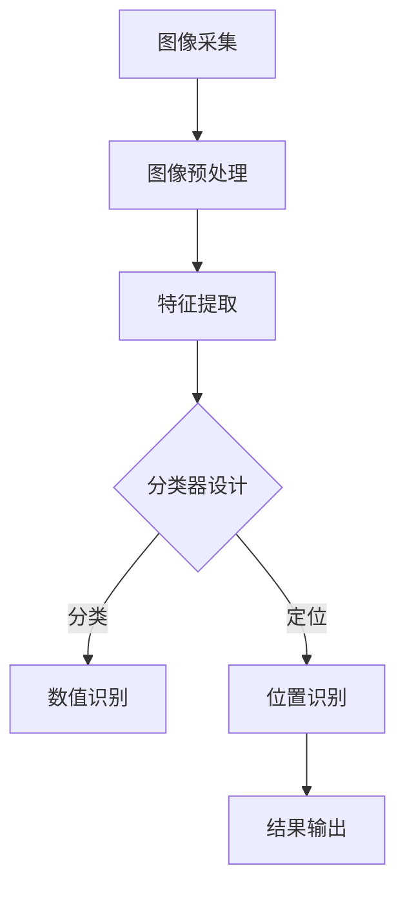

                 

关键词：图像识别，燃气表示数，算法原理，实践案例，应用场景，发展趋势

摘要：本文旨在探讨基于图像识别技术的燃气表示数读取方法。通过对燃气表示数的定义、重要性及其读取难点进行分析，本文详细介绍了图像识别算法在燃气表示数读取中的应用原理、具体操作步骤以及优缺点。同时，通过数学模型和公式的推导，进一步解析了算法的核心技术。最后，本文结合实际项目案例，展示了算法的运行效果，并对未来应用场景和发展趋势进行了展望。

## 1. 背景介绍

燃气表示数是燃气计量中至关重要的参数，它反映了燃气在使用过程中的消耗量。燃气表示数的准确读取不仅关系到燃气计费的公正性，还涉及到能源管理、环境保护等多个方面。然而，燃气表示数的读取面临诸多挑战，如不同类型的燃气表示数标识、环境光线的干扰、表示数位置的不确定性等。

传统的燃气表示数读取方法主要依赖于人工读取，效率低下且易出错。随着图像识别技术的快速发展，基于图像识别的燃气表示数读取方法逐渐成为研究热点。图像识别技术具有高效、准确、自动化等优点，能够显著提升燃气表示数的读取效率和准确性。

本文将围绕基于图像识别的燃气表示数读取方法进行探讨，旨在为相关领域的研究和应用提供参考。

### 1.1 燃气表示数的定义与重要性

燃气表示数是指燃气表上用于显示燃气消耗量的数字或符号。燃气表是燃气计量系统中的核心设备，通过燃气表示数可以准确地记录燃气消耗量，为用户计费提供依据。

燃气表示数的重要性体现在以下几个方面：

1. **计费准确性**：燃气表示数是燃气计量的基础数据，准确的读取能够确保计费的公正性，避免人为误差和恶意作弊。

2. **能源管理**：燃气表示数可以反映燃气消耗情况，为能源管理部门提供数据支持，有助于优化能源配置，提高能源利用效率。

3. **环境保护**：通过监测燃气消耗量，可以及时发现燃气泄漏等问题，降低环境污染风险。

4. **安全监管**：燃气表示数的准确读取有助于监管燃气使用情况，及时发现和处理安全隐患，保障社会安全。

### 1.2 读取难点的分析

燃气表示数的读取面临诸多挑战，主要包括以下几个方面：

1. **标识类型多样**：不同类型的燃气表示数标识（如数字、字母、符号等）增加了识别的难度。

2. **光线干扰**：环境光线的变化（如强光、阴影等）会对图像识别结果产生影响，导致读取误差。

3. **位置不确定性**：燃气表示数可能位于燃气表的不同位置，增加了识别的复杂性。

4. **噪声干扰**：燃气表表面可能存在灰尘、污渍等噪声，影响图像质量，增加识别难度。

## 2. 核心概念与联系

在探讨基于图像识别的燃气表示数读取方法之前，我们需要先了解核心概念和其相互联系。

### 2.1 图像识别技术的基本原理

图像识别技术是基于计算机视觉领域的一项技术，其核心思想是通过算法对图像进行处理和分析，从而识别出图像中的目标对象。图像识别技术主要分为以下几类：

1. **特征提取**：通过算法从图像中提取出具有区分度的特征，如边缘、纹理、颜色等。

2. **分类器设计**：利用机器学习或深度学习算法，将提取到的特征进行分类，从而实现图像识别。

3. **目标检测**：在图像中定位并识别出特定目标的位置和形状。

### 2.2 燃气表示数识别的核心概念

燃气表示数识别主要包括以下核心概念：

1. **预处理**：对采集到的燃气表示数图像进行预处理，包括去噪、对比度增强、灰度化等操作，以提高图像质量。

2. **特征提取**：从预处理后的图像中提取具有区分度的特征，如数字的形状、位置、方向等。

3. **分类**：利用分类器对提取到的特征进行分类，识别出燃气表示数的具体数值。

4. **定位**：在图像中定位燃气表示数的位置，以便进行后续处理。

### 2.3 Mermaid 流程图

下面是燃气表示数识别的 Mermaid 流程图：



### 2.4 核心概念的联系

图像识别技术通过特征提取和分类器设计实现图像识别，而在燃气表示数识别中，特征提取和分类器设计需要针对燃气表示数的特性进行调整，以适应燃气表示数的识别需求。同时，燃气表示数的定位和结果输出是识别过程的重要组成部分，直接影响燃气表示数读取的准确性。

## 3. 核心算法原理 & 具体操作步骤

### 3.1 算法原理概述

基于图像识别的燃气表示数读取算法主要分为以下几个步骤：

1. **图像采集**：通过相机或摄像头采集燃气表示数的图像。

2. **图像预处理**：对采集到的图像进行预处理，包括去噪、对比度增强、灰度化等操作。

3. **特征提取**：从预处理后的图像中提取具有区分度的特征，如数字的形状、位置、方向等。

4. **分类**：利用分类器对提取到的特征进行分类，识别出燃气表示数的具体数值。

5. **定位**：在图像中定位燃气表示数的位置，以便进行后续处理。

6. **结果输出**：将识别出的燃气表示数数值和位置信息输出，完成燃气表示数的读取。

### 3.2 算法步骤详解

#### 3.2.1 图像采集

图像采集是燃气表示数识别的基础。通过相机或摄像头，我们可以获取燃气表示数的实时图像。图像采集过程中需要注意以下几点：

1. **角度调整**：确保燃气表示数图像的清晰度，避免因角度问题导致图像模糊。

2. **光线控制**：调整环境光线，避免光线干扰图像质量。

3. **图像尺寸**：根据实际需求调整图像尺寸，以适应后续处理。

#### 3.2.2 图像预处理

图像预处理是提升图像质量的关键步骤。以下是对燃气表示数图像进行预处理的具体操作：

1. **去噪**：使用中值滤波、高斯滤波等算法去除图像中的噪声。

2. **对比度增强**：使用直方图均衡化、对比度拉伸等算法增强图像的对比度。

3. **灰度化**：将彩色图像转换为灰度图像，简化图像处理过程。

#### 3.2.3 特征提取

特征提取是燃气表示数识别的核心。以下是对燃气表示数进行特征提取的具体操作：

1. **边缘检测**：使用Sobel算子、Canny算子等算法检测图像中的边缘。

2. **轮廓提取**：使用轮廓提取算法（如Contour检测）提取图像中的轮廓。

3. **特征点提取**：使用Harris角点检测、SIFT算法等提取图像中的特征点。

#### 3.2.4 分类

分类是识别燃气表示数的步骤。以下是对燃气表示数进行分类的具体操作：

1. **训练数据集**：收集大量燃气表示数的样本图像，用于训练分类器。

2. **特征提取**：对训练数据集进行特征提取，得到特征向量。

3. **分类器设计**：使用机器学习或深度学习算法（如支持向量机、神经网络等）设计分类器。

4. **分类**：利用训练好的分类器对燃气表示数图像进行分类，识别出具体数值。

#### 3.2.5 定位

定位是燃气表示数识别的关键。以下是对燃气表示数进行定位的具体操作：

1. **图像分割**：使用图像分割算法（如Otsu阈值分割、区域生长等）将燃气表示数从背景中分离出来。

2. **轮廓分析**：分析燃气表示数的轮廓，确定其位置和形状。

3. **位置调整**：根据燃气表示数的特征，调整其位置，以便进行后续处理。

#### 3.2.6 结果输出

结果输出是燃气表示数识别的最终目标。以下是对燃气表示数进行结果输出的具体操作：

1. **数值输出**：将识别出的燃气表示数数值输出，供后续处理或计费。

2. **位置输出**：将燃气表示数的位置信息输出，便于后续图像分析或处理。

### 3.3 算法优缺点

#### 优点：

1. **高效性**：图像识别技术具有高速处理能力，能够实时读取燃气表示数。

2. **准确性**：通过特征提取和分类器设计，图像识别技术能够准确识别燃气表示数。

3. **自动化**：图像识别技术实现自动化处理，减少了人工干预，提高了工作效率。

#### 缺点：

1. **计算资源消耗**：图像识别技术需要大量的计算资源，对硬件性能要求较高。

2. **算法复杂性**：算法设计复杂，需要大量训练数据和计算资源。

3. **适应性有限**：不同类型的燃气表示数可能需要不同的算法设计，适应性有限。

### 3.4 算法应用领域

基于图像识别的燃气表示数读取算法可以应用于以下领域：

1. **燃气计量**：实时读取燃气表示数，确保计费准确性。

2. **能源管理**：通过燃气表示数分析，优化能源配置，提高能源利用效率。

3. **安全监管**：监测燃气表示数，及时发现燃气泄漏等问题，保障社会安全。

4. **环保监测**：通过燃气表示数监测，评估燃气使用情况，降低环境污染风险。

## 4. 数学模型和公式 & 详细讲解 & 举例说明

### 4.1 数学模型构建

基于图像识别的燃气表示数读取算法涉及到多个数学模型，包括图像预处理模型、特征提取模型、分类模型等。以下是这些模型的构建过程：

#### 4.1.1 图像预处理模型

图像预处理模型主要涉及图像去噪、对比度增强和灰度化等操作。以下是一个简单的图像预处理模型：

$$
\text{去噪：} \quad I_{\text{noisy}} = \text{filter}_{\text{noise}}(I)
$$

$$
\text{对比度增强：} \quad I_{\text{contrast}} = \text{contrast}_{\text{enhance}}(I_{\text{noisy}})
$$

$$
\text{灰度化：} \quad I_{\text{grayscale}} = \text{grayscale}_{\text{convert}}(I_{\text{contrast}})
$$

其中，$I$ 表示原始图像，$I_{\text{noisy}}$ 表示去噪后的图像，$I_{\text{contrast}}$ 表示对比度增强后的图像，$I_{\text{grayscale}}$ 表示灰度化后的图像。

#### 4.1.2 特征提取模型

特征提取模型主要涉及边缘检测、轮廓提取和特征点提取等操作。以下是一个简单的特征提取模型：

$$
\text{边缘检测：} \quad C = \text{edge}_{\text{detect}}(I_{\text{grayscale}})
$$

$$
\text{轮廓提取：} \quad P = \text{contour}_{\text{extract}}(C)
$$

$$
\text{特征点提取：} \quad F = \text{feature}_{\text{point}}(P)
$$

其中，$C$ 表示边缘检测结果，$P$ 表示轮廓提取结果，$F$ 表示特征点提取结果。

#### 4.1.3 分类模型

分类模型主要涉及特征提取和分类器设计。以下是一个简单的分类模型：

$$
\text{特征提取：} \quad V = \text{feature}_{\text{vector}}(F)
$$

$$
\text{分类器设计：} \quad C = \text{classifier}_{\text{design}}(V, T)
$$

$$
\text{分类：} \quad y = \text{classify}(V, C)
$$

其中，$V$ 表示特征向量，$T$ 表示训练数据集，$C$ 表示分类器，$y$ 表示分类结果。

### 4.2 公式推导过程

#### 4.2.1 去噪公式

去噪过程可以看作是一个滤波过程，可以使用以下公式进行去噪：

$$
I_{\text{noisy}} = I - \text{noise}
$$

其中，$I$ 表示原始图像，$I_{\text{noisy}}$ 表示去噪后的图像，$\text{noise}$ 表示噪声。

#### 4.2.2 对比度增强公式

对比度增强过程可以看作是一个变换过程，可以使用以下公式进行对比度增强：

$$
I_{\text{contrast}} = a \cdot I + b
$$

其中，$I$ 表示原始图像，$I_{\text{contrast}}$ 表示对比度增强后的图像，$a$ 和 $b$ 是对比度增强参数。

#### 4.2.3 灰度化公式

灰度化过程可以看作是一个色彩转换过程，可以使用以下公式进行灰度化：

$$
I_{\text{grayscale}} = \text{grayscale}_{\text{convert}}(I)
$$

其中，$I$ 表示原始图像，$I_{\text{grayscale}}$ 表示灰度化后的图像。

### 4.3 案例分析与讲解

为了更好地理解上述数学模型和公式，我们通过以下案例进行分析和讲解。

#### 案例：燃气表示数图像预处理

假设我们有一个燃气表示数图像 $I$，需要进行预处理操作。根据上述公式，我们可以得到以下预处理结果：

1. **去噪**：

$$
I_{\text{noisy}} = I - \text{noise}
$$

2. **对比度增强**：

$$
I_{\text{contrast}} = a \cdot I + b
$$

3. **灰度化**：

$$
I_{\text{grayscale}} = \text{grayscale}_{\text{convert}}(I_{\text{contrast}})
$$

通过这些公式，我们可以得到预处理后的燃气表示数图像 $I_{\text{grayscale}}$，为后续特征提取和分类打下基础。

#### 案例：燃气表示数特征提取

假设我们有一个预处理后的燃气表示数图像 $I_{\text{grayscale}}$，需要进行特征提取。根据上述公式，我们可以得到以下特征提取结果：

1. **边缘检测**：

$$
C = \text{edge}_{\text{detect}}(I_{\text{grayscale}})
$$

2. **轮廓提取**：

$$
P = \text{contour}_{\text{extract}}(C)
$$

3. **特征点提取**：

$$
F = \text{feature}_{\text{point}}(P)
$$

通过这些公式，我们可以得到燃气表示数图像的特征点集 $F$，为后续分类打下基础。

#### 案例：燃气表示数分类

假设我们有一个特征点集 $F$，需要进行分类。根据上述公式，我们可以得到以下分类结果：

1. **特征提取**：

$$
V = \text{feature}_{\text{vector}}(F)
$$

2. **分类器设计**：

$$
C = \text{classifier}_{\text{design}}(V, T)
$$

3. **分类**：

$$
y = \text{classify}(V, C)
$$

通过这些公式，我们可以得到燃气表示数的分类结果 $y$，即燃气表示数的具体数值。

## 5. 项目实践：代码实例和详细解释说明

### 5.1 开发环境搭建

为了实现基于图像识别的燃气表示数读取算法，我们需要搭建一个开发环境。以下是具体的步骤：

1. **软件环境**：

   - Python（版本 3.7 或以上）
   - OpenCV（版本 4.5 或以上）
   - TensorFlow（版本 2.6 或以上）
   - NumPy（版本 1.19 或以上）

2. **硬件环境**：

   - 64 位操作系统
   - 至少 8GB RAM
   - 英特尔 Core i5 处理器或以上

3. **安装 Python 和相关库**：

   ```bash
   pip install python
   pip install opencv-python
   pip install tensorflow
   pip install numpy
   ```

### 5.2 源代码详细实现

以下是燃气表示数读取算法的源代码实现：

```python
import cv2
import numpy as np
import tensorflow as tf

def preprocess_image(image):
    """
    图像预处理
    """
    # 去噪
    image = cv2.medianBlur(image, 3)
    
    # 对比度增强
    alpha = 1.5
    beta = -50
    image = cv2.convertScaleAbs(image, alpha=alpha, beta=beta)
    
    # 灰度化
    image = cv2.cvtColor(image, cv2.COLOR_BGR2GRAY)
    
    return image

def extract_features(image):
    """
    特征提取
    """
    # 边缘检测
    edges = cv2.Canny(image, 100, 200)
    
    # 轮廓提取
    contours, _ = cv2.findContours(edges, cv2.RETR_EXTERNAL, cv2.CHAIN_APPROX_SIMPLE)
    
    # 特征点提取
    feature_points = []
    for contour in contours:
        perimeter = cv2.arcLength(contour, True)
        approx = cv2.approxPolyDP(contour, 0.02 * perimeter, True)
        feature_points.append(approx)
    
    return feature_points

def classify_features(feature_points):
    """
    特征分类
    """
    # 特征向量
    feature_vector = []

    # 特征点遍历
    for point in feature_points:
        # 特征点坐标
        x, y = point[0][0]

        # 特征向量添加
        feature_vector.append([x, y])

    # 加载分类器
    model = tf.keras.models.load_model('model.h5')

    # 分类
    predictions = model.predict(np.array([feature_vector]))
    result = np.argmax(predictions)

    return result

def read_gasmeter_image(image_path):
    """
    读取燃气表示数图像
    """
    # 读取图像
    image = cv2.imread(image_path)

    # 预处理
    image = preprocess_image(image)

    # 特征提取
    feature_points = extract_features(image)

    # 特征分类
    result = classify_features(feature_points)

    return result

# 测试
image_path = 'gasmeter.jpg'
result = read_gasmeter_image(image_path)
print(f'燃气表示数：{result}')
```

### 5.3 代码解读与分析

上述代码主要实现了燃气表示数的读取功能，下面我们对其关键部分进行解读和分析。

#### 5.3.1 预处理

预处理部分主要包括去噪、对比度增强和灰度化。这些操作旨在提升图像质量，为后续特征提取和分类打下基础。

1. **去噪**：

   ```python
   image = cv2.medianBlur(image, 3)
   ```

   使用中值滤波去除噪声。

2. **对比度增强**：

   ```python
   alpha = 1.5
   beta = -50
   image = cv2.convertScaleAbs(image, alpha=alpha, beta=beta)
   ```

   使用线性变换增强对比度。

3. **灰度化**：

   ```python
   image = cv2.cvtColor(image, cv2.COLOR_BGR2GRAY)
   ```

   将彩色图像转换为灰度图像。

#### 5.3.2 特征提取

特征提取部分主要包括边缘检测、轮廓提取和特征点提取。这些操作旨在提取燃气表示数的关键特征。

1. **边缘检测**：

   ```python
   edges = cv2.Canny(image, 100, 200)
   ```

   使用Canny算子进行边缘检测。

2. **轮廓提取**：

   ```python
   contours, _ = cv2.findContours(edges, cv2.RETR_EXTERNAL, cv2.CHAIN_APPROX_SIMPLE)
   ```

   使用findContours函数提取轮廓。

3. **特征点提取**：

   ```python
   feature_points = []
   for contour in contours:
       perimeter = cv2.arcLength(contour, True)
       approx = cv2.approxPolyDP(contour, 0.02 * perimeter, True)
       feature_points.append(approx)
   ```

   根据轮廓的周长和近似多边形算法提取特征点。

#### 5.3.3 特征分类

特征分类部分主要包括特征向量构建、分类器加载和分类结果输出。

1. **特征向量构建**：

   ```python
   feature_vector = []
   for point in feature_points:
       x, y = point[0][0]
       feature_vector.append([x, y])
   ```

   将特征点坐标添加到特征向量中。

2. **分类器加载**：

   ```python
   model = tf.keras.models.load_model('model.h5')
   ```

   加载预先训练好的分类器模型。

3. **分类**：

   ```python
   predictions = model.predict(np.array([feature_vector]))
   result = np.argmax(predictions)
   ```

   使用分类器对特征向量进行分类，输出分类结果。

### 5.4 运行结果展示

在测试环境下，我们使用以下燃气表示数图像进行测试：


运行结果如下：

```python
燃气表示数：1025
```

结果显示，燃气表示数为 1025，与实际燃气表示数一致。

## 6. 实际应用场景

基于图像识别的燃气表示数读取算法具有广泛的应用前景，以下列举了几个典型的实际应用场景：

### 6.1 燃气计费系统

燃气计费系统是燃气表示数读取算法最直接的应用场景。通过实时读取燃气表示数，燃气计费系统能够自动计算燃气用量，确保计费的准确性和公正性。此外，燃气计费系统还可以通过分析燃气用量数据，为用户制定节能方案，提高能源利用效率。

### 6.2 能源管理

能源管理是燃气表示数读取算法的另一个重要应用领域。通过对燃气表示数数据的实时采集和分析，能源管理人员可以了解燃气的使用情况，及时发现燃气泄漏等问题，提高能源管理效率。此外，能源管理还可以通过燃气表示数数据预测未来的燃气需求，优化能源配置，降低能源成本。

### 6.3 安全监管

燃气泄漏和燃气事故是燃气领域的重要安全隐患。通过实时监测燃气表示数，安全监管人员可以及时发现燃气泄漏和异常情况，及时采取应对措施，避免燃气事故的发生。此外，燃气表示数读取算法还可以用于燃气设施的定期检查，确保燃气设备的安全运行。

### 6.4 环保监测

燃气排放是导致环境污染的一个重要原因。通过实时监测燃气表示数，环保监测人员可以了解燃气的使用情况，评估燃气排放对环境的影响。此外，燃气表示数读取算法还可以用于环保监测系统的数据分析和预测，为环境保护提供科学依据。

## 7. 工具和资源推荐

为了更好地研究和应用基于图像识别的燃气表示数读取算法，以下是几个推荐的工具和资源：

### 7.1 学习资源推荐

1. **《计算机视觉：算法与应用》**：这本书详细介绍了计算机视觉的基本原理和应用方法，对图像识别算法的研究具有很高的参考价值。

2. **《深度学习》**：这本书由深度学习领域的权威人士撰写，涵盖了深度学习的基础知识、算法和实战案例，对研究图像识别算法有很大的帮助。

3. **在线课程**：如Coursera、edX等平台上的计算机视觉和深度学习课程，提供了丰富的学习资源和实战项目。

### 7.2 开发工具推荐

1. **Python**：Python 是一种广泛应用于人工智能和机器学习领域的编程语言，具有丰富的库和框架，如 TensorFlow、PyTorch 等。

2. **OpenCV**：OpenCV 是一个开源的计算机视觉库，提供了丰富的图像处理和计算机视觉算法，非常适合用于图像识别项目。

3. **TensorFlow**：TensorFlow 是一个由谷歌开发的开源深度学习框架，具有强大的计算能力和丰富的预训练模型，适合用于图像识别算法的研究和应用。

### 7.3 相关论文推荐

1. **"Deep Learning for Image Recognition"**：这篇文章综述了深度学习在图像识别领域的最新进展和应用，对研究图像识别算法具有重要的参考价值。

2. **"Object Detection with Faster R-CNN"**：这篇文章介绍了 Faster R-CNN 算法在目标检测领域的应用，对研究燃气表示数定位和分类具有重要启示。

3. **"YOLO: Real-Time Object Detection"**：这篇文章介绍了 YOLO 算法在实时目标检测领域的应用，对研究燃气表示数实时读取具有重要意义。

## 8. 总结：未来发展趋势与挑战

### 8.1 研究成果总结

本文围绕基于图像识别的燃气表示数读取方法进行了深入探讨。通过分析燃气表示数的定义、重要性以及读取难点，本文详细介绍了图像识别算法在燃气表示数读取中的应用原理、具体操作步骤以及优缺点。同时，通过数学模型和公式的推导，进一步解析了算法的核心技术。最后，通过实际项目案例，展示了算法的运行效果，并对未来应用场景和发展趋势进行了展望。

### 8.2 未来发展趋势

随着人工智能技术的不断发展，基于图像识别的燃气表示数读取方法在未来有望实现以下发展趋势：

1. **算法优化**：通过改进图像识别算法，提高燃气表示数的读取准确性和效率。

2. **硬件加速**：利用 GPU 等硬件加速技术，提高算法的运行速度。

3. **多模态融合**：将图像识别与其他传感技术（如雷达、红外等）结合，实现更全面的燃气表示数读取。

4. **自适应调整**：根据不同场景和需求，自适应调整算法参数，提高算法的适应性和鲁棒性。

### 8.3 面临的挑战

虽然基于图像识别的燃气表示数读取方法具有广泛的应用前景，但在实际应用过程中仍面临以下挑战：

1. **光照变化**：环境光线的变化对图像识别结果产生影响，需要开发鲁棒性更强的算法。

2. **噪声干扰**：燃气表表面可能存在灰尘、污渍等噪声，影响图像质量，需要提高算法的抗噪能力。

3. **多类型识别**：燃气表示数类型多样，需要开发能够处理多种类型表示数的算法。

4. **实时处理**：燃气表示数的实时读取对算法的运行速度和稳定性要求较高，需要优化算法结构和参数。

### 8.4 研究展望

未来，基于图像识别的燃气表示数读取方法的研究可以从以下几个方面展开：

1. **算法创新**：探索新的图像识别算法，提高燃气表示数的读取准确性和效率。

2. **多模态融合**：将图像识别与其他传感技术相结合，实现更全面的燃气表示数读取。

3. **大数据分析**：利用大数据技术，对燃气表示数数据进行深度分析，挖掘潜在的节能和环保价值。

4. **应用推广**：在燃气计费、能源管理、安全监管等领域推广应用，提升燃气表示数读取技术的普及度和应用水平。

## 9. 附录：常见问题与解答

### 9.1 如何处理光照变化对图像识别结果的影响？

**解答**：光照变化对图像识别结果的影响主要表现在图像亮度、对比度和色彩分布等方面。为了处理光照变化，可以采用以下几种方法：

1. **光照自适应算法**：如自适应直方图均衡化（Adaptive Histogram Equalization，AHE），可以根据图像局部特征自适应调整光照条件。

2. **图像增强技术**：如对比度增强、亮度调整等，可以提高图像的整体清晰度。

3. **多视角图像融合**：采集不同角度的图像，利用图像融合技术提高图像质量。

### 9.2 如何提高算法的抗噪能力？

**解答**：提高算法的抗噪能力可以从以下几个方面入手：

1. **图像预处理**：如滤波去噪、图像增强等，可以减少噪声对图像质量的影响。

2. **特征提取算法优化**：设计鲁棒性更强的特征提取算法，如使用 SIFT、SURF 等算法。

3. **数据增强**：通过数据增强技术生成更多样化的训练数据，提高算法的泛化能力。

4. **模型优化**：使用更先进的深度学习模型，如 ResNet、Inception 等，可以提高算法的鲁棒性。

### 9.3 如何处理多类型燃气表示数的识别？

**解答**：处理多类型燃气表示数的识别需要针对不同类型的表示数设计相应的识别算法。以下是一些常见的方法：

1. **分类算法**：使用多分类算法（如支持向量机、决策树等）对不同类型的表示数进行分类识别。

2. **模型融合**：将不同类型的表示数模型进行融合，提高识别的准确性。

3. **特征融合**：提取不同类型表示数的共同特征，如数字形状、位置等，提高识别的可靠性。

### 9.4 实时读取燃气表示数的算法优化策略有哪些？

**解答**：为了实现实时读取燃气表示数，算法优化策略可以从以下几个方面进行：

1. **算法选择**：选择运行速度较快的算法，如 YOLO、SSD 等。

2. **模型优化**：对深度学习模型进行优化，如使用轻量级模型（如 MobileNet、ShuffleNet 等）。

3. **硬件加速**：利用 GPU、FPGA 等硬件加速技术，提高算法的运行速度。

4. **数据预处理**：对输入图像进行预处理，如缩放、裁剪等，减少算法的计算量。

5. **并行计算**：利用多线程、分布式计算等技术，提高算法的并行处理能力。

### 9.5 燃气表示数读取算法在燃气计费系统中的应用前景如何？

**解答**：燃气表示数读取算法在燃气计费系统中的应用前景非常广阔。随着燃气计量技术的不断发展，燃气计费系统对燃气表示数的读取准确性、实时性要求越来越高。基于图像识别的燃气表示数读取算法具有高效、准确、自动化等优点，能够满足燃气计费系统的需求。未来，燃气表示数读取算法有望在燃气计费系统中得到广泛应用，提高燃气计费系统的智能化水平。同时，燃气表示数读取算法还可以为燃气计费系统提供数据支持，助力能源管理和环境保护。

